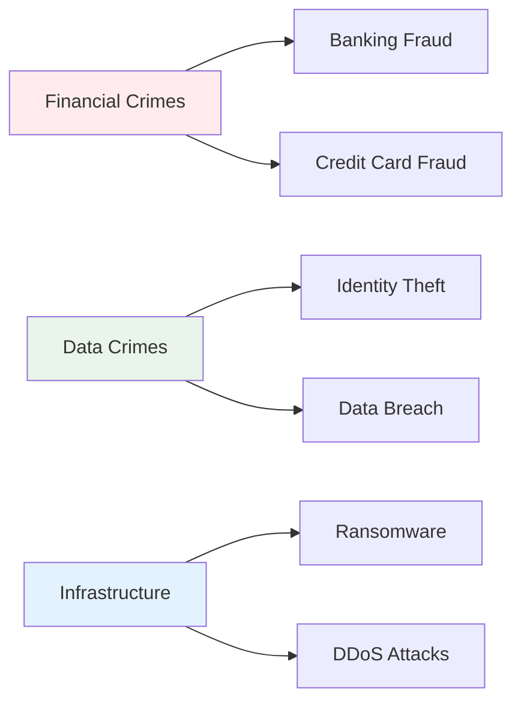

# Introduction to Cybercrime & Digital Forensics
## Unit V: Cybercrime & Digital Forensics
### Lecture 33: Digital Crime Investigation and Evidence Analysis

<div class="absolute bottom-5 left-5 text-xs text-gray-500">
Course: Cyber Security (4353204) | Semester V | Diploma ICT | Author: Milav Dabgar
</div>

---
layout: default
---

# Understanding Cybercrime

<div class="grid grid-cols-2 gap-8">

<div>

## 🕵️ What is Cybercrime?

**Cybercrime** refers to criminal activities that involve computers, networks, and digital technologies as either the target, tool, or venue for illegal activities.

### 📊 Cybercrime Statistics (2024)
- **Global cost**: $10.5 trillion annually
- **Attack frequency**: Every 11 seconds
- **Data breaches**: 5.6 billion records exposed
- **Ransomware damage**: $265 billion per year
- **Recovery time**: 287 days average
- **Success rate**: 95% of cyber attacks succeed initially

### 🎯 Cybercrime Categories


</div>

<div>

## 🎭 Types of Cybercriminals

### 💰 Financially Motivated
```yaml
Criminal Organizations:
  - Ransomware-as-a-Service (RaaS)
  - Banking trojans and fraud
  - Cryptocurrency theft
  - Business email compromise
  - Credit card skimming operations

Individual Criminals:
  - Online fraudsters
  - Identity thieves
  - Cryptocurrency scammers
  - Social engineering experts
  - Insider threats
```

### 🏴‍☠️ Ideologically Motivated
```yaml
Hacktivists:
  - Anonymous collective
  - Anti-government groups
  - Environmental activists
  - Social justice movements
  - Whistleblowing platforms

Cyber Terrorists:
  - Infrastructure targeting
  - Propaganda dissemination
  - Recruitment and training
  - Psychological warfare
  - Disruption campaigns
```

### 🏛️ State-Sponsored
```yaml
Nation-State Actors:
  - Advanced Persistent Threats (APTs)
  - Espionage and surveillance
  - Critical infrastructure attacks
  - Election interference
  - Intellectual property theft
```

</div>

</div>

<div class="absolute bottom-5 left-5 text-xs text-gray-500">
Course: Cyber Security (4353204) | Unit V | Lecture 33 | Author: Milav Dabgar
</div>

---
layout: default
---

# Digital Forensics Fundamentals

<div class="grid grid-cols-2 gap-8">

<div>

## 🔍 What is Digital Forensics?

**Digital forensics** is the scientific process of collecting, analyzing, and presenting digital evidence from computers, networks, and electronic devices to support legal proceedings.

### 📋 Core Principles
```yaml
Scientific Method:
  - Systematic approach
  - Reproducible procedures
  - Documented methodology
  - Peer review validation
  - Evidence-based conclusions

Legal Requirements:
  - Chain of custody maintenance
  - Evidence integrity preservation
  - Legal admissibility standards
  - Constitutional compliance
  - Professional ethics
```

### 🔄 Forensic Process Model
```yaml
Investigation Phases:
  1. Identification:
     - Incident recognition
     - Scope determination
     - Resource planning
     - Legal authorization

  2. Preservation:
     - Evidence isolation
     - Data acquisition
     - Integrity verification
     - Chain of custody

  3. Collection:
     - Systematic gathering
     - Documentation procedures
     - Metadata preservation
     - Witness interviews

  4. Examination:
     - Technical analysis
     - Data recovery
     - Pattern recognition
     - Timeline construction

  5. Analysis:
     - Evidence correlation
     - Hypothesis testing
     - Conclusion formation
     - Report preparation

  6. Presentation:
     - Expert testimony
     - Visual aids
     - Technical translation
     - Legal compliance
```

</div>

<div>

## 🛠️ Forensic Disciplines

### 💻 Computer Forensics
```yaml
Focus Areas:
  - Hard drive analysis
  - File system examination
  - Registry investigation
  - Deleted data recovery
  - Malware analysis
  - Timeline reconstruction

Common Tools:
  - EnCase Forensic
  - FTK (Forensic Toolkit)
  - Autopsy (open source)
  - X-Ways Forensics
  - SIFT Workstation
```

### 📱 Mobile Device Forensics
```yaml
Device Types:
  - Smartphones (iOS/Android)
  - Tablets and iPads
  - Smartwatches
  - GPS devices
  - IoT devices

Extraction Methods:
  - Logical extraction
  - Physical extraction
  - File system extraction
  - Chip-off analysis
  - JTAG/ISP methods
```

### 🌐 Network Forensics
```yaml
Network Evidence:
  - Packet captures (PCAP)
  - Log file analysis
  - Flow record examination
  - Protocol analysis
  - Intrusion detection alerts

Analysis Focus:
  - Attack vector identification
  - Data exfiltration detection
  - Lateral movement tracking
  - Command and control communication
  - Timeline reconstruction
```

### ☁️ Cloud Forensics
```yaml
Cloud Challenges:
  - Jurisdictional issues
  - Data location uncertainty
  - Shared infrastructure
  - Limited access rights
  - Volatile evidence

Investigation Areas:
  - Cloud service logs
  - API access records
  - Virtual machine images
  - Container forensics
  - Multi-tenancy analysis
```

</div>

</div>

<div class="absolute bottom-5 left-5 text-xs text-gray-500">
Course: Cyber Security (4353204) | Unit V | Lecture 33 | Author: Milav Dabgar
</div>

---
layout: default
---

# Legal Framework and Evidence

<div class="grid grid-cols-2 gap-8">

<div>

## ⚖️ Legal Foundations

### 🏛️ Cybercrime Laws (India)
```yaml
IT Act 2000 (Amended 2008):
  Section 43: Penalty for damage to computer
  Section 43A: Data protection compensation
  Section 66: Computer-related offenses
  Section 66A: Punishment for offensive messages
  Section 66B: Punishment for dishonestly receiving stolen computer resource
  Section 66C: Identity theft punishment
  Section 66D: Cheating by personation using computer
  Section 66E: Violation of privacy
  Section 66F: Cyber terrorism
  Section 67: Publishing obscene information
  Section 70: Protected system access

Indian Penal Code Sections:
  Section 420: Cheating and fraud
  Section 463-477A: Forgery
  Section 499-502: Defamation
  Section 503-506: Criminal intimidation
```

### 🌍 International Legal Framework
```yaml
Global Treaties:
  - Convention on Cybercrime (Budapest Convention)
  - UN Model Law on Electronic Commerce
  - Hague Evidence Convention
  - MLATs (Mutual Legal Assistance Treaties)

Regional Laws:
  - GDPR (General Data Protection Regulation)
  - CCPA (California Consumer Privacy Act)
  - PIPEDA (Personal Information Protection)
  - Data Protection Act 2018 (UK)
```

</div>

<div>

## 📜 Evidence Management

### 🔗 Chain of Custody
```yaml
Documentation Requirements:
  Who: Person handling evidence
  What: Description of evidence
  When: Date and time of handling
  Where: Location of evidence
  Why: Reason for handling
  How: Method of handling

Critical Elements:
  - Unique identification numbers
  - Digital signatures/hashes
  - Witness statements
  - Photography documentation
  - Storage conditions
  - Access logs
```

### 🛡️ Evidence Integrity
```python
# Hash calculation for evidence integrity
import hashlib

def calculate_file_hash(file_path, algorithm='sha256'):
    """Calculate cryptographic hash of file"""
    hasher = hashlib.new(algorithm)
    
    with open(file_path, 'rb') as f:
        for chunk in iter(lambda: f.read(4096), b""):
            hasher.update(chunk)
    
    return hasher.hexdigest()

# Evidence verification example
def verify_evidence_integrity(original_hash, current_file):
    """Verify evidence hasn't been tampered with"""
    current_hash = calculate_file_hash(current_file)
    
    if original_hash == current_hash:
        return "Evidence integrity verified"
    else:
        return "WARNING: Evidence may have been tampered with"

# Usage
evidence_file = "/evidence/hard_drive_image.dd"
original_hash = "a1b2c3d4e5f6789..."
integrity_status = verify_evidence_integrity(original_hash, evidence_file)
```

### 📋 Evidence Types
```yaml
Digital Evidence Categories:
  Volatile Evidence:
    - RAM contents
    - Network connections
    - Running processes
    - Temporary files
    - Cache data

  Non-Volatile Evidence:
    - Hard drive contents
    - System logs
    - Configuration files
    - User documents
    - Database records

  Network Evidence:
    - Packet captures
    - Flow records
    - Proxy logs
    - Firewall logs
    - IDS/IPS alerts
```

</div>

</div>

<div class="absolute bottom-5 left-5 text-xs text-gray-500">
Course: Cyber Security (4353204) | Unit V | Lecture 33 | Author: Milav Dabgar
</div>

---
layout: default
---

# Common Cybercrime Types

<div class="grid grid-cols-2 gap-8">

<div>

## 💳 Financial Cybercrime

### 💰 Banking and Financial Fraud
```yaml
Attack Methods:
  ATM Skimming:
    - Card reader overlays
    - PIN pad cameras
    - Bluetooth data transmission
    - Cloned card usage

  Online Banking Fraud:
    - Credential phishing
    - Man-in-the-browser attacks
    - Session hijacking
    - Transaction manipulation

  Credit Card Fraud:
    - Card-not-present fraud
    - Account takeover
    - New account fraud
    - Synthetic identity fraud

  Cryptocurrency Crimes:
    - Exchange hacks
    - Wallet theft
    - ICO scams
    - Mining malware
    - Money laundering
```

### 🏢 Business Email Compromise (BEC)
```yaml
BEC Attack Types:
  CEO Fraud:
    - Executive impersonation
    - Urgent wire transfers
    - Confidential transactions
    - Authority exploitation

  Invoice Fraud:
    - Vendor impersonation
    - Payment redirection
    - Account changes
    - Fake billing

  Payroll Diversion:
    - Employee impersonation
    - Direct deposit changes
    - HR system access
    - Personal information theft
```

</div>

<div>

## 🔒 Data and Privacy Crimes

### 🆔 Identity Theft
```yaml
Personal Information Targets:
  - Social Security Numbers
  - Credit card information
  - Banking account details
  - Driver's license data
  - Medical records
  - Employment information

Attack Vectors:
  - Data breach exploitation
  - Social engineering
  - Dumpster diving
  - Mail theft
  - Phishing campaigns
  - Insider threats
```

### 💾 Data Breaches
```yaml
Breach Categories:
  External Attacks:
    - Hacking and intrusion
    - Malware and ransomware
    - Social engineering
    - Physical theft

  Internal Threats:
    - Malicious insiders
    - Negligent employees
    - Privilege abuse
    - Data exfiltration

High-Profile Breaches:
  - Equifax (147 million records)
  - Yahoo (3 billion accounts)
  - Marriott (500 million guests)
  - Capital One (100 million customers)
  - Facebook (533 million users)
```

### 🔐 Ransomware Operations
```yaml
Ransomware Evolution:
  Traditional Ransomware:
    - File encryption
    - Ransom demand
    - Payment in cryptocurrency
    - Decryption key promise

  Double Extortion:
    - Data encryption + theft
    - Public exposure threat
    - Multiple ransom demands
    - Reputation damage

  Triple Extortion:
    - Victim encryption
    - Customer notification
    - DDoS attacks
    - Regulatory reporting
```

</div>

</div>

<div class="absolute bottom-5 left-5 text-xs text-gray-500">
Course: Cyber Security (4353204) | Unit V | Lecture 33 | Author: Milav Dabgar
</div>

---
layout: default
---

# Digital Investigation Process

<div class="grid grid-cols-2 gap-8">

<div>

## 🚨 Incident Response Integration

### 📞 First Response Procedures
```yaml
Immediate Actions:
  1. Incident Identification:
     - Anomaly detection
     - Alert validation
     - Scope assessment
     - Stakeholder notification

  2. Containment:
     - System isolation
     - Network segmentation
     - Service shutdown
     - Evidence preservation

  3. Evidence Preservation:
     - Memory capture
     - Disk imaging
     - Log collection
     - Network traces

  4. Legal Consultation:
     - Law enforcement contact
     - Legal counsel involvement
     - Regulatory notification
     - Insurance reporting
```

### 🔍 Investigation Initiation
```python
# Digital forensics investigation framework
class ForensicInvestigation:
    def __init__(self, case_id, investigator, incident_type):
        self.case_id = case_id
        self.investigator = investigator
        self.incident_type = incident_type
        self.evidence_items = []
        self.timeline = []
    
    def document_scene(self, description, photos, diagrams):
        """Document the digital crime scene"""
        scene_record = {
            'timestamp': datetime.now(),
            'description': description,
            'visual_evidence': photos,
            'network_diagrams': diagrams,
            'environmental_conditions': self.assess_environment()
        }
        return scene_record
    
    def identify_evidence(self, systems, networks, devices):
        """Identify potential sources of digital evidence"""
        evidence_sources = {
            'computer_systems': systems,
            'network_devices': networks,
            'mobile_devices': devices,
            'cloud_services': self.enumerate_cloud_resources(),
            'external_storage': self.find_external_media()
        }
        return evidence_sources
    
    def prioritize_collection(self, volatility, relevance, accessibility):
        """Prioritize evidence collection based on multiple factors"""
        priority_matrix = {
            'high_priority': [],  # Volatile + highly relevant
            'medium_priority': [],  # Stable + relevant
            'low_priority': []   # Stable + potentially relevant
        }
        return priority_matrix
```

</div>

<div>

## 🛠️ Forensic Tools and Techniques

### 💻 Imaging and Acquisition
```bash
# DD command for disk imaging
dd if=/dev/sda of=/evidence/disk_image.dd bs=512 conv=noerror,sync

# DC3DD - Enhanced DD with forensic features
dc3dd if=/dev/sda of=/evidence/disk_image.dd hash=sha256 log=/evidence/acquisition.log

# FTK Imager command line
ftkimager /dev/sda /evidence/disk_image --compress 6 --verify

# Verify image integrity
md5sum /evidence/disk_image.dd > /evidence/disk_image.md5
sha256sum /evidence/disk_image.dd > /evidence/disk_image.sha256
```

### 🔍 Analysis Tools
```yaml
Commercial Tools:
  EnCase Forensic:
    - Disk imaging and analysis
    - Registry examination
    - Email analysis
    - Timeline creation
    - Report generation

  Forensic Toolkit (FTK):
    - Data carving
    - Password cracking
    - Email analysis
    - Database examination
    - Mobile forensics

Open Source Tools:
  Autopsy:
    - Disk image analysis
    - File system examination
    - Keyword searching
    - Timeline analysis
    - Case management

  SIFT Workstation:
    - Linux-based toolkit
    - Multiple forensic tools
    - Log analysis
    - Network forensics
    - Memory analysis
```

### 📊 Analysis Methodologies
```yaml
File System Analysis:
  - Partition examination
  - File allocation table analysis
  - Deleted file recovery
  - Slack space examination
  - Alternate data streams

Registry Analysis (Windows):
  - System configuration
  - User activity tracking
  - Software installation
  - Network connections
  - USB device history

Log Analysis:
  - System event logs
  - Application logs
  - Security logs
  - Web server logs
  - Database logs
```

</div>

</div>

<div class="absolute bottom-5 left-5 text-xs text-gray-500">
Course: Cyber Security (4353204) | Unit V | Lecture 33 | Author: Milav Dabgar
</div>

---
layout: default
---

# Practical Exercise: Digital Crime Scene

<div class="exercise-container">

## 🎯 Forensic Investigation Simulation (35 minutes)

### Mission: Corporate Data Breach Investigation

A major financial services company **"SecureBank Corp"** has discovered unauthorized access to their customer database. Your forensic team must investigate this potential cybercrime.

### 🏦 Incident Scenario
**Initial Report:**
- **Suspicious database queries** detected during weekend hours
- **Customer complaints** about unauthorized transactions
- **System administrator** noticed unusual network traffic
- **Executive team** demands immediate investigation
- **Regulatory compliance** requirements (PCI DSS, SOX)
- **Media attention** and reputation concerns

### Phase 1: Investigation Planning and Scene Documentation (15 minutes)

**Team Task: Comprehensive Investigation Strategy**

1. **Legal and Procedural Framework**
   - Identify applicable cybercrime laws and regulations
   - Design evidence collection and chain of custody procedures
   - Plan stakeholder communication and reporting requirements
   - Create documentation and photography protocols

2. **Technical Investigation Scope**
   - Map potential evidence sources (servers, workstations, networks)
   - Prioritize evidence collection based on volatility and relevance
   - Design systematic examination procedures
   - Plan timeline reconstruction methodology

### Phase 2: Evidence Collection and Preservation (12 minutes)

**Forensic Data Acquisition:**
1. **Digital Evidence Sources**
   - Database server disk imaging procedures
   - Network device log collection
   - Workstation memory and disk acquisition
   - Email server and communication analysis

2. **Evidence Integrity and Documentation**
   - Hash calculation and verification procedures
   - Chain of custody form completion
   - Witness statement collection
   - Environmental condition documentation

### Phase 3: Initial Analysis and Reporting Framework (8 minutes)

**Investigation Analysis Structure:**
1. **Technical Analysis Planning**
   - File system and registry examination approach
   - Network traffic and log analysis methodology
   - Malware detection and reverse engineering procedures
   - Timeline construction and correlation techniques

2. **Legal Compliance and Reporting**
   - Evidence admissibility requirements
   - Expert witness testimony preparation
   - Regulatory notification procedures
   - Executive summary and technical report structure

**Deliverables:**
- Complete forensic investigation plan with legal compliance framework
- Evidence collection and preservation procedures
- Chain of custody documentation templates
- Initial analysis methodology and reporting structure

</div>

<style>
.exercise-container {
  @apply bg-red-50 border-2 border-red-300 rounded-lg p-6;
}
</style>

<div class="absolute bottom-5 left-5 text-xs text-gray-500">
Course: Cyber Security (4353204) | Unit V | Lecture 33 | Author: Milav Dabgar
</div>

---
layout: center
class: text-center
---

# Questions & Discussion

## 🤔 Investigation Considerations:
- How do you balance speed with thoroughness in cybercrime investigations?
- What are the key challenges in international cybercrime cases?
- How do you ensure digital evidence admissibility in court?

### 💡 Exercise Review
Present your forensic investigation strategies and discuss legal compliance approaches

<div class="absolute bottom-5 left-5 text-xs text-gray-500">
Course: Cyber Security (4353204) | Unit V | Lecture 33 | Author: Milav Dabgar
</div>

---
layout: center
class: text-center
---

# Thank You!

## Next Lecture: Computer and Network Forensics
### Deep Dive into Technical Investigation

<div class="pt-8 text-gray-500">
  <p>Cyber Security (4353204) - Lecture 33 Complete</p>
  <p>Digital forensics: Where technology meets justice! 🔍⚖️</p>
</div>

<div class="absolute bottom-5 left-5 text-xs text-gray-500">
Course: Cyber Security (4353204) | Unit V | Lecture 33 | Author: Milav Dabgar
</div>