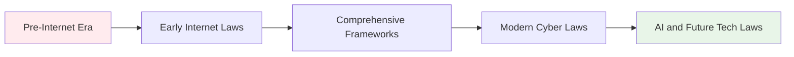

# Cyber Law and Legal Procedures
## Unit V: Cybercrime & Digital Forensics
### Lecture 36: Navigating the Legal Landscape of Cybercrime

<div class="absolute bottom-5 left-5 text-xs text-gray-500">
Course: Cyber Security (4353204) | Semester V | Diploma ICT | Author: Milav Dabgar
</div>

---
layout: default
---

# Cyber Law Fundamentals

<div class="grid grid-cols-2 gap-8">

<div>

## ⚖️ What is Cyber Law?

**Cyber law** encompasses all legal and regulatory aspects of internet and digital technology use, including privacy, data protection, cybercrime, and digital rights.

### 📊 Cyber Law Statistics (2024)
- **Global cybercrime costs**: $10.5 trillion annually
- **Cybercrime laws**: 189+ countries have legislation
- **Prosecution rate**: Only 0.05% of cybercriminals prosecuted
- **Cross-border cases**: 78% require international cooperation
- **Evidence admissibility**: 65% of digital evidence accepted
- **Legal expertise gap**: 90% of law enforcement needs training

### 🏛️ Legal Framework Evolution


### 🌍 Jurisdictional Challenges
```yaml
Jurisdictional Complexity:
  Geographic Boundaries:
    - Crime location vs server location
    - Victim location vs perpetrator location
    - Data storage locations
    - Service provider jurisdictions
    - Transit country involvement

  Legal System Differences:
    - Common law vs civil law systems
    - Evidence standards variations
    - Privacy law differences
    - Criminal procedure variations
    - Penalty and sentencing differences
```

</div>

<div>

## 🇮🇳 Indian Cyber Law Framework

### 📜 Information Technology Act 2000
```yaml
IT Act 2000 (Amended 2008):
  Key Provisions:
    Section 43: Penalty for damage to computer
      - Unauthorized access
      - Data download/copying
      - System damage or disruption
      - Penalty: Up to ₹1 crore

    Section 43A: Compensation for data protection failure
      - Corporate liability
      - Reasonable security practices
      - Data protection negligence
      - Compensation to affected persons

    Section 66: Hacking with computer system
      - Unauthorized access with intent
      - Criminal offense
      - Punishment: 3 years imprisonment + fine

    Section 66A: Punishment for sending offensive messages
      - False/offensive information
      - Causing annoyance/inconvenience
      - [Struck down by Supreme Court in 2015]

    Section 66B: Punishment for dishonestly receiving stolen computer resource
      - Receiving stolen digital property
      - Knowledge of theft required
      - 3 years imprisonment + fine

    Section 66C: Identity theft
      - Fraudulent use of electronic signature/password
      - Punishment: 3 years imprisonment + ₹1 lakh fine

    Section 66D: Cheating by personation using computer resource
      - Fraudulent impersonation online
      - 3 years imprisonment + ₹1 lakh fine

    Section 66E: Violation of privacy
      - Publishing private area images without consent
      - 3 years imprisonment + ₹2 lakh fine

    Section 66F: Cyber terrorism
      - Threatening national security
      - Punishment: Life imprisonment

    Section 67: Publishing obscene material
      - Electronic form obscenity
      - 3 years imprisonment + ₹5 lakh fine

    Section 70: Protected system access
      - Unauthorized access to protected systems
      - 10 years imprisonment + fine
```

### 🏛️ Other Relevant Indian Laws
```yaml
Indian Penal Code (IPC):
  Section 420: Cheating and dishonestly inducing delivery
  Section 463-477A: Forgery and related offenses
  Section 499-502: Defamation
  Section 503-506: Criminal intimidation

Code of Criminal Procedure (CrPC):
  Investigation procedures
  Search and seizure powers
  Evidence collection guidelines
  Arrest and custody provisions

Indian Evidence Act:
  Electronic evidence admissibility
  Digital signature validity
  Computer-generated evidence
  Expert testimony requirements
```

</div>

</div>

<div class="absolute bottom-5 left-5 text-xs text-gray-500">
Course: Cyber Security (4353204) | Unit V | Lecture 36 | Author: Milav Dabgar
</div>

---
layout: default
---

# International Cyber Law Framework

<div class="grid grid-cols-2 gap-8">

<div>

## 🌐 Global Cyber Law Treaties

### 🏛️ Budapest Convention on Cybercrime
```yaml
Council of Europe Convention (2001):
  Objectives:
    - Harmonize national cyber laws
    - Improve investigative techniques
    - Increase international cooperation
    - Address procedural issues

  Substantive Criminal Law:
    Article 2: Illegal access to computer systems
    Article 3: Illegal interception of data
    Article 4: Data interference (damage/deletion)
    Article 5: System interference (disruption)
    Article 6: Misuse of devices (hacking tools)
    Article 7: Computer-related forgery
    Article 8: Computer-related fraud
    Article 9: Child pornography offenses
    Article 10: Copyright infringement

  Procedural Powers:
    Article 16: Expedited preservation of stored data
    Article 17: Expedited preservation of traffic data
    Article 18: Production order for data
    Article 19: Search and seizure of stored data
    Article 20: Real-time collection of traffic data
    Article 21: Interception of content data

  International Cooperation:
    Article 23: General principles of cooperation
    Article 25: General principles of mutual assistance
    Article 27: Procedures for mutual assistance requests
    Article 29: Expedited preservation of stored data
    Article 30: Expedited disclosure of preserved data
```

### 🇺🇸 United States Cyber Law
```yaml
Key Federal Statutes:
  Computer Fraud and Abuse Act (CFAA):
    - Unauthorized computer access
    - Interstate commerce nexus
    - Federal jurisdiction
    - Civil and criminal penalties

  Electronic Communications Privacy Act (ECPA):
    - Wire communications interception
    - Stored communications access
    - Pen register and trap devices
    - Privacy protections

  Digital Millennium Copyright Act (DMCA):
    - Copyright infringement online
    - Safe harbor provisions
    - Notice and takedown procedures
    - Service provider liability

  Cybersecurity Information Sharing Act (CISA):
    - Information sharing framework
    - Liability protections
    - Privacy safeguards
    - Government coordination
```

</div>

<div>

## 🇪🇺 European Union Cyber Law

### 🛡️ General Data Protection Regulation (GDPR)
```yaml
GDPR Key Principles (2018):
  Lawfulness, Fairness, and Transparency:
    - Legal basis for processing
    - Clear privacy notices
    - Transparent data handling

  Purpose Limitation:
    - Specified purposes only
    - No further incompatible processing
    - Clear data collection reasons

  Data Minimization:
    - Adequate and relevant data only
    - Not excessive for purposes
    - Proportionate processing

  Accuracy:
    - Accurate and up-to-date data
    - Correction mechanisms
    - Deletion of inaccurate data

  Storage Limitation:
    - Retention period limits
    - Deletion requirements
    - Archive justifications

  Integrity and Confidentiality:
    - Appropriate security measures
    - Protection against unauthorized access
    - Data breach prevention

  Accountability:
    - Demonstrate compliance
    - Data protection by design
    - Impact assessments
```

### ⚡ Network and Information Systems Directive (NIS2)
```yaml
NIS2 Directive (2022):
  Scope Expansion:
    - Essential services operators
    - Digital service providers
    - Supply chain security
    - Cross-border cooperation

  Security Requirements:
    - Risk management measures
    - Incident reporting obligations
    - Business continuity planning
    - Supply chain security measures

  Supervision and Enforcement:
    - National competent authorities
    - Significant administrative fines
    - Regular audits and assessments
    - Cross-border cooperation mechanisms
```

### 🏛️ Cybersecurity Act
```yaml
EU Cybersecurity Act (2019):
  ENISA Permanent Mandate:
    - EU cybersecurity agency
    - Operational and policy support
    - Capacity building assistance
    - Situational awareness

  Cybersecurity Certification Framework:
    - EU-wide certification schemes
    - Mutual recognition
    - Security level classifications
    - Market confidence building
```

</div>

</div>

<div class="absolute bottom-5 left-5 text-xs text-gray-500">
Course: Cyber Security (4353204) | Unit V | Lecture 36 | Author: Milav Dabgar
</div>

---
layout: default
---

# Criminal Procedure in Cybercrime Cases

<div class="grid grid-cols-2 gap-8">

<div>

## 🚨 Investigation Procedures

### 🔍 First Information Report (FIR) in Cybercrime
```yaml
FIR Requirements for Cybercrime:
  Essential Information:
    - Nature of cybercrime
    - Digital evidence description
    - Time and location details
    - Victim and suspect information
    - Preliminary damage assessment

  Special Considerations:
    - Jurisdiction determination
    - Technical expertise requirement
    - Evidence preservation urgency
    - International cooperation needs
    - Service provider notifications

Online FIR Filing:
  - National Cyber Crime Reporting Portal
  - State police online systems
  - 24/7 availability
  - Anonymous reporting options
  - Status tracking facilities
```

### 🏛️ Search and Seizure in Digital Cases
```python
# Digital evidence seizure checklist
class DigitalEvidenceSeizure:
    def __init__(self, case_id, investigating_officer):
        self.case_id = case_id
        self.investigating_officer = investigating_officer
        self.seizure_log = []
        
    def pre_seizure_checklist(self):
        """Pre-seizure preparation checklist"""
        checklist = {
            'legal_authority': {
                'search_warrant_obtained': False,
                'warrant_scope_reviewed': False,
                'jurisdiction_confirmed': False,
                'legal_counsel_consulted': False
            },
            'technical_preparation': {
                'forensic_tools_prepared': False,
                'write_blockers_available': False,
                'storage_media_prepared': False,
                'documentation_materials': False
            },
            'personnel_requirements': {
                'technical_expert_present': False,
                'witness_available': False,
                'photographer_assigned': False,
                'chain_of_custody_officer': False
            }
        }
        
        return checklist
    
    def conduct_seizure(self, location, items_to_seize):
        """Conduct digital evidence seizure"""
        seizure_record = {
            'timestamp': datetime.now(),
            'location': location,
            'items_seized': [],
            'witnesses_present': [],
            'photographs_taken': [],
            'hash_values': {},
            'special_procedures': []
        }
        
        for item in items_to_seize:
            item_record = self.seize_digital_item(item)
            seizure_record['items_seized'].append(item_record)
        
        self.seizure_log.append(seizure_record)
        return seizure_record
    
    def seize_digital_item(self, item):
        """Seize individual digital evidence item"""
        item_record = {
            'item_description': item['description'],
            'serial_numbers': item.get('serial_numbers', []),
            'photographs': self.photograph_item(item),
            'power_state': self.check_power_state(item),
            'seizure_method': self.determine_seizure_method(item),
            'hash_verification': self.calculate_hash(item),
            'chain_of_custody': self.initiate_custody_chain(item)
        }
        
        return item_record
```

### 📋 Evidence Collection Standards
```yaml
Digital Evidence Best Practices:
  Documentation Requirements:
    - Detailed scene photography
    - Equipment serial numbers
    - Software versions used
    - Personnel present
    - Time and date stamps
    - Environmental conditions

  Technical Procedures:
    - Write-protection implementation
    - Hash value calculation
    - Bit-by-bit imaging
    - Chain of custody maintenance
    - Multiple evidence copies
    - Secure storage protocols

  Legal Compliance:
    - Warrant scope adherence
    - Privacy rights protection
    - Due process requirements
    - Constitutional compliance
    - International law considerations
```

</div>

<div>

## ⚖️ Prosecution and Court Proceedings

### 🏛️ Digital Evidence Admissibility
```yaml
Evidence Admissibility Criteria:
  Relevance:
    - Probative value assessment
    - Material fact connection
    - Case theory support
    - Prejudicial effect evaluation

  Reliability:
    - Source authentication
    - Chain of custody integrity
    - Technical accuracy verification
    - Expert witness testimony

  Legal Requirements:
    - Best Evidence Rule compliance
    - Hearsay exceptions application
    - Authentication requirements
    - Constitutional safeguards

Indian Evidence Act Provisions:
  Section 65B: Electronic Evidence
    - Certificate requirements
    - Computer operation conditions
    - Output accuracy certification
    - Custody chain documentation

  Section 67A: Digital signatures
    - Electronic signature validity
    - Certificate authority verification
    - Signature verification process
    - Legal presumptions
```

### 👨‍⚖️ Expert Witness Testimony
```yaml
Expert Witness Requirements:
  Qualifications:
    - Technical expertise demonstration
    - Professional certifications
    - Relevant experience
    - Educational background
    - Court recognition

  Testimony Standards:
    - Scientific method application
    - Peer review compliance
    - Error rate disclosure
    - General acceptance in field
    - Reliability assessment

  Presentation Guidelines:
    - Technical translation for jury
    - Visual aids utilization
    - Methodology explanation
    - Opinion basis clarification
    - Cross-examination preparation
```

### 📊 Cybercrime Prosecution Challenges
```python
# Prosecution challenge analysis framework
class CybercrimeProsecultion:
    def __init__(self):
        self.common_challenges = {
            'technical_complexity': {
                'challenge': 'Complex technical evidence',
                'solution': 'Expert witness testimony',
                'success_rate': 0.65
            },
            'jurisdiction_issues': {
                'challenge': 'Multi-jurisdictional cases',
                'solution': 'International cooperation',
                'success_rate': 0.45
            },
            'evidence_volatility': {
                'challenge': 'Digital evidence destruction',
                'solution': 'Rapid response teams',
                'success_rate': 0.70
            },
            'anonymity_tools': {
                'challenge': 'Perpetrator identification',
                'solution': 'Advanced investigation techniques',
                'success_rate': 0.35
            }
        }
    
    def analyze_case_challenges(self, case_details):
        """Analyze specific case challenges"""
        case_challenges = []
        
        for challenge_type, details in self.common_challenges.items():
            if self.challenge_applies(case_details, challenge_type):
                case_challenges.append({
                    'type': challenge_type,
                    'impact': details['challenge'],
                    'mitigation': details['solution'],
                    'probability_success': details['success_rate']
                })
        
        return case_challenges
    
    def recommend_prosecution_strategy(self, case_challenges):
        """Recommend prosecution strategy based on challenges"""
        strategy = {
            'evidence_strengthening': [],
            'expert_witnesses': [],
            'legal_precedents': [],
            'international_cooperation': []
        }
        
        for challenge in case_challenges:
            if challenge['type'] == 'technical_complexity':
                strategy['expert_witnesses'].append('Digital forensics expert')
                strategy['evidence_strengthening'].append('Simplified technical demonstrations')
            
            elif challenge['type'] == 'jurisdiction_issues':
                strategy['international_cooperation'].append('MLAT requests')
                strategy['legal_precedents'].append('Cross-border precedent research')
        
        return strategy
```

</div>

</div>

<div class="absolute bottom-5 left-5 text-xs text-gray-500">
Course: Cyber Security (4353204) | Unit V | Lecture 36 | Author: Milav Dabgar
</div>

---
layout: default
---

# Privacy Laws and Data Protection

<div class="grid grid-cols-2 gap-8">

<div>

## 🛡️ Privacy Rights in Digital Age

### 📜 Constitutional Privacy Rights
```yaml
Indian Constitutional Framework:
  Article 21: Right to Life and Personal Liberty
    - Privacy as fundamental right (K.S. Puttaswamy case)
    - Reasonable restriction doctrine
    - State action limitations
    - Due process requirements

  Puttaswamy Judgment (2017):
    - Privacy as natural right
    - Four-fold test for restrictions
    - Data protection principles
    - Surveillance limitations
    - Legislative framework requirement
```

### 📋 Personal Data Protection Bill (Proposed)
```yaml
Key Provisions:
  Data Principal Rights:
    - Right to confirmation and access
    - Right to correction and erasure
    - Right to data portability
    - Right to be forgotten
    - Right to consent withdrawal

  Data Fiduciary Obligations:
    - Lawful basis for processing
    - Purpose limitation principle
    - Data minimization requirements
    - Storage limitation periods
    - Security safeguards implementation

  Sensitive Personal Data:
    - Financial data protection
    - Health information security
    - Biometric data restrictions
    - Sexual orientation privacy
    - Religious belief protection

  Cross-border Data Transfer:
    - Adequacy assessment requirements
    - Standard contractual clauses
    - Binding corporate rules
    - Regulatory approval process
    - Critical personal data restrictions
```

### 🌐 International Privacy Standards
```yaml
Global Privacy Frameworks:
  GDPR Principles:
    - Consent requirements
    - Data subject rights
    - Controller obligations
    - Processor responsibilities
    - Cross-border transfer rules

  CCPA Requirements:
    - Consumer disclosure rights
    - Opt-out mechanisms
    - Non-discrimination provisions
    - Business obligations
    - Enforcement mechanisms

  PIPEDA Framework:
    - Privacy impact assessments
    - Breach notification requirements
    - Consent mechanisms
    - Individual access rights
    - Accountability principles
```

</div>

<div>

## 🚫 Cybercrime Prevention Laws

### 🛡️ Corporate Cybersecurity Obligations
```yaml
IT Act Section 43A Requirements:
  Reasonable Security Practices:
    - Comprehensive information security program
    - Administrative, technical, physical safeguards
    - Contractual obligations with third parties
    - Regular security assessments and audits
    - Employee training and awareness programs

  Data Protection Standards:
    - ISO 27001 compliance
    - Industry-specific standards
    - International best practices
    - Regular updates and reviews
    - Documentation requirements

  Breach Notification:
    - CERT-In reporting requirements
    - Affected individual notifications
    - Regulatory authority reporting
    - Timing requirements
    - Content specifications

  Penalties for Non-compliance:
    - Compensation to affected persons
    - Regulatory enforcement actions
    - Civil liability exposure
    - Criminal prosecution potential
    - Reputational damage consequences
```

### 🏛️ Government Surveillance Powers
```python
# Legal framework for government surveillance
class SurveillanceLegalFramework:
    def __init__(self):
        self.legal_authorities = {
            'it_act_69': {
                'power': 'Interception and monitoring',
                'authority': 'Central/State Government',
                'procedure': 'Written order with reasons',
                'review': 'Review Committee oversight',
                'duration': 'Specified period only'
            },
            'it_act_69a': {
                'power': 'Information blocking',
                'authority': 'Central Government',
                'procedure': 'Emergency provisions',
                'review': 'Post-facto review',
                'duration': 'Temporary measures'
            },
            'telegraph_act': {
                'power': 'Communication interception',
                'authority': 'Home Ministry',
                'procedure': 'Public emergency or safety',
                'review': 'Competent authority approval',
                'duration': 'Limited period'
            }
        }
    
    def assess_surveillance_legality(self, surveillance_request):
        """Assess legality of surveillance request"""
        legal_assessment = {
            'authority_valid': False,
            'procedure_followed': False,
            'proportionality_met': False,
            'oversight_available': False,
            'time_limited': False
        }
        
        # Check legal authority
        if surveillance_request['requesting_authority'] in ['central_govt', 'state_govt', 'law_enforcement']:
            legal_assessment['authority_valid'] = True
        
        # Check procedural requirements
        if all(req in surveillance_request for req in ['written_order', 'reasons', 'necessity']):
            legal_assessment['procedure_followed'] = True
        
        # Check proportionality
        if self.assess_proportionality(surveillance_request):
            legal_assessment['proportionality_met'] = True
        
        return legal_assessment
    
    def generate_privacy_impact_assessment(self, surveillance_measure):
        """Generate privacy impact assessment"""
        pia = {
            'data_types': surveillance_measure.get('data_types', []),
            'individuals_affected': surveillance_measure.get('scope', 'unknown'),
            'privacy_risks': self.identify_privacy_risks(surveillance_measure),
            'mitigation_measures': self.recommend_safeguards(surveillance_measure),
            'legal_basis': surveillance_measure.get('legal_authority'),
            'oversight_mechanisms': surveillance_measure.get('oversight', [])
        }
        
        return pia
```

### ⚖️ Balancing Security and Privacy
```yaml
Legal Balancing Tests:
  Proportionality Analysis:
    - Legitimate aim identification
    - Necessity assessment
    - Adequate relation evaluation
    - Less restrictive alternatives
    - Balance of interests

  Four-fold Test (Puttaswamy):
    1. Legality: Law must exist
    2. Legitimate goal: Must serve valid state interest
    3. Proportionality: Rational nexus required
    4. Procedural guarantees: Safeguards necessary

  Surveillance Safeguards:
    - Independent oversight mechanisms
    - Judicial review requirements
    - Time limitations on orders
    - Data minimization principles
    - Regular compliance audits

  International Standards:
    - European Court of Human Rights jurisprudence
    - UN Special Rapporteur guidelines
    - Democratic oversight principles
    - Transparency reporting requirements
    - International cooperation frameworks
```

</div>

</div>

<div class="absolute bottom-5 left-5 text-xs text-gray-500">
Course: Cyber Security (4353204) | Unit V | Lecture 36 | Author: Milav Dabgar
</div>

---
layout: default
---

# Practical Exercise: Legal Case Analysis

<div class="exercise-container">

## 🎯 Cybercrime Legal Case Study (35 minutes)

### Mission: Comprehensive Legal Analysis

Your legal team must analyze a complex cybercrime case involving **"DataBreach Corp"** where sensitive customer data was stolen and sold to competitors across international borders.

### ⚖️ Case Scenario
**Legal Complexity:**
- **Multi-jurisdictional crime** (India, USA, EU)
- **Corporate data breach** (2 million customers affected)
- **Insider threat** with international co-conspirators
- **Cross-border data transfers** and evidence
- **Multiple legal frameworks** applicable
- **Privacy law violations** under GDPR and Indian laws

### Phase 1: Legal Framework Analysis (15 minutes)

**Team Assignment: Multi-Jurisdictional Legal Strategy**

1. **Applicable Legal Frameworks**
   - Identify relevant Indian laws (IT Act, IPC, CrPC)
   - Analyze international treaties and conventions
   - Assess privacy law implications (GDPR, proposed Indian PDP Bill)
   - Evaluate corporate liability and regulatory requirements

2. **Jurisdictional and Procedural Issues**
   - Determine appropriate jurisdiction for prosecution
   - Plan international legal cooperation mechanisms (MLATs)
   - Design evidence collection procedures across borders
   - Create timeline for legal notifications and compliance

### Phase 2: Evidence and Investigation Legal Framework (12 minutes)

**Legal Compliance Strategy:**
1. **Digital Evidence Admissibility**
   - Plan evidence collection with legal admissibility standards
   - Design chain of custody procedures for international evidence
   - Create expert witness strategy for technical evidence
   - Develop authentication procedures for digital evidence

2. **Privacy and Constitutional Compliance**
   - Analyze privacy rights of affected individuals
   - Plan constitutional compliance for investigation procedures
   - Design data subject notification and rights procedures
   - Create regulatory reporting and compliance framework

### Phase 3: Prosecution Strategy and Civil Remedies (8 minutes)

**Comprehensive Legal Response:**
1. **Criminal Prosecution Framework**
   - Develop prosecution strategy across multiple jurisdictions
   - Plan international cooperation and evidence sharing
   - Create plea bargaining and cooperation agreements
   - Design victim impact and restitution procedures

2. **Civil Remedies and Regulatory Response**
   - Analyze corporate liability and damage assessment
   - Plan regulatory enforcement and compliance orders
   - Design victim compensation and remediation programs
   - Create corporate governance and compliance improvements

**Deliverables:**
- Multi-jurisdictional legal analysis and strategy framework
- Evidence admissibility and procedural compliance plan
- Criminal prosecution and civil remedy comprehensive strategy
- Regulatory compliance and corporate governance improvement plan

</div>

<style>
.exercise-container {
  @apply bg-amber-50 border-2 border-amber-300 rounded-lg p-6;
}
</style>

<div class="absolute bottom-5 left-5 text-xs text-gray-500">
Course: Cyber Security (4353204) | Unit V | Lecture 36 | Author: Milav Dabgar
</div>

---
layout: center
class: text-center
---

# Questions & Discussion

## 🤔 Legal Analysis Points:
- How do you handle conflicts between different national privacy laws?
- What are the challenges in prosecuting anonymous cybercriminals?
- How do you balance security investigations with constitutional privacy rights?

### 💡 Exercise Review
Present your legal analysis strategies and discuss multi-jurisdictional approaches

<div class="absolute bottom-5 left-5 text-xs text-gray-500">
Course: Cyber Security (4353204) | Unit V | Lecture 36 | Author: Milav Dabgar
</div>

---
layout: center
class: text-center
---

# Thank You!

## Next Lecture: Incident Response and Crisis Management
### Managing Cybersecurity Emergencies

<div class="pt-8 text-gray-500">
  <p>Cyber Security (4353204) - Lecture 36 Complete</p>
  <p>Cyber law: Where technology meets justice! ⚖️💻</p>
</div>

<div class="absolute bottom-5 left-5 text-xs text-gray-500">
Course: Cyber Security (4353204) | Unit V | Lecture 36 | Author: Milav Dabgar
</div>