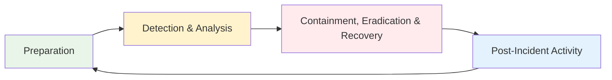

# Incident Response and Crisis Management
## Unit V: Cybercrime & Digital Forensics
### Lecture 37: Orchestrating Effective Cybersecurity Emergency Response

<div class="absolute bottom-5 left-5 text-xs text-gray-500">
Course: Cyber Security (4353204) | Semester V | Diploma ICT | Author: Milav Dabgar
</div>

---
layout: default
---

# Incident Response Fundamentals

<div class="grid grid-cols-2 gap-8">

<div>

## 🚨 What is Incident Response?

**Incident Response (IR)** is the organized approach to addressing and managing the aftermath of a security breach or cyberattack, with the goal of handling the situation in a way that limits damage and reduces recovery time and costs.

### 📊 Incident Response Statistics (2024)
- **Average breach detection time**: 287 days
- **Average containment time**: 80 days
- **Cost reduction with IR team**: 54% lower breach costs
- **Organizations with IR plan**: 77% have formal plans
- **Incident response testing**: Only 32% test regularly
- **Mean time to respond**: 16 hours for critical incidents

### 🎯 Incident Categories
```yaml
Security Incident Types:
  Network Attacks:
    - Denial of Service (DoS/DDoS)
    - Network intrusions
    - Man-in-the-middle attacks
    - DNS poisoning
    - Network scanning

  Malware Incidents:
    - Ransomware attacks
    - Trojan infections
    - Worm propagation
    - Rootkit installations
    - Advanced persistent threats

  Data Breaches:
    - Unauthorized data access
    - Data exfiltration
    - Identity theft
    - Privacy violations
    - Regulatory compliance breaches

  Insider Threats:
    - Malicious employees
    - Negligent insiders
    - Compromised accounts
    - Privilege abuse
    - Data misuse
```

</div>

<div>

## 🔄 Incident Response Lifecycle

### 📋 NIST Incident Response Framework


### 🏗️ Incident Response Team Structure
```yaml
Core Team Roles:
  Incident Response Manager:
    - Overall incident coordination
    - Decision-making authority
    - Stakeholder communication
    - Resource allocation
    - Timeline management

  Security Analysts:
    - Technical investigation
    - Evidence collection
    - Threat analysis
    - Tool operation
    - Documentation

  Forensics Specialists:
    - Digital evidence handling
    - Data recovery
    - Malware analysis
    - Timeline reconstruction
    - Legal compliance

  Communications Specialist:
    - Internal communications
    - External notifications
    - Media relations
    - Customer communications
    - Regulatory reporting

  Legal Counsel:
    - Legal implications assessment
    - Regulatory compliance
    - Law enforcement liaison
    - Litigation support
    - Privacy law compliance

Extended Team:
  - IT Operations
  - Network Engineers
  - System Administrators
  - Business Unit Representatives
  - Executive Leadership
  - External Consultants
```

</div>

</div>

<div class="absolute bottom-5 left-5 text-xs text-gray-500">
Course: Cyber Security (4353204) | Unit V | Lecture 37 | Author: Milav Dabgar
</div>

---
layout: default
---

# Preparation Phase

<div class="grid grid-cols-2 gap-8">

<div>

## 📋 Incident Response Planning

### 📝 Incident Response Plan Development
```python
# Incident Response Plan Framework
class IncidentResponsePlan:
    def __init__(self, organization_name):
        self.organization = organization_name
        self.plan_version = "1.0"
        self.last_updated = datetime.now()
        self.approval_status = "Draft"
        
    def create_ir_plan(self):
        """Create comprehensive incident response plan"""
        ir_plan = {
            'executive_summary': self.create_executive_summary(),
            'scope_and_objectives': self.define_scope_objectives(),
            'incident_classification': self.create_classification_scheme(),
            'team_structure': self.define_team_structure(),
            'communication_procedures': self.create_communication_plan(),
            'technical_procedures': self.define_technical_procedures(),
            'legal_considerations': self.address_legal_requirements(),
            'training_requirements': self.define_training_program(),
            'testing_procedures': self.create_testing_framework(),
            'continuous_improvement': self.establish_improvement_process()
        }
        
        return ir_plan
    
    def create_classification_scheme(self):
        """Create incident classification and prioritization scheme"""
        classification = {
            'severity_levels': {
                'Critical': {
                    'definition': 'Severe impact on business operations',
                    'response_time': '15 minutes',
                    'escalation': 'C-level executives',
                    'examples': ['Ransomware outbreak', 'Major data breach']
                },
                'High': {
                    'definition': 'Significant business impact',
                    'response_time': '1 hour',
                    'escalation': 'Department heads',
                    'examples': ['Network compromise', 'System unavailability']
                },
                'Medium': {
                    'definition': 'Moderate business impact',
                    'response_time': '4 hours',
                    'escalation': 'IT management',
                    'examples': ['Malware infection', 'Policy violations']
                },
                'Low': {
                    'definition': 'Minimal business impact',
                    'response_time': '24 hours',
                    'escalation': 'Security team',
                    'examples': ['Failed login attempts', 'Suspicious emails']
                }
            },
            'incident_types': {
                'security_breach': 'Unauthorized access to systems/data',
                'malware_infection': 'Malicious software compromise',
                'ddos_attack': 'Distributed denial of service',
                'data_loss': 'Accidental or malicious data destruction',
                'insider_threat': 'Malicious or negligent employee actions',
                'physical_security': 'Physical breach of facilities'
            }
        }
        
        return classification
    
    def create_communication_plan(self):
        """Create incident communication procedures"""
        communication_plan = {
            'internal_notifications': {
                'immediate_team': {
                    'method': 'Phone/SMS',
                    'timeframe': 'Within 15 minutes',
                    'recipients': ['IR Manager', 'Security Team', 'IT Operations']
                },
                'management': {
                    'method': 'Email/Conference call',
                    'timeframe': 'Within 1 hour',
                    'recipients': ['CISO', 'CTO', 'Legal Counsel']
                },
                'executives': {
                    'method': 'Direct briefing',
                    'timeframe': 'Within 2 hours',
                    'recipients': ['CEO', 'Board members']
                }
            },
            'external_notifications': {
                'law_enforcement': {
                    'trigger': 'Criminal activity suspected',
                    'timeframe': 'Within 24 hours',
                    'contacts': ['Local police', 'FBI cyber division']
                },
                'regulators': {
                    'trigger': 'Regulatory compliance breach',
                    'timeframe': 'Per regulatory requirements',
                    'contacts': ['Industry regulators', 'Data protection authorities']
                },
                'customers': {
                    'trigger': 'Customer data involved',
                    'timeframe': 'Within 72 hours',
                    'method': 'Email/website notification'
                }
            }
        }
        
        return communication_plan
```

### 🛠️ Tools and Technology Preparation
```yaml
Essential IR Tools:
  Detection and Monitoring:
    - SIEM (Security Information and Event Management)
    - Network monitoring tools
    - Endpoint detection and response (EDR)
    - Log analysis platforms
    - Threat intelligence feeds

  Investigation and Analysis:
    - Digital forensics toolkits
    - Memory analysis tools
    - Network packet analyzers
    - Malware analysis sandboxes
    - Timeline analysis tools

  Containment and Recovery:
    - Network isolation tools
    - System imaging software
    - Backup and recovery systems
    - Patch management tools
    - Configuration management

  Communication and Coordination:
    - Secure communication channels
    - Incident tracking systems
    - Documentation platforms
    - Video conferencing tools
    - Emergency contact systems
```

</div>

<div>

## 🎯 Team Training and Preparedness

### 📚 Training Program Development
```yaml
Training Components:
  Technical Skills:
    - Incident detection techniques
    - Forensic investigation methods
    - Malware analysis procedures
    - Network security analysis
    - Evidence handling protocols

  Procedural Knowledge:
    - Incident classification
    - Escalation procedures
    - Communication protocols
    - Documentation requirements
    - Legal compliance

  Soft Skills:
    - Crisis communication
    - Decision-making under pressure
    - Stakeholder management
    - Stress management
    - Teamwork and coordination

Training Methods:
  Classroom Training:
    - Theoretical foundations
    - Best practices review
    - Case study analysis
    - Tool demonstrations
    - Q&A sessions

  Hands-on Labs:
    - Simulated environments
    - Tool practice sessions
    - Evidence analysis exercises
    - Forensic investigations
    - Malware analysis

  Tabletop Exercises:
    - Scenario-based discussions
    - Decision-making practice
    - Communication testing
    - Process validation
    - Improvement identification

  Full-Scale Simulations:
    - Realistic attack scenarios
    - Complete response testing
    - Multi-team coordination
    - End-to-end validation
    - Performance measurement
```

### 🧪 Testing and Validation
```python
# Incident Response Testing Framework
class IRTestingFramework:
    def __init__(self):
        self.test_types = ['tabletop', 'walkthrough', 'functional', 'full_scale']
        self.test_results = []
        
    def design_tabletop_exercise(self, scenario):
        """Design tabletop exercise scenario"""
        exercise = {
            'scenario_name': scenario['name'],
            'scenario_description': scenario['description'],
            'learning_objectives': scenario['objectives'],
            'participants': self.identify_participants(scenario),
            'timeline': self.create_exercise_timeline(scenario),
            'discussion_points': self.create_discussion_points(scenario),
            'evaluation_criteria': self.define_evaluation_metrics(scenario)
        }
        
        return exercise
    
    def create_exercise_timeline(self, scenario):
        """Create exercise timeline with inject points"""
        timeline = {
            '00:00': 'Initial incident notification',
            '00:15': 'Team assembly and initial assessment',
            '00:30': 'First inject: Additional system compromise',
            '01:00': 'Containment decisions',
            '01:30': 'Second inject: Media inquiry',
            '02:00': 'Communication with stakeholders',
            '02:30': 'Third inject: Regulatory inquiry',
            '03:00': 'Recovery planning',
            '03:30': 'Lessons learned discussion'
        }
        
        return timeline
    
    def evaluate_response_performance(self, exercise_results):
        """Evaluate team performance during exercise"""
        evaluation = {
            'response_time': self.measure_response_times(exercise_results),
            'decision_quality': self.assess_decisions(exercise_results),
            'communication_effectiveness': self.evaluate_communications(exercise_results),
            'technical_competency': self.assess_technical_skills(exercise_results),
            'coordination': self.evaluate_teamwork(exercise_results),
            'areas_for_improvement': self.identify_gaps(exercise_results)
        }
        
        return evaluation
    
    def generate_improvement_plan(self, evaluation):
        """Generate improvement plan based on evaluation"""
        improvement_plan = {
            'immediate_actions': [],
            'short_term_goals': [],
            'long_term_initiatives': [],
            'resource_requirements': [],
            'timeline': {}
        }
        
        for area, score in evaluation.items():
            if score < 0.7:  # Threshold for improvement needed
                improvement_plan['immediate_actions'].append(
                    f"Address deficiencies in {area}"
                )
        
        return improvement_plan
```

</div>

</div>

<div class="absolute bottom-5 left-5 text-xs text-gray-500">
Course: Cyber Security (4353204) | Unit V | Lecture 37 | Author: Milav Dabgar
</div>

---
layout: default
---

# Detection and Analysis Phase

<div class="grid grid-cols-2 gap-8">

<div>

## 🔍 Incident Detection Methods

### 🚨 Detection Sources and Indicators
```yaml
Detection Sources:
  Automated Systems:
    - SIEM alerts and correlations
    - Intrusion Detection Systems (IDS)
    - Endpoint Detection and Response (EDR)
    - Network monitoring tools
    - Antivirus/anti-malware systems
    - Log analysis platforms

  Human Sources:
    - Employee reports
    - Customer complaints
    - Third-party notifications
    - Security team observations
    - IT operations alerts
    - External threat intelligence

  External Sources:
    - Law enforcement notifications
    - Industry threat sharing
    - Vendor security alerts
    - Security research reports
    - Dark web monitoring
    - Threat intelligence feeds

Indicators of Compromise (IoCs):
  Network Indicators:
    - Unusual network traffic patterns
    - Unexpected outbound connections
    - DNS requests to suspicious domains
    - Large data transfers
    - Port scanning activities

  Host Indicators:
    - Unauthorized software installations
    - Unusual process executions
    - Registry modifications
    - File system changes
    - Memory anomalies

  Behavioral Indicators:
    - Off-hours access patterns
    - Unusual login locations
    - Privilege escalation attempts
    - Multiple failed authentications
    - Suspicious user activities
```

### 📊 Initial Analysis Framework
```python
# Incident Analysis Framework
class IncidentAnalyzer:
    def __init__(self):
        self.analysis_checklist = {
            'initial_assessment': [],
            'scope_determination': [],
            'impact_analysis': [],
            'attribution_analysis': [],
            'evidence_collection': []
        }
        
    def conduct_initial_assessment(self, incident_data):
        """Perform initial incident assessment"""
        assessment = {
            'incident_summary': self.create_incident_summary(incident_data),
            'affected_systems': self.identify_affected_systems(incident_data),
            'preliminary_timeline': self.create_initial_timeline(incident_data),
            'potential_impact': self.assess_potential_impact(incident_data),
            'recommended_actions': self.recommend_immediate_actions(incident_data)
        }
        
        return assessment
    
    def create_incident_summary(self, incident_data):
        """Create concise incident summary"""
        summary = {
            'incident_id': incident_data.get('incident_id'),
            'detection_time': incident_data.get('detection_time'),
            'incident_type': self.classify_incident_type(incident_data),
            'severity_level': self.assess_severity(incident_data),
            'affected_assets': incident_data.get('affected_systems', []),
            'initial_indicators': incident_data.get('indicators', []),
            'source_of_detection': incident_data.get('detection_source')
        }
        
        return summary
    
    def assess_severity(self, incident_data):
        """Assess incident severity based on multiple factors"""
        severity_factors = {
            'system_criticality': self.assess_system_criticality(incident_data),
            'data_sensitivity': self.assess_data_sensitivity(incident_data),
            'business_impact': self.assess_business_impact(incident_data),
            'attack_sophistication': self.assess_attack_sophistication(incident_data),
            'scope_of_compromise': self.assess_compromise_scope(incident_data)
        }
        
        # Calculate weighted severity score
        weights = {
            'system_criticality': 0.25,
            'data_sensitivity': 0.25,
            'business_impact': 0.3,
            'attack_sophistication': 0.1,
            'scope_of_compromise': 0.1
        }
        
        severity_score = sum(
            severity_factors[factor] * weights[factor]
            for factor in severity_factors
        )
        
        if severity_score >= 0.8:
            return "Critical"
        elif severity_score >= 0.6:
            return "High"
        elif severity_score >= 0.4:
            return "Medium"
        else:
            return "Low"
    
    def create_analysis_report(self, assessment):
        """Create comprehensive analysis report"""
        report = {
            'executive_summary': self.create_executive_summary(assessment),
            'technical_analysis': self.create_technical_analysis(assessment),
            'impact_assessment': self.create_impact_assessment(assessment),
            'recommended_response': self.create_response_recommendations(assessment),
            'evidence_summary': self.summarize_evidence(assessment),
            'next_steps': self.define_next_steps(assessment)
        }
        
        return report
```

</div>

<div>

## 📈 Threat Analysis and Intelligence

### 🧠 Threat Intelligence Integration
```yaml
Intelligence Sources:
  Internal Sources:
    - Historical incident data
    - Security tool logs
    - Threat hunting activities
    - Vulnerability assessments
    - Security awareness reports

  Commercial Sources:
    - Threat intelligence platforms
    - Security vendor feeds
    - Industry-specific intelligence
    - Malware analysis reports
    - Attribution analysis

  Open Source Intelligence:
    - Security research publications
    - Vulnerability databases
    - Malware repositories
    - Security blogs and forums
    - Government advisories

  Community Sources:
    - Information sharing organizations
    - Industry threat sharing groups
    - Law enforcement bulletins
    - Academic research
    - Peer organization sharing

Intelligence Analysis Framework:
  Tactical Intelligence:
    - Indicators of Compromise (IoCs)
    - Tactics, Techniques, Procedures (TTPs)
    - Malware signatures
    - Network indicators
    - Host-based indicators

  Operational Intelligence:
    - Campaign information
    - Attack patterns
    - Tool relationships
    - Infrastructure analysis
    - Timeline correlation

  Strategic Intelligence:
    - Threat actor profiles
    - Motivation analysis
    - Capability assessment
    - Trend analysis
    - Risk implications
```

### 🔗 Attack Pattern Analysis
```python
# Attack Pattern Analysis using MITRE ATT&CK Framework
class AttackPatternAnalyzer:
    def __init__(self):
        self.mitre_framework = self.load_mitre_attack_framework()
        self.observed_techniques = []
        
    def analyze_attack_patterns(self, incident_evidence):
        """Analyze attack patterns using MITRE ATT&CK"""
        analysis = {
            'tactics_identified': [],
            'techniques_observed': [],
            'kill_chain_progression': [],
            'threat_actor_profile': {},
            'attribution_indicators': []
        }
        
        # Map evidence to MITRE ATT&CK techniques
        for evidence in incident_evidence:
            techniques = self.map_to_attack_techniques(evidence)
            analysis['techniques_observed'].extend(techniques)
        
        # Identify tactics based on techniques
        analysis['tactics_identified'] = self.derive_tactics(
            analysis['techniques_observed']
        )
        
        # Construct kill chain progression
        analysis['kill_chain_progression'] = self.build_kill_chain(
            analysis['tactics_identified']
        )
        
        # Analyze threat actor patterns
        analysis['threat_actor_profile'] = self.analyze_threat_actor_patterns(
            analysis['techniques_observed']
        )
        
        return analysis
    
    def map_to_attack_techniques(self, evidence):
        """Map evidence to MITRE ATT&CK techniques"""
        technique_mappings = {
            'powershell_execution': 'T1059.001',  # PowerShell
            'credential_dumping': 'T1003',        # OS Credential Dumping
            'lateral_movement': 'T1021',          # Remote Services
            'persistence_registry': 'T1547.001',  # Registry Run Keys
            'data_exfiltration': 'T1041',         # Exfiltration Over C2
            'command_control': 'T1071.001'        # Application Layer Protocol
        }
        
        identified_techniques = []
        for indicator in evidence.get('indicators', []):
            for pattern, technique_id in technique_mappings.items():
                if pattern in indicator.lower():
                    identified_techniques.append({
                        'technique_id': technique_id,
                        'technique_name': self.get_technique_name(technique_id),
                        'evidence': indicator,
                        'confidence': self.calculate_confidence(evidence, pattern)
                    })
        
        return identified_techniques
    
    def generate_threat_profile(self, attack_analysis):
        """Generate comprehensive threat actor profile"""
        profile = {
            'sophistication_level': self.assess_sophistication(attack_analysis),
            'likely_motivation': self.analyze_motivation(attack_analysis),
            'resource_level': self.assess_resources(attack_analysis),
            'operational_security': self.analyze_opsec(attack_analysis),
            'attribution_confidence': self.calculate_attribution_confidence(attack_analysis),
            'similar_campaigns': self.find_similar_campaigns(attack_analysis)
        }
        
        return profile
```

</div>

</div>

<div class="absolute bottom-5 left-5 text-xs text-gray-500">
Course: Cyber Security (4353204) | Unit V | Lecture 37 | Author: Milav Dabgar
</div>

---
layout: default
---

# Containment, Eradication and Recovery

<div class="grid grid-cols-2 gap-8">

<div>

## 🛡️ Containment Strategies

### ⚡ Short-term Containment
```python
# Containment Action Framework
class ContainmentManager:
    def __init__(self):
        self.containment_actions = []
        self.isolation_procedures = {}
        self.evidence_preservation = []
        
    def execute_short_term_containment(self, incident):
        """Execute immediate containment actions"""
        containment_plan = {
            'isolation_actions': self.plan_isolation_actions(incident),
            'evidence_preservation': self.plan_evidence_preservation(incident),
            'system_shutdown': self.plan_system_actions(incident),
            'network_segmentation': self.plan_network_actions(incident),
            'user_access_control': self.plan_access_restrictions(incident)
        }
        
        execution_results = []
        for action_type, actions in containment_plan.items():
            for action in actions:
                result = self.execute_containment_action(action)
                execution_results.append(result)
                
        return execution_results
    
    def plan_isolation_actions(self, incident):
        """Plan system isolation actions"""
        isolation_actions = []
        
        for system in incident['affected_systems']:
            system_type = system.get('type')
            criticality = system.get('criticality')
            
            if system_type == 'server':
                if criticality == 'critical':
                    # Selective isolation to maintain business operations
                    isolation_actions.append({
                        'action': 'network_isolation',
                        'target': system['hostname'],
                        'method': 'VLAN_isolation',
                        'preserve_evidence': True,
                        'business_impact': 'medium'
                    })
                else:
                    # Complete isolation for non-critical systems
                    isolation_actions.append({
                        'action': 'complete_isolation',
                        'target': system['hostname'],
                        'method': 'physical_disconnect',
                        'preserve_evidence': True,
                        'business_impact': 'low'
                    })
            
            elif system_type == 'workstation':
                isolation_actions.append({
                    'action': 'endpoint_isolation',
                    'target': system['hostname'],
                    'method': 'EDR_isolation',
                    'preserve_evidence': True,
                    'business_impact': 'low'
                })
        
        return isolation_actions
    
    def execute_containment_action(self, action):
        """Execute individual containment action"""
        execution_result = {
            'action': action['action'],
            'target': action['target'],
            'timestamp': datetime.now(),
            'status': 'pending',
            'operator': self.get_current_operator(),
            'evidence_preserved': False,
            'business_impact_realized': 'unknown'
        }
        
        try:
            if action['action'] == 'network_isolation':
                execution_result['status'] = self.isolate_network(action)
            elif action['action'] == 'complete_isolation':
                execution_result['status'] = self.complete_isolation(action)
            elif action['action'] == 'endpoint_isolation':
                execution_result['status'] = self.isolate_endpoint(action)
            
            # Verify evidence preservation
            if action.get('preserve_evidence'):
                execution_result['evidence_preserved'] = self.verify_evidence_preservation(action)
                
        except Exception as e:
            execution_result['status'] = 'failed'
            execution_result['error'] = str(e)
        
        return execution_result
```

### 🔧 Long-term Containment and Eradication
```yaml
Long-term Containment Actions:
  System Hardening:
    - Patch vulnerable systems
    - Update security configurations
    - Implement additional monitoring
    - Deploy compensating controls
    - Enhance access controls

  Network Security:
    - Update firewall rules
    - Implement network segmentation
    - Deploy additional monitoring
    - Block malicious IPs/domains
    - Enhance intrusion detection

  Eradication Procedures:
    - Malware removal and cleanup
    - Account compromise remediation
    - Backdoor removal
    - Registry cleanup
    - System re-imaging if necessary

  Recovery Planning:
    - Service restoration prioritization
    - Data recovery procedures
    - System rebuild requirements
    - Validation and testing
    - Monitoring enhancement
```

</div>

<div>

## 🔄 Recovery and Restoration

### 📈 Recovery Phase Management
```python
# Recovery Management Framework
class RecoveryManager:
    def __init__(self):
        self.recovery_phases = ['assessment', 'planning', 'execution', 'validation']
        self.recovery_priorities = {}
        
    def create_recovery_plan(self, incident_impact):
        """Create comprehensive recovery plan"""
        recovery_plan = {
            'business_impact_assessment': self.assess_business_impact(incident_impact),
            'recovery_priorities': self.establish_priorities(incident_impact),
            'restoration_procedures': self.create_restoration_procedures(incident_impact),
            'validation_requirements': self.define_validation_requirements(incident_impact),
            'timeline_and_milestones': self.create_recovery_timeline(incident_impact)
        }
        
        return recovery_plan
    
    def establish_priorities(self, incident_impact):
        """Establish recovery priorities based on business impact"""
        priority_matrix = {
            'critical_systems': [],
            'high_priority': [],
            'medium_priority': [],
            'low_priority': []
        }
        
        for system in incident_impact['affected_systems']:
            rto = system.get('recovery_time_objective', 24)  # Hours
            rpo = system.get('recovery_point_objective', 1)  # Hours
            business_impact = system.get('business_impact', 'medium')
            
            if rto <= 4 and business_impact == 'critical':
                priority_matrix['critical_systems'].append(system)
            elif rto <= 8 or business_impact == 'high':
                priority_matrix['high_priority'].append(system)
            elif rto <= 24 or business_impact == 'medium':
                priority_matrix['medium_priority'].append(system)
            else:
                priority_matrix['low_priority'].append(system)
        
        return priority_matrix
    
    def create_restoration_procedures(self, incident_impact):
        """Create detailed restoration procedures"""
        procedures = {
            'data_recovery': {
                'backup_validation': 'Verify backup integrity and completeness',
                'recovery_testing': 'Test recovery procedures in isolated environment',
                'data_restoration': 'Restore data to last known good state',
                'integrity_verification': 'Verify data integrity and completeness'
            },
            'system_restoration': {
                'system_rebuild': 'Rebuild compromised systems from clean images',
                'configuration_hardening': 'Apply security hardening configurations',
                'patch_application': 'Apply all security patches and updates',
                'monitoring_deployment': 'Deploy enhanced monitoring capabilities'
            },
            'service_restoration': {
                'functionality_testing': 'Test all system functionality',
                'integration_testing': 'Test system integrations and dependencies',
                'performance_validation': 'Validate system performance metrics',
                'user_acceptance_testing': 'Conduct user acceptance testing'
            }
        }
        
        return procedures
    
    def monitor_recovery_progress(self, recovery_plan):
        """Monitor and track recovery progress"""
        progress_tracking = {
            'overall_progress': 0,
            'phase_completion': {},
            'milestone_status': {},
            'issues_and_blockers': [],
            'resource_utilization': {},
            'timeline_adherence': {}
        }
        
        # Calculate overall progress
        completed_tasks = sum(1 for task in recovery_plan['tasks'] if task['status'] == 'completed')
        total_tasks = len(recovery_plan['tasks'])
        progress_tracking['overall_progress'] = (completed_tasks / total_tasks) * 100
        
        return progress_tracking
```

### 🔍 Validation and Testing
```yaml
Recovery Validation Requirements:
  Functional Testing:
    - Core functionality verification
    - Integration testing
    - Performance benchmarking
    - User acceptance testing
    - Stress testing under load

  Security Validation:
    - Vulnerability scanning
    - Penetration testing
    - Security configuration review
    - Access control verification
    - Monitoring system validation

  Business Continuity:
    - Service availability confirmation
    - Data integrity verification
    - Performance metrics validation
    - User experience testing
    - Backup and recovery testing

  Documentation Updates:
    - System configuration updates
    - Security procedure revisions
    - Incident response plan updates
    - Training material updates
    - Vendor contact information
```

</div>

</div>

<div class="absolute bottom-5 left-5 text-xs text-gray-500">
Course: Cyber Security (4353204) | Unit V | Lecture 37 | Author: Milav Dabgar
</div>

---
layout: default
---

# Post-Incident Activities and Lessons Learned

<div class="grid grid-cols-2 gap-8">

<div>

## 📊 Post-Incident Review Process

### 🔍 Lessons Learned Framework
```python
# Post-Incident Review Framework
class PostIncidentReview:
    def __init__(self, incident_id):
        self.incident_id = incident_id
        self.review_participants = []
        self.lessons_learned = {}
        
    def conduct_after_action_review(self, incident_data):
        """Conduct comprehensive after-action review"""
        review_results = {
            'incident_summary': self.create_incident_summary(incident_data),
            'timeline_analysis': self.analyze_incident_timeline(incident_data),
            'response_effectiveness': self.evaluate_response_effectiveness(incident_data),
            'gaps_identified': self.identify_gaps_and_weaknesses(incident_data),
            'lessons_learned': self.extract_lessons_learned(incident_data),
            'improvement_recommendations': self.generate_improvement_recommendations(incident_data)
        }
        
        return review_results
    
    def evaluate_response_effectiveness(self, incident_data):
        """Evaluate effectiveness of incident response"""
        evaluation = {
            'detection_effectiveness': {
                'time_to_detect': incident_data.get('detection_time'),
                'detection_method': incident_data.get('detection_source'),
                'false_positive_rate': self.calculate_false_positive_rate(),
                'coverage_gaps': self.identify_detection_gaps()
            },
            'response_timeliness': {
                'time_to_respond': incident_data.get('response_time'),
                'escalation_effectiveness': self.evaluate_escalation_process(),
                'communication_efficiency': self.evaluate_communications(),
                'decision_making_speed': self.evaluate_decision_making()
            },
            'containment_effectiveness': {
                'time_to_contain': incident_data.get('containment_time'),
                'containment_completeness': self.evaluate_containment(),
                'evidence_preservation': self.evaluate_evidence_handling(),
                'business_impact_minimization': self.evaluate_impact_reduction()
            },
            'recovery_effectiveness': {
                'time_to_recover': incident_data.get('recovery_time'),
                'recovery_completeness': self.evaluate_recovery_completeness(),
                'system_hardening': self.evaluate_hardening_effectiveness(),
                'monitoring_enhancement': self.evaluate_monitoring_improvements()
            }
        }
        
        return evaluation
    
    def generate_improvement_recommendations(self, incident_data):
        """Generate specific improvement recommendations"""
        recommendations = {
            'immediate_actions': [],
            'short_term_improvements': [],
            'long_term_strategic_changes': [],
            'process_improvements': [],
            'technology_enhancements': [],
            'training_requirements': []
        }
        
        # Analyze gaps and generate recommendations
        gaps = self.identify_gaps_and_weaknesses(incident_data)
        
        for gap_category, gaps_list in gaps.items():
            for gap in gaps_list:
                recommendations_for_gap = self.generate_recommendations_for_gap(gap)
                
                for rec_category, rec_list in recommendations_for_gap.items():
                    recommendations[rec_category].extend(rec_list)
        
        return recommendations
    
    def create_improvement_action_plan(self, recommendations):
        """Create actionable improvement plan"""
        action_plan = {
            'immediate_actions': {
                'timeline': '0-30 days',
                'actions': recommendations['immediate_actions'],
                'responsible_parties': [],
                'success_criteria': [],
                'resource_requirements': []
            },
            'short_term_improvements': {
                'timeline': '1-6 months',
                'actions': recommendations['short_term_improvements'],
                'responsible_parties': [],
                'success_criteria': [],
                'resource_requirements': []
            },
            'long_term_strategic_changes': {
                'timeline': '6-24 months',
                'actions': recommendations['long_term_strategic_changes'],
                'responsible_parties': [],
                'success_criteria': [],
                'resource_requirements': []
            }
        }
        
        return action_plan
```

</div>

<div>

## 📈 Continuous Improvement Process

### 🔄 Improvement Implementation
```yaml
Continuous Improvement Framework:
  Performance Metrics:
    - Mean Time to Detection (MTTD)
    - Mean Time to Response (MTTR)
    - Mean Time to Containment (MTTC)
    - Mean Time to Recovery (MTTR)
    - False Positive Rate (FPR)
    - Incident Recurrence Rate

  Process Improvements:
    Plan Updates:
      - Incident response plan revisions
      - Playbook enhancements
      - Communication procedure updates
      - Escalation matrix adjustments
      - Tool and technology updates

    Training Enhancements:
      - Skills gap remediation
      - New threat awareness
      - Tool proficiency training
      - Scenario-based exercises
      - Cross-functional training

    Technology Improvements:
      - Detection capability enhancement
      - Automation implementation
      - Tool integration improvements
      - Monitoring coverage expansion
      - Response tool upgrades

  Organizational Changes:
    Team Structure:
      - Role clarification
      - Responsibility assignments
      - Skill set requirements
      - Staffing level adjustments
      - Authority delegation

    Governance Updates:
      - Policy revisions
      - Procedure standardization
      - Approval process streamlining
      - Reporting structure optimization
      - Performance measurement systems
```

### 📋 Incident Documentation and Knowledge Management
```python
# Incident Knowledge Management System
class IncidentKnowledgeBase:
    def __init__(self):
        self.incident_database = {}
        self.lessons_learned_db = {}
        self.best_practices_db = {}
        
    def document_incident(self, incident):
        """Create comprehensive incident documentation"""
        documentation = {
            'incident_metadata': self.create_incident_metadata(incident),
            'technical_details': self.document_technical_details(incident),
            'response_actions': self.document_response_actions(incident),
            'lessons_learned': self.document_lessons_learned(incident),
            'evidence_inventory': self.document_evidence(incident),
            'cost_impact_analysis': self.analyze_incident_costs(incident)
        }
        
        # Store in knowledge base
        self.incident_database[incident['incident_id']] = documentation
        
        return documentation
    
    def extract_threat_intelligence(self, incident):
        """Extract actionable threat intelligence"""
        threat_intelligence = {
            'indicators_of_compromise': self.extract_iocs(incident),
            'tactics_techniques_procedures': self.extract_ttps(incident),
            'threat_actor_attribution': self.analyze_attribution(incident),
            'vulnerability_information': self.extract_vulnerabilities(incident),
            'defensive_measures': self.identify_defensive_measures(incident)
        }
        
        return threat_intelligence
    
    def update_defensive_posture(self, threat_intelligence):
        """Update organizational defensive measures"""
        defensive_updates = {
            'detection_rules': self.create_detection_rules(threat_intelligence),
            'blocking_rules': self.create_blocking_rules(threat_intelligence),
            'monitoring_enhancements': self.enhance_monitoring(threat_intelligence),
            'vulnerability_remediation': self.prioritize_vulnerabilities(threat_intelligence),
            'training_updates': self.update_training_content(threat_intelligence)
        }
        
        return defensive_updates
    
    def generate_threat_briefing(self, threat_intelligence):
        """Generate threat briefing for stakeholders"""
        briefing = {
            'executive_summary': self.create_executive_threat_summary(threat_intelligence),
            'technical_analysis': self.create_technical_threat_analysis(threat_intelligence),
            'impact_assessment': self.assess_threat_impact(threat_intelligence),
            'recommended_actions': self.recommend_threat_mitigations(threat_intelligence),
            'timeline_and_priorities': self.create_mitigation_timeline(threat_intelligence)
        }
        
        return briefing
```

</div>

</div>

<div class="absolute bottom-5 left-5 text-xs text-gray-500">
Course: Cyber Security (4353204) | Unit V | Lecture 37 | Author: Milav Dabgar
</div>

---
layout: default
---

# Practical Exercise: Incident Response Simulation

<div class="exercise-container">

## 🎯 Full-Scale Incident Response Exercise (35 minutes)

### Mission: Multi-Stage Cyber Attack Response

Your organization **"Global Financial Services"** is experiencing a sophisticated multi-stage cyber attack. Lead the comprehensive incident response from detection through recovery.

### 🚨 Incident Scenario
**Attack Timeline:**
- **Day 1**: Suspicious network traffic detected
- **Day 2**: Ransomware deployment across multiple systems
- **Day 3**: Data exfiltration discovered
- **Day 4**: Media inquiries and regulatory notifications
- **Day 5**: Business continuity and recovery operations

**Organizational Context:**
- **24/7 operations** with global customer base
- **Regulatory compliance** (PCI DSS, SOX, Basel III)
- **Public company** with investor relations concerns
- **Critical infrastructure** designation

### Phase 1: Crisis Leadership and Coordination (15 minutes)

**Team Assignment: Incident Command Structure**

1. **Immediate Response Coordination**
   - Establish incident command structure and roles
   - Implement crisis communication protocols
   - Coordinate multi-team response activities
   - Manage stakeholder expectations and communications

2. **Strategic Decision Making**
   - Assess business impact and prioritize response actions
   - Balance operational continuity with security requirements
   - Coordinate legal, regulatory, and public relations responses
   - Plan resource allocation and external assistance

### Phase 2: Technical Response and Investigation (12 minutes)

**Operational Response Execution:**
1. **Multi-Phase Containment Strategy**
   - Design immediate containment for active ransomware
   - Plan long-term eradication and system hardening
   - Coordinate evidence preservation across all affected systems
   - Implement business continuity and disaster recovery procedures

2. **Forensic Investigation and Analysis**
   - Plan comprehensive digital forensics investigation
   - Design threat intelligence collection and analysis
   - Coordinate law enforcement and regulatory cooperation
   - Plan attribution analysis and threat actor profiling

### Phase 3: Recovery and Lessons Learned (8 minutes)

**Strategic Recovery and Improvement:**
1. **Business Recovery and Continuity**
   - Plan phased business operation restoration
   - Design customer communication and trust rebuilding
   - Coordinate regulatory compliance and reporting
   - Plan investor and stakeholder communications

2. **Organizational Improvement and Resilience**
   - Conduct comprehensive after-action review
   - Design organizational security improvements
   - Plan staff training and awareness enhancements
   - Create continuous monitoring and threat detection improvements

**Deliverables:**
- Complete incident command and crisis management framework
- Technical response and forensic investigation plan
- Business continuity and recovery strategy
- Comprehensive organizational improvement and resilience plan

</div>

<style>
.exercise-container {
  @apply bg-red-50 border-2 border-red-300 rounded-lg p-6;
}
</style>

<div class="absolute bottom-5 left-5 text-xs text-gray-500">
Course: Cyber Security (4353204) | Unit V | Lecture 37 | Author: Milav Dabgar
</div>

---
layout: center
class: text-center
---

# Questions & Discussion

## 🤔 Crisis Management Considerations:
- How do you balance speed with thoroughness in incident response?
- What are the key challenges in coordinating multi-team incident response?
- How do you maintain business operations while containing security incidents?

### 💡 Exercise Review
Present your incident response strategies and discuss crisis management approaches

<div class="absolute bottom-5 left-5 text-xs text-gray-500">
Course: Cyber Security (4353204) | Unit V | Lecture 37 | Author: Milav Dabgar
</div>

---
layout: center
class: text-center
---

# Thank You!

## Next Lecture: Security Awareness and Training
### Building Human-Centered Security Culture

<div class="pt-8 text-gray-500">
  <p>Cyber Security (4353204) - Lecture 37 Complete</p>
  <p>Incident response: Turning crisis into opportunity! 🚨💪</p>
</div>

<div class="absolute bottom-5 left-5 text-xs text-gray-500">
Course: Cyber Security (4353204) | Unit V | Lecture 37 | Author: Milav Dabgar
</div>