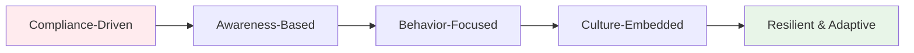

# Security Awareness and Training
## Unit V: Cybercrime & Digital Forensics
### Lecture 38: Empowering People as Security's Strongest Defense

<div class="absolute bottom-5 left-5 text-xs text-gray-500">
Course: Cyber Security (4353204) | Semester V | Diploma ICT | Author: Milav Dabgar
</div>

---
layout: default
---

# Human Factor in Cybersecurity

<div class="grid grid-cols-2 gap-8">

<div>

## 👥 The Human Element

**Security awareness** is the knowledge and attitude members of an organization possess regarding the protection of physical and information assets.

### 📊 Human Factor Statistics (2024)
- **95% of successful breaches** involve human error
- **Security awareness training** reduces incidents by 70%
- **Phishing simulation effectiveness**: 80% reduction in click rates
- **Employee security behavior**: Only 38% follow all security policies
- **Training retention**: 65% after 6 months without reinforcement
- **Cultural transformation time**: 18-24 months average

### 🧠 Psychology of Security Behavior
```yaml
Behavioral Factors:
  Cognitive Biases:
    - Overconfidence bias (thinking "it won't happen to me")
    - Authority bias (trusting apparent authority figures)
    - Urgency bias (acting hastily under pressure)
    - Familiarity bias (trusting known senders/sources)
    - Optimism bias (underestimating risk probability)

  Motivational Factors:
    - Personal relevance and impact
    - Perceived threat severity
    - Self-efficacy beliefs
    - Social norms and peer influence
    - Organizational culture alignment

  Barriers to Secure Behavior:
    - Inconvenience and workflow disruption
    - Lack of understanding or awareness
    - Competing priorities and time pressure
    - Poor tool design and usability
    - Insufficient motivation or consequences
```

### 🎯 Security Culture Maturity Model


</div>

<div>

## 📈 Security Awareness Program Framework

### 🏗️ Program Development Lifecycle
```yaml
Program Development Phases:
  1. Assessment and Planning:
     - Risk assessment and gap analysis
     - Stakeholder identification
     - Resource allocation
     - Goal setting and metrics definition
     - Baseline behavior measurement

  2. Content Development:
     - Learning objective definition
     - Content creation and curation
     - Delivery method selection
     - Assessment and evaluation design
     - Feedback mechanism implementation

  3. Implementation and Delivery:
     - Pilot program execution
     - Full-scale rollout
     - Delivery channel management
     - Progress tracking and monitoring
     - Participant engagement management

  4. Evaluation and Improvement:
     - Effectiveness measurement
     - Behavior change assessment
     - Program optimization
     - Continuous improvement
     - Return on investment analysis
```

### 🎓 Learning Principles for Security Training
```yaml
Adult Learning Principles:
  Relevance:
    - Real-world scenarios and examples
    - Job-relevant security situations
    - Personal and professional impact
    - Current threat landscape
    - Organization-specific risks

  Engagement:
    - Interactive learning experiences
    - Hands-on practice opportunities
    - Gamification and competition
    - Social learning and collaboration
    - Multi-modal content delivery

  Retention:
    - Spaced repetition and reinforcement
    - Just-in-time learning
    - Micro-learning modules
    - Practice and application
    - Knowledge reinforcement activities

  Motivation:
    - Clear value proposition
    - Positive reinforcement
    - Recognition and rewards
    - Personal empowerment
    - Community building

  Accessibility:
    - Multiple learning formats
    - Mobile-friendly delivery
    - Accommodating different learning styles
    - Language and cultural considerations
    - Time and schedule flexibility
```

</div>

</div>

<div class="absolute bottom-5 left-5 text-xs text-gray-500">
Course: Cyber Security (4353204) | Unit V | Lecture 38 | Author: Milav Dabgar
</div>

---
layout: default
---

# Training Program Design and Implementation

<div class="grid grid-cols-2 gap-8">

<div>

## 📚 Curriculum Development Framework

### 🎯 Core Security Topics
```python
# Security Awareness Curriculum Framework
class SecurityAwarenessCurriculum:
    def __init__(self):
        self.core_modules = self.define_core_modules()
        self.role_based_content = self.create_role_based_content()
        self.delivery_methods = self.define_delivery_methods()
        
    def define_core_modules(self):
        """Define core security awareness modules"""
        modules = {
            'password_security': {
                'learning_objectives': [
                    'Create strong, unique passwords',
                    'Use password managers effectively',
                    'Recognize password-related threats',
                    'Implement multi-factor authentication'
                ],
                'content_areas': [
                    'Password complexity requirements',
                    'Password manager selection and use',
                    'MFA types and implementation',
                    'Credential theft prevention'
                ],
                'duration': '45 minutes',
                'assessment_type': 'knowledge_check',
                'practical_exercises': [
                    'Password strength evaluation',
                    'Password manager setup',
                    'MFA configuration'
                ]
            },
            'phishing_awareness': {
                'learning_objectives': [
                    'Identify phishing attempts',
                    'Verify sender authenticity',
                    'Report suspicious messages',
                    'Avoid social engineering tactics'
                ],
                'content_areas': [
                    'Phishing indicators and red flags',
                    'Email authentication verification',
                    'Social engineering techniques',
                    'Incident reporting procedures'
                ],
                'duration': '60 minutes',
                'assessment_type': 'simulated_phishing',
                'practical_exercises': [
                    'Phishing email analysis',
                    'Sender verification practice',
                    'Reporting mechanism use'
                ]
            },
            'safe_browsing': {
                'learning_objectives': [
                    'Identify malicious websites',
                    'Use secure browsing practices',
                    'Manage browser security settings',
                    'Handle suspicious downloads'
                ],
                'content_areas': [
                    'Website legitimacy verification',
                    'Browser security configuration',
                    'Download safety practices',
                    'Public Wi-Fi risks'
                ],
                'duration': '30 minutes',
                'assessment_type': 'scenario_based',
                'practical_exercises': [
                    'Website verification',
                    'Browser security audit',
                    'Safe download practices'
                ]
            },
            'data_protection': {
                'learning_objectives': [
                    'Classify data appropriately',
                    'Apply data handling procedures',
                    'Use encryption tools',
                    'Implement data loss prevention'
                ],
                'content_areas': [
                    'Data classification schemes',
                    'Handling procedures by classification',
                    'Encryption tools and techniques',
                    'Data sharing and collaboration'
                ],
                'duration': '50 minutes',
                'assessment_type': 'hands_on_lab',
                'practical_exercises': [
                    'Data classification exercise',
                    'Encryption tool usage',
                    'Secure sharing setup'
                ]
            }
        }
        
        return modules
    
    def create_role_based_content(self):
        """Create role-specific security content"""
        role_content = {
            'executives': {
                'focus_areas': [
                    'Business email compromise',
                    'Board-level cybersecurity governance',
                    'Strategic risk management',
                    'Crisis communication'
                ],
                'delivery_format': 'executive_briefings',
                'frequency': 'quarterly'
            },
            'managers': {
                'focus_areas': [
                    'Team security leadership',
                    'Incident response coordination',
                    'Security policy enforcement',
                    'Employee security coaching'
                ],
                'delivery_format': 'management_workshops',
                'frequency': 'bi_annually'
            },
            'it_staff': {
                'focus_areas': [
                    'Advanced threat detection',
                    'Secure system administration',
                    'Incident response procedures',
                    'Technical security controls'
                ],
                'delivery_format': 'technical_training',
                'frequency': 'monthly'
            },
            'general_users': {
                'focus_areas': [
                    'Daily security practices',
                    'Threat recognition',
                    'Incident reporting',
                    'Personal device security'
                ],
                'delivery_format': 'interactive_modules',
                'frequency': 'annually_with_updates'
            }
        }
        
        return role_content
```

### 🎮 Engaging Delivery Methods
```yaml
Training Delivery Formats:
  Interactive E-Learning:
    - Branching scenarios
    - Knowledge checks and quizzes
    - Video-based learning
    - Animated explanations
    - Progressive content unlocking

  Gamification Elements:
    - Points and scoring systems
    - Badges and achievements
    - Leaderboards and competitions
    - Challenge-based learning
    - Team-based activities

  Simulation-Based Training:
    - Phishing simulations
    - Social engineering scenarios
    - Incident response tabletops
    - Virtual reality experiences
    - Role-playing exercises

  Microlearning Modules:
    - Bite-sized content (5-10 minutes)
    - Just-in-time learning
    - Mobile-friendly format
    - Topic-specific focus
    - Easy consumption and retention

  Blended Learning Approaches:
    - Combination of online and offline
    - Self-paced and instructor-led
    - Individual and group activities
    - Formal and informal learning
    - Multiple reinforcement touchpoints
```

</div>

<div>

## 📊 Assessment and Measurement

### 🎯 Training Effectiveness Metrics
```python
# Training Assessment Framework
class TrainingAssessment:
    def __init__(self):
        self.kirkpatrick_levels = self.define_kirkpatrick_levels()
        self.metrics_framework = self.create_metrics_framework()
        
    def define_kirkpatrick_levels(self):
        """Define four levels of training evaluation"""
        levels = {
            'level_1_reaction': {
                'definition': 'Participant satisfaction and engagement',
                'metrics': [
                    'Course completion rate',
                    'Participant satisfaction scores',
                    'Engagement metrics (time spent, clicks)',
                    'Feedback quality and quantity',
                    'Net Promoter Score for training'
                ],
                'measurement_methods': [
                    'Post-training surveys',
                    'Learning platform analytics',
                    'Focus group discussions',
                    'Real-time polling',
                    'Feedback forms'
                ]
            },
            'level_2_learning': {
                'definition': 'Knowledge and skill acquisition',
                'metrics': [
                    'Pre/post assessment scores',
                    'Knowledge retention rates',
                    'Skill demonstration success',
                    'Certification achievement',
                    'Competency assessment results'
                ],
                'measurement_methods': [
                    'Knowledge assessments',
                    'Practical skill tests',
                    'Simulation performance',
                    'Certification exams',
                    'Peer evaluations'
                ]
            },
            'level_3_behavior': {
                'definition': 'Behavior change in work environment',
                'metrics': [
                    'Policy compliance rates',
                    'Security incident reduction',
                    'Reporting behavior changes',
                    'Tool adoption rates',
                    'Behavioral observation scores'
                ],
                'measurement_methods': [
                    'Behavioral observations',
                    'Performance monitoring',
                    'Incident tracking',
                    'Compliance audits',
                    '360-degree feedback'
                ]
            },
            'level_4_results': {
                'definition': 'Organizational impact and ROI',
                'metrics': [
                    'Reduction in security incidents',
                    'Decreased breach costs',
                    'Improved compliance scores',
                    'Enhanced security culture',
                    'Return on investment'
                ],
                'measurement_methods': [
                    'Incident trend analysis',
                    'Cost-benefit analysis',
                    'Compliance assessments',
                    'Culture surveys',
                    'ROI calculations'
                ]
            }
        }
        
        return levels
    
    def conduct_phishing_simulation(self, target_users, scenario_type):
        """Conduct phishing simulation assessment"""
        simulation = {
            'scenario_design': self.create_phishing_scenario(scenario_type),
            'target_selection': self.select_simulation_targets(target_users),
            'execution_timeline': self.plan_simulation_timeline(),
            'measurement_criteria': self.define_success_metrics(),
            'follow_up_actions': self.plan_follow_up_training()
        }
        
        return simulation
    
    def analyze_training_roi(self, training_costs, security_improvements):
        """Calculate return on investment for security training"""
        roi_analysis = {
            'training_investment': {
                'development_costs': training_costs.get('development', 0),
                'delivery_costs': training_costs.get('delivery', 0),
                'participant_time_costs': training_costs.get('participant_time', 0),
                'technology_costs': training_costs.get('technology', 0),
                'total_investment': sum(training_costs.values())
            },
            'security_benefits': {
                'incident_reduction_savings': security_improvements.get('incident_savings', 0),
                'compliance_improvement_value': security_improvements.get('compliance_value', 0),
                'productivity_gains': security_improvements.get('productivity_gains', 0),
                'reputation_protection_value': security_improvements.get('reputation_value', 0),
                'total_benefits': sum(security_improvements.values())
            },
            'roi_calculation': {
                'net_benefit': sum(security_improvements.values()) - sum(training_costs.values()),
                'roi_percentage': ((sum(security_improvements.values()) - sum(training_costs.values())) / sum(training_costs.values())) * 100 if sum(training_costs.values()) > 0 else 0,
                'payback_period': self.calculate_payback_period(training_costs, security_improvements)
            }
        }
        
        return roi_analysis
```

### 📈 Continuous Improvement Process
```yaml
Training Program Optimization:
  Data Collection:
    - Learning analytics and engagement metrics
    - Assessment scores and performance data
    - Behavioral change indicators
    - Incident and compliance data
    - Participant feedback and suggestions

  Analysis Methods:
    - Statistical trend analysis
    - Correlation analysis (training vs. incidents)
    - Comparative effectiveness studies
    - Qualitative feedback analysis
    - Benchmarking against industry standards

  Improvement Actions:
    - Content updates and revisions
    - Delivery method optimization
    - Personalization and targeting
    - Timing and frequency adjustments
    - Technology platform enhancements

  Quality Assurance:
    - Content accuracy verification
    - Technical quality testing
    - Accessibility compliance
    - Multi-device compatibility
    - User experience optimization
```

</div>

</div>

<div class="absolute bottom-5 left-5 text-xs text-gray-500">
Course: Cyber Security (4353204) | Unit V | Lecture 38 | Author: Milav Dabgar
</div>

---
layout: default
---

# Building Security Culture

<div class="grid grid-cols-2 gap-8">

<div>

## 🏢 Organizational Culture Transformation

### 🌱 Culture Change Framework
```python
# Security Culture Development Framework
class SecurityCultureBuilder:
    def __init__(self):
        self.culture_dimensions = self.define_culture_dimensions()
        self.maturity_levels = self.define_maturity_levels()
        self.change_strategies = self.develop_change_strategies()
        
    def assess_current_culture(self, organization_data):
        """Assess current security culture maturity"""
        assessment = {
            'leadership_commitment': self.assess_leadership_dimension(organization_data),
            'employee_engagement': self.assess_engagement_dimension(organization_data),
            'communication_effectiveness': self.assess_communication_dimension(organization_data),
            'behavioral_norms': self.assess_behavioral_dimension(organization_data),
            'continuous_learning': self.assess_learning_dimension(organization_data),
            'incident_response_culture': self.assess_response_culture(organization_data)
        }
        
        # Calculate overall maturity score
        dimension_scores = [score for score in assessment.values()]
        overall_maturity = sum(dimension_scores) / len(dimension_scores)
        
        assessment['overall_maturity'] = overall_maturity
        assessment['maturity_level'] = self.determine_maturity_level(overall_maturity)
        
        return assessment
    
    def develop_culture_strategy(self, assessment_results):
        """Develop comprehensive culture transformation strategy"""
        strategy = {
            'vision_and_goals': self.create_culture_vision(),
            'change_roadmap': self.create_transformation_roadmap(assessment_results),
            'communication_plan': self.develop_communication_strategy(),
            'leadership_engagement': self.design_leadership_program(),
            'employee_empowerment': self.create_empowerment_initiatives(),
            'measurement_framework': self.establish_culture_metrics()
        }
        
        return strategy
    
    def create_transformation_roadmap(self, assessment):
        """Create phased culture transformation roadmap"""
        roadmap = {
            'phase_1_foundation': {
                'duration': '6 months',
                'focus': 'Building awareness and leadership buy-in',
                'key_activities': [
                    'Executive leadership alignment',
                    'Security culture assessment',
                    'Communication strategy launch',
                    'Initial awareness campaigns',
                    'Policy and procedure review'
                ],
                'success_criteria': [
                    '90% leadership participation',
                    '70% employee awareness of security importance',
                    'Clear communication channels established',
                    'Baseline culture metrics captured'
                ]
            },
            'phase_2_engagement': {
                'duration': '6-12 months',
                'focus': 'Active engagement and behavior change',
                'key_activities': [
                    'Comprehensive training rollout',
                    'Gamification and incentive programs',
                    'Security champion network',
                    'Feedback and recognition systems',
                    'Process improvements'
                ],
                'success_criteria': [
                    '85% training completion rates',
                    '50% improvement in security behaviors',
                    'Active security champion participation',
                    'Positive employee feedback trends'
                ]
            },
            'phase_3_integration': {
                'duration': '12-18 months',
                'focus': 'Embedding security into daily operations',
                'key_activities': [
                    'Process integration initiatives',
                    'Advanced skill development',
                    'Cross-functional collaboration',
                    'Continuous improvement programs',
                    'Knowledge sharing platforms'
                ],
                'success_criteria': [
                    'Security integrated into job roles',
                    'Proactive security behaviors',
                    'Strong collaboration networks',
                    'Self-sustaining improvement culture'
                ]
            },
            'phase_4_optimization': {
                'duration': '18+ months',
                'focus': 'Continuous optimization and innovation',
                'key_activities': [
                    'Advanced threat awareness',
                    'Innovation and experimentation',
                    'External partnership development',
                    'Thought leadership activities',
                    'Next-generation capabilities'
                ],
                'success_criteria': [
                    'Industry-leading security culture',
                    'Proactive threat management',
                    'Innovation in security practices',
                    'Positive external recognition'
                ]
            }
        }
        
        return roadmap
```

### 👑 Leadership and Governance
```yaml
Leadership Engagement Strategies:
  Executive Sponsorship:
    - C-level security commitment
    - Board-level oversight
    - Resource allocation
    - Strategic alignment
    - Public commitment statements

  Management Accountability:
    - Security performance metrics in evaluations
    - Manager security training requirements
    - Team security goal setting
    - Regular security discussions
    - Recognition and consequences

  Security Governance:
    - Security steering committees
    - Cross-functional security teams
    - Regular governance meetings
    - Policy and procedure ownership
    - Risk management integration

Communication and Engagement:
  Multi-Channel Communication:
    - Email campaigns and newsletters
    - Intranet portals and resources
    - Video messages from leadership
    - Town halls and all-hands meetings
    - Social media and collaboration tools

  Storytelling and Case Studies:
    - Real-world security examples
    - Success stories and lessons learned
    - Industry case studies
    - Personal relevance examples
    - Positive outcome messaging

  Recognition and Incentives:
    - Security behavior recognition programs
    - Achievement badges and certificates
    - Monetary and non-monetary rewards
    - Public recognition and praise
    - Career development opportunities
```

</div>

<div>

## 🎯 Specialized Training Programs

### 🛡️ Role-Based Security Training
```yaml
Executive and Leadership Training:
  Topics:
    - Cybersecurity governance and strategy
    - Risk management and decision making
    - Crisis communication and incident response
    - Regulatory compliance and legal issues
    - Board reporting and stakeholder management

  Format:
    - Executive briefings and workshops
    - Tabletop exercises and simulations
    - Peer learning and best practice sharing
    - Expert-led discussions and panels
    - Strategic planning sessions

Technical Staff Training:
  Topics:
    - Advanced threat analysis and detection
    - Incident response and forensics
    - Secure coding and development practices
    - Infrastructure hardening and monitoring
    - Emerging technologies and threats

  Format:
    - Hands-on technical workshops
    - Certification preparation courses
    - Lab-based learning environments
    - Peer technical discussions
    - Vendor training and conferences

HR and Legal Training:
  Topics:
    - Privacy and data protection laws
    - Employee background checks and monitoring
    - Insider threat detection and response
    - Legal implications of security incidents
    - Employment law and security policies

  Format:
    - Legal update sessions
    - Case study analysis
    - Policy development workshops
    - Cross-functional collaboration training
    - Regulatory compliance training

Sales and Marketing Training:
  Topics:
    - Customer data protection and privacy
    - Social media security practices
    - Intellectual property protection
    - Secure customer communication
    - Brand protection and reputation management

  Format:
    - Customer-facing scenario training
    - Social media security workshops
    - IP protection awareness sessions
    - Secure communication training
    - Crisis communication preparation
```

### 🏆 Security Champion Program
```python
# Security Champion Program Framework
class SecurityChampionProgram:
    def __init__(self):
        self.program_structure = self.define_program_structure()
        self.champion_roles = self.define_champion_roles()
        self.development_pathway = self.create_development_pathway()
        
    def design_champion_program(self):
        """Design comprehensive security champion program"""
        program = {
            'program_overview': {
                'mission': 'Embed security expertise throughout the organization',
                'vision': 'Every department has dedicated security advocates',
                'objectives': [
                    'Increase security awareness and engagement',
                    'Provide localized security expertise',
                    'Improve incident detection and response',
                    'Foster security culture development',
                    'Create peer-to-peer learning networks'
                ]
            },
            'selection_criteria': {
                'required_qualifications': [
                    'Strong communication and interpersonal skills',
                    'Demonstrated interest in security topics',
                    'Influence and credibility within department',
                    'Availability for program participation',
                    'Management support and endorsement'
                ],
                'preferred_qualifications': [
                    'Previous security training or experience',
                    'Technical aptitude and curiosity',
                    'Leadership potential and initiative',
                    'Cross-functional collaboration experience',
                    'Change management experience'
                ]
            },
            'roles_and_responsibilities': {
                'security_advocacy': [
                    'Promote security awareness within department',
                    'Serve as first point of contact for security questions',
                    'Facilitate security discussions and training',
                    'Share security updates and communications',
                    'Collect feedback and suggestions from colleagues'
                ],
                'incident_support': [
                    'Assist with incident identification and reporting',
                    'Support incident response activities',
                    'Help coordinate departmental response efforts',
                    'Facilitate communication during incidents',
                    'Support post-incident lessons learned activities'
                ],
                'continuous_improvement': [
                    'Identify security improvement opportunities',
                    'Participate in security program development',
                    'Provide input on policies and procedures',
                    'Support security culture assessment activities',
                    'Contribute to program evaluation and enhancement'
                ]
            },
            'development_program': {
                'initial_training': {
                    'duration': '2 days intensive + 4 weeks online',
                    'topics': [
                        'Security fundamentals and threat landscape',
                        'Organizational security policies and procedures',
                        'Incident identification and reporting',
                        'Communication and advocacy skills',
                        'Change management and influence techniques'
                    ]
                },
                'ongoing_development': {
                    'monthly_sessions': 'Advanced topics and case studies',
                    'quarterly_workshops': 'Skills development and networking',
                    'annual_conference': 'Industry best practices and innovation',
                    'certification_support': 'Professional development opportunities'
                }
            }
        }
        
        return program
    
    def measure_program_effectiveness(self, program_metrics):
        """Measure security champion program effectiveness"""
        effectiveness = {
            'participation_metrics': {
                'champion_retention_rate': program_metrics.get('retention_rate', 0),
                'program_completion_rate': program_metrics.get('completion_rate', 0),
                'engagement_scores': program_metrics.get('engagement_scores', []),
                'activity_participation': program_metrics.get('activity_participation', 0)
            },
            'impact_metrics': {
                'incident_reporting_increase': program_metrics.get('reporting_improvement', 0),
                'security_awareness_scores': program_metrics.get('awareness_scores', []),
                'policy_compliance_improvement': program_metrics.get('compliance_improvement', 0),
                'cultural_change_indicators': program_metrics.get('culture_indicators', [])
            },
            'roi_analysis': {
                'program_investment': program_metrics.get('total_investment', 0),
                'quantified_benefits': program_metrics.get('measured_benefits', 0),
                'roi_percentage': self.calculate_program_roi(program_metrics)
            }
        }
        
        return effectiveness
```

</div>

</div>

<div class="absolute bottom-5 left-5 text-xs text-gray-500">
Course: Cyber Security (4353204) | Unit V | Lecture 38 | Author: Milav Dabgar
</div>

---
layout: default
---

# Practical Exercise: Security Awareness Program Development

<div class="exercise-container">

## 🎯 Comprehensive Security Culture Transformation (35 minutes)

### Mission: Organizational Security Awareness Strategy

Design and implement a comprehensive security awareness and culture transformation program for **"TechCorp Global"** with 5,000 employees across 15 countries.

### 🏢 Organizational Context
**Challenge Scenario:**
- **Recent security incidents** have damaged reputation and trust
- **Regulatory compliance** requirements across multiple jurisdictions  
- **Diverse workforce** with varying technical skills and languages
- **Remote and hybrid work** models across time zones
- **Executive mandate** for cultural transformation within 12 months
- **Limited budget** requiring creative and efficient solutions

### Phase 1: Program Strategy and Design (15 minutes)

**Team Assignment: Comprehensive Program Framework**

1. **Cultural Assessment and Strategy Development**
   - Design comprehensive security culture maturity assessment
   - Create multi-phase culture transformation roadmap
   - Plan leadership engagement and executive sponsorship strategy
   - Develop communication strategy for global, diverse workforce

2. **Training Program Architecture**
   - Design role-based training curriculum for different employee levels
   - Create engaging, multi-modal learning experiences
   - Plan assessment and measurement framework
   - Develop security champion program structure

### Phase 2: Implementation and Engagement (12 minutes)

**Program Execution Strategy:**
1. **Content Development and Delivery**
   - Design culturally-sensitive, multilingual content
   - Create gamification and engagement strategies
   - Plan phishing simulation and behavioral assessment programs
   - Develop just-in-time learning and microlearning modules

2. **Technology and Platform Strategy**
   - Select and configure learning management systems
   - Design mobile-friendly and accessible content delivery
   - Plan analytics and progress tracking systems
   - Create communication and collaboration platforms

### Phase 3: Measurement and Continuous Improvement (8 minutes)

**Program Optimization Framework:**
1. **Metrics and Assessment Strategy**
   - Define comprehensive effectiveness measurements using Kirkpatrick model
   - Design behavioral change tracking and analysis
   - Plan ROI calculation and business impact assessment
   - Create continuous feedback and improvement processes

2. **Sustainability and Long-term Strategy**
   - Design program sustainability and resource allocation
   - Plan annual program evolution and content updates
   - Create knowledge management and best practice sharing
   - Develop integration with career development and performance management

**Deliverables:**
- Comprehensive security awareness program strategy and roadmap
- Multi-modal training curriculum with role-based specialization
- Engagement and cultural transformation implementation plan
- Measurement framework with ROI analysis and continuous improvement processes

</div>

<style>
.exercise-container {
  @apply bg-green-50 border-2 border-green-300 rounded-lg p-6;
}
</style>

<div class="absolute bottom-5 left-5 text-xs text-gray-500">
Course: Cyber Security (4353204) | Unit V | Lecture 38 | Author: Milav Dabgar
</div>

---
layout: center
class: text-center
---

# Questions & Discussion

## 🤔 Culture Transformation Considerations:
- How do you measure the effectiveness of security culture change?
- What are the biggest challenges in engaging non-technical employees?
- How do you sustain security awareness momentum over time?

### 💡 Exercise Review
Present your security awareness strategies and discuss culture transformation approaches

<div class="absolute bottom-5 left-5 text-xs text-gray-500">
Course: Cyber Security (4353204) | Unit V | Lecture 38 | Author: Milav Dabgar
</div>

---
layout: center
class: text-center
---

# Thank You!

## Next Lecture: Cybersecurity Governance and Risk Management
### Strategic Security Leadership and Decision Making

<div class="pt-8 text-gray-500">
  <p>Cyber Security (4353204) - Lecture 38 Complete</p>
  <p>Security awareness: Empowering people to be security heroes! 👥🛡️</p>
</div>

<div class="absolute bottom-5 left-5 text-xs text-gray-500">
Course: Cyber Security (4353204) | Unit V | Lecture 38 | Author: Milav Dabgar
</div>