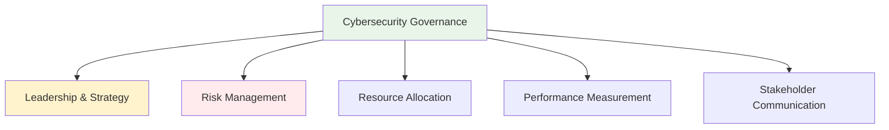

# Cybersecurity Governance and Risk Management
## Unit V: Cybercrime & Digital Forensics
### Lecture 39: Building Strategic Security Leadership Framework

<div class="absolute bottom-5 left-5 text-xs text-gray-500">
Course: Cyber Security (4353204) | Semester V | Diploma ICT | Author: Milav Dabgar
</div>

---
layout: default
---

# Cybersecurity Governance Fundamentals

<div class="grid grid-cols-2 gap-8">

<div>

## 🏛️ What is Cybersecurity Governance?

**Cybersecurity governance** is the system of controls, processes, and oversight mechanisms that ensure cybersecurity risks are managed effectively and aligned with organizational objectives and stakeholder expectations.

### 📊 Governance Statistics (2024)
- **Organizations with mature governance**: 31% globally
- **Board-level cybersecurity oversight**: 68% of companies
- **CISO reporting to CEO**: 45% of organizations
- **Governance framework adoption**: 74% use established frameworks
- **Risk appetite definition**: Only 52% have clear risk appetite
- **Governance maturity correlation**: 40% lower breach costs

### 🎯 Governance Pillars


### 🏢 Governance Stakeholders
```yaml
Key Stakeholders:
  Board of Directors:
    - Strategic oversight and direction
    - Risk appetite definition
    - Resource allocation approval
    - Performance monitoring
    - Regulatory compliance oversight

  Executive Leadership:
    - Strategy implementation
    - Risk management execution
    - Resource optimization
    - Performance accountability
    - Stakeholder communication

  Chief Information Security Officer (CISO):
    - Program leadership and management
    - Technical strategy development
    - Risk assessment and mitigation
    - Incident response coordination
    - Vendor and third-party management

  Business Unit Leaders:
    - Business risk ownership
    - Security requirement definition
    - Resource contribution
    - Process integration
    - User compliance management
```

</div>

<div>

## 📋 Governance Frameworks and Standards

### 🌐 International Governance Frameworks
```yaml
NIST Cybersecurity Framework:
  Core Functions:
    - Identify: Asset management and risk assessment
    - Protect: Access control and data security
    - Detect: Monitoring and detection systems
    - Respond: Response planning and communication
    - Recover: Recovery planning and improvements

ISO 27001/27002:
  Control Domains:
    - Information security policies
    - Organization of information security
    - Human resource security
    - Asset management
    - Access control
    - Cryptography
    - Physical and environmental security
    - Operations security
    - Communications security
    - System acquisition, development, maintenance
    - Supplier relationships
    - Information security incident management
    - Business continuity management
    - Compliance

COBIT (Control Objectives for IT):
  Governance Principles:
    - Meet stakeholder needs
    - Cover the enterprise end-to-end
    - Apply a single integrated framework
    - Enable a holistic approach
    - Separate governance from management

  Management Objectives:
    - Align, plan and organize (APO)
    - Build, acquire and implement (BAI)
    - Deliver, service and support (DSS)
    - Monitor, evaluate and assess (MEA)
    - Evaluate, direct and monitor (EDM)
```

### 🔍 Governance Maturity Models
```python
# Cybersecurity Governance Maturity Assessment
class GovernanceMaturityAssessment:
    def __init__(self):
        self.maturity_levels = self.define_maturity_levels()
        self.assessment_domains = self.define_assessment_domains()
        
    def define_maturity_levels(self):
        """Define governance maturity levels"""
        levels = {
            'level_1_initial': {
                'description': 'Ad hoc, reactive security practices',
                'characteristics': [
                    'No formal security governance structure',
                    'Reactive approach to security incidents',
                    'Limited security awareness and training',
                    'Minimal documentation and procedures',
                    'Inconsistent security practices across organization'
                ]
            },
            'level_2_developing': {
                'description': 'Basic governance structures emerging',
                'characteristics': [
                    'Formal security policies and procedures',
                    'Designated security leadership roles',
                    'Basic risk management processes',
                    'Regular security awareness training',
                    'Incident response procedures established'
                ]
            },
            'level_3_defined': {
                'description': 'Established governance processes',
                'characteristics': [
                    'Comprehensive security governance framework',
                    'Defined roles and responsibilities',
                    'Regular risk assessments and reporting',
                    'Security metrics and performance measurement',
                    'Integration with business processes'
                ]
            },
            'level_4_managed': {
                'description': 'Quantitatively managed security program',
                'characteristics': [
                    'Data-driven security decision making',
                    'Advanced threat intelligence and analytics',
                    'Continuous monitoring and improvement',
                    'Mature vendor and third-party management',
                    'Predictable security outcomes'
                ]
            },
            'level_5_optimizing': {
                'description': 'Continuously improving and adaptive',
                'characteristics': [
                    'Innovation in security practices',
                    'Proactive threat hunting and prevention',
                    'Automated security operations',
                    'Industry leadership and thought leadership',
                    'Resilient and adaptive security posture'
                ]
            }
        }
        
        return levels
    
    def assess_governance_maturity(self, organization_data):
        """Assess current governance maturity"""
        assessment = {}
        
        for domain in self.assessment_domains:
            domain_score = self.evaluate_domain(domain, organization_data)
            assessment[domain] = {
                'current_score': domain_score,
                'current_level': self.determine_level(domain_score),
                'gap_analysis': self.analyze_gaps(domain, domain_score),
                'improvement_recommendations': self.generate_recommendations(domain, domain_score)
            }
        
        # Calculate overall maturity
        overall_score = sum(assessment[domain]['current_score'] for domain in assessment) / len(assessment)
        assessment['overall_maturity'] = {
            'score': overall_score,
            'level': self.determine_level(overall_score),
            'strengths': self.identify_strengths(assessment),
            'improvement_priorities': self.prioritize_improvements(assessment)
        }
        
        return assessment
```

</div>

</div>

<div class="absolute bottom-5 left-5 text-xs text-gray-500">
Course: Cyber Security (4353204) | Unit V | Lecture 39 | Author: Milav Dabgar
</div>

---
layout: default
---

# Risk Management Framework

<div class="grid grid-cols-2 gap-8">

<div>

## 🎯 Enterprise Risk Management

### 📊 Risk Management Process
```python
# Comprehensive Risk Management Framework
class CybersecurityRiskManagement:
    def __init__(self):
        self.risk_categories = self.define_risk_categories()
        self.risk_assessment_methods = self.define_assessment_methods()
        self.risk_treatment_strategies = self.define_treatment_strategies()
        
    def conduct_risk_assessment(self, scope, assets, threats):
        """Conduct comprehensive cybersecurity risk assessment"""
        assessment = {
            'scope_definition': self.define_assessment_scope(scope),
            'asset_inventory': self.catalog_assets(assets),
            'threat_landscape': self.analyze_threat_landscape(threats),
            'vulnerability_analysis': self.assess_vulnerabilities(assets),
            'risk_calculation': self.calculate_risks(assets, threats),
            'risk_prioritization': self.prioritize_risks()
        }
        
        return assessment
    
    def define_risk_categories(self):
        """Define cybersecurity risk categories"""
        categories = {
            'strategic_risks': {
                'description': 'Risks affecting organizational strategy and objectives',
                'examples': [
                    'Reputation damage from major breach',
                    'Regulatory non-compliance penalties',
                    'Loss of competitive advantage',
                    'Business disruption and downtime',
                    'Intellectual property theft'
                ]
            },
            'operational_risks': {
                'description': 'Risks affecting day-to-day operations',
                'examples': [
                    'System outages and service disruption',
                    'Data corruption or loss',
                    'Process failures and inefficiencies',
                    'Human error and insider threats',
                    'Third-party service provider failures'
                ]
            },
            'financial_risks': {
                'description': 'Risks with direct financial impact',
                'examples': [
                    'Incident response and recovery costs',
                    'Regulatory fines and penalties',
                    'Litigation and legal expenses',
                    'Insurance premium increases',
                    'Lost revenue and business opportunity'
                ]
            },
            'compliance_risks': {
                'description': 'Risks related to regulatory and legal compliance',
                'examples': [
                    'Data protection regulation violations',
                    'Industry-specific compliance failures',
                    'Audit findings and remediation requirements',
                    'Contractual obligation breaches',
                    'Cross-border data transfer violations'
                ]
            },
            'technology_risks': {
                'description': 'Risks inherent in technology systems and processes',
                'examples': [
                    'Software vulnerabilities and exploits',
                    'Hardware failures and obsolescence',
                    'Network infrastructure weaknesses',
                    'Cloud service dependencies',
                    'Emerging technology adoption risks'
                ]
            }
        }
        
        return categories
    
    def calculate_risk_score(self, threat_likelihood, vulnerability_severity, asset_value, impact_magnitude):
        """Calculate comprehensive risk score"""
        # Base risk calculation
        base_risk = threat_likelihood * vulnerability_severity * impact_magnitude
        
        # Asset value multiplier
        asset_multiplier = min(asset_value / 10, 2.0)  # Cap at 2x multiplier
        
        # Calculate final risk score (0-100 scale)
        risk_score = min(base_risk * asset_multiplier, 100)
        
        risk_assessment = {
            'quantitative_score': risk_score,
            'qualitative_rating': self.get_qualitative_rating(risk_score),
            'risk_components': {
                'threat_likelihood': threat_likelihood,
                'vulnerability_severity': vulnerability_severity,
                'asset_value': asset_value,
                'impact_magnitude': impact_magnitude
            },
            'risk_factors': self.identify_risk_factors(threat_likelihood, vulnerability_severity, asset_value, impact_magnitude)
        }
        
        return risk_assessment
    
    def develop_risk_treatment_plan(self, risk_inventory):
        """Develop comprehensive risk treatment plan"""
        treatment_plan = {
            'risk_acceptance': [],
            'risk_mitigation': [],
            'risk_transfer': [],
            'risk_avoidance': []
        }
        
        for risk_id, risk_details in risk_inventory.items():
            risk_score = risk_details['risk_score']
            cost_to_mitigate = risk_details.get('mitigation_cost', 0)
            
            # Determine treatment strategy
            if risk_score < 30:  # Low risk
                treatment_plan['risk_acceptance'].append({
                    'risk_id': risk_id,
                    'rationale': 'Low risk level acceptable within risk appetite',
                    'monitoring_requirements': 'Regular review and monitoring'
                })
            
            elif risk_score < 70:  # Medium risk
                if cost_to_mitigate < risk_details.get('potential_impact', 0):
                    treatment_plan['risk_mitigation'].append({
                        'risk_id': risk_id,
                        'mitigation_controls': self.recommend_controls(risk_details),
                        'implementation_timeline': '3-6 months',
                        'expected_risk_reduction': self.calculate_risk_reduction(risk_details)
                    })
                else:
                    treatment_plan['risk_transfer'].append({
                        'risk_id': risk_id,
                        'transfer_mechanism': 'Insurance or contractual transfer',
                        'residual_risk': risk_details.get('residual_risk', risk_score * 0.3)
                    })
            
            else:  # High risk
                treatment_plan['risk_mitigation'].append({
                    'risk_id': risk_id,
                    'priority': 'Critical',
                    'mitigation_controls': self.recommend_controls(risk_details),
                    'implementation_timeline': 'Immediate - 3 months',
                    'executive_approval_required': True
                })
        
        return treatment_plan
```

### 📈 Risk Appetite and Tolerance
```yaml
Risk Appetite Framework:
  Definition:
    - Amount of risk organization willing to accept
    - Alignment with strategic objectives
    - Stakeholder expectations and requirements
    - Regulatory and compliance constraints
    - Resource availability and capabilities

  Risk Appetite Statements:
    Strategic Level:
      - "We will not accept risks that threaten our core business operations"
      - "We maintain low risk tolerance for regulatory compliance"
      - "We accept moderate risk for innovation and growth opportunities"

    Operational Level:
      - "System availability must exceed 99.5%"
      - "Data breaches affecting >1000 customers are unacceptable"
      - "Third-party security incidents cannot exceed 2 per year"

    Quantitative Measures:
      - Maximum annual loss expectancy: $10M
      - Risk-adjusted return on investment: >15%
      - Insurance coverage levels: $100M cyber liability
```

</div>

<div>

## 📊 Risk Monitoring and Reporting

### 📈 Risk Metrics and KPIs
```python
# Risk Monitoring and Reporting Framework
class RiskMonitoringSystem:
    def __init__(self):
        self.risk_indicators = self.define_risk_indicators()
        self.reporting_templates = self.create_reporting_templates()
        
    def define_risk_indicators(self):
        """Define comprehensive risk indicators"""
        indicators = {
            'leading_indicators': {
                'vulnerability_trends': {
                    'metric': 'Number of critical vulnerabilities identified',
                    'frequency': 'Weekly',
                    'target': '< 10 critical vulnerabilities',
                    'data_source': 'Vulnerability scanning tools'
                },
                'threat_intelligence_alerts': {
                    'metric': 'Number of relevant threat intelligence alerts',
                    'frequency': 'Daily',
                    'target': '100% alert review within 24 hours',
                    'data_source': 'Threat intelligence platforms'
                },
                'security_training_completion': {
                    'metric': 'Percentage of employees completing security training',
                    'frequency': 'Monthly',
                    'target': '> 95% completion rate',
                    'data_source': 'Learning management system'
                },
                'phishing_simulation_results': {
                    'metric': 'Percentage of employees clicking phishing links',
                    'frequency': 'Monthly',
                    'target': '< 5% click rate',
                    'data_source': 'Phishing simulation platform'
                }
            },
            'lagging_indicators': {
                'security_incidents': {
                    'metric': 'Number of security incidents by severity',
                    'frequency': 'Monthly',
                    'target': '0 critical incidents, < 5 high severity',
                    'data_source': 'Incident management system'
                },
                'mean_time_to_detect': {
                    'metric': 'Average time to detect security incidents',
                    'frequency': 'Monthly',
                    'target': '< 24 hours',
                    'data_source': 'SIEM and monitoring tools'
                },
                'compliance_violations': {
                    'metric': 'Number of compliance violations',
                    'frequency': 'Quarterly',
                    'target': '0 violations',
                    'data_source': 'Compliance monitoring systems'
                },
                'third_party_security_incidents': {
                    'metric': 'Security incidents involving third parties',
                    'frequency': 'Quarterly',
                    'target': '< 2 incidents per year',
                    'data_source': 'Vendor management system'
                }
            }
        }
        
        return indicators
    
    def generate_risk_dashboard(self, risk_data, time_period):
        """Generate executive risk dashboard"""
        dashboard = {
            'executive_summary': {
                'overall_risk_level': self.calculate_overall_risk(risk_data),
                'risk_trend': self.analyze_risk_trend(risk_data, time_period),
                'key_concerns': self.identify_key_concerns(risk_data),
                'mitigation_progress': self.track_mitigation_progress(risk_data)
            },
            'risk_heat_map': self.create_risk_heat_map(risk_data),
            'top_risks': self.identify_top_risks(risk_data, 10),
            'kpi_summary': self.summarize_kpis(risk_data),
            'action_items': self.generate_action_items(risk_data)
        }
        
        return dashboard
    
    def create_board_report(self, risk_assessment, governance_metrics):
        """Create board-level cybersecurity report"""
        board_report = {
            'executive_summary': {
                'cybersecurity_posture': 'Current state and trend analysis',
                'key_achievements': 'Major accomplishments and improvements',
                'critical_issues': 'Issues requiring board attention',
                'resource_requirements': 'Budget and resource needs'
            },
            'risk_overview': {
                'enterprise_risk_profile': self.summarize_enterprise_risks(risk_assessment),
                'risk_appetite_alignment': self.assess_risk_appetite_alignment(risk_assessment),
                'emerging_threats': self.highlight_emerging_threats(risk_assessment),
                'industry_benchmarking': self.provide_industry_comparison(risk_assessment)
            },
            'governance_effectiveness': {
                'program_maturity': governance_metrics.get('maturity_score'),
                'policy_compliance': governance_metrics.get('compliance_rate'),
                'third_party_management': governance_metrics.get('vendor_risk_score'),
                'incident_response_readiness': governance_metrics.get('ir_readiness_score')
            },
            'strategic_recommendations': {
                'investment_priorities': self.recommend_investments(risk_assessment),
                'governance_improvements': self.recommend_governance_improvements(governance_metrics),
                'risk_mitigation_strategies': self.recommend_risk_strategies(risk_assessment),
                'performance_targets': self.set_performance_targets(risk_assessment)
            }
        }
        
        return board_report
```

### 🎯 Continuous Monitoring and Improvement
```yaml
Continuous Risk Management:
  Monitoring Activities:
    - Real-time risk indicator tracking
    - Automated threat intelligence integration
    - Continuous compliance monitoring
    - Third-party risk assessment updates
    - Industry benchmarking and comparison

  Review and Update Cycles:
    - Weekly operational risk reviews
    - Monthly risk dashboard updates
    - Quarterly risk assessment refreshes
    - Annual risk strategy and appetite review
    - Ad-hoc reviews for significant changes

  Improvement Processes:
    - Risk management process optimization
    - Risk indicator effectiveness evaluation
    - Reporting format and content enhancement
    - Stakeholder feedback integration
    - Technology tool evaluation and upgrade
```

</div>

</div>

<div class="absolute bottom-5 left-5 text-xs text-gray-500">
Course: Cyber Security (4353204) | Unit V | Lecture 39 | Author: Milav Dabgar
</div>

---
layout: default
---

# Strategic Cybersecurity Planning

<div class="grid grid-cols-2 gap-8">

<div>

## 🎯 Strategic Planning Framework

### 📋 Cybersecurity Strategy Development
```python
# Strategic Cybersecurity Planning Framework
class CybersecurityStrategy:
    def __init__(self):
        self.strategic_elements = self.define_strategic_elements()
        self.planning_process = self.define_planning_process()
        
    def develop_cybersecurity_strategy(self, organization_context):
        """Develop comprehensive cybersecurity strategy"""
        strategy = {
            'situation_analysis': self.conduct_situation_analysis(organization_context),
            'strategic_vision': self.create_strategic_vision(organization_context),
            'strategic_objectives': self.define_strategic_objectives(organization_context),
            'capability_roadmap': self.create_capability_roadmap(organization_context),
            'resource_plan': self.develop_resource_plan(organization_context),
            'implementation_plan': self.create_implementation_plan(organization_context),
            'performance_measurement': self.design_performance_framework(organization_context)
        }
        
        return strategy
    
    def conduct_situation_analysis(self, context):
        """Conduct comprehensive situation analysis"""
        analysis = {
            'internal_assessment': {
                'current_capabilities': self.assess_current_capabilities(context),
                'organizational_maturity': self.assess_security_maturity(context),
                'resource_availability': self.assess_resources(context),
                'cultural_readiness': self.assess_security_culture(context)
            },
            'external_analysis': {
                'threat_landscape': self.analyze_threat_landscape(context),
                'regulatory_environment': self.analyze_regulatory_requirements(context),
                'industry_benchmarks': self.conduct_industry_analysis(context),
                'technology_trends': self.analyze_technology_trends(context)
            },
            'gap_analysis': {
                'capability_gaps': self.identify_capability_gaps(context),
                'resource_gaps': self.identify_resource_gaps(context),
                'process_gaps': self.identify_process_gaps(context),
                'technology_gaps': self.identify_technology_gaps(context)
            },
            'swot_analysis': {
                'strengths': self.identify_strengths(context),
                'weaknesses': self.identify_weaknesses(context),
                'opportunities': self.identify_opportunities(context),
                'threats': self.identify_threats(context)
            }
        }
        
        return analysis
    
    def create_strategic_vision(self, context):
        """Create cybersecurity strategic vision and mission"""
        vision_elements = {
            'vision_statement': 'To be a trusted, resilient organization that protects stakeholder value through world-class cybersecurity capabilities',
            'mission_statement': 'Enable business success through proactive risk management, robust security controls, and a strong security culture',
            'core_values': [
                'Security by design and default',
                'Transparency and accountability',
                'Continuous learning and improvement',
                'Collaboration and partnership',
                'Innovation and excellence'
            ],
            'strategic_principles': [
                'Risk-based decision making',
                'Business alignment and enablement',
                'Zero trust architecture adoption',
                'Privacy by design',
                'Shared responsibility model'
            ]
        }
        
        return vision_elements
    
    def define_strategic_objectives(self, context):
        """Define strategic objectives and key results"""
        objectives = {
            'protect_and_defend': {
                'objective': 'Establish robust protection and defense capabilities',
                'key_results': [
                    '99.9% system availability and uptime',
                    '< 4 hours mean time to contain incidents',
                    '100% compliance with regulatory requirements',
                    '< 0.1% successful phishing attack rate'
                ],
                'initiatives': [
                    'Zero trust architecture implementation',
                    'Advanced threat detection and response',
                    'Security awareness and training program',
                    'Compliance automation and monitoring'
                ]
            },
            'detect_and_respond': {
                'objective': 'Build world-class detection and response capabilities',
                'key_results': [
                    '< 1 hour mean time to detect critical threats',
                    '24/7 security operations center capability',
                    '100% incident response plan testing annually',
                    '90% threat intelligence coverage'
                ],
                'initiatives': [
                    'Security operations center enhancement',
                    'Threat intelligence platform deployment',
                    'Incident response automation',
                    'Digital forensics capability building'
                ]
            },
            'recover_and_improve': {
                'objective': 'Ensure rapid recovery and continuous improvement',
                'key_results': [
                    '< 24 hours recovery time objective for critical systems',
                    '100% business continuity plan testing',
                    '90% lessons learned implementation rate',
                    '> 95% customer satisfaction during incidents'
                ],
                'initiatives': [
                    'Business continuity and disaster recovery',
                    'Crisis communication framework',
                    'Continuous improvement program',
                    'Resilience engineering adoption'
                ]
            }
        }
        
        return objectives
```

### 🗓️ Implementation Roadmap
```yaml
Strategic Implementation Phases:
  Phase 1 - Foundation (Months 1-6):
    Priorities:
      - Governance structure establishment
      - Risk assessment and management
      - Basic security controls implementation
      - Staff training and awareness

    Deliverables:
      - Security governance framework
      - Risk register and treatment plans
      - Core security policies and procedures
      - Security awareness program launch

  Phase 2 - Enhancement (Months 7-12):
    Priorities:
      - Advanced threat detection capabilities
      - Incident response program maturation
      - Compliance program implementation
      - Third-party risk management

    Deliverables:
      - Security operations center
      - Incident response playbooks
      - Compliance monitoring systems
      - Vendor risk management program

  Phase 3 - Optimization (Months 13-18):
    Priorities:
      - Security automation and orchestration
      - Advanced analytics and intelligence
      - Business integration and alignment
      - Innovation and emerging technologies

    Deliverables:
      - Automated security operations
      - Threat intelligence platform
      - Business-aligned security metrics
      - Emerging technology adoption plan

  Phase 4 - Transformation (Months 19-24):
    Priorities:
      - Digital transformation security
      - Ecosystem security management
      - Predictive security capabilities
      - Industry leadership and innovation

    Deliverables:
      - Digital security architecture
      - Ecosystem risk management
      - Predictive threat modeling
      - Industry thought leadership
```

</div>

<div>

## 💰 Resource Planning and Budgeting

### 💼 Cybersecurity Investment Framework
```python
# Cybersecurity Investment and Budgeting Framework
class CybersecurityInvestment:
    def __init__(self):
        self.investment_categories = self.define_investment_categories()
        self.roi_calculation_methods = self.define_roi_methods()
        
    def develop_investment_plan(self, strategy_objectives, available_budget):
        """Develop comprehensive cybersecurity investment plan"""
        investment_plan = {
            'investment_strategy': self.create_investment_strategy(strategy_objectives),
            'budget_allocation': self.allocate_budget(strategy_objectives, available_budget),
            'business_case_development': self.develop_business_cases(strategy_objectives),
            'roi_projections': self.calculate_roi_projections(strategy_objectives),
            'funding_recommendations': self.recommend_funding_approaches(strategy_objectives)
        }
        
        return investment_plan
    
    def allocate_budget(self, objectives, total_budget):
        """Allocate budget across cybersecurity domains"""
        allocation = {
            'people_and_organization': {
                'percentage': 0.35,
                'amount': total_budget * 0.35,
                'categories': [
                    'Security staff salaries and benefits',
                    'Training and professional development',
                    'Security awareness programs',
                    'Consulting and professional services'
                ]
            },
            'technology_and_tools': {
                'percentage': 0.40,
                'amount': total_budget * 0.40,
                'categories': [
                    'Security software licenses',
                    'Hardware and infrastructure',
                    'Cloud security services',
                    'Security tool integration and maintenance'
                ]
            },
            'processes_and_governance': {
                'percentage': 0.15,
                'amount': total_budget * 0.15,
                'categories': [
                    'Risk assessment and management',
                    'Compliance and audit activities',
                    'Policy and procedure development',
                    'Governance framework implementation'
                ]
            },
            'incident_response_and_recovery': {
                'percentage': 0.10,
                'amount': total_budget * 0.10,
                'categories': [
                    'Incident response capabilities',
                    'Digital forensics tools and training',
                    'Business continuity and disaster recovery',
                    'Crisis communication and management'
                ]
            }
        }
        
        return allocation
    
    def calculate_cybersecurity_roi(self, investment, risk_reduction_benefits):
        """Calculate cybersecurity return on investment"""
        roi_analysis = {
            'investment_costs': {
                'initial_investment': investment.get('upfront_costs', 0),
                'annual_operating_costs': investment.get('annual_costs', 0),
                'three_year_total_cost': investment.get('upfront_costs', 0) + (investment.get('annual_costs', 0) * 3)
            },
            'risk_reduction_benefits': {
                'avoided_breach_costs': risk_reduction_benefits.get('breach_cost_avoidance', 0),
                'compliance_cost_savings': risk_reduction_benefits.get('compliance_savings', 0),
                'operational_efficiency_gains': risk_reduction_benefits.get('efficiency_gains', 0),
                'reputation_protection_value': risk_reduction_benefits.get('reputation_value', 0),
                'total_benefits': sum(risk_reduction_benefits.values())
            },
            'roi_metrics': {
                'net_present_value': self.calculate_npv(investment, risk_reduction_benefits),
                'roi_percentage': self.calculate_roi_percentage(investment, risk_reduction_benefits),
                'payback_period': self.calculate_payback_period(investment, risk_reduction_benefits),
                'internal_rate_of_return': self.calculate_irr(investment, risk_reduction_benefits)
            }
        }
        
        return roi_analysis
    
    def develop_business_case(self, investment_proposal):
        """Develop comprehensive business case"""
        business_case = {
            'executive_summary': {
                'investment_overview': investment_proposal['description'],
                'strategic_alignment': self.assess_strategic_alignment(investment_proposal),
                'financial_summary': self.summarize_financials(investment_proposal),
                'recommendation': self.generate_recommendation(investment_proposal)
            },
            'problem_statement': {
                'current_state_assessment': investment_proposal['current_state'],
                'risk_and_impact_analysis': investment_proposal['risk_analysis'],
                'business_impact': investment_proposal['business_impact'],
                'urgency_and_timing': investment_proposal['urgency']
            },
            'solution_overview': {
                'proposed_solution': investment_proposal['solution'],
                'implementation_approach': investment_proposal['implementation'],
                'success_criteria': investment_proposal['success_metrics'],
                'alternatives_considered': investment_proposal['alternatives']
            },
            'financial_analysis': {
                'cost_breakdown': investment_proposal['cost_details'],
                'benefit_analysis': investment_proposal['benefit_details'],
                'roi_projections': investment_proposal['roi_analysis'],
                'sensitivity_analysis': investment_proposal['sensitivity']
            },
            'implementation_plan': {
                'project_timeline': investment_proposal['timeline'],
                'resource_requirements': investment_proposal['resources'],
                'risk_mitigation': investment_proposal['risks'],
                'change_management': investment_proposal['change_plan']
            }
        }
        
        return business_case
```

### 📊 Performance Measurement and KPIs
```yaml
Strategic Performance Framework:
  Financial Metrics:
    - Return on security investment (ROSI)
    - Security program cost per employee
    - Cost avoidance from prevented incidents
    - Compliance cost reduction
    - Insurance premium optimization

  Risk Metrics:
    - Overall risk posture score
    - Risk appetite alignment percentage
    - Mean time between security failures
    - Risk-adjusted return on investment
    - Residual risk levels

  Operational Metrics:
    - Security control effectiveness
    - Incident response maturity
    - Vulnerability management efficiency
    - Third-party risk management coverage
    - Business continuity readiness

  Strategic Metrics:
    - Cybersecurity maturity advancement
    - Strategic objective achievement
    - Stakeholder satisfaction scores
    - Industry benchmark comparison
    - Innovation and transformation progress
```

</div>

</div>

<div class="absolute bottom-5 left-5 text-xs text-gray-500">
Course: Cyber Security (4353204) | Unit V | Lecture 39 | Author: Milav Dabgar
</div>

---
layout: default
---

# Practical Exercise: Strategic Cybersecurity Governance

<div class="exercise-container">

## 🎯 Executive Cybersecurity Strategy Development (35 minutes)

### Mission: Comprehensive Governance and Risk Strategy

Design a complete cybersecurity governance and risk management strategy for **"GlobalTech Industries"** - a multinational technology company preparing for IPO with 10,000+ employees.

### 🏢 Strategic Context
**Organizational Challenges:**
- **IPO preparation** requiring enhanced governance and compliance
- **Global operations** across 25 countries with diverse regulations
- **Rapid growth** through acquisitions and technology expansion
- **Board oversight** requirements for cybersecurity risk management
- **Investor expectations** for mature risk management capabilities
- **Regulatory scrutiny** from multiple jurisdictions and industries

### Phase 1: Governance Framework and Strategy (15 minutes)

**Team Assignment: Strategic Leadership Framework**

1. **Cybersecurity Governance Architecture**
   - Design board-level cybersecurity oversight structure
   - Create executive leadership roles and responsibilities
   - Plan cybersecurity governance committees and reporting lines
   - Develop strategic cybersecurity vision, mission, and principles

2. **Strategic Planning and Alignment**
   - Create 3-year cybersecurity strategic plan aligned with business objectives
   - Design cybersecurity maturity roadmap with specific milestones
   - Plan resource allocation and investment priorities
   - Develop stakeholder communication and engagement strategy

### Phase 2: Enterprise Risk Management Framework (12 minutes)

**Risk Management Strategy:**
1. **Comprehensive Risk Assessment and Management**
   - Design enterprise cybersecurity risk assessment methodology
   - Create risk appetite statements and tolerance levels
   - Plan risk monitoring and reporting frameworks
   - Develop risk treatment strategies and control implementations

2. **Performance Measurement and Optimization**
   - Design executive dashboard and board reporting templates
   - Create cybersecurity KPIs aligned with business objectives
   - Plan ROI measurement and investment justification processes
   - Develop continuous improvement and optimization frameworks

### Phase 3: Implementation and Change Management (8 minutes)

**Strategic Implementation:**
1. **Organizational Change and Culture**
   - Design governance culture transformation strategy
   - Plan change management for new governance structures
   - Create communication strategy for stakeholders and employees
   - Develop training and development programs for governance roles

2. **Sustainability and Continuous Evolution**
   - Plan governance framework maintenance and evolution
   - Design regular governance effectiveness assessments
   - Create industry benchmarking and best practice adoption
   - Develop innovation and emerging technology integration strategies

**Deliverables:**
- Complete cybersecurity governance framework with board-level oversight structure
- Enterprise risk management strategy with comprehensive assessment methodology
- Strategic implementation roadmap with change management approach
- Performance measurement framework with ROI analysis and continuous improvement processes

</div>

<style>
.exercise-container {
  @apply bg-purple-50 border-2 border-purple-300 rounded-lg p-6;
}
</style>

<div class="absolute bottom-5 left-5 text-xs text-gray-500">
Course: Cyber Security (4353204) | Unit V | Lecture 39 | Author: Milav Dabgar
</div>

---
layout: center
class: text-center
---

# Questions & Discussion

## 🤔 Strategic Governance Considerations:
- How do you balance cybersecurity investment with business growth needs?
- What are the key challenges in establishing effective board-level cyber oversight?
- How do you measure the success of cybersecurity governance programs?

### 💡 Exercise Review
Present your strategic governance frameworks and discuss implementation approaches

<div class="absolute bottom-5 left-5 text-xs text-gray-500">
Course: Cyber Security (4353204) | Unit V | Lecture 39 | Author: Milav Dabgar
</div>

---
layout: center
class: text-center
---

# Thank You!

## Next Lecture: Emerging Technologies and Future Threats
### Preparing for Tomorrow's Cybersecurity Challenges

<div class="pt-8 text-gray-500">
  <p>Cyber Security (4353204) - Lecture 39 Complete</p>
  <p>Strategic governance: Leading cybersecurity from the top! 🏛️🎯</p>
</div>

<div class="absolute bottom-5 left-5 text-xs text-gray-500">
Course: Cyber Security (4353204) | Unit V | Lecture 39 | Author: Milav Dabgar
</div>