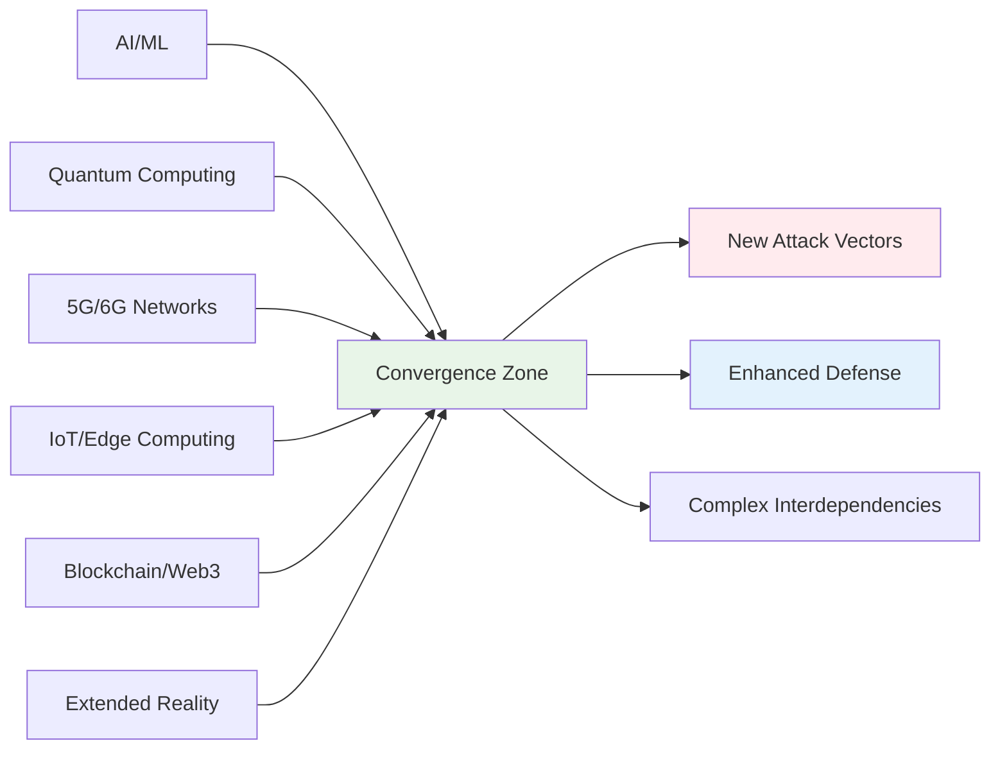

# Emerging Technologies and Future Threats
## Unit V: Cybercrime & Digital Forensics
### Lecture 40: Navigating the Future of Cybersecurity

<div class="absolute bottom-5 left-5 text-xs text-gray-500">
Course: Cyber Security (4353204) | Semester V | Diploma ICT | Author: Milav Dabgar
</div>

---
layout: default
---

# The Evolving Threat Landscape

<div class="grid grid-cols-2 gap-8">

<div>

## 🚀 Technology Convergence Impact

**Emerging technologies** are fundamentally transforming the cybersecurity landscape, creating new attack surfaces while simultaneously offering innovative defense capabilities.

### 📊 Future Technology Statistics (2024-2030)
- **AI-powered attacks**: Expected to grow by 300%
- **Quantum computing**: 15-20 years to cryptographic impact
- **IoT devices**: 75 billion connected by 2030
- **5G network deployment**: 80% global coverage by 2030
- **Edge computing**: $43.4B market by 2030
- **Autonomous systems**: 50% of enterprises using by 2030

### 🔄 Technology Convergence Trends


### 🎯 Paradigm Shifts
```yaml
Security Paradigm Evolution:
  Traditional Security:
    - Perimeter-based defense
    - Static security controls
    - Reactive threat response
    - Human-centric operations
    - Centralized architectures

  Future Security:
    - Zero trust everywhere
    - Adaptive security controls
    - Predictive threat prevention
    - AI-driven operations
    - Distributed architectures

  Key Transformations:
    - From protection to resilience
    - From detection to prediction
    - From response to prevention
    - From human to autonomous
    - From reactive to proactive
```

</div>

<div>

## 🧠 Artificial Intelligence and Machine Learning

### 🤖 AI in Cybersecurity - Dual Nature
```yaml
AI as Cybersecurity Enabler:
  Threat Detection and Analysis:
    - Anomaly detection and behavioral analysis
    - Malware classification and analysis
    - Threat intelligence automation
    - Incident correlation and investigation
    - Risk assessment and scoring

  Security Operations Automation:
    - Automated incident response
    - Security orchestration and playbooks
    - Vulnerability prioritization
    - Compliance monitoring
    - User behavior analytics

  Predictive Security:
    - Threat forecasting and modeling
    - Attack path prediction
    - Risk trend analysis
    - Capacity planning
    - Strategic threat assessment

AI as Attack Vector:
  Adversarial AI Threats:
    - AI model poisoning attacks
    - Adversarial examples and evasion
    - Model extraction and stealing
    - Data poisoning and corruption
    - Privacy inference attacks

  AI-Powered Cyber Attacks:
    - Autonomous attack systems
    - Deepfake and social engineering
    - AI-generated phishing content
    - Automated vulnerability discovery
    - Intelligent evasion techniques
```

### 🔍 AI Security Challenges
```python
# AI Security Risk Assessment Framework
class AICybersecurityAssessment:
    def __init__(self):
        self.risk_categories = self.define_ai_risk_categories()
        self.mitigation_strategies = self.define_mitigation_strategies()
        
    def assess_ai_system_security(self, ai_system_details):
        """Assess security risks in AI systems"""
        assessment = {
            'data_security_risks': self.assess_data_risks(ai_system_details),
            'model_security_risks': self.assess_model_risks(ai_system_details),
            'infrastructure_risks': self.assess_infrastructure_risks(ai_system_details),
            'operational_risks': self.assess_operational_risks(ai_system_details),
            'privacy_risks': self.assess_privacy_risks(ai_system_details)
        }
        
        return assessment
    
    def assess_model_risks(self, system_details):
        """Assess AI model-specific security risks"""
        model_risks = {
            'adversarial_attacks': {
                'risk_level': self.calculate_adversarial_risk(system_details),
                'attack_vectors': [
                    'Adversarial examples generation',
                    'Model evasion techniques',
                    'Input manipulation attacks',
                    'Feature space attacks'
                ],
                'mitigation_approaches': [
                    'Adversarial training',
                    'Input validation and sanitization',
                    'Model ensemble techniques',
                    'Robust architecture design'
                ]
            },
            'model_extraction': {
                'risk_level': self.calculate_extraction_risk(system_details),
                'attack_vectors': [
                    'Black-box model stealing',
                    'API-based model extraction',
                    'Membership inference attacks',
                    'Property inference attacks'
                ],
                'mitigation_approaches': [
                    'Query rate limiting',
                    'Output perturbation',
                    'Differential privacy',
                    'Access control mechanisms'
                ]
            },
            'data_poisoning': {
                'risk_level': self.calculate_poisoning_risk(system_details),
                'attack_vectors': [
                    'Training data manipulation',
                    'Backdoor injection',
                    'Label corruption attacks',
                    'Feature corruption attacks'
                ],
                'mitigation_approaches': [
                    'Data validation and sanitization',
                    'Robust training algorithms',
                    'Data provenance tracking',
                    'Anomaly detection in training data'
                ]
            }
        }
        
        return model_risks
    
    def design_ai_security_framework(self):
        """Design comprehensive AI security framework"""
        framework = {
            'governance_and_policy': {
                'ai_security_policies': 'Comprehensive policies for AI system security',
                'risk_management_procedures': 'AI-specific risk assessment and management',
                'compliance_requirements': 'Regulatory compliance for AI systems',
                'ethical_guidelines': 'Ethical AI development and deployment'
            },
            'secure_development_lifecycle': {
                'secure_design_principles': 'Security by design for AI systems',
                'threat_modeling': 'AI-specific threat modeling methodologies',
                'security_testing': 'Adversarial testing and validation',
                'continuous_monitoring': 'Runtime security monitoring and alerting'
            },
            'technical_controls': {
                'model_protection': 'Model encryption and obfuscation techniques',
                'input_validation': 'Comprehensive input validation and sanitization',
                'output_filtering': 'Output validation and anomaly detection',
                'access_controls': 'Role-based access to AI systems and data'
            },
            'operational_security': {
                'incident_response': 'AI-specific incident response procedures',
                'monitoring_and_logging': 'Comprehensive AI system monitoring',
                'backup_and_recovery': 'AI model and data backup strategies',
                'change_management': 'Secure AI system update and deployment'
            }
        }
        
        return framework
```

</div>

</div>

<div class="absolute bottom-5 left-5 text-xs text-gray-500">
Course: Cyber Security (4353204) | Unit V | Lecture 40 | Author: Milav Dabgar
</div>

---
layout: default
---

# Quantum Computing and Post-Quantum Cryptography

<div class="grid grid-cols-2 gap-8">

<div>

## ⚛️ Quantum Computing Threat

### 🔐 Cryptographic Apocalypse
```yaml
Quantum Computing Impact on Cryptography:
  Current Cryptographic Systems at Risk:
    RSA (Rivest-Shamir-Adleman):
      - Key sizes: 1024, 2048, 4096 bits
      - Quantum threat: Shor's algorithm
      - Time to break: Hours with sufficient qubits
      - Current usage: Digital signatures, key exchange

    Elliptic Curve Cryptography (ECC):
      - Key sizes: 256, 384, 521 bits
      - Quantum threat: Modified Shor's algorithm
      - Time to break: Hours with sufficient qubits
      - Current usage: Mobile devices, IoT, certificates

    Symmetric Encryption (AES):
      - Key sizes: 128, 192, 256 bits
      - Quantum threat: Grover's algorithm
      - Security reduction: Effective key length halved
      - Mitigation: Double key lengths (AES-256 → secure)

    Hash Functions (SHA):
      - Output sizes: 160, 256, 384, 512 bits
      - Quantum threat: Grover's algorithm
      - Security reduction: Effective output length halved
      - Mitigation: Larger output sizes required

Quantum Computing Timeline:
  Current State (2024):
    - 1000+ qubit systems available
    - High error rates and instability
    - Limited practical applications
    - Primarily research and development

  Near Term (2025-2030):
    - Error correction improvements
    - Specialized quantum algorithms
    - Limited cryptographic threat
    - Continued research advancement

  Long Term (2030-2040):
    - Cryptographically relevant quantum computers
    - Practical Shor's algorithm implementation
    - Widespread quantum computing adoption
    - Complete cryptographic paradigm shift
```

### 🛡️ Post-Quantum Cryptography
```python
# Post-Quantum Cryptography Implementation Framework
class PostQuantumCrypto:
    def __init__(self):
        self.pqc_algorithms = self.define_pqc_algorithms()
        self.migration_strategies = self.define_migration_strategies()
        
    def define_pqc_algorithms(self):
        """Define NIST-approved post-quantum cryptographic algorithms"""
        algorithms = {
            'digital_signatures': {
                'CRYSTALS_Dilithium': {
                    'security_basis': 'Lattice-based (Module-LWE)',
                    'key_sizes': {'public': '1312-2592 bytes', 'private': '2544-4896 bytes'},
                    'signature_size': '2420-4595 bytes',
                    'performance': 'Fast signing and verification',
                    'recommended_use': 'General purpose digital signatures'
                },
                'FALCON': {
                    'security_basis': 'Lattice-based (NTRU)',
                    'key_sizes': {'public': '897-1793 bytes', 'private': '1281-2305 bytes'},
                    'signature_size': '666-1280 bytes',
                    'performance': 'Compact signatures, slower key generation',
                    'recommended_use': 'Bandwidth-constrained environments'
                },
                'SPHINCS_Plus': {
                    'security_basis': 'Hash-based',
                    'key_sizes': {'public': '32-64 bytes', 'private': '64-128 bytes'},
                    'signature_size': '7856-49856 bytes',
                    'performance': 'Large signatures, stateless',
                    'recommended_use': 'Long-term security, firmware signing'
                }
            },
            'key_establishment': {
                'CRYSTALS_KYBER': {
                    'security_basis': 'Lattice-based (Module-LWE)',
                    'key_sizes': {'public': '800-1568 bytes', 'private': '1632-3168 bytes'},
                    'ciphertext_size': '768-1568 bytes',
                    'performance': 'Fast encapsulation and decapsulation',
                    'recommended_use': 'TLS, VPN, general key exchange'
                }
            },
            'alternative_candidates': {
                'BIKE': {
                    'security_basis': 'Code-based',
                    'status': 'Alternative candidate',
                    'advantages': 'Smaller key sizes than lattice-based'
                },
                'HQC': {
                    'security_basis': 'Code-based',
                    'status': 'Alternative candidate',
                    'advantages': 'Efficient implementation possible'
                }
            }
        }
        
        return algorithms
    
    def create_migration_roadmap(self, current_infrastructure):
        """Create post-quantum cryptography migration roadmap"""
        roadmap = {
            'phase_1_assessment': {
                'duration': '6-12 months',
                'activities': [
                    'Cryptographic inventory and discovery',
                    'Risk assessment and prioritization',
                    'Performance and compatibility testing',
                    'Vendor capability assessment',
                    'Policy and procedure updates'
                ],
                'deliverables': [
                    'Cryptographic asset inventory',
                    'Migration risk assessment',
                    'Technical compatibility matrix',
                    'Vendor readiness report'
                ]
            },
            'phase_2_pilot_implementation': {
                'duration': '6-18 months',
                'activities': [
                    'Pilot system selection and setup',
                    'PQC algorithm implementation',
                    'Performance testing and optimization',
                    'Security validation and testing',
                    'Operational procedure development'
                ],
                'deliverables': [
                    'Pilot implementation results',
                    'Performance benchmarks',
                    'Security validation reports',
                    'Operational procedures'
                ]
            },
            'phase_3_gradual_rollout': {
                'duration': '12-36 months',
                'activities': [
                    'Prioritized system migrations',
                    'Hybrid cryptographic implementations',
                    'Continuous monitoring and testing',
                    'Staff training and education',
                    'Vendor coordination and management'
                ],
                'deliverables': [
                    'Migration completion reports',
                    'Hybrid system configurations',
                    'Training materials and programs',
                    'Vendor management framework'
                ]
            },
            'phase_4_full_transition': {
                'duration': '6-24 months',
                'activities': [
                    'Complete legacy system retirement',
                    'Full PQC implementation',
                    'Comprehensive security validation',
                    'Compliance and certification',
                    'Continuous improvement processes'
                ],
                'deliverables': [
                    'Complete PQC implementation',
                    'Security certification reports',
                    'Compliance documentation',
                    'Ongoing maintenance procedures'
                ]
            }
        }
        
        return roadmap
```

</div>

<div>

## 🌐 5G, IoT, and Edge Computing Security

### 📡 5G Security Landscape
```yaml
5G Security Challenges:
  Network Architecture:
    - Network function virtualization (NFV)
    - Software-defined networking (SDN)
    - Network slicing and isolation
    - Edge computing integration
    - Cloud-native architectures

  Security Enhancements:
    - Enhanced authentication and encryption
    - Network slice isolation
    - Improved privacy protections
    - Zero trust network architecture
    - Advanced threat detection

  New Attack Surfaces:
    - Massive IoT device connectivity
    - Edge computing vulnerabilities
    - Network slice interference
    - Supply chain risks
    - API and orchestration attacks

  Mitigation Strategies:
    - Security by design principles
    - Continuous security monitoring
    - Advanced threat intelligence
    - Zero trust implementation
    - International cooperation frameworks

IoT and Edge Security Challenges:
  Device-Level Security:
    - Weak authentication mechanisms
    - Insufficient encryption implementations
    - Limited update and patch capabilities
    - Hardware-based vulnerabilities
    - Physical access and tampering

  Network-Level Security:
    - Massive scale connectivity
    - Heterogeneous device ecosystems
    - Bandwidth and latency constraints
    - Protocol vulnerabilities
    - Network segmentation challenges

  Data and Privacy Concerns:
    - Sensitive data collection and processing
    - Data sovereignty and location
    - Privacy regulation compliance
    - Consent and transparency challenges
    - Data minimization and purpose limitation
```

### 🔗 Blockchain and Distributed Systems
```python
# Blockchain Security Assessment Framework
class BlockchainSecurity:
    def __init__(self):
        self.security_dimensions = self.define_security_dimensions()
        self.threat_models = self.define_threat_models()
        
    def assess_blockchain_security(self, blockchain_implementation):
        """Assess blockchain and distributed ledger security"""
        assessment = {
            'consensus_mechanism_security': self.assess_consensus_security(blockchain_implementation),
            'smart_contract_security': self.assess_smart_contract_security(blockchain_implementation),
            'network_security': self.assess_network_security(blockchain_implementation),
            'cryptographic_security': self.assess_cryptographic_security(blockchain_implementation),
            'governance_security': self.assess_governance_security(blockchain_implementation)
        }
        
        return assessment
    
    def define_security_dimensions(self):
        """Define blockchain security dimensions"""
        dimensions = {
            'consensus_security': {
                'proof_of_work': {
                    'strengths': ['Battle-tested security', 'Decentralization'],
                    'weaknesses': ['Energy consumption', '51% attack risk'],
                    'mitigations': ['Hash rate distribution', 'Economic incentives']
                },
                'proof_of_stake': {
                    'strengths': ['Energy efficiency', 'Economic security'],
                    'weaknesses': ['Nothing at stake', 'Long-range attacks'],
                    'mitigations': ['Slashing conditions', 'Checkpointing']
                },
                'delegated_proof_of_stake': {
                    'strengths': ['High throughput', 'Energy efficiency'],
                    'weaknesses': ['Centralization risk', 'Governance attacks'],
                    'mitigations': ['Validator rotation', 'Stake distribution']
                }
            },
            'smart_contract_security': {
                'common_vulnerabilities': [
                    'Reentrancy attacks',
                    'Integer overflow/underflow',
                    'Unchecked external calls',
                    'Access control failures',
                    'Front-running attacks'
                ],
                'security_practices': [
                    'Formal verification methods',
                    'Comprehensive testing and auditing',
                    'Security-focused development frameworks',
                    'Bug bounty programs',
                    'Continuous monitoring and analysis'
                ]
            },
            'network_security': {
                'p2p_network_risks': [
                    'Sybil attacks',
                    'Eclipse attacks',
                    'DDoS attacks',
                    'Network partitioning',
                    'Routing attacks'
                ],
                'mitigation_strategies': [
                    'Peer reputation systems',
                    'Network diversity requirements',
                    'Rate limiting and throttling',
                    'Redundant network paths',
                    'Network monitoring and analysis'
                ]
            }
        }
        
        return dimensions
    
    def design_defi_security_framework(self):
        """Design security framework for DeFi applications"""
        framework = {
            'protocol_security': {
                'smart_contract_auditing': 'Multi-party security audits',
                'formal_verification': 'Mathematical proof of correctness',
                'testing_frameworks': 'Comprehensive testing suites',
                'bug_bounty_programs': 'Incentivized vulnerability discovery'
            },
            'economic_security': {
                'tokenomics_analysis': 'Economic model security assessment',
                'liquidity_risk_management': 'Liquidity provision and withdrawal risks',
                'oracle_security': 'Price feed manipulation prevention',
                'governance_security': 'Decentralized governance security'
            },
            'operational_security': {
                'incident_response': 'DeFi-specific incident response procedures',
                'monitoring_and_alerting': 'Real-time protocol monitoring',
                'emergency_procedures': 'Protocol pause and upgrade mechanisms',
                'insurance_and_coverage': 'DeFi insurance protocol integration'
            }
        }
        
        return framework
```

</div>

</div>

<div class="absolute bottom-5 left-5 text-xs text-gray-500">
Course: Cyber Security (4353204) | Unit V | Lecture 40 | Author: Milav Dabgar
</div>

---
layout: default
---

# Extended Reality and Metaverse Security

<div class="grid grid-cols-2 gap-8">

<div>

## 🥽 Extended Reality (XR) Security Challenges

### 🌐 Virtual and Augmented Reality Threats
```yaml
XR Security Threat Landscape:
  Hardware-Level Threats:
    Sensor Manipulation:
      - IMU (Inertial Measurement Unit) spoofing
      - Camera feed manipulation
      - Audio injection attacks
      - Haptic feedback interference
      - GPS and location spoofing

    Biometric Data Theft:
      - Eye tracking data extraction
      - Facial recognition bypass
      - Voice pattern stealing
      - Gesture recognition manipulation
      - Physiological response monitoring

  Software and Platform Threats:
    Application Layer Attacks:
      - Malicious XR applications
      - Code injection in virtual environments
      - Cross-platform vulnerabilities
      - API abuse and exploitation
      - Virtual object manipulation

    Network and Communication Threats:
      - Man-in-the-middle attacks on XR traffic
      - Latency manipulation attacks
      - Bandwidth exhaustion attacks
      - Protocol vulnerabilities
      - Edge computing compromise

  Social and Psychological Threats:
    Virtual Harassment and Abuse:
      - Avatar-based harassment
      - Virtual space invasion
      - Psychological manipulation
      - Identity impersonation
      - Social engineering in virtual spaces

    Privacy and Surveillance:
      - Behavioral pattern analysis
      - Real-world activity inference
      - Emotional state monitoring
      - Social graph mapping
      - Personal space violation
```

### 🏙️ Metaverse Security Framework
```python
# Metaverse Security Architecture
class MetaverseSecurity:
    def __init__(self):
        self.security_domains = self.define_security_domains()
        self.governance_models = self.define_governance_models()
        
    def design_metaverse_security_architecture(self):
        """Design comprehensive metaverse security architecture"""
        architecture = {
            'identity_and_access_management': {
                'digital_identity_systems': {
                    'components': [
                        'Decentralized identity (DID) systems',
                        'Verifiable credentials',
                        'Biometric authentication',
                        'Multi-factor authentication',
                        'Zero-knowledge proofs'
                    ],
                    'security_requirements': [
                        'Privacy-preserving identity verification',
                        'Cross-platform identity portability',
                        'Consent management and control',
                        'Identity theft prevention',
                        'Pseudonymity and anonymity options'
                    ]
                },
                'access_control_mechanisms': {
                    'virtual_space_access': 'Role-based access control for virtual environments',
                    'object_interaction_permissions': 'Fine-grained permissions for virtual objects',
                    'social_interaction_controls': 'Consent-based social interaction management',
                    'content_access_management': 'Age-appropriate and context-aware content filtering'
                }
            },
            'virtual_asset_security': {
                'nft_and_digital_asset_protection': {
                    'ownership_verification': 'Cryptographic proof of ownership',
                    'transfer_security': 'Secure asset transfer protocols',
                    'anti_counterfeiting': 'Provenance tracking and verification',
                    'intellectual_property': 'Copyright and trademark protection'
                },
                'virtual_economy_security': {
                    'transaction_security': 'Secure virtual currency transactions',
                    'market_manipulation_prevention': 'Anti-fraud and manipulation controls',
                    'economic_stability': 'Economic model security and stability',
                    'regulatory_compliance': 'Financial regulation adherence'
                }
            },
            'content_and_experience_security': {
                'content_integrity': {
                    'deepfake_detection': 'AI-generated content identification',
                    'content_authenticity': 'Digital content provenance verification',
                    'manipulation_prevention': 'Real-time content tampering detection',
                    'quality_assurance': 'Content quality and safety validation'
                },
                'experience_safety': {
                    'motion_sickness_prevention': 'Safe VR experience guidelines',
                    'epilepsy_and_seizure_protection': 'Photosensitive content filtering',
                    'psychological_safety': 'Mental health protection measures',
                    'addiction_prevention': 'Usage monitoring and intervention'
                }
            }
        }
        
        return architecture
    
    def develop_metaverse_governance_framework(self):
        """Develop governance framework for metaverse security"""
        governance = {
            'regulatory_compliance': {
                'data_protection': {
                    'gdpr_compliance': 'EU data protection regulation adherence',
                    'ccpa_compliance': 'California consumer privacy act compliance',
                    'sector_specific_regulations': 'Industry-specific regulatory requirements',
                    'cross_border_data_transfer': 'International data transfer protocols'
                },
                'content_moderation': {
                    'community_standards': 'Platform-specific community guidelines',
                    'automated_content_screening': 'AI-powered content moderation',
                    'human_oversight': 'Human moderator review processes',
                    'appeal_mechanisms': 'User appeal and review procedures'
                }
            },
            'multi_stakeholder_governance': {
                'platform_operators': 'Platform security responsibilities and obligations',
                'users_and_creators': 'User rights and responsibilities in virtual spaces',
                'regulators': 'Government oversight and regulatory frameworks',
                'technology_providers': 'Infrastructure and technology security requirements'
            },
            'standards_and_interoperability': {
                'security_standards': 'Industry-wide security standards for metaverse',
                'interoperability_protocols': 'Cross-platform security and data exchange',
                'certification_programs': 'Security certification for metaverse platforms',
                'best_practice_guidelines': 'Industry best practices and recommendations'
            }
        }
        
        return governance
```

</div>

<div>

## 🔮 Future Cybersecurity Trends and Predictions

### 📈 Cybersecurity Evolution Roadmap
```yaml
Short-Term Trends (2024-2027):
  AI and Automation Integration:
    - AI-powered security operations centers (SOCs)
    - Automated incident response and remediation
    - Intelligent threat hunting and analysis
    - Predictive vulnerability management
    - Dynamic security policy adaptation

  Zero Trust Architecture Maturation:
    - Network micro-segmentation adoption
    - Identity-centric security models
    - Continuous authentication and authorization
    - Device and application zero trust
    - Cloud-native zero trust implementations

  Privacy-Enhancing Technologies:
    - Homomorphic encryption deployment
    - Secure multi-party computation
    - Differential privacy implementations
    - Privacy-preserving machine learning
    - Confidential computing adoption

Medium-Term Trends (2027-2032):
  Quantum-Safe Cryptography:
    - Post-quantum cryptography transition
    - Quantum key distribution networks
    - Hybrid classical-quantum systems
    - Quantum-resistant blockchain implementations
    - Quantum security protocols

  Autonomous Cybersecurity:
    - Self-healing security systems
    - Autonomous threat response
    - AI-driven security architecture
    - Predictive defense mechanisms
    - Adaptive security ecosystems

  Extended Reality Security:
    - Immersive security training platforms
    - Virtual security operations centers
    - Augmented reality threat visualization
    - Metaverse security frameworks
    - Digital twin security modeling

Long-Term Vision (2032+):
  Cognitive Security Systems:
    - Human-AI collaborative security
    - Neuromorphic computing security
    - Brain-computer interface protection
    - Consciousness-aware security models
    - Ethical AI security frameworks

  Quantum-Native Security:
    - Quantum computing integration
    - Quantum internet security
    - Quantum-encrypted communications
    - Quantum sensing and detection
    - Quantum-resilient architectures
```

### 🎯 Strategic Preparation Framework
```python
# Future-Ready Cybersecurity Strategy
class FutureCyberStrategy:
    def __init__(self):
        self.trend_analysis = self.analyze_emerging_trends()
        self.preparation_strategies = self.define_preparation_strategies()
        
    def develop_future_readiness_plan(self, organization_context):
        """Develop comprehensive future readiness plan"""
        plan = {
            'technology_roadmap': self.create_technology_roadmap(organization_context),
            'capability_development': self.plan_capability_development(organization_context),
            'risk_anticipation': self.anticipate_future_risks(organization_context),
            'innovation_framework': self.design_innovation_framework(organization_context),
            'adaptation_mechanisms': self.create_adaptation_mechanisms(organization_context)
        }
        
        return plan
    
    def create_technology_roadmap(self, context):
        """Create technology adoption roadmap"""
        roadmap = {
            'immediate_priorities': {
                'ai_ml_integration': {
                    'timeline': '2024-2025',
                    'investments': [
                        'AI-powered SIEM and SOAR platforms',
                        'Machine learning threat detection',
                        'Automated vulnerability management',
                        'Intelligent user behavior analytics'
                    ],
                    'expected_outcomes': [
                        'Reduced mean time to detection',
                        'Automated threat response',
                        'Improved accuracy in threat identification',
                        'Enhanced operational efficiency'
                    ]
                },
                'zero_trust_implementation': {
                    'timeline': '2024-2026',
                    'investments': [
                        'Identity and access management modernization',
                        'Network micro-segmentation',
                        'Device trust verification',
                        'Application security integration'
                    ],
                    'expected_outcomes': [
                        'Reduced attack surface',
                        'Improved access control',
                        'Enhanced threat containment',
                        'Better compliance posture'
                    ]
                }
            },
            'medium_term_goals': {
                'quantum_readiness': {
                    'timeline': '2026-2030',
                    'investments': [
                        'Post-quantum cryptography pilot programs',
                        'Quantum-safe algorithm implementation',
                        'Cryptographic agility framework',
                        'Quantum threat assessment capabilities'
                    ],
                    'expected_outcomes': [
                        'Quantum-resistant security posture',
                        'Cryptographic future-proofing',
                        'Competitive advantage in quantum era',
                        'Regulatory compliance readiness'
                    ]
                },
                'autonomous_security': {
                    'timeline': '2027-2032',
                    'investments': [
                        'Self-healing security systems',
                        'Autonomous incident response',
                        'Predictive threat modeling',
                        'Adaptive security architectures'
                    ],
                    'expected_outcomes': [
                        'Autonomous threat mitigation',
                        'Proactive security posture',
                        'Reduced human intervention needs',
                        'Continuous security optimization'
                    ]
                }
            }
        }
        
        return roadmap
    
    def design_continuous_learning_framework(self):
        """Design framework for continuous learning and adaptation"""
        framework = {
            'threat_intelligence_evolution': {
                'emerging_threat_monitoring': 'Continuous monitoring of emerging threats',
                'technology_trend_analysis': 'Analysis of technology trends and implications',
                'adversary_capability_assessment': 'Assessment of evolving adversary capabilities',
                'attack_technique_evolution': 'Tracking of attack technique evolution'
            },
            'organizational_learning': {
                'experimentation_programs': 'Structured experimentation with new technologies',
                'pilot_implementation_cycles': 'Regular pilot programs for emerging solutions',
                'lessons_learned_integration': 'Systematic integration of lessons learned',
                'knowledge_sharing_networks': 'Internal and external knowledge sharing'
            },
            'adaptive_capabilities': {
                'rapid_deployment_mechanisms': 'Ability to quickly deploy new security measures',
                'flexible_architecture_design': 'Architecture designed for rapid adaptation',
                'cross_functional_collaboration': 'Enhanced collaboration across disciplines',
                'external_partnership_development': 'Strategic partnerships for innovation'
            }
        }
        
        return framework
```

</div>

</div>

<div class="absolute bottom-5 left-5 text-xs text-gray-500">
Course: Cyber Security (4353204) | Unit V | Lecture 40 | Author: Milav Dabgar
</div>

---
layout: default
---

# Practical Exercise: Future-Ready Security Strategy

<div class="exercise-container">

## 🎯 Next-Generation Cybersecurity Planning (35 minutes)

### Mission: Future-Proof Security Architecture

Design a comprehensive future-ready cybersecurity strategy for **"InnovateTech Corporation"** - a technology company preparing for the next decade of digital transformation and emerging threats.

### 🚀 Future Challenge Context
**Organizational Vision:**
- **Leading technology innovator** in AI, IoT, and quantum computing
- **Global expansion** into emerging markets and technologies
- **Digital-first strategy** with metaverse and Web3 initiatives
- **Regulatory compliance** across multiple jurisdictions and emerging laws
- **Stakeholder expectations** for cutting-edge security and privacy protection
- **10-year strategic horizon** requiring adaptable and scalable security architecture

### Phase 1: Emerging Threat Landscape Analysis (15 minutes)

**Team Assignment: Future Threat Assessment**

1. **Technology Convergence Impact Assessment**
   - Analyze security implications of AI/ML, quantum computing, 5G/6G, and IoT convergence
   - Identify new attack surfaces and threat vectors from emerging technologies
   - Assess potential impact of post-quantum cryptography transition
   - Plan for metaverse, extended reality, and Web3 security challenges

2. **Adversary Evolution and Capability Projection**
   - Project evolution of threat actor capabilities over the next decade
   - Analyze potential for AI-powered autonomous attacks
   - Assess geopolitical impacts on cybersecurity landscape
   - Plan for quantum-enabled attack capabilities

### Phase 2: Future-Ready Architecture Design (12 minutes)

**Next-Generation Security Framework:**
1. **Adaptive and Autonomous Security Architecture**
   - Design AI-driven autonomous security operations framework
   - Plan zero trust architecture evolution for emerging technologies
   - Create quantum-safe cryptographic transition strategy
   - Design privacy-preserving security architecture for new data types

2. **Innovation and Technology Integration Strategy**
   - Plan emerging technology security integration roadmap
   - Design experimentation and pilot program frameworks
   - Create vendor ecosystem and partnership strategy
   - Plan workforce development for future security skills

### Phase 3: Strategic Implementation and Governance (8 minutes)

**Strategic Execution Framework:**
1. **Organizational Transformation and Change Management**
   - Design organizational structure for future security challenges
   - Plan culture and mindset transformation for emerging technologies
   - Create governance framework for new technology adoption
   - Design stakeholder engagement strategy for future security investments

2. **Continuous Evolution and Adaptation Mechanisms**
   - Create continuous learning and adaptation framework
   - Design performance measurement for future-ready capabilities
   - Plan scenario-based stress testing and preparedness assessment
   - Create innovation pipeline and emerging threat response mechanisms

**Deliverables:**
- Comprehensive 10-year future-ready cybersecurity strategy
- Emerging technology security architecture and integration roadmap
- Adaptive governance and organizational transformation plan
- Continuous evolution framework with performance measurement and adaptation mechanisms

</div>

<style>
.exercise-container {
  @apply bg-blue-50 border-2 border-blue-300 rounded-lg p-6;
}
</style>

<div class="absolute bottom-5 left-5 text-xs text-gray-500">
Course: Cyber Security (4353204) | Unit V | Lecture 40 | Author: Milav Dabgar
</div>

---
layout: center
class: text-center
---

# Questions & Discussion

## 🤔 Future Security Considerations:
- How do you prepare for cybersecurity challenges that don't yet exist?
- What role will quantum computing play in the future of cybersecurity?
- How can organizations balance innovation with security in emerging technologies?

### 💡 Exercise Review
Present your future-ready security strategies and discuss technology evolution approaches

<div class="absolute bottom-5 left-5 text-xs text-gray-500">
Course: Cyber Security (4353204) | Unit V | Lecture 40 | Author: Milav Dabgar
</div>

---
layout: center
class: text-center
---

# Thank You!

## Next Lecture: Professional Development and Career Paths
### Building Your Cybersecurity Career

<div class="pt-8 text-gray-500">
  <p>Cyber Security (4353204) - Lecture 40 Complete</p>
  <p>Future security: Preparing for tomorrow's challenges today! 🚀🔮</p>
</div>

<div class="absolute bottom-5 left-5 text-xs text-gray-500">
Course: Cyber Security (4353204) | Unit V | Lecture 40 | Author: Milav Dabgar
</div>