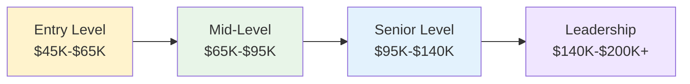

# Professional Development and Career Paths
## Unit V: Cybercrime & Digital Forensics
### Lecture 41: Navigating Your Cybersecurity Career Journey

<div class="absolute bottom-5 left-5 text-xs text-gray-500">
Course: Cyber Security (4353204) | Semester V | Diploma ICT | Author: Milav Dabgar
</div>

---
layout: default
---

# Cybersecurity Career Landscape

<div class="grid grid-cols-2 gap-8">

<div>

## 🎯 Industry Overview and Opportunities

**Cybersecurity** is one of the fastest-growing career fields, offering diverse opportunities across all industries and sectors.

### 📊 Cybersecurity Job Market Statistics (2024)
- **Global cybersecurity workforce shortage**: 4+ million positions
- **Job growth rate**: 35% annually (10x faster than average)
- **Average salary increase**: 15-20% year-over-year
- **Remote work opportunities**: 78% of positions offer remote options
- **Industry diversity**: Available in all sectors and organization sizes
- **Career longevity**: High job security and advancement opportunities

### 🏢 Industry Sectors and Opportunities
```yaml
High-Demand Sectors:
  Financial Services:
    - Banks and investment firms
    - Insurance companies
    - Fintech startups
    - Cryptocurrency and blockchain
    - Regulatory compliance focus

  Healthcare:
    - Hospitals and healthcare systems
    - Medical device manufacturers
    - Health insurance providers
    - Telemedicine platforms
    - HIPAA compliance specialization

  Government and Defense:
    - Federal agencies and departments
    - State and local government
    - Defense contractors
    - Intelligence agencies
    - Critical infrastructure protection

  Technology:
    - Software and hardware companies
    - Cloud service providers
    - Cybersecurity vendors
    - Consulting firms
    - Managed security service providers

  Critical Infrastructure:
    - Energy and utilities
    - Transportation systems
    - Telecommunications
    - Water treatment facilities
    - Manufacturing and industrial
```

### 📈 Salary Expectations and Growth


</div>

<div>

## 💼 Career Paths and Specializations

### 🛡️ Technical Career Paths
```yaml
Security Analyst and Operations:
  Entry-Level Roles:
    - SOC Analyst I/II
    - Incident Response Analyst
    - Vulnerability Analyst
    - Compliance Analyst
    - Security Technician

  Mid-Level Roles:
    - Senior Security Analyst
    - Incident Response Specialist
    - Threat Intelligence Analyst
    - Security Operations Center Lead
    - Cybersecurity Consultant

  Senior-Level Roles:
    - Principal Security Engineer
    - Lead Incident Response Manager
    - Threat Intelligence Manager
    - Security Architecture Designer
    - Cybersecurity Practice Lead

Security Engineering and Architecture:
  Technical Focus Areas:
    - Network security engineering
    - Cloud security architecture
    - Application security engineering
    - Identity and access management
    - Cryptography and PKI

  Career Progression:
    - Junior Security Engineer
    - Security Engineer
    - Senior Security Engineer
    - Principal/Staff Security Engineer
    - Security Architecture Manager
```

### 👨‍💼 Management and Leadership Paths
```python
# Cybersecurity Leadership Career Framework
class CyberLeadershipPath:
    def __init__(self):
        self.leadership_levels = self.define_leadership_levels()
        self.skill_requirements = self.define_skill_requirements()
        
    def define_leadership_levels(self):
        """Define cybersecurity leadership career levels"""
        levels = {
            'team_lead': {
                'title_examples': [
                    'Security Team Lead',
                    'SOC Manager',
                    'Incident Response Team Lead',
                    'Compliance Team Lead'
                ],
                'responsibilities': [
                    'Lead small teams (3-8 people)',
                    'Manage daily operations and workflows',
                    'Technical oversight and mentoring',
                    'Project coordination and execution',
                    'Performance management and feedback'
                ],
                'required_experience': '3-5 years technical + 1-2 years leadership',
                'typical_salary_range': '$75K - $110K'
            },
            'department_manager': {
                'title_examples': [
                    'Cybersecurity Manager',
                    'IT Security Manager',
                    'Risk Management Manager',
                    'Compliance Manager'
                ],
                'responsibilities': [
                    'Manage multiple teams or departments',
                    'Budget planning and resource allocation',
                    'Strategic planning and implementation',
                    'Stakeholder communication and reporting',
                    'Policy development and governance'
                ],
                'required_experience': '5-8 years technical + 2-4 years management',
                'typical_salary_range': '$100K - $150K'
            },
            'senior_executive': {
                'title_examples': [
                    'Chief Information Security Officer (CISO)',
                    'VP of Cybersecurity',
                    'Director of Information Security',
                    'Chief Risk Officer (CRO)'
                ],
                'responsibilities': [
                    'Enterprise-wide security strategy',
                    'Board and executive communication',
                    'Organizational risk management',
                    'Regulatory compliance oversight',
                    'Industry leadership and representation'
                ],
                'required_experience': '8-15+ years with progressive leadership',
                'typical_salary_range': '$150K - $300K+'
            }
        }
        
        return levels
    
    def create_career_development_plan(self, current_role, target_role, timeframe):
        """Create personalized career development plan"""
        development_plan = {
            'current_assessment': self.assess_current_capabilities(current_role),
            'gap_analysis': self.identify_skill_gaps(current_role, target_role),
            'development_activities': self.recommend_development_activities(current_role, target_role),
            'milestone_planning': self.create_milestone_plan(timeframe),
            'success_metrics': self.define_success_metrics(target_role)
        }
        
        return development_plan
    
    def recommend_development_activities(self, current_role, target_role):
        """Recommend specific development activities"""
        activities = {
            'technical_skills': [
                'Advanced cybersecurity certifications',
                'Specialized training in emerging technologies',
                'Hands-on lab exercises and practice',
                'Industry conference presentations',
                'Technical blog writing and thought leadership'
            ],
            'leadership_skills': [
                'Management and leadership training programs',
                'Executive coaching and mentorship',
                'Cross-functional project leadership',
                'Public speaking and communication training',
                'Business acumen and strategy courses'
            ],
            'industry_knowledge': [
                'Industry association participation',
                'Professional networking events',
                'Board advisory or volunteer positions',
                'Regulatory and compliance education',
                'Market research and competitive analysis'
            ],
            'practical_experience': [
                'Stretch assignments and new responsibilities',
                'Cross-functional team leadership',
                'Client-facing roles and presentations',
                'Crisis management and incident leadership',
                'Strategic planning and implementation projects'
            ]
        }
        
        return activities
```

### 🔬 Specialized Career Paths
```yaml
Digital Forensics and Incident Response:
  Career Progression:
    - Digital Forensics Technician
    - Forensics Analyst
    - Senior Forensics Specialist
    - Forensics Team Lead
    - Chief Forensics Officer

  Specialization Areas:
    - Computer forensics
    - Mobile device forensics
    - Network forensics
    - Malware analysis
    - Legal and compliance forensics

Penetration Testing and Ethical Hacking:
  Career Progression:
    - Junior Penetration Tester
    - Penetration Tester
    - Senior Penetration Tester
    - Principal Consultant
    - Practice Lead/Director

  Specialization Areas:
    - Web application testing
    - Network penetration testing
    - Mobile application testing
    - Social engineering assessments
    - Red team operations

Risk Management and Governance:
  Career Progression:
    - Risk Analyst
    - Risk Assessment Specialist
    - Senior Risk Manager
    - Enterprise Risk Manager
    - Chief Risk Officer

  Focus Areas:
    - Enterprise risk management
    - Regulatory compliance
    - Business continuity planning
    - Third-party risk management
    - Cyber insurance and finance
```

</div>

</div>

<div class="absolute bottom-5 left-5 text-xs text-gray-500">
Course: Cyber Security (4353204) | Unit V | Lecture 41 | Author: Milav Dabgar
</div>

---
layout: default
---

# Essential Skills and Competencies

<div class="grid grid-cols-2 gap-8">

<div>

## 🛠️ Technical Skills Framework

### 💻 Core Technical Competencies
```python
# Cybersecurity Skills Assessment Framework
class CybersecuritySkills:
    def __init__(self):
        self.technical_skills = self.define_technical_skills()
        self.soft_skills = self.define_soft_skills()
        self.skill_levels = ['Beginner', 'Intermediate', 'Advanced', 'Expert']
        
    def define_technical_skills(self):
        """Define comprehensive technical skill categories"""
        skills = {
            'foundational_skills': {
                'networking_fundamentals': {
                    'importance': 'Critical',
                    'description': 'Understanding of TCP/IP, routing, switching, firewalls',
                    'learning_resources': [
                        'Cisco CCNA certification',
                        'CompTIA Network+ certification',
                        'Hands-on lab environments (Packet Tracer, GNS3)',
                        'Network troubleshooting experience'
                    ],
                    'practical_application': [
                        'Network security assessments',
                        'Incident response investigations',
                        'Security architecture design',
                        'Threat hunting activities'
                    ]
                },
                'operating_systems': {
                    'importance': 'Critical',
                    'description': 'Proficiency in Windows, Linux, and macOS administration',
                    'learning_resources': [
                        'Microsoft certification paths (MCSA/MCSE)',
                        'Linux certification (RHCE, LPIC)',
                        'Hands-on system administration experience',
                        'Command-line interface mastery'
                    ],
                    'practical_application': [
                        'System hardening and configuration',
                        'Log analysis and investigation',
                        'Malware analysis and removal',
                        'User access management'
                    ]
                },
                'security_fundamentals': {
                    'importance': 'Critical',
                    'description': 'Core security principles, controls, and frameworks',
                    'learning_resources': [
                        'CompTIA Security+ certification',
                        'CISSP or SSCP certification',
                        'Security framework training (NIST, ISO 27001)',
                        'Risk management methodologies'
                    ],
                    'practical_application': [
                        'Security policy development',
                        'Risk assessments and analysis',
                        'Compliance and audit support',
                        'Security control implementation'
                    ]
                }
            },
            'specialized_skills': {
                'incident_response': {
                    'importance': 'High',
                    'description': 'Ability to detect, analyze, and respond to security incidents',
                    'key_competencies': [
                        'Digital forensics techniques',
                        'Malware analysis and reverse engineering',
                        'Log analysis and correlation',
                        'Evidence collection and preservation',
                        'Crisis communication and coordination'
                    ]
                },
                'vulnerability_management': {
                    'importance': 'High',
                    'description': 'Identification, assessment, and remediation of vulnerabilities',
                    'key_competencies': [
                        'Vulnerability scanning tools (Nessus, Qualys, OpenVAS)',
                        'Penetration testing methodologies',
                        'Risk assessment and prioritization',
                        'Patch management processes',
                        'Security testing and validation'
                    ]
                },
                'cloud_security': {
                    'importance': 'High',
                    'description': 'Security in cloud environments and services',
                    'key_competencies': [
                        'AWS, Azure, or GCP security services',
                        'Container and orchestration security',
                        'Identity and access management (IAM)',
                        'Cloud compliance and governance',
                        'DevSecOps practices and tools'
                    ]
                }
            },
            'emerging_skills': {
                'artificial_intelligence': {
                    'importance': 'Growing',
                    'description': 'AI/ML applications in cybersecurity',
                    'development_focus': [
                        'Machine learning fundamentals',
                        'AI security and adversarial attacks',
                        'Automated threat detection',
                        'Behavioral analytics',
                        'Natural language processing for security'
                    ]
                },
                'blockchain_and_crypto': {
                    'importance': 'Growing',
                    'description': 'Distributed ledger and cryptocurrency security',
                    'development_focus': [
                        'Blockchain security principles',
                        'Smart contract auditing',
                        'Cryptocurrency investigation',
                        'DeFi security analysis',
                        'NFT and digital asset protection'
                    ]
                }
            }
        }
        
        return skills
    
    def create_skill_development_roadmap(self, career_goal, current_level):
        """Create personalized skill development roadmap"""
        roadmap = {
            'immediate_priorities': self.identify_immediate_skills(career_goal, current_level),
            'medium_term_goals': self.identify_medium_term_skills(career_goal),
            'long_term_objectives': self.identify_long_term_skills(career_goal),
            'learning_resources': self.recommend_learning_resources(career_goal),
            'practical_experience': self.recommend_hands_on_activities(career_goal)
        }
        
        return roadmap
```

### 📚 Continuous Learning Strategy
```yaml
Learning Approaches and Resources:
  Formal Education:
    - Cybersecurity degree programs (Bachelor's, Master's)
    - Professional certification programs
    - University extension and continuing education
    - Online degree programs and MOOCs
    - Corporate university and internal training

  Industry Certifications:
    Entry-Level Certifications:
      - CompTIA Security+
      - CompTIA Network+
      - (ISC)² Systems Security Certified Practitioner (SSCP)
      - EC-Council Computer Hacking Forensic Investigator Associate

    Intermediate Certifications:
      - Certified Ethical Hacker (CEH)
      - CompTIA CySA+ (Cybersecurity Analyst)
      - CompTIA CASP+ (Advanced Security Practitioner)
      - GIAC Security Essentials (GSEC)

    Advanced Certifications:
      - Certified Information Systems Security Professional (CISSP)
      - Certified Information Security Manager (CISM)
      - Certified in Risk and Information Systems Control (CRISC)
      - GIAC Expert-Level Certifications

  Hands-On Learning:
    - Home lab environments and virtualization
    - Capture The Flag (CTF) competitions
    - Bug bounty programs and ethical hacking
    - Open source project contributions
    - Personal project development and documentation

  Professional Development:
    - Industry conferences and workshops
    - Professional association membership
    - Networking events and meetups
    - Mentorship and coaching relationships
    - Speaking engagements and thought leadership
```

</div>

<div>

## 🤝 Soft Skills and Professional Competencies

### 💬 Communication and Interpersonal Skills
```yaml
Essential Soft Skills:
  Communication Skills:
    Technical Communication:
      - Ability to explain complex technical concepts
      - Written documentation and reporting skills
      - Presentation skills for various audiences
      - Visual communication and data visualization
      - Cross-functional collaboration abilities

    Business Communication:
      - Executive-level communication and reporting
      - Risk communication to non-technical stakeholders
      - Customer and client interaction skills
      - Crisis communication and incident reporting
      - Regulatory and compliance communication

  Leadership and Management:
    Team Leadership:
      - Team building and motivation
      - Conflict resolution and mediation
      - Performance management and feedback
      - Delegation and task management
      - Change management and adaptation

    Strategic Leadership:
      - Strategic thinking and planning
      - Business acumen and financial literacy
      - Decision-making under pressure
      - Stakeholder management and influence
      - Organizational development and culture

  Problem-Solving and Analysis:
    Critical Thinking:
      - Analytical and logical reasoning
      - Pattern recognition and correlation
      - Root cause analysis methodologies
      - Creative problem-solving approaches
      - Research and investigation skills

    Decision Making:
      - Risk assessment and management
      - Cost-benefit analysis and trade-offs
      - Ethical decision-making frameworks
      - Data-driven decision making
      - Uncertainty and ambiguity management
```

### 🌟 Professional Excellence Framework
```python
# Professional Development Planning System
class ProfessionalDevelopment:
    def __init__(self):
        self.development_areas = self.define_development_areas()
        self.assessment_tools = self.create_assessment_tools()
        
    def create_professional_development_plan(self, individual_profile):
        """Create comprehensive professional development plan"""
        plan = {
            'current_assessment': self.conduct_skills_assessment(individual_profile),
            'career_objectives': self.define_career_objectives(individual_profile),
            'development_priorities': self.identify_development_priorities(individual_profile),
            'learning_plan': self.create_learning_plan(individual_profile),
            'experience_plan': self.create_experience_plan(individual_profile),
            'networking_strategy': self.develop_networking_strategy(individual_profile),
            'progress_tracking': self.establish_progress_tracking(individual_profile)
        }
        
        return plan
    
    def create_learning_plan(self, profile):
        """Create detailed learning and development plan"""
        learning_plan = {
            '90_day_goals': {
                'immediate_certifications': self.recommend_immediate_certs(profile),
                'skill_building_activities': self.recommend_skill_activities(profile),
                'networking_objectives': self.set_networking_goals(profile),
                'project_involvement': self.recommend_projects(profile)
            },
            '1_year_objectives': {
                'advanced_certifications': self.recommend_advanced_certs(profile),
                'leadership_development': self.recommend_leadership_training(profile),
                'specialization_focus': self.recommend_specializations(profile),
                'industry_involvement': self.recommend_industry_activities(profile)
            },
            '3_year_vision': {
                'career_advancement': self.plan_career_progression(profile),
                'expertise_development': self.plan_expertise_areas(profile),
                'thought_leadership': self.plan_thought_leadership(profile),
                'strategic_positioning': self.plan_strategic_positioning(profile)
            }
        }
        
        return learning_plan
    
    def establish_mentorship_framework(self):
        """Establish mentorship and coaching framework"""
        framework = {
            'finding_mentors': {
                'internal_mentorship': 'Senior colleagues and leadership within organization',
                'external_mentorship': 'Industry professionals and thought leaders',
                'peer_mentorship': 'Colleagues at similar career levels',
                'reverse_mentorship': 'Learning from junior colleagues on new technologies'
            },
            'mentor_relationship_management': {
                'goal_setting': 'Clear objectives and expectations for mentorship',
                'regular_meetings': 'Scheduled and productive mentoring sessions',
                'feedback_integration': 'Applying mentor advice and feedback',
                'relationship_maintenance': 'Long-term professional relationships'
            },
            'giving_back': {
                'junior_mentoring': 'Mentoring entry-level professionals',
                'community_involvement': 'Participating in professional development programs',
                'knowledge_sharing': 'Contributing to industry knowledge and best practices',
                'succession_planning': 'Preparing next generation of cybersecurity professionals'
            }
        }
        
        return framework
```

### 🏆 Building Professional Brand and Network
```yaml
Personal Branding Strategy:
  Online Presence:
    - Professional LinkedIn profile optimization
    - Technical blog writing and content creation
    - GitHub portfolio and open source contributions
    - Conference speaking and presentation opportunities
    - Social media thought leadership

  Professional Recognition:
    - Industry award nominations and applications
    - Media interviews and expert commentary
    - Research publication and white paper authoring
    - Podcast appearances and guest speaking
    - Industry association leadership roles

  Networking and Community Building:
    - Local cybersecurity meetup participation
    - Professional association membership and involvement
    - Conference attendance and networking
    - Online community participation and leadership
    - Cross-industry collaboration and partnerships

Career Advancement Strategies:
  Internal Advancement:
    - High-visibility project leadership
    - Cross-functional collaboration and partnerships
    - Innovation and process improvement initiatives
    - Succession planning and leadership development
    - Executive sponsor relationship building

  External Opportunities:
    - Strategic job market positioning
    - Professional headhunter and recruiter relationships
    - Industry reputation and recognition building
    - Competitive intelligence and market awareness
    - Negotiation skills and compensation optimization
```

</div>

</div>

<div class="absolute bottom-5 left-5 text-xs text-gray-500">
Course: Cyber Security (4353204) | Unit V | Lecture 41 | Author: Milav Dabgar
</div>

---
layout: default
---

# Professional Certifications and Education

<div class="grid grid-cols-2 gap-8">

<div>

## 🎓 Certification Roadmap and Strategy

### 📜 Certification Pathways by Career Focus
```python
# Cybersecurity Certification Planning System
class CertificationPlanner:
    def __init__(self):
        self.certification_paths = self.define_certification_paths()
        self.difficulty_levels = self.define_difficulty_levels()
        
    def create_certification_roadmap(self, career_focus, experience_level):
        """Create personalized certification roadmap"""
        roadmap = {
            'foundational_certs': self.get_foundational_certs(career_focus),
            'intermediate_certs': self.get_intermediate_certs(career_focus),
            'advanced_certs': self.get_advanced_certs(career_focus),
            'specialist_certs': self.get_specialist_certs(career_focus),
            'timeline_recommendations': self.create_timeline(career_focus, experience_level)
        }
        
        return roadmap
    
    def define_certification_paths(self):
        """Define certification paths by career specialization"""
        paths = {
            'security_analyst': {
                'entry_level': [
                    {
                        'name': 'CompTIA Security+',
                        'cost': '$370',
                        'study_time': '2-3 months',
                        'renewal': '3 years',
                        'value': 'Industry standard entry-level certification'
                    },
                    {
                        'name': '(ISC)² SSCP',
                        'cost': '$249',
                        'study_time': '3-4 months',
                        'renewal': '3 years',
                        'value': 'Strong foundation in security principles'
                    }
                ],
                'intermediate_level': [
                    {
                        'name': 'CompTIA CySA+',
                        'cost': '$392',
                        'study_time': '3-4 months',
                        'renewal': '3 years',
                        'value': 'Focused on threat detection and analysis'
                    },
                    {
                        'name': 'GIAC Security Essentials (GSEC)',
                        'cost': '$7,000+',
                        'study_time': '4-6 months',
                        'renewal': '4 years',
                        'value': 'Comprehensive hands-on security knowledge'
                    }
                ],
                'advanced_level': [
                    {
                        'name': 'Certified Information Systems Security Professional (CISSP)',
                        'cost': '$749',
                        'study_time': '6-12 months',
                        'renewal': '3 years',
                        'value': 'Gold standard for security management'
                    }
                ]
            },
            'penetration_tester': {
                'entry_level': [
                    {
                        'name': 'CompTIA PenTest+',
                        'cost': '$392',
                        'study_time': '3-4 months',
                        'renewal': '3 years',
                        'value': 'Foundation for penetration testing career'
                    }
                ],
                'intermediate_level': [
                    {
                        'name': 'Certified Ethical Hacker (CEH)',
                        'cost': '$1,199',
                        'study_time': '3-4 months',
                        'renewal': '3 years',
                        'value': 'Well-known ethical hacking certification'
                    },
                    {
                        'name': 'eLearnSecurity Junior Penetration Tester (eJPT)',
                        'cost': '$400',
                        'study_time': '2-3 months',
                        'renewal': 'None',
                        'value': 'Practical, hands-on penetration testing'
                    }
                ],
                'advanced_level': [
                    {
                        'name': 'Offensive Security Certified Professional (OSCP)',
                        'cost': '$1,499',
                        'study_time': '6-12 months',
                        'renewal': 'None',
                        'value': 'Most respected hands-on penetration testing cert'
                    },
                    {
                        'name': 'GIAC Penetration Tester (GPEN)',
                        'cost': '$7,000+',
                        'study_time': '4-6 months',
                        'renewal': '4 years',
                        'value': 'Comprehensive penetration testing methodology'
                    }
                ]
            },
            'digital_forensics': {
                'entry_level': [
                    {
                        'name': 'Computer Hacking Forensic Investigator Associate (CHFIA)',
                        'cost': '$550',
                        'study_time': '2-3 months',
                        'renewal': '3 years',
                        'value': 'Introduction to digital forensics'
                    }
                ],
                'intermediate_level': [
                    {
                        'name': 'Computer Hacking Forensic Investigator (CHFI)',
                        'cost': '$1,199',
                        'study_time': '3-4 months',
                        'renewal': '3 years',
                        'value': 'Comprehensive digital forensics training'
                    },
                    {
                        'name': 'GIAC Certified Forensic Analyst (GCFA)',
                        'cost': '$7,000+',
                        'study_time': '4-6 months',
                        'renewal': '4 years',
                        'value': 'Advanced incident response and forensics'
                    }
                ],
                'advanced_level': [
                    {
                        'name': 'Certified Computer Security Incident Handler (CSIH)',
                        'cost': '$599',
                        'study_time': '3-4 months',
                        'renewal': '3 years',
                        'value': 'Specialized incident response certification'
                    }
                ]
            }
        }
        
        return paths
```

### 🎯 Certification Study Strategy
```yaml
Effective Study Approaches:
  Preparation Methods:
    - Official training courses and bootcamps
    - Self-study with official materials
    - Online training platforms (Cybrary, Pluralsight, CBT Nuggets)
    - Practice exams and mock testing
    - Study groups and peer learning

  Hands-On Practice:
    - Virtual lab environments
    - Home lab setup and practice
    - Capture The Flag (CTF) competitions
    - Real-world project application
    - Volunteer work and internships

  Time Management:
    - Realistic study timeline planning
    - Daily study schedule consistency
    - Progress tracking and milestones
    - Regular review and reinforcement
    - Balanced approach with practical application

  Exam Strategies:
    - Understand exam format and question types
    - Practice time management during exam
    - Review and understand exam objectives
    - Use elimination techniques for multiple choice
    - Stay calm and confident during testing

Certification Maintenance:
  Continuing Education:
    - Continuing Professional Education (CPE) credits
    - Professional development activities
    - Conference attendance and training
    - Volunteer work and community service
    - Professional writing and speaking

  Renewal Planning:
    - Track renewal dates and requirements
    - Plan CPE activities throughout certification period
    - Budget for renewal fees and training costs
    - Maintain documentation of activities
    - Consider certification upgrade paths
```

</div>

<div>

## 📖 Educational Pathways and Resources

### 🏫 Formal Education Options
```yaml
Academic Degree Programs:
  Bachelor's Degree Options:
    Cybersecurity (B.S.):
      - Dedicated cybersecurity curriculum
      - 4-year program with internship opportunities
      - Strong industry connections and job placement
      - Average cost: $20K-$50K per year

    Information Technology/Computer Science (B.S.):
      - Broader technical foundation
      - Cybersecurity specialization or concentration
      - Strong programming and system administration skills
      - Average cost: $15K-$45K per year

    Information Systems (B.S.):
      - Business and technology integration focus
      - Risk management and governance emphasis
      - Good preparation for management roles
      - Average cost: $18K-$40K per year

  Master's Degree Options:
    Master of Science in Cybersecurity:
      - Advanced technical and management skills
      - Research opportunities and thesis options
      - 1.5-2 year program duration
      - Average cost: $25K-$60K total

    Master of Business Administration (MBA) with Cybersecurity Focus:
      - Executive leadership preparation
      - Business strategy and risk management
      - Networking with business leaders
      - Average cost: $40K-$120K total

    Master of Science in Information Assurance:
      - Policy and governance focus
      - Regulatory compliance specialization
      - Government and defense career preparation
      - Average cost: $20K-$50K total

Non-Traditional Education:
  Coding Bootcamps:
    - Intensive, focused training programs
    - 12-24 week duration
    - Job placement assistance
    - Average cost: $10K-$20K

  Online Education Platforms:
    - Coursera, edX, Udacity specializations
    - University partnerships and accredited programs
    - Self-paced learning options
    - Average cost: $500-$5K per program

  Professional Development Programs:
    - Corporate universities and internal training
    - Vendor-specific training and certification
    - Industry association educational programs
    - Government-sponsored training initiatives
```

### 📚 Learning Resources and Platforms
```python
# Comprehensive Learning Resource Guide
class LearningResourceGuide:
    def __init__(self):
        self.resource_categories = self.define_resource_categories()
        self.cost_effectiveness = self.analyze_cost_effectiveness()
        
    def recommend_learning_path(self, budget, learning_style, career_goal):
        """Recommend optimal learning path based on constraints"""
        recommendations = {
            'primary_resources': self.select_primary_resources(budget, learning_style),
            'supplementary_materials': self.select_supplementary_resources(budget),
            'hands_on_practice': self.recommend_practice_opportunities(career_goal),
            'community_resources': self.recommend_community_involvement(),
            'timeline_suggestions': self.create_learning_timeline(career_goal)
        }
        
        return recommendations
    
    def define_resource_categories(self):
        """Define comprehensive learning resource categories"""
        resources = {
            'online_platforms': {
                'cybrary': {
                    'cost': 'Free + Premium ($59-$299/month)',
                    'strengths': 'Comprehensive cybersecurity curriculum',
                    'best_for': 'Structured learning paths and certification prep',
                    'content_quality': 'High'
                },
                'pluralsight': {
                    'cost': '$29-$45/month',
                    'strengths': 'High-quality technical content',
                    'best_for': 'In-depth technical skills development',
                    'content_quality': 'Very High'
                },
                'udemy': {
                    'cost': '$10-$200 per course',
                    'strengths': 'Affordable, diverse course selection',
                    'best_for': 'Specific skill development and certification prep',
                    'content_quality': 'Variable'
                },
                'sans_training': {
                    'cost': '$6,000-$8,000 per course',
                    'strengths': 'World-class expert instructors',
                    'best_for': 'Advanced professional development',
                    'content_quality': 'Excellent'
                }
            },
            'books_and_publications': {
                'technical_books': [
                    'The Web Application Hacker\'s Handbook',
                    'Practical Malware Analysis',
                    'The Art of Memory Forensics',
                    'Red Team Field Manual',
                    'Blue Team Field Manual'
                ],
                'certification_guides': [
                    'Official (ISC)² CISSP CBK',
                    'CompTIA Security+ Study Guide',
                    'CEH Certified Ethical Hacker All-in-One',
                    'GSEC GIAC Security Essentials Toolkit'
                ],
                'industry_publications': [
                    'IEEE Security & Privacy Magazine',
                    'Communications of the ACM',
                    'Network Security Magazine',
                    'InfoSecurity Magazine'
                ]
            },
            'practical_learning': {
                'virtual_labs': [
                    'TryHackMe - Beginner-friendly challenges',
                    'HackTheBox - Advanced penetration testing',
                    'VulnHub - Vulnerable VM practice',
                    'PentesterLab - Web application security'
                ],
                'ctf_platforms': [
                    'picoCTF - Educational CTF challenges',
                    'OverTheWire - Wargaming challenges',
                    'SANS Holiday Hack Challenge',
                    'DEF CON CTF and local competitions'
                ],
                'home_lab_resources': [
                    'VMware/VirtualBox virtualization',
                    'Kali Linux and security distributions',
                    'Metasploitable and DVWA',
                    'Network simulation tools (GNS3, Eve-NG)'
                ]
            }
        }
        
        return resources
```

</div>

</div>

<div class="absolute bottom-5 left-5 text-xs text-gray-500">
Course: Cyber Security (4353204) | Unit V | Lecture 41 | Author: Milav Dabgar
</div>

---
layout: default
---

# Job Search and Career Advancement Strategies

<div class="grid grid-cols-2 gap-8">

<div>

## 🔍 Job Search Strategy and Execution

### 💼 Job Market Navigation
```python
# Cybersecurity Job Search Framework
class JobSearchStrategy:
    def __init__(self):
        self.job_sources = self.define_job_sources()
        self.application_strategies = self.define_application_strategies()
        
    def create_job_search_plan(self, career_goals, location_preferences):
        """Create comprehensive job search plan"""
        plan = {
            'market_research': self.conduct_market_research(career_goals, location_preferences),
            'target_companies': self.identify_target_companies(career_goals, location_preferences),
            'application_strategy': self.develop_application_strategy(),
            'networking_approach': self.create_networking_approach(),
            'interview_preparation': self.plan_interview_preparation(),
            'negotiation_strategy': self.develop_negotiation_strategy()
        }
        
        return plan
    
    def identify_target_companies(self, career_goals, location_preferences):
        """Identify and prioritize target companies"""
        companies = {
            'tier_1_targets': {
                'description': 'Dream companies with ideal culture and opportunities',
                'examples': [
                    'Leading cybersecurity vendors (CrowdStrike, Palo Alto Networks)',
                    'Major technology companies (Microsoft, Google, Amazon)',
                    'Top consulting firms (Deloitte, PwC, EY)',
                    'Government agencies and defense contractors'
                ],
                'application_approach': 'Highly customized applications and extensive networking',
                'timeline': 'Long-term relationship building and multiple touch points'
            },
            'tier_2_targets': {
                'description': 'Companies with good opportunities and growth potential',
                'examples': [
                    'Mid-size cybersecurity companies',
                    'Financial services and healthcare organizations',
                    'Growing technology startups',
                    'Managed security service providers'
                ],
                'application_approach': 'Targeted applications with moderate customization',
                'timeline': 'Standard application and interview process'
            },
            'tier_3_opportunities': {
                'description': 'Companies offering experience and skill development',
                'examples': [
                    'Local and regional businesses',
                    'Government contractors and smaller agencies',
                    'Non-profit organizations',
                    'Staffing agencies and contract positions'
                ],
                'application_approach': 'Efficient applications with focus on quick wins',
                'timeline': 'Rapid application and decision process'
            }
        }
        
        return companies
    
    def develop_application_materials(self):
        """Develop professional application materials"""
        materials = {
            'resume_optimization': {
                'format_guidelines': [
                    'Clean, professional layout with consistent formatting',
                    'ATS-friendly design with standard fonts and sections',
                    'Quantified achievements and impact statements',
                    'Relevant keywords and technical terminology',
                    'Tailored content for specific roles and companies'
                ],
                'content_strategy': [
                    'Technical skills matrix with proficiency levels',
                    'Certification and education prominently featured',
                    'Project descriptions with business impact',
                    'Leadership and collaboration examples',
                    'Continuous learning and professional development'
                ]
            },
            'cover_letter_framework': {
                'structure': [
                    'Compelling opening with specific role interest',
                    'Relevant experience and achievement highlights',
                    'Company knowledge and cultural fit demonstration',
                    'Strong closing with call to action'
                ],
                'customization_approach': [
                    'Research company values and recent news',
                    'Address specific job requirements and qualifications',
                    'Demonstrate understanding of industry challenges',
                    'Show enthusiasm and long-term career interest'
                ]
            },
            'linkedin_optimization': {
                'profile_components': [
                    'Professional headline with value proposition',
                    'Compelling summary with career story',
                    'Detailed experience with achievement metrics',
                    'Skills endorsements and recommendations',
                    'Active content sharing and thought leadership'
                ],
                'networking_strategy': [
                    'Connect with industry professionals and recruiters',
                    'Engage with company content and job postings',
                    'Share relevant industry insights and articles',
                    'Participate in professional groups and discussions'
                ]
            }
        }
        
        return materials
```

### 📞 Interview Preparation and Success
```yaml
Interview Process Navigation:
  Technical Interviews:
    Preparation Areas:
      - Core cybersecurity concepts and principles
      - Network security and architecture
      - Incident response procedures and methodologies
      - Risk assessment and management frameworks
      - Regulatory compliance requirements

    Common Technical Questions:
      - "Walk me through your incident response process"
      - "How would you secure a network architecture?"
      - "Explain the CIA triad and its practical applications"
      - "Describe a challenging security project you've worked on"
      - "How do you stay current with emerging threats?"

    Hands-On Assessments:
      - Log analysis and investigation scenarios
      - Network diagram security assessment
      - Policy and procedure development exercises
      - Risk assessment and prioritization tasks
      - Incident response simulation exercises

  Behavioral Interviews:
    STAR Method Application:
      - Situation: Set the context and background
      - Task: Describe your responsibility and objectives
      - Action: Explain specific actions you took
      - Result: Share outcomes and lessons learned

    Common Behavioral Questions:
      - "Tell me about a time you had to explain technical concepts to non-technical stakeholders"
      - "Describe a situation where you had to work under pressure during a security incident"
      - "How do you handle competing priorities and conflicting deadlines?"
      - "Give an example of when you had to influence others without authority"
      - "Tell me about a mistake you made and how you handled it"

  Executive and Leadership Interviews:
    Strategic Thinking Questions:
      - "How would you build a cybersecurity program from scratch?"
      - "What's your approach to managing cybersecurity risk?"
      - "How do you align security initiatives with business objectives?"
      - "What's your vision for the future of cybersecurity?"

    Leadership Scenarios:
      - "How would you handle a major security breach?"
      - "Describe your approach to building and leading a team"
      - "How do you communicate cybersecurity risks to the board?"
      - "What's your strategy for managing vendor relationships?"
```

</div>

<div>

## 🚀 Career Advancement and Growth

### 📈 Internal Career Development
```yaml
Advancement Strategies Within Organizations:
  Performance Excellence:
    - Exceed performance expectations and objectives
    - Take initiative on high-visibility projects
    - Develop innovative solutions and improvements
    - Demonstrate leadership potential and capabilities
    - Build strong relationships across the organization

  Skill and Knowledge Expansion:
    - Pursue advanced certifications and training
    - Develop expertise in emerging technologies
    - Cross-train in different cybersecurity domains
    - Build business acumen and financial literacy
    - Enhance communication and leadership skills

  Visibility and Recognition:
    - Volunteer for challenging assignments and projects
    - Represent the organization at industry events
    - Contribute to thought leadership and publications
    - Mentor junior colleagues and team members
    - Participate in professional organizations

  Strategic Relationship Building:
    - Build relationships with key stakeholders
    - Develop sponsor and mentor relationships
    - Collaborate across departments and functions
    - Maintain external professional networks
    - Participate in succession planning discussions

External Career Opportunities:
  Strategic Job Changes:
    - Target roles with increased responsibility
    - Seek opportunities in growing organizations
    - Consider industry changes for new challenges
    - Evaluate compensation and benefits packages
    - Assess cultural fit and values alignment

  Consulting and Independent Work:
    - Freelance cybersecurity consulting
    - Part-time and project-based opportunities
    - Speaking and training engagements
    - Advisory board and board positions
    - Entrepreneurship and startup involvement
```

### 🌟 Long-Term Career Vision and Legacy
```python
# Long-Term Career Planning Framework
class CareerVisionPlanning:
    def __init__(self):
        self.career_stages = self.define_career_stages()
        self.legacy_planning = self.define_legacy_framework()
        
    def create_10_year_career_vision(self, current_position, aspirations):
        """Create comprehensive 10-year career vision"""
        vision = {
            'career_milestones': self.define_career_milestones(current_position, aspirations),
            'skill_development_roadmap': self.create_skill_roadmap(aspirations),
            'leadership_development': self.plan_leadership_development(),
            'industry_contribution': self.plan_industry_contribution(),
            'personal_fulfillment': self.define_fulfillment_objectives()
        }
        
        return vision
    
    def define_career_milestones(self, current_position, aspirations):
        """Define specific career milestones and objectives"""
        milestones = {
            '2-3_years': {
                'role_advancement': 'Senior-level position with team leadership',
                'expertise_development': 'Deep specialization in chosen domain',
                'industry_recognition': 'Speaking at conferences and industry events',
                'network_expansion': 'Strong professional network and mentoring relationships'
            },
            '5-7_years': {
                'leadership_role': 'Management position with P&L responsibility',
                'strategic_influence': 'Contributing to organizational strategy and direction',
                'industry_leadership': 'Thought leadership and industry influence',
                'personal_brand': 'Recognized expert and trusted advisor'
            },
            '8-10_years': {
                'executive_leadership': 'C-level or VP-level executive position',
                'industry_impact': 'Shaping industry standards and practices',
                'legacy_building': 'Mentoring next generation and knowledge transfer',
                'personal_fulfillment': 'Achieving personal and professional goals'
            }
        }
        
        return milestones
    
    def plan_industry_contribution(self):
        """Plan contributions to cybersecurity industry and community"""
        contributions = {
            'knowledge_sharing': {
                'writing_and_publishing': [
                    'Technical blogs and articles',
                    'Research papers and whitepapers',
                    'Industry reports and surveys',
                    'Book authoring and editing'
                ],
                'speaking_and_presenting': [
                    'Conference keynotes and presentations',
                    'Webinar hosting and participation',
                    'Podcast appearances and hosting',
                    'Workshop and training delivery'
                ]
            },
            'community_building': {
                'mentoring_and_coaching': [
                    'Formal mentoring programs',
                    'Career coaching and guidance',
                    'Student and academic engagement',
                    'Diversity and inclusion initiatives'
                ],
                'professional_leadership': [
                    'Professional association board positions',
                    'Industry committee participation',
                    'Standards development contribution',
                    'Policy and advocacy involvement'
                ]
            },
            'innovation_and_research': {
                'technology_advancement': [
                    'Research and development projects',
                    'Open source project contributions',
                    'Patent applications and innovation',
                    'Academic and industry partnerships'
                ],
                'problem_solving': [
                    'Industry challenge identification',
                    'Solution development and testing',
                    'Best practice development and sharing',
                    'Cross-industry collaboration'
                ]
            }
        }
        
        return contributions
```

### 🎯 Success Metrics and Progress Tracking
```yaml
Career Success Measurement Framework:
  Quantitative Metrics:
    - Compensation growth and total rewards
    - Role advancement and responsibility expansion
    - Team size and budget responsibility
    - Industry recognition and awards
    - Professional network size and quality

  Qualitative Indicators:
    - Job satisfaction and fulfillment
    - Work-life balance and personal well-being
    - Learning and growth opportunities
    - Impact on organization and industry
    - Alignment with personal values and goals

  Progress Tracking Methods:
    - Annual career reviews and assessments
    - Regular goal setting and progress monitoring
    - 360-degree feedback and performance reviews
    - Professional development planning and execution
    - Network feedback and industry recognition

  Adjustment and Adaptation:
    - Regular career vision and goal reassessment
    - Market and industry trend analysis
    - Skill gap identification and remediation
    - Opportunity evaluation and decision making
    - Risk assessment and mitigation planning
```

</div>

</div>

<div class="absolute bottom-5 left-5 text-xs text-gray-500">
Course: Cyber Security (4353204) | Unit V | Lecture 41 | Author: Milav Dabgar
</div>

---
layout: default
---

# Practical Exercise: Personal Career Development Plan

<div class="exercise-container">

## 🎯 Individual Career Strategy Development (35 minutes)

### Mission: Personal Cybersecurity Career Roadmap

Create a comprehensive personal career development plan tailored to your individual goals, interests, and circumstances in the cybersecurity field.

### 🎓 Personal Assessment Context
**Individual Reflection Framework:**
- **Current skill level and experience** in cybersecurity and related fields
- **Personal interests and passions** within cybersecurity domains
- **Career aspirations and long-term vision** for professional growth
- **Available resources and constraints** (time, budget, location, commitments)
- **Learning style preferences** and optimal development approaches
- **Professional network and support system** currently available

### Phase 1: Self-Assessment and Vision Development (15 minutes)

**Individual Task: Comprehensive Personal Analysis**

1. **Current State Assessment**
   - Evaluate your current technical skills, certifications, and experience
   - Identify your strongest cybersecurity interests and natural aptitudes
   - Assess your soft skills, leadership potential, and professional competencies
   - Review your personal constraints, resources, and available opportunities

2. **Career Vision and Goal Setting**
   - Define your 5-year and 10-year career aspirations in cybersecurity
   - Identify specific roles, industries, or specializations of interest
   - Set measurable career milestones and achievement objectives
   - Align career goals with personal values and life priorities

### Phase 2: Development Strategy and Resource Planning (12 minutes)

**Implementation Planning:**
1. **Skill Development Roadmap**
   - Identify critical skill gaps between current state and career goals
   - Plan certification pathway aligned with your career objectives
   - Design hands-on learning and practical experience strategy
   - Create timeline for skill development with realistic milestones

2. **Professional Network and Experience Strategy**
   - Plan networking approach and professional relationship building
   - Identify mentorship opportunities and potential mentors
   - Design strategy for gaining relevant experience and exposure
   - Create personal branding and visibility development plan

### Phase 3: Implementation Timeline and Success Metrics (8 minutes)

**Execution Framework:**
1. **90-Day, 1-Year, and 3-Year Action Plans**
   - Define specific actions and milestones for the next 90 days
   - Create comprehensive 1-year development and achievement plan
   - Design 3-year strategic career advancement roadmap
   - Plan regular review and adjustment mechanisms

2. **Success Measurement and Accountability**
   - Define specific, measurable success criteria for each career goal
   - Create accountability system with regular progress reviews
   - Plan adaptation mechanisms for changing circumstances or opportunities
   - Design celebration and recognition system for achieved milestones

**Deliverables:**
- Comprehensive personal cybersecurity career development plan
- Detailed skill development roadmap with certification and learning strategy
- Professional networking and experience acquisition strategy
- Implementation timeline with success metrics and accountability framework

</div>

<style>
.exercise-container {
  @apply bg-green-50 border-2 border-green-300 rounded-lg p-6;
}
</style>

<div class="absolute bottom-5 left-5 text-xs text-gray-500">
Course: Cyber Security (4353204) | Unit V | Lecture 41 | Author: Milav Dabgar
</div>

---
layout: center
class: text-center
---

# Questions & Discussion

## 🤔 Career Development Reflections:
- What cybersecurity specialization aligns best with your interests and strengths?
- How do you balance technical skill development with soft skill advancement?
- What role does networking play in cybersecurity career success?

### 💡 Exercise Review
Share career development insights and discuss professional growth strategies

<div class="absolute bottom-5 left-5 text-xs text-gray-500">
Course: Cyber Security (4353204) | Unit V | Lecture 41 | Author: Milav Dabgar
</div>

---
layout: center
class: text-center
---

# Thank You!

## Final Lecture: Course Synthesis and Future Outlook
### Bringing It All Together

<div class="pt-8 text-gray-500">
  <p>Cyber Security (4353204) - Lecture 41 Complete</p>
  <p>Your cybersecurity career journey starts now! 🚀💼</p>
</div>

<div class="absolute bottom-5 left-5 text-xs text-gray-500">
Course: Cyber Security (4353204) | Unit V | Lecture 41 | Author: Milav Dabgar
</div>