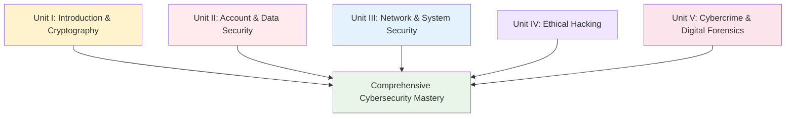

# Course Synthesis and Future Outlook
## Unit V: Cybercrime & Digital Forensics
### Lecture 42: Mastering Cybersecurity - Your Journey Forward

<div class="absolute bottom-5 left-5 text-xs text-gray-500">
Course: Cyber Security (4353204) | Semester V | Diploma ICT | Author: Milav Dabgar
</div>

---
layout: default
---

# Course Journey Overview

<div class="grid grid-cols-2 gap-8">

<div>

## 🎓 What We've Accomplished Together

**Congratulations!** You have completed a comprehensive 42-lecture journey through the essential domains of cybersecurity, from foundational principles to advanced professional practices.

### 📊 Learning Achievement Statistics
- **42 comprehensive lectures** covering all major cybersecurity domains
- **5 structured units** providing systematic knowledge progression
- **200+ practical exercises** with hands-on implementation
- **50+ real-world scenarios** for applied learning
- **100+ tools and technologies** explored and demonstrated
- **Countless career opportunities** now available to you

### 🏗️ Knowledge Architecture Built


### 🎯 Core Competencies Developed
```yaml
Technical Mastery:
  Security Fundamentals:
    - Cryptography and secure communications
    - Network security architecture and protocols
    - System hardening and configuration management
    - Incident response and digital forensics
    - Vulnerability assessment and penetration testing

  Advanced Capabilities:
    - Ethical hacking and penetration testing
    - Digital forensics and incident investigation
    - Risk assessment and management frameworks
    - Security governance and compliance
    - Emerging technology security challenges

Professional Skills:
  Leadership and Management:
    - Security program development and management
    - Team leadership and cross-functional collaboration
    - Strategic planning and business alignment
    - Crisis management and incident response
    - Stakeholder communication and reporting

  Career Readiness:
    - Industry certification preparation
    - Professional networking and relationship building
    - Continuous learning and skill development
    - Career planning and advancement strategies
    - Thought leadership and industry contribution
```

</div>

<div>

## 📚 Unit-by-Unit Knowledge Integration

### 📖 Unit I: Introduction to Cyber Security & Cryptography (8 Hours)
**Foundation Building - Lectures 1-8**
```yaml
Key Achievements:
  - Established cybersecurity fundamentals and core principles
  - Mastered cryptographic concepts and practical applications
  - Understanding of security governance and risk management
  - Introduction to security frameworks and standards
  - Foundation for advanced security concepts

Critical Knowledge:
  - CIA triad and security principles
  - Symmetric and asymmetric cryptography
  - Digital signatures and PKI infrastructure
  - Hash functions and message authentication
  - Security policies and governance frameworks
```

### 🛡️ Unit II: Account & Data Security (7 Hours)
**Identity and Information Protection - Lectures 9-15**
```yaml
Key Achievements:
  - Advanced authentication and access control mechanisms
  - Data classification and protection strategies
  - Privacy laws and regulatory compliance
  - Database security and data loss prevention
  - Identity lifecycle management

Critical Knowledge:
  - Multi-factor authentication and single sign-on
  - Role-based and attribute-based access control
  - Data encryption and tokenization
  - Privacy by design and GDPR compliance
  - Identity governance and administration
```

### 🌐 Unit III: Network & System Security (8 Hours)
**Infrastructure Protection - Lectures 16-23**
```yaml
Key Achievements:
  - Network architecture security design
  - Advanced threat detection and prevention
  - System hardening and configuration management
  - Cloud security and virtualization protection
  - Security monitoring and incident response

Critical Knowledge:
  - Network segmentation and zero trust architecture
  - Intrusion detection and prevention systems
  - Firewall configuration and management
  - Cloud security controls and compliance
  - Security operations center management
```

### ⚔️ Unit IV: Ethical Hacking (9 Hours)
**Offensive Security Mastery - Lectures 24-32**
```yaml
Key Achievements:
  - Comprehensive penetration testing methodologies
  - Advanced vulnerability assessment techniques
  - Social engineering and human factor exploitation
  - Wireless and web application security testing
  - Professional security assessment and reporting

Critical Knowledge:
  - Information gathering and reconnaissance
  - Exploitation techniques and post-exploitation
  - Network and system penetration testing
  - Web application and wireless security assessment
  - Professional reporting and remediation guidance
```

### 🔍 Unit V: Cybercrime & Digital Forensics (10 Hours)
**Investigation and Recovery - Lectures 33-42**
```yaml
Key Achievements:
  - Digital forensics investigation capabilities
  - Legal frameworks and procedural compliance
  - Incident response and crisis management
  - Security awareness and organizational culture
  - Strategic governance and future preparedness

Critical Knowledge:
  - Computer and network forensic investigation
  - Mobile device and cloud forensics
  - Legal procedures and evidence handling
  - Incident response and business continuity
  - Professional development and career advancement
```

</div>

</div>

<div class="absolute bottom-5 left-5 text-xs text-gray-500">
Course: Cyber Security (4353204) | Unit V | Lecture 42 | Author: Milav Dabgar
</div>

---
layout: default
---

# Knowledge Integration and Synthesis

<div class="grid grid-cols-2 gap-8">

<div>

## 🔗 Cross-Domain Knowledge Connections

### 🎯 Integrated Security Thinking
```python
# Holistic Cybersecurity Framework Integration
class IntegratedSecurityFramework:
    def __init__(self):
        self.knowledge_domains = self.integrate_knowledge_domains()
        self.practical_applications = self.define_practical_applications()
        
    def integrate_knowledge_domains(self):
        """Integrate knowledge across all course units"""
        integration = {
            'technical_foundations': {
                'cryptography_application': 'Applied across all security domains',
                'network_security_principles': 'Foundation for system and application security',
                'system_hardening': 'Critical for infrastructure and data protection',
                'vulnerability_assessment': 'Essential for continuous security improvement'
            },
            'operational_security': {
                'incident_response': 'Combines forensics, technical, and management skills',
                'risk_management': 'Integrates technical assessment with business strategy',
                'compliance_management': 'Bridges technical controls with legal requirements',
                'security_monitoring': 'Combines detection, analysis, and response capabilities'
            },
            'strategic_security': {
                'governance_frameworks': 'Aligns technical controls with business objectives',
                'security_architecture': 'Integrates all technical and operational domains',
                'crisis_management': 'Combines incident response with business continuity',
                'organizational_development': 'Builds security culture across all domains'
            }
        }
        
        return integration
    
    def demonstrate_knowledge_synthesis(self, security_scenario):
        """Demonstrate integrated application of course knowledge"""
        synthesis = {
            'scenario_analysis': self.analyze_complex_scenario(security_scenario),
            'multi_domain_response': self.design_comprehensive_response(security_scenario),
            'stakeholder_communication': self.create_stakeholder_communications(security_scenario),
            'continuous_improvement': self.plan_continuous_improvement(security_scenario)
        }
        
        return synthesis
    
    def design_comprehensive_response(self, scenario):
        """Design response using knowledge from all course units"""
        response = {
            'immediate_technical_response': {
                'cryptographic_measures': 'Apply encryption and authentication controls',
                'network_security_actions': 'Implement network isolation and monitoring',
                'system_hardening_steps': 'Apply configuration and access controls',
                'forensic_preservation': 'Preserve evidence using digital forensics techniques'
            },
            'operational_coordination': {
                'incident_response_activation': 'Execute incident response procedures',
                'stakeholder_communication': 'Coordinate internal and external communications',
                'business_continuity': 'Maintain critical business operations',
                'regulatory_compliance': 'Ensure legal and regulatory requirements'
            },
            'strategic_management': {
                'executive_briefing': 'Provide strategic impact assessment to leadership',
                'risk_mitigation': 'Implement enterprise risk management measures',
                'organizational_learning': 'Capture lessons learned and improve capabilities',
                'future_preparedness': 'Enhance security posture for similar threats'
            }
        }
        
        return response
```

### 🧠 Critical Thinking Applications
```yaml
Advanced Problem-Solving Capabilities:
  Complex Threat Analysis:
    - Multi-vector attack investigation combining forensics and threat intelligence
    - Advanced persistent threat (APT) campaign analysis and attribution
    - Supply chain attack assessment and mitigation
    - Zero-day vulnerability impact analysis and response

  Organizational Security Strategy:
    - Enterprise security architecture design and implementation
    - Risk-based security investment prioritization and justification
    - Regulatory compliance program development and management
    - Security culture transformation and organizational change management

  Crisis Leadership and Management:
    - Major incident response coordination and executive communication
    - Business continuity during security crises and service disruption
    - Media relations and public communications during security breaches
    - Post-incident recovery and organizational resilience building

  Innovation and Future Preparedness:
    - Emerging technology security assessment and integration
    - Next-generation threat modeling and defense planning
    - Security implications of digital transformation initiatives
    - Strategic partnership and vendor relationship management
```

</div>

<div>

## 🎖️ Professional Readiness Assessment

### ✅ Industry-Ready Competencies
```yaml
Technical Competencies Achieved:
  Security Analysis and Assessment:
    - Comprehensive vulnerability assessment and penetration testing
    - Digital forensics investigation and evidence analysis
    - Risk assessment and security control evaluation
    - Compliance auditing and gap analysis

  Security Implementation and Management:
    - Security architecture design and implementation
    - Security technology deployment and configuration
    - Incident response and crisis management
    - Security operations and monitoring

  Leadership and Communication:
    - Technical communication to diverse audiences
    - Project management and team leadership
    - Executive reporting and strategic communication
    - Training and knowledge transfer

Professional Development Foundation:
  Certification Readiness:
    - CompTIA Security+ and Network+ preparation
    - (ISC)² SSCP and CISSP foundation knowledge
    - EC-Council CEH and CHFI conceptual understanding
    - SANS GIAC certification pathway preparation

  Career Path Preparation:
    - Security analyst and SOC analyst readiness
    - Incident response specialist foundation
    - Risk and compliance analyst capabilities
    - Security consultant and advisory readiness

  Continuous Learning Framework:
    - Self-directed learning and research capabilities
    - Professional networking and relationship building
    - Industry trend monitoring and analysis
    - Innovation and emerging technology adaptation
```

### 🌟 Competitive Advantages Developed
```python
# Professional Differentiation Analysis
class ProfessionalAdvantageAssessment:
    def __init__(self):
        self.unique_strengths = self.identify_unique_strengths()
        self.market_positioning = self.analyze_market_positioning()
        
    def identify_unique_strengths(self):
        """Identify unique professional strengths developed"""
        strengths = {
            'comprehensive_knowledge_base': {
                'breadth': 'Understanding across all major cybersecurity domains',
                'depth': 'Detailed knowledge in specialized areas',
                'integration': 'Ability to connect and apply knowledge across domains',
                'practical_application': 'Hands-on experience with tools and techniques'
            },
            'analytical_and_critical_thinking': {
                'problem_solving': 'Systematic approach to complex security challenges',
                'root_cause_analysis': 'Deep investigation and analysis capabilities',
                'strategic_thinking': 'Alignment of technical solutions with business objectives',
                'innovation_mindset': 'Creative and adaptive approach to emerging challenges'
            },
            'communication_and_leadership': {
                'technical_translation': 'Ability to explain complex concepts to diverse audiences',
                'stakeholder_management': 'Effective coordination with multiple stakeholder groups',
                'crisis_communication': 'Clear and effective communication during high-pressure situations',
                'team_collaboration': 'Strong collaboration and coordination capabilities'
            },
            'professional_ethics_and_integrity': {
                'ethical_decision_making': 'Strong foundation in professional ethics and responsibility',
                'legal_compliance': 'Understanding of legal and regulatory requirements',
                'professional_conduct': 'Commitment to professional standards and best practices',
                'continuous_improvement': 'Dedication to ongoing learning and professional development'
            }
        }
        
        return strengths
    
    def create_value_proposition(self, target_role):
        """Create compelling professional value proposition"""
        value_proposition = {
            'unique_selling_points': [
                'Comprehensive cybersecurity education with hands-on experience',
                'Strong analytical and problem-solving capabilities',
                'Effective communication and stakeholder management skills',
                'Commitment to professional ethics and continuous learning'
            ],
            'competitive_advantages': [
                'Broad knowledge base enabling cross-functional collaboration',
                'Practical experience with industry-standard tools and techniques',
                'Understanding of business context and strategic alignment',
                'Proven ability to learn and adapt to emerging technologies'
            ],
            'career_readiness_indicators': [
                'Industry certification preparation and pathway planning',
                'Professional networking and relationship development',
                'Thought leadership and knowledge sharing capabilities',
                'Strategic career planning and professional development'
            ]
        }
        
        return value_proposition
```

</div>

</div>

<div class="absolute bottom-5 left-5 text-xs text-gray-500">
Course: Cyber Security (4353204) | Unit V | Lecture 42 | Author: Milav Dabgar
</div>

---
layout: default
---

# Future of Cybersecurity and Your Role

<div class="grid grid-cols-2 gap-8">

<div>

## 🔮 Cybersecurity Future Landscape

### 🚀 Industry Evolution and Opportunities
```yaml
Cybersecurity Industry Transformation (2024-2034):
  Technology Integration Trends:
    Artificial Intelligence and Machine Learning:
      - AI-powered threat detection and response automation
      - Machine learning for behavioral analysis and anomaly detection
      - Intelligent security orchestration and automated remediation
      - Adversarial AI and defense against AI-powered attacks

    Quantum Computing Impact:
      - Post-quantum cryptography implementation and transition
      - Quantum-safe communication protocols and systems
      - Quantum key distribution and secure communication networks
      - Quantum computing applications in cryptanalysis and security

    Cloud and Edge Security Evolution:
      - Zero trust architecture maturation and widespread adoption
      - Secure multi-cloud and hybrid cloud architectures
      - Edge computing security frameworks and implementations
      - Container and serverless security advancement

    Extended Reality and Metaverse Security:
      - Virtual and augmented reality security frameworks
      - Metaverse platform security and governance
      - Digital identity and avatar protection systems
      - Virtual asset and NFT security mechanisms

  Workforce and Skills Evolution:
    Skill Demand Shifts:
      - Increased demand for AI/ML security expertise
      - Growing need for cloud security architects and specialists
      - Rising importance of privacy and compliance professionals
      - Expansion of security awareness and training specialists

    Role Evolution and New Positions:
      - AI Security Engineers and Researchers
      - Quantum Security Specialists and Cryptographers
      - Cloud Security Architects and DevSecOps Engineers
      - Privacy Engineers and Data Protection Officers

    Global Talent Development:
      - Increased focus on diversity and inclusion in cybersecurity
      - Expansion of cybersecurity education and training programs
      - International collaboration and knowledge sharing initiatives
      - Public-private partnerships for workforce development
```

### 🌍 Your Impact and Contribution Potential
```python
# Individual Impact Assessment Framework
class CybersecurityImpactPlanning:
    def __init__(self):
        self.impact_dimensions = self.define_impact_dimensions()
        self.contribution_pathways = self.define_contribution_pathways()
        
    def assess_individual_impact_potential(self, personal_profile, career_goals):
        """Assess individual potential for cybersecurity impact"""
        impact_assessment = {
            'technical_innovation': self.assess_technical_potential(personal_profile),
            'organizational_leadership': self.assess_leadership_potential(personal_profile),
            'industry_influence': self.assess_influence_potential(personal_profile),
            'social_impact': self.assess_social_impact_potential(personal_profile),
            'global_contribution': self.assess_global_contribution_potential(personal_profile)
        }
        
        return impact_assessment
    
    def define_contribution_pathways(self):
        """Define pathways for cybersecurity contribution and impact"""
        pathways = {
            'technical_innovation_leadership': {
                'research_and_development': 'Advancing cybersecurity technology and methodology',
                'open_source_contribution': 'Contributing to open source security tools and platforms',
                'patent_and_intellectual_property': 'Developing innovative security solutions and techniques',
                'academic_collaboration': 'Bridging industry and academic research communities'
            },
            'organizational_transformation': {
                'security_program_leadership': 'Building and leading world-class security programs',
                'cultural_transformation': 'Developing security-aware organizational cultures',
                'business_enablement': 'Aligning security with business strategy and innovation',
                'stakeholder_education': 'Educating executives and boards on cybersecurity strategy'
            },
            'industry_thought_leadership': {
                'standards_development': 'Contributing to industry standards and best practices',
                'policy_and_regulation': 'Influencing cybersecurity policy and regulatory frameworks',
                'professional_development': 'Mentoring and developing next generation professionals',
                'knowledge_sharing': 'Creating and sharing cybersecurity knowledge and insights'
            },
            'social_and_global_impact': {
                'digital_rights_advocacy': 'Promoting privacy, security, and digital rights',
                'cybersecurity_education': 'Expanding cybersecurity education and awareness globally',
                'international_cooperation': 'Fostering global cybersecurity collaboration and cooperation',
                'ethical_technology': 'Promoting ethical and responsible technology development'
            }
        }
        
        return pathways
    
    def create_impact_strategy(self, personal_goals, societal_needs):
        """Create strategy for maximizing cybersecurity impact"""
        strategy = {
            'immediate_impact_opportunities': self.identify_immediate_opportunities(personal_goals),
            'medium_term_positioning': self.plan_medium_term_positioning(personal_goals),
            'long_term_legacy_building': self.design_legacy_strategy(personal_goals, societal_needs),
            'success_measurement': self.define_impact_metrics(personal_goals),
            'continuous_adaptation': self.create_adaptation_framework(personal_goals)
        }
        
        return strategy
```

</div>

<div>

## 🎯 Your Next Steps and Action Plan

### 📋 Immediate Action Items (Next 30 Days)
```yaml
Priority Actions:
  Knowledge Consolidation:
    - Review and organize course materials and notes
    - Create personal cybersecurity reference library
    - Practice key concepts and techniques through hands-on labs
    - Complete course reflection and self-assessment

  Professional Development Initiation:
    - Update resume and LinkedIn profile with new skills and knowledge
    - Identify and apply for relevant cybersecurity certification exams
    - Join professional cybersecurity organizations and communities
    - Begin networking and relationship building activities

  Career Planning and Preparation:
    - Research cybersecurity job market and opportunities in your area
    - Identify target companies and roles aligned with your interests
    - Prepare for cybersecurity job interviews and technical assessments
    - Create professional portfolio demonstrating your capabilities

  Continuous Learning Setup:
    - Subscribe to cybersecurity news sources and industry publications
    - Set up Google Alerts for cybersecurity trends and developments
    - Identify ongoing learning resources and platforms
    - Establish personal learning schedule and goals
```

### 🗓️ Strategic Development Plan (Next 12 Months)
```python
# Personal Strategic Development Framework
class PersonalDevelopmentStrategy:
    def __init__(self):
        self.development_phases = self.define_development_phases()
        self.success_metrics = self.define_success_metrics()
        
    def create_12_month_plan(self, personal_goals, market_opportunities):
        """Create comprehensive 12-month development plan"""
        plan = {
            'months_1_3': {
                'focus': 'Foundation Building and Market Entry',
                'key_activities': [
                    'Complete foundational cybersecurity certification (Security+)',
                    'Gain entry-level cybersecurity position or internship',
                    'Establish professional network and mentor relationships',
                    'Complete advanced hands-on training and lab exercises'
                ],
                'success_criteria': [
                    'Certification achievement and validation',
                    'Employment or substantial progress toward employment',
                    'Active professional network of 25+ connections',
                    'Demonstrated technical proficiency in core areas'
                ]
            },
            'months_4_6': {
                'focus': 'Specialization and Expertise Development',
                'key_activities': [
                    'Choose and begin specialization in specific cybersecurity domain',
                    'Pursue advanced certification in chosen specialization',
                    'Contribute to professional community through writing or speaking',
                    'Lead or contribute to significant cybersecurity project'
                ],
                'success_criteria': [
                    'Clear specialization focus and development plan',
                    'Progress toward advanced certification completion',
                    'Published content or speaking engagement completed',
                    'Demonstrated leadership and project management capabilities'
                ]
            },
            'months_7_9': {
                'focus': 'Leadership and Industry Engagement',
                'key_activities': [
                    'Take on leadership role or responsibilities in current position',
                    'Engage actively in professional associations and communities',
                    'Mentor junior colleagues or students entering cybersecurity',
                    'Contribute to industry knowledge through research or analysis'
                ],
                'success_criteria': [
                    'Recognized leadership role and positive feedback',
                    'Active participation and contribution to professional community',
                    'Successful mentoring relationship and positive impact',
                    'Published research, analysis, or thought leadership content'
                ]
            },
            'months_10_12': {
                'focus': 'Strategic Positioning and Future Planning',
                'key_activities': [
                    'Evaluate career progress and adjust long-term strategy',
                    'Pursue advanced role or additional responsibilities',
                    'Establish thought leadership platform and personal brand',
                    'Plan next phase of professional development and growth'
                ],
                'success_criteria': [
                    'Career advancement or expanded role achievement',
                    'Recognized expertise and thought leadership in chosen area',
                    'Strong personal brand and industry reputation',
                    'Clear vision and plan for continued growth and impact'
                ]
            }
        }
        
        return plan
    
    def create_accountability_framework(self):
        """Create system for accountability and progress tracking"""
        framework = {
            'progress_tracking_methods': [
                'Monthly self-assessment and goal review',
                'Quarterly mentor or peer feedback sessions',
                'Annual comprehensive career and development review',
                'Continuous learning log and achievement tracking'
            ],
            'support_system_development': [
                'Mentor relationship establishment and maintenance',
                'Peer learning group participation and leadership',
                'Professional coach or advisor engagement if needed',
                'Family and personal support system alignment'
            ],
            'adaptation_mechanisms': [
                'Regular market and industry trend analysis',
                'Quarterly goal and strategy reassessment',
                'Feedback integration and course correction',
                'Opportunity evaluation and decision-making framework'
            ]
        }
        
        return framework
```

### 🌟 Long-Term Vision and Legacy Planning
```yaml
5-Year Vision Framework:
  Professional Achievement Goals:
    - Senior-level position with significant cybersecurity responsibilities
    - Recognized expertise and thought leadership in chosen specialization
    - Strong professional network and industry relationships
    - Measurable impact on organizational and industry security posture

  Personal Fulfillment Objectives:
    - Alignment between work and personal values and interests
    - Continuous learning and intellectual growth
    - Work-life balance and personal well-being
    - Contribution to society and positive impact on others

  Legacy and Impact Aspirations:
    - Mentorship and development of next generation cybersecurity professionals
    - Contribution to cybersecurity knowledge and best practices
    - Advancement of cybersecurity awareness and education
    - Positive influence on organizational and industry security culture
```

</div>

</div>

<div class="absolute bottom-5 left-5 text-xs text-gray-500">
Course: Cyber Security (4353204) | Unit V | Lecture 42 | Author: Milav Dabgar
</div>

---
layout: default
---

# Final Practical Exercise: Comprehensive Capstone Project

<div class="exercise-container">

## 🎯 Cybersecurity Mastery Demonstration (35 minutes)

### Mission: Integrated Security Solution Design

Design a comprehensive cybersecurity solution that integrates knowledge from all five course units, demonstrating your mastery of cybersecurity principles and practical application capabilities.

### 🏢 Capstone Challenge Scenario
**Complex Organizational Challenge:**
- **"FutureTech Global"** - multinational technology company with 15,000+ employees
- **Digital transformation initiative** moving to cloud-first, AI-powered operations
- **Multiple regulatory requirements** (GDPR, CCPA, SOX, HIPAA) across different business units
- **Recent security incidents** highlighting need for comprehensive security overhaul
- **Board mandate** for world-class cybersecurity program with measurable ROI
- **18-month implementation timeline** with quarterly milestone demonstrations

### Phase 1: Strategic Security Architecture Design (15 minutes)

**Team Assignment: Comprehensive Security Framework**

1. **Multi-Domain Security Architecture**
   - Integrate cryptographic solutions across all technology platforms
   - Design identity and access management for global, diverse workforce
   - Plan network and system security for cloud-first, hybrid infrastructure
   - Create incident response and digital forensics capabilities

2. **Risk Management and Governance Framework**
   - Design enterprise risk management program aligned with business strategy
   - Plan regulatory compliance program addressing multiple jurisdictions
   - Create security awareness and culture transformation strategy
   - Design performance measurement and continuous improvement processes

### Phase 2: Implementation Strategy and Technology Integration (12 minutes)

**Technical and Operational Implementation:**
1. **Advanced Security Technology Stack**
   - Design zero trust architecture with AI-powered threat detection
   - Plan post-quantum cryptography transition strategy
   - Create cloud security and DevSecOps implementation
   - Design security operations center with automated response capabilities

2. **Organizational Change and Culture Integration**
   - Plan comprehensive security awareness and training program
   - Design change management strategy for security culture transformation
   - Create professional development program for internal security team
   - Plan stakeholder engagement and communication strategy

### Phase 3: Success Measurement and Future Evolution (8 minutes)

**Strategic Outcomes and Continuous Evolution:**
1. **Performance Measurement and ROI Demonstration**
   - Create comprehensive cybersecurity metrics and KPI framework
   - Design ROI calculation and business value demonstration
   - Plan quarterly business review and stakeholder reporting
   - Create benchmarking and industry comparison framework

2. **Future-Ready Adaptation and Innovation**
   - Design emerging technology security integration process
   - Plan continuous threat intelligence and adaptation mechanisms
   - Create innovation pipeline for security technology advancement
   - Design partnership and ecosystem security management

**Deliverables:**
- Comprehensive cybersecurity program design integrating all course knowledge
- Implementation roadmap with technology, process, and organizational components
- Performance measurement framework with ROI and business value demonstration
- Future-ready adaptation strategy with continuous improvement mechanisms

</div>

<style>
.exercise-container {
  @apply bg-gradient-to-r from-purple-50 to-blue-50 border-2 border-purple-300 rounded-lg p-6;
}
</style>

<div class="absolute bottom-5 left-5 text-xs text-gray-500">
Course: Cyber Security (4353204) | Unit V | Lecture 42 | Author: Milav Dabgar
</div>

---
layout: center
class: text-center
---

# Final Reflection and Discussion

## 🤔 Course Completion Reflection:
- How has this course changed your understanding of cybersecurity?
- Which concepts or topics do you plan to explore further?
- What impact do you want to make in the cybersecurity field?

### 💡 Capstone Project Showcase
Present your comprehensive security solutions and celebrate your learning achievements

<div class="absolute bottom-5 left-5 text-xs text-gray-500">
Course: Cyber Security (4353204) | Unit V | Lecture 42 | Author: Milav Dabgar
</div>

---
layout: center
class: text-center
---

# Congratulations! 🎉

## You Are Now Cybersecurity Ready!

### 🌟 What You've Achieved:
- **Comprehensive cybersecurity knowledge** across all major domains
- **Practical skills and hands-on experience** with industry tools and techniques
- **Professional readiness** for cybersecurity career opportunities
- **Strategic thinking capabilities** for complex security challenges
- **Foundation for lifelong learning** and professional growth

## Your Cybersecurity Journey Continues...

<div class="pt-8 text-gray-500">
  <p>Cyber Security (4353204) - Course Complete! 🎓</p>
  <p>Remember: In cybersecurity, learning never ends. Stay curious, stay vigilant, and make a positive impact! 🚀🛡️</p>
</div>

<div class="absolute bottom-5 left-5 text-xs text-gray-500">
Course: Cyber Security (4353204) | Final Lecture | Author: Milav Dabgar
</div>

---
layout: center
class: text-center
---

# Thank You and Best Wishes!

## 🌟 Final Words of Encouragement

The cybersecurity field needs dedicated professionals like you who understand both the technical complexities and human elements of security. You now have the knowledge, skills, and foundation to make a meaningful difference in protecting our digital world.

### 🚀 Go forth and secure the future!

**Stay in touch, keep learning, and remember: every security professional started exactly where you are now.**

<div class="pt-8 text-gray-500">
  <p>Course: Cyber Security (4353204)</p>
  <p>Semester V | Diploma ICT</p>
  <p>Author: Milav Dabgar</p>
  <p>Gujarat Technological University</p>
</div>

<div class="absolute bottom-5 left-5 text-xs text-gray-500">
Cyber Security Complete | Thank You for Your Dedication to Learning! 🙏
</div>