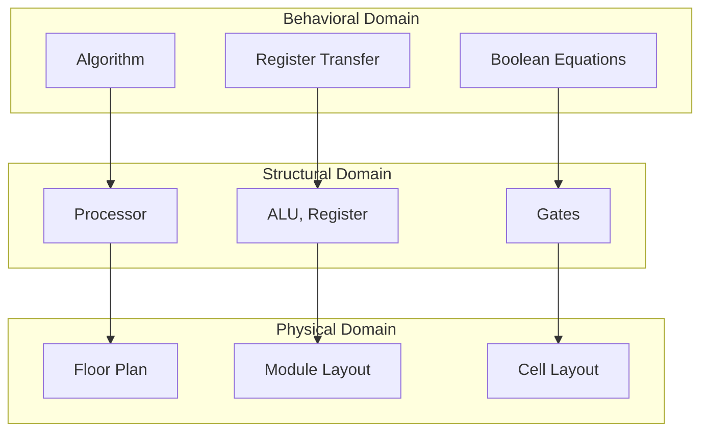
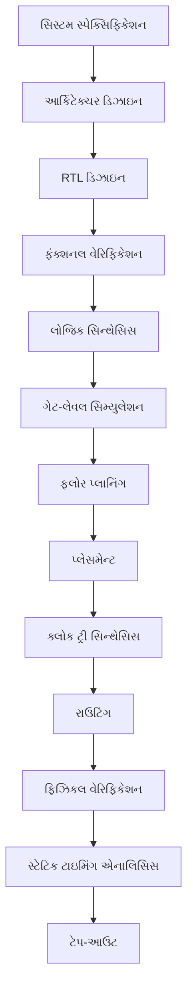

## પ્રશ્ન 1(અ) [3 ગુણ]

**n-ચેનલ MOSFET ના ભૌતિક બંધારણનું સાફ લેબલવાળું આકૃતિ દોરો.**

**જવાબ**:

**આકૃતિ:**

```goat
           Gate (G)
              |
    +---------+----------+
    |    SiO2 (oxide)    |
+---+--------------------+---+
|S  |                    | D |
|o  |  p-type substrate  | r |
|u  |                    | a |
|r  |     n+      n+     | i |
|c  |    ----    ----    | n |  
|e  |   Source   Drain   |   |
+---+--------------------+---+
              |
           Substrate/Body
```

**મુખ્ય ઘટકો:**

- **સોર્સ**: n+ ડોપ્ડ વિસ્તાર જે ઈલેક્ટ્રોન પૂરો પાડે છે
- **ડ્રેઇન**: n+ ડોપ્ડ વિસ્તાર જે ઈલેક્ટ્રોન એકત્ર કરે છે
- **ગેટ**: ચેનલને નિયંત્રિત કરતું મેટલ ઈલેક્ટ્રોડ
- **ઓક્સાઇડ**: SiO2 ઇન્સ્યુલેટિંગ સ્તર
- **સબ્સ્ટ્રેટ**: p-ટાઇપ સિલિકોન બોડી

**મેમરી ટ્રીક:** "SOGD - સોર્સ, ઓક્સાઇડ, ગેટ, ડ્રેઇન"

## પ્રશ્ન 1(બ) [4 ગુણ]

**એક્સટર્નલ બાયાસ હેઠળ MOS ના ડિપ્લીશન અને ઇન્વર્શનનું એનર્જી બેન્ડ ડાયાગ્રામ MOS બાયાસિંગ ડાયાગ્રામ સાથે દોરો. ઇન્વર્શન રીજનને વિગતવાર સમજાવો.**

**જવાબ**:

**MOS બાયાસિંગ સર્કિટ:**

```goat
    VG
     |
     |    Gate
    +++++++++++
    |  SiO2   |
    +---------+
    | p-type  |
    +---------+
         |
        VB
```

**એનર્જી બેન્ડ ડાયાગ્રામ:**

| બાયાસ સ્થિતિ | એનર્જી બેન્ડ વર્તન |
|----------------|---------------------|
| **ડિપ્લીશન** | બેન્ડ ઉપરની તરફ વળે છે, હોલ્સ ખતમ થાય છે |
| **ઇન્વર્શન** | મજબૂત બેન્ડ બેન્ડિંગ, ઈલેક્ટ્રોન ચેનલ બને છે |

**ઇન્વર્શન રીજન વિગતો:**

- **મજબૂત ઇન્વર્શન**: VG > VT (થ્રેશોલ્ડ વોલ્ટેજ)
- **ઈલેક્ટ્રોન ચેનલ**: Si-SiO2 ઇન્ટરફેસ પર બને છે
- **ચેનલ કન્ડક્ટિવિટી**: ગેટ વોલ્ટેજ સાથે વધે છે
- **થ્રેશોલ્ડ શરત**: સરફેસ પોટેન્શિયલ = 2φF

**મેમરી ટ્રીક:** "DIVE - ડિપ્લીશન, ઇન્વર્શન, વોલ્ટેજ, ઈલેક્ટ્રોન્સ"

## પ્રશ્ન 1(ક) [7 ગુણ]

**MOSFET ની I-V લાક્ષણિકતા સમજાવો.**

**જવાબ**:

**I-V લાક્ષણિકતા વિસ્તારો:**

| વિસ્તાર | શરત | ડ્રેઇન કરંટ |
|--------|-----------|---------------|
| **કટઓફ** | VGS < VT | ID ≈ 0 |
| **લિનિયર** | VGS > VT, VDS < VGS-VT | ID = μnCox(W/L)[(VGS-VT)VDS - VDS²/2] |
| **સેચ્યુરેશન** | VGS > VT, VDS ≥ VGS-VT | ID = (μnCox/2)(W/L)(VGS-VT)² |

**લાક્ષણિકતા વક્ર:**

```goat
    ID
     |
     |     Saturation
     |    +---------
     |   /
     |  / Linear
     | /
     |/
  ---+-----------> VDS
     0    VGS-VT
```

**મુખ્ય પેરામીટર્સ:**

- **μn**: ઈલેક્ટ્રોન મોબિલિટી
- **Cox**: ગેટ ઓક્સાઇડ કેપેસિટન્સ
- **W/L**: પહોળાઈ અને લંબાઈનો રેશિયો
- **VT**: થ્રેશોલ્ડ વોલ્ટેજ

**ઓપરેટિંગ મોડ્સ:**

- **એન્હાન્સમેન્ટ**: પોઝિટિવ VGS સાથે ચેનલ બને છે
- **સ્ક્વેર લો**: સેચ્યુરેશન વિસ્તાર ચતુર્ભુજ સંબંધ અનુસરે છે

**મેમરી ટ્રીક:** "CLS - કટઓફ, લિનિયર, સેચ્યુરેશન"

## પ્રશ્ન 1(ક) OR [7 ગુણ]

**સ્કેલિંગ વ્યાખ્યાયિત કરો. સ્કેલિંગની જરૂરિયાત સમજાવો. સ્કેલિંગની નકારાત્મક અસરોની સૂચિ બનાવો અને સમજાવો.**

**જવાબ**:

**વ્યાખ્યા:**
**સ્કેલિંગ** એટલે પર્ફોર્મન્સ અને ડેન્સિટી સુધારવા માટે MOSFET ના પરિમાણોમાં વ્યવસ્થિત ઘટાડો.

**સ્કેલિંગની જરૂરિયાત:**

| ફાયદો | વર્ણન |
|---------|-------------|
| **વધુ ડેન્સિટી** | ચિપ વિસ્તાર દીઠ વધુ ટ્રાન્ઝિસ્ટર |
| **ઝડપી સ્પીડ** | ઘટેલી ગેટ ડીલે |
| **ઓછી પાવર** | ઘટેલી સ્વિચિંગ એનર્જી |
| **કોસ્ટ રિડક્શન** | વેફર દીઠ વધુ ચિપ્સ |

**સ્કેલિંગ પ્રકારો:**

| પ્રકાર | ગેટ લંબાઈ | સપ્લાય વોલ્ટેજ | ઓક્સાઇડ જાડાઈ |
|------|-------------|----------------|-----------------|
| **કોન્સ્ટન્ટ વોલ્ટેજ** | ↓α | સ્થિર | ↓α |
| **કોન્સ્ટન્ટ ફીલ્ડ** | ↓α | ↓α | ↓α |

**નકારાત્મક અસરો:**

- **શોર્ટ ચેનલ અસરો**: થ્રેશોલ્ડ વોલ્ટેજ રોલ-ઓફ
- **હોટ કેરિયર અસરો**: ડિવાઇસ ડીગ્રેડેશન
- **ગેટ લીકેજ**: વધેલો ટનલિંગ કરંટ
- **પ્રોસેસ વેરિએશન્સ**: મેન્યુફેક્ચરિંગ પડકારો
- **પાવર ડેન્સિટી**: હીટ ડિસિપેશન સમસ્યાઓ

**મેમરી ટ્રીક:** "SHGPP - શોર્ટ ચેનલ, હોટ કેરિયર, ગેટ લીકેજ, પ્રોસેસ, પાવર"

## પ્રશ્ન 2(અ) [3 ગુણ]

**CMOS નો ઉપયોગ કરીને Y' = (AB' + A'B) અમલમાં મૂકો.**

**જવાબ**:

**લોજિક વિશ્લેષણ:**
Y' = (AB' + A'B) = A ⊕ B (XOR ફંક્શન)

**CMOS અમલીકરણ:**

```goat
    VDD
     |
   +-+-+   +-+-+
   |pA |   |pB |
   +---+   +---+
     |       |
     +---Y---+
     |       |
   +---+   +---+
   |nA |   |nB'|
   +-+-+   +-+-+
     |       |
    GND     GND
```

**ટ્રુથ ટેબલ:**

| A | B | AB' | A'B | Y' |
|---|---|-----|-----|----|
| 0 | 0 | 0   | 0   | 1  |
| 0 | 1 | 0   | 1   | 0  |
| 1 | 0 | 1   | 0   | 0  |
| 1 | 1 | 0   | 0   | 1  |

**મેમરી ટ્રીક:** "XOR ને કોમ્પ્લિમેન્ટરી સ્વિચિંગ જોઈએ"

## પ્રશ્ન 2(બ) [4 ગુણ]

**એન્હાન્સમેન્ટ લોડ ઇન્વર્ટરને તેના સર્કિટ ડાયાગ્રામ સાથે સમજાવો.**

**જવાબ**:

**સર્કિટ ડાયાગ્રામ:**

```goat
    VDD
     |
     +---o VG2
     |
   +-+-+ Enhancement
   |ME |  Load
   +---+
     |
     +---o Vout
     |
   +-+-+
   |MD | Driver
   +---+
     |
    GND
     |
     +---o Vin
```

**કન્ફિગરેશન:**

| ઘટક | પ્રકાર | કનેક્શન |
|-----------|------|------------|
| **લોડ (ME)** | એન્હાન્સમેન્ટ NMOS | ગેટ VDD સાથે જોડાયેલું |
| **ડ્રાઇવર (MD)** | એન્હાન્સમેન્ટ NMOS | ગેટ ઇનપુટ છે |

**ઓપરેશન:**

- **લોડ ટ્રાન્ઝિસ્ટર**: એક્ટિવ લોડ રેઝિસ્ટર તરીકે કામ કરે છે
- **હાઇ આઉટપુટ**: લોડ ટ્રાન્ઝિસ્ટરના VT દ્વારા મર્યાદિત
- **લો આઉટપુટ**: ડ્રાઇવરની તાકાત પર આધાર રાખે છે
- **ગેરફાયદો**: થ્રેશોલ્ડ ડ્રોપ કારણે ખરાબ VOH

**ટ્રાન્સફર લાક્ષણિકતાઓ:**

- **VOH**: VDD - VT (બગડેલો હાઇ લેવલ)
- **VOL**: ગ્રાઉન્ડ પોટેન્શિયલની નજીક
- **નોઇઝ માર્જિન**: થ્રેશોલ્ડ લોસ કારણે ઘટેલો

**મેમરી ટ્રીક:** "ELI - એન્હાન્સમેન્ટ લોડ ઇન્વર્ટરમાં થ્રેશોલ્ડ સમસ્યા"

## પ્રશ્ન 2(ક) [7 ગુણ]

**ઇન્વર્ટરની વોલ્ટેજ ટ્રાન્સફર કેરેક્ટરિસ્ટિક સમજાવો.**

**જવાબ**:

**VTC પેરામીટર્સ:**

| પેરામીટર | વર્ણન | આદર્શ કિંમત |
|-----------|-------------|-------------|
| **VOH** | આઉટપુટ હાઇ વોલ્ટેજ | VDD |
| **VOL** | આઉટપુટ લો વોલ્ટેજ | 0V |
| **VIH** | ઇનપુટ હાઇ વોલ્ટેજ | VDD/2 |
| **VIL** | ઇનપુટ લો વોલ્ટેજ | VDD/2 |
| **VM** | સ્વિચિંગ થ્રેશોલ્ડ | VDD/2 |

**VTC વક્ર:**

```goat
   Vout
     |
   VDD+         +-------
     |         /
     |        /
   VM+-------+  VM
     |        \
     |         \
     0          +-------
     +----+----+-----> Vin
      VIL VM  VIH   VDD
```

**નોઇઝ માર્જિન્સ:**

- **NMH** = VOH - VIH (હાઇ નોઇઝ માર્જિન)
- **NML** = VIL - VOL (લો નોઇઝ માર્જિન)

**વિસ્તારો:**

- **વિસ્તાર 1**: ઇનપુટ લો, આઉટપુટ હાઇ
- **વિસ્તાર 2**: ટ્રાન્ઝિશન વિસ્તાર
- **વિસ્તાર 3**: ઇનપુટ હાઇ, આઉટપુટ લો

**ગુણવત્તા મેટ્રિક્સ:**

- **તીક્ષ્ણ ટ્રાન્ઝિશન**: બહેતર નોઇઝ ઇમ્યુનિટી
- **સિમેટ્રિક સ્વિચિંગ**: VM = VDD/2
- **ફુલ સ્વિંગ**: VOH = VDD, VOL = 0

**મેમરી ટ્રીક:** "VTC દર્શાવે છે VOICE - VOH, VOL, ઇનપુટ થ્રેશોલ્ડ, લાક્ષણિકતા, બધું"

## પ્રશ્ન 2(અ) OR [3 ગુણ]

**CMOS નો ઉપયોગ કરીને NAND2 ગેટ સમજાવો.**

**જવાબ**:

**CMOS NAND2 સર્કિટ:**

```goat
       VDD
        |
    +---+---+
    |       |
  +-+-+   +-+-+
  |pA |   |pB | PMOS
  +---+   +---+ (Parallel)
    |       |
    +---Y---+
        |
      +-+-+
      |nA | NMOS
      +---+ (Series)
        |
      +-+-+
      |nB |
      +---+
        |
       GND
```

**ટ્રુથ ટેબલ:**

| A | B | Y |
|---|---|---|
| 0 | 0 | 1 |
| 0 | 1 | 1 |
| 1 | 0 | 1 |
| 1 | 1 | 0 |

**ઓપરેશન:**

- **PMOS નેટવર્ક**: પેરેલલ કનેક્શન (પુલ-અપ)
- **NMOS નેટવર્ક**: સીરીઝ કનેક્શન (પુલ-ડાઉન)
- **આઉટપુટ લો**: ફક્ત જ્યારે બંને ઇનપુટ હાઇ

**મેમરી ટ્રીક:** "NAND - નોટ AND, પેરેલલ PMOS, સીરીઝ NMOS"

## પ્રશ્ન 2(બ) OR [4 ગુણ]

**રેઝિસ્ટિવ લોડ ઇન્વર્ટર સર્કિટના ઓપરેટિંગ મોડ અને VTC સમજાવો.**

**જવાબ**:

**સર્કિટ કન્ફિગરેશન:**

```goat
    VDD
     |
     R (Load Resistor)
     |
     +---o Vout
     |
   +-+-+
   |MN | NMOS Driver
   +---+
     |
    GND
     |
     +---o Vin
```

**ઓપરેટિંગ મોડ્સ:**

| ઇનપુટ સ્થિતિ | NMOS સ્થિતિ | આઉટપુટ |
|-------------|------------|--------|
| **Vin = 0** | OFF | VOH = VDD |
| **Vin = VDD** | ON | VOL = R·ID/(R+RDS) |

**VTC લાક્ષણિકતાઓ:**

- **VOH**: ઉત્તમ (VDD)
- **VOL**: R અને RDS રેશિયો પર આધાર રાખે છે
- **પાવર વપરાશ**: ઇનપુટ હાઇ હોય ત્યારે સ્ટેટિક કરંટ
- **ટ્રાન્ઝિશન**: રેઝિસ્ટિવ લોડ કારણે ધીમું

**ડિઝાઇન ટ્રેડ-ઓફ્સ:**

- **મોટો R**: બહેતર VOL, ધીમું સ્વિચિંગ
- **નાનો R**: ઝડપી સ્વિચિંગ, વધુ પાવર
- **એરિયા**: રેઝિસ્ટર નોંધપાત્ર જગ્યા લે છે

**મેમરી ટ્રીક:** "RLI - રેઝિસ્ટિવ લોડમાં અનિવાર્ય પાવર વપરાશ"

## પ્રશ્ન 2(ક) OR [7 ગુણ]

**CMOS ઇન્વર્ટર દોરો અને VTC સાથે તેની કામગીરી સમજાવો.**

**જવાબ**:

**CMOS ઇન્વર્ટર સર્કિટ:**

```goat
       VDD
        |
      +-+-+
      |MP | PMOS
      +---+
        |
        +---o Vout
        |
      +-+-+
      |MN | NMOS  
      +---+
        |
       GND
        |
        +---o Vin
```

**ઓપરેશન વિસ્તારો:**

| Vin રેન્જ | PMOS | NMOS | Vout | વિસ્તાર |
|-----------|------|------|------|--------|
| **0 થી VTN** | ON | OFF | VDD | 1 |
| **VTN થી VDD-|VTP|** | ON | ON | ટ્રાન્ઝિશન | 2 |
| **VDD-|VTP| થી VDD** | OFF | ON | 0V | 3 |

**VTC વિશ્લેષણ:**

```goat
   Vout
     |
   VDD+
     |\
     | \
     |  \___
   VM+    \___
     |        \___
     |            \
     0             +---
     +----+----+----+---> Vin
        VTN  VM  VTP  VDD
```

**મુખ્ય લક્ષણો:**

- **ઝીરો સ્ટેટિક પાવર**: કોઈ DC કરંટ પાથ નથી
- **ફુલ સ્વિંગ**: VOH = VDD, VOL = 0V
- **હાઇ નોઇઝ માર્જિન્સ**: NMH = NML ≈ 0.4VDD
- **તીક્ષ્ણ ટ્રાન્ઝિશન**: ટ્રાન્ઝિશન વિસ્તારમાં હાઇ ગેઇન

**ડિઝાઇન વિચારણાઓ:**

- **β રેશિયો**: સિમેટ્રિક સ્વિચિંગ માટે βN/βP
- **થ્રેશોલ્ડ મેચિંગ**: VTN ≈ |VTP| પસંદીદા

**મેમરી ટ્રીક:** "CMOS માં ઝીરો સ્ટેટિક પાવર અને ફુલ સ્વિંગ"

## પ્રશ્ન 3(અ) [3 ગુણ]

**ડિપ્લીશન લોડનો ઉપયોગ કરીને Y= (A̅+B̅)C̅+D̅+E̅ અમલમાં મૂકો.**

**જવાબ**:

**લોજિક સરળીકરણ:**
Y = (A̅+B̅)C̅+D̅+E̅ = A̅C̅+B̅C̅+D̅+E̅

**ડિપ્લીશન લોડ અમલીકરણ:**

```goat
       VDD
        |
      +-+-+ VGS=0
      |MD | Depletion
      +---+ Load
        |
        +---o Y
        |
    +---+---+---+---+
    |   |   |   |   |
  +-+--+-+-+-+-+-+-+-+-+
  |A'| |B'| |C'| |D'| |E'| Pull-down
  +--+ +--+ +--+ +--+ +--+ Network
    |   |   |   |   |
   GND GND GND GND GND
```

**પુલ-ડાઉન નેટવર્ક:**

- **સીરીઝ**: A̅C̅ પાથ અને B̅C̅ પાથ
- **પેરેલલ**: બધા પાથ પેરેલલમાં જોડાયેલા
- **અમલીકરણ**: યોગ્ય ટ્રાન્ઝિસ્ટર સાઇઝિંગ જરૂરી

**મેમરી ટ્રીક:** "ડિપ્લીશન લોડ પેરેલલ પુલ-ડાઉન પાથ સાથે"

## પ્રશ્ન 3(બ) [4 ગુણ]

**FPGA પર ટૂંકી નોંધ લખો.**

**જવાબ**:

**FPGA વ્યાખ્યા:**
**ફીલ્ડ પ્રોગ્રામેબલ ગેટ એરે** - રીકન્ફિગરેબલ ઇન્ટિગ્રેટેડ સર્કિટ.

**આર્કિટેક્ચર ઘટકો:**

| ઘટક | કાર્ય |
|-----------|----------|
| **CLB** | કન્ફિગરેબલ લોજિક બ્લોક |
| **IOB** | ઇનપુટ/આઉટપુટ બ્લોક |
| **ઇન્ટરકનેક્ટ** | રાઉટિંગ રિસોર્સ |
| **સ્વિચ મેટ્રિક્સ** | કનેક્શન પોઇન્ટ્સ |

**પ્રોગ્રામિંગ ટેક્નોલોજીઝ:**

- **SRAM-આધારિત**: વોલેટાઇલ, ઝડપી રીકન્ફિગરેશન
- **એન્ટીફ્યુઝ**: નોન-વોલેટાઇલ, એક વખતનું પ્રોગ્રામેબલ
- **ફ્લેશ-આધારિત**: નોન-વોલેટાઇલ, રીપ્રોગ્રામેબલ

**એપ્લિકેશન્સ:**

- **પ્રોટોટાઇપિંગ**: ડિજિટલ સિસ્ટમ ડેવલપમેન્ટ
- **DSP**: સિગ્નલ પ્રોસેસિંગ એપ્લિકેશન્સ
- **કંટ્રોલ સિસ્ટમ્સ**: ઇન્ડસ્ટ્રિયલ ઓટોમેશન
- **કોમ્યુનિકેશન્સ**: પ્રોટોકોલ અમલીકરણ

**ASIC સામે ફાયદા:**

- **લવચીકતા**: રીકન્ફિગરેબલ ડિઝાઇન
- **ટાઇમ-ટુ-માર્કેટ**: ઝડપી વિકાસ
- **કોસ્ટ**: નાના વોલ્યુમ માટે ઓછો
- **જોખમ**: ઘટેલો ડિઝાઇન જોખમ

**મેમરી ટ્રીક:** "FPGA - લવચીક પ્રોગ્રામિંગ ફાયદા આપે છે"

## પ્રશ્ન 3(ક) [7 ગુણ]

**Y ચાર્ટ ડિઝાઇન ફ્લો દોરો અને સમજાવો.**

**જવાબ**:

**Y-ચાર્ટ ડાયાગ્રામ:**



**ડિઝાઇન ડોમેઇન્સ:**

| ડોમેઇન | લેવલ | વર્ણન |
|--------|--------|-------------|
| **બિહેવિયરલ** | એલ્ગોરિધમ → RT → બુલિયન | સિસ્ટમ શું કરે છે |
| **સ્ટ્રક્ચરલ** | પ્રોસેસર → ALU → ગેટ્સ | સિસ્ટમ કેવી રીતે બનાવેલ છે |
| **ફિઝિકલ** | ફ્લોર પ્લાન → લેઆઉટ → સેલ્સ | ભૌતિક અમલીકરણ |

**ડિઝાઇન ફ્લો પ્રક્રિયા:**

- **ટોપ-ડાઉન**: બિહેવિયરલથી શરૂ કરી ફિઝિકલ તરફ જાઓ
- **બોટમ-અપ**: ઘટકોથી ઉપરની તરફ બનાવો
- **મિક્સ્ડ એપ્રોચ**: બંનેની સંયુક્ત પદ્ધતિ

**એબ્સ્ટ્રેક્શન લેવલ્સ:**

- **સિસ્ટમ લેવલ**: સૌથી વધુ એબ્સ્ટ્રેક્શન
- **RT લેવલ**: રજિસ્ટર ટ્રાન્સફર ઓપરેશન્સ
- **ગેટ લેવલ**: બુલિયન લોજિક અમલીકરણ
- **લેઆઉટ લેવલ**: ભૌતિક જ્યોમેટ્રી

**ડિઝાઇન વેરિફિકેશન:**

- **હોરિઝોન્ટલ**: સમાન લેવલે ડોમેઇન્સ વચ્ચે
- **વર્ટિકલ**: સમાન ડોમેઇનમાં લેવલ્સ વચ્ચે

**મેમરી ટ્રીક:** "Y-ચાર્ટ: બિહેવિયરલ, સ્ટ્રક્ચરલ, ફિઝિકલ - BSP ડોમેઇન્સ"

## પ્રશ્ન 3(અ) OR [3 ગુણ]

**ડિપ્લીશન લોડનો ઉપયોગ કરીને NOR2 ગેટ સમજાવો.**

**જવાબ**:

**ડિપ્લીશન લોડ NOR2 સર્કિટ:**

```goat
       VDD
        |
      +-+-+ VGS=0
      |MD | Depletion  
      +---+ Load
        |
        +---o Y
        |
    +---+---+
    |       |
  +-+-+   +-+-+
  |nA |   |nB | NMOS
  +---+   +---+ (Parallel)
    |       |
   GND     GND
```

**ટ્રુથ ટેબલ:**

| A | B | Y |
|---|---|---|
| 0 | 0 | 1 |
| 0 | 1 | 0 |
| 1 | 0 | 0 |
| 1 | 1 | 0 |

**ઓપરેશન:**

- **બંને ઇનપુટ લો**: બંને NMOS OFF, Y = VDD
- **કોઈપણ ઇનપુટ હાઇ**: સંબંધિત NMOS ON, Y = VOL
- **લોડ ટ્રાન્ઝિસ્ટર**: પુલ-અપ કરંટ પૂરો પાડે છે

**મેમરી ટ્રીક:** "ડિપ્લીશન સાથે NOR - પેરેલલ NMOS પુલ-ડાઉન"

## પ્રશ્ન 3(બ) OR [4 ગુણ]

**ફુલ કસ્ટમ અને સેમી કસ્ટમ ડિઝાઇન શૈલીઓની તુલના કરો.**

**જવાબ**:

**તુલના ટેબલ:**

| પેરામીટર | ફુલ કસ્ટમ | સેમી કસ્ટમ |
|-----------|-------------|-------------|
| **ડિઝાઇન ટાઇમ** | લાંબો (6-18 મહિના) | ટૂંકો (2-6 મહિના) |
| **પર્ફોર્મન્સ** | શ્રેષ્ઠ | સારું |
| **એરિયા** | લઘુત્તમ | મધ્યમ |
| **પાવર** | ઓપ્ટિમાઇઝ્ડ | સ્વીકાર્ય |
| **કોસ્ટ** | હાઇ NRE | લોઅર NRE |
| **લવચીકતા** | મહત્તમ | મર્યાદિત |
| **જોખમ** | વધુ | ઓછું |

**ફુલ કસ્ટમ લાક્ષણિકતાઓ:**

- **દરેક ટ્રાન્ઝિસ્ટર**: મેન્યુઅલી ડિઝાઇન અને પ્લેસ કરેલું
- **લેઆઉટ ઓપ્ટિમાઇઝેશન**: મહત્તમ ડેન્સિટી હાંસલ
- **એપ્લિકેશન્સ**: હાઇ-વોલ્યુમ, પર્ફોર્મન્સ-ક્રિટિકલ

**સેમી કસ્ટમ પ્રકારો:**

- **ગેટ એરે**: પૂર્વ-વ્યાખ્યાયિત ટ્રાન્ઝિસ્ટર એરે
- **સ્ટેન્ડર્ડ સેલ**: પૂર્વ-ડિઝાઇન કરેલા સેલ્સની લાઇબ્રેરી
- **FPGA**: ફીલ્ડ પ્રોગ્રામેબલ લોજિક

**ડિઝાઇન ફ્લો તુલના:**

- **ફુલ કસ્ટમ**: સ્પેસિફિકેશન → સ્કીમેટિક → લેઆઉટ → વેરિફિકેશન
- **સેમી કસ્ટમ**: સ્પેસિફિકેશન → HDL → સિન્થેસિસ → પ્લેસ & રાઉટ

**મેમરી ટ્રીક:** "ફુલ કસ્ટમ - મહત્તમ નિયંત્રણ, સેમી કસ્ટમ - સ્પીડ સમજૂતી"

## પ્રશ્ન 3(ક) OR [7 ગુણ]

**ASIC ડિઝાઇન ફ્લો વિગતવાર દોરો અને સમજાવો.**

**જવાબ**:

**ASIC ડિઝાઇન ફ્લો:**



**ડિઝાઇન સ્ટેજો:**

| સ્ટેજ | વર્ણન | ટૂલ્સ/પદ્ધતિઓ |
|-------|-------------|---------------|
| **RTL ડિઝાઇન** | હાર્ડવેર વર્ણન | વેરિલોગ/VHDL |
| **સિન્થેસિસ** | RTL ને ગેટ્સમાં કન્વર્ટ | લોજિક સિન્થેસિસ ટૂલ્સ |
| **ફ્લોર પ્લાનિંગ** | ચિપ એરિયા વિતરણ | ફ્લોર પ્લાનિંગ ટૂલ્સ |
| **પ્લેસમેન્ટ** | ગેટ્સ/બ્લોક્સ સ્થાન | પ્લેસમેન્ટ એલ્ગોરિધમ |
| **રાઉટિંગ** | પ્લેસ કરેલા એલિમેન્ટ્સ જોડો | રાઉટિંગ એલ્ગોરિધમ |

**વેરિફિકેશન સ્ટેપ્સ:**

- **ફંક્શનલ**: RTL સિમ્યુલેશન અને વેરિફિકેશન
- **ગેટ-લેવલ**: પોસ્ટ-સિન્થેસિસ સિમ્યુલેશન
- **ફિઝિકલ**: DRC, LVS, એન્ટેના ચેક્સ
- **ટાઇમિંગ**: સેટઅપ/હોલ્ડ વાયોલેશન માટે STA

**ડિઝાઇન કન્સ્ટ્રેઇન્ટ્સ:**

- **ટાઇમિંગ**: ક્લોક ફ્રીક્વન્સી જરૂરિયાતો
- **એરિયા**: સિલિકોન એરિયા મર્યાદાઓ
- **પાવર**: પાવર વપરાશ લક્ષ્યો
- **ટેસ્ટ**: ટેસ્ટેબિલિટી માટે ડિઝાઇન

**સાઇન-ઓફ ચેક્સ:**

- **DRC**: ડિઝાઇન રૂલ ચેક
- **LVS**: લેઆઉટ વર્સીસ સ્કીમેટિક
- **STA**: સ્ટેટિક ટાઇમિંગ એનાલિસિસ
- **પાવર**: પાવર ઇન્ટેગ્રિટી એનાલિસિસ

**મેમરી ટ્રીક:** "ASIC ફ્લો: RTL → સિન્થેસિસ → ફિઝિકલ → વેરિફિકેશન"

## પ્રશ્ન 4(અ) [3 ગુણ]

**CMOS સાથે લોજિક ફંક્શન G = (A(D+E)+BC)̅ અમલમાં મૂકો**

**જવાબ**:

**લોજિક વિશ્લેષણ:**
G = (A(D+E)+BC)̅ = (AD+AE+BC)̅

**CMOS અમલીકરણ:**

```goat
         VDD
          |
    +-----+-----+-----+
    |     |     |     |
  +-+-+ +-+-+ +-+-+ +-+-+
  |pA | |pD | |pA | |pB | PMOS
  +---+ +---+ +---+ +---+ (સીરીઝ બ્રાન્ચ)
    |     |     |     |
    +-----+     +-----+
          |           |
          +-----G-----+
                |
        +-------+-------+
        |       |       |
      +-+-+   +-+-+   +-+-+
      |nA |   |nA |   |nB | NMOS  
      +---+   +---+   +---+ (પેરેલલ)
        |       |       |
      +-+-+   +-+-+     |
      |nD |   |nE |     |
      +---+   +---+     |
        |       |       |
       GND     GND    +-+-+
                      |nC |
                      +---+
                        |
                       GND
```

**નેટવર્ક કન્ફિગરેશન:**

- **PMOS**: કોમ્પ્લિમેન્ટનું સીરીઝ અમલીકરણ
- **NMOS**: મૂળ ફંક્શનનું પેરેલલ અમલીકરણ

**મેમરી ટ્રીક:** "કોમ્પ્લેક્સ CMOS - PMOS સીરીઝ, NMOS પેરેલલ"

## પ્રશ્ન 4(બ) [4 ગુણ]

**3 બિટ પેરિટી ચેકર માટે વેરિલોગ કોડ લખો.**

**જવાબ**:

**વેરિલોગ કોડ:**

```verilog
module parity_checker_3bit(
    input [2:0] data_in,
    output parity_even,
    output parity_odd
);

// ઇવન પેરિટી ચેકર
assign parity_even = ^data_in;

// ઓડ પેરિટી ચેકર
assign parity_odd = ~(^data_in);

// વૈકલ્પિક અમલીકરણ
/*
assign parity_even = data_in[0] ^ data_in[1] ^ data_in[2];
assign parity_odd = ~(data_in[0] ^ data_in[1] ^ data_in[2]);
*/

endmodule
```

**ટ્રુથ ટેબલ:**

| ઇનપુટ [2:0] | 1 નું સંખ્યા | ઇવન પેરિટી | ઓડ પેરિટી |
|-------------|--------------|-------------|------------|
| 000 | 0 | 0 | 1 |
| 001 | 1 | 1 | 0 |
| 010 | 1 | 1 | 0 |
| 011 | 2 | 0 | 1 |
| 100 | 1 | 1 | 0 |
| 101 | 2 | 0 | 1 |
| 110 | 2 | 0 | 1 |
| 111 | 3 | 1 | 0 |

**મુખ્ય લક્ષણો:**

- **XOR રિડક્શન**: `^data_in` ઇવન પેરિટી આપે છે
- **કોમ્પ્લિમેન્ટ**: `~(^data_in)` ઓડ પેરિટી આપે છે

**મેમરી ટ્રીક:** "પેરિટી ચેક: બધા બિટ્સનું XOR"

## પ્રશ્ન 4(ક) [7 ગુણ]

**અમલીકરણ:**
**1) G = (AD +BC+EF) CMOS નો ઉપયોગ કરીને [3 ગુણ]**
**2) Y' = (ABCD + EF(G+H)+ J) CMOS નો ઉપયોગ કરીને [4 ગુણ]**

**જવાબ**:

**ભાગ 1: G = (AD +BC+EF) [3 ગુણ]**

**CMOS સર્કિટ:**

```goat
         VDD
          |
    +-----+-----+-----+
    |     |     |     |
  +-+-+ +-+-+ +-+-+ +-+-+
  |pA | |pB | |pE | |pA | PMOS
  +---+ +---+ +---+ +---+ (સીરીઝ બ્રાન્ચ)
    |     |     |     |
  +-+-+ +-+-+ +-+-+   |
  |pD | |pC | |pF |   |
  +---+ +---+ +---+   |
    |     |     |     |
    +-----+-----+-----+
              |
              G
              |
        +-----+-----+-----+
        |     |     |     |
      +-+-+ +-+-+ +-+-+ NMOS
      |nA | |nB | |nE | (પેરેલલ)
      +---+ +---+ +---+
        |     |     |
      +-+-+ +-+-+ +-+-+
      |nD | |nC | |nF |
      +---+ +---+ +---+
        |     |     |
       GND   GND   GND
```

**ભાગ 2: Y' = (ABCD + EF(G+H)+ J) [4 ગુણ]**

આ એક કોમ્પ્લેક્સ ફંક્શન છે જેને બહુવિધ સ્ટેજની જરૂર છે:

**સ્ટેજ 1**: (G+H) અમલીકરણ
**સ્ટેજ 2**: EF(G+H) અમલીકરણ
**સ્ટેજ 3**: બધા ટર્મ્સ કોમ્બાઇન

**આવા કોમ્પ્લેક્સ ફંક્શન માટે ટ્રાન્સમિશન ગેટ્સ અને બહુવિધ સ્ટેજનો ઉપયોગ વધુ પ્રેક્ટિકલ છે.**

**મેમરી ટ્રીક:** "કોમ્પ્લેક્સ ફંક્શન્સને સ્ટેજ્ડ અમલીકરણ જોઈએ"

## પ્રશ્ન 4(અ) OR [3 ગુણ]

**ઉદાહરણ સાથે AOI લોજિક સમજાવો.**

**જવાબ**:

**AOI વ્યાખ્યા:**
**AND-OR-Invert** લોજિક આ પ્રકારના ફંક્શન્સ અમલીકરણ કરે છે: Y = (AB + CD + ...)̅

**ઉદાહરણ: Y = (AB + CD)̅**

**AOI અમલીકરણ:**

```goat
         VDD
          |
    +-----+-----+
    |           |
  +-+-+       +-+-+
  |pA |       |pC | PMOS
  +---+       +---+ (સીરીઝ બ્રાન્ચ)
    |           |
  +-+-+       +-+-+
  |pB |       |pD |
  +---+       +---+
    |           |
    +-----------+
            |
            Y
            |
      +-----+-----+
      |           |
    +-+-+       +-+-+
    |nA |       |nC | NMOS
    +---+       +---+ (પેરેલલ બ્રાન્ચ)
      |           |
    +-+-+       +-+-+
    |nB |       |nD |
    +---+       +---+
      |           |
     GND         GND
```

**ફાયદા:**

- **સિંગલ સ્ટેજ**: ડાયરેક્ટ અમલીકરણ
- **ઝડપી**: બહુવિધ લેવલ્સ દ્વારા પ્રોપેગેશન નહીં
- **એરિયા એફિશિઅન્ટ**: અલગ ગેટ્સ કરતાં ઓછા ટ્રાન્ઝિસ્ટર

**એપ્લિકેશન્સ:**

- **કોમ્પ્લેક્સ ગેટ્સ**: મલ્ટિ-ઇનપુટ ફંક્શન્સ
- **સ્પીડ-ક્રિટિકલ પાથ**: ઘટેલી ડીલે

**મેમરી ટ્રીક:** "AOI - AND-OR-Invert એક સ્ટેજમાં"

## પ્રશ્ન 4(બ) OR [4 ગુણ]

**4-બિટ સીરિયલ IN પેરેલલ આઉટ શિફ્ટ રજિસ્ટર માટે વેરિલોગ કોડ લખો.**

**જવાબ**:

**વેરિલોગ કોડ:**

```verilog
module sipo_4bit(
    input clk,
    input reset,
    input serial_in,
    output reg [3:0] parallel_out
);

always @(posedge clk or posedge reset) begin
    if (reset) begin
        parallel_out <= 4'b0000;
    end else begin
        // બાકીને શિફ્ટ કરો અને LSB પર નવો બિટ મૂકો
        parallel_out <= {parallel_out[2:0], serial_in};
    end
end

endmodule
```

**ટેસ્ટબેન્ચ ઉદાહરણ:**

```verilog
module tb_sipo_4bit;
    reg clk, reset, serial_in;
    wire [3:0] parallel_out;
    
    sipo_4bit dut(.clk(clk), .reset(reset), 
                  .serial_in(serial_in), 
                  .parallel_out(parallel_out));
                  
    initial begin
        clk = 0;
        forever #5 clk = ~clk;
    end
    
    initial begin
        reset = 1; serial_in = 0;
        #10 reset = 0;
        #10 serial_in = 1; // LSB પહેલાં
        #10 serial_in = 0;
        #10 serial_in = 1; 
        #10 serial_in = 1; // MSB
        #20 $finish;
    end
endmodule
```

**ઓપરેશન ટાઇમલાઇન:**

| ક્લોક | Serial_in | Parallel_out |
|-------|-----------|--------------|
| 1 | 1 | 0001 |
| 2 | 0 | 0010 |
| 3 | 1 | 0101 |
| 4 | 1 | 1011 |

**મેમરી ટ્રીક:** "SIPO - સીરિયલ ઇન, પેરેલલ આઉટ શિફ્ટ લેફ્ટ સાથે"

## પ્રશ્ન 4(ક) OR [7 ગુણ]

**CMOS નો ઉપયોગ કરીને ક્લોક્ડ NOR2 SR લેચ અને D-લેચ અમલીકરણ કરો.**

**જવાબ**:

**ક્લોક્ડ NOR2 SR લેચ:**

```goat
    S ---+    CLK
         |     |
       +-+-+ +-+-+
       |TG1| |TG2| ટ્રાન્સમિશન ગેટ્સ
       +---+ +---+
         |     |
    +----+     +----+
    |               |
  +-+-+           +-+-+
  |NOR|----Q------|NOR| ક્રોસ-કપ્લ્ડ
  +---+           +---+ NOR ગેટ્સ
    |               |
    +-------R-------+
```

**D-લેચ અમલીકરણ:**

```goat
    D ----+
          |
        +-+-+  CLK
        |TG1|---+
        +---+   |
          |     |
          +--+  |
             |  |
           +-+-+-+-+
           | માસ્ટર |
           |  લેચ |
           +---+---+
               |
               Q
```

**CMOS D-લેચ સર્કિટ:**

```goat
       VDD                    VDD
        |                      |
      +-+-+  CLK            +-+-+  CLK'
      |pTG|---+             |pTG|
      +---+   |             +---+
        |     |               |
    D---+     |               +---Q
        |     |               |
      +-+-+   |             +-+-+
      |nTG|---+             |nTG|
      +---+                 +---+
        |                     |
       GND                   GND
    
    માસ્ટર સેક્શન        સ્લેવ સેક્શન
```

**ઓપરેશન:**

- **CLK = 1**: માસ્ટર ટ્રાન્સપેરન્ટ, સ્લેવ હોલ્ડ
- **CLK = 0**: માસ્ટર હોલ્ડ, સ્લેવ ટ્રાન્સપેરન્ટ
- **ડેટા ટ્રાન્સફર**: ક્લોક એજ પર

**SR લેચ માટે ટ્રુથ ટેબલ:**

| S | R | CLK | Q | Q' |
|---|---|-----|---|----|
| 0 | 0 | 1 | હોલ્ડ | હોલ્ડ |
| 0 | 1 | 1 | 0 | 1 |
| 1 | 0 | 1 | 1 | 0 |
| 1 | 1 | 1 | અવૈધ | અવૈધ |

**મેમરી ટ્રીક:** "ક્લોક્ડ લેચ ટાઇમિંગ કંટ્રોલ માટે ટ્રાન્સમિશન ગેટ ઉપયોગ કરે છે"

## પ્રશ્ન 5(અ) [3 ગુણ]

**યુલર પાથ એપ્રોચને ધ્યાનમાં લેતા CMOS નો ઉપયોગ કરીને Y = (PQ +U)' માટે સ્ટિક ડાયાગ્રામ દોરો.**

**જવાબ**:

**લોજિક વિશ્લેષણ:**
Y = (PQ + U)' માટે જરૂરી છે PMOS: (PQ)' · U' = (P' + Q') · U'
NMOS: PQ + U

**સ્ટિક ડાયાગ્રામ:**

```goat
    VDD ----------------------- VDD Rail
     |                         |
   +-+-+     +-+-+           +-+-+
   |P'|લીલો |Q'|લીલો        |U'|લીલો  PMOS
   +-+-+     +-+-+           +-+-+
     |         |               |
     +---------+---------------+
                    |
                    Y ----------- આઉટપુટ
                    |
     +-------------+
     |                         |
   +-+-+     +-+-+           +-+-+
   |P |લાલ   |Q |લાલ          |U |લાલ   NMOS  
   +-+-+     +-+-+           +-+-+
     |         |               |
     +---------+               |
               |               |
    GND -------+---------------+-- GND Rail

કિવદંતી:
- લીલો: P-diffusion (PMOS)
- લાલ: N-diffusion (NMOS)  
- વાદળી: Polysilicon (ગેટ્સ)
- મેટલ: ઇન્ટરકનેક્શન્સ
```

**યુલર પાથ:**

1. **PMOS**: P' → Q' (સીરીઝ), પછી U' સાથે પેરેલલ
2. **NMOS**: P → Q (સીરીઝ), પછી U સાથે પેરેલલ
3. **ઓપ્ટિમલ રાઉટિંગ**: ક્રોસઓવર મિનિમાઇઝ કરે છે

**લેઆઉટ વિચારણાઓ:**

- **ડિફ્યુઝન બ્રેક્સ**: બહેતર પર્ફોર્મન્સ માટે મિનિમાઇઝ
- **કોન્ટેક્ટ પ્લેસમેન્ટ**: યોગ્ય VDD/GND કનેક્શન્સ
- **મેટલ રાઉટિંગ**: DRC વાયોલેશન ટાળો

**મેમરી ટ્રીક:** "સ્ટિક ડાયાગ્રામ યુલર પાથ ઓપ્ટિમાઇઝેશન સાથે ફિઝિકલ લેઆઉટ દર્શાવે છે"

## પ્રશ્ન 5(બ) [4 ગુણ]

**વેરિલોગનો ઉપયોગ કરીને 8×1 મલ્ટિપ્લેક્સર અમલમાં મૂકો**

**જવાબ**:

**વેરિલોગ કોડ:**

```verilog
module mux_8x1(
    input [7:0] data_in,    // 8 ડેટા ઇનપુટ્સ
    input [2:0] select,     // 3-બિટ સિલેક્ટ સિગ્નલ
    output reg data_out     // આઉટપુટ
);

always @(*) begin
    case (select)
        3'b000: data_out = data_in[0];
        3'b001: data_out = data_in[1];
        3'b010: data_out = data_in[2];
        3'b011: data_out = data_in[3];
        3'b100: data_out = data_in[4];
        3'b101: data_out = data_in[5];
        3'b110: data_out = data_in[6];
        3'b111: data_out = data_in[7];
        default: data_out = 1'b0;
    endcase
end

endmodule
```

**વૈકલ્પિક અમલીકરણ:**

```verilog
module mux_8x1_dataflow(
    input [7:0] data_in,
    input [2:0] select,
    output data_out
);

assign data_out = data_in[select];

endmodule
```

**ટ્રુથ ટેબલ:**

| Select[2:0] | આઉટપુટ |
|-------------|--------|
| 000 | data_in[0] |
| 001 | data_in[1] |
| 010 | data_in[2] |
| 011 | data_in[3] |
| 100 | data_in[4] |
| 101 | data_in[5] |
| 110 | data_in[6] |
| 111 | data_in[7] |

**ટેસ્ટબેન્ચ:**

```verilog
module tb_mux_8x1;
    reg [7:0] data_in;
    reg [2:0] select;
    wire data_out;
    
    mux_8x1 dut(.data_in(data_in), .select(select), .data_out(data_out));
    
    initial begin
        data_in = 8'b10110100;
        for (int i = 0; i < 8; i++) begin
            select = i;
            #10;
            $display("Select=%d, Output=%b", select, data_out);
        end
    end
endmodule
```

**મેમરી ટ્રીક:** "MUX સિલેક્ટ લાઇન્સના આધારે ઘણા ઇનપુટ્સમાંથી એક પસંદ કરે છે"

## પ્રશ્ન 5(ક) [7 ગુણ]

**વેરિલોગમાં બિહેવિયરલ મોડેલિંગ સ્ટાઇલનો ઉપયોગ કરીને ફુલ એડર અમલમાં મૂકો.**

**જવાબ**:

**વેરિલોગ કોડ:**

```verilog
module full_adder_behavioral(
    input A,
    input B, 
    input Cin,
    output reg Sum,
    output reg Cout
);

// બિહેવિયરલ મોડેલિંગ always બ્લોક સાથે
always @(*) begin
    case ({A, B, Cin})
        3'b000: begin Sum = 1'b0; Cout = 1'b0; end
        3'b001: begin Sum = 1'b1; Cout = 1'b0; end
        3'b010: begin Sum = 1'b1; Cout = 1'b0; end
        3'b011: begin Sum = 1'b0; Cout = 1'b1; end
        3'b100: begin Sum = 1'b1; Cout = 1'b0; end
        3'b101: begin Sum = 1'b0; Cout = 1'b1; end
        3'b110: begin Sum = 1'b0; Cout = 1'b1; end
        3'b111: begin Sum = 1'b1; Cout = 1'b1; end
        default: begin Sum = 1'b0; Cout = 1'b0; end
    endcase
end

endmodule
```

**વૈકલ્પિક બિહેવિયરલ સ્ટાઇલ:**

```verilog
module full_adder_behavioral_alt(
    input A, B, Cin,
    output reg Sum, Cout
);

always @(*) begin
    {Cout, Sum} = A + B + Cin;
end

endmodule
```

**ટ્રુથ ટેબલ:**

| A | B | Cin | Sum | Cout |
|---|---|-----|-----|------|
| 0 | 0 | 0 | 0 | 0 |
| 0 | 0 | 1 | 1 | 0 |
| 0 | 1 | 0 | 1 | 0 |
| 0 | 1 | 1 | 0 | 1 |
| 1 | 0 | 0 | 1 | 0 |
| 1 | 0 | 1 | 0 | 1 |
| 1 | 1 | 0 | 0 | 1 |
| 1 | 1 | 1 | 1 | 1 |

**ટેસ્ટબેન્ચ:**

```verilog
module tb_full_adder;
    reg A, B, Cin;
    wire Sum, Cout;
    
    full_adder_behavioral dut(.A(A), .B(B), .Cin(Cin), 
                             .Sum(Sum), .Cout(Cout));
    
    initial begin
        $monitor("A=%b B=%b Cin=%b | Sum=%b Cout=%b", 
                 A, B, Cin, Sum, Cout);
        
        {A, B, Cin} = 3'b000; #10;
        {A, B, Cin} = 3'b001; #10;
        {A, B, Cin} = 3'b010; #10;
        {A, B, Cin} = 3'b011; #10;
        {A, B, Cin} = 3'b100; #10;
        {A, B, Cin} = 3'b101; #10;
        {A, B, Cin} = 3'b110; #10;
        {A, B, Cin} = 3'b111; #10;
        
        $finish;
    end
endmodule
```

**બિહેવિયરલ લક્ષણો:**

- **Always બ્લોક**: સ્ટ્રક્ચર નહીં, બિહેવિયર વર્ણવે છે
- **Case સ્ટેટમેન્ટ**: ટ્રુથ ટેબલ અમલીકરણ
- **ઓટોમેટિક સિન્થેસિસ**: ટૂલ્સ ઓપ્ટિમાઇઝ્ડ સર્કિટ જનરેટ કરે છે

**મેમરી ટ્રીક:** "બિહેવિયરલ મોડેલિંગ સર્કિટ કેવી રીતે નહીં, શું કરે છે તે વર્ણવે છે"

## પ્રશ્ન 5(અ) OR [3 ગુણ]

**NOR2 ગેટ CMOS સર્કિટને તેના સ્ટિક ડાયાગ્રામ સાથે અમલમાં મૂકો.**

**જવાબ**:

**CMOS NOR2 સર્કિટ:**

```goat
       VDD
        |
    +---+---+
    |       |
  +-+-+   +-+-+
  |pA |   |pB | PMOS (પેરેલલ)
  +---+   +---+
    |       |
    +---Y---+
        |
      +-+-+
      |nA | NMOS (સીરીઝ)
      +---+
        |
      +-+-+  
      |nB |
      +---+
        |
       GND
```

**સ્ટિક ડાયાગ્રામ:**

```goat
    VDD ----------------------- VDD Rail
     |           |
   +-+-+       +-+-+
   |pA|લીલો    |pB|લીલો        PMOS (પેરેલલ)
   +-+-+       +-+-+
     |           |
     +-----------+
           |
           Y ------------------- આઉટપુટ
           |
         +-+-+
         |nA|લાલ                NMOS (સીરીઝ)
         +-+-+
           |
         +-+-+
         |nB|લાલ
         +-+-+
           |
    GND ---+------------------- GND Rail

કિવદંતી:
- લીલો: P-diffusion
- લાલ: N-diffusion  
- વાદળી: Polysilicon ગેટ્સ
- મેટલ: કનેક્શન્સ
```

**લેઆઉટ નિયમો:**

- **PMOS**: પુલ-અપ માટે પેરેલલ કનેક્શન
- **NMOS**: પુલ-ડાઉન માટે સીરીઝ કનેક્શન
- **કોન્ટેક્ટ્સ**: યોગ્ય VDD/GND કનેક્શન્સ
- **સ્પેસિંગ**: લઘુત્તમ ડિઝાઇન નિયમો પૂરા કરવા

**મેમરી ટ્રીક:** "NOR ગેટ: પેરેલલ PMOS, સીરીઝ NMOS"

## પ્રશ્ન 5(બ) OR [4 ગુણ]

**વેરિલોગનો ઉપયોગ કરીને 4 બિટ અપ કાઉન્ટર અમલમાં મૂકો**

**જવાબ**:

**વેરિલોગ કોડ:**

```verilog
module counter_4bit_up(
    input clk,
    input reset,
    input enable,
    output reg [3:0] count
);

always @(posedge clk or posedge reset) begin
    if (reset) begin
        count <= 4'b0000;
    end else if (enable) begin
        if (count == 4'b1111) begin
            count <= 4'b0000;  // રોલઓવર
        end else begin
            count <= count + 1;
        end
    end
    // જો enable લો છે તો વર્તમાન કિંમત રાખો
end

endmodule
```

**ઓવરફ્લો સાથે વિસ્તૃત વર્ઝન:**

```verilog
module counter_4bit_enhanced(
    input clk,
    input reset, 
    input enable,
    output reg [3:0] count,
    output overflow
);

always @(posedge clk or posedge reset) begin
    if (reset) begin
        count <= 4'b0000;
    end else if (enable) begin
        count <= count + 1;  // કુદરતી રોલઓવર
    end
end

assign overflow = (count == 4'b1111) & enable;

endmodule
```

**કાઉન્ટ સિક્વન્સ:**

| ક્લોક | Count[3:0] | દશાંશ |
|-------|------------|---------|
| 1 | 0000 | 0 |
| 2 | 0001 | 1 |
| 3 | 0010 | 2 |
| ... | ... | ... |
| 15 | 1110 | 14 |
| 16 | 1111 | 15 |
| 17 | 0000 | 0 (રોલઓવર) |

**ટેસ્ટબેન્ચ:**

```verilog
module tb_counter_4bit;
    reg clk, reset, enable;
    wire [3:0] count;
    
    counter_4bit_up dut(.clk(clk), .reset(reset), 
                       .enable(enable), .count(count));
    
    // ક્લોક જનરેશન
    initial begin
        clk = 0;
        forever #5 clk = ~clk;
    end
    
    // ટેસ્ટ સિક્વન્સ
    initial begin
        reset = 1; enable = 0;
        #10 reset = 0; enable = 1;
        #200 enable = 0;  // કાઉન્ટિંગ બંધ
        #20 enable = 1;   // ફરી શરૂ
        #100 $finish;
    end
    
    // મોનિટર
    always @(posedge clk) begin
        $display("Time=%t Count=%d", $time, count);
    end
endmodule
```

**મેમરી ટ્રીક:** "અપ કાઉન્ટર: ઇનેબલ હોય ત્યારે દરેક ક્લોક પર વધારો"

## પ્રશ્ન 5(ક) OR [7 ગુણ]

**વેરિલોગમાં બિહેવિયરલ મોડેલિંગ સ્ટાઇલનો ઉપયોગ કરીને 3:8 ડીકોડર અમલમાં મૂકો.**

**જવાબ**:

**વેરિલોગ કોડ:**

```verilog
module decoder_3x8_behavioral(
    input [2:0] address,    // 3-બિટ એડ્રેસ ઇનપુટ
    input enable,           // ઇનેબલ સિગ્નલ
    output reg [7:0] decode_out  // 8-બિટ ડીકોડેડ આઉટપુટ
);

always @(*) begin
    if (enable) begin
        case (address)
            3'b000: decode_out = 8'b00000001;  // Y0
            3'b001: decode_out = 8'b00000010;  // Y1  
            3'b010: decode_out = 8'b00000100;  // Y2
            3'b011: decode_out = 8'b00001000;  // Y3
            3'b100: decode_out = 8'b00010000;  // Y4
            3'b101: decode_out = 8'b00100000;  // Y5
            3'b110: decode_out = 8'b01000000;  // Y6
            3'b111: decode_out = 8'b10000000;  // Y7
            default: decode_out = 8'b00000000;
        endcase
    end else begin
        decode_out = 8'b00000000;  // ડિસેબલ હોય ત્યારે બધા આઉટપુટ લો
    end
end

endmodule
```

**વૈકલ્પિક અમલીકરણ:**

```verilog
module decoder_3x8_shift(
    input [2:0] address,
    input enable,
    output [7:0] decode_out
);

assign decode_out = enable ? (8'b00000001 << address) : 8'b00000000;

endmodule
```

**ટ્રુથ ટેબલ:**

| Enable | Address[2:0] | decode_out[7:0] |
|--------|--------------|-----------------|
| 0 | XXX | 00000000 |
| 1 | 000 | 00000001 |
| 1 | 001 | 00000010 |
| 1 | 010 | 00000100 |
| 1 | 011 | 00001000 |
| 1 | 100 | 00010000 |
| 1 | 101 | 00100000 |
| 1 | 110 | 01000000 |
| 1 | 111 | 10000000 |

**ટેસ્ટબેન્ચ:**

```verilog
module tb_decoder_3x8;
    reg [2:0] address;
    reg enable;
    wire [7:0] decode_out;
    
    decoder_3x8_behavioral dut(.address(address), .enable(enable), 
                              .decode_out(decode_out));
    
    initial begin
        $monitor("Enable=%b Address=%b | Output=%b", 
                 enable, address, decode_out);
        
        // Enable = 0 સાથે ટેસ્ટ
        enable = 0;
        for (int i = 0; i < 8; i++) begin
            address = i;
            #10;
        end
        
        // Enable = 1 સાથે ટેસ્ટ
        enable = 1;
        for (int i = 0; i < 8; i++) begin
            address = i;
            #10;
        end
        
        $finish;
    end
endmodule
```

**એપ્લિકેશન્સ:**

- **મેમોરી એડ્રેસિંગ**: 8 મેમોરી લોકેશનમાંથી એક પસંદ કરો
- **ડિવાઇસ સિલેક્શન**: 8 પેરિફેરલ ડિવાઇસમાંથી એક ઇનેબલ કરો
- **ડીમલ્ટિપ્લેક્સિંગ**: સિંગલ ઇનપુટને પસંદ કરેલા આઉટપુટ પર રાઉટ કરો

**ડિઝાઇન લક્ષણો:**

- **વન-હોટ એન્કોડિંગ**: એક સમયે ફક્ત એક આઉટપુટ હાઇ
- **ઇનેબલ કંટ્રોલ**: ગ્લોબલ ઇનેબલ/ડિસેબલ ફંક્શનાલિટી
- **ફુલ ડીકોડિંગ**: બધા શક્ય ઇનપુટ કોમ્બિનેશન હેન્ડલ

**મેમરી ટ્રીક:** "3:8 ડીકોડર - 3 ઇનપુટ્સ 8 આઉટપુટમાંથી 1 પસંદ કરે છે"
