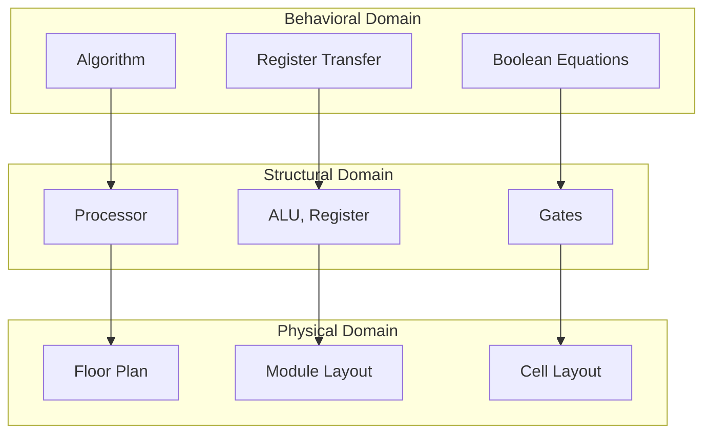
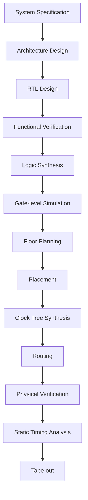

## Question 1(a) [3 marks]

**Draw neat labeled diagram of physical structure of n-channel MOSFET.**

**Answer**:

**Diagram:**

```goat
           Gate (G)
              |
    +---------+----------+
    |    SiO2 (oxide)    |
+---+--------------------+---+
|S  |                    | D |
|o  |  p-type substrate  | r |
|u  |                    | a |
|r  |     n+      n+     | i |
|c  |    ----    ----    | n |  
|e  |   Source   Drain   |   |
+---+--------------------+---+
              |
           Substrate/Body
```

**Key Components:**

- **Source**: n+ doped region providing electrons
- **Drain**: n+ doped region collecting electrons  
- **Gate**: Metal electrode controlling channel
- **Oxide**: SiO2 insulating layer
- **Substrate**: p-type silicon body

**Mnemonic:** "SOGD - Source, Oxide, Gate, Drain"

## Question 1(b) [4 marks]

**Draw energy band diagram of depletion and inversion of MOS under external bias with MOS biasing diagram. Explain inversion region in detail.**

**Answer**:

**MOS Biasing Circuit:**

```goat
    VG
     |
     |    Gate
    ++++++++++++
    |  SiO2   |
    +---------+
    | p-type  |
    +---------+
         |
        VB
```

**Energy Band Diagrams:**

| Bias Condition | Energy Band Behavior |
|----------------|---------------------|
| **Depletion** | Bands bend upward, holes depleted |
| **Inversion** | Strong band bending, electron channel forms |

**Inversion Region Details:**

- **Strong inversion**: VG > VT (threshold voltage)
- **Electron channel**: Forms at Si-SiO2 interface
- **Channel conductivity**: Increases with gate voltage
- **Threshold condition**: Surface potential = 2φF

**Mnemonic:** "DIVE - Depletion, Inversion, Voltage, Electrons"

## Question 1(c) [7 marks]

**Explain I-V characteristics of MOSFET.**

**Answer**:

**I-V Characteristic Regions:**

| Region | Condition | Drain Current |
|--------|-----------|---------------|
| **Cutoff** | VGS < VT | ID ≈ 0 |
| **Linear** | VGS > VT, VDS < VGS-VT | ID = μnCox(W/L)[(VGS-VT)VDS - VDS²/2] |
| **Saturation** | VGS > VT, VDS ≥ VGS-VT | ID = (μnCox/2)(W/L)(VGS-VT)² |

**Characteristic Curve:**

```goat
    ID
     |
     |     Saturation
     |    +---------
     |   /
     |  / Linear
     | /
     |/
  ---+-----------> VDS
     0    VGS-VT
```

**Key Parameters:**

- **μn**: Electron mobility
- **Cox**: Gate oxide capacitance
- **W/L**: Width to length ratio
- **VT**: Threshold voltage

**Operating Modes:**

- **Enhancement**: Channel forms with positive VGS
- **Square law**: Saturation region follows quadratic relationship

**Mnemonic:** "CLS - Cutoff, Linear, Saturation"

## Question 1(c) OR [7 marks]

**Define scaling. Explain the need of scaling. List and explain the negative effects of scaling.**

**Answer**:

**Definition:**
**Scaling** is the systematic reduction of MOSFET dimensions to improve performance and density.

**Need for Scaling:**

| Benefit | Description |
|---------|-------------|
| **Higher Density** | More transistors per chip area |
| **Faster Speed** | Reduced gate delays |
| **Lower Power** | Decreased switching energy |
| **Cost Reduction** | More chips per wafer |

**Scaling Types:**

| Type | Gate Length | Supply Voltage | Oxide Thickness |
|------|-------------|----------------|-----------------|
| **Constant Voltage** | ↓α | Constant | ↓α |
| **Constant Field** | ↓α | ↓α | ↓α |

**Negative Effects:**

- **Short channel effects**: Threshold voltage roll-off
- **Hot carrier effects**: Device degradation
- **Gate leakage**: Increased tunneling current
- **Process variations**: Manufacturing challenges
- **Power density**: Heat dissipation issues

**Mnemonic:** "SHGPP - Short channel, Hot carrier, Gate leakage, Process, Power"

## Question 2(a) [3 marks]

**Implement Y' = (AB' + A'B) using CMOS.**

**Answer**:

**Logic Analysis:**
Y' = (AB' + A'B) = A ⊕ B (XOR function)

**CMOS Implementation:**

```goat
    VDD
     |
   +-+-+   +-+-+
   |pA |   |pB |
   +---+   +---+
     |       |
     +---Y---+
     |       |
   +---+   +---+
   |nA |   |nB'|
   +-+-+   +-+-+
     |       |
    GND     GND
```

**Truth Table:**

| A | B | AB' | A'B | Y' |
|---|---|-----|-----|----|
| 0 | 0 | 0   | 0   | 1  |
| 0 | 1 | 0   | 1   | 0  |
| 1 | 0 | 1   | 0   | 0  |
| 1 | 1 | 0   | 0   | 1  |

**Mnemonic:** "XOR needs complementary switching"

## Question 2(b) [4 marks]

**Explain enhancement load inverter with its circuit diagrams.**

**Answer**:

**Circuit Diagram:**

```goat
    VDD
     |
     +---o VG2
     |
   +-+-+ Enhancement
   |ME |  Load
   +---+
     |
     +---o Vout
     |
   +-+-+
   |MD | Driver
   +---+
     |
    GND
     |
     +---o Vin
```

**Configuration:**

| Component | Type | Connection |
|-----------|------|------------|
| **Load (ME)** | Enhancement NMOS | Gate connected to VDD |
| **Driver (MD)** | Enhancement NMOS | Gate is input |

**Operation:**

- **Load transistor**: Acts as active load resistor
- **High output**: Limited by VT of load transistor
- **Low output**: Depends on driver strength
- **Disadvantage**: Poor VOH due to threshold drop

**Transfer Characteristics:**

- **VOH**: VDD - VT (degraded high level)
- **VOL**: Close to ground potential
- **Noise margin**: Reduced due to threshold loss

**Mnemonic:** "ELI - Enhancement Load Inverter has threshold Issues"

## Question 2(c) [7 marks]

**Explain Voltage Transfer Characteristic of inverter.**

**Answer**:

**VTC Parameters:**

| Parameter | Description | Ideal Value |
|-----------|-------------|-------------|
| **VOH** | Output High Voltage | VDD |
| **VOL** | Output Low Voltage | 0V |
| **VIH** | Input High Voltage | VDD/2 |
| **VIL** | Input Low Voltage | VDD/2 |
| **VM** | Switching Threshold | VDD/2 |

**VTC Curve:**

```goat
   Vout
     |
   VDD+         +-------
     |         /
     |        /
   VM+-------+  VM
     |        \
     |         \
     0         +-------
     +----+----+-----> Vin
      VIL VM  VIH   VDD
```

**Noise Margins:**

- **NMH** = VOH - VIH (High noise margin)
- **NML** = VIL - VOL (Low noise margin)

**Regions:**

- **Region 1**: Input low, output high
- **Region 2**: Transition region
- **Region 3**: Input high, output low

**Quality Metrics:**

- **Sharp transition**: Better noise immunity
- **Symmetric switching**: VM = VDD/2
- **Full swing**: VOH = VDD, VOL = 0

**Mnemonic:** "VTC shows VOICE - VOH, VOL, Input thresholds, Characteristics, Everything"

## Question 2(a) OR [3 marks]

**Explain NAND2 gate using CMOS.**

**Answer**:

**CMOS NAND2 Circuit:**

```goat
       VDD
        |
    +---+---+
    |       |
  +-+-+   +-+-+
  |pA |   |pB | PMOS
  +---+   +---+ (Parallel)
    |       |
    +---Y---+
        |
      +-+-+
      |nA | NMOS
      +---+ (Series)
        |
      +-+-+
      |nB |
      +---+
        |
       GND
```

**Truth Table:**

| A | B | Y |
|---|---|---|
| 0 | 0 | 1 |
| 0 | 1 | 1 |
| 1 | 0 | 1 |
| 1 | 1 | 0 |

**Operation:**

- **PMOS network**: Parallel connection (pull-up)
- **NMOS network**: Series connection (pull-down)
- **Output low**: Only when both inputs high

**Mnemonic:** "NAND - Not AND, Parallel PMOS, Series NMOS"

## Question 2(b) OR [4 marks]

**Explain operating mode and VTC of Resistive load inverter circuit.**

**Answer**:

**Circuit Configuration:**

```goat
    VDD
     |
     R (Load Resistor)
     |
     +---o Vout
     |
   +-+-+
   |MN | NMOS Driver
   +---+
     |
    GND
     |
     +---o Vin
```

**Operating Modes:**

| Input State | NMOS State | Output |
|-------------|------------|--------|
| **Vin = 0** | OFF | VOH = VDD |
| **Vin = VDD** | ON | VOL = R·ID/(R+RDS) |

**VTC Characteristics:**

- **VOH**: Excellent (VDD)  
- **VOL**: Depends on R and RDS ratio
- **Power consumption**: Static current when input high
- **Transition**: Gradual due to resistive load

**Design Trade-offs:**

- **Large R**: Better VOL, slower switching
- **Small R**: Faster switching, higher power
- **Area**: Resistor occupies significant space

**Mnemonic:** "RLI - Resistive Load has Inevitable power consumption"

## Question 2(c) OR [7 marks]

**Draw CMOS inverter and explain its operation with VTC.**

**Answer**:

**CMOS Inverter Circuit:**

```goat
       VDD
        |
      +-+-+
      |MP | PMOS
      +---+
        |
        +---o Vout
        |
      +-+-+
      |MN | NMOS  
      +---+
        |
       GND
        |
        +---o Vin
```

**Operation Regions:**

| Vin Range | PMOS | NMOS | Vout | Region |
|-----------|------|------|------|--------|
| **0 to VTN** | ON | OFF | VDD | 1 |
| **VTN to VDD-|VTP|** | ON | ON | Transition | 2 |
| **VDD-|VTP| to VDD** | OFF | ON | 0V | 3 |

**VTC Analysis:**

```goat
   Vout
     |
   VDD+
     |\
     | \
     |  \___
   VM+    \___
     |        \___
     |            \
     0             +---
     +----+----+----+---> Vin
        VTN  VM  VTP  VDD
```

**Key Features:**

- **Zero static power**: No DC current path
- **Full swing**: VOH = VDD, VOL = 0V
- **High noise margins**: NMH = NML ≈ 0.4VDD
- **Sharp transition**: High gain in transition region

**Design Considerations:**

- **β ratio**: βN/βP for symmetric switching
- **Threshold matching**: VTN ≈ |VTP| preferred

**Mnemonic:** "CMOS has Zero Static Power with Full Swing"

## Question 3(a) [3 marks]

**Realize Y= (A̅+B̅)C̅+D̅+E̅ using depletion load.**

**Answer**:

**Logic Simplification:**
Y = (A̅+B̅)C̅+D̅+E̅ = A̅C̅+B̅C̅+D̅+E̅

**Depletion Load Implementation:**

```goat
       VDD
        |
      +-+-+ VGS=0
      |MD | Depletion
      +---+ Load
        |
        +---o Y
        |
    +---+---+---+---+
    |   |   |   |   |
  +-+-+-+-+-+-+-+-+-+-+
  |A'| |B'| |C'| |D'| |E'| Pull-down
  +--+ +--+ +--+ +--+ +--+ Network
    |   |   |   |   |
   GND GND GND GND GND
```

**Pull-down Network:**

- **Series**: A̅C̅ path and B̅C̅ path  
- **Parallel**: All paths connected in parallel
- **Implementation**: Requires proper transistor sizing

**Mnemonic:** "Depletion Load with Parallel pull-down Paths"

## Question 3(b) [4 marks]

**Write a short note on FPGA.**

**Answer**:

**FPGA Definition:**
**Field Programmable Gate Array** - Reconfigurable integrated circuit.

**Architecture Components:**

| Component | Function |
|-----------|----------|
| **CLB** | Configurable Logic Block |
| **IOB** | Input/Output Block |
| **Interconnect** | Routing resources |
| **Switch Matrix** | Connection points |

**Programming Technologies:**

- **SRAM-based**: Volatile, fast reconfiguration
- **Antifuse**: Non-volatile, one-time programmable  
- **Flash-based**: Non-volatile, reprogrammable

**Applications:**

- **Prototyping**: Digital system development
- **DSP**: Signal processing applications
- **Control systems**: Industrial automation
- **Communications**: Protocol implementation

**Advantages vs ASIC:**

- **Flexibility**: Reconfigurable design
- **Time-to-market**: Faster development
- **Cost**: Lower for small volumes
- **Risk**: Reduced design risk

**Mnemonic:** "FPGA - Flexible Programming Gives Advantages"

## Question 3(c) [7 marks]

**Draw and explain Y chart design flow.**

**Answer**:

**Y-Chart Diagram:**



**Design Domains:**

| Domain | Levels | Description |
|--------|--------|-------------|
| **Behavioral** | Algorithm → RT → Boolean | What the system does |
| **Structural** | Processor → ALU → Gates | How system is constructed |
| **Physical** | Floor plan → Layout → Cells | Physical implementation |

**Design Flow Process:**

- **Top-down**: Start from behavioral, move to physical
- **Bottom-up**: Build from components upward  
- **Mixed approach**: Combination of both methods

**Abstraction Levels:**

- **System level**: Highest abstraction
- **RT level**: Register transfer operations
- **Gate level**: Boolean logic implementation
- **Layout level**: Physical geometry

**Design Verification:**

- **Horizontal**: Between domains at same level
- **Vertical**: Between levels in same domain

**Mnemonic:** "Y-Chart: Behavioral, Structural, Physical - BSP domains"

## Question 3(a) OR [3 marks]

**Explain NOR2 gate using depletion load.**

**Answer**:

**Depletion Load NOR2 Circuit:**

```goat
       VDD
        |
      +-+-+ VGS=0
      |MD | Depletion  
      +---+ Load
        |
        +---o Y
        |
    +---+---+
    |       |
  +-+-+   +-+-+
  |nA |   |nB | NMOS
  +---+   +---+ (Parallel)
    |       |
   GND     GND
```

**Truth Table:**

| A | B | Y |
|---|---|---|
| 0 | 0 | 1 |
| 0 | 1 | 0 |
| 1 | 0 | 0 |
| 1 | 1 | 0 |

**Operation:**

- **Both inputs low**: Both NMOS OFF, Y = VDD
- **Any input high**: Corresponding NMOS ON, Y = VOL
- **Load transistor**: Provides pull-up current

**Mnemonic:** "NOR with Depletion - Parallel NMOS pull-down"

## Question 3(b) OR [4 marks]

**Compare full custom and semi-custom design styles.**

**Answer**:

**Comparison Table:**

| Parameter | Full Custom | Semi-Custom |
|-----------|-------------|-------------|
| **Design Time** | Long (6-18 months) | Short (2-6 months) |
| **Performance** | Optimal | Good |
| **Area** | Minimum | Moderate |
| **Power** | Optimized | Acceptable |
| **Cost** | High NRE | Lower NRE |
| **Flexibility** | Maximum | Limited |
| **Risk** | High | Lower |

**Full Custom Characteristics:**

- **Every transistor**: Manually designed and placed
- **Layout optimization**: Maximum density achieved
- **Applications**: High-volume, performance-critical

**Semi-Custom Types:**

- **Gate Array**: Pre-defined transistor array
- **Standard Cell**: Library of pre-designed cells
- **FPGA**: Field programmable logic

**Design Flow Comparison:**

- **Full Custom**: Specification → Schematic → Layout → Verification
- **Semi-Custom**: Specification → HDL → Synthesis → Place & Route

**Mnemonic:** "Full Custom - Maximum control, Semi-Custom - Speed compromise"

## Question 3(c) OR [7 marks]

**Draw and explain ASIC design flow in detail.**

**Answer**:

**ASIC Design Flow:**



**Design Stages:**

| Stage | Description | Tools/Methods |
|-------|-------------|---------------|
| **RTL Design** | Hardware description | Verilog/VHDL |
| **Synthesis** | Convert RTL to gates | Logic synthesis tools |
| **Floor Planning** | Chip area allocation | Floor planning tools |
| **Placement** | Position gates/blocks | Placement algorithms |
| **Routing** | Connect placed elements | Routing algorithms |

**Verification Steps:**

- **Functional**: RTL simulation and verification
- **Gate-level**: Post-synthesis simulation  
- **Physical**: DRC, LVS, antenna checks
- **Timing**: STA for setup/hold violations

**Design Constraints:**

- **Timing**: Clock frequency requirements
- **Area**: Silicon area limitations
- **Power**: Power consumption targets
- **Test**: Design for testability

**Sign-off Checks:**

- **DRC**: Design Rule Check
- **LVS**: Layout Versus Schematic  
- **STA**: Static Timing Analysis
- **Power**: Power integrity analysis

**Mnemonic:** "ASIC flow: RTL → Synthesis → Physical → Verification"

## Question 4(a) [3 marks]

**Implement the logic function G = (A(D+E)+BC)̅ using CMOS**

**Answer**:

**Logic Analysis:**
G = (A(D+E)+BC)̅ = (AD+AE+BC)̅

**CMOS Implementation:**

```goat
         VDD
          |
    +-----+-----+-----+
    |     |     |     |
  +-+-+ +-+-+ +-+-+ +-+-+
  |pA | |pD | |pA | |pB | PMOS
  +---+ +---+ +---+ +---+ (Series branches)
    |     |     |     |
    +-----+     +-----+
          |           |
          +-----G-----+
                |
        +-------+-------+
        |       |       |
      +-+-+   +-+-+   +-+-+
      |nA |   |nA |   |nB | NMOS  
      +---+   +---+   +---+ (Parallel)
        |       |       |
      +-+-+   +-+-+     |
      |nD |   |nE |     |
      +---+   +---+     |
        |       |       |
       GND     GND    +-+-+
                      |nC |
                      +---+
                        |
                       GND
```

**Network Configuration:**

- **PMOS**: Series implementation of complement
- **NMOS**: Parallel implementation of original function

**Mnemonic:** "Complex CMOS - PMOS series, NMOS parallel"

## Question 4(b) [4 marks]

**Write a Verilog code for 3 bit parity checker.**

**Answer**:

**Verilog Code:**

```verilog
module parity_checker_3bit(
    input [2:0] data_in,
    output parity_even,
    output parity_odd
);

// Even parity checker
assign parity_even = ^data_in;

// Odd parity checker  
assign parity_odd = ~(^data_in);

// Alternative implementation
/*
assign parity_even = data_in[0] ^ data_in[1] ^ data_in[2];
assign parity_odd = ~(data_in[0] ^ data_in[1] ^ data_in[2]);
*/

endmodule
```

**Truth Table:**

| Input [2:0] | Number of 1s | Even Parity | Odd Parity |
|-------------|--------------|-------------|------------|
| 000 | 0 | 0 | 1 |
| 001 | 1 | 1 | 0 |
| 010 | 1 | 1 | 0 |
| 011 | 2 | 0 | 1 |
| 100 | 1 | 1 | 0 |
| 101 | 2 | 0 | 1 |
| 110 | 2 | 0 | 1 |
| 111 | 3 | 1 | 0 |

**Key Features:**

- **XOR reduction**: `^data_in` gives even parity
- **Complement**: `~(^data_in)` gives odd parity

**Mnemonic:** "Parity Check: XOR all bits"

## Question 4(c) [7 marks]

**Implement:**
**1) G = (AD +BC+EF) using CMOS [3 marks]**
**2) Y' = (ABCD + EF(G+H)+ J) using CMOS [4 marks]**

**Answer**:

**Part 1: G = (AD +BC+EF) [3 marks]**

**CMOS Circuit:**

```goat
         VDD
          |
    +-----+-----+-----+
    |     |     |     |
  +-+-+ +-+-+ +-+-+ +-+-+
  |pA | |pB | |pE | |pA | PMOS
  +---+ +---+ +---+ +---+ (Series branches)
    |     |     |     |
  +-+-+ +-+-+ +-+-+   |
  |pD | |pC | |pF |   |
  +---+ +---+ +---+   |
    |     |     |     |
    +-----+-----+-----+
              |
              G
              |
        +-----+-----+-----+
        |     |     |     |
      +-+-+ +-+-+ +-+-+ NMOS
      |nA | |nB | |nE | (Parallel)
      +---+ +---+ +---+
        |     |     |
      +-+-+ +-+-+ +-+-+
      |nD | |nC | |nF |
      +---+ +---+ +---+
        |     |     |
       GND   GND   GND
```

**Part 2: Y' = (ABCD + EF(G+H)+ J) [4 marks]**

This requires a complex implementation with multiple stages:

**Stage 1**: Implement (G+H)
**Stage 2**: Implement EF(G+H)  
**Stage 3**: Combine all terms

**Simplified approach using transmission gates and multiple stages would be more practical for this complex function.**

**Mnemonic:** "Complex functions need staged implementation"

## Question 4(a) OR [3 marks]

**Explain AOI logic with example.**

**Answer**:

**AOI Definition:**
**AND-OR-Invert** logic implements functions of form: Y = (AB + CD + ...)̅

**Example: Y = (AB + CD)̅**

**AOI Implementation:**

```goat
         VDD
          |
    +-----+-----+
    |           |
  +-+-+       +-+-+
  |pA |       |pC | PMOS
  +---+       +---+ (Series branches)
    |           |
  +-+-+       +-+-+
  |pB |       |pD |
  +---+       +---+
    |           |
    +-----------+
            |
            Y
            |
      +-----+-----+
      |           |
    +-+-+       +-+-+
    |nA |       |nC | NMOS
    +---+       +---+ (Parallel branches)
      |           |
    +-+-+       +-+-+
    |nB |       |nD |
    +---+       +---+
      |           |
     GND         GND
```

**Advantages:**

- **Single stage**: Direct implementation
- **Fast**: No propagation through multiple levels
- **Area efficient**: Fewer transistors than separate gates

**Applications:**

- **Complex gates**: Multi-input functions
- **Speed-critical paths**: Reduced delay

**Mnemonic:** "AOI - AND-OR-Invert in one stage"

## Question 4(b) OR [4 marks]

**Write Verilog Code for 4-bit Serial IN Parallel out shift register.**

**Answer**:

**Verilog Code:**

```verilog
module sipo_4bit(
    input clk,
    input reset,
    input serial_in,
    output reg [3:0] parallel_out
);

always @(posedge clk or posedge reset) begin
    if (reset) begin
        parallel_out <= 4'b0000;
    end else begin
        // Shift left and insert new bit at LSB
        parallel_out <= {parallel_out[2:0], serial_in};
    end
end

endmodule
```

**Testbench Example:**

```verilog
module tb_sipo_4bit;
    reg clk, reset, serial_in;
    wire [3:0] parallel_out;
    
    sipo_4bit dut(.clk(clk), .reset(reset), 
                  .serial_in(serial_in), 
                  .parallel_out(parallel_out));
                  
    initial begin
        clk = 0;
        forever #5 clk = ~clk;
    end
    
    initial begin
        reset = 1; serial_in = 0;
        #10 reset = 0;
        #10 serial_in = 1; // LSB first
        #10 serial_in = 0;
        #10 serial_in = 1; 
        #10 serial_in = 1; // MSB
        #20 $finish;
    end
endmodule
```

**Operation Timeline:**

| Clock | Serial_in | Parallel_out |
|-------|-----------|--------------|
| 1 | 1 | 0001 |
| 2 | 0 | 0010 |
| 3 | 1 | 0101 |
| 4 | 1 | 1011 |

**Mnemonic:** "SIPO - Serial In, Parallel Out with shift left"

## Question 4(c) OR [7 marks]

**Implement clocked NOR2 SR latch and D-latch using CMOS.**

**Answer**:

**Clocked NOR2 SR Latch:**

```goat
    S ---+    CLK
         |     |
       +-+-+ +-+-+
       |TG1| |TG2| Transmission Gates
       +---+ +---+
         |     |
    +----+     +----+
    |               |
  +-+-+           +-+-+
  |NOR|----Q------|NOR| Cross-coupled
  +---+           +---+ NOR gates
    |               |
    +-------R-------+
```

**D-Latch Implementation:**

```goat
    D ----+
          |
        +-+-+  CLK
        |TG1|---+
        +---+   |
          |     |
          +--+  |
             |  |
           +-+-+-+-+
           | Master |
           |  Latch |
           +---+---+
               |
               Q
```

**CMOS D-Latch Circuit:**

```goat
       VDD                    VDD
        |                      |
      +-+-+  CLK            +-+-+  CLK'
      |pTG|---+             |pTG|
      +---+   |             +---+
        |     |               |
    D---+     |               +---Q
        |     |               |
      +-+-+   |             +-+-+
      |nTG|---+             |nTG|
      +---+                 +---+
        |                     |
       GND                   GND
    
    Master Section        Slave Section
```

**Operation:**

- **CLK = 1**: Master transparent, slave holds
- **CLK = 0**: Master holds, slave transparent
- **Data transfer**: On clock edge

**Truth Table for SR Latch:**

| S | R | CLK | Q | Q' |
|---|---|-----|---|----|
| 0 | 0 | 1 | Hold | Hold |
| 0 | 1 | 1 | 0 | 1 |
| 1 | 0 | 1 | 1 | 0 |
| 1 | 1 | 1 | Invalid | Invalid |

**Mnemonic:** "Clocked latches use transmission gates for timing control"

## Question 5(a) [3 marks]

**Draw the stick diagram for Y = (PQ +U)' using CMOS considering Euler path approach.**

**Answer**:

**Logic Analysis:**
Y = (PQ + U)' requires PMOS: (PQ)' · U' = (P' + Q') · U'
NMOS: PQ + U

**Stick Diagram:**

```goat
    VDD ----------------------- VDD Rail
     |                         |
   +-+-+     +-+-+           +-+-+
   |P'|green |Q'|green       |U'|green  PMOS
   +-+-+     +-+-+           +-+-+
     |         |               |
     +---------+---------------+
                    |
                    Y ----------- Output
                    |
     +-------------+
     |                         |
   +-+-+     +-+-+           +-+-+
   |P |red   |Q |red         |U |red   NMOS  
   +-+-+     +-+-+           +-+-+
     |         |               |
     +---------+               |
               |               |
    GND -------+---------------+-- GND Rail

Legend:
- Green: P-diffusion (PMOS)
- Red: N-diffusion (NMOS)  
- Blue: Polysilicon (Gates)
- Metal: Interconnections
```

**Euler Path:**

1. **PMOS**: P' → Q' (series), then parallel to U'
2. **NMOS**: P → Q (series), then parallel to U
3. **Optimal routing**: Minimizes crossovers

**Layout Considerations:**

- **Diffusion breaks**: Minimize for better performance
- **Contact placement**: Proper VDD/GND connections
- **Metal routing**: Avoid DRC violations

**Mnemonic:** "Stick diagram shows physical layout with Euler path optimization"

## Question 5(b) [4 marks]

**Implement 8×1 multiplexer using Verilog**

**Answer**:

**Verilog Code:**

```verilog
module mux_8x1(
    input [7:0] data_in,    // 8 data inputs
    input [2:0] select,     // 3-bit select signal
    output reg data_out     // Output
);

always @(*) begin
    case (select)
        3'b000: data_out = data_in[0];
        3'b001: data_out = data_in[1];
        3'b010: data_out = data_in[2];
        3'b011: data_out = data_in[3];
        3'b100: data_out = data_in[4];
        3'b101: data_out = data_in[5];
        3'b110: data_out = data_in[6];
        3'b111: data_out = data_in[7];
        default: data_out = 1'b0;
    endcase
end

endmodule
```

**Alternative Implementation:**

```verilog
module mux_8x1_dataflow(
    input [7:0] data_in,
    input [2:0] select,
    output data_out
);

assign data_out = data_in[select];

endmodule
```

**Truth Table:**

| Select[2:0] | Output |
|-------------|--------|
| 000 | data_in[0] |
| 001 | data_in[1] |
| 010 | data_in[2] |
| 011 | data_in[3] |
| 100 | data_in[4] |
| 101 | data_in[5] |
| 110 | data_in[6] |
| 111 | data_in[7] |

**Testbench:**

```verilog
module tb_mux_8x1;
    reg [7:0] data_in;
    reg [2:0] select;
    wire data_out;
    
    mux_8x1 dut(.data_in(data_in), .select(select), .data_out(data_out));
    
    initial begin
        data_in = 8'b10110100;
        for (int i = 0; i < 8; i++) begin
            select = i;
            #10;
            $display("Select=%d, Output=%b", select, data_out);
        end
    end
endmodule
```

**Mnemonic:** "MUX selects one of many inputs based on select lines"

## Question 5(c) [7 marks]

**Implement full adder using behavioral modeling style in Verilog.**

**Answer**:

**Verilog Code:**

```verilog
module full_adder_behavioral(
    input A,
    input B, 
    input Cin,
    output reg Sum,
    output reg Cout
);

// Behavioral modeling using always block
always @(*) begin
    case ({A, B, Cin})
        3'b000: begin Sum = 1'b0; Cout = 1'b0; end
        3'b001: begin Sum = 1'b1; Cout = 1'b0; end
        3'b010: begin Sum = 1'b1; Cout = 1'b0; end
        3'b011: begin Sum = 1'b0; Cout = 1'b1; end
        3'b100: begin Sum = 1'b1; Cout = 1'b0; end
        3'b101: begin Sum = 1'b0; Cout = 1'b1; end
        3'b110: begin Sum = 1'b0; Cout = 1'b1; end
        3'b111: begin Sum = 1'b1; Cout = 1'b1; end
        default: begin Sum = 1'b0; Cout = 1'b0; end
    endcase
end

endmodule
```

**Alternative Behavioral Style:**

```verilog
module full_adder_behavioral_alt(
    input A, B, Cin,
    output reg Sum, Cout
);

always @(*) begin
    {Cout, Sum} = A + B + Cin;
end

endmodule
```

**Truth Table:**

| A | B | Cin | Sum | Cout |
|---|---|-----|-----|------|
| 0 | 0 | 0 | 0 | 0 |
| 0 | 0 | 1 | 1 | 0 |
| 0 | 1 | 0 | 1 | 0 |
| 0 | 1 | 1 | 0 | 1 |
| 1 | 0 | 0 | 1 | 0 |
| 1 | 0 | 1 | 0 | 1 |
| 1 | 1 | 0 | 0 | 1 |
| 1 | 1 | 1 | 1 | 1 |

**Testbench:**

```verilog
module tb_full_adder;
    reg A, B, Cin;
    wire Sum, Cout;
    
    full_adder_behavioral dut(.A(A), .B(B), .Cin(Cin), 
                             .Sum(Sum), .Cout(Cout));
    
    initial begin
        $monitor("A=%b B=%b Cin=%b | Sum=%b Cout=%b", 
                 A, B, Cin, Sum, Cout);
        
        {A, B, Cin} = 3'b000; #10;
        {A, B, Cin} = 3'b001; #10;
        {A, B, Cin} = 3'b010; #10;
        {A, B, Cin} = 3'b011; #10;
        {A, B, Cin} = 3'b100; #10;
        {A, B, Cin} = 3'b101; #10;
        {A, B, Cin} = 3'b110; #10;
        {A, B, Cin} = 3'b111; #10;
        
        $finish;
    end
endmodule
```

**Behavioral Features:**

- **Always block**: Describes behavior, not structure
- **Case statement**: Truth table implementation
- **Automatic synthesis**: Tools generate optimized circuit

**Mnemonic:** "Behavioral modeling describes what circuit does, not how"

## Question 5(a) OR [3 marks]

**Implement NOR2 gate CMOS circuit with its stick diagram.**

**Answer**:

**CMOS NOR2 Circuit:**

```goat
       VDD
        |
    +---+---+
    |       |
  +-+-+   +-+-+
  |pA |   |pB | PMOS (Parallel)
  +---+   +---+
    |       |
    +---Y---+
        |
      +-+-+
      |nA | NMOS (Series)
      +---+
        |
      +-+-+  
      |nB |
      +---+
        |
       GND
```

**Stick Diagram:**

```goat
    VDD ----------------------- VDD Rail
     |           |
   +-+-+       +-+-+
   |pA|green  |pB|green        PMOS (Parallel)
   +-+-+       +-+-+
     |           |
     +-----------+
           |
           Y ------------------- Output
           |
         +-+-+
         |nA|red                NMOS (Series)
         +-+-+
           |
         +-+-+
         |nB|red
         +-+-+
           |
    GND ---+------------------- GND Rail

Legend:
- Green: P-diffusion
- Red: N-diffusion  
- Blue: Polysilicon gates
- Metal: Connections
```

**Layout Rules:**

- **PMOS**: Parallel connection for pull-up
- **NMOS**: Series connection for pull-down  
- **Contacts**: Proper VDD/GND connections
- **Spacing**: Meet minimum design rules

**Mnemonic:** "NOR gate: Parallel PMOS, Series NMOS"

## Question 5(b) OR [4 marks]

**Implement 4 bit up counter using Verilog**

**Answer**:

**Verilog Code:**

```verilog
module counter_4bit_up(
    input clk,
    input reset,
    input enable,
    output reg [3:0] count
);

always @(posedge clk or posedge reset) begin
    if (reset) begin
        count <= 4'b0000;
    end else if (enable) begin
        if (count == 4'b1111) begin
            count <= 4'b0000;  // Rollover
        end else begin
            count <= count + 1;
        end
    end
    // If enable is low, hold current value
end

endmodule
```

**Enhanced Version with Overflow:**

```verilog
module counter_4bit_enhanced(
    input clk,
    input reset, 
    input enable,
    output reg [3:0] count,
    output overflow
);

always @(posedge clk or posedge reset) begin
    if (reset) begin
        count <= 4'b0000;
    end else if (enable) begin
        count <= count + 1;  // Natural rollover
    end
end

assign overflow = (count == 4'b1111) & enable;

endmodule
```

**Count Sequence:**

| Clock | Count[3:0] | Decimal |
|-------|------------|---------|
| 1 | 0000 | 0 |
| 2 | 0001 | 1 |
| 3 | 0010 | 2 |
| ... | ... | ... |
| 15 | 1110 | 14 |
| 16 | 1111 | 15 |
| 17 | 0000 | 0 (rollover) |

**Testbench:**

```verilog
module tb_counter_4bit;
    reg clk, reset, enable;
    wire [3:0] count;
    
    counter_4bit_up dut(.clk(clk), .reset(reset), 
                       .enable(enable), .count(count));
    
    // Clock generation
    initial begin
        clk = 0;
        forever #5 clk = ~clk;
    end
    
    // Test sequence
    initial begin
        reset = 1; enable = 0;
        #10 reset = 0; enable = 1;
        #200 enable = 0;  // Stop counting
        #20 enable = 1;   // Resume
        #100 $finish;
    end
    
    // Monitor
    always @(posedge clk) begin
        $display("Time=%t Count=%d", $time, count);
    end
endmodule
```

**Mnemonic:** "Up counter: increment on each clock when enabled"

## Question 5(c) OR [7 marks]

**Implement 3:8 decoder using behavioral modeling style in Verilog.**

**Answer**:

**Verilog Code:**

```verilog
module decoder_3x8_behavioral(
    input [2:0] address,    // 3-bit address input
    input enable,           // Enable signal
    output reg [7:0] decode_out  // 8-bit decoded output
);

always @(*) begin
    if (enable) begin
        case (address)
            3'b000: decode_out = 8'b00000001;  // Y0
            3'b001: decode_out = 8'b00000010;  // Y1  
            3'b010: decode_out = 8'b00000100;  // Y2
            3'b011: decode_out = 8'b00001000;  // Y3
            3'b100: decode_out = 8'b00010000;  // Y4
            3'b101: decode_out = 8'b00100000;  // Y5
            3'b110: decode_out = 8'b01000000;  // Y6
            3'b111: decode_out = 8'b10000000;  // Y7
            default: decode_out = 8'b00000000;
        endcase
    end else begin
        decode_out = 8'b00000000;  // All outputs low when disabled
    end
end

endmodule
```

**Alternative Implementation:**

```verilog
module decoder_3x8_shift(
    input [2:0] address,
    input enable,
    output [7:0] decode_out
);

assign decode_out = enable ? (8'b00000001 << address) : 8'b00000000;

endmodule
```

**Truth Table:**

| Enable | Address[2:0] | decode_out[7:0] |
|--------|--------------|-----------------|
| 0 | XXX | 00000000 |
| 1 | 000 | 00000001 |
| 1 | 001 | 00000010 |
| 1 | 010 | 00000100 |
| 1 | 011 | 00001000 |
| 1 | 100 | 00010000 |
| 1 | 101 | 00100000 |
| 1 | 110 | 01000000 |
| 1 | 111 | 10000000 |

**Testbench:**

```verilog
module tb_decoder_3x8;
    reg [2:0] address;
    reg enable;
    wire [7:0] decode_out;
    
    decoder_3x8_behavioral dut(.address(address), .enable(enable), 
                              .decode_out(decode_out));
    
    initial begin
        $monitor("Enable=%b Address=%b | Output=%b", 
                 enable, address, decode_out);
        
        // Test with enable = 0
        enable = 0;
        for (int i = 0; i < 8; i++) begin
            address = i;
            #10;
        end
        
        // Test with enable = 1
        enable = 1;
        for (int i = 0; i < 8; i++) begin
            address = i;
            #10;
        end
        
        $finish;
    end
endmodule
```

**Applications:**

- **Memory addressing**: Select one of 8 memory locations
- **Device selection**: Enable one of 8 peripheral devices
- **Demultiplexing**: Route single input to selected output

**Design Features:**

- **One-hot encoding**: Only one output high at a time
- **Enable control**: Global enable/disable functionality
- **Full decoding**: All possible input combinations handled

**Mnemonic:** "3:8 Decoder - 3 inputs select 1 of 8 outputs"
