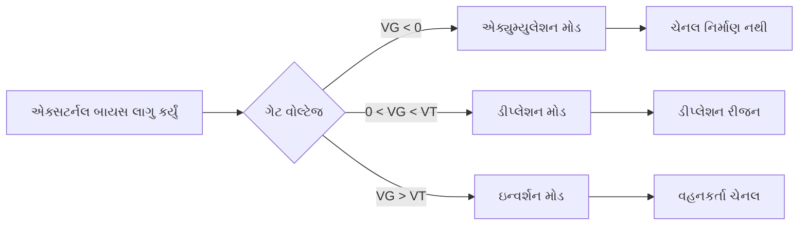
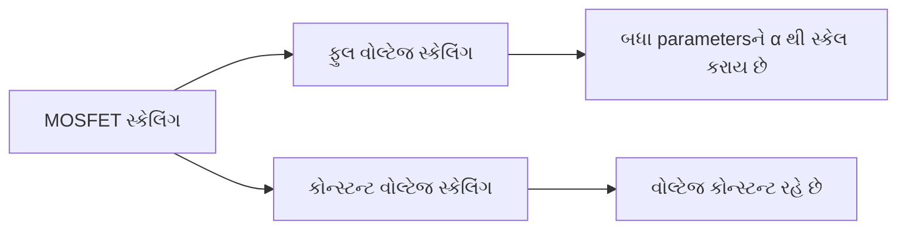
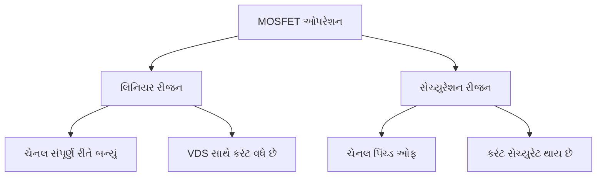
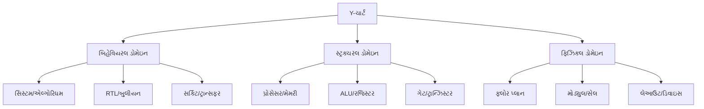
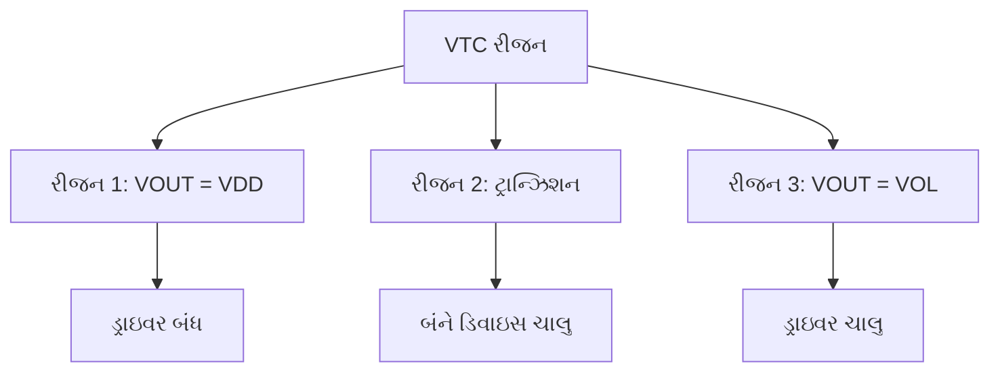
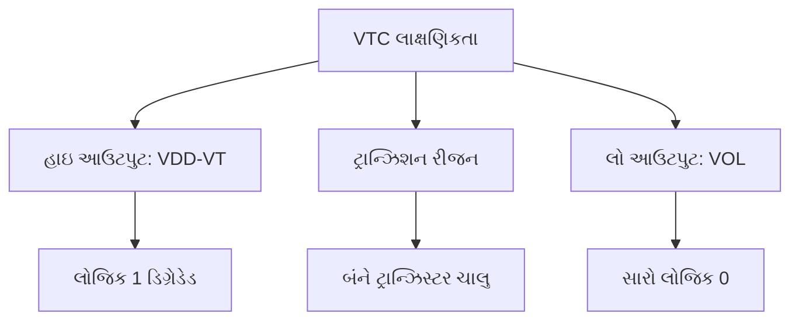
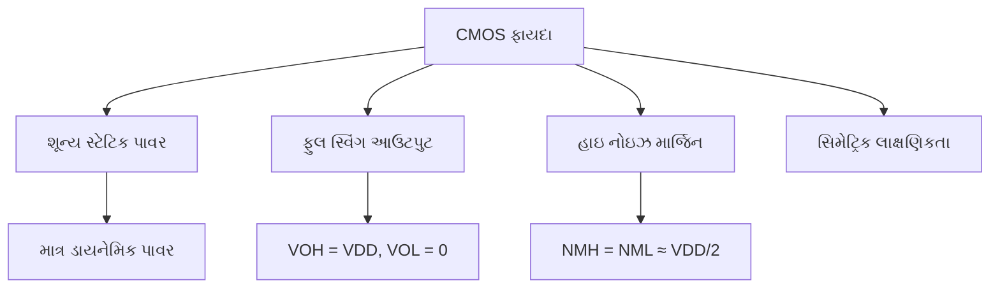
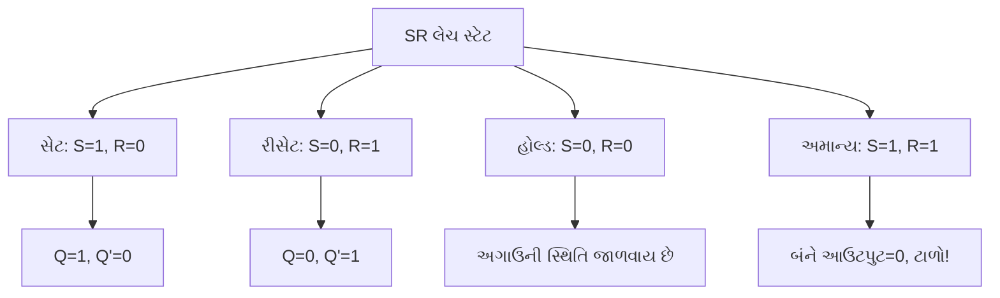
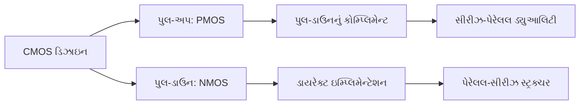

## પ્રશ્ન 1(અ) [3 ગુણ]

**એનહેન્સમેન્ટ અને ડીપ્લેશન ટાઈપ MOSFET માટે બધા સિમ્બોલ દોરો.**

**જવાબ**:

**આકૃતિ:**

```goat
Enhancement Type NMOS:           Enhancement Type PMOS:
    
    D                               D
    |                               |
G --+-- S                       G --+-- S
    |                               |
    B                               B
(ગેટ વોલ્ટેજ વિના ચેનલ નથી)        (ગેટ વોલ્ટેજ વિના ચેનલ નથી)

Depletion Type NMOS:            Depletion Type PMOS:
    
    D                               D
    |                               |
G --+==-- S                     G --+==-- S
    |                               |
    B                               B
(ગેટ વોલ્ટેજ વિના પણ ચેનલ છે)       (ગેટ વોલ્ટેજ વિના પણ ચેનલ છે)
```

- **એનહેન્સમેન્ટ MOSFET**: સોર્સ અને ડ્રેઇન વચ્ચે સામાન્ય કનેક્શન લાઇન
- **ડીપ્લેશન MOSFET**: અસ્તિત્વમાં રહેલ ચેનલ દર્શાવતી જાડી લાઇન
- **એરો દિશા**: NMOS માટે અંદરની તરફ, PMOS માટે બહારની તરફ

**મેમરી ટ્રીક:** "Enhancement ને વોલ્ટેજ જોઈએ, Depletion માં ડિફોલ્ટ ચેનલ"

## પ્રશ્ન 1(બ) [4 ગુણ]

**વ્યાખ્યા આપો: 1) હાઈરારકી 2) રેગ્યુલારીટી**

**જવાબ**:

| પરિભાષા | વ્યાખ્યા | ઉપયોગ |
|---------|----------|--------|
| **હાઈરારકી** | ટોપ-ડાઉન ડિઝાઇન અભિગમ જેમાં જટિલ સિસ્ટમને નાના, વ્યવસ્થિત મોડ્યુલમાં વિભાજિત કરાય છે | VLSI ડિઝાઇન ફ્લોમાં સિસ્ટમ લેવલથી ટ્રાન્ઝિસ્ટર લેવલ સુધી વપરાય છે |
| **રેગ્યુલારીટી** | જટિલતા ઘટાડવા માટે પુનરાવર્તિત સમાન સ્ટ્રક્ચરનો ઉપયોગ કરતી ડિઝાઇન તકનીક | મેમરી એરે, પ્રોસેસર ડેટાપાથમાં નિયમિત સ્ટ્રક્ચર વપરાય છે |

- **હાઈરારકીના ફાયદા**: સરળ ડિઝાઇન વેરિફિકેશન, મોડ્યુલર ટેસ્ટિંગ, ટીમ કોલેબોરેશન
- **રેગ્યુલારીટીના ફાયદા**: ઓછો ડિઝાઇન સમય, બહેતર યીલ્ડ, સરળ લેઆઉટ
- **ડિઝાઇન ફ્લો**: સિસ્ટમ → બિહેવિયરલ → RTL → ગેટ → લેઆઉટ
- **નિયમિત સ્ટ્રક્ચર**: ROM એરે, કેશ મેમરી, ALU બ્લોક

**મેમરી ટ્રીક:** "હાઈરારકી હેલ્પ કરે ઓર્ગેનાઇઝ કરવામાં, રેગ્યુલારીટી રિડ્યુસ કરે કોમ્પ્લેક્સિટી"

## પ્રશ્ન 1(ક) [7 ગુણ]

**MOS અન્ડર એક્સટર્નલ બાયસ સમજાવો.**

**જવાબ**:

**MOS બાયસ કન્ડિશન કોષ્ટક:**

| બાયસ કન્ડિશન | ગેટ વોલ્ટેજ | ચેનલ નિર્માણ | કરંટ ફ્લો |
|---------------|-------------|--------------|-----------|
| **એક્યુમ્યુલેશન** | VG < 0 (NMOS) | મેજોરિટી કેરિયર એકત્ર થાય છે | ચેનલ નથી |
| **ડીપ્લેશન** | 0 < VG < VT | ડીપ્લેશન રીજન બને છે | ન્યૂનતમ કરંટ |
| **ઇન્વર્શન** | VG > VT | માઇનોરિટી કેરિયર ચેનલ બનાવે છે | ચેનલ વહન કરે છે |

**આકૃતિ:**



- **બેન્ડ બેન્ડિંગ**: એક્સટર્નલ વોલ્ટેજ ઓક્સાઇડ-સિલિકોન ઇન્ટરફેસ પર એનર્જી બેન્ડ વાળે છે
- **થ્રેશોલ્ડ વોલ્ટેજ**: ચેનલ નિર્માણ માટે જરૂરી ન્યૂનતમ ગેટ વોલ્ટેજ
- **સરફેસ પોટેન્શિયલ**: સિલિકોન સરફેસ પર કેરિયર કોન્સંટ્રેશન કંટ્રોલ કરે છે
- **કેપેસિટન્સ વેરિએશન**: બાયસ કન્ડિશન સાથે બદલાય છે

**મેમરી ટ્રીક:** "એક્યુમ્યુલેશન આકર્ષે, ડીપ્લેશન ડિપ્લીટ કરે, ઇન્વર્શન ઇન્વર્ટ કરે કેરિયર"

## પ્રશ્ન 1(ક) OR [7 ગુણ]

**સ્કેલિંગની શું જરૂરિયાત છે? સ્કેલિંગના ટાઈપ તેની ઈફેક્ટ સાથે સમજાવો.**

**જવાબ**:

**સ્કેલિંગની જરૂરિયાત:**

| પેરામીટર | ફાયદો | પ્રભાવ |
|----------|-------|-------|
| **એરિયા રિડક્શન** | ચિપ દીઠ વધુ ટ્રાન્ઝિસ્ટર | ઊંચી ઇન્ટિગ્રેશન ડેન્સિટી |
| **સ્પીડ ઇન્ક્રીઝ** | ઓછી ડીલે | બહેતર પરફોર્મન્સ |
| **પાવર રિડક્શન** | ઓછો પાવર વપરાશ | પોર્ટેબલ ડિવાઇસ |
| **કોસ્ટ રિડક્શન** | ફંક્શન દીઠ સસ્તું | માર્કેટ કોમ્પિટિટિવનેસ |

**સ્કેલિંગના પ્રકાર:**



- **ફુલ વોલ્ટેજ સ્કેલિંગ**: લેન્થ, વિડથ, વોલ્ટેજ બધું α ફેક્ટર દ્વારા સ્કેલ
- **કોન્સ્ટન્ટ વોલ્ટેજ સ્કેલિંગ**: ડાઇમેન્શન સ્કેલ, વોલ્ટેજ અપરિવર્તિત
- **પાવર ડેન્સિટી**: ફુલ સ્કેલિંગમાં કોન્સ્ટન્ટ રહે, કોન્સ્ટન્ટ વોલ્ટેજમાં વધે
- **ઇલેક્ટ્રિક ફીલ્ડ**: ફુલ સ્કેલિંગમાં મેન્ટેઇન થાય છે

**મેમરી ટ્રીક:** "સ્કેલિંગ સેવ કરે સ્પેસ, સ્પીડ અને સ્પેન્ડિંગ"

## પ્રશ્ન 2(અ) [3 ગુણ]

**FPGA પર ટૂંકનોંધ લખો.**

**જવાબ**:

**FPGA લાક્ષણિકતાઓ કોષ્ટક:**

| લક્ષણ | વર્ણન | ફાયદો |
|------|------|-------|
| **ફીલ્ડ પ્રોગ્રામેબલ** | મેન્યુફેક્ચરિંગ પછી કોન્ફિગરેબલ | ડિઝાઇનમાં લવચીકતા |
| **ગેટ એરે** | લોજિક બ્લોકનું એરે | પેરેલલ પ્રોસેસિંગ |
| **રિકોન્ફિગરેબલ** | ફરીથી પ્રોગ્રામ કરી શકાય | પ્રોટોટાઇપ ડેવલપમેન્ટ |

- **એપ્લિકેશન**: ડિજિટલ સિગ્નલ પ્રોસેસિંગ, એમ્બેડેડ સિસ્ટમ, પ્રોટોટાઇપિંગ
- **આર્કિટેક્ચર**: CLBs (કોન્ફિગરેબલ લોજિક બ્લોક) રાઉટિંગ મેટ્રિક્સ દ્વારા કનેક્ટેડ
- **પ્રોગ્રામિંગ**: SRAM-આધારિત કોન્ફિગરેશન મેમરી
- **વેન્ડર**: Xilinx, Altera (Intel), Microsemi

**મેમરી ટ્રીક:** "FPGA: ફ્લેક્સિબલ પ્રોગ્રામિંગ ફોર ગેટ એરે"

## પ્રશ્ન 2(બ) [4 ગુણ]

**સેમી કસ્ટમ અને ફુલ કસ્ટમ ડિઝાઇન મેથોડોલોજી સરખાવો.**

**જવાબ**:

| પેરામીટર | સેમી-કસ્ટમ | ફુલ કસ્ટમ |
|----------|------------|-----------|
| **ડિઝાઇન ટાઇમ** | ઓછો (અઠવાડિયા) | વધુ (મહિના) |
| **કોસ્ટ** | ઓછો ડેવલપમેન્ટ કોસ્ટ | વધુ ડેવલપમેન્ટ કોસ્ટ |
| **પરફોર્મન્સ** | મધ્યમ પરફોર્મન્સ | સર્વોચ્ચ પરફોર્મન્સ |
| **એરિયા એફિશિયન્સી** | ઓછી કાર્યક્ષમ | સૌથી કાર્યક્ષમ |
| **એપ્લિકેશન** | ASICs, મધ્યમ વોલ્યુમ | માઇક્રોપ્રોસેસર, ઊંચો વોલ્યુમ |
| **ડિઝાઇન એફર્ટ** | સ્ટાન્ડર્ડ સેલ વપરાય છે | દરેક ટ્રાન્ઝિસ્ટર ડિઝાઇન કરાય છે |

- **સેમી-કસ્ટમ**: પ્રી-ડિઝાઇન્ડ સ્ટાન્ડર્ડ સેલ અને ગેટ એરેનો ઉપયોગ કરે છે
- **ફુલ કસ્ટમ**: સંપૂર્ણ ટ્રાન્ઝિસ્ટર-લેવલ ડિઝાઇન ઓપ્ટિમાઇઝેશન
- **ટ્રેડ-ઓફ**: સમય વર્સિસ પરફોર્મન્સ, કોસ્ટ વર્સિસ એફિશિયન્સી
- **માર્કેટ ફિટ**: મોટાભાગના એપ્લિકેશન માટે સેમી-કસ્ટમ, સ્પેશિયલાઇઝડ જરૂરિયાત માટે ફુલ કસ્ટમ

**મેમરી ટ્રીક:** "સેમી-કસ્ટમ છે સ્ટાન્ડર્ડ, ફુલ કસ્ટમ છે ફાઇનેસ્ટ"

## પ્રશ્ન 2(ક) [7 ગુણ]

**1) 0<VDS<VDSAT 2) VDS = VDSAT 3) VDS > VDSAT માટે MOSFET ઓપરેશન સમજાવો.**

**જવાબ**:

**ઓપરેટિંગ રીજન:**

| રીજન | કન્ડિશન | ચેનલ | કરંટ બિહેવિયર |
|-------|----------|------|---------------|
| **લિનિયર** | 0 < VDS < VDSAT | યુનિફોર્મ ચેનલ | ID ∝ VDS |
| **સેચ્યુરેશન ઓન્સેટ** | VDS = VDSAT | પિંચ-ઓફ શરૂ થાય છે | મેક્સિમમ લિનિયર કરંટ |
| **સેચ્યુરેશન** | VDS > VDSAT | પિંચ્ડ ચેનલ | ID કોન્સ્ટન્ટ |

**આકૃતિ:**



- **લિનિયર રીજન**: ચેનલ વોલ્ટેજ-કંટ્રોલ્ડ રેઝિસ્ટર તરીકે કામ કરે છે
- **સેચ્યુરેશન રીજન**: કરંટ માત્ર ગેટ વોલ્ટેજ દ્વારા કંટ્રોલ થાય છે
- **VDSAT કેલ્ક્યુલેશન**: VDSAT = VGS - VT
- **કરંટ સમીકરણો**: દરેક રીજન માટે અલગ મેથેમેટિકલ મોડેલ

**મેમરી ટ્રીક:** "લિનિયર લાઇક્સ VDS, સેચ્યુરેશન સેઝ નો મોર"

## પ્રશ્ન 2(અ) OR [3 ગુણ]

**સ્ટાન્ડર્ડ સેલ બેઝ્ડ ડિઝાઇન સમજાવો.**

**જવાબ**:

**સ્ટાન્ડર્ડ સેલ ડિઝાઇન કોષ્ટક:**

| કમ્પોનન્ટ | વર્ણન | ફાયદો |
|----------|------|-------|
| **સ્ટાન્ડર્ડ સેલ** | પ્રી-ડિઝાઇન્ડ લોજિક ગેટ | ઝડપી ડિઝાઇન |
| **સેલ લાઇબ્રેરી** | કેરેક્ટરાઇઝ્ડ સેલનો સંગ્રહ | અનુમાનિત પરફોર્મન્સ |
| **પ્લેસ એન્ડ રાઉટ** | ઓટોમેટેડ લેઆઉટ જનરેશન | ઓછો ડિઝાઇન સમય |

- **પ્રોસેસ**: લોજિક સિન્થેસિસ → પ્લેસમેન્ટ → રાઉટિંગ → વેરિફિકેશન
- **સેલ પ્રકાર**: બેસિક ગેટ, ફ્લિપ-ફ્લોપ, લેચ, કોમ્પ્લેક્સ ફંક્શન
- **ઓટોમેશન**: EDA ટૂલ ફિઝિકલ ઇમ્પ્લિમેન્ટેશન હેન્ડલ કરે છે
- **ક્વોલિટી**: બેલેન્સ્ડ પરફોર્મન્સ, એરિયા અને પાવર

**મેમરી ટ્રીક:** "સ્ટાન્ડર્ડ સેલ સ્પીડ અપ કરે સિન્થેસિસ"

## પ્રશ્ન 2(બ) OR [4 ગુણ]

**Y ચાર્ટ દોરો અને સમજાવો.**

**જવાબ**:

**આકૃતિ:**



| ડોમેઇન | વર્ણન | ઉદાહરણ |
|--------|------|---------|
| **બિહેવિયરલ** | સિસ્ટમ શું કરે છે | એલ્ગોરિધમ, RTL કોડ |
| **સ્ટ્રક્ચરલ** | સિસ્ટમ કેવી રીતે બને છે | ગેટ, મોડ્યુલ, પ્રોસેસર |
| **ફિઝિકલ** | ફિઝિકલ ઇમ્પ્લિમેન્ટેશન | લેઆઉટ, ફ્લોરપ્લાન, માસ્ક |

- **ડિઝાઇન ફ્લો**: બાહ્ય રિંગ (સિસ્ટમ) થી અંદરની રિંગ (ડિવાઇસ) તરફ જવું
- **એબ્સ્ટ્રેક્શન લેવલ**: દરેક રિંગ અલગ વિગતનું સ્તર દર્શાવે છે
- **ડોમેઇન ઇન્ટરેક્શન**: સમાન એબ્સ્ટ્રેક્શન પર ડોમેઇન વચ્ચે મૂવ થઈ શકાય
- **VLSI ડિઝાઇન**: ત્રણેય ડોમેઇન અને એબ્સ્ટ્રેક્શન લેવલ કવર કરે છે

**મેમરી ટ્રીક:** "Y-ચાર્ટ: બિહેવિયર, સ્ટ્રક્ચર, ફિઝિકલ"

## પ્રશ્ન 2(ક) OR [7 ગુણ]

**MOSFET કરંટ-વોલ્ટેજ કેરેક્ટરિસ્ટિક માટે ગ્રેજુઅલ ચેનલ એપ્રોક્સિમેશન સમજાવો.**

**જવાબ**:

**ધારણાઓ:**

| ધારણા | વર્ણન | જસ્ટિફિકેશન |
|-------|------|-------------|
| **ગ્રેજુઅલ ચેનલ** | ચેનલ લેન્થ >> ચેનલ ડેપ્થ | લોંગ ચેનલ ડિવાઇસ |
| **1D એનાલિસિસ** | કરંટ માત્ર x-દિશામાં ફ્લો થાય છે | મેથેમેટિક્સ સરળ બનાવે છે |
| **ડ્રિફ્ટ કરંટ** | ડિફ્યુઝન કરંટ નેગ્લેક્ટ કરવો | હાઇ ફીલ્ડ કન્ડિશન |
| **ચાર્જ શીટ** | મોબાઇલ ચાર્જ પાતળી શીટમાં | નાની ઇન્વર્શન લેયર |

**કરંટ ડેરિવેશન:**

- **ડ્રેઇન કરંટ**: ID = μn Cox (W/L) [(VGS-VT)VDS - VDS²/2]
- **લિનિયર રીજન**: જ્યારે VDS < VGS-VT
- **સેચ્યુરેશન**: જ્યારે VDS ≥ VGS-VT, ID = μn Cox (W/2L)(VGS-VT)²
- **ચેનલ ચાર્જ**: સોર્સથી ડ્રેઇન સુધી લિનિયર રીતે વેરી થાય છે

**મર્યાદાઓ:**

- **શોર્ટ ચેનલ ઇફેક્ટ**: ગ્રેજુઅલ એપ્રોક્સિમેશન બ્રેક ડાઉન થાય છે
- **વેલોસિટી સેચ્યુરેશન**: હાઇ ફીલ્ડ ઇફેક્ટ ઇન્ક્લુડ નથી
- **2D ઇફેક્ટ**: સિમ્પલ મોડેલમાં અવગણાય છે

**મેમરી ટ્રીક:** "ગ્રેજુઅલ ચેન્જ ગિવ સિમ્પલ ગેઇન એક્વેશન"

## પ્રશ્ન 3(અ) [3 ગુણ]

**આઈડલ ઇન્વર્ટરનો સિમ્બોલ દોરો અને ટ્રુથ ટેબલ લખો. આઈડલ ઇન્વર્ટર માટે VTC દોરો અને સમજાવો.**

**જવાબ**:

**સિમ્બોલ અને ટ્રુથ ટેબલ:**

```goat
    VIN ------>|>o----- VOUT
              NOT
```

| VIN | VOUT |
|-----|------|
| 0   | 1    |
| 1   | 0    |

**VTC (વોલ્ટેજ ટ્રાન્સફર કેરેક્ટરિસ્ટિક):**

```goat
VOUT ^
     |
 VDD +-----+
     |     |
     |     |
     |     +------
     |           
     +--------------> VIN
     0   VDD/2   VDD
```

- **આઈડલ લાક્ષણિકતા**: VDD/2 પર તીવ્ર સંક્રમણ
- **નોઇઝ માર્જિન**: NMH = NML = VDD/2
- **ગેઇન**: સ્વિચિંગ પોઇન્ટ પર અનંત
- **પાવર કન્ઝમ્પશન**: શૂન્ય સ્ટેટિક પાવર

**મેમરી ટ્રીક:** "આઈડલ ઇન્વર્ટર: અનંત ગેઇન, ઇન્સ્ટન્ટ સ્વિચિંગ"

## પ્રશ્ન 3(બ) [4 ગુણ]

**જનરાલાઇઝ્ડ ઇન્વર્ટર સર્કિટ VTC સાથે સમજાવો.**

**જવાબ**:

**સર્કિટ કોન્ફિગરેશન:**

| કમ્પોનન્ટ | ફંક્શન | લાક્ષણિકતા |
|----------|-------|------------|
| **ડ્રાઇવર ટ્રાન્ઝિસ્ટર** | પુલ-ડાઉન ડિવાઇસ | સ્વિચિંગ કંટ્રોલ કરે છે |
| **લોડ ડિવાઇસ** | પુલ-અપ એલિમેન્ટ | હાઇ આઉટપુટ પ્રદાન કરે છે |
| **સપ્લાય વોલ્ટેજ** | પાવર સોર્સ | લોજિક લેવલ નક્કી કરે છે |

**VTC રીજન:**



- **લોડ લાઇન એનાલિસિસ**: ડ્રાઇવર અને લોડની લાક્ષણિકતાઓનું આંતરછેદ
- **સ્વિચિંગ થ્રેશોલ્ડ**: ડિવાઇસ સાઇઝિંગ રેશિયો દ્વારા નક્કી થાય છે
- **નોઇઝ માર્જિન**: ટ્રાન્ઝિશન શાર્પનેસ પર આધાર રાખે છે
- **પાવર ડિસિપેશન**: ટ્રાન્ઝિશન દરમિયાન સ્ટેટિક કરંટ

**મેમરી ટ્રીક:** "જનરાલાઇઝ્ડ ડિઝાઇન: ડ્રાઇવર પુલ ડાઉન, લોડ લિફ્ટ અપ"

## પ્રશ્ન 3(ક) [7 ગુણ]

**ડીપ્લેશન લોડ nMOS ઇન્વર્ટર તેની સર્કિટ, ઓપરેટિંગ રીજન અને VTC સાથે સમજાવો.**

**જવાબ**:

**સર્કિટ આકૃતિ:**

```goat
           VDD
            |
         +--+--+ VGS = 0
    VG --|     |
         |  T2 | (ડીપ્લેશન લોડ)
         +-----+
            |
         +--+--+
    VIN -+     +- VOUT
         |  T1 |
         +-----+
            |
           GND
```

**ઓપરેટિંગ રીજન:**

| ઇનપુટ સ્ટેટ | T1 સ્ટેટ | T2 સ્ટેટ | આઉટપુટ |
|-------------|----------|----------|---------|
| **VIN = 0** | બંધ | ચાલુ (ડીપ્લેશન) | VOUT = VDD-VT |
| **VIN = VDD** | ચાલુ | ચાલુ (રેઝિસ્ટિવ) | VOUT = VOL |

**VTC એનાલિસિસ:**



- **ફાયદા**: સિમ્પલ ફેબ્રિકેશન, સારી ડ્રાઇવ કેપેબિલિટી
- **નુકસાન**: ડિગ્રેડેડ હાઇ આઉટપુટ, સ્ટેટિક પાવર કન્ઝમ્પશન
- **એપ્લિકેશન**: પ્રારંભિક NMOS લોજિક ફેમિલી
- **ડિઝાઇન વિચારણા**: વિડથ રેશિયો સ્વિચિંગ પોઇન્ટને અસર કરે છે

**મેમરી ટ્રીક:** "ડીપ્લેશન ડિવાઇસ ડિલિવર કરે ડીસેન્ટ ડ્રાઇવ"

## પ્રશ્ન 3(અ) OR [3 ગુણ]

**નોઇઝ માર્જિન સમજાવો.**

**જવાબ**:

**વ્યાખ્યા અને પેરામીટર:**

| પેરામીટર | વર્ણન | ફોર્મ્યુલા |
|----------|------|----------|
| **NMH** | હાઇ નોઇઝ માર્જિન | NMH = VOH - VIH |
| **NML** | લો નોઇઝ માર્જિન | NML = VIL - VOL |
| **VOH** | આઉટપુટ હાઇ વોલ્ટેજ | મિનિમમ હાઇ આઉટપુટ |
| **VOL** | આઉટપુટ લો વોલ્ટેજ | મેક્સિમમ લો આઉટપુટ |
| **VIH** | ઇનપુટ હાઇ થ્રેશોલ્ડ | મિનિમમ ઇનપુટ હાઇ |
| **VIL** | ઇનપુટ લો થ્રેશોલ્ડ | મેક્સિમમ ઇનપુટ લો |

- **મહત્વ**: સર્કિટની નોઇઝ સામે પ્રતિરોધકતાનું માપ
- **ડિઝાઇન લક્ષ્ય**: NMH અને NML બન્નેને મેક્સિમાઇઝ કરો
- **ટ્રેડ-ઓફ**: નોઇઝ માર્જિન વર્સિસ સ્પીડ વર્સિસ પાવર
- **એપ્લિકેશન**: ડિજિટલ સિસ્ટમ ડિઝાઇનમાં મહત્વપૂર્ણ

**મેમરી ટ્રીક:** "નોઇઝ માર્જિન મેઇન્ટેઇન કરે સિગ્નલ ઇન્ટેગ્રિટી"

## પ્રશ્ન 3(બ) OR [4 ગુણ]

**રેઝિસ્ટિવ લોડ ઇન્વર્ટર સમજાવો.**

**જવાબ**:

**સર્કિટ અને એનાલિસિસ:**

| કમ્પોનન્ટ | ફંક્શન | લાક્ષણિકતા |
|----------|-------|------------|
| **NMOS ટ્રાન્ઝિસ્ટર** | સ્વિચિંગ ડિવાઇસ | વેરિએબલ રેઝિસ્ટન્સ |
| **લોડ રેઝિસ્ટર** | પુલ-અપ એલિમેન્ટ | ફિક્સ્ડ રેઝિસ્ટન્સ RL |
| **પાવર સપ્લાય** | વોલ્ટેજ સોર્સ | VDD પ્રદાન કરે છે |

**ઓપરેટિંગ પ્રિન્સિપલ:**

- **હાઇ ઇનપુટ**: ટ્રાન્ઝિસ્ટર ચાલુ, VOUT = ID × RL (લો)
- **લો ઇનપુટ**: ટ્રાન્ઝિસ્ટર બંધ, VOUT = VDD (હાઇ)
- **કરંટ પાથ**: આઉટપુટ લો હોય ત્યારે હંમેશા રેઝિસ્ટર દ્વારા
- **પાવર કન્ઝમ્પશન**: સ્ટેટિક પાવર = VDD²/RL

**ફાયદા અને નુકસાન:**

- **સિમ્પલ ડિઝાઇન**: સમજવામાં અને ઇમ્પ્લિમેન્ટ કરવામાં સરળ
- **ખરાબ પરફોર્મન્સ**: હાઇ સ્ટેટિક પાવર, સ્લો સ્વિચિંગ
- **મર્યાદિત ઉપયોગ**: મુખ્યત્વે કોન્સેપ્ટ સમજવા માટે

**મેમરી ટ્રીક:** "રેઝિસ્ટર રિસ્ટ્રિક્ટ કરે કરંટ, રિડ્યુસ કરે પરફોર્મન્સ"

## પ્રશ્ન 3(ક) OR [7 ગુણ]

**CMOS ઇન્વર્ટર તેની VTC સાથે સમજાવો.**

**જવાબ**:

**સર્કિટ કોન્ફિગરેશન:**

```goat
           VDD
            |
         +--+--+
    VIN -+     +- VOUT
         | PMOS|
         +-----+
            |
         +--+--+
    VIN -+     |
         | NMOS+- VOUT
         +-----+
            |
           GND
```

**VTC રીજન:**

| રીજન | ઇનપુટ રેન્જ | PMOS સ્ટેટ | NMOS સ્ટેટ | આઉટપુટ |
|-------|-------------|------------|------------|---------|
| **1** | VIN < VTN | ચાલુ | બંધ | VDD |
| **2** | VTN < VIN < VDD/2 | ચાલુ | ચાલુ | ટ્રાન્ઝિશન |
| **3** | VDD/2 < VIN < VDD+VTP | ચાલુ | ચાલુ | ટ્રાન્ઝિશન |
| **4** | VIN > VDD+VTP | બંધ | ચાલુ | 0 |

**મુખ્ય લાક્ષણિકતાઓ:**



- **કોમ્પ્લિમેન્ટરી ઓપરેશન**: સ્ટેડી સ્ટેટમાં માત્ર એક ટ્રાન્ઝિસ્ટર વહન કરે છે
- **સ્વિચિંગ પોઇન્ટ**: PMOS/NMOS રેશિયો દ્વારા નક્કી થાય છે
- **પાવર એફિશિયન્સી**: ન્યૂનતમ સ્ટેટિક પાવર કન્ઝમ્પશન
- **નોઇઝ ઇમ્યુનિટી**: ઉત્તમ નોઇઝ માર્જિન

**મેમરી ટ્રીક:** "CMOS: કોમ્પ્લિમેન્ટરી ફોર કોમ્પ્લીટ પરફોર્મન્સ"

## પ્રશ્ન 4(અ) [3 ગુણ]

**AOI CMOS ઇમ્પ્લિમેન્ટેશન સાથે દોરો.**

**જવાબ**:

**AOI (AND-OR-INVERT) લોજિક:** Y = (AB + CD)'

**CMOS ઇમ્પ્લિમેન્ટેશન:**

```goat
        VDD
         |
    +----+----+
    |         |
   PMOS     PMOS  (A')
    A'       B'
    |         |
    +----+----+
         |
    +----+----+
    |         |
   PMOS     PMOS  (C')
    C'       D'
    |         |
    +----+----+-- VOUT
         |
    +----+----+
    |         |
   NMOS     NMOS  (સીરીઝ: AB)
    A        B
    |         |
    +----+----+
         |
    +----+----+
    |         |
   NMOS     NMOS  (પેરેલલ: CD)
    C        D
    |         |
    +----+----+
         |
        GND
```

- **પુલ-અપ નેટવર્ક**: PMOS ટ્રાન્ઝિસ્ટર સીરીઝ-પેરેલલમાં
- **પુલ-ડાઉન નેટવર્ક**: NMOS ટ્રાન્ઝિસ્ટર પેરેલલ-સીરીઝમાં
- **ડ્યુઆલિટી**: પુલ-અપ અને પુલ-ડાઉન કોમ્પ્લિમેન્ટ છે

**મેમરી ટ્રીક:** "AOI: AND-OR પછી ઇન્વર્ટ"

## પ્રશ્ન 4(બ) [4 ગુણ]

**બે ઇનપુટ NOR અને NAND ગેટ ડીપ્લેશન લોડ nMOS થી બનાવો.**

**જવાબ**:

**NOR ગેટ:**

```goat
        VDD
         |
      +--+--+ (ડીપ્લેશન લોડ)
 VG --|     |
      |     |
      +-----+-- VOUT
         |
    +----+----+
    |         |
   NMOS     NMOS  (પેરેલલ)
    A        B
    |         |
    +----+----+
         |
        GND
```

**NAND ગેટ:**

```goat
        VDD
         |
      +--+--+ (ડીપ્લેશન લોડ)
 VG --|     |
      |     |
      +-----+-- VOUT
         |
      +--+--+
  A --|     |
      | NMOS|  (સીરીઝ)
      +-----+
         |
      +--+--+
  B --|     |
      | NMOS|
      +-----+
         |
        GND
```

**ટ્રુથ ટેબલ:**

| A | B | NOR | NAND |
|---|---|-----|------|
| 0 | 0 | 1   | 1    |
| 0 | 1 | 0   | 1    |
| 1 | 0 | 0   | 1    |
| 1 | 1 | 0   | 0    |

**મેમરી ટ્રીક:** "NOR ને કંઈ હાઇ નહીં જોઈએ, NAND ને બધું હાઇ જોઈએ લો થવા માટે"

## પ્રશ્ન 4(ક) [7 ગુણ]

**NOR2 અને NAND2 ગેટનો ઉપયોગ કરીને CMOS SR લેચ ઇમ્પ્લિમેન્ટ કરો.**

**જવાબ**:

**NOR ગેટ વડે SR લેચ:**

```goat
    S ----+---[NOR]---+---- Q
          |           |
          +-----+     |
                |     |
          +-----+     |
          |           |
    R ----+---[NOR]---+---- Q'
                      |
                      +-----
```

**CMOS NOR ગેટ ઇમ્પ્લિમેન્ટેશન:**



**સ્ટેટ ટેબલ:**

| S | R | Q(n+1) | Q'(n+1) | એક્શન |
|---|---|--------|---------|--------|
| 0 | 0 | Q(n)   | Q'(n)   | હોલ્ડ |
| 0 | 1 | 0      | 1       | રીસેટ |
| 1 | 0 | 1      | 0       | સેટ |
| 1 | 1 | 0      | 0       | અમાન્ય |

- **ક્રોસ-કપ્લ્ડ સ્ટ્રક્ચર**: દરેક ગેટનું આઉટપુટ બીજાના ઇનપુટને ફીડ કરે છે
- **બાઇસ્ટેબલ ઓપરેશન**: બે સ્થિર અવસ્થા (સેટ અને રીસેટ)
- **મેમરી એલિમેન્ટ**: એક બિટ માહિતી સ્ટોર કરે છે
- **ક્લોક ઇન્ડિપેન્ડન્સ**: એસિંક્રોનસ ઓપરેશન

**મેમરી ટ્રીક:** "SR લેચ: સેટ-રીસેટ વિથ ક્રોસ-કપ્લ્ડ ગેટ"

## પ્રશ્ન 4(અ) OR [3 ગુણ]

**CMOS નો ઉપયોગ કરીને XOR ફંક્શન ઇમ્પ્લિમેન્ટ કરો.**

**જવાબ**:

**XOR ટ્રુથ ટેબલ:**

| A | B | Y = A⊕B |
|---|---|---------|
| 0 | 0 | 0       |
| 0 | 1 | 1       |
| 1 | 0 | 1       |
| 1 | 1 | 0       |

**CMOS XOR ઇમ્પ્લિમેન્ટેશન:**

```goat
        VDD
         |
    +----+----+
    |         |
 A'-+PMOS  PMOS+-B'
    |         |
    +----+----+
         |
    +----+----+
    |         |
 B'-+PMOS  PMOS+-A'
    |         |
    +----+----+-- VOUT
         |
    +----+----+
    |         |
 A--+NMOS  NMOS+-B
    |         |
    +----+----+
         |
    +----+----+
    |         |
 B--+NMOS  NMOS+-A
    |         |
    +----+----+
         |
        GND
```

- **ફંક્શન**: Y = AB' + A'B
- **ટ્રાન્ઝિસ્ટર કાઉન્ટ**: 8 ટ્રાન્ઝિસ્ટર (4 PMOS + 4 NMOS)
- **વિકલ્પ**: ટ્રાન્સમિશન ગેટ ઇમ્પ્લિમેન્ટેશન

**મેમરી ટ્રીક:** "XOR: એક્સક્લુસિવ OR, અલગ ઇનપુટ આપે 1"

## પ્રશ્ન 4(બ) OR [4 ગુણ]

**બે ઇનપુટ NOR અને NAND ગેટ CMOS થી બનાવો.**

**જવાબ**:

**CMOS NOR ગેટ:**

```goat
        VDD
         |
    +----+----+
    |         |
 A'-+PMOS  PMOS+-B'  (સીરીઝ)
    |         |
    +----+----+-- VOUT
         |
    +----+----+
    |         |
 A--+NMOS     +-B
    |    NMOS |      (પેરેલલ)
    +----+----+
         |
        GND
```

**CMOS NAND ગેટ:**

```goat
        VDD
         |
    +----+----+
    |         |
 A'-+PMOS     +-B'  (પેરેલલ)
    |    PMOS |
    +----+----+-- VOUT
         |
    +----+----+
    |         |
 A--+NMOS  NMOS+-B  (સીરીઝ)
    |         |
    +----+----+
         |
        GND
```

**ડિઝાઇન નિયમો:**

| ગેટ | પુલ-અપ નેટવર્ક | પુલ-ડાઉન નેટવર્ક |
|-----|---------------|------------------|
| **NAND** | PMOS પેરેલલમાં | NMOS સીરીઝમાં |
| **NOR** | PMOS સીરીઝમાં | NMOS પેરેલલમાં |

**મેમરી ટ્રીક:** "NAND: નોટ AND, NOR: નોટ OR - નેટવર્ક કોમ્પ્લિમેન્ટ કરો"

## પ્રશ્ન 4(ક) OR [7 ગુણ]

**Y=[PQ+R(S+T)]' બુલિયન સમીકરણ ડીપ્લેશન લોડ nMOS અને CMOS થી ઇમ્પ્લિમેન્ટ કરો.**

**જવાબ**:

**બુલિયન એનાલિસિસ:**

- ફંક્શન: Y = [PQ + R(S+T)]'
- વિસ્તૃત: Y = [PQ + RS + RT]'
- ડે મોર્ગન: Y = (PQ)' · (RS)' · (RT)'
- અંતિમ: Y = (P'+Q') · (R'+S') · (R'+T')

**nMOS ઇમ્પ્લિમેન્ટેશન:**

```goat
        VDD
         |
      +--+--+ (ડીપ્લેશન લોડ)
      |     |
      +-----+-- VOUT
         |
    P--+NMOS+--+
              |
    Q--+NMOS+--+
              |
              +-- (PQ બ્રાન્ચ)
              |
    R--+NMOS+--+
              |
         +----+----+
         |         |
    S--+NMOS   NMOS+--T
         |         |
         +---------+
              |
             GND
```

**CMOS ઇમ્પ્લિમેન્ટેશન:**



- **nMOS લાક્ષણિકતા**: સિમ્પલ પણ સ્ટેટિક પાવર સાથે
- **CMOS ફાયદા**: સ્ટેટિક પાવર નથી, ફુલ સ્વિંગ
- **જટિલતા**: nMOS માટે 7 ટ્રાન્ઝિસ્ટર, CMOS માટે 14
- **પરફોર્મન્સ**: CMOS ઝડપી અને વધુ કાર્યક્ષમ

**મેમરી ટ્રીક:** "બુલિયન ટુ સર્કિટ: nMOS સિમ્પલ, CMOS કોમ્પ્લીટ"

## પ્રશ્ન 5(અ) [3 ગુણ]

**વેરિલોગમાં ઉપયોગ થતી ડિઝાઇન સ્ટાઇલ સમજાવો.**

**જવાબ**:

**વેરિલોગ ડિઝાઇન સ્ટાઇલ:**

| સ્ટાઇલ | વર્ણન | એપ્લિકેશન |
|-------|------|------------|
| **ગેટ લેવલ** | પ્રિમિટિવ ગેટનો ઉપયોગ | લો-લેવલ હાર્ડવેર મોડેલિંગ |
| **ડેટા ફ્લો** | assign સ્ટેટમેન્ટનો ઉપયોગ | કોમ્બિનેશનલ લોજિક |
| **બિહેવિયરલ** | always બ્લોકનો ઉપયોગ | સિક્વેન્શિયલ અને કોમ્પ્લેક્સ લોજિક |
| **મિક્સ્ડ** | સ્ટાઇલનું કોમ્બિનેશન | સંપૂર્ણ સિસ્ટમ ડિઝાઇન |

- **ગેટ લેવલ**: and, or, not, nand, nor પ્રિમિટિવ
- **ડેટા ફ્લો**: ઓપરેટર સાથે કંટિન્યુઅસ એસાઇનમેન્ટ
- **બિહેવિયરલ**: always બ્લોકમાં પ્રોસિજરલ એસાઇનમેન્ટ
- **હાઇરારકી**: મોડ્યુલ અલગ સ્ટાઇલ વાપરી શકે છે

**મેમરી ટ્રીક:** "ગેટ-ડેટા-બિહેવિયર: મોડેલ કરવાની ત્રણ રીત"

## પ્રશ્ન 5(બ) [4 ગુણ]

**બિહેવિયરલ મોડેલિંગ થી ફુલ એડર માટે વેરિલોગ પ્રોગ્રામ લખો.**

**જવાબ**:

```verilog
module full_adder_behavioral (
    input wire a, b, cin,
    output reg sum, cout
);

always @(*) begin
    case ({a, b, cin})
        3'b000: {cout, sum} = 2'b00;
        3'b001: {cout, sum} = 2'b01;
        3'b010: {cout, sum} = 2'b01;
        3'b011: {cout, sum} = 2'b10;
        3'b100: {cout, sum} = 2'b01;
        3'b101: {cout, sum} = 2'b10;
        3'b110: {cout, sum} = 2'b10;
        3'b111: {cout, sum} = 2'b11;
        default: {cout, sum} = 2'b00;
    endcase
end

endmodule
```

**મુખ્ય લક્ષણો:**

- **Always બ્લોક**: બિહેવિયરલ મોડેલિંગ કન્સ્ટ્રક્ટ
- **Case સ્ટેટમેન્ટ**: ટ્રુથ ટેબલ ઇમ્પ્લિમેન્ટેશન
- **કોનકેટેનેશન**: કોમ્બાઇન्ड આઉટપુટ માટે {cout, sum}
- **સેન્સિટિવિટી લિસ્ટ**: કોમ્બિનેશનલ લોજિક માટે @(*)

**મેમરી ટ્રીક:** "બિહેવિયરલ યુઝ કરે Always વિથ Case સ્ટેટમેન્ટ"

## પ્રશ્ન 5(ક) [7 ગુણ]

**CASE સ્ટેટમેન્ટનું ફંક્શન વર્ણવો. CASE સ્ટેટમેન્ટનો ઉપયોગ કરીને 3x8 ડિકોડરનો વેરિલોગ કોડ લખો.**

**જવાબ**:

**CASE સ્ટેટમેન્ટ ફંક્શન:**

| લક્ષણ | વર્ણન | ઉપયોગ |
|-------|------|-------|
| **મલ્ટિ-વે બ્રાન્ચ** | અનેક વિકલ્પોમાંથી એક પસંદ કરે | C માં switch જેવું |
| **પેટર્ન મેચિંગ** | એક્સપ્રેશનને કોન્સ્ટન્ટ સાથે કોમ્પેર કરે | બરાબર બિટ મેચિંગ |
| **પ્રાયોરિટી એન્કોડિંગ** | પહેલું મેચ જીતે છે | ટોપ-ડાઉન ઇવેલ્યુએશન |
| **ડિફોલ્ટ ક્લોઝ** | અનસ્પેસિફાઇડ કેસ હેન્ડલ કરે | લેચ અટકાવે છે |

**3x8 ડિકોડર વેરિલોગ કોડ:**

```verilog
module decoder_3x8 (
    input wire [2:0] select,
    input wire enable,
    output reg [7:0] out
);

always @(*) begin
    if (enable) begin
        case (select)
            3'b000: out = 8'b00000001;
            3'b001: out = 8'b00000010;
            3'b010: out = 8'b00000100;
            3'b011: out = 8'b00001000;
            3'b100: out = 8'b00010000;
            3'b101: out = 8'b00100000;
            3'b110: out = 8'b01000000;
            3'b111: out = 8'b10000000;
            default: out = 8'b00000000;
        endcase
    end else begin
        out = 8'b00000000;
    end
end

endmodule
```

**CASE સ્ટેટમેન્ટ લક્ષણો:**

- **બરાબર મેચિંગ**: બધા બિટ બરાબર મેચ થવા જોઈએ
- **પેરેલલ ઇવેલ્યુએશન**: હાર્ડવેર ઇમ્પ્લિમેન્ટેશન પેરેલલ છે
- **સંપૂર્ણ સ્પેસિફિકેશન**: બધા શક્ય ઇનપુટ કોમ્બિનેશન કવર કર્યા
- **ડિફોલ્ટ ક્લોઝ**: સિન્થેસિસમાં અનઇન્ટેન્ડેડ લેચ અટકાવે છે

**મેમરી ટ્રીક:** "CASE કોમ્પેર કરે બધું સ્પેસિફાઇડ એક્ઝેક્ટલી"

## પ્રશ્ન 5(અ) OR [3 ગુણ]

**2:1 મલ્ટિપ્લેક્સર ઇમ્પ્લિમેન્ટ કરતો વેરિલોગ કોડ લખો.**

**જવાબ**:

```verilog
module mux_2to1 (
    input wire a, b, sel,
    output wire y
);

assign y = sel ? b : a;

endmodule
```

**વિકલ્પિત ઇમ્પ્લિમેન્ટેશન:**

| સ્ટાઇલ | કોડ | ઉપયોગ કેસ |
|-------|-----|-----------|
| **ડેટા ફ્લો** | assign y = sel ? b : a; | સિમ્પલ લોજિક |
| **ગેટ લેવલ** | and, or, not ગેટ વાપરે | શીખવાનો હેતુ |
| **બિહેવિયરલ** | if-else સાથે always બ્લોક | કોમ્પ્લેક્સ કન્ડિશન |

- **કન્ડિશનલ ઓપરેટર**: ? : મલ્ટિપ્લેક્સર ફંક્શન પ્રદાન કરે
- **કંટિન્યુઅસ એસાઇનમેન્ટ**: કોમ્બિનેશનલ લોજિક માટે assign
- **સિન્થેસિસ**: ટૂલ ગેટ-લે lველ ઇમ્પ્લિમેન્ટેશનમાં કન્વર્ટ કરે

**મેમરી ટ્રીક:** "MUX: sel ? b : a - ઇનપુટ વચ્ચે પસંદગી"

## પ્રશ્ન 5(બ) OR [4 ગુણ]

**બિહેવિયરલ મોડેલિંગ થી D ફ્લિપ-ફ્લોપ માટે વેરિલોગ પ્રોગ્રામ લખો.**

**જવાબ**:

```verilog
module d_flipflop (
    input wire clk, reset, d,
    output reg q, qbar
);

always @(posedge clk or posedge reset) begin
    if (reset) begin
        q <= 1'b0;
        qbar <= 1'b1;
    end else begin
        q <= d;
        qbar <= ~d;
    end
end

endmodule
```

**મુખ્ય લક્ષણો:**

| એલિમેન્ટ | ફંક્શન | સિન્ટેક્સ |
|----------|-------|---------|
| **posedge clk** | રાઇઝિંગ એજ ટ્રિગર | ક્લોક સિંક્રોનાઇઝેશન |
| **posedge reset** | એસિંક્રોનસ રીસેટ | તાત્કાલિક રીસેટ એક્શન |
| **નોન-બ્લોકિંગ** | <= ઓપરેટર | સિક્વેન્શિયલ લોજિક |
| **કોમ્પ્લિમેન્ટરી** | qbar = ~q | સાચી ફ્લિપ-ફ્લોપ બિહેવિયર |

- **એજ સેન્સિટિવિટી**: માત્ર ક્લોક એજ પર પ્રતિભાવ આપે
- **એસિંક્રોનસ રીસેટ**: રીસેટ ક્લોક કરતાં પ્રાથમિકતા લે
- **સિક્વેન્શિયલ લોజિક**: નોન-બ્લોકિંગ એસાઇનમેન્ટ વાપરે
- **સ્ટેટ સ્ટોરેજ**: ક્લોક સાઇકલ વચ્ચે ડેટા જાળવે

**મેમરી ટ્રીક:** "D ફ્લિપ-ફ્લોપ: ડેટા ફોલો કરે ક્લોક વિથ રીસેટ"

## પ્રશ્ન 5(ક) OR [7 ગુણ]

**ટેસ્ટબેંચ ટૂંકમાં વર્ણવો. 4-બિટ ડાઉન કાઉન્ટર ઇમ્પ્લિમેન્ટ કરવાનો વેરિલોગ કોડ લખો.**

**જવાબ**:

**ટેસ્ટબેંચ ઓવરવ્યુ:**

| કમ્પોનન્ટ | ઉદ્દેશ્ય | ઇમ્પ્લિમેન્ટેશન |
|----------|---------|----------------|
| **સ્ટિમ્યુલસ જનરેશન** | ટેસ્ટ ઇનપુટ પ્રદાન કરવું | ક્લોક, રીસેટ, કંટ્રોલ સિગ્નલ |
| **રિસ્પોન્સ મોનિટરિંગ** | આઉટપુટ ચેક કરવું | અપેક્ષિત મૂલ્ય સાથે સરખાવો |
| **કવરેજ એનાલિસિસ** | સંપૂર્ણતા ચકાસવી | બધી સ્ટેટ અને ટ્રાન્ઝિશન |
| **ડિબગિંગ સપોર્ટ** | સમસ્યા ઓળખવી | વેવફોર્મ એનાલિસિસ |

**4-બિટ ડાઉન કાઉન્ટર:**

```verilog
module down_counter_4bit (
    input wire clk, reset, enable,
    output reg [3:0] count
);

always @(posedge clk or posedge reset) begin
    if (reset) begin
        count <= 4'b1111;  // મેક્સિમમ વેલ્યુથી શરૂ કરો
    end else if (enable) begin
        if (count == 4'b0000)
            count <= 4'b1111;  // રેપ અરાઉન્ડ
        else
            count <= count - 1;  // ડેક્રિમેન્ટ
    end
end

endmodule

// ડાઉન કાઉન્ટર માટે ટેસ્ટબેંચ
module tb_down_counter;
    reg clk, reset, enable;
    wire [3:0] count;
    
    down_counter_4bit dut (
        .clk(clk), 
        .reset(reset), 
        .enable(enable), 
        .count(count)
    );
    
    // ક્લોક જનરેશન
    always #5 clk = ~clk;
    
    initial begin
        clk = 0;
        reset = 1;
        enable = 0;
        
        #10 reset = 0;
        #10 enable = 1;
        
        #200 $finish;
    end
    
    // આઉટપુટ મોનિટર
    initial begin
        $monitor("Time=%0t, Reset=%b, Enable=%b, Count=%b", 
                 $time, reset, enable, count);
    end
    
endmodule
```

**ટેસ્ટબેંચ કમ્પોનન્ટ:**

- **ક્લોક જનરેશન**: always બ્લોક વડે કંટિન્યુઅસ ક્લોક
- **સ્ટિમ્યુલસ**: રીસેટ અને enable સિગ્નલ કંટ્રોલ
- **મોનિટરિંગ**: કંટિન્યુઅસ આઉટપુટ ડિસ્પ્લે
- **સિમ્યુલેશન કંટ્રોલ**: સિમ્યુલેશન અંત કરવા માટે $finish

**કાઉન્ટર લક્ષણો:**

- **ડાઉન કાઉન્ટિંગ**: 15 થી 0 સુધી ડેક્રિમેન્ટ
- **રેપ અરાઉન્ડ**: 0 પહોંચ્યા પછી 15 પર પાછું ફરે
- **enable કંટ્રોલ**: માત્ર enable હોય ત્યારે જ કાઉન્ટિંગ
- **સિંક્રોનસ ઓપરેશન**: ક્લોક એજ પર બધા ફેરફાર

**મેમરી ટ્રીક:** "ટેસ્ટબેંચ ટેસ્ટ કરે ક્લોક, સ્ટિમ્યુલસ અને મોનિટર સાથે"
