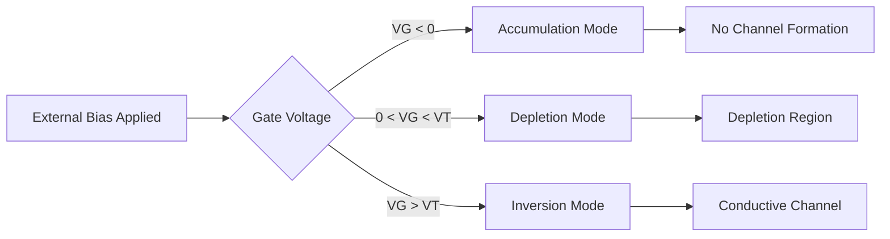
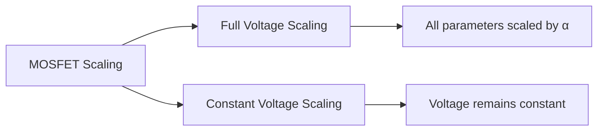
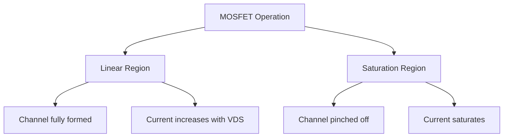
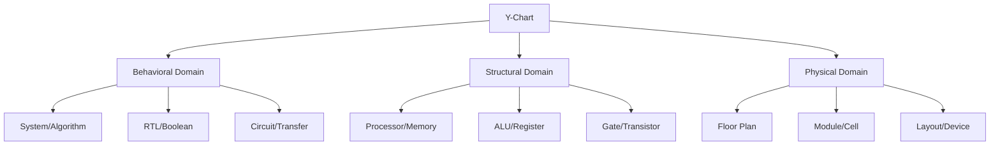
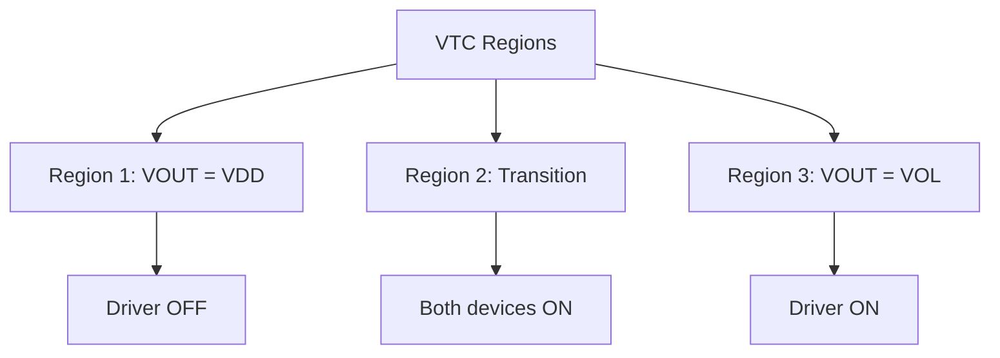
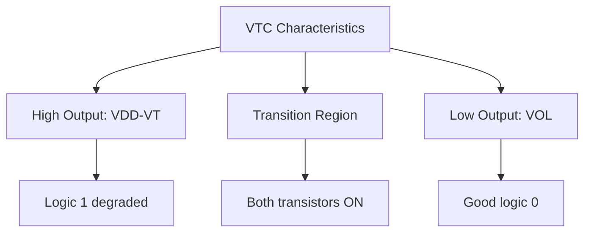
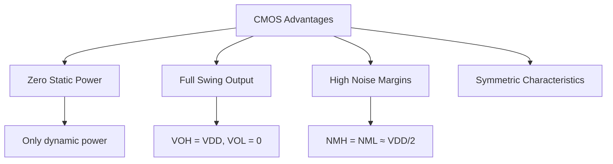
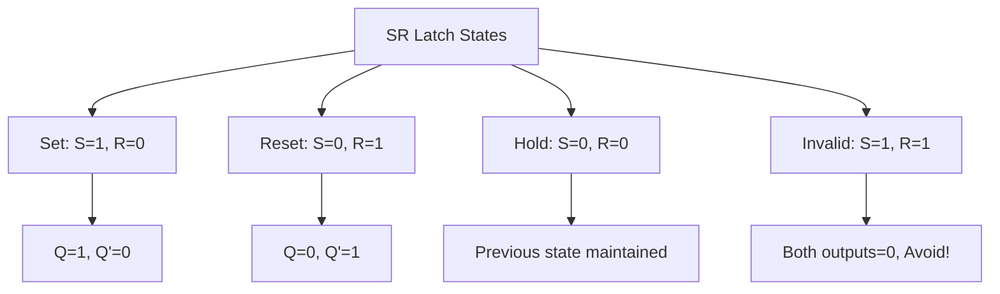
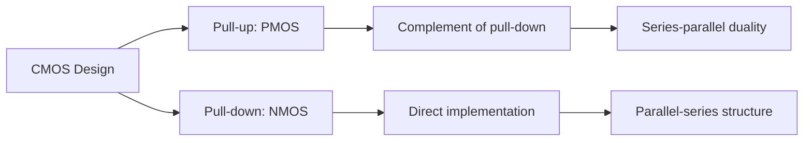

## Question 1(a) [3 marks]

**Draw all symbols for enhancement and depletion type MOSFET.**

**Answer**:

**Diagram:**

```goat
Enhancement Type NMOS:           Enhancement Type PMOS:
    
    D                               D
    |                               |
G --+-- S                       G --+-- S
    |                               |
    B                               B
(No channel exists               (No channel exists
 without gate voltage)            without gate voltage)

Depletion Type NMOS:            Depletion Type PMOS:
    
    D                               D
    |                               |
G --+==-- S                     G --+==-- S
    |                               |
    B                               B
(Channel exists even            (Channel exists even
 without gate voltage)            without gate voltage)
```

- **Enhancement MOSFET**: Normal connection line between source and drain
- **Depletion MOSFET**: Thick solid line indicating existing channel
- **Arrow direction**: Points inward for NMOS, outward for PMOS

**Mnemonic:** "Enhancement Needs voltage, Depletion has Default channel"

## Question 1(b) [4 marks]

**Define: 1) Hierarchy 2) Regularity**

**Answer**:

| Term | Definition | Application |
|------|------------|-------------|
| **Hierarchy** | Top-down design approach where complex systems are broken into smaller, manageable modules | Used in VLSI design flow from system level to transistor level |
| **Regularity** | Design technique using repeated identical structures to reduce complexity | Memory arrays, processor datapaths use regular structures |

- **Hierarchy benefits**: Easier design verification, modular testing, team collaboration
- **Regularity advantages**: Reduced design time, better yield, simplified layout
- **Design flow**: System → Behavioral → RTL → Gate → Layout
- **Regular structures**: ROM arrays, cache memories, ALU blocks

**Mnemonic:** "Hierarchy Helps organize, Regularity Reduces complexity"

## Question 1(c) [7 marks]

**Explain MOS under external bias.**

**Answer**:

**Table: MOS Bias Conditions**

| Bias Condition | Gate Voltage | Channel Formation | Current Flow |
|----------------|--------------|-------------------|--------------|
| **Accumulation** | VG < 0 (NMOS) | Majority carriers accumulate | No channel |
| **Depletion** | 0 < VG < VT | Depletion region forms | Minimal current |
| **Inversion** | VG > VT | Minority carriers form channel | Channel conducts |

**Diagram:**



- **Band bending**: External voltage bends energy bands at oxide-silicon interface
- **Threshold voltage**: Minimum gate voltage needed for channel formation
- **Surface potential**: Controls carrier concentration at silicon surface
- **Capacitance variation**: Changes with bias conditions

**Mnemonic:** "Accumulation Attracts, Depletion Depletes, Inversion Inverts carriers"

## Question 1(c) OR [7 marks]

**What is the need for scaling? Explain types of scaling with its effect.**

**Answer**:

**Need for Scaling:**

| Parameter | Benefit | Impact |
|-----------|---------|---------|
| **Area reduction** | More transistors per chip | Higher integration density |
| **Speed increase** | Reduced delays | Better performance |
| **Power reduction** | Lower power consumption | Portable devices |
| **Cost reduction** | Cheaper per function | Market competitiveness |

**Types of Scaling:**



- **Full voltage scaling**: Length, width, voltage all scaled by factor α
- **Constant voltage scaling**: Dimensions scaled, voltage unchanged
- **Power density**: Remains constant in full scaling, increases in constant voltage
- **Electric field**: Maintained in full scaling

**Mnemonic:** "Scaling Saves Space, Speed, and Spending"

## Question 2(a) [3 marks]

**Write short note on FPGA.**

**Answer**:

**Table: FPGA Characteristics**

| Feature | Description | Advantage |
|---------|-------------|-----------|
| **Field Programmable** | Configurable after manufacturing | Flexibility in design |
| **Gate Array** | Array of logic blocks | Parallel processing |
| **Reconfigurable** | Can be reprogrammed | Prototype development |

- **Applications**: Digital signal processing, embedded systems, prototyping
- **Architecture**: CLBs (Configurable Logic Blocks) connected by routing matrix
- **Programming**: SRAM-based configuration memory
- **Vendors**: Xilinx, Altera (Intel), Microsemi

**Mnemonic:** "FPGA: Flexible Programming for Gate Arrays"

## Question 2(b) [4 marks]

**Compare semi-custom and full custom design methodologies.**

**Answer**:

| Parameter | Semi-Custom | Full Custom |
|-----------|-------------|-------------|
| **Design Time** | Shorter (weeks) | Longer (months) |
| **Cost** | Lower development cost | Higher development cost |
| **Performance** | Moderate performance | Highest performance |
| **Area Efficiency** | Less efficient | Most efficient |
| **Applications** | ASICs, moderate volume | Microprocessors, high volume |
| **Design Effort** | Standard cells used | Every transistor designed |

- **Semi-custom**: Uses pre-designed standard cells and gate arrays
- **Full custom**: Complete transistor-level design optimization
- **Trade-offs**: Time vs performance, cost vs efficiency
- **Market fit**: Semi-custom for most applications, full custom for specialized needs

**Mnemonic:** "Semi-custom is Standard, Full custom is Finest"

## Question 2(c) [7 marks]

**Explain MOSFET operation for 1) 0<VDS<VDSAT 2) VDS = VDSAT 3) VDS > VDSAT**

**Answer**:

**Operating Regions:**

| Region | Condition | Channel | Current Behavior |
|--------|-----------|---------|------------------|
| **Linear** | 0 < VDS < VDSAT | Uniform channel | ID ∝ VDS |
| **Saturation onset** | VDS = VDSAT | Pinch-off begins | Maximum linear current |
| **Saturation** | VDS > VDSAT | Pinched channel | ID constant |

**Diagram:**



- **Linear region**: Channel acts as voltage-controlled resistor
- **Saturation region**: Current controlled by gate voltage only
- **VDSAT calculation**: VDSAT = VGS - VT
- **Current equations**: Different mathematical models for each region

**Mnemonic:** "Linear Likes VDS, Saturation Says no more"

## Question 2(a) OR [3 marks]

**Explain standard cell-based design.**

**Answer**:

**Table: Standard Cell Design**

| Component | Description | Benefit |
|-----------|-------------|---------|
| **Standard Cells** | Pre-designed logic gates | Faster design |
| **Cell Library** | Collection of characterized cells | Predictable performance |
| **Place & Route** | Automated layout generation | Reduced design time |

- **Process**: Logic synthesis → Placement → Routing → Verification
- **Cell types**: Basic gates, flip-flops, latches, complex functions
- **Automation**: EDA tools handle physical implementation
- **Quality**: Balanced performance, area, and power

**Mnemonic:** "Standard Cells Speed up Synthesis"

## Question 2(b) OR [4 marks]

**Draw and explain Y-chart.**

**Answer**:

**Diagram:**



| Domain | Description | Examples |
|--------|-------------|----------|
| **Behavioral** | What system does | Algorithms, RTL code |
| **Structural** | How system is built | Gates, modules, processors |
| **Physical** | Physical implementation | Layout, floorplan, masks |

- **Design flow**: Move from outer ring (system) to inner ring (device)
- **Abstraction levels**: Each ring represents different detail level
- **Domain interaction**: Can move between domains at same abstraction
- **VLSI design**: Covers all three domains and abstraction levels

**Mnemonic:** "Y-chart: behaVior, Structure, PhYsical"

## Question 2(c) OR [7 marks]

**Explain gradual channel approximation for MOSFET current-voltage characteristics.**

**Answer**:

**Assumptions:**

| Assumption | Description | Justification |
|------------|-------------|---------------|
| **Gradual channel** | Channel length >> channel depth | Long channel devices |
| **1D analysis** | Current flows only in x-direction | Simplifies mathematics |
| **Drift current** | Neglect diffusion current | High field conditions |
| **Charge sheet** | Mobile charge in thin sheet | Small inversion layer |

**Current Derivation:**

- **Drain current**: ID = μn Cox (W/L) [(VGS-VT)VDS - VDS²/2]
- **Linear region**: When VDS < VGS-VT
- **Saturation**: When VDS ≥ VGS-VT, ID = μn Cox (W/2L)(VGS-VT)²
- **Channel charge**: Varies linearly from source to drain

**Limitations:**

- **Short channel effects**: Gradual approximation breaks down
- **Velocity saturation**: High field effects not included
- **2D effects**: Ignored in simple model

**Mnemonic:** "Gradual change Gives simple Gain equations"

## Question 3(a) [3 marks]

**Draw symbol and write truth table of ideal inverter. Draw and explain VTC of ideal inverter.**

**Answer**:

**Symbol and Truth Table:**

```goat
    VIN ------>|>o----- VOUT
              NOT
```

| VIN | VOUT |
|-----|------|
| 0   | 1    |
| 1   | 0    |

**VTC (Voltage Transfer Characteristic):**

```goat
VOUT ^
     |
 VDD +-----+
     |     |
     |     |
     |     +------
     |           
     +--------------> VIN
     0   VDD/2   VDD
```

- **Ideal characteristics**: Sharp transition at VDD/2
- **Noise margins**: NMH = NML = VDD/2
- **Gain**: Infinite at switching point
- **Power consumption**: Zero static power

**Mnemonic:** "Ideal Inverter: Infinite gain, Instant switching"

## Question 3(b) [4 marks]

**Explain generalized inverter circuit with its VTC.**

**Answer**:

**Circuit Configuration:**

| Component | Function | Characteristics |
|-----------|----------|----------------|
| **Driver transistor** | Pull-down device | Controls switching |
| **Load device** | Pull-up element | Provides high output |
| **Supply voltage** | Power source | Determines logic levels |

**VTC Regions:**



- **Load line analysis**: Intersection of driver and load characteristics
- **Switching threshold**: Determined by device sizing ratio
- **Noise margins**: Depend on transition sharpness
- **Power dissipation**: Static current during transition

**Mnemonic:** "Generalized design: Driver pulls Down, Load lifts Up"

## Question 3(c) [7 marks]

**Describe depletion load nMOS inverter with its circuit, operating region and VTC.**

**Answer**:

**Circuit Diagram:**

```goat
           VDD
            |
         +--+--+ VGS = 0
    VG --|     |
         |  T2 | (Depletion load)
         +-----+
            |
         +--+--+
    VIN -+     +- VOUT
         |  T1 |
         +-----+
            |
           GND
```

**Operating Regions:**

| Input State | T1 State | T2 State | Output |
|-------------|----------|----------|---------|
| **VIN = 0** | OFF | ON (depletion) | VOUT = VDD-VT |
| **VIN = VDD** | ON | ON (resistive) | VOUT = VOL |

**VTC Analysis:**



- **Advantages**: Simple fabrication, good drive capability
- **Disadvantages**: Degraded high output, static power consumption
- **Applications**: Early NMOS logic families
- **Design considerations**: Width ratio affects switching point

**Mnemonic:** "Depletion Device Delivers Decent drive"

## Question 3(a) OR [3 marks]

**Explain noise margin.**

**Answer**:

**Definition and Parameters:**

| Parameter | Description | Formula |
|-----------|-------------|---------|
| **NMH** | High noise margin | NMH = VOH - VIH |
| **NML** | Low noise margin | NML = VIL - VOL |
| **VOH** | Output high voltage | Minimum high output |
| **VOL** | Output low voltage | Maximum low output |
| **VIH** | Input high threshold | Minimum input high |
| **VIL** | Input low threshold | Maximum input low |

- **Significance**: Measure of circuit's immunity to noise
- **Design goal**: Maximize both NMH and NML
- **Trade-offs**: Noise margin vs speed vs power
- **Applications**: Critical in digital system design

**Mnemonic:** "Noise Margins Maintain signal integrity"

## Question 3(b) OR [4 marks]

**Explain resistive load inverter.**

**Answer**:

**Circuit and Analysis:**

| Component | Function | Characteristics |
|-----------|----------|----------------|
| **NMOS transistor** | Switching device | Variable resistance |
| **Load resistor** | Pull-up element | Fixed resistance RL |
| **Power supply** | Voltage source | Provides VDD |

**Operating Principle:**

- **High input**: Transistor ON, VOUT = ID × RL (low)
- **Low input**: Transistor OFF, VOUT = VDD (high)
- **Current path**: Always through resistor when output low
- **Power consumption**: Static power = VDD²/RL

**Advantages and Disadvantages:**

- **Simple design**: Easy to understand and implement
- **Poor performance**: High static power, slow switching
- **Limited use**: Mainly for understanding concepts

**Mnemonic:** "Resistor Restricts current, Reduces performance"

## Question 3(c) OR [7 marks]

**Explain CMOS inverter with its VTC.**

**Answer**:

**Circuit Configuration:**

```goat
           VDD
            |
         +--+--+
    VIN -+     +- VOUT
         | PMOS|
         +-----+
            |
         +--+--+
    VIN -+     |
         | NMOS+- VOUT
         +-----+
            |
           GND
```

**VTC Regions:**

| Region | Input Range | PMOS State | NMOS State | Output |
|--------|-------------|------------|------------|---------|
| **1** | VIN < VTN | ON | OFF | VDD |
| **2** | VTN < VIN < VDD/2 | ON | ON | Transition |
| **3** | VDD/2 < VIN < VDD+VTP | ON | ON | Transition |
| **4** | VIN > VDD+VTP | OFF | ON | 0 |

**Key Characteristics:**



- **Complementary operation**: Only one transistor conducts in steady state
- **Switching point**: Determined by PMOS/NMOS ratio
- **Power efficiency**: Minimal static power consumption
- **Noise immunity**: Excellent noise margins

**Mnemonic:** "CMOS: Complementary for Complete performance"

## Question 4(a) [3 marks]

**Draw AOI with CMOS implementation.**

**Answer**:

**AOI (AND-OR-INVERT) Logic:** Y = (AB + CD)'

**CMOS Implementation:**

```goat
        VDD
         |
    +----+----+
    |         |
   PMOS     PMOS  (A')
    A'       B'
    |         |
    +----+----+
         |
    +----+----+
    |         |
   PMOS     PMOS  (C')
    C'       D'
    |         |
    +----+----+-- VOUT
         |
    +----+----+
    |         |
   NMOS     NMOS  (Series: AB)
    A        B
    |         |
    +----+----+
         |
    +----+----+
    |         |
   NMOS     NMOS  (Parallel: CD)
    C        D
    |         |
    +----+----+
         |
        GND
```

- **Pull-up network**: PMOS transistors in series-parallel
- **Pull-down network**: NMOS transistors in parallel-series
- **Duality**: Pull-up and pull-down are complements

**Mnemonic:** "AOI: AND-OR then Invert"

## Question 4(b) [4 marks]

**Implement two input NOR and NAND gate using depletion load nMOS.**

**Answer**:

**NOR Gate:**

```goat
        VDD
         |
      +--+--+ (Depletion load)
 VG --|     |
      |     |
      +-----+-- VOUT
         |
    +----+----+
    |         |
   NMOS     NMOS  (Parallel)
    A        B
    |         |
    +----+----+
         |
        GND
```

**NAND Gate:**

```goat
        VDD
         |
      +--+--+ (Depletion load)
 VG --|     |
      |     |
      +-----+-- VOUT
         |
      +--+--+
  A --|     |
      | NMOS|  (Series)
      +-----+
         |
      +--+--+
  B --|     |
      | NMOS|
      +-----+
         |
        GND
```

**Truth Tables:**

| A | B | NOR | NAND |
|---|---|-----|------|
| 0 | 0 | 1   | 1    |
| 0 | 1 | 0   | 1    |
| 1 | 0 | 0   | 1    |
| 1 | 1 | 0   | 0    |

**Mnemonic:** "NOR needs None high, NAND Needs All high to be low"

## Question 4(c) [7 marks]

**Implement CMOS SR latch using NOR2 and NAND2 gates.**

**Answer**:

**SR Latch using NOR Gates:**

```goat
    S ----+---[NOR]---+---- Q
          |           |
          +-----+     |
                |     |
          +-----+     |
          |           |
    R ----+---[NOR]---+---- Q'
                      |
                      +-----
```

**CMOS NOR Gate Implementation:**



**State Table:**

| S | R | Q(n+1) | Q'(n+1) | Action |
|---|---|--------|---------|---------|
| 0 | 0 | Q(n)   | Q'(n)   | Hold |
| 0 | 1 | 0      | 1       | Reset |
| 1 | 0 | 1      | 0       | Set |
| 1 | 1 | 0      | 0       | Invalid |

- **Cross-coupled structure**: Output of each gate feeds other's input
- **Bistable operation**: Two stable states (Set and Reset)
- **Memory element**: Stores one bit of information
- **Clock independence**: Asynchronous operation

**Mnemonic:** "SR latch: Set-Reset with cross-coupled gates"

## Question 4(a) OR [3 marks]

**Implement XOR function using CMOS.**

**Answer**:

**XOR Truth Table:**

| A | B | Y = A⊕B |
|---|---|---------|
| 0 | 0 | 0       |
| 0 | 1 | 1       |
| 1 | 0 | 1       |
| 1 | 1 | 0       |

**CMOS XOR Implementation:**

```goat
        VDD
         |
    +----+----+
    |         |
 A'-+PMOS  PMOS+-B'
    |         |
    +----+----+
         |
    +----+----+
    |         |
 B'-+PMOS  PMOS+-A'
    |         |
    +----+----+-- VOUT
         |
    +----+----+
    |         |
 A--+NMOS  NMOS+-B
    |         |
    +----+----+
         |
    +----+----+
    |         |
 B--+NMOS  NMOS+-A
    |         |
    +----+----+
         |
        GND
```

- **Function**: Y = AB' + A'B
- **Transistor count**: 8 transistors (4 PMOS + 4 NMOS)
- **Alternative**: Transmission gate implementation

**Mnemonic:** "XOR: eXclusive OR, different inputs give 1"

## Question 4(b) OR [4 marks]

**Implement two input NOR and NAND gate using CMOS.**

**Answer**:

**CMOS NOR Gate:**

```goat
        VDD
         |
    +----+----+
    |         |
 A'-+PMOS  PMOS+-B'  (Series)
    |         |
    +----+----+-- VOUT
         |
    +----+----+
    |         |
 A--+NMOS     +-B
    |    NMOS |      (Parallel)
    +----+----+
         |
        GND
```

**CMOS NAND Gate:**

```goat
        VDD
         |
    +----+----+
    |         |
 A'-+PMOS     +-B'  (Parallel)
    |    PMOS |
    +----+----+-- VOUT
         |
    +----+----+
    |         |
 A--+NMOS  NMOS+-B  (Series)
    |         |
    +----+----+
         |
        GND
```

**Design Rules:**

| Gate | Pull-up Network | Pull-down Network |
|------|----------------|-------------------|
| **NAND** | PMOS in parallel | NMOS in series |
| **NOR** | PMOS in series | NMOS in parallel |

**Mnemonic:** "NAND: Not AND, NOR: Not OR - complement the networks"

## Question 4(c) OR [7 marks]

**Implement Y=[PQ+R(S+T)]' Boolean equation using depletion load nMOS and CMOS.**

**Answer**:

**Boolean Analysis:**

- Function: Y = [PQ + R(S+T)]'
- Expanded: Y = [PQ + RS + RT]'
- De Morgan: Y = (PQ)' · (RS)' · (RT)'
- Final: Y = (P'+Q') · (R'+S') · (R'+T')

**nMOS Implementation:**

```goat
        VDD
         |
      +--+--+ (Depletion load)
      |     |
      +-----+-- VOUT
         |
    P--+NMOS+--+
              |
    Q--+NMOS+--+
              |
              +-- (PQ branch)
              |
    R--+NMOS+--+
              |
         +----+----+
         |         |
    S--+NMOS   NMOS+--T
         |         |
         +---------+
              |
             GND
```

**CMOS Implementation:**



- **nMOS characteristics**: Simple but with static power
- **CMOS advantages**: No static power, full swing
- **Complexity**: 7 transistors for nMOS, 14 for CMOS
- **Performance**: CMOS faster and more efficient

**Mnemonic:** "Boolean to Circuit: nMOS simple, CMOS Complete"

## Question 5(a) [3 marks]

**Explain design styles used in Verilog.**

**Answer**:

**Verilog Design Styles:**

| Style | Description | Application |
|-------|-------------|-------------|
| **Gate Level** | Using primitive gates | Low-level hardware modeling |
| **Data Flow** | Using assign statements | Combinational logic |
| **Behavioral** | Using always blocks | Sequential and complex logic |
| **Mixed** | Combination of styles | Complete system design |

- **Gate level**: and, or, not, nand, nor primitives
- **Data flow**: Continuous assignments with operators
- **Behavioral**: Procedural assignments in always blocks
- **Hierarchy**: Modules can use different styles

**Mnemonic:** "Gate-Data-Behavior: Three ways to Model"

## Question 5(b) [4 marks]

**Write Verilog program for full adder using behavioral modeling.**

**Answer**:

```verilog
module full_adder_behavioral (
    input wire a, b, cin,
    output reg sum, cout
);

always @(*) begin
    case ({a, b, cin})
        3'b000: {cout, sum} = 2'b00;
        3'b001: {cout, sum} = 2'b01;
        3'b010: {cout, sum} = 2'b01;
        3'b011: {cout, sum} = 2'b10;
        3'b100: {cout, sum} = 2'b01;
        3'b101: {cout, sum} = 2'b10;
        3'b110: {cout, sum} = 2'b10;
        3'b111: {cout, sum} = 2'b11;
        default: {cout, sum} = 2'b00;
    endcase
end

endmodule
```

**Key Features:**

- **Always block**: Behavioral modeling construct
- **Case statement**: Truth table implementation
- **Concatenation**: {cout, sum} for combined output
- **Sensitivity list**: @(*) for combinational logic

**Mnemonic:** "Behavioral uses Always with Case statements"

## Question 5(c) [7 marks]

**Describe the function of CASE statement. Write Verilog code of 3x8 decoder using CASE statement.**

**Answer**:

**CASE Statement Function:**

| Feature | Description | Usage |
|---------|-------------|-------|
| **Multi-way branch** | Selects one of many alternatives | Like switch in C |
| **Pattern matching** | Compares expression with constants | Exact bit matching |
| **Priority encoding** | First match wins | Top-down evaluation |
| **Default clause** | Handles unspecified cases | Prevents latches |

**3x8 Decoder Verilog Code:**

```verilog
module decoder_3x8 (
    input wire [2:0] select,
    input wire enable,
    output reg [7:0] out
);

always @(*) begin
    if (enable) begin
        case (select)
            3'b000: out = 8'b00000001;
            3'b001: out = 8'b00000010;
            3'b010: out = 8'b00000100;
            3'b011: out = 8'b00001000;
            3'b100: out = 8'b00010000;
            3'b101: out = 8'b00100000;
            3'b110: out = 8'b01000000;
            3'b111: out = 8'b10000000;
            default: out = 8'b00000000;
        endcase
    end else begin
        out = 8'b00000000;
    end
end

endmodule
```

**CASE Statement Features:**

- **Exact matching**: All bits must match exactly
- **Parallel evaluation**: Hardware implementation is parallel
- **Complete specification**: All possible input combinations covered
- **Default clause**: Prevents unintended latches in synthesis

**Mnemonic:** "CASE Compares All Specified Exactly"

## Question 5(a) OR [3 marks]

**Write Verilog code to implement 2:1 multiplexer.**

**Answer**:

```verilog
module mux_2to1 (
    input wire a, b, sel,
    output wire y
);

assign y = sel ? b : a;

endmodule
```

**Alternative Implementations:**

| Style | Code | Use Case |
|-------|------|----------|
| **Data Flow** | assign y = sel ? b : a; | Simple logic |
| **Gate Level** | Uses and, or, not gates | Teaching purposes |
| **Behavioral** | always block with if-else | Complex conditions |

- **Conditional operator**: ? : provides multiplexer function
- **Continuous assignment**: assign for combinational logic
- **Synthesis**: Tools convert to gate-level implementation

**Mnemonic:** "MUX: sel ? b : a - select between inputs"

## Question 5(b) OR [4 marks]

**Write Verilog program for D flip-flop using behavioral modeling.**

**Answer**:

```verilog
module d_flipflop (
    input wire clk, reset, d,
    output reg q, qbar
);

always @(posedge clk or posedge reset) begin
    if (reset) begin
        q <= 1'b0;
        qbar <= 1'b1;
    end else begin
        q <= d;
        qbar <= ~d;
    end
end

endmodule
```

**Key Features:**

| Element | Function | Syntax |
|---------|----------|---------|
| **posedge clk** | Rising edge trigger | Clock synchronization |
| **posedge reset** | Asynchronous reset | Immediate reset action |
| **Non-blocking** | <= operator | Sequential logic |
| **Complementary** | qbar = ~q | True flip-flop behavior |

- **Edge sensitivity**: Responds only to clock edges
- **Asynchronous reset**: Reset takes precedence over clock
- **Sequential logic**: Uses non-blocking assignments
- **State storage**: Maintains data between clock cycles

**Mnemonic:** "D Flip-flop: Data follows Clock with Reset"

## Question 5(c) OR [7 marks]

**Explain testbench in brief. Write Verilog code to implement 4-bit down counter.**

**Answer**:

**Testbench Overview:**

| Component | Purpose | Implementation |
|-----------|---------|----------------|
| **Stimulus generation** | Provide test inputs | Clock, reset, control signals |
| **Response monitoring** | Check outputs | Compare with expected values |
| **Coverage analysis** | Verify completeness | All states and transitions |
| **Debugging support** | Identify issues | Waveform analysis |

**4-bit Down Counter:**

```verilog
module down_counter_4bit (
    input wire clk, reset, enable,
    output reg [3:0] count
);

always @(posedge clk or posedge reset) begin
    if (reset) begin
        count <= 4'b1111;  // Start from maximum value
    end else if (enable) begin
        if (count == 4'b0000)
            count <= 4'b1111;  // Wrap around
        else
            count <= count - 1;  // Decrement
    end
end

endmodule

// Testbench for down counter
module tb_down_counter;
    reg clk, reset, enable;
    wire [3:0] count;
    
    down_counter_4bit dut (
        .clk(clk), 
        .reset(reset), 
        .enable(enable), 
        .count(count)
    );
    
    // Clock generation
    always #5 clk = ~clk;
    
    initial begin
        clk = 0;
        reset = 1;
        enable = 0;
        
        #10 reset = 0;
        #10 enable = 1;
        
        #200 $finish;
    end
    
    // Monitor outputs
    initial begin
        $monitor("Time=%0t, Reset=%b, Enable=%b, Count=%b", 
                 $time, reset, enable, count);
    end
    
endmodule
```

**Testbench Components:**

- **Clock generation**: Continuous clock using always block
- **Stimulus**: Reset and enable signal control
- **Monitoring**: $monitor for continuous output display
- **Simulation control**: $finish to end simulation

**Counter Features:**

- **Down counting**: Decrements from 15 to 0
- **Wrap around**: Returns to 15 after reaching 0
- **Enable control**: Counting only when enabled
- **Synchronous operation**: All changes on clock edge

**Mnemonic:** "Testbench Tests with Clock, Stimulus, and Monitor"
