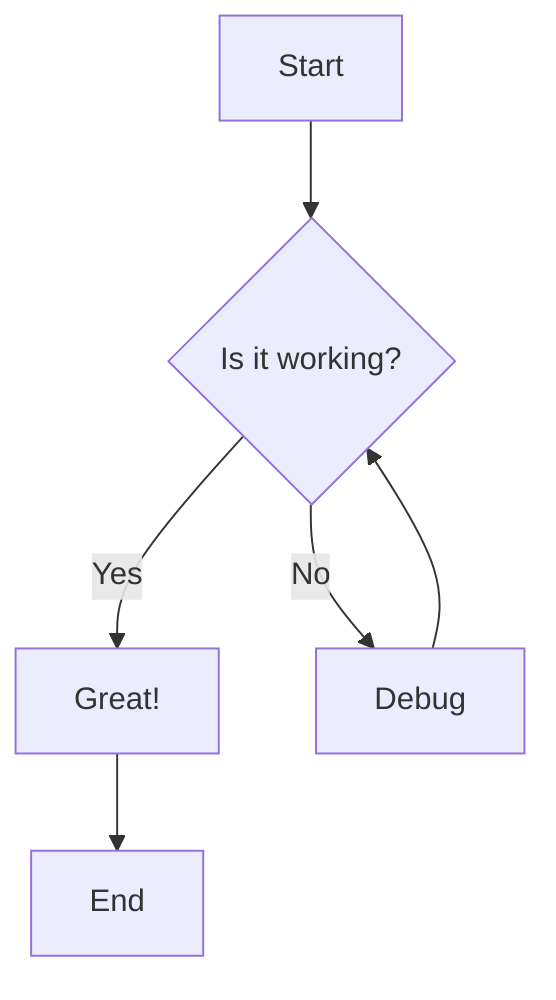
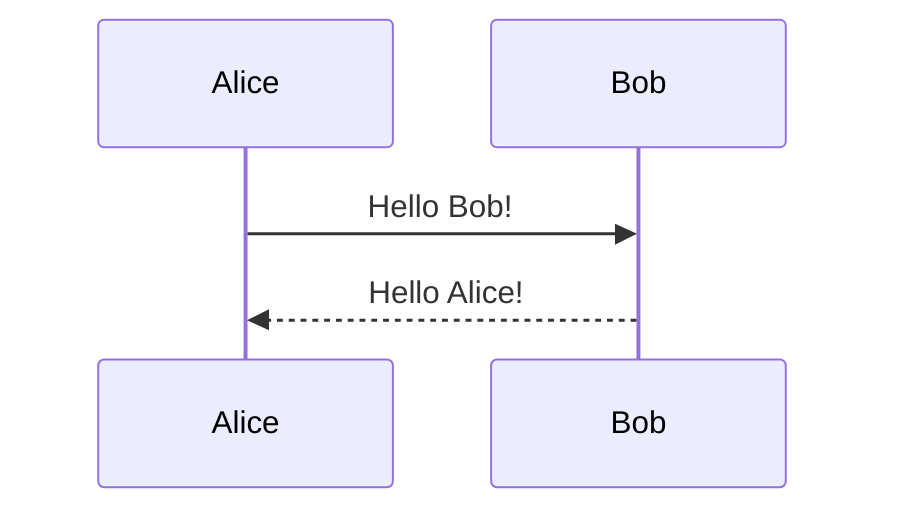

# Mixed Diagram Test

This page tests both mermaid and goat diagrams to ensure they render correctly.

## Mermaid Flowchart



## Goat ASCII Diagram

```goat
+--------------------+
| Mermaid Diagrams   |
| (Rendered as SVG)  |
+--------------------+
          |
          v
+--------------------+
| Goat Diagrams      |
| (ASCII Art)        |
+--------------------+
```

## Another Mermaid Diagram



## Another Goat Diagram

```goat
[Frontend] --> [Backend] --> [Database]
    ^             |
    |             v
[Cache] <----  [Queue]
```

## Regular Code Block

```javascript
function test() {
    console.log("This should be syntax highlighted");
    return "success";
}
```

This test should show:
- ✅ Mermaid diagrams rendered as interactive SVG
- ✅ Goat diagrams rendered as styled ASCII art
- ✅ Regular code blocks with syntax highlighting
