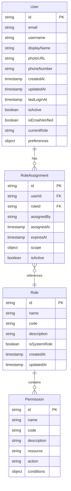
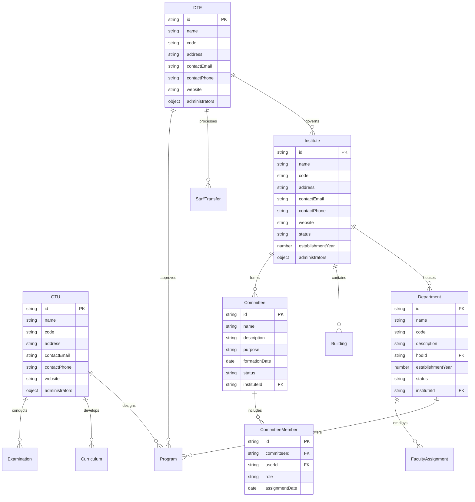
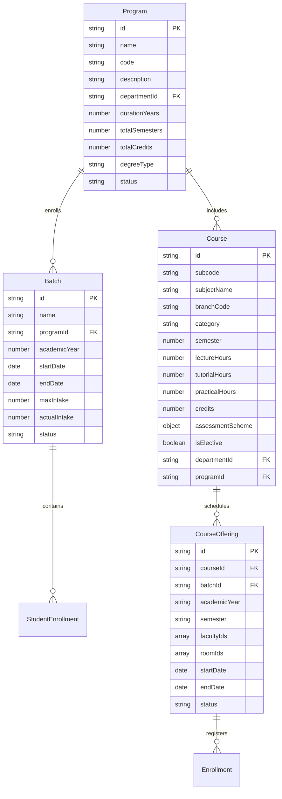
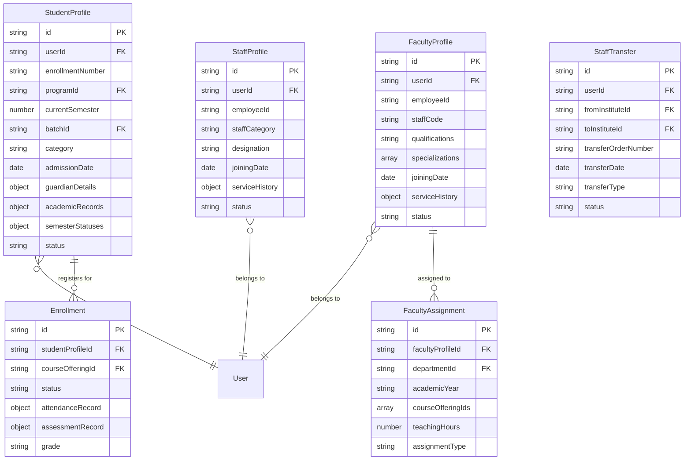
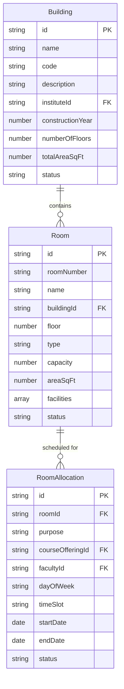

# College Management System - Project Specification

## Project Overview

The College Management System (CMS) is a Progressive Web Application (PWA) designed to streamline administrative, academic, and operational processes for technical education institutions across Gujarat. The application will serve multiple stakeholders including the Directorate of Technical Education (DTE), Gujarat Technical University (GTU), individual institutes, departments, faculty members, and students.

## Technical Stack

- **Frontend**: Next.js with TypeScript
- **UI Framework**: Tailwind CSS with shadcn/ui components
- **Authentication**: Firebase Authentication with multiple providers (Email/Password, Google, Microsoft)
- **Database**: Firebase Firestore (with capability to switch backends)
- **State Management**: React Query for server state, Zustand for client state
- **PWA Features**: Service workers, offline capability, installable on devices
- **API Layer**: RESTful API pattern for potential backend migration

## User Roles and Hierarchy

The system implements a multi-level role-based access control system:

1. **Super Admin**: Oversees the entire system
2. **DTE Admin**: Manages directorate-level operations
3. **GTU Admin**: Manages university-level operations
4. **Institute Admin**: Manages institute-specific operations
5. **Department Admin/HOD**: Manages department-specific operations
6. **Committee Admin**: Manages committee-specific activities
7. **Faculty**: Handles teaching and related activities
8. **Lab Assistant**: Manages laboratory resources
9. **Student**: Accesses academic information and services
10. **Clerical Staff**: Handles administrative paperwork

Users can have multiple roles and switch between them after login.

## Key Features

1. **Authentication & Authorization**
   - Multi-provider login (Email/Password, Google, Microsoft)
   - Role-based access control
   - Role switching within the application
   - Institute domain-specific login (e.g., @gppalanpur..ac.in)

2. **Dashboard System**
   - Role-specific dashboards
   - Customizable widgets
   - Key metrics and notifications

3. **DTE Management**
   - Staff recruitment and transfers
   - Career Advancement Scheme (CAS) management
   - Institute and program admission capacity allocation
   - Department creation and management

4. **GTU Management**
   - Program and curriculum design
   - Examination management
   - Results processing
   - Student detention and graduation tracking
   - Convocation management

5. **Institute Management**
   - Building and infrastructure management
   - Room and laboratory allocation
   - Department oversight
   - Committee formation and management
   - Non-teaching staff management

6. **Department Management**
   - Program implementation
   - Faculty allocation
   - Course management
   - Student academic progress tracking

7. **Faculty Management**
   - Teaching assignments
   - Research and publication tracking
   - Leave management
   - Performance assessment

8. **Student Management**
   - Enrollment and registration
   - Academic performance tracking
   - Attendance monitoring
   - Graduation requirements tracking

9. **Committee Management**
   - Committee formation
   - Member assignment
   - Activity planning and reporting
   - Resource allocation

10. **Data Management**
    - Search, filter, and sort capabilities
    - Pagination for large datasets
    - Import/export functionality (CSV)
    - Sample data templates

## Data Models

### Core Models

1. **User**
   - Basic authentication and profile information
   - Role assignments
   - Preferences and settings

2. **Role and Permission**
   - Role definitions
   - Granular permissions
   - Hierarchical structure

### Organizational Models

3. **Institute**
   - Basic information and contact details
   - Administrative structure
   - Facilities and resources

4. **Department**
   - Academic structure
   - Faculty assignments
   - Program offerings

5. **Committee**
   - Purpose and scope
   - Member composition
   - Activities and responsibilities

### Academic Models

6. **Program**
   - Curriculum structure
   - Course requirements
   - Academic regulations

7. **Course**
   - Content and learning outcomes
   - Assessment methods
   - Teaching resources

8. **Batch**
   - Student cohorts
   - Academic calendar
   - Progression tracking

### Personnel Models

9. **Student Profile**
   - Academic records
   - Personal information
   - Enrollment details

10. **Faculty Profile**
    - Teaching qualifications
    - Research activities
    - Administrative responsibilities

11. **Staff Profile**
    - Employment details
    - Job responsibilities
    - Performance metrics

### Infrastructure Models

12. **Building**
    - Location and structure
    - Maintenance status
    - Resource allocation

13. **Room**
    - Purpose and capacity
    - Equipment and facilities
    - Scheduling and availability

## ER Diagrams and Data Models

### User Authentication and Authorization



### Organizational Structure



### Academic Structure



### Personnel Models



### Infrastructure Models



## Detailed Data Models (TypeScript Interfaces)

### User and Authentication

```typescript
interface User {
    id: string;
    email: string;
    username?: string;
    displayName: string;
    photoURL?: string;
    phoneNumber?: string;
    
    // Authentication
    authProviders: ('password' | 'google' | 'microsoft')[];
    
    // Status
    createdAt: Timestamp;
    updatedAt: Timestamp;
    lastLoginAt?: Timestamp;
    isActive: boolean;
    isEmailVerified: boolean;
    
    // Authorization
    roles: string[];
    currentRole: string;
    
    // Settings
    preferences: {
        theme: 'light' | 'dark' | 'system';
        language: string;
        notifications: {
            email: boolean;
            push: boolean;
            sms: boolean;
        };
        dashboard: {
            layout: string;
            favorites: string[];
        };
    };
}

interface Role {
    id: string;
    name: string;
    code: string;
    description: string;
    permissions: string[]; // Permission IDs
    isSystemRole: boolean;
    createdAt: Timestamp;
    updatedAt: Timestamp;
    
    // Scope of this role (if applicable)
    scope?: {
        level: 'system' | 'dte' | 'gtu' | 'institute' | 'department' | 'committee';
        instituteId?: string;
        departmentId?: string;
        committeeId?: string;
    };
}

interface Permission {
    id: string;
    name: string;
    code: string;
    description: string;
    resource: string;
    action: 'create' | 'read' | 'update' | 'delete' | 'manage';
    conditions?: any;
}

interface RoleAssignment {
    id: string;
    userId: string;
    roleId: string;
    assignedBy: string;
    assignedAt: Timestamp;
    expiresAt?: Timestamp;
    
    // Scope of this assignment
    scope?: {
        instituteId?: string;
        departmentId?: string;
        committeeId?: string;
    };
    
    isActive: boolean;
}
```

### Profile Models

```typescript
interface StudentProfile {
    id: string;
    userId: string;
    
    // Identification
    enrollmentNumber: string;
    gtuEnrollmentNumber?: string;
    
    // Academic Info
    programId: string;
    batchId: string;
    currentSemester: number;
    admissionDate: Timestamp;
    
    // Categories
    category?: string; // OPEN, OBC, SC, ST, etc.
    shift?: 'Morning' | 'Afternoon' | 'Evening';
    
    // Academic Status
    isComplete?: boolean;
    termClose?: boolean;
    isCancel?: boolean;
    isPassAll?: boolean;
    semesterStatuses?: Record<string, SemesterStatus>;
    
    // Personal Details
    gender?: 'Male' | 'Female' | 'Other';
    dateOfBirth?: Timestamp;
    bloodGroup?: string;
    aadharNumber?: string;
    
    // Contact
    personalEmail?: string;
    instituteEmail: string;
    contactNumber?: string;
    address?: Address;
    
    // Guardian
    guardianDetails?: {
        name: string;
        relation: string;
        contactNumber: string;
        occupation?: string;
        annualIncome?: number;
    };
    
    // Administrative
    status: 'active' | 'inactive' | 'graduated' | 'dropped';
    convocationYear?: number;
    
    // System
    createdAt: Timestamp;
    updatedAt: Timestamp;
}

interface FacultyProfile {
    id: string;
    userId: string;
    
    // Identification
    staffCode: string;
    employeeId?: string;
    
    // Personal & Contact
    title?: string;
    firstName?: string;
    middleName?: string;
    lastName?: string;
    gtuName?: string;
    personalEmail?: string;
    instituteEmail: string;
    contactNumber?: string;
    
    // Professional
    department: string;
    designation?: string;
    jobType?: 'Regular' | 'Adhoc' | 'Contractual' | 'Visiting' | 'Other';
    specializations?: string[];
    qualifications?: Qualification[];
    
    // Dates
    dateOfBirth?: Timestamp;
    joiningDate?: Timestamp;
    
    // Personal Details
    gender?: 'Male' | 'Female' | 'Other';
    maritalStatus?: string;
    aadharNumber?: string;
    panCardNumber?: string;
    gpfNpsNumber?: string;
    
    // Status
    status: 'active' | 'inactive' | 'on_leave' | 'retired' | 'resigned';
    
    // System
    createdAt: Timestamp;
    updatedAt: Timestamp;
}

interface StaffProfile {
    id: string;
    userId: string;
    
    // Identification
    staffCode: string;
    employeeId?: string;
    
    // Job Details
    staffCategory: 'Clerical' | 'Technical' | 'Support' | 'Administrative';
    designation: string;
    department?: string;
    
    // Dates
    joiningDate?: Timestamp;
    dateOfBirth?: Timestamp;
    
    // Status
    status: 'active' | 'inactive' | 'on_leave' | 'retired' | 'resigned';
    
    // System
    createdAt: Timestamp;
    updatedAt: Timestamp;
}

// Common Types
type SemesterStatus = 'N/A' | 'Passed' | 'Pending' | 'Not Appeared';

interface Address {
    line1: string;
    line2?: string;
    city: string;
    state: string;
    country: string;
    pincode: string;
}

interface Qualification {
    degree: string;
    field: string;
    institution: string;
    year: number;
    grade?: string;
}
```

### Organizational Models

```typescript
interface DTE {
    id: string;
    name: string;
    code: string;
    address: string;
    contactEmail: string;
    contactPhone: string;
    website: string;
    
    administrators: string[]; // User IDs of DTE Admins
    
    createdAt: Timestamp;
    updatedAt: Timestamp;
}

interface GTU {
    id: string;
    name: string;
    code: string;
    address: string;
    contactEmail: string;
    contactPhone: string;
    website: string;
    
    administrators: string[]; // User IDs of GTU Admins
    
    createdAt: Timestamp;
    updatedAt: Timestamp;
}

interface Institute {
    id: string;
    name: string;
    code: string;
    address: string;
    contactEmail?: string;
    contactPhone?: string;
    website?: string;
    status: 'active' | 'inactive';
    establishmentYear?: number;
    
    administrators: string[]; // User IDs of Institute Admins
    
    createdAt: Timestamp;
    updatedAt: Timestamp;
}

interface Department {
    id: string;
    name: string;
    code: string;
    description?: string;
    instituteId: string;
    hodId?: string; // User ID of HoD
    establishmentYear?: number;
    status: 'active' | 'inactive';
    
    createdAt: Timestamp;
    updatedAt: Timestamp;
}

interface Committee {
    id: string;
    name: string;
    description: string;
    purpose: string;
    instituteId: string;
    formationDate: Timestamp;
    dissolutionDate?: Timestamp;
    
    status: 'active' | 'inactive' | 'dissolved';
    
    createdAt: Timestamp;
    updatedAt: Timestamp;
}

interface CommitteeMember {
    id: string;
    committeeId: string;
    userId: string;
    role: 'chairperson' | 'secretary' | 'member';
    assignmentDate: Timestamp;
    endDate?: Timestamp;
    
    createdAt: Timestamp;
    updatedAt: Timestamp;
}
```

### Academic Models

```typescript
interface Program {
    id: string;
    name: string;
    code: string;
    description?: string;
    
    departmentId: string;
    
    degreeType: 'Diploma' | 'Bachelor' | 'Master' | 'PhD' | 'Certificate';
    durationYears?: number;
    totalSemesters?: number;
    totalCredits?: number;
    
    // Curriculum and regulations
    curriculumVersion?: string;
    
    // Operational
    status: 'active' | 'inactive';
    
    createdAt: Timestamp;
    updatedAt: Timestamp;
}

interface Batch {
    id: string;
    name: string; // E.g., "2022-2025"
    programId: string;
    academicYear: number;
    startDate: Timestamp;
    endDate?: Timestamp;
    
    maxIntake: number;
    actualIntake: number;
    
    status: 'active' | 'inactive' | 'graduated';
    
    createdAt: Timestamp;
    updatedAt: Timestamp;
}

interface Course {
    id: string;
    subcode: string;
    subjectName: string;
    branchCode?: string;
    effFrom?: string;
    
    // Categorization
    category?: string;
    semester: number;
    
    // Hours and Credits
    lectureHours: number;
    tutorialHours: number;
    practicalHours: number;
    credits: number;
    
    // Marks Distribution
    theoryEseMarks: number;
    theoryPaMarks: number;
    practicalEseMarks: number;
    practicalPaMarks: number;
    totalMarks: number;
    
    // Course Type
    isElective: boolean;
    isTheory: boolean;
    theoryExamDuration?: string;
    isPractical: boolean;
    practicalExamDuration?: string;
    isFunctional: boolean;
    isSemiPractical?: boolean;
    
    // References
    departmentId: string;
    programId: string;
    
    // Additional Info
    remarks?: string;
    
    createdAt: Timestamp;
    updatedAt: Timestamp;
}

interface CourseOffering {
    id: string;
    courseId: string;
    batchId: string;
    academicYear: string;
    semester: number;
    
    facultyIds: string[];
    roomIds: string[];
    
    startDate: Timestamp;
    endDate: Timestamp;
    
    status: 'scheduled' | 'ongoing' | 'completed' | 'cancelled';
    
    createdAt: Timestamp;
    updatedAt: Timestamp;
}

interface Enrollment {
    id: string;
    studentProfileId: string;
    courseOfferingId: string;
    
    // Academic Record
    internalMarks?: number;
    externalMarks?: number;
    totalMarks?: number;
    grade?: string;
    
    // Attendance
    attendancePercentage?: number;
    
    status: 'enrolled' | 'withdrawn' | 'completed' | 'failed';
    
    createdAt: Timestamp;
    updatedAt: Timestamp;
}
```

### Infrastructure Models

```typescript
interface Building {
    id: string;
    name: string;
    code?: string;
    description?: string;
    
    instituteId: string;
    
    constructionYear?: number;
    numberOfFloors?: number;
    totalAreaSqFt?: number;
    
    status: 'active' | 'inactive' | 'under_maintenance';
    
    createdAt: Timestamp;
    updatedAt: Timestamp;
}

interface Room {
    id: string;
    roomNumber: string;
    name?: string;
    
    buildingId: string;
    floor?: number;
    
    type: 'Lecture Hall' | 'Laboratory' | 'Office' | 'Staff Room' | 'Workshop' | 'Library' | 'Store Room' | 'Other';
    capacity?: number;
    areaSqFt?: number;
    
    facilities?: string[];
    
    status: 'available' | 'occupied' | 'under_maintenance' | 'unavailable';
    notes?: string;
    
    createdAt: Timestamp;
    updatedAt: Timestamp;
}

interface RoomAllocation {
    id: string;
    roomId: string;
    
    purpose: 'lecture' | 'practical' | 'exam' | 'event' | 'other';
    courseOfferingId?: string;
    facultyId?: string;
    
    dayOfWeek?: string;
    timeSlot?: string;
    
    startDate: Timestamp;
    endDate: Timestamp;
    
    status: 'scheduled' | 'cancelled' | 'completed';
    
    createdAt: Timestamp;
    updatedAt: Timestamp;
}
```

## Implementation Approach

1. **Phase 1: Foundation**
   - Project setup with Next.js, TypeScript, and Tailwind CSS
   - Authentication system implementation
   - Role-based access control
   - Core API layer and data models
   - Basic dashboard structure

2. **Phase 2: Organizational Structure**
   - DTE, GTU, and Institute management
   - Department and Committee management
   - Building and Room management
   - User role management

3. **Phase 3: Academic Management**
   - Program and Course management
   - Student enrollment system
   - Faculty assignment system
   - Batch and academic year tracking

4. **Phase 4: Operational Features**
   - Attendance tracking
   - Assessment and results management
   - Resource allocation
   - Reporting and analytics

5. **Phase 5: Advanced Features**
   - Mobile optimization
   - Offline capabilities
   - Notification system
   - Advanced analytics and insights

## Success Criteria

1. **Usability**: Intuitive interface for all user roles
2. **Performance**: Fast load times and responsive interactions
3. **Reliability**: Data persistence and system stability
4. **Scalability**: Ability to handle multiple institutions and large volumes of data
5. **Security**: Robust authentication and authorization mechanisms
6. **Flexibility**: Adaptable to changing requirements and backend systems
7. **Maintainability**: Clean code structure and comprehensive documentation

## Conclusion

This College Management System will serve as a comprehensive platform for managing educational institutions in Gujarat. By implementing a role-based approach with modular features, the system will accommodate the hierarchical structure of technical education administration while providing tailored experiences for each stakeholder.

The application's PWA capabilities will ensure accessibility across devices, while the flexible backend approach will facilitate potential migrations to alternative systems in the future. With comprehensive data management features and a focus on usability, the platform aims to significantly enhance administrative efficiency and academic management for all stakeholders.