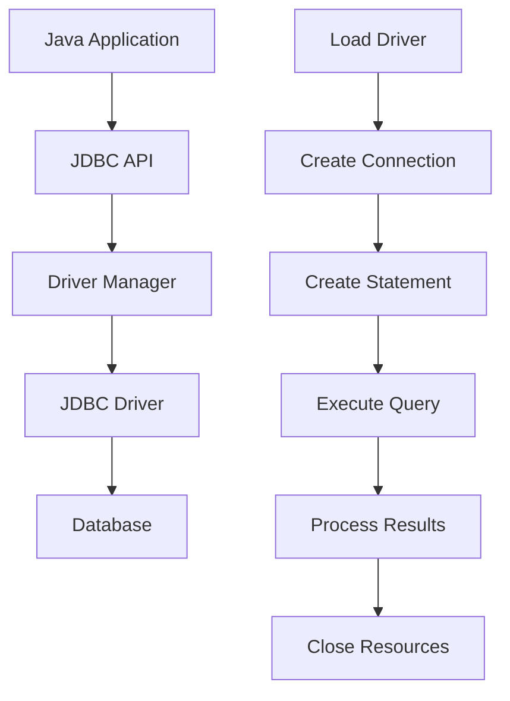

# Java Programming
## GTU Course 4343203

### Lecture 25: Database Connectivity (JDBC)
**Connecting Java Applications to Databases**

<div class="pt-12">
  <span @click="$slidev.nav.next" class="px-2 py-1 rounded cursor-pointer" hover="bg-white bg-opacity-10">
    Press Space for next page <carbon:arrow-right class="inline"/>
  </span>
</div>

---
layout: default
---

# Learning Objectives

By the end of this lecture, students will be able to:

<v-clicks>

- 🎯 **Understand JDBC Architecture**
  - JDBC drivers and API components
  - Connection process and management
  - Database interaction flow

- 🔗 **Master Database Connections**
  - DriverManager and DataSource
  - Connection URLs and properties
  - Connection pooling concepts

- 📝 **Execute SQL Statements**
  - Statement, PreparedStatement, CallableStatement
  - Result set processing
  - Batch operations

- 🔒 **Handle Transactions**
  - Transaction management
  - Auto-commit and manual transactions
  - Rollback and savepoints

- 🎓 **Solve GTU Problems**
  - Previous year question solutions
  - Practical database applications

</v-clicks>

---
layout: two-cols
---

# JDBC Architecture Overview

Java Database Connectivity provides standard API for database access

<v-clicks>

## JDBC Components

### 1. JDBC API
- Core interfaces and classes
- Standardized database operations
- Driver management

### 2. JDBC Driver Manager
- Manages database drivers
- Establishes connections
- Connection pooling

### 3. JDBC Drivers
- Type 1: JDBC-ODBC Bridge
- Type 2: Native API Driver
- Type 3: Network Protocol Driver
- Type 4: Pure Java Driver (Recommended)

</v-clicks>

::right::

## JDBC Workflow

<v-clicks>



## Core JDBC Interfaces
- **Connection**: Database connection
- **Statement**: SQL execution
- **PreparedStatement**: Precompiled SQL
- **CallableStatement**: Stored procedures
- **ResultSet**: Query results
- **DatabaseMetaData**: Database information

</v-clicks>

---
layout: default
---

# Database Connection Setup

<div class="grid grid-cols-2 gap-4">

<div>

## Basic Connection Example

```java
import java.sql.*;

public class DatabaseConnection {
    // Database credentials
    private static final String DB_URL = "jdbc:mysql://localhost:3306/university";
    private static final String USERNAME = "root";
    private static final String PASSWORD = "password";
    
    // JDBC driver name
    private static final String DRIVER = "com.mysql.cj.jdbc.Driver";
    
    public static Connection getConnection() throws SQLException {
        try {
            // Load JDBC driver (optional in JDBC 4.0+)
            Class.forName(DRIVER);
            
            // Create connection
            Connection connection = DriverManager.getConnection(DB_URL, USERNAME, PASSWORD);
            
            System.out.println("Database connected successfully!");
            return connection;
            
        } catch (ClassNotFoundException e) {
            throw new SQLException("JDBC Driver not found", e);
        }
    }
    
    public static void main(String[] args) {
        try (Connection connection = getConnection()) {
            
            // Get database metadata
            DatabaseMetaData metaData = connection.getMetaData();
            System.out.println("Database Product: " + metaData.getDatabaseProductName());
            System.out.println("Database Version: " + metaData.getDatabaseProductVersion());
            System.out.println("Driver Name: " + metaData.getDriverName());
            System.out.println("Driver Version: " + metaData.getDriverVersion());
            
        } catch (SQLException e) {
            System.err.println("Connection failed: " + e.getMessage());
            e.printStackTrace();
        }
    }
}
```

</div>

<div>

## Advanced Connection Management

```java
import java.sql.*;
import java.util.Properties;

public class AdvancedConnection {
    
    public static Connection getConnectionWithProperties() throws SQLException {
        String url = "jdbc:mysql://localhost:3306/university";
        
        Properties props = new Properties();
        props.setProperty("user", "root");
        props.setProperty("password", "password");
        props.setProperty("useSSL", "false");
        props.setProperty("serverTimezone", "UTC");
        props.setProperty("allowPublicKeyRetrieval", "true");
        
        return DriverManager.getConnection(url, props);
    }
    
    public static Connection getConnectionWithTimeout() throws SQLException {
        // Set login timeout
        DriverManager.setLoginTimeout(30);
        
        String url = "jdbc:mysql://localhost:3306/university" +
                    "?connectTimeout=30000" +
                    "&socketTimeout=60000" +
                    "&useSSL=false" +
                    "&serverTimezone=UTC";
        
        return DriverManager.getConnection(url, "root", "password");
    }
    
    // Connection validation
    public static boolean isConnectionValid(Connection connection) {
        try {
            return connection != null && !connection.isClosed() && connection.isValid(5);
        } catch (SQLException e) {
            return false;
        }
    }
    
    // Safe connection closing
    public static void closeConnection(Connection connection) {
        if (connection != null) {
            try {
                if (!connection.isClosed()) {
                    connection.close();
                    System.out.println("Connection closed successfully");
                }
            } catch (SQLException e) {
                System.err.println("Error closing connection: " + e.getMessage());
            }
        }
    }
}
```

## Connection Pool Concept

```java
// Simple connection pool implementation
public class SimpleConnectionPool {
    private final Queue<Connection> connections = new LinkedList<>();
    private final String url, username, password;
    private final int maxPoolSize;
    
    public SimpleConnectionPool(String url, String username, String password, int maxPoolSize) {
        this.url = url;
        this.username = username;
        this.password = password;
        this.maxPoolSize = maxPoolSize;
        initializePool();
    }
    
    private void initializePool() {
        try {
            for (int i = 0; i < maxPoolSize; i++) {
                connections.offer(DriverManager.getConnection(url, username, password));
            }
        } catch (SQLException e) {
            throw new RuntimeException("Failed to initialize connection pool", e);
        }
    }
    
    public synchronized Connection getConnection() throws SQLException {
        if (connections.isEmpty()) {
            return DriverManager.getConnection(url, username, password);
        }
        return connections.poll();
    }
    
    public synchronized void returnConnection(Connection connection) {
        if (connection != null && connections.size() < maxPoolSize) {
            connections.offer(connection);
        }
    }
}
```

</div>

</div>

---
layout: default
---

# Statement Types and Usage

<div class="grid grid-cols-2 gap-4">

<div>

## Statement Interface

```java
public class StatementExample {
    
    public static void demonstrateStatement() {
        try (Connection connection = DatabaseConnection.getConnection();
             Statement statement = connection.createStatement()) {
            
            // Create table
            String createTable = """
                CREATE TABLE IF NOT EXISTS students (
                    id INT PRIMARY KEY AUTO_INCREMENT,
                    name VARCHAR(100) NOT NULL,
                    email VARCHAR(100) UNIQUE,
                    age INT,
                    grade DECIMAL(3,2),
                    enrollment_date DATE
                )
                """;
            
            statement.executeUpdate(createTable);
            System.out.println("Table created successfully");
            
            // Insert data
            String insertSQL = """
                INSERT INTO students (name, email, age, grade, enrollment_date) 
                VALUES ('John Doe', 'john@university.edu', 20, 85.5, '2024-01-15')
                """;
            
            int rowsAffected = statement.executeUpdate(insertSQL);
            System.out.println("Rows inserted: " + rowsAffected);
            
            // Query data
            String selectSQL = "SELECT * FROM students ORDER BY name";
            ResultSet resultSet = statement.executeQuery(selectSQL);
            
            System.out.println("\n=== Students List ===");
            while (resultSet.next()) {
                int id = resultSet.getInt("id");
                String name = resultSet.getString("name");
                String email = resultSet.getString("email");
                int age = resultSet.getInt("age");
                double grade = resultSet.getDouble("grade");
                Date enrollmentDate = resultSet.getDate("enrollment_date");
                
                System.out.printf("ID: %d, Name: %s, Email: %s, Age: %d, Grade: %.2f, Enrolled: %s%n",
                                id, name, email, age, grade, enrollmentDate);
            }
            
        } catch (SQLException e) {
            System.err.println("Database error: " + e.getMessage());
            e.printStackTrace();
        }
    }
}
```

</div>

<div>

## PreparedStatement (Recommended)

```java
public class PreparedStatementExample {
    
    public static void demonstratePreparedStatement() {
        String insertSQL = "INSERT INTO students (name, email, age, grade, enrollment_date) VALUES (?, ?, ?, ?, ?)";
        String selectSQL = "SELECT * FROM students WHERE age >= ? AND grade >= ?";
        String updateSQL = "UPDATE students SET grade = ? WHERE id = ?";
        String deleteSQL = "DELETE FROM students WHERE id = ?";
        
        try (Connection connection = DatabaseConnection.getConnection()) {
            
            // Insert multiple students
            try (PreparedStatement pstmt = connection.prepareStatement(insertSQL)) {
                
                // Student 1
                pstmt.setString(1, "Alice Smith");
                pstmt.setString(2, "alice@university.edu");
                pstmt.setInt(3, 19);
                pstmt.setDouble(4, 92.5);
                pstmt.setDate(5, Date.valueOf("2024-01-20"));
                pstmt.executeUpdate();
                
                // Student 2
                pstmt.setString(1, "Bob Johnson");
                pstmt.setString(2, "bob@university.edu");
                pstmt.setInt(3, 21);
                pstmt.setDouble(4, 78.0);
                pstmt.setDate(5, Date.valueOf("2024-01-18"));
                pstmt.executeUpdate();
                
                System.out.println("Students inserted successfully");
            }
            
            // Query with parameters
            try (PreparedStatement pstmt = connection.prepareStatement(selectSQL)) {
                pstmt.setInt(1, 18); // age >= 18
                pstmt.setDouble(2, 80.0); // grade >= 80.0
                
                ResultSet rs = pstmt.executeQuery();
                
                System.out.println("\n=== High-performing adult students ===");
                while (rs.next()) {
                    System.out.printf("%s (Age: %d, Grade: %.2f)%n",
                                    rs.getString("name"),
                                    rs.getInt("age"),
                                    rs.getDouble("grade"));
                }
            }
            
            // Update student grade
            try (PreparedStatement pstmt = connection.prepareStatement(updateSQL)) {
                pstmt.setDouble(1, 88.5);
                pstmt.setInt(2, 1);
                
                int rowsUpdated = pstmt.executeUpdate();
                System.out.println("\nRows updated: " + rowsUpdated);
            }
            
        } catch (SQLException e) {
            System.err.println("Database error: " + e.getMessage());
            e.printStackTrace();
        }
    }
    
    // Batch operations for better performance
    public static void batchInsertStudents() {
        String insertSQL = "INSERT INTO students (name, email, age, grade, enrollment_date) VALUES (?, ?, ?, ?, ?)";
        
        try (Connection connection = DatabaseConnection.getConnection();
             PreparedStatement pstmt = connection.prepareStatement(insertSQL)) {
            
            // Disable auto-commit for batch processing
            connection.setAutoCommit(false);
            
            // Add multiple statements to batch
            String[][] students = {
                {"Charlie Brown", "charlie@university.edu", "22", "85.0", "2024-01-25"},
                {"Diana Prince", "diana@university.edu", "20", "95.5", "2024-01-22"},
                {"Eve Wilson", "eve@university.edu", "19", "89.0", "2024-01-24"}
            };
            
            for (String[] student : students) {
                pstmt.setString(1, student[0]);
                pstmt.setString(2, student[1]);
                pstmt.setInt(3, Integer.parseInt(student[2]));
                pstmt.setDouble(4, Double.parseDouble(student[3]));
                pstmt.setDate(5, Date.valueOf(student[4]));
                pstmt.addBatch();
            }
            
            // Execute batch
            int[] results = pstmt.executeBatch();
            connection.commit();
            
            System.out.println("Batch insert completed. Rows affected: " + results.length);
            
        } catch (SQLException e) {
            System.err.println("Batch insert failed: " + e.getMessage());
            e.printStackTrace();
        }
    }
}
```

</div>

</div>

---
layout: default
---

# ResultSet Processing and Navigation

<div class="grid grid-cols-2 gap-4">

<div>

## Basic ResultSet Operations

```java
import java.sql.*;
import java.util.ArrayList;
import java.util.List;

public class ResultSetExample {
    
    // Student model class
    public static class Student {
        private int id;
        private String name;
        private String email;
        private int age;
        private double grade;
        private Date enrollmentDate;
        
        // Constructor
        public Student(int id, String name, String email, int age, double grade, Date enrollmentDate) {
            this.id = id;
            this.name = name;
            this.email = email;
            this.age = age;
            this.grade = grade;
            this.enrollmentDate = enrollmentDate;
        }
        
        // Getters and toString
        public int getId() { return id; }
        public String getName() { return name; }
        public String getEmail() { return email; }
        public int getAge() { return age; }
        public double getGrade() { return grade; }
        public Date getEnrollmentDate() { return enrollmentDate; }
        
        @Override
        public String toString() {
            return String.format("Student{id=%d, name='%s', email='%s', age=%d, grade=%.2f, enrolled=%s}",
                               id, name, email, age, grade, enrollmentDate);
        }
    }
    
    public static List<Student> getAllStudents() {
        List<Student> students = new ArrayList<>();
        String query = "SELECT * FROM students ORDER BY grade DESC";
        
        try (Connection connection = DatabaseConnection.getConnection();
             PreparedStatement pstmt = connection.prepareStatement(query);
             ResultSet rs = pstmt.executeQuery()) {
            
            while (rs.next()) {
                Student student = new Student(
                    rs.getInt("id"),
                    rs.getString("name"),
                    rs.getString("email"),
                    rs.getInt("age"),
                    rs.getDouble("grade"),
                    rs.getDate("enrollment_date")
                );
                students.add(student);
            }
            
        } catch (SQLException e) {
            System.err.println("Error fetching students: " + e.getMessage());
        }
        
        return students;
    }
}
```

</div>

<div>

## Advanced ResultSet Features

```java
public class AdvancedResultSetExample {
    
    // Scrollable and updatable ResultSet
    public static void demonstrateScrollableResultSet() {
        String query = "SELECT id, name, grade FROM students ORDER BY id";
        
        try (Connection connection = DatabaseConnection.getConnection();
             PreparedStatement pstmt = connection.prepareStatement(
                 query, 
                 ResultSet.TYPE_SCROLL_SENSITIVE, 
                 ResultSet.CONCUR_UPDATABLE)) {
            
            ResultSet rs = pstmt.executeQuery();
            
            // Move to last row
            if (rs.last()) {
                System.out.println("Last student: " + rs.getString("name"));
                System.out.println("Total students: " + rs.getRow());
            }
            
            // Move to first row
            rs.first();
            System.out.println("First student: " + rs.getString("name"));
            
            // Navigate to specific row
            rs.absolute(2);
            System.out.println("Second student: " + rs.getString("name"));
            
            // Update grade directly in ResultSet
            rs.updateDouble("grade", 95.0);
            rs.updateRow();
            System.out.println("Updated grade for: " + rs.getString("name"));
            
            // Insert new row
            rs.moveToInsertRow();
            rs.updateString("name", "New Student");
            rs.updateDouble("grade", 88.0);
            rs.insertRow();
            rs.moveToCurrentRow();
            
            System.out.println("New student inserted");
            
        } catch (SQLException e) {
            System.err.println("Error with scrollable ResultSet: " + e.getMessage());
        }
    }
    
    // ResultSet metadata
    public static void analyzeResultSetMetadata() {
        String query = "SELECT * FROM students LIMIT 1";
        
        try (Connection connection = DatabaseConnection.getConnection();
             PreparedStatement pstmt = connection.prepareStatement(query);
             ResultSet rs = pstmt.executeQuery()) {
            
            ResultSetMetaData metaData = rs.getMetaData();
            int columnCount = metaData.getColumnCount();
            
            System.out.println("=== Table Structure ===");
            System.out.printf("%-15s %-15s %-10s %-10s %-10s%n", 
                            "Column Name", "Type Name", "Size", "Nullable", "Precision");
            
            for (int i = 1; i <= columnCount; i++) {
                String columnName = metaData.getColumnName(i);
                String typeName = metaData.getColumnTypeName(i);
                int columnSize = metaData.getColumnDisplaySize(i);
                boolean nullable = metaData.isNullable(i) == ResultSetMetaData.columnNullable;
                int precision = metaData.getPrecision(i);
                
                System.out.printf("%-15s %-15s %-10d %-10s %-10d%n",
                                columnName, typeName, columnSize, nullable ? "YES" : "NO", precision);
            }
            
        } catch (SQLException e) {
            System.err.println("Error analyzing metadata: " + e.getMessage());
        }
    }
    
    // Statistics and aggregation
    public static void calculateStatistics() {
        String statsQuery = """
            SELECT 
                COUNT(*) as total_students,
                AVG(grade) as average_grade,
                MIN(grade) as min_grade,
                MAX(grade) as max_grade,
                AVG(age) as average_age
            FROM students
            """;
        
        try (Connection connection = DatabaseConnection.getConnection();
             PreparedStatement pstmt = connection.prepareStatement(statsQuery);
             ResultSet rs = pstmt.executeQuery()) {
            
            if (rs.next()) {
                System.out.println("=== Student Statistics ===");
                System.out.println("Total Students: " + rs.getInt("total_students"));
                System.out.println("Average Grade: " + String.format("%.2f", rs.getDouble("average_grade")));
                System.out.println("Grade Range: " + rs.getDouble("min_grade") + " - " + rs.getDouble("max_grade"));
                System.out.println("Average Age: " + String.format("%.1f", rs.getDouble("average_age")));
            }
            
        } catch (SQLException e) {
            System.err.println("Error calculating statistics: " + e.getMessage());
        }
    }
}
```

</div>

</div>

---
layout: default
---

# Transaction Management

<div class="grid grid-cols-2 gap-4">

<div>

## Basic Transaction Control

```java
public class TransactionExample {
    
    public static void transferGrades() {
        Connection connection = null;
        
        try {
            connection = DatabaseConnection.getConnection();
            
            // Disable auto-commit to start transaction
            connection.setAutoCommit(false);
            
            // Prepare statements
            String deductSQL = "UPDATE students SET grade = grade - ? WHERE id = ?";
            String addSQL = "UPDATE students SET grade = grade + ? WHERE id = ?";
            String checkGradeSQL = "SELECT grade FROM students WHERE id = ?";
            
            PreparedStatement deductStmt = connection.prepareStatement(deductSQL);
            PreparedStatement addStmt = connection.prepareStatement(addSQL);
            PreparedStatement checkStmt = connection.prepareStatement(checkGradeSQL);
            
            int fromStudentId = 1;
            int toStudentId = 2;
            double pointsToTransfer = 5.0;
            
            // Check if source student has enough grade points
            checkStmt.setInt(1, fromStudentId);
            ResultSet rs = checkStmt.executeQuery();
            
            if (rs.next()) {
                double currentGrade = rs.getDouble("grade");
                if (currentGrade < pointsToTransfer) {
                    throw new SQLException("Insufficient grade points for transfer");
                }
            } else {
                throw new SQLException("Source student not found");
            }
            
            // Perform the transfer
            deductStmt.setDouble(1, pointsToTransfer);
            deductStmt.setInt(2, fromStudentId);
            int deductedRows = deductStmt.executeUpdate();
            
            addStmt.setDouble(1, pointsToTransfer);
            addStmt.setInt(2, toStudentId);
            int addedRows = addStmt.executeUpdate();
            
            // Verify both operations succeeded
            if (deductedRows == 1 && addedRows == 1) {
                connection.commit();
                System.out.println("Grade transfer completed successfully!");
                System.out.println(pointsToTransfer + " points transferred from student " + 
                                 fromStudentId + " to student " + toStudentId);
            } else {
                connection.rollback();
                System.out.println("Grade transfer failed - transaction rolled back");
            }
            
        } catch (SQLException e) {
            try {
                if (connection != null) {
                    connection.rollback();
                    System.out.println("Transaction rolled back due to error: " + e.getMessage());
                }
            } catch (SQLException rollbackEx) {
                System.err.println("Error during rollback: " + rollbackEx.getMessage());
            }
        } finally {
            try {
                if (connection != null) {
                    connection.setAutoCommit(true); // Restore auto-commit
                    connection.close();
                }
            } catch (SQLException e) {
                System.err.println("Error closing connection: " + e.getMessage());
            }
        }
    }
}
```

</div>

<div>

## Advanced Transaction Features

```java
public class AdvancedTransactionExample {
    
    public static void demonstrateSavepoints() {
        Connection connection = null;
        Savepoint savepoint1 = null;
        Savepoint savepoint2 = null;
        
        try {
            connection = DatabaseConnection.getConnection();
            connection.setAutoCommit(false);
            
            System.out.println("Starting complex transaction with savepoints...");
            
            // Insert first batch of students
            String insertSQL = "INSERT INTO students (name, email, age, grade, enrollment_date) VALUES (?, ?, ?, ?, ?)";
            PreparedStatement pstmt = connection.prepareStatement(insertSQL);
            
            // Batch 1
            pstmt.setString(1, "Student A");
            pstmt.setString(2, "a@university.edu");
            pstmt.setInt(3, 20);
            pstmt.setDouble(4, 85.0);
            pstmt.setDate(5, Date.valueOf("2024-02-01"));
            pstmt.executeUpdate();
            
            // Create savepoint after first insert
            savepoint1 = connection.setSavepoint("afterFirstInsert");
            System.out.println("Savepoint 1 created");
            
            // Batch 2
            pstmt.setString(1, "Student B");
            pstmt.setString(2, "b@university.edu");
            pstmt.setInt(3, 21);
            pstmt.setDouble(4, 90.0);
            pstmt.setDate(5, Date.valueOf("2024-02-02"));
            pstmt.executeUpdate();
            
            // Create another savepoint
            savepoint2 = connection.setSavepoint("afterSecondInsert");
            System.out.println("Savepoint 2 created");
            
            // Batch 3 - This will cause an error (duplicate email)
            try {
                pstmt.setString(1, "Student C");
                pstmt.setString(2, "a@university.edu"); // Duplicate email
                pstmt.setInt(3, 19);
                pstmt.setDouble(4, 88.0);
                pstmt.setDate(5, Date.valueOf("2024-02-03"));
                pstmt.executeUpdate();
                
            } catch (SQLException e) {
                System.out.println("Error in batch 3: " + e.getMessage());
                
                // Rollback to savepoint 2
                connection.rollback(savepoint2);
                System.out.println("Rolled back to savepoint 2");
                
                // Insert a corrected version
                pstmt.setString(1, "Student C");
                pstmt.setString(2, "c@university.edu"); // Corrected email
                pstmt.setInt(3, 19);
                pstmt.setDouble(4, 88.0);
                pstmt.setDate(5, Date.valueOf("2024-02-03"));
                pstmt.executeUpdate();
                System.out.println("Corrected insert completed");
            }
            
            // Commit the entire transaction
            connection.commit();
            System.out.println("Transaction committed successfully!");
            
        } catch (SQLException e) {
            try {
                if (connection != null) {
                    connection.rollback();
                    System.out.println("Entire transaction rolled back: " + e.getMessage());
                }
            } catch (SQLException rollbackEx) {
                System.err.println("Error during rollback: " + rollbackEx.getMessage());
            }
        } finally {
            try {
                if (connection != null) {
                    connection.setAutoCommit(true);
                    connection.close();
                }
            } catch (SQLException e) {
                System.err.println("Error closing connection: " + e.getMessage());
            }
        }
    }
    
    // Transaction isolation levels
    public static void demonstrateIsolationLevels() {
        try (Connection connection = DatabaseConnection.getConnection()) {
            
            // Get current isolation level
            int currentLevel = connection.getTransactionIsolation();
            System.out.println("Current isolation level: " + getIsolationLevelName(currentLevel));
            
            // Set different isolation levels and demonstrate
            int[] levels = {
                Connection.TRANSACTION_READ_UNCOMMITTED,
                Connection.TRANSACTION_READ_COMMITTED,
                Connection.TRANSACTION_REPEATABLE_READ,
                Connection.TRANSACTION_SERIALIZABLE
            };
            
            for (int level : levels) {
                connection.setTransactionIsolation(level);
                System.out.println("Set isolation level to: " + getIsolationLevelName(level));
                
                // Perform some operations at this isolation level
                performIsolationTest(connection);
            }
            
        } catch (SQLException e) {
            System.err.println("Error demonstrating isolation levels: " + e.getMessage());
        }
    }
    
    private static String getIsolationLevelName(int level) {
        switch (level) {
            case Connection.TRANSACTION_READ_UNCOMMITTED: return "READ_UNCOMMITTED";
            case Connection.TRANSACTION_READ_COMMITTED: return "READ_COMMITTED";
            case Connection.TRANSACTION_REPEATABLE_READ: return "REPEATABLE_READ";
            case Connection.TRANSACTION_SERIALIZABLE: return "SERIALIZABLE";
            default: return "UNKNOWN";
        }
    }
    
    private static void performIsolationTest(Connection connection) throws SQLException {
        // Simple test to verify isolation level is set
        String query = "SELECT COUNT(*) as student_count FROM students";
        try (PreparedStatement pstmt = connection.prepareStatement(query);
             ResultSet rs = pstmt.executeQuery()) {
            
            if (rs.next()) {
                int count = rs.getInt("student_count");
                System.out.println("  Current student count: " + count);
            }
        }
    }
}
```

</div>

</div>

---
layout: default
---

# GTU Previous Year Questions

## Question 1: Complete Student Management System (Winter 2023)

**Create a Java application using JDBC to manage student records with CRUD operations and transaction management.**

<div class="grid grid-cols-2 gap-4">

<div>

```java
public class StudentManagementSystem {
    private Connection connection;
    
    public StudentManagementSystem() throws SQLException {
        this.connection = DatabaseConnection.getConnection();
        createStudentTable();
    }
    
    private void createStudentTable() throws SQLException {
        String createTableSQL = """
            CREATE TABLE IF NOT EXISTS students (
                student_id INT PRIMARY KEY AUTO_INCREMENT,
                name VARCHAR(100) NOT NULL,
                email VARCHAR(100) UNIQUE NOT NULL,
                phone VARCHAR(15),
                course VARCHAR(50),
                semester INT,
                cgpa DECIMAL(3,2),
                enrollment_date DATE,
                status ENUM('ACTIVE', 'INACTIVE', 'GRADUATED') DEFAULT 'ACTIVE'
            )
            """;
        
        try (Statement stmt = connection.createStatement()) {
            stmt.executeUpdate(createTableSQL);
            System.out.println("Student table created/verified successfully");
        }
    }
    
    // CREATE operation
    public boolean addStudent(String name, String email, String phone, 
                             String course, int semester, double cgpa) {
        String insertSQL = """
            INSERT INTO students (name, email, phone, course, semester, cgpa, enrollment_date) 
            VALUES (?, ?, ?, ?, ?, ?, CURRENT_DATE)
            """;
        
        try (PreparedStatement pstmt = connection.prepareStatement(insertSQL)) {
            pstmt.setString(1, name);
            pstmt.setString(2, email);
            pstmt.setString(3, phone);
            pstmt.setString(4, course);
            pstmt.setInt(5, semester);
            pstmt.setDouble(6, cgpa);
            
            int rowsAffected = pstmt.executeUpdate();
            if (rowsAffected > 0) {
                System.out.println("Student added successfully: " + name);
                return true;
            }
        } catch (SQLException e) {
            System.err.println("Error adding student: " + e.getMessage());
        }
        return false;
    }
    
    // READ operation - Get student by ID
    public void getStudentById(int studentId) {
        String selectSQL = "SELECT * FROM students WHERE student_id = ?";
        
        try (PreparedStatement pstmt = connection.prepareStatement(selectSQL)) {
            pstmt.setInt(1, studentId);
            ResultSet rs = pstmt.executeQuery();
            
            if (rs.next()) {
                displayStudent(rs);
            } else {
                System.out.println("Student with ID " + studentId + " not found");
            }
        } catch (SQLException e) {
            System.err.println("Error fetching student: " + e.getMessage());
        }
    }
    
    // READ operation - Get all students
    public void getAllStudents() {
        String selectSQL = "SELECT * FROM students ORDER BY name";
        
        try (PreparedStatement pstmt = connection.prepareStatement(selectSQL);
             ResultSet rs = pstmt.executeQuery()) {
            
            System.out.println("\n=== All Students ===");
            boolean hasStudents = false;
            
            while (rs.next()) {
                hasStudents = true;
                displayStudent(rs);
                System.out.println("-".repeat(50));
            }
            
            if (!hasStudents) {
                System.out.println("No students found in the database");
            }
        } catch (SQLException e) {
            System.err.println("Error fetching students: " + e.getMessage());
        }
    }
```

</div>

<div>

```java
    // UPDATE operation
    public boolean updateStudentCGPA(int studentId, double newCGPA) {
        String updateSQL = "UPDATE students SET cgpa = ? WHERE student_id = ?";
        
        try (PreparedStatement pstmt = connection.prepareStatement(updateSQL)) {
            pstmt.setDouble(1, newCGPA);
            pstmt.setInt(2, studentId);
            
            int rowsAffected = pstmt.executeUpdate();
            if (rowsAffected > 0) {
                System.out.println("CGPA updated successfully for student ID: " + studentId);
                return true;
            } else {
                System.out.println("Student with ID " + studentId + " not found");
            }
        } catch (SQLException e) {
            System.err.println("Error updating CGPA: " + e.getMessage());
        }
        return false;
    }
    
    // DELETE operation
    public boolean deleteStudent(int studentId) {
        String deleteSQL = "DELETE FROM students WHERE student_id = ?";
        
        try (PreparedStatement pstmt = connection.prepareStatement(deleteSQL)) {
            pstmt.setInt(1, studentId);
            
            int rowsAffected = pstmt.executeUpdate();
            if (rowsAffected > 0) {
                System.out.println("Student deleted successfully");
                return true;
            } else {
                System.out.println("Student with ID " + studentId + " not found");
            }
        } catch (SQLException e) {
            System.err.println("Error deleting student: " + e.getMessage());
        }
        return false;
    }
    
    // Advanced: Batch student promotion with transaction
    public boolean promoteStudents(List<Integer> studentIds) {
        String updateSQL = "UPDATE students SET semester = semester + 1 WHERE student_id = ?";
        String graduateSQL = "UPDATE students SET status = 'GRADUATED' WHERE student_id = ? AND semester >= 8";
        
        try {
            connection.setAutoCommit(false);
            
            try (PreparedStatement promotePstmt = connection.prepareStatement(updateSQL);
                 PreparedStatement graduatePstmt = connection.prepareStatement(graduateSQL)) {
                
                for (Integer studentId : studentIds) {
                    // Promote semester
                    promotePstmt.setInt(1, studentId);
                    promotePstmt.addBatch();
                    
                    // Check for graduation
                    graduatePstmt.setInt(1, studentId);
                    graduatePstmt.addBatch();
                }
                
                int[] promoteResults = promotePstmt.executeBatch();
                int[] graduateResults = graduatePstmt.executeBatch();
                
                connection.commit();
                
                System.out.println("Batch promotion completed:");
                System.out.println("Students promoted: " + promoteResults.length);
                System.out.println("Students graduated: " + 
                    java.util.Arrays.stream(graduateResults).sum());
                
                return true;
                
            }
        } catch (SQLException e) {
            try {
                connection.rollback();
                System.err.println("Promotion failed, rolled back: " + e.getMessage());
            } catch (SQLException rollbackEx) {
                System.err.println("Rollback failed: " + rollbackEx.getMessage());
            }
        } finally {
            try {
                connection.setAutoCommit(true);
            } catch (SQLException e) {
                System.err.println("Error restoring auto-commit: " + e.getMessage());
            }
        }
        return false;
    }
    
    private void displayStudent(ResultSet rs) throws SQLException {
        System.out.println("Student ID: " + rs.getInt("student_id"));
        System.out.println("Name: " + rs.getString("name"));
        System.out.println("Email: " + rs.getString("email"));
        System.out.println("Phone: " + rs.getString("phone"));
        System.out.println("Course: " + rs.getString("course"));
        System.out.println("Semester: " + rs.getInt("semester"));
        System.out.println("CGPA: " + rs.getDouble("cgpa"));
        System.out.println("Enrollment Date: " + rs.getDate("enrollment_date"));
        System.out.println("Status: " + rs.getString("status"));
    }
    
    public void close() {
        try {
            if (connection != null && !connection.isClosed()) {
                connection.close();
                System.out.println("Database connection closed");
            }
        } catch (SQLException e) {
            System.err.println("Error closing connection: " + e.getMessage());
        }
    }
}
```

</div>

</div>

---
layout: default
---

# GTU Previous Year Questions (Continued)

## Question 2: Database Connection Pool Implementation (Summer 2023)

**Implement a connection pool for database connections with proper resource management.**

<div class="grid grid-cols-2 gap-4">

<div>

```java
import java.sql.*;
import java.util.concurrent.*;
import java.util.concurrent.atomic.AtomicInteger;

public class DatabaseConnectionPool {
    private final BlockingQueue<Connection> pool;
    private final AtomicInteger activeConnections;
    private final String url;
    private final String username;
    private final String password;
    private final int maxPoolSize;
    private final int minPoolSize;
    private final long connectionTimeout;
    
    public DatabaseConnectionPool(String url, String username, String password,
                                 int minPoolSize, int maxPoolSize, long connectionTimeout) {
        this.url = url;
        this.username = username;
        this.password = password;
        this.minPoolSize = minPoolSize;
        this.maxPoolSize = maxPoolSize;
        this.connectionTimeout = connectionTimeout;
        this.pool = new LinkedBlockingQueue<>(maxPoolSize);
        this.activeConnections = new AtomicInteger(0);
        
        initializePool();
    }
    
    private void initializePool() {
        try {
            for (int i = 0; i < minPoolSize; i++) {
                Connection connection = createNewConnection();
                pool.offer(connection);
                activeConnections.incrementAndGet();
            }
            System.out.println("Connection pool initialized with " + minPoolSize + " connections");
        } catch (SQLException e) {
            throw new RuntimeException("Failed to initialize connection pool", e);
        }
    }
    
    private Connection createNewConnection() throws SQLException {
        Connection connection = DriverManager.getConnection(url, username, password);
        return new PooledConnection(connection, this);
    }
    
    public Connection getConnection() throws SQLException {
        try {
            // Try to get connection from pool
            Connection connection = pool.poll(connectionTimeout, TimeUnit.MILLISECONDS);
            
            if (connection != null && isConnectionValid(connection)) {
                return connection;
            }
            
            // If no connection available and we can create more
            if (activeConnections.get() < maxPoolSize) {
                connection = createNewConnection();
                activeConnections.incrementAndGet();
                return connection;
            }
            
            throw new SQLException("Connection pool exhausted. Unable to get connection within " + 
                                 connectionTimeout + "ms");
            
        } catch (InterruptedException e) {
            Thread.currentThread().interrupt();
            throw new SQLException("Interrupted while waiting for connection", e);
        }
    }
    
    public void returnConnection(Connection connection) {
        if (connection != null && isConnectionValid(connection)) {
            pool.offer(connection);
        } else {
            activeConnections.decrementAndGet();
        }
    }
    
    private boolean isConnectionValid(Connection connection) {
        try {
            return connection != null && !connection.isClosed() && connection.isValid(5);
        } catch (SQLException e) {
            return false;
        }
    }
    
    public void closePool() {
        System.out.println("Closing connection pool...");
        
        while (!pool.isEmpty()) {
            Connection connection = pool.poll();
            if (connection != null) {
                try {
                    ((PooledConnection) connection).reallyClose();
                } catch (SQLException e) {
                    System.err.println("Error closing connection: " + e.getMessage());
                }
            }
        }
        
        System.out.println("Connection pool closed");
    }
    
    public PoolStatistics getStatistics() {
        return new PoolStatistics(
            activeConnections.get(),
            pool.size(),
            maxPoolSize
        );
    }
}
```

</div>

<div>

```java
// Wrapper class for pooled connections
class PooledConnection implements Connection {
    private final Connection realConnection;
    private final DatabaseConnectionPool pool;
    private boolean closed = false;
    
    public PooledConnection(Connection realConnection, DatabaseConnectionPool pool) {
        this.realConnection = realConnection;
        this.pool = pool;
    }
    
    @Override
    public void close() throws SQLException {
        if (!closed) {
            closed = true;
            pool.returnConnection(this);
        }
    }
    
    public void reallyClose() throws SQLException {
        realConnection.close();
    }
    
    @Override
    public boolean isClosed() throws SQLException {
        return closed || realConnection.isClosed();
    }
    
    @Override
    public boolean isValid(int timeout) throws SQLException {
        return !closed && realConnection.isValid(timeout);
    }
    
    // Delegate all other methods to real connection
    @Override
    public Statement createStatement() throws SQLException {
        checkClosed();
        return realConnection.createStatement();
    }
    
    @Override
    public PreparedStatement prepareStatement(String sql) throws SQLException {
        checkClosed();
        return realConnection.prepareStatement(sql);
    }
    
    @Override
    public CallableStatement prepareCall(String sql) throws SQLException {
        checkClosed();
        return realConnection.prepareCall(sql);
    }
    
    @Override
    public void commit() throws SQLException {
        checkClosed();
        realConnection.commit();
    }
    
    @Override
    public void rollback() throws SQLException {
        checkClosed();
        realConnection.rollback();
    }
    
    @Override
    public void setAutoCommit(boolean autoCommit) throws SQLException {
        checkClosed();
        realConnection.setAutoCommit(autoCommit);
    }
    
    @Override
    public boolean getAutoCommit() throws SQLException {
        checkClosed();
        return realConnection.getAutoCommit();
    }
    
    private void checkClosed() throws SQLException {
        if (closed) {
            throw new SQLException("Connection is closed");
        }
    }
    
    // Implementation of other Connection methods would continue...
    // For brevity, showing key methods only
    
    @Override
    public DatabaseMetaData getMetaData() throws SQLException {
        checkClosed();
        return realConnection.getMetaData();
    }
    
    @Override
    public void setTransactionIsolation(int level) throws SQLException {
        checkClosed();
        realConnection.setTransactionIsolation(level);
    }
    
    @Override
    public int getTransactionIsolation() throws SQLException {
        checkClosed();
        return realConnection.getTransactionIsolation();
    }
}

// Statistics class
class PoolStatistics {
    private final int totalConnections;
    private final int availableConnections;
    private final int maxConnections;
    
    public PoolStatistics(int totalConnections, int availableConnections, int maxConnections) {
        this.totalConnections = totalConnections;
        this.availableConnections = availableConnections;
        this.maxConnections = maxConnections;
    }
    
    @Override
    public String toString() {
        return String.format("Pool Stats: Total=%d, Available=%d, Max=%d, InUse=%d",
                           totalConnections, availableConnections, maxConnections,
                           totalConnections - availableConnections);
    }
}

// Usage example
public class ConnectionPoolDemo {
    public static void main(String[] args) {
        DatabaseConnectionPool pool = new DatabaseConnectionPool(
            "jdbc:mysql://localhost:3306/university",
            "root",
            "password",
            5,  // min pool size
            20, // max pool size
            5000 // connection timeout in ms
        );
        
        try {
            // Simulate multiple concurrent database operations
            ExecutorService executor = Executors.newFixedThreadPool(10);
            
            for (int i = 0; i < 20; i++) {
                final int taskId = i;
                executor.submit(() -> {
                    try (Connection connection = pool.getConnection()) {
                        System.out.println("Task " + taskId + " got connection");
                        
                        // Simulate database work
                        try (PreparedStatement pstmt = connection.prepareStatement(
                                "SELECT COUNT(*) FROM students")) {
                            ResultSet rs = pstmt.executeQuery();
                            if (rs.next()) {
                                System.out.println("Task " + taskId + " - Student count: " + rs.getInt(1));
                            }
                        }
                        
                        Thread.sleep(1000); // Simulate processing time
                        
                    } catch (Exception e) {
                        System.err.println("Task " + taskId + " failed: " + e.getMessage());
                    }
                });
            }
            
            Thread.sleep(2000);
            System.out.println(pool.getStatistics());
            
            executor.shutdown();
            executor.awaitTermination(10, TimeUnit.SECONDS);
            
        } catch (InterruptedException e) {
            Thread.currentThread().interrupt();
        } finally {
            pool.closePool();
        }
    }
}
```

</div>

</div>

---
layout: center
class: text-center
---

# Key Takeaways

<v-clicks>

## 🎯 **JDBC provides standardized database access**
Driver management, connections, and SQL execution

## 🔗 **Connection management is crucial**
Proper resource handling, pooling, and timeout management

## 📝 **PreparedStatement is preferred**
Security, performance, and parameter handling benefits

## 🔒 **Transaction control ensures data integrity**
ACID properties, rollback mechanisms, and isolation levels

## 🎓 **GTU exam readiness**
CRUD operations, connection pooling, and transaction management

</v-clicks>

---
layout: center
class: text-center
---

# Next Lecture Preview

## Lecture 26: Web Development with Servlets
- Servlet lifecycle and architecture
- HTTP request/response handling
- Session management and cookies
- MVC pattern with servlets

---
layout: end
---

# Thank You!

## Questions & Discussion

Contact: [Your Email]
Course Materials: [Course Website]

**Next Class**: Web Development with Servlets