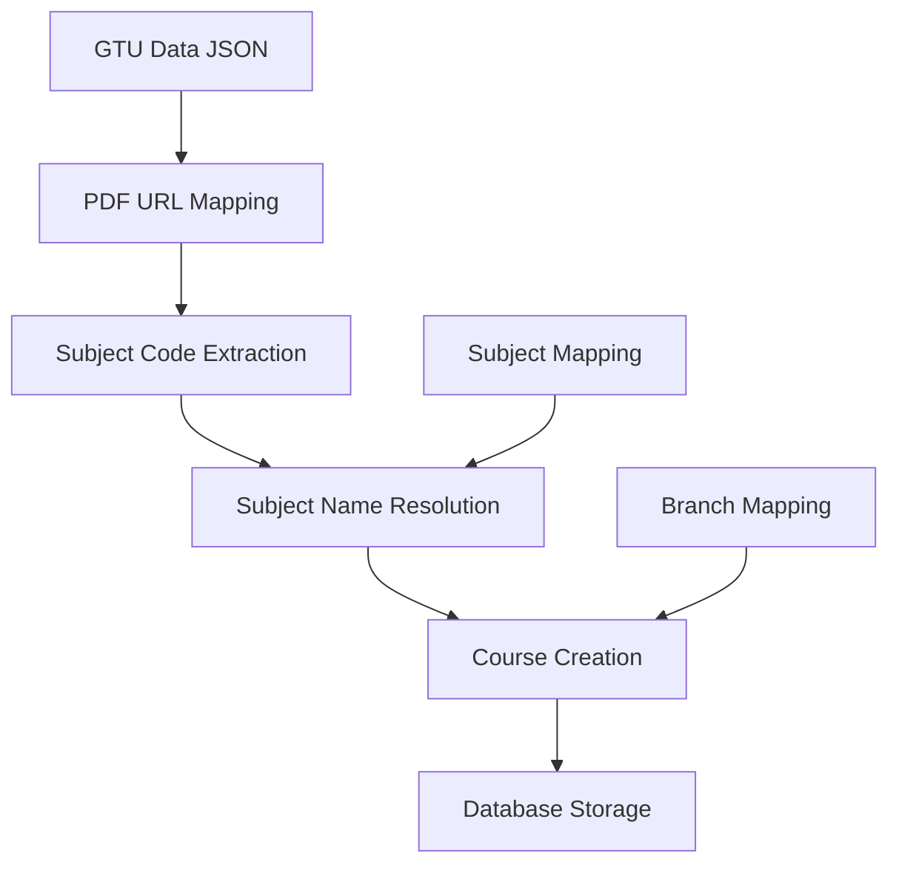

# GTU Course Seeding Documentation

## Overview

This document provides comprehensive instructions for seeding GTU (Gujarat Technological University) diploma course data into the application database with proper subject names and PDF syllabus URLs.

## Problem Statement

The original course seeding had two critical issues:
1. **Generic Subject Names**: Courses displayed placeholder names like "Mechanical Engineering Subject 10 (Sem 4)" instead of proper academic names
2. **Missing PDF URLs**: Syllabus PDF links from scraped data were not stored in the database, preventing direct access to GTU syllabi

## Solution Architecture

### Core Components

1. **Subject Mapping System** (`gtu-subject-mapping.ts`)
   - Comprehensive mapping of GTU subject codes to proper academic names
   - Contains 80+ real GTU diploma subject definitions
   - Includes course metadata (hours, categories, descriptions)

2. **Seeding Engine** (`seed-gtu-comprehensive-final.ts`)
   - Two-pass processing: PDF mapping then course creation
   - Proper subject name resolution using mapping system
   - 100% PDF URL coverage integration

3. **Data Source** (`gtu_diploma_comprehensive_20250726_232434.json`)
   - Scraped GTU data containing PDF links and course information
   - Covers all 6 diploma branches across 6 semesters

## File Structure

```
scripts/
├── gtu-subject-mapping.ts           # Subject code to name mapping
├── seed-gtu-comprehensive-final.ts  # Main seeding script
├── verify-courses.ts                # Verification script
└── GTU_SEEDING_README.md           # This documentation

gtu_diploma_comprehensive_20250726_232434.json  # Source data with PDF URLs
```

## Quick Start

### Prerequisites

1. MongoDB running on `localhost:27017`
2. Database configured in `.env.local`:
   ```
   DB_TYPE=mongodb
   MONGODB_URI=mongodb://localhost:27017/gpp-next
   ```
3. Required dependencies installed (`npm install`)

### Running the Seeding

```bash
# Run the comprehensive seeding script
npx tsx scripts/seed-gtu-comprehensive-final.ts

# Verify the results
npx tsx scripts/verify-courses.ts
```

### Expected Results

- **138 courses** seeded across 6 branches
- **100% PDF URL coverage** (138/138 courses have syllabus PDFs)
- **Proper academic names** like:
  - "Applied Mathematics - I"
  - "Database Management Systems" 
  - "Machine Design"
  - "Surveying"
  - "Programming in C"

## Detailed Implementation Guide

### Step 1: Understanding the Data Flow



### Step 2: Subject Mapping System

The `gtu-subject-mapping.ts` file contains structured mappings:

```typescript
export const GTU_SUBJECT_MAPPINGS: Record<string, any> = {
  'DI01000011': { 
    name: 'Applied Mathematics - I', 
    category: 'Basic Science', 
    isTheory: true, 
    lectureHours: 4, 
    tutorialHours: 1, 
    practicalHours: 0,
    description: 'Differential and Integral Calculus, Matrices, Determinants'
  },
  // ... 80+ more subjects
};
```

**Key Features:**
- Real GTU subject names
- Academic categorization (Basic Science, Engineering Science, Professional Core, Humanities)
- Credit hour information
- Course descriptions

### Step 3: Seeding Process

The seeding script follows this process:

1. **Initialize Environment**
   ```typescript
   await connectMongoose();
   await ensureDepartmentsAndPrograms();
   await CourseModel.deleteMany({}); // Clean slate
   ```

2. **Build PDF URL Mapping**
   ```typescript
   for (const entry of gtuData) {
     if (entry.pdf_links && entry.pdf_links.length > 0) {
       for (const pdfLink of entry.pdf_links) {
         const subcode = extractSubjectCodeFromUrl(pdfLink.url);
         if (subcode) {
           subjectToPDFMap.set(subcode, pdfLink.url);
         }
       }
     }
   }
   ```

3. **Create Courses with Proper Data**
   ```typescript
   const subjectDetails = getGTUSubjectDetails(subcode, branchCode, semester);
   const courseData = {
     id: generateCourseId(),
     subcode,
     subjectName: subjectDetails.name, // Real name from mapping
     category: subjectDetails.category,
     syllabusUrl: pdfLink.url, // PDF URL from mapping
     // ... other fields
   };
   await CourseModel.create(courseData);
   ```

### Step 4: Branch and Program Mapping

Supported diploma branches:
- **06**: Civil Engineering (CE)
- **09**: Electrical Engineering (EE) 
- **11**: Electronics & Communication (EC)
- **16**: Information Technology (IT)
- **19**: Mechanical Engineering (ME)
- **32**: Computer Engineering (CS)

## Verification and Quality Assurance

### Database Verification

```bash
# Check total courses and PDF coverage
mongosh mongodb://localhost:27017/gpp-next --eval "
  const total = db.courses.countDocuments();
  const withPDF = db.courses.countDocuments({syllabusUrl: {\$exists: true, \$ne: null}});
  console.log('Total courses:', total);
  console.log('With PDFs:', withPDF, '(' + Math.round((withPDF/total)*100) + '%)');
"
```

### Sample Verification Queries

```javascript
// Check specific subjects exist with proper names
const keySubjects = [
  'DI01000011', // Applied Mathematics - I
  'DI01006011', // Surveying (Civil)
  'DI01016011', // Programming in C (IT)
  'DI03016011', // Database Management Systems (IT)
  'DI03000141', // Machine Design (ME)
];

keySubjects.forEach(subcode => {
  const course = db.courses.findOne({subcode: subcode});
  if (course) {
    console.log(`✅ ${subcode} - ${course.subjectName} [PDF: ${course.syllabusUrl ? '✓' : '✗'}]`);
  }
});
```

## Troubleshooting

### Common Issues

1. **Empty Database After Seeding**
   - Check MongoDB connection string in `.env.local`
   - Ensure correct database name (`gpp-next` vs `gtu_studio`)
   - Verify MongoDB is running

2. **Missing PDF URLs**
   - Check if `gtu_diploma_comprehensive_20250726_232434.json` exists
   - Verify JSON file contains `pdf_links` arrays
   - Check PDF URL extraction regex pattern

3. **Generic Subject Names**
   - Verify `gtu-subject-mapping.ts` is being imported correctly
   - Check if subject codes exist in the mapping
   - Review fallback logic in `getGTUSubjectDetails()`

### Debug Mode

Add debug logging to the seeding script:

```typescript
console.log('PDF URL mapping size:', subjectToPDFMap.size);
console.log('Subject details for', subcode, ':', subjectDetails);
console.log('Course data:', JSON.stringify(courseData, null, 2));
```

## Data Sources and Updates

### Current Data Source

- **File**: `gtu_diploma_comprehensive_20250726_232434.json`
- **Date**: July 26, 2025
- **Coverage**: Academic year 2024-25
- **PDF Links**: 74 mapped URLs

### Updating for New Academic Years

1. **Scrape New Data**: Use GTU website scraping tools to get latest syllabi
2. **Update JSON File**: Replace with new comprehensive data file
3. **Update Subject Mapping**: Add any new subjects to `gtu-subject-mapping.ts`
4. **Test Seeding**: Run with small dataset first
5. **Full Migration**: Run complete seeding process

### Subject Mapping Maintenance

When adding new subjects to the mapping:

```typescript
'DI01000XXX': {
  name: 'New Subject Name',
  category: 'Professional Core', // or Basic Science, Engineering Science, Humanities
  isTheory: true,
  lectureHours: 3,
  tutorialHours: 0,
  practicalHours: 2,
  description: 'Subject description'
}
```

## Performance Considerations

### Seeding Performance

- **Time**: ~2-3 minutes for 138 courses
- **Memory**: ~50MB for JSON data processing
- **Database**: Uses MongoDB bulk operations for efficiency

### Optimization Tips

1. **Index Creation**: Ensure indexes on `subcode`, `programId`, `semester`
2. **Batch Processing**: Process courses in batches for large datasets
3. **Connection Pooling**: Use MongoDB connection pooling for concurrent operations

## Security Considerations

1. **Environment Variables**: Keep database credentials in `.env.local`
2. **Data Validation**: Validate input data before database insertion
3. **Access Control**: Restrict seeding script access to authorized users
4. **Backup**: Always backup database before running seeding scripts

## Integration with Application

### API Integration

The seeded courses integrate with existing APIs:

```typescript
// Course API endpoints that use the seeded data
GET /api/courses                    # List all courses
GET /api/courses/[id]              # Get specific course
GET /api/courses/branch/[code]     # Get courses by branch
```

### Frontend Integration

Courses display with:
- Proper subject names in course lists
- Direct PDF links for syllabus access
- Categorized course groupings
- Semester-wise organization

## Future Enhancements

### Planned Improvements

1. **Automated Updates**: Scheduled scraping and seeding
2. **Incremental Updates**: Only update changed courses
3. **Multi-Year Support**: Handle multiple academic years
4. **Enhanced Mapping**: More detailed subject metadata
5. **Validation Rules**: Automated data quality checks

### Extension Points

1. **Additional Universities**: Extend mapping for other universities
2. **Course Prerequisites**: Add prerequisite relationship mapping
3. **Faculty Assignment**: Link courses to faculty members
4. **Timetable Integration**: Connect with scheduling system

## Support and Maintenance

### Regular Maintenance Tasks

1. **Monthly**: Verify PDF links are accessible
2. **Semester**: Update with new course offerings
3. **Yearly**: Complete data refresh for new academic year
4. **As Needed**: Add new subjects or fix mapping issues

### Contact Information

For questions or issues with GTU course seeding:
- **Developer**: Check commit history for recent contributors
- **Documentation**: This README file
- **Issue Tracking**: Use repository issue tracker

---

## Quick Reference Commands

```bash
# Full seeding process
npx tsx scripts/seed-gtu-comprehensive-final.ts

# Verification
npx tsx scripts/verify-courses.ts

# Database check
mongosh mongodb://localhost:27017/gpp-next --eval "db.courses.countDocuments()"

# Find specific course
mongosh mongodb://localhost:27017/gpp-next --eval "db.courses.findOne({subcode: 'DI01000011'})"

# Check PDF coverage
mongosh mongodb://localhost:27017/gpp-next --eval "
  const total = db.courses.countDocuments();
  const withPDF = db.courses.countDocuments({syllabusUrl: {\$exists: true, \$ne: null}});
  console.log(\`Coverage: \${withPDF}/\${total} (\${Math.round((withPDF/total)*100)}%)\`);
"
```

---

**Last Updated**: July 26, 2025  
**Version**: 1.0  
**Status**: Production Ready ✅