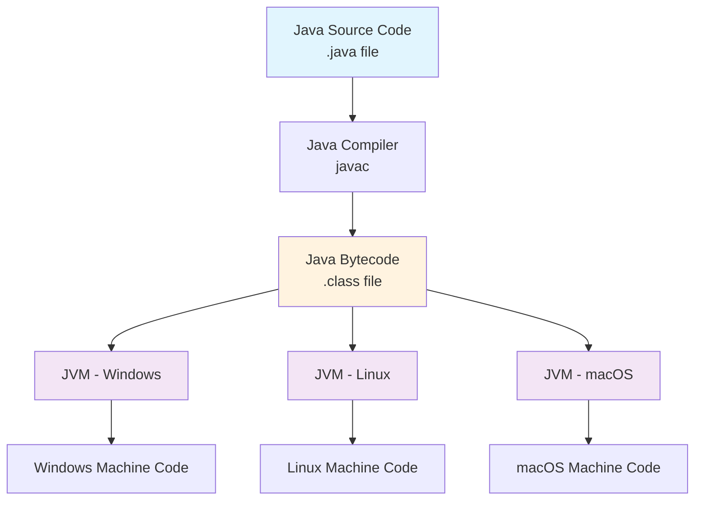

# Introduction to Java
## Lecture 1

**Java Programming (4343203)**  
Diploma in ICT - Semester IV  
Gujarat Technological University

  
    Press Space for next page <carbon:arrow-right class="inline"/>
  

---
layout: default
---

# Learning Objectives

By the end of this lecture, you will be able to:

<v-clicks>

- 🎯 **Understand** Java's history and evolution
- ✨ **Identify** key features of Java programming language
- 🌍 **Recognize** various applications of Java
- 💡 **Appreciate** why Java is popular in enterprise development
- 🔧 **Prepare** for Java development environment setup

</v-clicks>

 

Let's start our Java journey! ☕

---
layout: two-cols
---

# History of Java

## Timeline
- **1991** - Project Green started at Sun Microsystems
- **1995** - Java 1.0 released publicly
- **1996** - Java 1.1 with improved performance
- **1998** - Java 2 (J2SE 1.2) with Swing
- **2004** - Java 5 with generics and annotations
- **2006** - Java becomes open source
- **2009** - Oracle acquires Sun Microsystems
- **2014** - Java 8 with Lambda expressions
- **2017** - Java 9 with modules
- **Present** - Java 21 LTS (Latest)

::right::

## Key People
- **James Gosling** - Father of Java
- **Mike Sheridan** - Co-creator
- **Patrick Naughton** - Team member

## Original Goals
- **Platform Independence** 
- **Network-oriented**
- **Secure**
- **Simple**
- **Object-oriented**

---
layout: center
class: text-center
---

# Why was Java Created?

<h3 class="text-xl font-bold mb-4">🎯 Original Purpose</h3>
<ul class="text-left space-y-2">
<li>• Interactive television</li>
<li>• Consumer electronics</li>
<li>• Set-top boxes</li>
<li>• Embedded systems</li>
</ul>

<h3 class="text-xl font-bold mb-4">🌐 Web Revolution</h3>
<ul class="text-left space-y-2">
<li>• Internet boom (1990s)</li>
<li>• Platform independence needed</li>
<li>• Secure web applications</li>
<li>• Applets for browsers</li>
</ul>

"Write Once, Run Anywhere" (WORA)

---
layout: default
---

# Key Features of Java

## 🔑 Core Features

<v-clicks>

- **Simple** - Easy to learn and use
- **Object-Oriented** - Everything is an object
- **Platform Independent** - WORA principle
- **Secure** - Built-in security features
- **Robust** - Strong memory management
- **Multithreaded** - Concurrent programming

</v-clicks>

## ⚡ Performance Features

<v-clicks>

- **Portable** - Runs on any platform
- **High Performance** - JIT compilation
- **Distributed** - Network-aware
- **Dynamic** - Runtime binding
- **Interpreted** - Bytecode execution
- **Architecture Neutral** - Not tied to specific hardware

</v-clicks>

<strong>💡 Remember:</strong> These features make Java ideal for enterprise applications!

---
layout: default
---

# Platform Independence Explained

<strong>Key Point:</strong> Same bytecode runs on different platforms thanks to JVM!

---
layout: two-cols
---

# Applications of Java

## 🖥️ Desktop Applications
- **NetBeans IDE**
- **Eclipse IDE**  
- **IntelliJ IDEA**
- **Apache OpenOffice**

## 🌐 Web Applications
- **Spring Framework**
- **Struts**
- **JSF (JavaServer Faces)**
- **RESTful Web Services**

::right::

## 📱 Mobile Development
- **Android Apps** (Primary language)
- **J2ME** (Legacy mobile apps)

## 🏢 Enterprise Applications
- **Banking Systems**
- **E-commerce Platforms**
- **ERP Systems**
- **CRM Applications**

## 🔬 Other Domains
- **Scientific Applications**
- **Trading Applications**
- **Big Data (Hadoop, Kafka)**
- **Microservices**

---
layout: center
---

# Real-World Java Examples

<h3 class="font-bold text-lg mb-3">🏦 Banking</h3>
<ul class="text-sm space-y-1">
<li>• HDFC Bank</li>
<li>• SBI Online</li>
<li>• ICICI Bank</li>
<li>• PayTM</li>
</ul>

<h3 class="font-bold text-lg mb-3">🛒 E-Commerce</h3>
<ul class="text-sm space-y-1">
<li>• Amazon</li>
<li>• Flipkart</li>
<li>• eBay</li>
<li>• Alibaba</li>
</ul>

<h3 class="font-bold text-lg mb-3">📱 Mobile</h3>
<ul class="text-sm space-y-1">
<li>• WhatsApp</li>
<li>• Instagram</li>
<li>• Uber</li>
<li>• Netflix</li>
</ul>

Java powers applications used by billions of people daily!

---
layout: default
---

# Why Java is Popular?

## 👍 Advantages

<v-clicks>

- **Large Community** - Extensive support and resources
- **Rich Libraries** - Vast ecosystem of frameworks
- **Enterprise-Ready** - Scalable and maintainable
- **Job Market** - High demand for Java developers
- **Continuous Evolution** - Regular updates and improvements
- **Free and Open Source** - No licensing costs

</v-clicks>

## 📊 Industry Statistics

<v-clicks>

- **#2** Most popular programming language (GitHub)
- **3 billion** devices run Java
- **45%** of companies use Java for backend
- **9 million** Java developers worldwide
- **$95,000** average Java developer salary (US)

</v-clicks>

<strong>💼 Career Tip:</strong> Learning Java opens many opportunities!

---
layout: default
---

# Java vs Other Languages

| Feature | Java | Python | C++ | JavaScript |
|---------|------|--------|-----|------------|
| **Platform Independence** | ✅ Yes | ✅ Yes | ❌ No | ✅ Yes |
| **Object-Oriented** | ✅ Pure OOP | 🔶 Multi-paradigm | ✅ Yes | 🔶 Prototype-based |
| **Memory Management** | ✅ Automatic | ✅ Automatic | ❌ Manual | ✅ Automatic |
| **Performance** | 🔶 Good | 🔶 Moderate | ✅ Excellent | 🔶 Good |
| **Learning Curve** | 🔶 Moderate | ✅ Easy | ❌ Difficult | ✅ Easy |
| **Enterprise Use** | ✅ Excellent | 🔶 Good | 🔶 Good | 🔶 Good |

<strong>🎯 Key Takeaway:</strong> Java balances performance, security, and ease of development, making it ideal for enterprise applications.

---
layout: default
---

# Course Connection

## 📚 What You'll Learn
- **Unit I:** Java basics and syntax
- **Unit II:** Object-oriented programming
- **Unit III:** Inheritance and packages
- **Unit IV:** Exception handling and multithreading
- **Unit V:** File handling and collections

## 🎯 Course Outcomes
After this course, you'll be able to:
- Write Java programs for real problems
- Apply OOP concepts effectively
- Handle errors and exceptions
- Work with files and databases
- Build enterprise-ready applications

<h3 class="font-bold text-lg mb-3">🚀 Next Lecture Preview</h3>

We'll set up the Java development environment and write our first "Hello World" program!

---
layout: default
---

# Practical Activity

## 🔍 Research Assignment

<strong>Task 1:</strong> Find 3 popular applications that use Java and research why they chose Java over other languages.

<strong>Task 2:</strong> Visit Oracle's official Java website and note down the latest Java version and its new features.

<strong>Task 3:</strong> Prepare your computer for Java installation by checking system requirements.

## 💭 Discussion Questions
1. Why is platform independence important in modern software development?
2. How does Java's "write once, run anywhere" principle benefit developers?
3. What makes Java suitable for large-scale enterprise applications?

---
layout: center
class: text-center
---

# Summary

<h3 class="font-bold text-lg mb-4">📖 What We Learned</h3>
<ul class="text-left space-y-2">
<li>• Java's history and evolution</li>
<li>• Key features making Java powerful</li>
<li>• Platform independence concept</li>
<li>• Real-world applications of Java</li>
<li>• Why Java is industry favorite</li>
</ul>

<h3 class="font-bold text-lg mb-4">🎯 Next Steps</h3>
<ul class="text-left space-y-2">
<li>• Install Java Development Kit (JDK)</li>
<li>• Set up development environment</li>
<li>• Write first Java program</li>
<li>• Understand compilation process</li>
<li>• Practice with simple examples</li>
</ul>

Ready to start coding in Java? ☕🚀

---
layout: center
class: text-center
---

# Questions & Discussion

❓

Any questions about Java's introduction, features, or applications?

Next lecture: **Java Environment Setup & First Program**

Thank you for your attention! 👏

