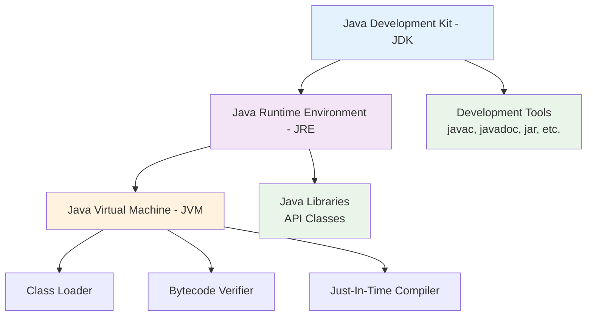
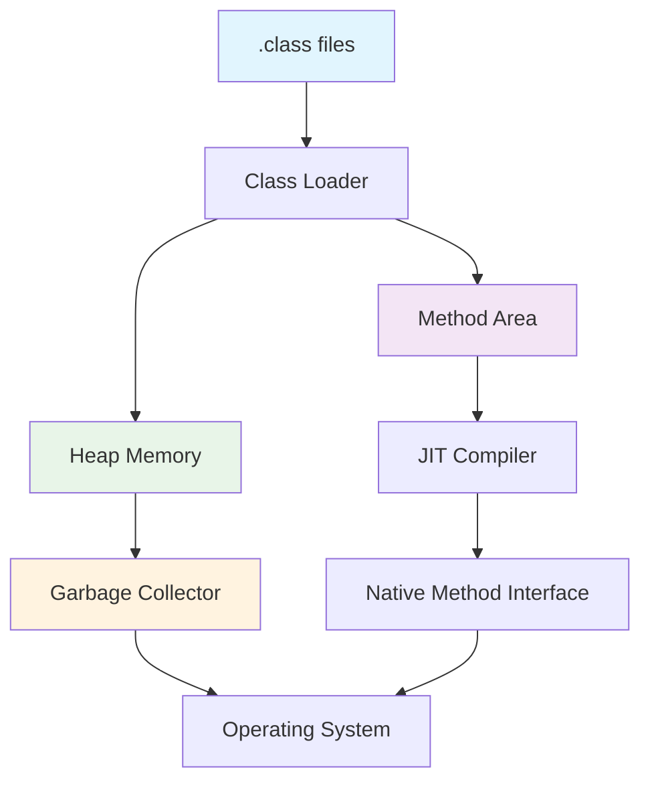
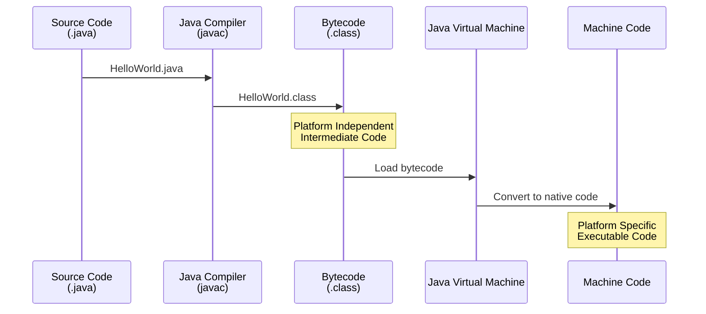
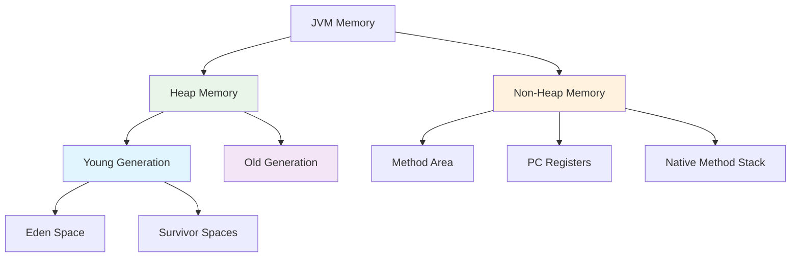
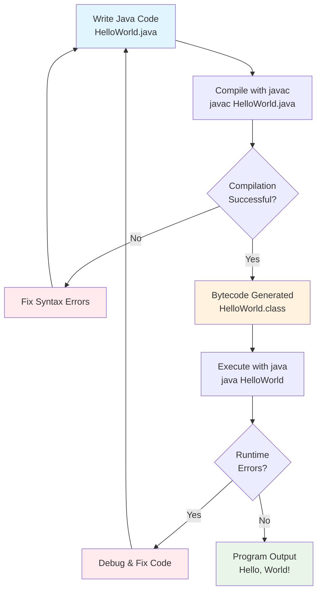

# Java Environment and Program Structure
## Lecture 2

**Java Programming (4343203)**  
Diploma in ICT - Semester IV  
Gujarat Technological University

<div class="pt-12">
  <span @click="$slidev.nav.next" class="px-2 py-1 rounded cursor-pointer" hover="bg-white bg-opacity-10">
    Press Space for next page <carbon:arrow-right class="inline"/>
  </span>
</div>

---
layout: default
---

# Learning Objectives

By the end of this lecture, you will be able to:

<v-clicks>

- 🔧 **Understand** the difference between JVM, JRE, and JDK
- ⚙️ **Explain** the bytecode concept and its importance
- 🗑️ **Describe** garbage collection in Java
- 💻 **Install** and configure Java development environment
- ✨ **Write** your first "Hello World" Java program
- 🔄 **Compile** and execute Java programs

</v-clicks>

<br>

<div v-click="7" class="text-center text-2xl text-blue-600 font-bold">
Let's set up our Java development environment! 🛠️
</div>

---
layout: center
---

# Java Platform Components

<div class="flex justify-center">



</div>

<div class="mt-6 text-center">
<div class="bg-blue-50 p-4 rounded-lg inline-block">
<strong>Remember:</strong> JDK ⊃ JRE ⊃ JVM
</div>
</div>

---
layout: two-cols
---

# Java Virtual Machine (JVM)

<div class="text-sm">

## 🎯 What is JVM?
- **Runtime environment** for Java bytecode
- **Platform-specific** (Windows, Linux, macOS)
- **Converts bytecode** to machine code
- **Manages memory** automatically

## 🔧 Key Components
- **Class Loader** - Loads .class files
- **Bytecode Verifier** - Security checks
- **Interpreter** - Executes bytecode
- **JIT Compiler** - Optimizes performance

</div>

::right::

<div class="pl-4">

## 📊 JVM Architecture



<div class="mt-4 p-3 bg-yellow-50 rounded">
<strong>💡 Key Point:</strong> JVM makes Java platform independent!
</div>

</div>

---
layout: default
---

# Java Runtime Environment (JRE)

<div class="grid grid-cols-2 gap-8">

<div>

## 🎯 What is JRE?

<v-clicks>

- **Runtime environment** for Java applications
- **Includes JVM** + Java libraries
- **Required to run** Java programs
- **Cannot compile** Java source code

</v-clicks>

</div>

<div>

## 📦 JRE Components

<v-clicks>

- **JVM** - Virtual machine
- **Core Libraries** - java.lang, java.util, etc.
- **Supporting Files** - Property files, resources
- **Browser Plugins** - For applets (deprecated)

</v-clicks>

</div>

</div>

<div v-click="9" class="mt-8 p-6 bg-blue-50 rounded-lg">
<h3 class="font-bold text-lg mb-3">🔍 Real-World Analogy</h3>
<p><strong>JRE is like a media player</strong> - it can play video files (.mp4) but cannot create them. Similarly, JRE can run Java programs (.class) but cannot compile them.</p>
</div>

---
layout: default
---

# Java Development Kit (JDK)

<div class="grid grid-cols-2 gap-8">

<div>

## 🛠️ What is JDK?

<v-clicks>

- **Complete development platform**
- **Includes JRE** + development tools
- **Required for development**
- **Free and open source**

</v-clicks>

## 📋 JDK Versions
- **Java 8** - LTS (Long Term Support)
- **Java 11** - LTS
- **Java 17** - LTS (Current)
- **Java 21** - Latest LTS

</div>

<div>

## 🔧 Development Tools

<v-clicks>

- **javac** - Java compiler
- **java** - Java interpreter
- **javadoc** - Documentation generator
- **jar** - Archive tool
- **jdb** - Debugger
- **javap** - Class file disassembler

</v-clicks>

</div>

</div>

<div v-click="12" class="mt-6 p-4 bg-green-50 rounded-lg">
<strong>💼 For Developers:</strong> Always install JDK, not just JRE, for development work!
</div>

---
layout: center
---

# Bytecode Concept

<div class="flex justify-center">



</div>

<div class="mt-8 grid grid-cols-2 gap-6">

<div class="bg-blue-50 p-4 rounded-lg">
<h3 class="font-bold mb-2">✅ Advantages</h3>
<ul class="text-sm space-y-1">
<li>• Platform independence</li>
<li>• Security verification</li>
<li>• Optimized execution</li>
<li>• Compact representation</li>
</ul>
</div>

<div class="bg-yellow-50 p-4 rounded-lg">
<h3 class="font-bold mb-2">⚠️ Characteristics</h3>
<ul class="text-sm space-y-1">
<li>• Not human-readable</li>
<li>• Machine-independent</li>
<li>• JVM-specific format</li>
<li>• .class file extension</li>
</ul>
</div>

</div>

---
layout: default
---

# Garbage Collection

<div class="grid grid-cols-2 gap-8">

<div>

## 🗑️ What is Garbage Collection?

<v-clicks>

- **Automatic memory management**
- **Removes unused objects**
- **Prevents memory leaks**
- **Runs in background**

</v-clicks>

## 🔄 GC Process
<v-clicks>

1. **Mark** - Identify unused objects
2. **Sweep** - Remove unused objects  
3. **Compact** - Defragment memory

</v-clicks>

</div>

<div>

## 💾 Memory Areas



</div>

</div>

<div v-click="8" class="mt-6 p-4 bg-green-50 rounded-lg">
<strong>🎯 Benefit:</strong> Java developers don't need to manually manage memory like in C/C++!
</div>

---
layout: default
---

# Installing Java JDK

## 🔽 Download Sources

<div class="grid grid-cols-2 gap-6">

<div class="bg-blue-50 p-4 rounded-lg">
<h3 class="font-bold mb-3">🏢 Oracle JDK</h3>
<ul class="space-y-2">
<li>• Commercial license</li>
<li>• oracle.com/java</li>
<li>• Production support</li>
<li>• Latest features</li>
</ul>
</div>

<div class="bg-green-50 p-4 rounded-lg">
<h3 class="font-bold mb-3">🆓 OpenJDK</h3>
<ul class="space-y-2">
<li>• Open source</li>
<li>• openjdk.java.net</li>
<li>• Community support</li>
<li>• Free for all use</li>
</ul>
</div>

</div>

## ⚙️ Installation Steps

<v-clicks>

1. **Download** JDK installer for your OS
2. **Run** installer with admin privileges
3. **Set JAVA_HOME** environment variable
4. **Add** Java bin directory to PATH
5. **Verify** installation with `java -version`

</v-clicks>

---
layout: default
---

# Setting Environment Variables

## 🪟 Windows Setup

```bash
# Set JAVA_HOME
JAVA_HOME = C:\Program Files\Java\jdk-17

# Add to PATH
PATH = %JAVA_HOME%\bin;%PATH%

# Verify installation
java -version
javac -version
```

## 🐧 Linux/macOS Setup

```bash
# Add to ~/.bashrc or ~/.zshrc
export JAVA_HOME=/usr/lib/jvm/java-17-openjdk
export PATH=$JAVA_HOME/bin:$PATH

# Reload configuration
source ~/.bashrc

# Verify installation
java -version
javac -version
```

<div class="mt-6 p-4 bg-yellow-50 rounded-lg">
<strong>⚠️ Important:</strong> Make sure JAVA_HOME points to JDK, not JRE!
</div>

---
layout: default
---

# Your First Java Program

## 📝 Hello World Example

```java {all|1-2|4|6-8|all}
// HelloWorld.java
public class HelloWorld {
    
    public static void main(String[] args) {
        
        System.out.println("Hello, World!");
        System.out.println("Welcome to Java Programming!");
    }
}
```

## 🔍 Code Explanation

<v-clicks>

- **Line 1:** Comment explaining the file
- **Line 2:** Class declaration (must match filename)
- **Line 4:** Main method - entry point of program
- **Line 6-7:** Print statements to display output

</v-clicks>

<div v-click="5" class="mt-4 p-4 bg-blue-50 rounded-lg">
<strong>💡 Rule:</strong> Java filename must match the public class name!
</div>

---
layout: default
---

# Compilation and Execution

## ⚙️ Step-by-Step Process

<div class="space-y-6">

<div class="bg-yellow-50 p-4 rounded-lg">
<h3 class="font-bold mb-2">1️⃣ Write Source Code</h3>
<code>HelloWorld.java</code> - Contains human-readable Java code
</div>

<div class="bg-blue-50 p-4 rounded-lg">
<h3 class="font-bold mb-2">2️⃣ Compile with javac</h3>
<code>javac HelloWorld.java</code> - Creates HelloWorld.class
</div>

<div class="bg-green-50 p-4 rounded-lg">
<h3 class="font-bold mb-2">3️⃣ Execute with java</h3>
<code>java HelloWorld</code> - Runs the bytecode
</div>

</div>

## 🖥️ Command Line Demo

```bash
# Navigate to source directory
cd /path/to/your/java/files

# Compile the program
javac HelloWorld.java

# Run the program
java HelloWorld
```

---
layout: default
---

# Complete Development Workflow



---
layout: default
---

# Common Compilation Errors

<div class="grid grid-cols-2 gap-6">

<div>

## ❌ Syntax Errors

```java
// Missing semicolon
System.out.println("Hello World")

// Mismatched braces
public class Test {
    public static void main(String[] args) {
        System.out.println("Hello");
    // Missing closing brace
```

</div>

<div>

## ❌ Common Mistakes

```java
// Wrong class name
public class hello {  // Should be Hello
    // ...
}

// Wrong main method signature
public void main(String[] args) {
    // Should be: public static void main
}

// Case sensitivity
system.out.println("Hello");
// Should be: System.out.println
```

</div>

</div>

<div class="mt-6 p-4 bg-red-50 rounded-lg">
<strong>⚠️ Remember:</strong> Java is case-sensitive! <code>System</code> ≠ <code>system</code>
</div>

---
layout: default
---

# IDE vs Command Line

<div class="grid grid-cols-2 gap-8">

<div>

## 🖥️ Command Line Development

**Advantages:**
- Direct control over compilation
- Better understanding of process
- Lightweight and fast
- Good for learning

**Disadvantages:**
- Manual error checking
- No syntax highlighting
- No auto-completion
- More typing required

</div>

<div>

## 💻 IDE Development

**Popular IDEs:**
- **IntelliJ IDEA** (Most popular)
- **Eclipse** (Free and powerful)
- **NetBeans** (Oracle supported)
- **VS Code** (Lightweight)

**Benefits:**
- Syntax highlighting
- Auto-completion
- Error detection
- Debugging tools
- Project management

</div>

</div>

<div class="mt-6 p-4 bg-blue-50 rounded-lg">
<strong>🎯 Recommendation:</strong> Start with command line to understand basics, then move to IDE for productivity!
</div>

---
layout: default
---

# Practical Exercise

## 🛠️ Hands-On Activity

<div class="space-y-4">

<div class="bg-yellow-50 p-4 rounded-lg">
<strong>Task 1:</strong> Install JDK on your computer and verify installation
</div>

<div class="bg-blue-50 p-4 rounded-lg">
<strong>Task 2:</strong> Write "Hello World" program and save as HelloWorld.java
</div>

<div class="bg-green-50 p-4 rounded-lg">
<strong>Task 3:</strong> Compile and run the program using command line
</div>

<div class="bg-purple-50 p-4 rounded-lg">
<strong>Task 4:</strong> Modify the program to print your name and college details
</div>

</div>

## 🎯 Expected Output
```
Hello, World!
Welcome to Java Programming!
My name is [Your Name]
I study at Government Polytechnic
```

---
layout: default
---

# Troubleshooting Common Issues

<div class="space-y-4">

<div class="bg-red-50 p-4 rounded-lg">
<h4 class="font-bold text-red-700">❌ 'javac' is not recognized</h4>
<p><strong>Solution:</strong> Check JAVA_HOME and PATH environment variables</p>
</div>

<div class="bg-orange-50 p-4 rounded-lg">
<h4 class="font-bold text-orange-700">❌ Could not find or load main class</h4>
<p><strong>Solution:</strong> Ensure class name matches filename exactly</p>
</div>

<div class="bg-yellow-50 p-4 rounded-lg">
<h4 class="font-bold text-yellow-700">❌ Public class must be in file named</h4>
<p><strong>Solution:</strong> Rename file to match public class name</p>
</div>

<div class="bg-blue-50 p-4 rounded-lg">
<h4 class="font-bold text-blue-700">❌ Cannot find symbol</h4>
<p><strong>Solution:</strong> Check spelling and case sensitivity</p>
</div>

</div>

---
layout: center
class: text-center
---

# Summary

<div class="grid grid-cols-2 gap-8 mt-8">

<div class="bg-blue-50 p-6 rounded-lg">
<h3 class="font-bold text-lg mb-4">📖 What We Learned</h3>
<ul class="text-left space-y-2">
<li>• JVM, JRE, and JDK concepts</li>
<li>• Bytecode and its importance</li>
<li>• Garbage collection basics</li>
<li>• Java environment setup</li>
<li>• First Java program creation</li>
</ul>
</div>

<div class="bg-green-50 p-6 rounded-lg">
<h3 class="font-bold text-lg mb-4">🎯 Next Steps</h3>
<ul class="text-left space-y-2">
<li>• Java program structure details</li>
<li>• Types of comments in Java</li>
<li>• Coding conventions</li>
<li>• More complex programs</li>
<li>• Debugging techniques</li>
</ul>
</div>

</div>

<div class="mt-8 text-2xl font-bold text-purple-600">
You've written your first Java program! 🎉
</div>

---
layout: center
class: text-center
---

# Questions & Discussion

<div class="text-6xl mb-8">❓</div>

<div class="text-xl mb-8">
Any questions about Java environment setup or your first program?
</div>

<div class="text-lg text-gray-600">
Next lecture: **Java Program Structure & Comments**
</div>

<div class="mt-8">
<span class="px-4 py-2 bg-blue-500 text-white rounded-lg">
Great job setting up Java! 👏
</span>
</div>