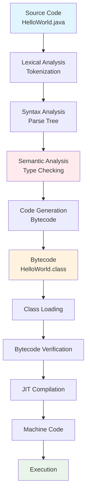

# Java Program Structure and Comments
## Lecture 3

**Java Programming (4343203)**  
Diploma in ICT - Semester IV  
Gujarat Technological University

<div class="pt-12">
  <span @click="$slidev.nav.next" class="px-2 py-1 rounded cursor-pointer" hover="bg-white bg-opacity-10">
    Press Space for next page <carbon:arrow-right class="inline"/>
  </span>
</div>

---
layout: default
---

# Learning Objectives

By the end of this lecture, you will be able to:

<v-clicks>

- 📐 **Understand** the basic structure of Java programs
- 📝 **Identify** different types of comments in Java
- 🏗️ **Explain** the compilation and execution process
- 📋 **Apply** Java coding conventions and best practices
- 🔧 **Write** well-structured and documented Java programs
- 🎯 **Debug** simple Java programs effectively

</v-clicks>

<br>

<div v-click="7" class="text-center text-2xl text-blue-600 font-bold">
Let's master Java program structure! 📐
</div>

---
layout: center
---

# Basic Java Program Structure

```java {all|1-2|4|6|8-10|12|all}
// Package declaration (optional)
package com.example;

import java.util.Scanner;  // Import statements (optional)

public class MyProgram {   // Class declaration (mandatory)
    
    // Instance variables (optional)
    private String message = "Hello World";
    
    public static void main(String[] args) {  // Main method (mandatory)
        // Method body - program logic
        System.out.println("Hello, Java!");
    }
    
    // Other methods (optional)
    public void displayMessage() {
        System.out.println(message);
    }
}
```

<div class="mt-6 text-center bg-blue-50 p-4 rounded-lg">
<strong>💡 Remember:</strong> Every Java application must have a main() method!
</div>

---
layout: default
---

# Program Structure Components

<div class="grid grid-cols-2 gap-8">

<div>

## 📦 Required Components

<v-clicks>

- **Class Declaration**
  - Must match filename
  - Contains all code
  - Uses `public class` keyword

- **Main Method**
  - Entry point of program
  - Must be `public static void`
  - Takes `String[] args` parameter

</v-clicks>

</div>

<div>

## 🔧 Optional Components

<v-clicks>

- **Package Declaration**
  - Organizes related classes
  - Must be first line (if used)

- **Import Statements**
  - Brings in external classes
  - Reduces fully qualified names

- **Instance Variables**
  - Store object state
  - Defined inside class

- **Methods**
  - Define object behavior
  - Can be called from main

</v-clicks>

</div>

</div>

---
layout: default
---

# Detailed Structure Breakdown

```java
// 1. Package declaration (optional - must be first)
package com.company.project;

// 2. Import statements (optional - after package)
import java.util.Scanner;
import java.util.ArrayList;

// 3. Class declaration (mandatory)
public class Student {
    
    // 4. Class variables/fields (optional)
    private String name;
    private int age;
    private static int totalStudents = 0;
    
    // 5. Constructors (optional)
    public Student(String name, int age) {
        this.name = name;
        this.age = age;
        totalStudents++;
    }
    
    // 6. Main method (mandatory for executable classes)
    public static void main(String[] args) {
        Student student = new Student("John", 20);
        student.displayInfo();
    }
    
    // 7. Other methods (optional)
    public void displayInfo() {
        System.out.println("Name: " + name + ", Age: " + age);
    }
}
```

---
layout: center
---

# Types of Comments in Java

<div class="grid grid-cols-3 gap-6 mt-8">

<div class="bg-blue-50 p-6 rounded-lg">
<h3 class="font-bold text-lg mb-4">💬 Single-Line</h3>
<pre><code class="language-java">// This is a single-line comment
int age = 20; // Age of student</code></pre>
<p class="text-sm mt-2">Used for brief explanations</p>
</div>

<div class="bg-green-50 p-6 rounded-lg">
<h3 class="font-bold text-lg mb-4">📝 Multi-Line</h3>
<pre><code class="language-java">/* This is a
   multi-line comment
   spanning multiple lines */</code></pre>
<p class="text-sm mt-2">Used for longer explanations</p>
</div>

<div class="bg-yellow-50 p-6 rounded-lg">
<h3 class="font-bold text-lg mb-4">📚 Documentation</h3>
<pre><code class="language-java">/**
 * This method calculates area
 * @param radius circle radius
 * @return area of circle
 */</code></pre>
<p class="text-sm mt-2">Used for API documentation</p>
</div>

</div>

---
layout: default
---

# Comment Examples and Best Practices

```java {all|1-3|5-9|11-16|18-20|22-25|all}
// Good: Explains why, not what
// Calculate compound interest for loan processing
double interest = principal * rate * time;

/* 
 * Bad example - obvious comment
 * This adds 1 to count
 */
count++; // Don't do this!

/**
 * Calculates the monthly payment for a loan
 * @param principal The loan amount in rupees
 * @param rate Annual interest rate (as decimal)
 * @param years Loan term in years
 * @return Monthly payment amount
 */
public double calculateMonthlyPayment(double principal, double rate, int years) {
    // Convert annual rate to monthly and years to months
    double monthlyRate = rate / 12;
    int totalMonths = years * 12;
    
    // Apply loan payment formula
    return principal * (monthlyRate * Math.pow(1 + monthlyRate, totalMonths)) 
                    / (Math.pow(1 + monthlyRate, totalMonths) - 1);
}
```

<div class="mt-4 p-4 bg-blue-50 rounded-lg">
<strong>💡 Best Practice:</strong> Comments should explain "why" and "how", not "what"!
</div>

---
layout: default
---

# Documentation Comments (Javadoc)

## 📚 Javadoc Tags

<div class="grid grid-cols-2 gap-6">

<div>

### Common Tags
- `@author` - Author name
- `@version` - Version information
- `@param` - Parameter description
- `@return` - Return value description
- `@throws` - Exception description
- `@since` - Version when added
- `@see` - Reference to other elements

</div>

<div>

### Example Usage
```java
/**
 * Student management class for college system
 * 
 * @author John Doe
 * @version 1.0
 * @since 2024
 */
public class Student {
    
    /**
     * Calculates GPA based on marks
     * @param marks Array of subject marks
     * @return GPA value between 0.0 and 4.0
     * @throws IllegalArgumentException if marks invalid
     * @see #calculatePercentage(int[])
     */
    public double calculateGPA(int[] marks) {
        // Implementation here
        return 0.0;
    }
}
```

</div>

</div>

---
layout: default
---

# Generating Javadoc

## 🔧 Command Line Generation

```bash
# Generate documentation for single file
javadoc Student.java

# Generate for multiple files
javadoc *.java

# Generate with specific options
javadoc -d docs -author -version *.java
```

## 📊 Generated Documentation

<div class="bg-gray-50 p-4 rounded-lg mt-4">

```
docs/
├── index.html          # Main documentation page
├── Student.html        # Class documentation
├── package-summary.html # Package overview
├── allclasses.html     # All classes list
└── stylesheet.css      # Styling
```

</div>

<div class="mt-4 p-4 bg-green-50 rounded-lg">
<strong>🎯 Professional Tip:</strong> Always document public methods and classes for team collaboration!
</div>

---
layout: default
---

# Java Coding Conventions

<div class="grid grid-cols-2 gap-8">

<div>

## 📝 Naming Conventions

**Classes:**
```java
public class StudentRecord { }     // ✅ PascalCase
public class student_record { }    // ❌ Wrong
```

**Methods & Variables:**
```java
int studentAge;                    // ✅ camelCase
void calculateGPA() { }           // ✅ camelCase
int Student_Age;                  // ❌ Wrong
```

**Constants:**
```java
public static final int MAX_SIZE = 100;  // ✅ UPPER_CASE
public static final int maxSize = 100;   // ❌ Wrong
```

</div>

<div>

## 🏗️ Structure Conventions

**Indentation:**
```java
public class Example {
    public static void main(String[] args) {  // 4 spaces
        if (condition) {                      // 4 spaces
            System.out.println("Hello");     // 4 spaces
        }
    }
}
```

**Braces:**
```java
// ✅ Correct (K&R style)
if (condition) {
    statement;
}

// ❌ Avoid (Allman style)
if (condition) 
{
    statement;
}
```

</div>

</div>

---
layout: default
---

# File Organization Standards

```java
/*
 * Copyright (c) 2024 Government Polytechnic
 * All rights reserved.
 */

package edu.gpp.students;                    // 1. Package declaration

import java.util.Scanner;                    // 2. Standard library imports
import java.util.ArrayList;

import edu.gpp.common.Utils;                 // 3. Third-party imports

/**                                          // 4. Class documentation
 * Student management system
 * 
 * @author Your Name
 * @version 1.0
 */
public class StudentManager {                // 5. Class declaration
    
    // Class constants
    private static final int MAX_STUDENTS = 100;
    
    // Instance variables
    private String instituteName;
    private ArrayList<String> students;
    
    // Constructors
    public StudentManager(String instituteName) {
        this.instituteName = instituteName;
        this.students = new ArrayList<>();
    }
    
    // Main method
    public static void main(String[] args) {
        // Implementation
    }
    
    // Other methods (alphabetically ordered)
    public void addStudent(String name) { }
    public void removeStudent(String name) { }
}
```

---
layout: default
---

# Compilation Process Deep Dive

<div class="flex justify-center">



</div>

<div class="mt-6 grid grid-cols-2 gap-4">
<div class="bg-blue-50 p-3 rounded">
<strong>Compile Time:</strong> Source → Bytecode
</div>
<div class="bg-green-50 p-3 rounded">
<strong>Runtime:</strong> Bytecode → Machine Code
</div>
</div>

---
layout: default
---

# Common Compilation Errors

<div class="space-y-4">

<div class="bg-red-50 p-4 rounded-lg">
<h4 class="font-bold text-red-700">❌ Syntax Errors</h4>
```java
public class Test {
    public static void main(String[] args) {
        System.out.println("Hello World")  // Missing semicolon
    }  // Missing closing brace
```
</div>

<div class="bg-orange-50 p-4 rounded-lg">
<h4 class="font-bold text-orange-700">❌ Class Name Mismatch</h4>
```java
// File: HelloWorld.java
public class Hello {  // Should be HelloWorld
    // ...
}
```
</div>

<div class="bg-yellow-50 p-4 rounded-lg">
<h4 class="font-bold text-yellow-700">❌ Access Modifier Errors</h4>
```java
class Test {
    static void main(String[] args) {  // Should be public
        // ...
    }
}
```
</div>

</div>

---
layout: default
---

# Execution Process Details

## 🚀 Runtime Steps

<v-clicks>

1. **Class Loading**
   - JVM loads .class files
   - Bootstrap, Extension, System classloaders

2. **Linking**
   - Verification: Bytecode security check
   - Preparation: Static variable memory allocation
   - Resolution: Symbolic references to direct references

3. **Initialization**
   - Static variables initialized
   - Static blocks executed

4. **Execution**
   - main() method called
   - JIT compilation for performance

</v-clicks>

<div v-click="5" class="mt-6 p-4 bg-blue-50 rounded-lg">
<strong>🔍 Memory Management:</strong> JVM automatically handles memory allocation and garbage collection during execution.
</div>

---
layout: default
---

# IDE vs Text Editor

<div class="grid grid-cols-2 gap-8">

<div>

## 📝 Text Editor Approach

**Advantages:**
- Understand compilation process
- Lightweight and fast
- No complex setup
- Direct control

**Tools:**
- Notepad++ (Windows)
- VS Code (Cross-platform)
- Sublime Text
- Vim/Emacs

**Workflow:**
```bash
# Write code
notepad HelloWorld.java

# Compile
javac HelloWorld.java

# Run
java HelloWorld
```

</div>

<div>

## 💻 IDE Approach

**Advantages:**
- Syntax highlighting
- Auto-completion
- Error detection
- Integrated debugging
- Project management

**Popular IDEs:**
- IntelliJ IDEA
- Eclipse
- NetBeans
- VS Code with Java extensions

**Features:**
- Build automation
- Version control integration
- Code refactoring
- Unit testing support

</div>

</div>

---
layout: default
---

# Practical Exercise

## 🛠️ Hands-On Activities

<div class="space-y-4">

<div class="bg-yellow-50 p-4 rounded-lg">
<strong>Task 1:</strong> Create a program with all three types of comments and proper structure
</div>

<div class="bg-blue-50 p-4 rounded-lg">
<strong>Task 2:</strong> Write a Student class with documentation comments and generate Javadoc
</div>

<div class="bg-green-50 p-4 rounded-lg">
<strong>Task 3:</strong> Practice proper naming conventions in your code
</div>

<div class="bg-purple-50 p-4 rounded-lg">
<strong>Task 4:</strong> Deliberately introduce errors and practice debugging
</div>

</div>

## 📝 Sample Program Structure

```java
/**
 * College Information System
 * @author [Your Name]
 * @version 1.0
 */
public class CollegeInfo {
    // Your implementation here
    public static void main(String[] args) {
        // Display college information
    }
}
```

---
layout: default
---

# Debugging Tips

<div class="grid grid-cols-2 gap-8">

<div>

## 🔍 Common Issues

**Compilation Problems:**
- Check file name vs class name
- Verify proper syntax
- Look for missing semicolons
- Check brace matching

**Runtime Problems:**
- Ensure main method signature is correct
- Check classpath issues
- Verify input/output operations

</div>

<div>

## 🛠️ Debugging Strategies

**Step-by-Step Approach:**
1. Read error messages carefully
2. Identify line numbers
3. Check syntax at error location
4. Use print statements for debugging
5. Comment out problematic code

**Tools:**
- IDE debugger
- System.out.println() statements
- Stack trace analysis
- Code review with peers

</div>

</div>

<div class="mt-6 p-4 bg-blue-50 rounded-lg">
<strong>💡 Pro Tip:</strong> Always read error messages completely - they often tell you exactly what's wrong!
</div>

---
layout: center
class: text-center
---

# Best Practices Summary

<div class="grid grid-cols-2 gap-8 mt-8">

<div class="bg-blue-50 p-6 rounded-lg">
<h3 class="font-bold text-lg mb-4">📖 Code Quality</h3>
<ul class="text-left space-y-2">
<li>• Use meaningful variable names</li>
<li>• Write clear comments</li>
<li>• Follow naming conventions</li>
<li>• Maintain consistent indentation</li>
<li>• Keep methods short and focused</li>
</ul>
</div>

<div class="bg-green-50 p-6 rounded-lg">
<h3 class="font-bold text-lg mb-4">🎯 Documentation</h3>
<ul class="text-left space-y-2">
<li>• Document all public methods</li>
<li>• Use Javadoc for API documentation</li>
<li>• Explain complex algorithms</li>
<li>• Include examples in comments</li>
<li>• Update comments with code changes</li>
</ul>
</div>

</div>

<div class="mt-8 text-2xl font-bold text-purple-600">
Well-structured code is maintainable code! 🏗️
</div>

---
layout: center
class: text-center
---

# Summary

<div class="grid grid-cols-2 gap-8 mt-8">

<div class="bg-blue-50 p-6 rounded-lg">
<h3 class="font-bold text-lg mb-4">📖 What We Learned</h3>
<ul class="text-left space-y-2">
<li>• Java program structure components</li>
<li>• Three types of comments</li>
<li>• Compilation and execution process</li>
<li>• Coding conventions and best practices</li>
<li>• Debugging strategies</li>
</ul>
</div>

<div class="bg-green-50 p-6 rounded-lg">
<h3 class="font-bold text-lg mb-4">🎯 Next Steps</h3>
<ul class="text-left space-y-2">
<li>• Learn about data types</li>
<li>• Understand variables and constants</li>
<li>• Practice with different data types</li>
<li>• Explore type conversion</li>
<li>• Work with arrays</li>
</ul>
</div>

</div>

<div class="mt-8 text-2xl font-bold text-purple-600">
You're building solid Java foundations! 🏗️
</div>

---
layout: center
class: text-center
---

# Questions & Discussion

<div class="text-6xl mb-8">❓</div>

<div class="text-xl mb-8">
Any questions about Java program structure, comments, or coding conventions?
</div>

<div class="text-lg text-gray-600">
Next lecture: **Data Types and Variables**
</div>

<div class="mt-8">
<span class="px-4 py-2 bg-blue-500 text-white rounded-lg">
Ready to dive into Java data types! 👏
</span>
</div>