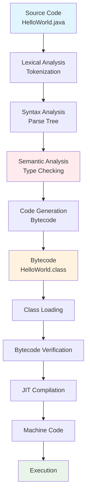

# Java Program Structure and Comments
## Lecture 3

**Java Programming (4343203)**  
Diploma in ICT - Semester IV  
Gujarat Technological University

<div class="pt-12">
  <span @click="$slidev.nav.next" class="px-2 py-1 rounded cursor-pointer" hover="bg-white bg-opacity-10">
    Press Space for next page <carbon:arrow-right class="inline"/>
  </span>
</div>

---
layout: default
---

# Learning Objectives

By the end of this lecture, you will be able to:

<v-clicks>

- 📐 **Understand** the basic structure of Java programs
- 📝 **Identify** different types of comments in Java
- 🏗️ **Explain** the compilation and execution process
- 📋 **Apply** Java coding conventions and best practices
- 🔧 **Write** well-structured and documented Java programs
- 🎯 **Debug** simple Java programs effectively

</v-clicks>

<br>

<div v-click="7" class="text-center text-2xl text-blue-600 font-bold">
Let's master Java program structure! 📐
</div>

---
layout: center
---

# Basic Java Program Structure

```java {all|1-2|4|6|8-10|12|all}
// Package declaration (optional)
package com.example;

import java.util.Scanner;  // Import statements (optional)

public class MyProgram {   // Class declaration (mandatory)
    
    // Instance variables (optional)
    private String message = "Hello World";
    
    public static void main(String[] args) {  // Main method (mandatory)
        // Method body - program logic
        System.out.println("Hello, Java!");
    }
    
    // Other methods (optional)
    public void displayMessage() {
        System.out.println(message);
    }
}
```

<div class="mt-6 text-center bg-blue-50 p-4 rounded-lg">
<strong>💡 Remember:</strong> Every Java application must have a main() method!
</div>

---
layout: default
---

# Program Structure Components

<div class="grid grid-cols-2 gap-8">

<div>

## 📦 Required Components

<v-clicks>

- **Class Declaration**
  - Must match filename
  - Contains all code
  - Uses `public class` keyword

- **Main Method**
  - Entry point of program
  - Must be `public static void`
  - Takes `String[] args` parameter

</v-clicks>

</div>

<div>

## 🔧 Optional Components

<v-clicks>

- **Package Declaration**
  - Organizes related classes
  - Must be first line (if used)

- **Import Statements**
  - Brings in external classes
  - Reduces fully qualified names

- **Instance Variables**
  - Store object state
  - Defined inside class

- **Methods**
  - Define object behavior
  - Can be called from main

</v-clicks>

</div>

</div>

---
layout: default
---

# Detailed Structure Breakdown

```java
// 1. Package declaration (optional - must be first)
package com.company.project;

// 2. Import statements (optional - after package)
import java.util.Scanner;
import java.util.ArrayList;

// 3. Class declaration (mandatory)
public class Student {
    
    // 4. Class variables/fields (optional)
    private String name;
    private int age;
    private static int totalStudents = 0;
    
    // 5. Constructors (optional)
    public Student(String name, int age) {
        this.name = name;
        this.age = age;
        totalStudents++;
    }
    
    // 6. Main method (mandatory for executable classes)
    public static void main(String[] args) {
        Student student = new Student("John", 20);
        student.displayInfo();
    }
    
    // 7. Other methods (optional)
    public void displayInfo() {
        System.out.println("Name: " + name + ", Age: " + age);
    }
}
```

---
layout: center
---

# Types of Comments in Java

<div class="grid grid-cols-3 gap-6 mt-8">

<div class="bg-blue-50 p-6 rounded-lg">
<h3 class="font-bold text-lg mb-4">💬 Single-Line</h3>
<pre><code class="language-java">// This is a single-line comment
int age = 20; // Age of student</code></pre>
<p class="text-sm mt-2">Used for brief explanations</p>
</div>

<div class="bg-green-50 p-6 rounded-lg">
<h3 class="font-bold text-lg mb-4">📝 Multi-Line</h3>
<pre><code class="language-java">/* This is a
   multi-line comment
   spanning multiple lines */</code></pre>
<p class="text-sm mt-2">Used for longer explanations</p>
</div>

<div class="bg-yellow-50 p-6 rounded-lg">
<h3 class="font-bold text-lg mb-4">📚 Documentation</h3>
<pre><code class="language-java">/**
 * This method calculates area
 * @param radius circle radius
 * @return area of circle
 */</code></pre>
<p class="text-sm mt-2">Used for API documentation</p>
</div>

</div>

---
layout: default
---

# Comment Examples and Best Practices

```java {all|1-3|5-9|11-16|18-20|22-25|all}
// Good: Explains why, not what
// Calculate compound interest for loan processing
double interest = principal * rate * time;

/* 
 * Bad example - obvious comment
 * This adds 1 to count
 */
count++; // Don't do this!

/**
 * Calculates the monthly payment for a loan
 * @param principal The loan amount in rupees
 * @param rate Annual interest rate (as decimal)
 * @param years Loan term in years
 * @return Monthly payment amount
 */
public double calculateMonthlyPayment(double principal, double rate, int years) {
    // Convert annual rate to monthly and years to months
    double monthlyRate = rate / 12;
    int totalMonths = years * 12;
    
    // Apply loan payment formula
    return principal * (monthlyRate * Math.pow(1 + monthlyRate, totalMonths)) 
                    / (Math.pow(1 + monthlyRate, totalMonths) - 1);
}
```

<div class="mt-4 p-4 bg-blue-50 rounded-lg">
<strong>💡 Best Practice:</strong> Comments should explain "why" and "how", not "what"!
</div>

---
layout: default
---

# Documentation Comments (Javadoc)

## 📚 Javadoc Tags

<div class="grid grid-cols-2 gap-6">

<div>

### Common Tags
- `@author` - Author name
- `@version` - Version information
- `@param` - Parameter description
- `@return` - Return value description
- `@throws` - Exception description
- `@since` - Version when added
- `@see` - Reference to other elements

</div>

<div>

### Example Usage
```java
/**
 * Student management class for college system
 * 
 * @author John Doe
 * @version 1.0
 * @since 2024
 */
public class Student {
    
    /**
     * Calculates GPA based on marks
     * @param marks Array of subject marks
     * @return GPA value between 0.0 and 4.0
     * @throws IllegalArgumentException if marks invalid
     * @see #calculatePercentage(int[])
     */
    public double calculateGPA(int[] marks) {
        // Implementation here
        return 0.0;
    }
}
```

</div>

</div>

---
layout: default
---

# Generating Javadoc

## 🔧 Command Line Generation

```bash
# Generate documentation for single file
javadoc Student.java

# Generate for multiple files
javadoc *.java

# Generate with specific options
javadoc -d docs -author -version *.java

# Generate with classpath
javadoc -cp "lib/*" -d docs src/*.java

# Generate with custom window title
javadoc -windowtitle "College Management System" *.java

# Generate with package documentation
javadoc -d docs -sourcepath src -subpackages com.college
```

## 📊 Generated Documentation

<div class="bg-gray-50 p-4 rounded-lg mt-4">

```
docs/
├── index.html          # Main documentation page
├── Student.html        # Class documentation
├── package-summary.html # Package overview
├── allclasses.html     # All classes list
├── constant-values.html # Constants documentation
├── deprecated-list.html # Deprecated elements
├── help-doc.html       # Help documentation
├── index-all.html      # Complete index
└── stylesheet.css      # Styling
```

</div>

## 🛠️ IDE Integration

<div class="grid grid-cols-2 gap-6">

<div>

**IntelliJ IDEA:**
- Tools → Generate JavaDoc
- Configure output directory
- Select scope (whole project/module)
- Include private members option

**Eclipse:**
- Project → Generate Javadoc
- Select Javadoc command
- Configure destination
- Choose visibility level

</div>

<div>

**VS Code:**
- Java Extension Pack
- Command Palette: "Java: Generate Javadoc"
- Automatic Javadoc comment generation
- Preview in browser

**NetBeans:**
- Build → Generate Javadoc
- Automatic project documentation
- Integrated preview pane

</div>

</div>

<div class="mt-4 p-4 bg-green-50 rounded-lg">
<strong>🎯 Professional Tip:</strong> Always document public methods and classes for team collaboration!
</div>

---
layout: default
---

# Advanced Javadoc Features

## 🔗 Linking and Cross-References

```java
/**
 * Student class for managing student information
 * 
 * @author John Doe
 * @version 1.2
 * @since 1.0
 * @see College
 * @see #calculateGPA(int[])
 */
public class Student {
    
    /**
     * Calculates GPA from marks array
     * 
     * @param marks Array of marks for different subjects
     * @return GPA value between 0.0 and 4.0
     * @throws IllegalArgumentException if marks array is null or empty
     * @throws ArithmeticException if marks contain invalid values
     * @see #calculatePercentage(int[])
     * @see <a href="https://www.gtu.ac.in">GTU Official Site</a>
     * @since 1.1
     */
    public double calculateGPA(int[] marks) {
        if (marks == null || marks.length == 0) {
            throw new IllegalArgumentException("Marks array cannot be null or empty");
        }
        
        int total = 0;
        for (int mark : marks) {
            if (mark < 0 || mark > 100) {
                throw new ArithmeticException("Invalid mark: " + mark);
            }
            total += mark;
        }
        
        double percentage = total / (double) marks.length;
        return convertPercentageToGPA(percentage);
    }
    
    /**
     * Converts percentage to GPA scale
     * 
     * @param percentage The percentage value
     * @return Corresponding GPA value
     */
    private double convertPercentageToGPA(double percentage) {
        if (percentage >= 90) return 4.0;
        if (percentage >= 80) return 3.0;
        if (percentage >= 70) return 2.0;
        if (percentage >= 60) return 1.0;
        return 0.0;
    }
}
```

## 📝 Custom Tags and HTML

```java
/**
 * <h2>Library Management System</h2>
 * <p>This class handles all book-related operations including:</p>
 * <ul>
 *   <li>Book registration and cataloging</li>
 *   <li>Search and retrieval operations</li>
 *   <li>Inventory management</li>
 * </ul>
 * 
 * <h3>Usage Example:</h3>
 * <pre>
 * {@code
 * Book book = new Book("Java Programming", "James Gosling");
 * book.setISBN("978-0134685991");
 * book.setAvailable(true);
 * }
 * </pre>
 * 
 * @custom.database MySQL 8.0 compatible
 * @custom.tested Unit tests with 95% coverage
 * @implNote This implementation uses ArrayList for storage
 * @apiNote This class is thread-safe for read operations only
 */
public class Book {
    // Implementation details
}
```

---
layout: default
---

# Java Coding Conventions

<div class="grid grid-cols-2 gap-8">

<div>

## 📝 Naming Conventions

**Classes:**
```java
public class StudentRecord { }     // ✅ PascalCase
public class student_record { }    // ❌ Wrong
```

**Methods & Variables:**
```java
int studentAge;                    // ✅ camelCase
void calculateGPA() { }           // ✅ camelCase
int Student_Age;                  // ❌ Wrong
```

**Constants:**
```java
public static final int MAX_SIZE = 100;  // ✅ UPPER_CASE
public static final int maxSize = 100;   // ❌ Wrong
```

</div>

<div>

## 🏗️ Structure Conventions

**Indentation:**
```java
public class Example {
    public static void main(String[] args) {  // 4 spaces
        if (condition) {                      // 4 spaces
            System.out.println("Hello");     // 4 spaces
        }
    }
}
```

**Braces:**
```java
// ✅ Correct (K&R style)
if (condition) {
    statement;
}

// ❌ Avoid (Allman style)
if (condition) 
{
    statement;
}
```

</div>

</div>

---
layout: default
---

# File Organization Standards

```java
/*
 * Copyright (c) 2024 Government Polytechnic
 * All rights reserved.
 */

package edu.gpp.students;                    // 1. Package declaration

import java.util.Scanner;                    // 2. Standard library imports
import java.util.ArrayList;

import edu.gpp.common.Utils;                 // 3. Third-party imports

/**                                          // 4. Class documentation
 * Student management system
 * 
 * @author Your Name
 * @version 1.0
 */
public class StudentManager {                // 5. Class declaration
    
    // Class constants
    private static final int MAX_STUDENTS = 100;
    
    // Instance variables
    private String instituteName;
    private ArrayList<String> students;
    
    // Constructors
    public StudentManager(String instituteName) {
        this.instituteName = instituteName;
        this.students = new ArrayList<>();
    }
    
    // Main method
    public static void main(String[] args) {
        // Implementation
    }
    
    // Other methods (alphabetically ordered)
    public void addStudent(String name) { }
    public void removeStudent(String name) { }
}
```

---
layout: default
---

# Compilation Process Deep Dive

<div class="flex justify-center">



</div>

<div class="mt-6 grid grid-cols-2 gap-4">
<div class="bg-blue-50 p-3 rounded">
<strong>Compile Time:</strong> Source → Bytecode
</div>
<div class="bg-green-50 p-3 rounded">
<strong>Runtime:</strong> Bytecode → Machine Code
</div>
</div>

---
layout: default
---

# Common Compilation Errors

<div class="space-y-4">

<div class="bg-red-50 p-4 rounded-lg">
<h4 class="font-bold text-red-700">❌ Syntax Errors</h4>
```java
public class Test {
    public static void main(String[] args) {
        System.out.println("Hello World")  // Missing semicolon
    }  // Missing closing brace
```
</div>

<div class="bg-orange-50 p-4 rounded-lg">
<h4 class="font-bold text-orange-700">❌ Class Name Mismatch</h4>
```java
// File: HelloWorld.java
public class Hello {  // Should be HelloWorld
    // ...
}
```
</div>

<div class="bg-yellow-50 p-4 rounded-lg">
<h4 class="font-bold text-yellow-700">❌ Access Modifier Errors</h4>
```java
class Test {
    static void main(String[] args) {  // Should be public
        // ...
    }
}
```
</div>

</div>

---
layout: default
---

# Execution Process Details

## 🚀 Runtime Steps

<v-clicks>

1. **Class Loading**
   - JVM loads .class files
   - Bootstrap, Extension, System classloaders

2. **Linking**
   - Verification: Bytecode security check
   - Preparation: Static variable memory allocation
   - Resolution: Symbolic references to direct references

3. **Initialization**
   - Static variables initialized
   - Static blocks executed

4. **Execution**
   - main() method called
   - JIT compilation for performance

</v-clicks>

<div v-click="5" class="mt-6 p-4 bg-blue-50 rounded-lg">
<strong>🔍 Memory Management:</strong> JVM automatically handles memory allocation and garbage collection during execution.
</div>

---
layout: default
---

# IDE vs Text Editor

<div class="grid grid-cols-2 gap-8">

<div>

## 📝 Text Editor Approach

**Advantages:**
- Understand compilation process
- Lightweight and fast
- No complex setup
- Direct control

**Tools:**
- Notepad++ (Windows)
- VS Code (Cross-platform)
- Sublime Text
- Vim/Emacs

**Workflow:**
```bash
# Write code
notepad HelloWorld.java

# Compile
javac HelloWorld.java

# Run
java HelloWorld
```

</div>

<div>

## 💻 IDE Approach

**Advantages:**
- Syntax highlighting
- Auto-completion
- Error detection
- Integrated debugging
- Project management

**Popular IDEs:**
- IntelliJ IDEA
- Eclipse
- NetBeans
- VS Code with Java extensions

**Features:**
- Build automation
- Version control integration
- Code refactoring
- Unit testing support

</div>

</div>

---
layout: default
---

# Package Declarations Deep Dive

## 📦 Understanding Java Packages

<div class="grid grid-cols-2 gap-8">

<div>

## 📋 Package Structure

```java
// Package declaration (must be first non-comment line)
package edu.gtu.ict.students;

import java.util.ArrayList;
import java.util.Scanner;
import java.time.LocalDate;

/**
 * Student management for ICT department
 */
public class StudentManager {
    public static void main(String[] args) {
        System.out.println("GTU ICT Student Manager");
    }
}
```

## 🗂️ Directory Structure

```
src/
└── edu/
    └── gtu/
        └── ict/
            └── students/
                ├── StudentManager.java
                ├── Student.java
                └── Course.java
```

</div>

<div>

## 🎯 Package Benefits

<v-clicks>

- **Organization**: Logical grouping of classes
- **Namespace**: Avoid name conflicts
- **Access Control**: Package-private visibility
- **Distribution**: JAR file organization

</v-clicks>

<div v-click="5">

## 📝 Package Naming Convention

```java
// Company domain reversed
package com.company.project.module;

// Educational institution
package edu.institution.department.project;

// Government organization
package gov.agency.department.system;

// Open source project
package org.projectname.module.submodule;
```

</div>

</div>

</div>

---
layout: default
---

# Command Line Arguments Mastery

## 🔧 Understanding args Parameter

```java
public class CommandLineDemo {
    public static void main(String[] args) {
        System.out.println("Number of arguments: " + args.length);
        
        // Display all arguments
        for (int i = 0; i < args.length; i++) {
            System.out.println("Argument " + i + ": " + args[i]);
        }
        
        // Enhanced for loop
        for (String arg : args) {
            System.out.println("Argument: " + arg);
        }
    }
}
```

## 💻 Compilation and Execution

```bash
# Compile the program
javac CommandLineDemo.java

# Run with arguments
java CommandLineDemo Hello World 123

# Output:
# Number of arguments: 3
# Argument 0: Hello
# Argument 1: World
# Argument 2: 123
```

## 🎯 Practical Applications

<div class="grid grid-cols-2 gap-6">

<div>

**File Processing:**
```java
public class FileProcessor {
    public static void main(String[] args) {
        if (args.length < 2) {
            System.err.println("Usage: java FileProcessor <input> <output>");
            System.exit(1);
        }
        
        String inputFile = args[0];
        String outputFile = args[1];
        
        System.out.println("Processing " + inputFile);
        System.out.println("Output to " + outputFile);
    }
}
```

</div>

<div>

**Calculator Application:**
```java
public class Calculator {
    public static void main(String[] args) {
        if (args.length != 3) {
            System.err.println("Usage: java Calculator <num1> <op> <num2>");
            return;
        }
        
        try {
            double num1 = Double.parseDouble(args[0]);
            String operator = args[1];
            double num2 = Double.parseDouble(args[2]);
            
            double result = switch (operator) {
                case "+" -> num1 + num2;
                case "-" -> num1 - num2;
                case "*" -> num1 * num2;
                case "/" -> num1 / num2;
                default -> {
                    System.err.println("Invalid operator: " + operator);
                    yield 0;
                }
            };
            
            System.out.println("Result: " + result);
            
        } catch (NumberFormatException e) {
            System.err.println("Invalid number format");
        }
    }
}
```

</div>

</div>

---
layout: default
---

# Main Method Variations

## 🔄 Different Main Method Signatures

```java
// Standard main method (most common)
public static void main(String[] args) {
    // Program logic
}

// Alternative valid signatures
public static void main(String args[]) {
    // C-style array declaration
}

public static void main(String... args) {
    // Variable arguments (varargs)
}

// All modifiers are interchangeable
static public void main(String[] args) {
    // Order doesn't matter
}

final public static void main(String[] args) {
    // Can add final modifier
}

public static synchronized void main(String[] args) {
    // Can add synchronized modifier
}
```

## ⚠️ Invalid Main Method Signatures

```java
// ❌ Wrong return type
public static int main(String[] args) { }

// ❌ Wrong parameter type
public static void main(int[] args) { }

// ❌ Missing static
public void main(String[] args) { }

// ❌ Missing public
static void main(String[] args) { }

// ❌ Wrong parameter count
public static void main() { }
```

## 🎯 Main Method Best Practices

<div class="bg-blue-50 p-4 rounded-lg">

```java
/**
 * College Management System Entry Point
 * 
 * @author GTU ICT Student
 * @version 1.0
 * @since 2024
 */
public class CollegeSystem {
    
    /**
     * Application entry point
     * 
     * @param args Command line arguments
     *             args[0] - operation mode (student/faculty/admin)
     *             args[1] - configuration file path (optional)
     */
    public static void main(String[] args) {
        // Validate arguments
        if (args.length == 0) {
            displayUsage();
            return;
        }
        
        // Initialize application
        try {
            initializeSystem();
            processArguments(args);
        } catch (Exception e) {
            System.err.println("Error: " + e.getMessage());
            e.printStackTrace();
        }
    }
    
    private static void displayUsage() {
        System.out.println("Usage: java CollegeSystem <mode> [config-file]");
        System.out.println("Modes: student, faculty, admin");
    }
    
    private static void initializeSystem() {
        System.out.println("Initializing College Management System...");
        // System initialization logic
    }
    
    private static void processArguments(String[] args) {
        String mode = args[0].toLowerCase();
        
        switch (mode) {
            case "student" -> launchStudentInterface();
            case "faculty" -> launchFacultyInterface();
            case "admin" -> launchAdminInterface();
            default -> {
                System.err.println("Invalid mode: " + mode);
                displayUsage();
            }
        }
    }
    
    private static void launchStudentInterface() {
        System.out.println("Launching Student Interface...");
    }
    
    private static void launchFacultyInterface() {
        System.out.println("Launching Faculty Interface...");
    }
    
    private static void launchAdminInterface() {
        System.out.println("Launching Admin Interface...");
    }
}
```

</div>

---
layout: default
---

# Import Statements and CLASSPATH

## 📚 Import Statement Types

<div class="grid grid-cols-2 gap-8">

<div>

## 🔍 Import Categories

**Single Type Import:**
```java
import java.util.Scanner;
import java.util.ArrayList;
import java.time.LocalDate;
```

**On-Demand Import:**
```java
import java.util.*;  // All classes in util package
import java.io.*;    // All classes in io package
```

**Static Import:**
```java
import static java.lang.Math.PI;
import static java.lang.Math.sqrt;
import static java.lang.System.out;

// Now can use directly
double area = PI * radius * radius;
double hypotenuse = sqrt(a*a + b*b);
out.println("Result: " + result);
```

</div>

<div>

## ⚡ Import Best Practices

<v-clicks>

- **Prefer specific imports** over wildcard
- **Avoid unused imports** (IDE warnings)
- **Group related imports** logically
- **Use static imports** sparingly

</v-clicks>

<div v-click="5">

**Well-Organized Imports:**
```java
package edu.gtu.ict.students;

// Standard library imports
import java.io.FileInputStream;
import java.io.IOException;
import java.util.ArrayList;
import java.util.Collections;
import java.util.List;
import java.util.Scanner;

// Third-party library imports
import org.apache.commons.lang3.StringUtils;

// Static imports (if needed)
import static java.lang.Math.PI;
import static java.lang.System.out;

public class ImportExample {
    // Class implementation
}
```

</div>

</div>

</div>

## 🛤️ Understanding CLASSPATH

```bash
# Set classpath for compilation
javac -cp "lib/commons-lang3-3.12.jar:." StudentManager.java

# Set classpath for execution
java -cp "lib/commons-lang3-3.12.jar:." StudentManager

# Using environment variable (Windows)
set CLASSPATH=lib\commons-lang3-3.12.jar;.
javac StudentManager.java
java StudentManager

# Using environment variable (Linux/Mac)
export CLASSPATH=lib/commons-lang3-3.12.jar:.
javac StudentManager.java
java StudentManager
```

---
layout: default
---

# Troubleshooting Common Issues

<div class="space-y-6">

<div class="bg-red-50 p-6 rounded-lg">
<h3 class="font-bold text-red-700 text-xl mb-4">❌ Class Name Mismatch Error</h3>

**Error Message:**
```
error: class HelloWorld is public, should be declared in a file named HelloWorld.java
```

**Problem:**
```java
// File: Welcome.java
public class HelloWorld {  // ❌ Class name doesn't match filename
    public static void main(String[] args) {
        System.out.println("Hello World!");
    }
}
```

**Solutions:**
1. Rename file to match class: `HelloWorld.java`
2. Or rename class to match file: `public class Welcome`
3. Or remove `public` modifier: `class HelloWorld`

</div>

<div class="bg-orange-50 p-6 rounded-lg">
<h3 class="font-bold text-orange-700 text-xl mb-4">❌ Package Declaration Issues</h3>

**Error Message:**
```
error: package edu.gtu.ict does not exist
```

**Problem & Solution:**
```java
// ❌ Wrong: File in wrong directory
package edu.gtu.ict;  // But file is in root directory

// ✅ Correct: Create proper directory structure
src/
└── edu/
    └── gtu/
        └── ict/
            └── Student.java
```

**Compilation:**
```bash
# Compile from src directory
javac edu/gtu/ict/Student.java

# Or use -d option
javac -d . edu/gtu/ict/Student.java
```

</div>

<div class="bg-yellow-50 p-6 rounded-lg">
<h3 class="font-bold text-yellow-700 text-xl mb-4">❌ Main Method Not Found</h3>

**Error Message:**
```
Error: Main method not found in class Test
```

**Common Problems:**
```java
// ❌ Wrong signature variations
public void main(String[] args) { }        // Missing static
static void main(String[] args) { }        // Missing public
public static void main(String args) { }   // Wrong parameter type
public static int main(String[] args) { }  // Wrong return type

// ✅ Correct signature
public static void main(String[] args) {
    System.out.println("This works!");
}
```

</div>

<div class="bg-blue-50 p-6 rounded-lg">
<h3 class="font-bold text-blue-700 text-xl mb-4">❌ Import and CLASSPATH Issues</h3>

**Error Message:**
```
error: package com.external does not exist
```

**Diagnosis Steps:**
1. Check if library JAR exists
2. Verify CLASSPATH includes the JAR
3. Confirm package name spelling
4. Ensure JAR contains the package

**Solution Example:**
```bash
# List contents of JAR file
jar -tf external-lib.jar

# Compile with explicit classpath
javac -cp "external-lib.jar:." MyClass.java

# Run with explicit classpath
java -cp "external-lib.jar:." MyClass
```

</div>

</div>

---
layout: default
---

# Code Quality and Best Practices

## 🎯 Professional Java Coding Standards

<div class="grid grid-cols-2 gap-8">

<div>

## 📏 Code Formatting Standards

```java
/**
 * Professional formatting example following Oracle/Google style
 */
public class ProfessionalExample {
    
    // Constants: ALL_CAPS with underscores
    private static final int MAX_STUDENT_COUNT = 50;
    private static final String DEFAULT_GRADE = "PENDING";
    
    // Instance variables: camelCase
    private String studentName;
    private int studentId;
    private List<Course> enrolledCourses;
    
    // Constructor: proper spacing and parameter alignment
    public ProfessionalExample(String studentName, 
                              int studentId,
                              List<Course> courses) {
        this.studentName = Objects.requireNonNull(studentName, 
            "Student name cannot be null");
        this.studentId = studentId;
        this.enrolledCourses = new ArrayList<>(courses);
    }
    
    // Methods: camelCase with descriptive names
    public void enrollInCourse(Course course) {
        if (course == null) {
            throw new IllegalArgumentException("Course cannot be null");
        }
        
        if (enrolledCourses.size() >= MAX_STUDENT_COUNT) {
            throw new IllegalStateException(
                "Maximum course enrollment reached");
        }
        
        enrolledCourses.add(course);
    }
    
    // Getter with proper documentation
    /**
     * Returns the student's enrolled courses
     * 
     * @return immutable list of enrolled courses
     */
    public List<Course> getEnrolledCourses() {
        return Collections.unmodifiableList(enrolledCourses);
    }
}
```

</div>

<div>

## 🛡️ Defensive Programming Practices

```java
public class DefensiveCoding {
    
    /**
     * Calculate average with proper error handling
     */
    public static double calculateAverage(int[] marks) {
        // Input validation
        if (marks == null) {
            throw new IllegalArgumentException("Marks array cannot be null");
        }
        
        if (marks.length == 0) {
            throw new IllegalArgumentException("Marks array cannot be empty");
        }
        
        // Check for valid range
        for (int i = 0; i < marks.length; i++) {
            if (marks[i] < 0 || marks[i] > 100) {
                throw new IllegalArgumentException(
                    String.format("Invalid mark at index %d: %d", i, marks[i]));
            }
        }
        
        // Safe calculation
        long sum = 0;  // Use long to prevent overflow
        for (int mark : marks) {
            sum += mark;
        }
        
        return (double) sum / marks.length;
    }
    
    /**
     * Safe string operations
     */
    public static String formatStudentName(String firstName, String lastName) {
        // Null safety
        String safeFirst = (firstName != null) ? firstName.trim() : "";
        String safeLast = (lastName != null) ? lastName.trim() : "";
        
        // Empty check
        if (safeFirst.isEmpty() && safeLast.isEmpty()) {
            return "Unknown Student";
        }
        
        // Format properly
        return String.format("%s %s", 
            capitalizeFirst(safeFirst), 
            capitalizeFirst(safeLast)).trim();
    }
    
    private static String capitalizeFirst(String str) {
        if (str == null || str.isEmpty()) {
            return str;
        }
        return str.substring(0, 1).toUpperCase() + 
               str.substring(1).toLowerCase();
    }
}
```

</div>

</div>

## 📝 Documentation Standards

```java
/**
 * GTU Student Management System
 * 
 * <p>This class provides comprehensive student management functionality
 * including enrollment, grade tracking, and academic progress monitoring.</p>
 * 
 * <p><strong>Usage Example:</strong></p>
 * <pre>{@code
 * StudentManager manager = new StudentManager("ICT Department");
 * Student student = new Student("John Doe", "ICT001");
 * manager.enrollStudent(student);
 * 
 * Grade grade = new Grade("Java Programming", 85);
 * manager.addGrade(student.getId(), grade);
 * }</pre>
 * 
 * @author GTU ICT Department
 * @version 2.0
 * @since 1.0
 * @see Student
 * @see Grade
 * @see Course
 */
public class StudentManager {
    // Implementation with proper documentation for each method
}
```

---
layout: default
---

# Practical Exercise

## 🛠️ Comprehensive Hands-On Activities

<div class="space-y-4">

<div class="bg-yellow-50 p-4 rounded-lg">
<strong>Task 1:</strong> Create a complete package structure for a College Management System with proper comments and documentation
</div>

<div class="bg-blue-50 p-4 rounded-lg">
<strong>Task 2:</strong> Build a command-line calculator that accepts arguments and handles errors gracefully
</div>

<div class="bg-green-50 p-4 rounded-lg">
<strong>Task 3:</strong> Write a Student class with comprehensive Javadoc and generate professional documentation
</div>

<div class="bg-purple-50 p-4 rounded-lg">
<strong>Task 4:</strong> Create a troubleshooting guide by deliberately introducing and fixing common errors
</div>

<div class="bg-cyan-50 p-4 rounded-lg">
<strong>Task 5:</strong> Implement a file processing application with proper package structure and command-line interface
</div>

</div>

## 📝 Complete Project Template

```java
/**
 * GTU College Management System
 * 
 * A comprehensive system for managing college operations including
 * student enrollment, faculty management, and course scheduling.
 * 
 * @author [Your Name]
 * @version 1.0
 * @since 2024
 */
package edu.gtu.ict.college;

import java.util.ArrayList;
import java.util.List;
import java.util.Scanner;
import java.time.LocalDate;
import java.time.format.DateTimeFormatter;

/**
 * Main application class for the College Management System
 * 
 * <p>This class serves as the entry point for the application and handles
 * command-line argument processing, user interface initialization, and
 * system configuration.</p>
 * 
 * <h2>Command Line Usage:</h2>
 * <pre>
 * java CollegeManager [mode] [options]
 * 
 * Modes:
 *   student  - Launch student interface
 *   faculty  - Launch faculty interface  
 *   admin    - Launch administrative interface
 * 
 * Options:
 *   --config [file]  - Specify configuration file
 *   --debug          - Enable debug mode
 *   --help           - Display help information
 * </pre>
 * 
 * @implNote This implementation uses console-based interface
 * @apiNote All operations are logged for audit purposes
 */
public class CollegeManager {
    
    // Class constants
    private static final String VERSION = "1.0.0";
    private static final String COPYRIGHT = "© 2024 GTU ICT Department";
    private static final int MAX_RETRY_ATTEMPTS = 3;
    
    // Instance variables
    private boolean debugMode = false;
    private String configFile = "college.config";
    private Scanner scanner;
    
    /**
     * Application entry point
     * 
     * @param args Command line arguments
     *        <ul>
     *        <li>args[0] - Operation mode (student/faculty/admin)</li>
     *        <li>args[1..n] - Additional options and parameters</li>
     *        </ul>
     */
    public static void main(String[] args) {
        // Display application header
        displayHeader();
        
        try {
            CollegeManager manager = new CollegeManager();
            manager.processCommandLineArguments(args);
            manager.initializeSystem();
            manager.runApplication();
            
        } catch (Exception e) {
            System.err.println("Fatal error: " + e.getMessage());
            if (args.length > 0 && "--debug".equals(args[args.length - 1])) {
                e.printStackTrace();
            }
            System.exit(1);
        }
    }
    
    /**
     * Display application header with version information
     */
    private static void displayHeader() {
        System.out.println("╔════════════════════════════════════════╗");
        System.out.println("║       GTU College Management System   ║");
        System.out.println("║              Version " + VERSION + "             ║");
        System.out.println("║        " + COPYRIGHT + "        ║");
        System.out.println("╚════════════════════════════════════════╝");
        System.out.println();
    }
    
    /**
     * Process and validate command line arguments
     * 
     * @param args Command line arguments array
     * @throws IllegalArgumentException if arguments are invalid
     */
    private void processCommandLineArguments(String[] args) {
        if (args.length == 0) {
            displayUsageAndExit();
        }
        
        for (int i = 0; i < args.length; i++) {
            switch (args[i].toLowerCase()) {
                case "--help":
                    displayHelpAndExit();
                    break;
                case "--debug":
                    debugMode = true;
                    System.out.println("Debug mode enabled");
                    break;
                case "--config":
                    if (i + 1 < args.length) {
                        configFile = args[++i];
                        System.out.println("Using config file: " + configFile);
                    } else {
                        throw new IllegalArgumentException("Config file path required after --config");
                    }
                    break;
                case "student":
                case "faculty":
                case "admin":
                    // Valid modes - will be processed later
                    break;
                default:
                    if (args[i].startsWith("--")) {
                        System.err.println("Warning: Unknown option " + args[i]);
                    }
            }
        }
    }
    
    /**
     * Initialize system resources and configuration
     * 
     * @throws Exception if initialization fails
     */
    private void initializeSystem() throws Exception {
        System.out.print("Initializing system");
        
        // Simulate initialization process
        for (int i = 0; i < 5; i++) {
            Thread.sleep(300);
            System.out.print(".");
        }
        System.out.println(" Complete!");
        
        scanner = new Scanner(System.in);
        
        if (debugMode) {
            System.out.println("System initialized successfully");
            System.out.println("Config file: " + configFile);
            System.out.println("Debug mode: " + debugMode);
        }
    }
    
    /**
     * Main application loop
     */
    private void runApplication() {
        System.out.println("\nWelcome to GTU College Management System");
        System.out.println("Current date: " + LocalDate.now().format(DateTimeFormatter.ofPattern("dd/MM/yyyy")));
        System.out.println("\nSelect an option:");
        System.out.println("1. Student Management");
        System.out.println("2. Faculty Management");
        System.out.println("3. Course Management");
        System.out.println("4. Reports");
        System.out.println("5. Exit");
        
        // Implementation of main menu loop would go here
        System.out.println("\n[Application interface would continue here...]");
        
        if (scanner != null) {
            scanner.close();
        }
    }
    
    /**
     * Display usage information and exit
     */
    private static void displayUsageAndExit() {
        System.out.println("Usage: java CollegeManager [mode] [options]");
        System.out.println("\nModes:");
        System.out.println("  student  - Launch student interface");
        System.out.println("  faculty  - Launch faculty interface");
        System.out.println("  admin    - Launch administrative interface");
        System.out.println("\nOptions:");
        System.out.println("  --config [file]  - Specify configuration file");
        System.out.println("  --debug          - Enable debug mode");
        System.out.println("  --help           - Display this help information");
        System.exit(0);
    }
    
    /**
     * Display detailed help information and exit
     */
    private static void displayHelpAndExit() {
        System.out.println("GTU College Management System Help");
        System.out.println("==================================");
        System.out.println();
        System.out.println("This system provides comprehensive college management");
        System.out.println("functionality including student enrollment, faculty");
        System.out.println("management, course scheduling, and reporting.");
        System.out.println();
        displayUsageAndExit();
    }
}
```

---
layout: default
---

# Debugging Tips

<div class="grid grid-cols-2 gap-8">

<div>

## 🔍 Common Issues

**Compilation Problems:**
- Check file name vs class name
- Verify proper syntax
- Look for missing semicolons
- Check brace matching

**Runtime Problems:**
- Ensure main method signature is correct
- Check classpath issues
- Verify input/output operations

</div>

<div>

## 🛠️ Debugging Strategies

**Step-by-Step Approach:**
1. Read error messages carefully
2. Identify line numbers
3. Check syntax at error location
4. Use print statements for debugging
5. Comment out problematic code

**Tools:**
- IDE debugger
- System.out.println() statements
- Stack trace analysis
- Code review with peers

</div>

</div>

<div class="mt-6 p-4 bg-blue-50 rounded-lg">
<strong>💡 Pro Tip:</strong> Always read error messages completely - they often tell you exactly what's wrong!
</div>

---
layout: center
class: text-center
---

# Best Practices Summary

<div class="grid grid-cols-2 gap-8 mt-8">

<div class="bg-blue-50 p-6 rounded-lg">
<h3 class="font-bold text-lg mb-4">📖 Code Quality</h3>
<ul class="text-left space-y-2">
<li>• Use meaningful variable names</li>
<li>• Write clear comments</li>
<li>• Follow naming conventions</li>
<li>• Maintain consistent indentation</li>
<li>• Keep methods short and focused</li>
</ul>
</div>

<div class="bg-green-50 p-6 rounded-lg">
<h3 class="font-bold text-lg mb-4">🎯 Documentation</h3>
<ul class="text-left space-y-2">
<li>• Document all public methods</li>
<li>• Use Javadoc for API documentation</li>
<li>• Explain complex algorithms</li>
<li>• Include examples in comments</li>
<li>• Update comments with code changes</li>
</ul>
</div>

</div>

<div class="mt-8 text-2xl font-bold text-purple-600">
Well-structured code is maintainable code! 🏗️
</div>

---
layout: center
class: text-center
---

# Summary

<div class="grid grid-cols-2 gap-8 mt-8">

<div class="bg-blue-50 p-6 rounded-lg">
<h3 class="font-bold text-lg mb-4">📖 What We Learned</h3>
<ul class="text-left space-y-2">
<li>• Java program structure components</li>
<li>• Three types of comments</li>
<li>• Compilation and execution process</li>
<li>• Coding conventions and best practices</li>
<li>• Debugging strategies</li>
</ul>
</div>

<div class="bg-green-50 p-6 rounded-lg">
<h3 class="font-bold text-lg mb-4">🎯 Next Steps</h3>
<ul class="text-left space-y-2">
<li>• Learn about data types</li>
<li>• Understand variables and constants</li>
<li>• Practice with different data types</li>
<li>• Explore type conversion</li>
<li>• Work with arrays</li>
</ul>
</div>

</div>

<div class="mt-8 text-2xl font-bold text-purple-600">
You're building solid Java foundations! 🏗️
</div>

---
layout: center
class: text-center
---

# Questions & Discussion

<div class="text-6xl mb-8">❓</div>

<div class="text-xl mb-8">
Any questions about Java program structure, comments, or coding conventions?
</div>

<div class="text-lg text-gray-600">
Next lecture: **Data Types and Variables**
</div>

<div class="mt-8">
<span class="px-4 py-2 bg-blue-500 text-white rounded-lg">
Ready to dive into Java data types! 👏
</span>
</div>