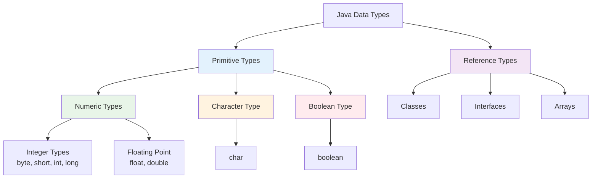
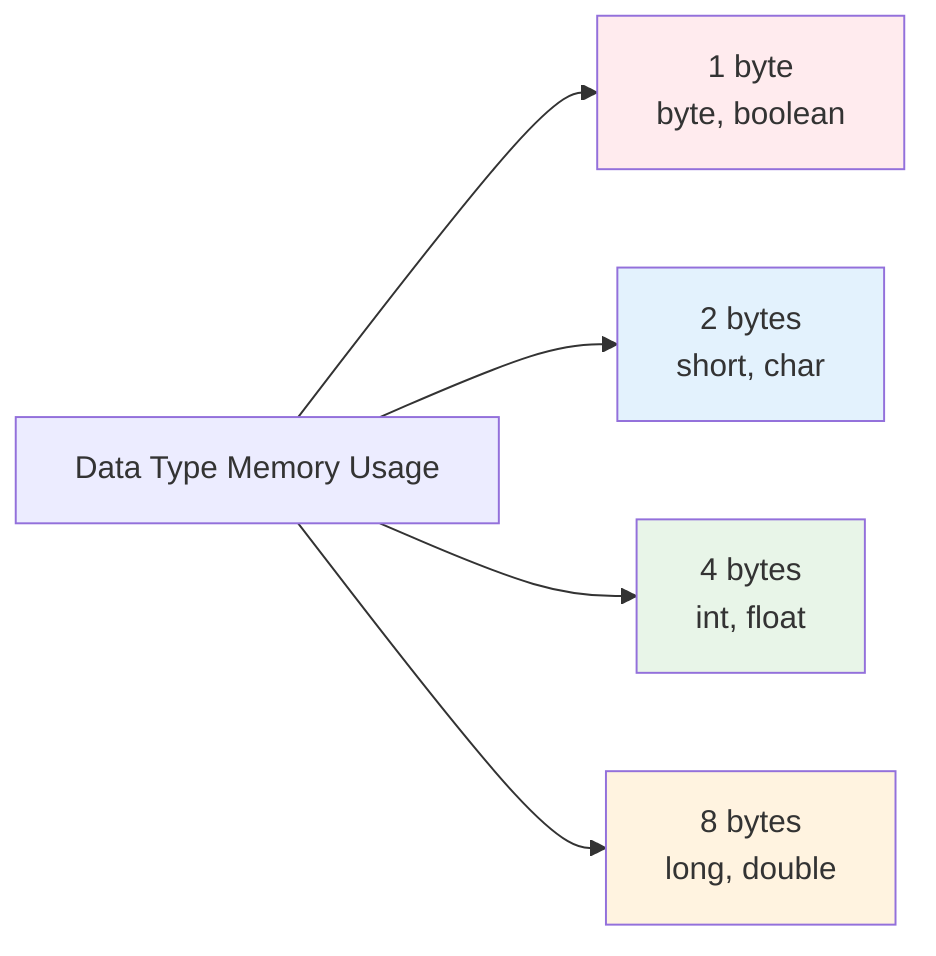

# Data Types and Variables
## Lecture 4

**Java Programming (4343203)**  
Diploma in ICT - Semester IV  
Gujarat Technological University

<div class="pt-12">
  <span @click="$slidev.nav.next" class="px-2 py-1 rounded cursor-pointer" hover="bg-white bg-opacity-10">
    Press Space for next page <carbon:arrow-right class="inline"/>
  </span>
</div>

---
layout: default
---

# Learning Objectives

By the end of this lecture, you will be able to:

<v-clicks>

- 🔢 **Identify** all eight primitive data types in Java
- 📝 **Understand** the rules for naming identifiers
- 💾 **Declare** variables with appropriate data types
- 🔒 **Create** constants using the final keyword
- 📊 **Determine** variable scope and lifetime
- 🎯 **Choose** appropriate data types for different scenarios

</v-clicks>

<br>

<div v-click="7" class="text-center text-2xl text-blue-600 font-bold">
Let's explore Java's data foundation! 📊
</div>

---
layout: center
---

# Java Data Types Overview

<div class="flex justify-center">



</div>

<div class="mt-6 text-center">
<div class="bg-blue-50 p-4 rounded-lg inline-block">
<strong>Focus Today:</strong> Primitive Data Types - The building blocks of Java!
</div>
</div>

---
layout: default
---

# Primitive Data Types Table

| Data Type | Size | Range | Default Value | Example |
|-----------|------|-------|---------------|---------|
| **byte** | 8 bits | -128 to 127 | 0 | `byte age = 25;` |
| **short** | 16 bits | -32,768 to 32,767 | 0 | `short year = 2024;` |
| **int** | 32 bits | -2³¹ to 2³¹-1 | 0 | `int population = 50000;` |
| **long** | 64 bits | -2⁶³ to 2⁶³-1 | 0L | `long distance = 384400L;` |
| **float** | 32 bits | ±3.4×10³⁸ (6-7 digits) | 0.0f | `float price = 99.99f;` |
| **double** | 64 bits | ±1.7×10³⁰⁸ (15-16 digits) | 0.0d | `double pi = 3.14159;` |
| **char** | 16 bits | 0 to 65,535 (Unicode) | '\u0000' | `char grade = 'A';` |
| **boolean** | 1 bit | true or false | false | `boolean isActive = true;` |

<div class="mt-4 p-4 bg-yellow-50 rounded-lg">
<strong>💡 Memory Tip:</strong> byte → short → int → long (increasing size for integers)
</div>

---
layout: default
---

# Integer Data Types

<div class="grid grid-cols-2 gap-8">

<div>

## 🔢 Integer Types Characteristics

<v-clicks>

- **byte**: Smallest integer type
  - Range: -128 to 127
  - Used for: Small numbers, flags
  - Memory efficient for large arrays

- **short**: Medium-sized integer
  - Range: -32,768 to 32,767
  - Used for: Moderate-sized numbers
  - Less commonly used

</v-clicks>

</div>

<div>

<v-clicks>

- **int**: Most commonly used
  - Range: -2,147,483,648 to 2,147,483,647
  - Used for: Most integer operations
  - Default choice for integers

- **long**: Largest integer type
  - Range: Very large numbers
  - Used for: File sizes, timestamps
  - Requires 'L' suffix for literals

</v-clicks>

</div>

</div>

<div v-click="6" class="mt-6">

## 📝 Code Examples

```java
byte studentAge = 20;           // Age fits in byte range
short yearEstablished = 1998;   // Year fits in short
int populationCount = 1500000;  // Large number needs int
long worldPopulation = 8000000000L;  // Very large, needs L suffix
```

</div>

---
layout: default
---

# Floating-Point Data Types

<div class="grid grid-cols-2 gap-8">

<div>

## 🔢 Float vs Double

**float (32-bit):**
- 6-7 decimal digits precision
- Requires 'f' suffix
- Less memory usage
- Lower precision

**double (64-bit):**
- 15-16 decimal digits precision
- Default for decimal numbers
- Higher precision
- More memory usage

</div>

<div>

## 📝 Practical Examples

```java
// Float examples
float temperature = 36.5f;
float price = 299.99f;
float percentage = 85.5f;

// Double examples  
double pi = 3.141592653589793;
double scientificValue = 1.23e-4;
double bankBalance = 50000.75;

// Precision comparison
float f = 1.23456789f;    // Stored as: 1.2345679
double d = 1.23456789;    // Stored as: 1.23456789
```

</div>

</div>

<div class="mt-6 p-4 bg-blue-50 rounded-lg">
<strong>🎯 Best Practice:</strong> Use double for most decimal calculations unless memory is critical!
</div>

---
layout: default
---

# Character and Boolean Types

<div class="grid grid-cols-2 gap-8">

<div>

## 📝 Character Type (char)

<v-clicks>

- **16-bit Unicode** character
- **Single quotes** for literals
- **Supports** all languages
- **Range**: 0 to 65,535

```java
char letter = 'A';
char digit = '5';
char symbol = '@';
char unicode = '\u0041';  // 'A' in Unicode
char hindi = 'अ';          // Hindi character
```

</v-clicks>

</div>

<div>

## ✅ Boolean Type (boolean)

<v-clicks>

- **Only two values**: true or false
- **No numeric conversion** (unlike C/C++)
- **Used for**: Conditions, flags
- **Default value**: false

```java
boolean isStudent = true;
boolean hasLicense = false;
boolean isActive = (age >= 18);

// Common usage in conditions
if (isStudent) {
    System.out.println("Student discount applied");
}
```

</v-clicks>

</div>

</div>

<div v-click="8" class="mt-6 p-4 bg-green-50 rounded-lg">
<strong>⚠️ Important:</strong> Java boolean cannot be converted to/from integers unlike other languages!
</div>

---
layout: default
---

# Identifiers and Naming Rules

<div class="grid grid-cols-2 gap-8">

<div>

## 📋 Identifier Rules

<v-clicks>

1. **Must start with**:
   - Letter (a-z, A-Z)
   - Underscore (_)
   - Dollar sign ($)

2. **Can contain**:
   - Letters, digits, underscore, dollar
   - No spaces or special characters

3. **Cannot be**:
   - Java keywords (reserved words)
   - null literal

4. **Case sensitive**: `age` ≠ `Age`

</v-clicks>

</div>

<div>

## ✅❌ Examples

<div v-click="5">

**Valid Identifiers:**
```java
age              // ✅ Simple name
studentAge       // ✅ camelCase
student_name     // ✅ With underscore
$price           // ✅ With dollar sign
_count           // ✅ Starts with underscore
class1           // ✅ Ends with digit
```

**Invalid Identifiers:**
```java
2age             // ❌ Starts with digit
student-name     // ❌ Contains hyphen
class            // ❌ Reserved keyword
my var           // ❌ Contains space
@email           // ❌ Invalid character
```

</div>

</div>

</div>

---
layout: default
---

# Java Keywords (Reserved Words)

<div class="grid grid-cols-4 gap-4 text-sm">

<div class="bg-red-50 p-3 rounded">
<h4 class="font-bold mb-2">Access Modifiers</h4>
<ul>
<li>public</li>
<li>private</li>
<li>protected</li>
</ul>
</div>

<div class="bg-blue-50 p-3 rounded">
<h4 class="font-bold mb-2">Class Related</h4>
<ul>
<li>class</li>
<li>interface</li>
<li>extends</li>
<li>implements</li>
<li>abstract</li>
<li>final</li>
</ul>
</div>

<div class="bg-green-50 p-3 rounded">
<h4 class="font-bold mb-2">Control Flow</h4>
<ul>
<li>if, else</li>
<li>switch, case, default</li>
<li>for, while, do</li>
<li>break, continue</li>
<li>return</li>
</ul>
</div>

<div class="bg-yellow-50 p-3 rounded">
<h4 class="font-bold mb-2">Data Types</h4>
<ul>
<li>byte, short, int, long</li>
<li>float, double</li>
<li>char, boolean</li>
<li>void</li>
</ul>
</div>

</div>

<div class="mt-6 grid grid-cols-3 gap-4 text-sm">

<div class="bg-purple-50 p-3 rounded">
<h4 class="font-bold mb-2">Exception Handling</h4>
<ul>
<li>try, catch, finally</li>
<li>throw, throws</li>
</ul>
</div>

<div class="bg-orange-50 p-3 rounded">
<h4 class="font-bold mb-2">Other Keywords</h4>
<ul>
<li>static, new</li>
<li>this, super</li>
<li>package, import</li>
</ul>
</div>

<div class="bg-gray-50 p-3 rounded">
<h4 class="font-bold mb-2">Unused (Reserved)</h4>
<ul>
<li>goto</li>
<li>const</li>
</ul>
</div>

</div>

---
layout: default
---

# Variable Declaration and Initialization

<div class="grid grid-cols-2 gap-8">

<div>

## 📝 Declaration Syntax

```java
// Basic syntax
dataType variableName;

// Declaration examples
int age;
double salary;
boolean isActive;
char grade;

// Multiple variables of same type
int x, y, z;
double width, height;
```

</div>

<div>

## 🔧 Initialization

```java
// Declaration with initialization
int age = 25;
double salary = 50000.0;
boolean isActive = true;
char grade = 'A';

// Separate initialization
int count;
count = 10;

// Multiple initialization
int a = 1, b = 2, c = 3;
```

</div>

</div>

<div class="mt-6 p-4 bg-blue-50 rounded-lg">

## 📊 Memory Allocation

```java
// Local variables (stack memory)
public void method() {
    int localVar = 10;  // Created when method called
}                       // Destroyed when method ends

// Instance variables (heap memory)
public class Student {
    private int age;    // Created with object
}                      // Destroyed with object
```

</div>

---
layout: default
---

# Constants and Final Variables

<div class="grid grid-cols-2 gap-8">

<div>

## 🔒 Creating Constants

```java
// Using final keyword
final int MAX_STUDENTS = 50;
final double PI = 3.14159;
final String COLLEGE_NAME = "Government Polytechnic";

// Must initialize when declared
final int YEAR = 2024;

// Cannot change later
// YEAR = 2025;  // Compilation error!
```

## 📋 Naming Convention
- **ALL_CAPS** with underscores
- Descriptive names
- Group related constants

</div>

<div>

## 🎯 Benefits of Constants

<v-clicks>

- **Readability**: Code is self-documenting
- **Maintainability**: Change in one place
- **Error Prevention**: Cannot accidentally modify
- **Performance**: Compiler optimization

</v-clicks>

<div v-click="5">

## 📝 Practical Example

```java
public class MathConstants {
    public static final double PI = 3.14159265359;
    public static final double E = 2.71828182846;
    public static final int DAYS_IN_WEEK = 7;
    public static final int MONTHS_IN_YEAR = 12;
    
    public double calculateCircleArea(double radius) {
        return PI * radius * radius;
    }
}
```

</div>

</div>

</div>

---
layout: default
---

# Variable Scope and Lifetime

<div class="grid grid-cols-2 gap-8">

<div>

## 🏠 Types of Variable Scope

<v-clicks>

1. **Local Variables**
   - Declared inside methods
   - Accessible only within method
   - Must be initialized before use

2. **Instance Variables**
   - Declared inside class, outside methods
   - One copy per object
   - Default values assigned

3. **Class Variables (Static)**
   - Declared with static keyword
   - Shared among all objects
   - Belongs to class, not object

</v-clicks>

</div>

<div>

## 📝 Scope Example

```java
public class ScopeExample {
    // Instance variable
    private int instanceVar = 10;
    
    // Class variable  
    private static int classVar = 20;
    
    public void method() {
        // Local variable
        int localVar = 30;
        
        System.out.println(instanceVar); // ✅ Accessible
        System.out.println(classVar);    // ✅ Accessible  
        System.out.println(localVar);    // ✅ Accessible
    }
    
    public void anotherMethod() {
        System.out.println(instanceVar); // ✅ Accessible
        System.out.println(classVar);    // ✅ Accessible
        // System.out.println(localVar); // ❌ Not accessible
    }
}
```

</div>

</div>

---
layout: default
---

# Default Values for Variables

| Data Type | Default Value | Example |
|-----------|---------------|---------|
| **byte** | 0 | `byte b;` → `b = 0` |
| **short** | 0 | `short s;` → `s = 0` |
| **int** | 0 | `int i;` → `i = 0` |
| **long** | 0L | `long l;` → `l = 0L` |
| **float** | 0.0f | `float f;` → `f = 0.0f` |
| **double** | 0.0d | `double d;` → `d = 0.0d` |
| **char** | '\u0000' | `char c;` → `c = '\u0000'` |
| **boolean** | false | `boolean b;` → `b = false` |
| **Reference** | null | `String s;` → `s = null` |

<div class="mt-6 p-4 bg-yellow-50 rounded-lg">
<strong>⚠️ Important:</strong> Only instance and static variables get default values. Local variables must be explicitly initialized!
</div>

<div class="mt-4 p-4 bg-red-50 rounded-lg">
<strong>❌ Compilation Error:</strong>
```java
public void method() {
    int x;  // No default value for local variables
    System.out.println(x);  // Error: variable might not be initialized
}
```
</div>

---
layout: default
---

# Choosing Appropriate Data Types

<div class="grid grid-cols-2 gap-8">

<div>

## 🎯 Decision Guidelines

**For Integers:**
- **byte**: Age, small counters (0-127)
- **short**: Year, moderate numbers
- **int**: Most integer operations (default choice)
- **long**: File sizes, large calculations

**For Decimals:**
- **float**: Graphics coordinates, less precision
- **double**: Scientific calculations, money (default)

**For Characters:**
- **char**: Single character storage
- **String**: Text and multiple characters

</div>

<div>

## 📝 Real-World Examples

```java
// Student Management System
public class Student {
    // Appropriate data type choices
    private byte age;              // 0-127 range sufficient
    private short admissionYear;   // Year fits in short
    private int rollNumber;        // Unique ID, int is fine
    private long phoneNumber;      // Large number, needs long
    
    private float height;          // Approximate value, float OK
    private double gpa;            // Precision important, use double
    
    private char section;          // Single character 'A', 'B', etc.
    private boolean isActive;      // True/false status
    
    private String firstName;      // Text data
    private String address;        // Variable length text
}
```

</div>

</div>

<div class="mt-6 p-4 bg-green-50 rounded-lg">
<strong>💡 Best Practice:</strong> Choose the smallest data type that can handle your range of values efficiently!
</div>

---
layout: default
---

# Common Data Type Mistakes

<div class="space-y-4">

<div class="bg-red-50 p-4 rounded-lg">
<h4 class="font-bold text-red-700">❌ Range Overflow</h4>
```java
byte bigNumber = 200;  // Error: 200 > 127 (byte max)
int veryLarge = 3000000000;  // Error: exceeds int range
```
<strong>Solution:</strong> Use appropriate data type: `long veryLarge = 3000000000L;`
</div>

<div class="bg-orange-50 p-4 rounded-lg">
<h4 class="font-bold text-orange-700">❌ Missing Suffixes</h4>
```java
float price = 99.99;   // Error: double to float
long distance = 50000000000;  // Error: int to long
```
<strong>Solution:</strong> Add suffixes: `float price = 99.99f;` `long distance = 50000000000L;`
</div>

<div class="bg-yellow-50 p-4 rounded-lg">
<h4 class="font-bold text-yellow-700">❌ Uninitialized Local Variables</h4>
```java
public void calculate() {
    int result;
    System.out.println(result);  // Error: not initialized
}
```
<strong>Solution:</strong> Initialize: `int result = 0;`
</div>

</div>

---
layout: default
---

# Practical Exercise

## 🛠️ Hands-On Activity

<div class="space-y-4">

<div class="bg-yellow-50 p-4 rounded-lg">
<strong>Task 1:</strong> Create a Student class with appropriate data types for:
- Age, Roll Number, Phone Number, GPA, Section, Active Status
</div>

<div class="bg-blue-50 p-4 rounded-lg">
<strong>Task 2:</strong> Declare constants for:
- Maximum students per class, College establishment year, Passing percentage
</div>

<div class="bg-green-50 p-4 rounded-lg">
<strong>Task 3:</strong> Write a program demonstrating variable scope:
- Local, instance, and static variables
</div>

<div class="bg-purple-50 p-4 rounded-lg">
<strong>Task 4:</strong> Create a calculator program using different data types for various operations
</div>

</div>

## 📝 Sample Code Structure

```java
public class DataTypeDemo {
    // Add your constants, instance variables, and methods here
    public static void main(String[] args) {
        // Demonstrate different data types
    }
}
```

---
layout: default
---

# Memory Usage Comparison

<div class="flex justify-center">



</div>

<div class="mt-8 grid grid-cols-2 gap-6">

<div class="bg-blue-50 p-4 rounded-lg">
<h3 class="font-bold mb-3">💾 Memory Efficiency Tips</h3>
<ul class="space-y-2">
<li>• Use byte for small ranges</li>
<li>• Prefer int over long when possible</li>
<li>• Use float for graphics/games</li>
<li>• Use double for precise calculations</li>
</ul>
</div>

<div class="bg-green-50 p-4 rounded-lg">
<h3 class="font-bold mb-3">📊 Performance Considerations</h3>
<ul class="space-y-2">
<li>• int operations are fastest</li>
<li>• long operations are slower</li>
<li>• float vs double: minimal difference</li>
<li>• Choose based on precision needs</li>
</ul>
</div>

</div>

---
layout: center
class: text-center
---

# Summary

<div class="grid grid-cols-2 gap-8 mt-8">

<div class="bg-blue-50 p-6 rounded-lg">
<h3 class="font-bold text-lg mb-4">📖 What We Learned</h3>
<ul class="text-left space-y-2">
<li>• Eight primitive data types in Java</li>
<li>• Identifier naming rules and conventions</li>
<li>• Variable declaration and initialization</li>
<li>• Constants using final keyword</li>
<li>• Variable scope and lifetime</li>
</ul>
</div>

<div class="bg-green-50 p-6 rounded-lg">
<h3 class="font-bold text-lg mb-4">🎯 Next Steps</h3>
<ul class="text-left space-y-2">
<li>• Type conversion and casting</li>
<li>• Working with arrays</li>
<li>• String manipulation</li>
<li>• Input/output operations</li>
<li>• Practical programming exercises</li>
</ul>
</div>

</div>

<div class="mt-8 text-2xl font-bold text-purple-600">
Master data types, master Java! 🔢
</div>

---
layout: center
class: text-center
---

# Questions & Discussion

<div class="text-6xl mb-8">❓</div>

<div class="text-xl mb-8">
Any questions about data types, variables, or constants?
</div>

<div class="text-lg text-gray-600">
Next lecture: **Type Conversion and Arrays**
</div>

<div class="mt-8">
<span class="px-4 py-2 bg-blue-500 text-white rounded-lg">
Ready to explore type conversion! 👏
</span>
</div>