# Type Conversion and Arrays
## Lecture 5

**Java Programming (4343203)**  
Diploma in ICT - Semester IV  
Gujarat Technological University

<div class="pt-12">
  <span @click="$slidev.nav.next" class="px-2 py-1 rounded cursor-pointer" hover="bg-white bg-opacity-10">
    Press Space for next page <carbon:arrow-right class="inline"/>
  </span>
</div>

---
layout: default
---

# Learning Objectives

By the end of this lecture, you will be able to:

<v-clicks>

- 🔄 **Understand** implicit and explicit type conversion
- 📐 **Perform** type casting with proper syntax
- 📊 **Create** and initialize one-dimensional arrays
- 🔲 **Work** with two-dimensional arrays
- 🎯 **Apply** arrays in real-world programming scenarios
- 🛠️ **Implement** array operations like searching and sorting

</v-clicks>

<br>

<div v-click="7" class="text-center text-2xl text-blue-600 font-bold">
Let's master type conversion and arrays! 🔄📊
</div>

---
layout: center
---

# Type Conversion Overview

```mermaid
graph TD
    A[Type Conversion] --> B[Implicit Conversion<br/>Widening]
    A --> C[Explicit Conversion<br/>Narrowing]
    
    B --> D[Automatic<br/>Safe Conversion]
    B --> E[byte → short → int → long<br/>float → double]
    
    C --> F[Manual Casting<br/>May Lose Data]
    C --> G[long → int → short → byte<br/>double → float]
    
    style B fill:#e8f5e8
    style C fill:#ffebee
    style D fill:#e3f2fd
    style F fill:#fff3e0
```

<div class="flex justify-center">



</div>

<div class="mt-6 grid grid-cols-2 gap-6">

<div class="bg-green-50 p-4 rounded-lg">
<h3 class="font-bold text-green-700">✅ Implicit (Safe)</h3>
<p>Smaller to larger data types</p>
<p>No data loss occurs</p>
</div>

<div class="bg-red-50 p-4 rounded-lg">
<h3 class="font-bold text-red-700">⚠️ Explicit (Risky)</h3>
<p>Larger to smaller data types</p>
<p>Potential data loss</p>
</div>

</div>

---
layout: default
---

# Implicit Type Conversion (Widening)

<div class="grid grid-cols-2 gap-8">

<div>

## 📈 Conversion Hierarchy

```java
byte → short → int → long → float → double
         ↓
       char → int
```

## ✅ Safe Conversions

```java
// Implicit conversion examples
byte b = 10;
short s = b;        // byte to short
int i = s;          // short to int  
long l = i;         // int to long
float f = l;        // long to float
double d = f;       // float to double

// Character conversion
char c = 'A';       // ASCII value 65
int ascii = c;      // char to int (65)

// Mixed operations
int x = 5;
double y = 2.5;
double result = x + y;  // x promoted to double
```

</div>

<div>

## 🎯 Rules for Implicit Conversion

<v-clicks>

1. **No data loss** occurs
2. **Smaller to larger** types only
3. **Automatic** by compiler
4. **In expressions**, smaller types promoted

</v-clicks>

<div v-click="5" class="mt-6 p-4 bg-blue-50 rounded-lg">

## 📊 Expression Promotion

```java
byte a = 10;
byte b = 20;
// byte c = a + b;     // Error! 
int c = a + b;         // Correct
```

**Why?** Arithmetic operations promote `byte` and `short` to `int`!

</div>

</div>

</div>

---
layout: default
---

# Explicit Type Conversion (Narrowing)

<div class="grid grid-cols-2 gap-8">

<div>

## ⚠️ Manual Casting Syntax

```java
// Basic casting syntax
(target_type) value

// Examples
double d = 9.78;
int i = (int) d;        // 9 (fractional part lost)

long l = 100L;
int x = (int) l;        // 100 (fits in int)

float f = 65.4f;
char c = (char) f;      // 'A' (ASCII 65)

// Complex expressions
double result = 10.5 * 3.2;
int finalValue = (int) (result + 0.5);  // Rounding
```

</div>

<div>

## 🔍 Data Loss Examples

```java
// Potential data loss scenarios
int large = 300;
byte small = (byte) large;    // -44 (overflow!)

double precise = 123.456789;
float less = (float) precise; // 123.45679 (precision loss)

long bigNumber = 3000000000L;
int overflow = (int) bigNumber; // -1294967296 (overflow!)

// Character conversions
int ascii = 65;
char letter = (char) ascii;   // 'A'

char symbol = 'A';
int code = (int) symbol;      // 65
```

<div class="mt-4 p-4 bg-red-50 rounded-lg">
<strong>⚠️ Warning:</strong> Always check ranges to avoid overflow!
</div>

</div>

</div>

---
layout: default
---

# Type Conversion Best Practices

<div class="grid grid-cols-2 gap-8">

<div>

## ✅ Good Practices

```java
// 1. Check ranges before casting
long bigValue = 1500L;
if (bigValue <= Integer.MAX_VALUE) {
    int safeValue = (int) bigValue;
}

// 2. Use appropriate wrapper methods
String numberStr = "123";
int number = Integer.parseInt(numberStr);

// 3. Handle precision loss consciously
double price = 99.99;
int rupees = (int) Math.round(price);  // Round first

// 4. Use constants for readability
public static final double CONVERSION_RATE = 83.5;
double dollars = 100.0;
int rupees = (int) (dollars * CONVERSION_RATE);
```

</div>

<div>

## ❌ Common Mistakes

```java
// 1. Ignoring overflow
int result = 2000000000 + 2000000000;  // Overflow!

// 2. Unnecessary casting
double d = 5.0;
int i = (int) 5;  // Should be: int i = 5;

// 3. Loss of precision without consideration
double precise = 123.456789;
int rough = (int) precise;  // 123, but no rounding

// 4. Mixing types carelessly
byte a = 10;
byte b = 20;
byte sum = a + b;  // Compilation error!
```

<div class="mt-4 p-4 bg-yellow-50 rounded-lg">
<strong>💡 Tip:</strong> Always be explicit about your intentions with type conversion!
</div>

</div>

</div>

---
layout: center
---

# Introduction to Arrays

<div class="text-center mb-8">
<h2 class="text-2xl font-bold mb-4">What is an Array? 📊</h2>
<p class="text-lg">A collection of elements of the same data type stored in contiguous memory locations</p>
</div>

<div class="flex justify-center">


</div>

<div class="mt-8 grid grid-cols-3 gap-6">

<div class="bg-blue-50 p-4 rounded-lg text-center">
<h3 class="font-bold">🎯 Fixed Size</h3>
<p class="text-sm">Size determined at creation</p>
</div>

<div class="bg-green-50 p-4 rounded-lg text-center">
<h3 class="font-bold">📍 Indexed Access</h3>
<p class="text-sm">Access elements by index (0-based)</p>
</div>

<div class="bg-yellow-50 p-4 rounded-lg text-center">
<h3 class="font-bold">🔄 Same Type</h3>
<p class="text-sm">All elements same data type</p>
</div>

</div>

---
layout: default
---

# One-Dimensional Arrays

<div class="grid grid-cols-2 gap-8">

<div>

## 📝 Declaration and Creation

```java
// Method 1: Declaration then creation
int[] ages;                    // Declaration
ages = new int[5];            // Creation

// Method 2: Combined declaration and creation
int[] scores = new int[10];

// Method 3: Declaration with initialization
int[] numbers = {10, 20, 30, 40, 50};

// Method 4: Alternative syntax
int marks[] = new int[]{85, 90, 78, 92, 88};

// Different data types
String[] names = {"Alice", "Bob", "Charlie"};
double[] prices = {99.99, 149.50, 75.25};
boolean[] flags = {true, false, true, false};
```

</div>

<div>

## 🔍 Array Properties

```java
int[] numbers = {10, 20, 30, 40, 50};

// Array length
int size = numbers.length;  // 5 (property, not method)

// Accessing elements
int first = numbers[0];     // 10 (first element)
int last = numbers[4];      // 50 (last element)

// Modifying elements
numbers[2] = 35;           // Change 30 to 35

// Array bounds
// int invalid = numbers[5];  // Runtime error!
// numbers[-1] = 10;          // Runtime error!
```

<div class="mt-4 p-4 bg-red-50 rounded-lg">
<strong>⚠️ Important:</strong> Array index out of bounds throws `ArrayIndexOutOfBoundsException`!
</div>

</div>

</div>

---
layout: default
---

# Array Operations and Examples

<div class="grid grid-cols-2 gap-8">

<div>

## 🔄 Common Array Operations

```java
// 1. Initialize array with values
int[] marks = new int[5];
for (int i = 0; i < marks.length; i++) {
    marks[i] = (i + 1) * 10;  // 10, 20, 30, 40, 50
}

// 2. Display array elements
System.out.println("Student Marks:");
for (int i = 0; i < marks.length; i++) {
    System.out.println("Student " + (i+1) + ": " + marks[i]);
}

// 3. Enhanced for loop (for-each)
for (int mark : marks) {
    System.out.println("Mark: " + mark);
}

// 4. Find sum and average
int sum = 0;
for (int mark : marks) {
    sum += mark;
}
double average = (double) sum / marks.length;
```

</div>

<div>

## 🔍 Searching and Finding

```java
// Find maximum element
int[] numbers = {45, 23, 67, 12, 89, 34};
int max = numbers[0];
for (int i = 1; i < numbers.length; i++) {
    if (numbers[i] > max) {
        max = numbers[i];
    }
}

// Linear search
public static int linearSearch(int[] arr, int target) {
    for (int i = 0; i < arr.length; i++) {
        if (arr[i] == target) {
            return i;  // Return index
        }
    }
    return -1;  // Not found
}

// Count occurrences
public static int countOccurrences(int[] arr, int value) {
    int count = 0;
    for (int element : arr) {
        if (element == value) {
            count++;
        }
    }
    return count;
}
```

</div>

</div>

---
layout: default
---

# Two-Dimensional Arrays

<div class="grid grid-cols-2 gap-8">

<div>

## 📊 2D Array Concept

Think of a 2D array as a **table** or **matrix**:

```
    Col 0  Col 1  Col 2
Row 0  [85]   [90]   [78]
Row 1  [92]   [88]   [95]
Row 2  [76]   [82]   [89]
```

## 📝 Declaration and Creation

```java
// Method 1: Declaration then creation
int[][] matrix;
matrix = new int[3][4];  // 3 rows, 4 columns

// Method 2: Combined
int[][] scores = new int[5][3];

// Method 3: With initialization
int[][] marks = {
    {85, 90, 78},
    {92, 88, 95},
    {76, 82, 89}
};

// Method 4: Row by row
int[][] table = new int[2][];
table[0] = new int[]{1, 2, 3};
table[1] = new int[]{4, 5, 6, 7};  // Jagged array
```

</div>

<div>

## 🔍 Accessing 2D Arrays

```java
int[][] marks = {
    {85, 90, 78},
    {92, 88, 95}, 
    {76, 82, 89}
};

// Access specific element
int firstStudentMath = marks[0][0];  // 85
int lastStudentScience = marks[2][2]; // 89

// Modify elements
marks[1][2] = 97;  // Change second student's third subject

// Array dimensions
int rows = marks.length;        // 3
int cols = marks[0].length;     // 3

// Display all elements
for (int i = 0; i < marks.length; i++) {
    for (int j = 0; j < marks[i].length; j++) {
        System.out.print(marks[i][j] + " ");
    }
    System.out.println();  // New line after each row
}

// Enhanced for loop
for (int[] row : marks) {
    for (int mark : row) {
        System.out.print(mark + " ");
    }
    System.out.println();
}
```

</div>

</div>

---
layout: default
---

# Practical Array Examples

## 🎓 Student Grade Management System

```java
public class StudentGrades {
    public static void main(String[] args) {
        // Student names
        String[] students = {"Alice", "Bob", "Charlie", "Diana", "Eve"};
        
        // Marks in 3 subjects: Math, Science, English
        int[][] marks = {
            {85, 90, 78},  // Alice
            {92, 88, 95},  // Bob
            {76, 82, 89},  // Charlie
            {88, 91, 85},  // Diana
            {79, 85, 92}   // Eve
        };
        
        // Calculate and display results
        System.out.println("Student Grade Report");
        System.out.println("=====================");
        
        for (int i = 0; i < students.length; i++) {
            int total = 0;
            System.out.print(students[i] + ": ");
            
            // Calculate total marks
            for (int j = 0; j < marks[i].length; j++) {
                total += marks[i][j];
                System.out.print(marks[i][j] + " ");
            }
            
            double average = (double) total / marks[i].length;
            char grade = calculateGrade(average);
            
            System.out.printf("| Total: %d | Avg: %.2f | Grade: %c%n", 
                             total, average, grade);
        }
    }
    
    public static char calculateGrade(double average) {
        if (average >= 90) return 'A';
        else if (average >= 80) return 'B';
        else if (average >= 70) return 'C';
        else if (average >= 60) return 'D';
        else return 'F';
    }
}
```

---
layout: default
---

# Matrix Operations

<div class="grid grid-cols-2 gap-8">

<div>

## ➕ Matrix Addition

```java
public static int[][] addMatrices(int[][] a, int[][] b) {
    int rows = a.length;
    int cols = a[0].length;
    int[][] result = new int[rows][cols];
    
    for (int i = 0; i < rows; i++) {
        for (int j = 0; j < cols; j++) {
            result[i][j] = a[i][j] + b[i][j];
        }
    }
    return result;
}

// Example usage
int[][] matrix1 = {{1, 2}, {3, 4}};
int[][] matrix2 = {{5, 6}, {7, 8}};
int[][] sum = addMatrices(matrix1, matrix2);
// Result: {{6, 8}, {10, 12}}
```

## 🔄 Matrix Transpose

```java
public static int[][] transpose(int[][] matrix) {
    int rows = matrix.length;
    int cols = matrix[0].length;
    int[][] result = new int[cols][rows];
    
    for (int i = 0; i < rows; i++) {
        for (int j = 0; j < cols; j++) {
            result[j][i] = matrix[i][j];
        }
    }
    return result;
}
```

</div>

<div>

## 📊 Practical Example: 3x3 Matrix Addition

```java
import java.util.Scanner;

public class MatrixAddition {
    public static void main(String[] args) {
        Scanner sc = new Scanner(System.in);
        int[][] matrix1 = new int[3][3];
        int[][] matrix2 = new int[3][3];
        int[][] result = new int[3][3];
        
        // Input first matrix
        System.out.println("Enter first 3x3 matrix:");
        for (int i = 0; i < 3; i++) {
            for (int j = 0; j < 3; j++) {
                matrix1[i][j] = sc.nextInt();
            }
        }
        
        // Input second matrix
        System.out.println("Enter second 3x3 matrix:");
        for (int i = 0; i < 3; i++) {
            for (int j = 0; j < 3; j++) {
                matrix2[i][j] = sc.nextInt();
            }
        }
        
        // Add matrices
        for (int i = 0; i < 3; i++) {
            for (int j = 0; j < 3; j++) {
                result[i][j] = matrix1[i][j] + matrix2[i][j];
            }
        }
        
        // Display result
        System.out.println("Sum of matrices:");
        displayMatrix(result);
    }
    
    public static void displayMatrix(int[][] matrix) {
        for (int[] row : matrix) {
            for (int element : row) {
                System.out.print(element + " ");
            }
            System.out.println();
        }
    }
}
```

</div>

</div>

---
layout: default
---

# Array Common Mistakes and Solutions

<div class="space-y-4">

<div class="bg-red-50 p-4 rounded-lg">
<h4 class="font-bold text-red-700">❌ Array Index Out of Bounds</h4>
```java
int[] arr = new int[5];
arr[5] = 10;  // Error! Valid indices: 0-4
```
<strong>Solution:</strong> Always check: `index < array.length`
</div>

<div class="bg-orange-50 p-4 rounded-lg">
<h4 class="font-bold text-orange-700">❌ Null Pointer Exception</h4>
```java
int[] arr = null;
int len = arr.length;  // NullPointerException!
```
<strong>Solution:</strong> Initialize array before use: `arr = new int[10];`
</div>

<div class="bg-yellow-50 p-4 rounded-lg">
<h4 class="font-bold text-yellow-700">❌ Confusion between length and length()</h4>
```java
int[] arr = new int[5];
int len = arr.length();  // Error! No parentheses for arrays
String str = "Hello";
int sLen = str.length();  // Correct! Strings use method
```
</div>

<div class="bg-blue-50 p-4 rounded-lg">
<h4 class="font-bold text-blue-700">❌ Modifying array during enhanced for loop</h4>
```java
for (int element : arr) {
    element = element * 2;  // Won't modify original array!
}
// Use regular for loop with index for modifications
```
</div>

</div>

---
layout: default
---

# Practical Exercise

## 🛠️ Hands-On Activities

<div class="space-y-4">

<div class="bg-yellow-50 p-4 rounded-lg">
<strong>Task 1:</strong> Write a program to reverse the digits of a number using arrays
</div>

<div class="bg-blue-50 p-4 rounded-lg">
<strong>Task 2:</strong> Create a program to add two 3x3 matrices and display the result
</div>

<div class="bg-green-50 p-4 rounded-lg">
<strong>Task 3:</strong> Implement a student grade system that:
- Stores marks for 5 students in 3 subjects
- Calculates total and average for each student  
- Finds the highest scorer in each subject
</div>

<div class="bg-purple-50 p-4 rounded-lg">
<strong>Task 4:</strong> Write programs demonstrating type conversion:
- Safe implicit conversions
- Explicit casting with data loss examples
</div>

</div>

## 🎯 Expected Skills
- Array declaration and initialization
- Type conversion understanding
- Matrix operations implementation
- Proper error handling

---
layout: default
---

# Performance Considerations

<div class="grid grid-cols-2 gap-8">

<div>

## ⚡ Array Performance Tips

<v-clicks>

- **Access Speed**: O(1) for index access
- **Memory**: Contiguous allocation is cache-friendly
- **Size**: Fixed size for better memory management
- **Initialization**: Default values assigned automatically

</v-clicks>

<div v-click="5">

## 📊 Memory Layout

```java
int[] arr = {10, 20, 30, 40, 50};
```

```
Memory Address: 1000  1004  1008  1012  1016
Values:         [10]  [20]  [30]  [40]  [50]
Index:           0     1     2     3     4
```

</div>

</div>

<div>

## 🎯 Best Practices

<v-clicks>

- **Bounds Checking**: Always validate indices
- **Initialization**: Initialize arrays before use
- **Enhanced For**: Use for-each when not modifying
- **Size Planning**: Estimate size requirements

</v-clicks>

<div v-click="10">

## 🔍 Debugging Arrays

```java
// Print array contents for debugging
int[] arr = {1, 2, 3, 4, 5};

// Method 1: Manual loop
for (int i = 0; i < arr.length; i++) {
    System.out.print(arr[i] + " ");
}

// Method 2: Arrays.toString()
System.out.println(Arrays.toString(arr));
// Output: [1, 2, 3, 4, 5]
```

</div>

</div>

</div>

---
layout: center
class: text-center
---

# Summary

<div class="grid grid-cols-2 gap-8 mt-8">

<div class="bg-blue-50 p-6 rounded-lg">
<h3 class="font-bold text-lg mb-4">📖 What We Learned</h3>
<ul class="text-left space-y-2">
<li>• Implicit and explicit type conversion</li>
<li>• Type casting and data loss scenarios</li>
<li>• One-dimensional array operations</li>
<li>• Two-dimensional arrays and matrices</li>
<li>• Common array mistakes and solutions</li>
</ul>
</div>

<div class="bg-green-50 p-6 rounded-lg">
<h3 class="font-bold text-lg mb-4">🎯 Next Steps</h3>
<ul class="text-left space-y-2">
<li>• Learn about operators in Java</li>
<li>• Practice with arithmetic operators</li>
<li>• Explore logical and relational operators</li>
<li>• Understand operator precedence</li>
<li>• Build complex expressions</li>
</ul>
</div>

</div>

<div class="mt-8 text-2xl font-bold text-purple-600">
Arrays and type conversion mastered! 🎯📊
</div>

---
layout: center
class: text-center
---

# Questions & Discussion

<div class="text-6xl mb-8">❓</div>

<div class="text-xl mb-8">
Any questions about type conversion, casting, or arrays?
</div>

<div class="text-lg text-gray-600">
Next lecture: **Operators in Java**
</div>

<div class="mt-8">
<span class="px-4 py-2 bg-blue-500 text-white rounded-lg">
Ready to explore Java operators! 👏
</span>
</div>