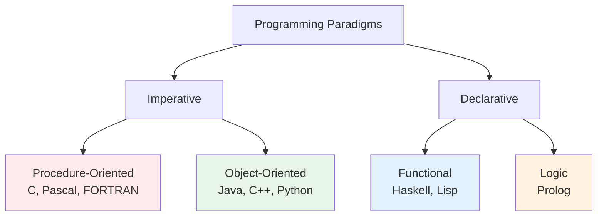
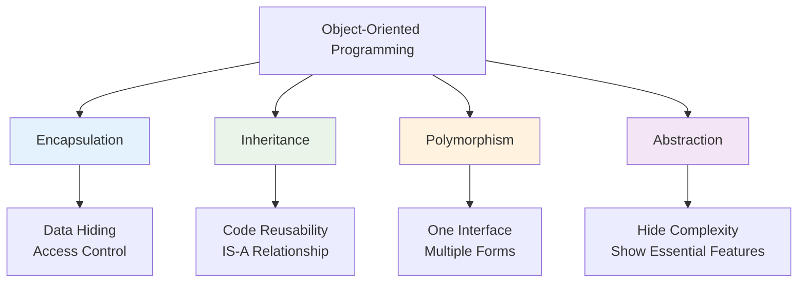
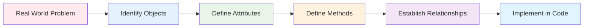

# Introduction to Object-Oriented Programming
## Lecture 9

**Java Programming (4343203)**  
Diploma in ICT - Semester IV  
Gujarat Technological University

<div class="pt-12">
  <span @click="$slidev.nav.next" class="px-2 py-1 rounded cursor-pointer" hover="bg-white bg-opacity-10">
    Press Space for next page <carbon:arrow-right class="inline"/>
  </span>
</div>

---
layout: default
---

# Learning Objectives

By the end of this lecture, you will be able to:

<v-clicks>

- 🔄 **Differentiate** between Procedure-Oriented and Object-Oriented Programming
- 🎯 **Understand** the core concepts of OOP
- 🏗️ **Identify** the advantages of OOP over traditional programming
- 🌍 **Recognize** real-world applications of OOP principles
- 📚 **Prepare** for classes and objects in Java
- 💡 **Appreciate** why Java is an OOP language

</v-clicks>

<br>

<div v-click="7" class="text-center text-2xl text-blue-600 font-bold">
Welcome to the world of objects! 🎯🏗️
</div>

---
layout: center
---

# What is Programming Paradigm?

<div class="text-center mb-8">
<h2 class="text-2xl font-bold mb-4">Programming Paradigm 📋</h2>
<p class="text-lg">A fundamental style or approach to programming and problem-solving</p>
</div>

<div class="flex justify-center">



</div>

<div class="mt-6 text-center">
<div class="bg-blue-50 p-4 rounded-lg inline-block">
<strong>Our Focus:</strong> Transition from Procedure-Oriented to Object-Oriented Programming
</div>
</div>

---
layout: default
---

# Procedure-Oriented Programming (POP)

<div class="grid grid-cols-2 gap-8">

<div>

## 🔧 POP Characteristics

<v-clicks>

- **Functions are primary units**
- **Top-down approach**
- **Global data sharing**
- **Sequential execution**
- **Data and functions are separate**
- **Problem decomposition into functions**

</v-clicks>

<div v-click="7">

## 📝 POP Example (C Language)

```c
#include <stdio.h>

// Global variables
int balance = 1000;
char account_holder[50] = "John Doe";

// Functions
void display_balance() {
    printf("Balance: %d\n", balance);
}

void withdraw(int amount) {
    if (balance >= amount) {
        balance -= amount;
        printf("Withdrawn: %d\n", amount);
    } else {
        printf("Insufficient funds\n");
    }
}

int main() {
    display_balance();
    withdraw(200);
    display_balance();
    return 0;
}
```

</div>

</div>

<div>

## ⚠️ POP Limitations

<v-clicks>

**Security Issues:**
- Global data accessible everywhere
- No data hiding mechanism
- Functions can modify any data

**Maintenance Problems:**
- Code duplication
- Difficult to modify
- Hard to debug large programs

**Scalability Issues:**
- Not suitable for large projects
- No code reusability
- Poor organization

</v-clicks>

<div v-click="12" class="mt-6 p-4 bg-red-50 rounded-lg">
<strong>💭 Think:</strong> What if we had 100 bank accounts? We'd need 100 global variables!
</div>

</div>

</div>

---
layout: default
---

# Object-Oriented Programming (OOP)

<div class="grid grid-cols-2 gap-8">

<div>

## 🎯 OOP Characteristics

<v-clicks>

- **Objects are primary units**
- **Bottom-up approach**
- **Data encapsulation**
- **Message passing between objects**
- **Data and methods together**
- **Problem decomposition into objects**

</v-clicks>

<div v-click="7">

## 🌍 Real-World Analogy

Think of a **Car** object:
- **Properties**: Color, Model, Speed, Fuel
- **Behaviors**: Start, Stop, Accelerate, Brake

The car **encapsulates** its data (properties) and provides **methods** to interact with it.

</div>

</div>

<div>

## 📝 OOP Example (Java)

```java
public class BankAccount {
    // Private data (encapsulated)
    private int balance;
    private String accountHolder;
    
    // Constructor
    public BankAccount(String name, int initialBalance) {
        this.accountHolder = name;
        this.balance = initialBalance;
    }
    
    // Methods to interact with data
    public void displayBalance() {
        System.out.println("Balance: " + balance);
    }
    
    public boolean withdraw(int amount) {
        if (balance >= amount) {
            balance -= amount;
            System.out.println("Withdrawn: " + amount);
            return true;
        } else {
            System.out.println("Insufficient funds");
            return false;
        }
    }
    
    // Getter method
    public int getBalance() {
        return balance;
    }
}

// Using the class
public class Main {
    public static void main(String[] args) {
        BankAccount account1 = new BankAccount("John", 1000);
        BankAccount account2 = new BankAccount("Alice", 1500);
        
        account1.displayBalance();
        account1.withdraw(200);
    }
}
```

</div>

</div>

---
layout: default
---

# POP vs OOP Detailed Comparison

| Aspect | Procedure-Oriented Programming | Object-Oriented Programming |
|--------|-------------------------------|----------------------------|
| **Primary Focus** | Functions and procedures | Objects and classes |
| **Problem Approach** | Top-down (divide into functions) | Bottom-up (identify objects) |
| **Data Security** | No data hiding, global access | Data encapsulation and hiding |
| **Data and Functions** | Separate entities | Combined in objects |
| **Code Reusability** | Limited (function reuse only) | High (inheritance, polymorphism) |
| **Maintenance** | Difficult for large programs | Easier to maintain and modify |
| **Real-world Modeling** | Difficult to model | Natural representation |
| **Programming Languages** | C, Pascal, FORTRAN, COBOL | Java, C++, Python, C# |
| **Complexity Handling** | Becomes complex for large projects | Better suited for complex applications |
| **Development Time** | Less for small programs | More initially, less for large systems |

<div class="mt-6 p-4 bg-blue-50 rounded-lg">
<strong>🎯 Key Insight:</strong> OOP provides a more natural way to model real-world problems!
</div>

---
layout: center
---

# Core OOP Concepts Overview

<div class="flex justify-center">



</div>

<div class="mt-8 grid grid-cols-2 gap-6">

<div class="bg-blue-50 p-4 rounded-lg">
<h3 class="font-bold text-blue-700">🔒 Encapsulation</h3>
<p class="text-sm">Bundling data and methods that operate on that data within a single unit</p>
</div>

<div class="bg-green-50 p-4 rounded-lg">
<h3 class="font-bold text-green-700">🧬 Inheritance</h3>
<p class="text-sm">Creating new classes based on existing classes to promote code reuse</p>
</div>

<div class="bg-yellow-50 p-4 rounded-lg">
<h3 class="font-bold text-yellow-700">🎭 Polymorphism</h3>
<p class="text-sm">Same interface, different implementations - objects behaving differently</p>
</div>

<div class="bg-purple-50 p-4 rounded-lg">
<h3 class="font-bold text-purple-700">🎯 Abstraction</h3>
<p class="text-sm">Hiding implementation details while exposing only essential features</p>
</div>

</div>

---
layout: default
---

# Real-World OOP Examples

<div class="grid grid-cols-2 gap-8">

<div>

## 🏫 University Management System

<v-clicks>

**Objects in the System:**
- **Student**: Roll number, name, grades
- **Teacher**: Employee ID, subject, salary  
- **Course**: Course code, credits, syllabus
- **Department**: Name, HOD, courses

**Relationships:**
- Student **enrolls in** Course
- Teacher **teaches** Course
- Course **belongs to** Department

**Benefits:**
- Each object manages its own data
- Easy to add new students/teachers
- Changes to one object don't affect others

</v-clicks>

</div>

<div>

## 🚗 Vehicle Management System

<v-clicks>

**Class Hierarchy:**
```java
Vehicle (Parent)
├── Car
│   ├── Sedan
│   └── SUV
├── Motorcycle
└── Truck
```

**Common Properties:**
- Engine type, fuel capacity, speed

**Specific Properties:**
- Car: Number of doors, AC
- Motorcycle: Handle type
- Truck: Load capacity

**Polymorphism Example:**
- All vehicles can `start()` and `stop()`
- Each implements it differently

</v-clicks>

</div>

</div>

---
layout: default
---

# Advantages of OOP

<div class="grid grid-cols-2 gap-8">

<div>

## ✅ Technical Advantages

<v-clicks>

**1. Modularity**
- Code organized in independent modules
- Easy to understand and maintain
- Parallel development possible

**2. Reusability**
- Classes can be reused in multiple projects
- Inheritance promotes code reuse
- Reduces development time

**3. Maintainability**
- Localized changes
- Easy to debug and fix
- Clear structure and organization

**4. Extensibility**
- Easy to add new features
- Minimal impact on existing code
- Flexible design

</v-clicks>

</div>

<div>

## 🎯 Business Advantages

<v-clicks>

**1. Faster Development**
- Reuse existing components
- Parallel team development
- Reduced coding effort

**2. Better Quality**
- Encapsulation reduces errors
- Testing individual objects
- Proven design patterns

**3. Cost Effective**
- Lower maintenance costs
- Easier updates and modifications
- Reduced time-to-market

**4. Scalability**
- Handles complex applications
- Easy to scale up or down
- Enterprise-ready architecture

</v-clicks>

</div>

</div>

<div v-click="9" class="mt-6 p-4 bg-green-50 rounded-lg">
<strong>🏆 Industry Fact:</strong> 90% of modern software applications use OOP principles!
</div>

---
layout: default
---

# OOP in Different Languages

<div class="grid grid-cols-2 gap-8">

<div>

## 🌍 OOP Language Support

| Language | OOP Support | Key Features |
|----------|-------------|--------------|
| **Java** | Pure OOP | Everything is an object |
| **C++** | Hybrid | OOP + Procedural |
| **Python** | Multi-paradigm | Dynamic OOP |
| **C#** | Pure OOP | .NET framework |
| **JavaScript** | Prototype-based | Dynamic objects |
| **Ruby** | Pure OOP | Everything is an object |

## 📊 Java's OOP Strength

- **Platform Independent** OOP
- **Automatic Memory Management**
- **Rich Class Libraries**
- **Strong Type System**
- **Enterprise Features**

</div>

<div>

## 🎯 Why Java for OOP?

<v-clicks>

**1. Pure Object-Oriented**
- Everything inherits from Object class
- No global functions (except main)
- Consistent OOP approach

**2. Simple and Clean**
- No multiple inheritance complexity
- Interfaces for multiple inheritance
- Garbage collection

**3. Platform Independent**
- Write once, run anywhere
- JVM handles platform differences
- Consistent behavior across platforms

**4. Enterprise Ready**
- Robust error handling
- Security features
- Extensive libraries

</v-clicks>

<div v-click="5" class="mt-6 p-4 bg-blue-50 rounded-lg">
<strong>💡 Fun Fact:</strong> Java was designed from the ground up to be object-oriented!
</div>

</div>

</div>

---
layout: default
---

# From Problem to Objects

## 🎯 Object-Oriented Analysis Process

<div class="flex justify-center mb-8">



</div>

**Example: Library Management System**

<div class="grid grid-cols-3 gap-6">

<div class="bg-blue-50 p-4 rounded-lg">
<h3 class="font-bold">📚 Book Object</h3>
<strong>Attributes:</strong>
<ul class="text-sm mt-2">
<li>• ISBN</li>
<li>• Title</li>
<li>• Author</li>
<li>• Available copies</li>
</ul>
<strong>Methods:</strong>
<ul class="text-sm mt-2">
<li>• checkOut()</li>
<li>• returnBook()</li>
<li>• getDetails()</li>
</ul>
</div>

<div class="bg-green-50 p-4 rounded-lg">
<h3 class="font-bold">👤 Member Object</h3>
<strong>Attributes:</strong>
<ul class="text-sm mt-2">
<li>• Member ID</li>
<li>• Name</li>
<li>• Books borrowed</li>
<li>• Membership date</li>
</ul>
<strong>Methods:</strong>
<ul class="text-sm mt-2">
<li>• borrowBook()</li>
<li>• returnBook()</li>
<li>• viewHistory()</li>
</ul>
</div>

<div class="bg-yellow-50 p-4 rounded-lg">
<h3 class="font-bold">🏛️ Library Object</h3>
<strong>Attributes:</strong>
<ul class="text-sm mt-2">
<li>• Name</li>
<li>• Address</li>
<li>• Books collection</li>
<li>• Members list</li>
</ul>
<strong>Methods:</strong>
<ul class="text-sm mt-2">
<li>• addBook()</li>
<li>• addMember()</li>
<li>• searchBook()</li>
</ul>
</div>

</div>

---
layout: default
---

# Simple Java OOP Example

## 👤 Student Class Implementation

<div class="grid grid-cols-2 gap-8">

<div>

```java
// Student.java
public class Student {
    // Attributes (data members)
    private String name;
    private int rollNumber;
    private String branch;
    private double percentage;
    
    // Constructor
    public Student(String name, int rollNumber, 
                  String branch, double percentage) {
        this.name = name;
        this.rollNumber = rollNumber;
        this.branch = branch;
        this.percentage = percentage;
    }
    
    // Methods (behaviors)
    public void displayDetails() {
        System.out.println("=== Student Details ===");
        System.out.println("Name: " + name);
        System.out.println("Roll Number: " + rollNumber);
        System.out.println("Branch: " + branch);
        System.out.println("Percentage: " + percentage + "%");
    }
    
    public char getGrade() {
        if (percentage >= 90) return 'A';
        else if (percentage >= 80) return 'B';
        else if (percentage >= 70) return 'C';
        else if (percentage >= 60) return 'D';
        else return 'F';
    }
    
    public boolean isEligibleForPlacement() {
        return percentage >= 65.0;
    }
}
```

</div>

<div>

```java
// Main.java
public class Main {
    public static void main(String[] args) {
        // Creating objects (instances)
        Student student1 = new Student(
            "Alice Johnson", 
            101, 
            "Computer Science", 
            87.5
        );
        
        Student student2 = new Student(
            "Bob Smith", 
            102, 
            "Information Technology", 
            92.3
        );
        
        Student student3 = new Student(
            "Charlie Brown", 
            103, 
            "Electronics", 
            76.8
        );
        
        // Using object methods
        student1.displayDetails();
        System.out.println("Grade: " + student1.getGrade());
        System.out.println("Placement Eligible: " + 
                         student1.isEligibleForPlacement());
        
        System.out.println("\n" + "=".repeat(30) + "\n");
        
        student2.displayDetails();
        System.out.println("Grade: " + student2.getGrade());
        System.out.println("Placement Eligible: " + 
                         student2.isEligibleForPlacement());
    }
}
```

<div class="mt-4 p-4 bg-green-50 rounded-lg">
<strong>🎯 Key Points:</strong>
<ul class="text-sm">
<li>• Each student object has its own data</li>
<li>• Methods operate on object's data</li>
<li>• Data is private (encapsulated)</li>
<li>• Objects interact through methods</li>
</ul>
</div>

</div>

</div>

---
layout: default
---

# OOP Design Principles

<div class="grid grid-cols-2 gap-8">

<div>

## 🎯 SOLID Principles (Preview)

<v-clicks>

**S - Single Responsibility**
- One class, one responsibility
- Student class only manages student data

**O - Open/Closed**
- Open for extension, closed for modification
- Add new features without changing existing code

**L - Liskov Substitution**
- Objects replaceable with instances of subtypes
- Inheritance should not break functionality

**I - Interface Segregation**
- Many specific interfaces better than one general
- Don't force classes to implement unused methods

**D - Dependency Inversion**
- Depend on abstractions, not concretions
- High-level modules shouldn't depend on low-level

</v-clicks>

</div>

<div>

## 🏗️ OOP Design Process

<v-clicks>

**1. Requirement Analysis**
- Understand the problem domain
- Identify actors and use cases

**2. Object Identification**
- Find nouns (potential objects)
- Find verbs (potential methods)

**3. Class Design**
- Define attributes and methods
- Establish relationships

**4. Implementation**
- Code the classes
- Test individual objects

**5. Integration**
- Combine objects to solve the problem
- Test the complete system

</v-clicks>

<div v-click="11" class="mt-6 p-4 bg-blue-50 rounded-lg">
<strong>💡 Remember:</strong> Good OOP design leads to maintainable, reusable, and scalable code!
</div>

</div>

</div>

---
layout: default
---

# Practical Exercise

## 🛠️ Design Your First OOP System

<div class="space-y-4">

<div class="bg-yellow-50 p-4 rounded-lg">
<strong>Task 1:</strong> Identify objects, attributes, and methods for a "College Management System"
</div>

<div class="bg-blue-50 p-4 rounded-lg">
<strong>Task 2:</strong> Compare procedural vs object-oriented approach for a "Banking System"
</div>

<div class="bg-green-50 p-4 rounded-lg">
<strong>Task 3:</strong> Create a simple class diagram for a "Vehicle Rental System"
</div>

<div class="bg-purple-50 p-4 rounded-lg">
<strong>Task 4:</strong> Write pseudocode for a "Book" class with appropriate encapsulation
</div>

</div>

## 🎯 Thinking Questions

1. **What objects would you identify in a hospital management system?**
2. **How would you model a social media platform using OOP?**
3. **What are the advantages of OOP for a large e-commerce application?**
4. **How does encapsulation improve code security?**

---
layout: default
---

# Common OOP Misconceptions

<div class="grid grid-cols-2 gap-8">

<div>

## ❌ Common Myths

<v-clicks>

**"OOP is just about classes"**
- OOP is about modeling real-world entities
- Focus on interactions between objects

**"OOP is always better"**
- Depends on the problem domain
- Simple scripts may not need OOP

**"More classes = better design"**
- Quality over quantity
- Each class should have a clear purpose

**"OOP is too complex for beginners"**
- Start with simple examples
- Build complexity gradually

</v-clicks>

</div>

<div>

## ✅ Reality Check

<v-clicks>

**OOP Requires Practice**
- Start with simple real-world examples
- Practice identifying objects and behaviors

**Good Design Takes Time**
- Initial designs may not be perfect
- Refactor and improve iteratively

**Balance is Key**
- Don't over-engineer simple problems
- Use OOP where it adds value

**Understanding Evolution**
- Learn from existing OOP systems
- Study well-designed frameworks

</v-clicks>

<div v-click="9" class="mt-6 p-4 bg-green-50 rounded-lg">
<strong>🌟 Success Tip:</strong> Think in terms of objects you interact with daily - car, phone, bank account!
</div>

</div>

</div>

---
layout: center
class: text-center
---

# Summary

<div class="grid grid-cols-2 gap-8 mt-8">

<div class="bg-blue-50 p-6 rounded-lg">
<h3 class="font-bold text-lg mb-4">📖 What We Learned</h3>
<ul class="text-left space-y-2">
<li>• Difference between POP and OOP</li>
<li>• Core OOP concepts overview</li>
<li>• Advantages of object-oriented approach</li>
<li>• Real-world modeling with objects</li>
<li>• Java's position in OOP world</li>
<li>• Design thinking for OOP</li>
</ul>
</div>

<div class="bg-green-50 p-6 rounded-lg">
<h3 class="font-bold text-lg mb-4">🎯 Next Steps</h3>
<ul class="text-left space-y-2">
<li>• Deep dive into OOP fundamentals</li>
<li>• Class and object concepts</li>
<li>• Encapsulation implementation</li>
<li>• Polymorphism and abstraction</li>
<li>• Hands-on Java OOP programming</li>
</ul>
</div>

</div>

<div class="mt-8 text-2xl font-bold text-purple-600">
Ready to think in objects! 🎯🏗️
</div>

---
layout: center
class: text-center
---

# Questions & Discussion

<div class="text-6xl mb-8">❓</div>

<div class="text-xl mb-8">
Any questions about OOP concepts, POP vs OOP, or object-oriented thinking?
</div>

<div class="text-lg text-gray-600">
Next lecture: **OOP Fundamentals - Classes and Objects**
</div>

<div class="mt-8">
<span class="px-4 py-2 bg-blue-500 text-white rounded-lg">
Ready to create your first classes! 👏
</span>
</div>