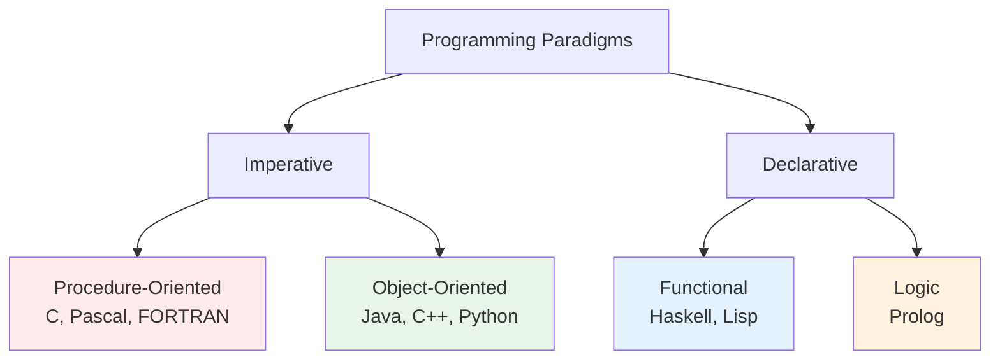
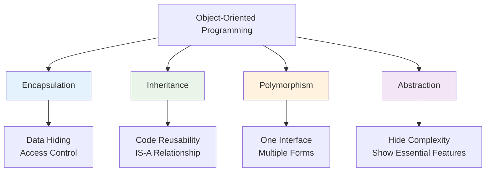
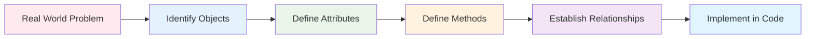

# Introduction to Object-Oriented Programming
## Lecture 9

**Java Programming (4343203)**  
Diploma in ICT - Semester IV  
Gujarat Technological University

<div class="pt-12">
  <span @click="$slidev.nav.next" class="px-2 py-1 rounded cursor-pointer" hover="bg-white bg-opacity-10">
    Press Space for next page <carbon:arrow-right class="inline"/>
  </span>
</div>

---
layout: default
---

# Learning Objectives

By the end of this lecture, you will be able to:

<v-clicks>

- 🔄 **Differentiate** between Procedure-Oriented and Object-Oriented Programming
- 🎯 **Understand** the core concepts of OOP
- 🏗️ **Identify** the advantages of OOP over traditional programming
- 🌍 **Recognize** real-world applications of OOP principles
- 📚 **Prepare** for classes and objects in Java
- 💡 **Appreciate** why Java is an OOP language

</v-clicks>

<br>

<div v-click="7" class="text-center text-2xl text-blue-600 font-bold">
Welcome to the world of objects! 🎯🏗️
</div>

---
layout: center
---

# What is Programming Paradigm?

<div class="text-center mb-8">
<h2 class="text-2xl font-bold mb-4">Programming Paradigm 📋</h2>
<p class="text-lg">A fundamental style or approach to programming and problem-solving</p>
</div>

<div class="flex justify-center">



</div>

<div class="mt-6 text-center">
<div class="bg-blue-50 p-4 rounded-lg inline-block">
<strong>Our Focus:</strong> Transition from Procedure-Oriented to Object-Oriented Programming
</div>
</div>

---
layout: default
---

# Procedure-Oriented Programming (POP)

<div class="grid grid-cols-2 gap-8">

<div>

## 🔧 POP Characteristics

<v-clicks>

- **Functions are primary units**
- **Top-down approach**
- **Global data sharing**
- **Sequential execution**
- **Data and functions are separate**
- **Problem decomposition into functions**

</v-clicks>

<div v-click="7">

## 📝 POP Example (C Language)

```c
#include <stdio.h>

// Global variables
int balance = 1000;
char account_holder[50] = "John Doe";

// Functions
void display_balance() {
    printf("Balance: %d\n", balance);
}

void withdraw(int amount) {
    if (balance >= amount) {
        balance -= amount;
        printf("Withdrawn: %d\n", amount);
    } else {
        printf("Insufficient funds\n");
    }
}

int main() {
    display_balance();
    withdraw(200);
    display_balance();
    return 0;
}
```

</div>

</div>

<div>

## ⚠️ POP Limitations

<v-clicks>

**Security Issues:**
- Global data accessible everywhere
- No data hiding mechanism
- Functions can modify any data

**Maintenance Problems:**
- Code duplication
- Difficult to modify
- Hard to debug large programs

**Scalability Issues:**
- Not suitable for large projects
- No code reusability
- Poor organization

</v-clicks>

<div v-click="12" class="mt-6 p-4 bg-red-50 rounded-lg">
<strong>💭 Think:</strong> What if we had 100 bank accounts? We'd need 100 global variables!
</div>

</div>

</div>

---
layout: default
---

# Object-Oriented Programming (OOP)

<div class="grid grid-cols-2 gap-8">

<div>

## 🎯 OOP Characteristics

<v-clicks>

- **Objects are primary units**
- **Bottom-up approach**
- **Data encapsulation**
- **Message passing between objects**
- **Data and methods together**
- **Problem decomposition into objects**

</v-clicks>

<div v-click="7">

## 🌍 Real-World Analogy

Think of a **Car** object:
- **Properties**: Color, Model, Speed, Fuel
- **Behaviors**: Start, Stop, Accelerate, Brake

The car **encapsulates** its data (properties) and provides **methods** to interact with it.

</div>

</div>

<div>

## 📝 OOP Example (Java)

```java
public class BankAccount {
    // Private data (encapsulated)
    private int balance;
    private String accountHolder;
    
    // Constructor
    public BankAccount(String name, int initialBalance) {
        this.accountHolder = name;
        this.balance = initialBalance;
    }
    
    // Methods to interact with data
    public void displayBalance() {
        System.out.println("Balance: " + balance);
    }
    
    public boolean withdraw(int amount) {
        if (balance >= amount) {
            balance -= amount;
            System.out.println("Withdrawn: " + amount);
            return true;
        } else {
            System.out.println("Insufficient funds");
            return false;
        }
    }
    
    // Getter method
    public int getBalance() {
        return balance;
    }
}

// Using the class
public class Main {
    public static void main(String[] args) {
        BankAccount account1 = new BankAccount("John", 1000);
        BankAccount account2 = new BankAccount("Alice", 1500);
        
        account1.displayBalance();
        account1.withdraw(200);
    }
}
```

</div>

</div>

---
layout: default
---

# POP vs OOP Detailed Comparison

| Aspect | Procedure-Oriented Programming | Object-Oriented Programming |
|--------|-------------------------------|----------------------------|
| **Primary Focus** | Functions and procedures | Objects and classes |
| **Problem Approach** | Top-down (divide into functions) | Bottom-up (identify objects) |
| **Data Security** | No data hiding, global access | Data encapsulation and hiding |
| **Data and Functions** | Separate entities | Combined in objects |
| **Code Reusability** | Limited (function reuse only) | High (inheritance, polymorphism) |
| **Maintenance** | Difficult for large programs | Easier to maintain and modify |
| **Real-world Modeling** | Difficult to model | Natural representation |
| **Programming Languages** | C, Pascal, FORTRAN, COBOL | Java, C++, Python, C# |
| **Complexity Handling** | Becomes complex for large projects | Better suited for complex applications |
| **Development Time** | Less for small programs | More initially, less for large systems |

<div class="mt-6 p-4 bg-blue-50 rounded-lg">
<strong>🎯 Key Insight:</strong> OOP provides a more natural way to model real-world problems!
</div>

---
layout: center
---

# Core OOP Concepts Overview

<div class="flex justify-center">



</div>

<div class="mt-8 grid grid-cols-2 gap-6">

<div class="bg-blue-50 p-4 rounded-lg">
<h3 class="font-bold text-blue-700">🔒 Encapsulation</h3>
<p class="text-sm">Bundling data and methods that operate on that data within a single unit</p>
</div>

<div class="bg-green-50 p-4 rounded-lg">
<h3 class="font-bold text-green-700">🧬 Inheritance</h3>
<p class="text-sm">Creating new classes based on existing classes to promote code reuse</p>
</div>

<div class="bg-yellow-50 p-4 rounded-lg">
<h3 class="font-bold text-yellow-700">🎭 Polymorphism</h3>
<p class="text-sm">Same interface, different implementations - objects behaving differently</p>
</div>

<div class="bg-purple-50 p-4 rounded-lg">
<h3 class="font-bold text-purple-700">🎯 Abstraction</h3>
<p class="text-sm">Hiding implementation details while exposing only essential features</p>
</div>

</div>

---
layout: default
---

# Real-World OOP Examples

<div class="grid grid-cols-2 gap-8">

<div>

## 🏫 University Management System

<v-clicks>

**Objects in the System:**
- **Student**: Roll number, name, grades
- **Teacher**: Employee ID, subject, salary  
- **Course**: Course code, credits, syllabus
- **Department**: Name, HOD, courses

**Relationships:**
- Student **enrolls in** Course
- Teacher **teaches** Course
- Course **belongs to** Department

**Benefits:**
- Each object manages its own data
- Easy to add new students/teachers
- Changes to one object don't affect others

</v-clicks>

</div>

<div>

## 🚗 Vehicle Management System

<v-clicks>

**Class Hierarchy:**
```java
Vehicle (Parent)
├── Car
│   ├── Sedan
│   └── SUV
├── Motorcycle
└── Truck
```

**Common Properties:**
- Engine type, fuel capacity, speed

**Specific Properties:**
- Car: Number of doors, AC
- Motorcycle: Handle type
- Truck: Load capacity

**Polymorphism Example:**
- All vehicles can `start()` and `stop()`
- Each implements it differently

</v-clicks>

</div>

</div>

---
layout: default
---

# Advantages of OOP

<div class="grid grid-cols-2 gap-8">

<div>

## ✅ Technical Advantages

<v-clicks>

**1. Modularity**
- Code organized in independent modules
- Easy to understand and maintain
- Parallel development possible

**2. Reusability**
- Classes can be reused in multiple projects
- Inheritance promotes code reuse
- Reduces development time

**3. Maintainability**
- Localized changes
- Easy to debug and fix
- Clear structure and organization

**4. Extensibility**
- Easy to add new features
- Minimal impact on existing code
- Flexible design

</v-clicks>

</div>

<div>

## 🎯 Business Advantages

<v-clicks>

**1. Faster Development**
- Reuse existing components
- Parallel team development
- Reduced coding effort

**2. Better Quality**
- Encapsulation reduces errors
- Testing individual objects
- Proven design patterns

**3. Cost Effective**
- Lower maintenance costs
- Easier updates and modifications
- Reduced time-to-market

**4. Scalability**
- Handles complex applications
- Easy to scale up or down
- Enterprise-ready architecture

</v-clicks>

</div>

</div>

<div v-click="9" class="mt-6 p-4 bg-green-50 rounded-lg">
<strong>🏆 Industry Fact:</strong> 90% of modern software applications use OOP principles!
</div>

---
layout: default
---

# OOP in Different Languages

<div class="grid grid-cols-2 gap-8">

<div>

## 🌍 OOP Language Support

| Language | OOP Support | Key Features |
|----------|-------------|--------------|
| **Java** | Pure OOP | Everything is an object |
| **C++** | Hybrid | OOP + Procedural |
| **Python** | Multi-paradigm | Dynamic OOP |
| **C#** | Pure OOP | .NET framework |
| **JavaScript** | Prototype-based | Dynamic objects |
| **Ruby** | Pure OOP | Everything is an object |

## 📊 Java's OOP Strength

- **Platform Independent** OOP
- **Automatic Memory Management**
- **Rich Class Libraries**
- **Strong Type System**
- **Enterprise Features**

</div>

<div>

## 🎯 Why Java for OOP?

<v-clicks>

**1. Pure Object-Oriented**
- Everything inherits from Object class
- No global functions (except main)
- Consistent OOP approach

**2. Simple and Clean**
- No multiple inheritance complexity
- Interfaces for multiple inheritance
- Garbage collection

**3. Platform Independent**
- Write once, run anywhere
- JVM handles platform differences
- Consistent behavior across platforms

**4. Enterprise Ready**
- Robust error handling
- Security features
- Extensive libraries

</v-clicks>

<div v-click="5" class="mt-6 p-4 bg-blue-50 rounded-lg">
<strong>💡 Fun Fact:</strong> Java was designed from the ground up to be object-oriented!
</div>

</div>

</div>

---
layout: default
---

# From Problem to Objects

## 🎯 Object-Oriented Analysis Process

<div class="flex justify-center mb-8">



</div>

**Example: Library Management System**

<div class="grid grid-cols-3 gap-6">

<div class="bg-blue-50 p-4 rounded-lg">
<h3 class="font-bold">📚 Book Object</h3>
<strong>Attributes:</strong>
<ul class="text-sm mt-2">
<li>• ISBN</li>
<li>• Title</li>
<li>• Author</li>
<li>• Available copies</li>
</ul>
<strong>Methods:</strong>
<ul class="text-sm mt-2">
<li>• checkOut()</li>
<li>• returnBook()</li>
<li>• getDetails()</li>
</ul>
</div>

<div class="bg-green-50 p-4 rounded-lg">
<h3 class="font-bold">👤 Member Object</h3>
<strong>Attributes:</strong>
<ul class="text-sm mt-2">
<li>• Member ID</li>
<li>• Name</li>
<li>• Books borrowed</li>
<li>• Membership date</li>
</ul>
<strong>Methods:</strong>
<ul class="text-sm mt-2">
<li>• borrowBook()</li>
<li>• returnBook()</li>
<li>• viewHistory()</li>
</ul>
</div>

<div class="bg-yellow-50 p-4 rounded-lg">
<h3 class="font-bold">🏛️ Library Object</h3>
<strong>Attributes:</strong>
<ul class="text-sm mt-2">
<li>• Name</li>
<li>• Address</li>
<li>• Books collection</li>
<li>• Members list</li>
</ul>
<strong>Methods:</strong>
<ul class="text-sm mt-2">
<li>• addBook()</li>
<li>• addMember()</li>
<li>• searchBook()</li>
</ul>
</div>

</div>

---
layout: default
---

# Simple Java OOP Example

## 👤 Student Class Implementation

<div class="grid grid-cols-2 gap-8">

<div>

```java
// Student.java
public class Student {
    // Attributes (data members)
    private String name;
    private int rollNumber;
    private String branch;
    private double percentage;
    
    // Constructor
    public Student(String name, int rollNumber, 
                  String branch, double percentage) {
        this.name = name;
        this.rollNumber = rollNumber;
        this.branch = branch;
        this.percentage = percentage;
    }
    
    // Methods (behaviors)
    public void displayDetails() {
        System.out.println("=== Student Details ===");
        System.out.println("Name: " + name);
        System.out.println("Roll Number: " + rollNumber);
        System.out.println("Branch: " + branch);
        System.out.println("Percentage: " + percentage + "%");
    }
    
    public char getGrade() {
        if (percentage >= 90) return 'A';
        else if (percentage >= 80) return 'B';
        else if (percentage >= 70) return 'C';
        else if (percentage >= 60) return 'D';
        else return 'F';
    }
    
    public boolean isEligibleForPlacement() {
        return percentage >= 65.0;
    }
}
```

</div>

<div>

```java
// Main.java
public class Main {
    public static void main(String[] args) {
        // Creating objects (instances)
        Student student1 = new Student(
            "Alice Johnson", 
            101, 
            "Computer Science", 
            87.5
        );
        
        Student student2 = new Student(
            "Bob Smith", 
            102, 
            "Information Technology", 
            92.3
        );
        
        Student student3 = new Student(
            "Charlie Brown", 
            103, 
            "Electronics", 
            76.8
        );
        
        // Using object methods
        student1.displayDetails();
        System.out.println("Grade: " + student1.getGrade());
        System.out.println("Placement Eligible: " + 
                         student1.isEligibleForPlacement());
        
        System.out.println("\n" + "=".repeat(30) + "\n");
        
        student2.displayDetails();
        System.out.println("Grade: " + student2.getGrade());
        System.out.println("Placement Eligible: " + 
                         student2.isEligibleForPlacement());
    }
}
```

<div class="mt-4 p-4 bg-green-50 rounded-lg">
<strong>🎯 Key Points:</strong>
<ul class="text-sm">
<li>• Each student object has its own data</li>
<li>• Methods operate on object's data</li>
<li>• Data is private (encapsulated)</li>
<li>• Objects interact through methods</li>
</ul>
</div>

</div>

</div>

---
layout: default
---

# OOP Design Principles

<div class="grid grid-cols-2 gap-8">

<div>

## 🎯 SOLID Principles (Preview)

<v-clicks>

**S - Single Responsibility**
- One class, one responsibility
- Student class only manages student data

**O - Open/Closed**
- Open for extension, closed for modification
- Add new features without changing existing code

**L - Liskov Substitution**
- Objects replaceable with instances of subtypes
- Inheritance should not break functionality

**I - Interface Segregation**
- Many specific interfaces better than one general
- Don't force classes to implement unused methods

**D - Dependency Inversion**
- Depend on abstractions, not concretions
- High-level modules shouldn't depend on low-level

</v-clicks>

</div>

<div>

## 🏗️ OOP Design Process

<v-clicks>

**1. Requirement Analysis**
- Understand the problem domain
- Identify actors and use cases

**2. Object Identification**
- Find nouns (potential objects)
- Find verbs (potential methods)

**3. Class Design**
- Define attributes and methods
- Establish relationships

**4. Implementation**
- Code the classes
- Test individual objects

**5. Integration**
- Combine objects to solve the problem
- Test the complete system

</v-clicks>

<div v-click="11" class="mt-6 p-4 bg-blue-50 rounded-lg">
<strong>💡 Remember:</strong> Good OOP design leads to maintainable, reusable, and scalable code!
</div>

</div>

</div>

---
layout: default
---

# Practical Exercise

## 🛠️ Design Your First OOP System

<div class="space-y-4">

<div class="bg-yellow-50 p-4 rounded-lg">
<strong>Task 1:</strong> Identify objects, attributes, and methods for a "College Management System"
</div>

<div class="bg-blue-50 p-4 rounded-lg">
<strong>Task 2:</strong> Compare procedural vs object-oriented approach for a "Banking System"
</div>

<div class="bg-green-50 p-4 rounded-lg">
<strong>Task 3:</strong> Create a simple class diagram for a "Vehicle Rental System"
</div>

<div class="bg-purple-50 p-4 rounded-lg">
<strong>Task 4:</strong> Write pseudocode for a "Book" class with appropriate encapsulation
</div>

</div>

## 🎯 Thinking Questions

1. **What objects would you identify in a hospital management system?**
2. **How would you model a social media platform using OOP?**
3. **What are the advantages of OOP for a large e-commerce application?**
4. **How does encapsulation improve code security?**

---
layout: default
---

# Common OOP Misconceptions

<div class="grid grid-cols-2 gap-8">

<div>

## ❌ Common Myths

<v-clicks>

**"OOP is just about classes"**
- OOP is about modeling real-world entities
- Focus on interactions between objects

**"OOP is always better"**
- Depends on the problem domain
- Simple scripts may not need OOP

**"More classes = better design"**
- Quality over quantity
- Each class should have a clear purpose

**"OOP is too complex for beginners"**
- Start with simple examples
- Build complexity gradually

</v-clicks>

</div>

<div>

## ✅ Reality Check

<v-clicks>

**OOP Requires Practice**
- Start with simple real-world examples
- Practice identifying objects and behaviors

**Good Design Takes Time**
- Initial designs may not be perfect
- Refactor and improve iteratively

**Balance is Key**
- Don't over-engineer simple problems
- Use OOP where it adds value

**Understanding Evolution**
- Learn from existing OOP systems
- Study well-designed frameworks

</v-clicks>

<div v-click="9" class="mt-6 p-4 bg-green-50 rounded-lg">
<strong>🌟 Success Tip:</strong> Think in terms of objects you interact with daily - car, phone, bank account!
</div>

</div>

</div>

---
layout: center
class: text-center
---

# Advanced OOP Concepts Deep Dive

## 🧬 Inheritance in Detail

<div class="grid grid-cols-2 gap-8">

<div>

### 🎯 Inheritance Fundamentals

<v-clicks>

**Definition:** Mechanism where a new class inherits properties and behaviors from an existing class.

**Terminology:**
- **Parent Class (Superclass):** Class being inherited from
- **Child Class (Subclass):** Class that inherits
- **IS-A Relationship:** Child IS-A type of Parent

**Inheritance Types:**
- **Single Inheritance:** One parent, one child
- **Multilevel Inheritance:** Chain of inheritance
- **Hierarchical Inheritance:** One parent, multiple children

</v-clicks>

</div>

<div>

### 📝 Inheritance Example

```java
// Parent class
public class Vehicle {
    protected String brand;
    protected String model;
    protected int year;
    protected double price;
    
    public Vehicle(String brand, String model, int year, double price) {
        this.brand = brand;
        this.model = model;
        this.year = year;
        this.price = price;
    }
    
    public void start() {
        System.out.println(brand + " " + model + " is starting...");
    }
    
    public void stop() {
        System.out.println(brand + " " + model + " has stopped.");
    }
    
    public void displayInfo() {
        System.out.println("Vehicle: " + brand + " " + model + " (" + year + ")");
        System.out.println("Price: $" + price);
    }
    
    public double calculateDepreciation(int years) {
        return price * Math.pow(0.85, years); // 15% per year
    }
}

// Child class
public class Car extends Vehicle {
    private int numberOfDoors;
    private String fuelType;
    private boolean hasAirConditioning;
    
    public Car(String brand, String model, int year, double price,
              int doors, String fuelType, boolean hasAC) {
        super(brand, model, year, price); // Call parent constructor
        this.numberOfDoors = doors;
        this.fuelType = fuelType;
        this.hasAirConditioning = hasAC;
    }
    
    // Method overriding
    @Override
    public void start() {
        System.out.println("Car " + brand + " " + model + " engine started!");
        if (hasAirConditioning) {
            System.out.println("Air conditioning activated.");
        }
    }
    
    // Additional methods specific to Car
    public void honk() {
        System.out.println("Beep! Beep!");
    }
    
    public void openTrunk() {
        System.out.println("Trunk opened.");
    }
    
    // Overriding parent method with additional functionality
    @Override
    public void displayInfo() {
        super.displayInfo(); // Call parent method
        System.out.println("Doors: " + numberOfDoors);
        System.out.println("Fuel Type: " + fuelType);
        System.out.println("Air Conditioning: " + (hasAirConditioning ? "Yes" : "No"));
    }
    
    // Car-specific depreciation calculation
    @Override
    public double calculateDepreciation(int years) {
        // Cars depreciate faster
        return price * Math.pow(0.80, years); // 20% per year
    }
}
```

</div>

</div>

---
layout: default
---

# Polymorphism Deep Dive

<div class="grid grid-cols-2 gap-8">

<div>

## 🎭 Polymorphism Types

<v-clicks>

**1. Runtime Polymorphism (Dynamic)**
- Method overriding
- Virtual method invocation
- "One interface, many implementations"

**2. Compile-time Polymorphism (Static)**
- Method overloading
- Operator overloading (limited in Java)
- Constructor overloading

**Key Benefits:**
- Code flexibility
- Extensibility
- Maintainability
- Dynamic behavior selection

</v-clicks>

### 🚀 Advanced Polymorphism Example

```java
public class PolymorphismDemo {
    public static void main(String[] args) {
        // Runtime polymorphism
        Vehicle[] vehicles = {
            new Car("Toyota", "Camry", 2023, 25000, 4, "Hybrid", true),
            new Motorcycle("Honda", "CBR600", 2023, 12000, "Sport"),
            new Truck("Ford", "F-150", 2023, 35000, 2.5)
        };
        
        // Same method call, different behavior
        for (Vehicle vehicle : vehicles) {
            vehicle.start();        // Polymorphic call
            vehicle.displayInfo();  // Different implementations
            
            // Type checking and casting
            if (vehicle instanceof Car) {
                Car car = (Car) vehicle;
                car.honk(); // Car-specific method
            } else if (vehicle instanceof Motorcycle) {
                Motorcycle bike = (Motorcycle) vehicle;
                bike.wheelie(); // Motorcycle-specific method
            }
            
            System.out.println("Depreciation after 3 years: $" + 
                             vehicle.calculateDepreciation(3));
            System.out.println("-".repeat(40));
        }
    }
}
```

</div>

<div>

## 🏍️ Additional Vehicle Classes

```java
public class Motorcycle extends Vehicle {
    private String bikeType; // Sport, Cruiser, Touring
    
    public Motorcycle(String brand, String model, int year, 
                     double price, String bikeType) {
        super(brand, model, year, price);
        this.bikeType = bikeType;
    }
    
    @Override
    public void start() {
        System.out.println("Motorcycle " + brand + " " + model + 
                          " roars to life!");
    }
    
    public void wheelie() {
        System.out.println("Performing a wheelie! 🏍️");
    }
    
    @Override
    public void displayInfo() {
        super.displayInfo();
        System.out.println("Bike Type: " + bikeType);
    }
}

public class Truck extends Vehicle {
    private double cargoCapacity; // in tons
    
    public Truck(String brand, String model, int year, 
                double price, double capacity) {
        super(brand, model, year, price);
        this.cargoCapacity = capacity;
    }
    
    @Override
    public void start() {
        System.out.println("Truck " + brand + " " + model + 
                          " diesel engine started!");
    }
    
    public void loadCargo(double weight) {
        if (weight <= cargoCapacity) {
            System.out.println("Loaded " + weight + " tons of cargo.");
        } else {
            System.out.println("Cannot load " + weight + 
                             " tons. Max capacity: " + cargoCapacity);
        }
    }
    
    @Override
    public void displayInfo() {
        super.displayInfo();
        System.out.println("Cargo Capacity: " + cargoCapacity + " tons");
    }
    
    // Trucks hold value better
    @Override
    public double calculateDepreciation(int years) {
        return price * Math.pow(0.88, years); // 12% per year
    }
}
```

### 🎯 Method Overloading Example

```java
public class Calculator {
    // Compile-time polymorphism
    public int add(int a, int b) {
        return a + b;
    }
    
    public int add(int a, int b, int c) {
        return a + b + c;
    }
    
    public double add(double a, double b) {
        return a + b;
    }
    
    public String add(String a, String b) {
        return a + b;
    }
}
```

</div>

</div>

---
layout: default
---

# Encapsulation and Access Control

<div class="grid grid-cols-2 gap-8">

<div>

## 🔒 Access Modifiers Deep Dive

<v-clicks>

**Access Control Levels:**

| Modifier | Class | Package | Subclass | World |
|----------|-------|---------|----------|---------|
| `public` | ✅ | ✅ | ✅ | ✅ |
| `protected` | ✅ | ✅ | ✅ | ❌ |
| `default` | ✅ | ✅ | ❌ | ❌ |
| `private` | ✅ | ❌ | ❌ | ❌ |

**Best Practices:**
- Keep data members private
- Use public methods for controlled access
- Protected for inheritance scenarios
- Package-private for internal APIs

</v-clicks>

### 🏦 Advanced Banking System

```java
public class BankAccount {
    // Private data - cannot be accessed directly
    private String accountNumber;
    private String accountHolderName;
    private double balance;
    private String accountType;
    private java.util.Date lastTransactionDate;
    private java.util.List<String> transactionHistory;
    
    // Constructor
    public BankAccount(String accountNumber, String holderName, 
                      String accountType, double initialBalance) {
        this.accountNumber = accountNumber;
        this.accountHolderName = holderName;
        this.accountType = accountType;
        this.balance = Math.max(0, initialBalance);
        this.lastTransactionDate = new java.util.Date();
        this.transactionHistory = new java.util.ArrayList<>();
        
        addTransaction("Account opened with balance: $" + initialBalance);
    }
    
    // Public methods for controlled access
    public boolean deposit(double amount) {
        if (amount <= 0) {
            System.out.println("Invalid deposit amount!");
            return false;
        }
        
        balance += amount;
        lastTransactionDate = new java.util.Date();
        addTransaction("Deposited: $" + amount + ". New balance: $" + balance);
        System.out.println("Successfully deposited $" + amount);
        return true;
    }
    
    public boolean withdraw(double amount) {
        if (amount <= 0) {
            System.out.println("Invalid withdrawal amount!");
            return false;
        }
        
        if (amount > balance) {
            System.out.println("Insufficient funds! Available balance: $" + balance);
            return false;
        }
        
        balance -= amount;
        lastTransactionDate = new java.util.Date();
        addTransaction("Withdrawn: $" + amount + ". New balance: $" + balance);
        System.out.println("Successfully withdrawn $" + amount);
        return true;
    }
    
    // Private helper method
    private void addTransaction(String transaction) {
        String timestamp = new java.text.SimpleDateFormat("yyyy-MM-dd HH:mm:ss")
                              .format(new java.util.Date());
        transactionHistory.add(timestamp + " - " + transaction);
    }
    
    // Getters (public read access)
    public double getBalance() { return balance; }
    public String getAccountNumber() { return accountNumber; }
    public String getAccountHolderName() { return accountHolderName; }
    public String getAccountType() { return accountType; }
    
    // No setters for critical data like balance (controlled modification only)
    
    public void printTransactionHistory() {
        System.out.println("\n=== Transaction History for " + accountHolderName + " ===");
        for (String transaction : transactionHistory) {
            System.out.println(transaction);
        }
    }
}
```

</div>

<div>

## 🛡️ Data Validation and Security

```java
// Demonstration of encapsulation benefits
public class EncapsulationDemo {
    public static void main(String[] args) {
        BankAccount account = new BankAccount(
            "ACC001", "Alice Johnson", "Savings", 1000.0
        );
        
        // Controlled access through methods
        System.out.println("Initial Balance: $" + account.getBalance());
        
        // Valid operations
        account.deposit(500.0);
        account.withdraw(200.0);
        
        // Invalid operations (will be rejected)
        account.deposit(-100.0);  // Negative amount
        account.withdraw(2000.0); // Insufficient funds
        
        // Direct access to balance is not possible
        // account.balance = 1000000; // Compilation error!
        
        account.printTransactionHistory();
        
        System.out.println("\nFinal Balance: $" + account.getBalance());
    }
}
```

### 🎯 Advanced Encapsulation Techniques

```java
public class SecureBankAccount extends BankAccount {
    private String pin;
    private boolean isLocked;
    private int failedAttempts;
    private static final int MAX_FAILED_ATTEMPTS = 3;
    
    public SecureBankAccount(String accountNumber, String holderName,
                           String accountType, double initialBalance, String pin) {
        super(accountNumber, holderName, accountType, initialBalance);
        this.pin = pin;
        this.isLocked = false;
        this.failedAttempts = 0;
    }
    
    public boolean authenticate(String enteredPin) {
        if (isLocked) {
            System.out.println("Account is locked due to multiple failed attempts!");
            return false;
        }
        
        if (pin.equals(enteredPin)) {
            failedAttempts = 0; // Reset on successful authentication
            return true;
        } else {
            failedAttempts++;
            if (failedAttempts >= MAX_FAILED_ATTEMPTS) {
                isLocked = true;
                System.out.println("Account locked after " + MAX_FAILED_ATTEMPTS + 
                                 " failed attempts!");
            } else {
                System.out.println("Incorrect PIN. Attempts remaining: " + 
                                 (MAX_FAILED_ATTEMPTS - failedAttempts));
            }
            return false;
        }
    }
    
    // Override withdraw to require authentication
    @Override
    public boolean withdraw(double amount) {
        System.out.print("Enter PIN for withdrawal: ");
        // In real application, use secure input method
        String enteredPin = "1234"; // Simulated input
        
        if (authenticate(enteredPin)) {
            return super.withdraw(amount);
        } else {
            System.out.println("Withdrawal failed due to authentication failure!");
            return false;
        }
    }
    
    public void unlockAccount(String masterPin) {
        if ("MASTER123".equals(masterPin)) {
            isLocked = false;
            failedAttempts = 0;
            System.out.println("Account unlocked successfully!");
        } else {
            System.out.println("Invalid master PIN!");
        }
    }
}
```

### 🔍 Benefits Demonstration

<div class="bg-green-50 p-4 rounded-lg">
<strong>🎯 Encapsulation Benefits:</strong>
<ul class="text-sm mt-2">
<li>• <strong>Data Protection:</strong> Internal state cannot be corrupted</li>
<li>• <strong>Validation:</strong> All data changes go through validation</li>
<li>• <strong>Maintainability:</strong> Internal implementation can change without affecting clients</li>
<li>• <strong>Security:</strong> Sensitive operations require proper authentication</li>
<li>• <strong>Debugging:</strong> Controlled access points make tracking easier</li>
</ul>
</div>

</div>

</div>

---
layout: default
---

# Abstraction and Interface Design

<div class="grid grid-cols-2 gap-8">

<div>

## 🎯 Abstract Classes

<v-clicks>

**Purpose:** Define a common interface for subclasses while providing some default implementation.

**Key Features:**
- Cannot be instantiated directly
- Can have abstract and concrete methods
- Can have instance variables
- Constructors allowed
- Single inheritance only

</v-clicks>

### 📝 Abstract Class Example

```java
public abstract class Shape {
    protected String color;
    protected double x, y; // Position
    
    // Constructor in abstract class
    public Shape(String color, double x, double y) {
        this.color = color;
        this.x = x;
        this.y = y;
    }
    
    // Abstract methods - must be implemented by subclasses
    public abstract double calculateArea();
    public abstract double calculatePerimeter();
    public abstract void draw();
    
    // Concrete methods - shared implementation
    public void move(double newX, double newY) {
        System.out.println("Moving " + this.getClass().getSimpleName() + 
                          " from (" + x + ", " + y + ") to (" + newX + ", " + newY + ")");
        this.x = newX;
        this.y = newY;
    }
    
    public String getColor() {
        return color;
    }
    
    public void setColor(String color) {
        this.color = color;
        System.out.println("Color changed to: " + color);
    }
    
    // Template method pattern
    public final void displayInfo() {
        System.out.println("\n=== " + this.getClass().getSimpleName() + " Information ===");
        System.out.println("Color: " + color);
        System.out.println("Position: (" + x + ", " + y + ")");
        System.out.println("Area: " + calculateArea());
        System.out.println("Perimeter: " + calculatePerimeter());
        draw();
    }
}

// Concrete implementations
public class Circle extends Shape {
    private double radius;
    
    public Circle(String color, double x, double y, double radius) {
        super(color, x, y);
        this.radius = radius;
    }
    
    @Override
    public double calculateArea() {
        return Math.PI * radius * radius;
    }
    
    @Override
    public double calculatePerimeter() {
        return 2 * Math.PI * radius;
    }
    
    @Override
    public void draw() {
        System.out.println("Drawing a " + color + " circle with radius " + radius);
        // ASCII art representation
        System.out.println("    ***    ");
        System.out.println("  *     *  ");
        System.out.println(" *       * ");
        System.out.println("  *     *  ");
        System.out.println("    ***    ");
    }
    
    // Additional methods specific to Circle
    public double getDiameter() {
        return 2 * radius;
    }
}

public class Rectangle extends Shape {
    private double width, height;
    
    public Rectangle(String color, double x, double y, double width, double height) {
        super(color, x, y);
        this.width = width;
        this.height = height;
    }
    
    @Override
    public double calculateArea() {
        return width * height;
    }
    
    @Override
    public double calculatePerimeter() {
        return 2 * (width + height);
    }
    
    @Override
    public void draw() {
        System.out.println("Drawing a " + color + " rectangle (" + width + "x" + height + ")");
        // ASCII art representation
        System.out.println("*********");
        System.out.println("*       *");
        System.out.println("*       *");
        System.out.println("*********");
    }
    
    public boolean isSquare() {
        return Math.abs(width - height) < 0.001; // Account for floating point precision
    }
}
```

</div>

<div>

## 🔌 Interfaces

<v-clicks>

**Purpose:** Define a contract that implementing classes must follow.

**Key Features:**
- All methods are implicitly public and abstract (before Java 8)
- Variables are implicitly public, static, and final
- Multiple inheritance supported
- Default and static methods (Java 8+)

</v-clicks>

### 📝 Interface Examples

```java
// Basic interface
public interface Drawable {
    void draw();
    void resize(double scale);
    
    // Default method (Java 8+)
    default void highlight() {
        System.out.println("Highlighting the drawable object");
    }
    
    // Static method (Java 8+)
    static void printDrawingInstructions() {
        System.out.println("1. Set position\n2. Set properties\n3. Call draw()");
    }
}

public interface Movable {
    void moveUp(double distance);
    void moveDown(double distance);
    void moveLeft(double distance);
    void moveRight(double distance);
    
    // Default implementation
    default void moveToOrigin() {
        System.out.println("Moving to origin (0, 0)");
    }
}

// Multiple inheritance through interfaces
public class Triangle extends Shape implements Drawable, Movable {
    private double side1, side2, side3;
    
    public Triangle(String color, double x, double y, 
                   double side1, double side2, double side3) {
        super(color, x, y);
        this.side1 = side1;
        this.side2 = side2;
        this.side3 = side3;
    }
    
    @Override
    public double calculateArea() {
        // Using Heron's formula
        double s = (side1 + side2 + side3) / 2;
        return Math.sqrt(s * (s - side1) * (s - side2) * (s - side3));
    }
    
    @Override
    public double calculatePerimeter() {
        return side1 + side2 + side3;
    }
    
    @Override
    public void draw() {
        System.out.println("Drawing a " + color + " triangle");
        System.out.println("   /\\   ");
        System.out.println("  /  \\  ");
        System.out.println(" /____\\ ");
    }
    
    @Override
    public void resize(double scale) {
        side1 *= scale;
        side2 *= scale;
        side3 *= scale;
        System.out.println("Triangle resized by factor: " + scale);
    }
    
    @Override
    public void moveUp(double distance) {
        y += distance;
        System.out.println("Moved up by " + distance);
    }
    
    @Override
    public void moveDown(double distance) {
        y -= distance;
        System.out.println("Moved down by " + distance);
    }
    
    @Override
    public void moveLeft(double distance) {
        x -= distance;
        System.out.println("Moved left by " + distance);
    }
    
    @Override
    public void moveRight(double distance) {
        x += distance;
        System.out.println("Moved right by " + distance);
    }
    
    public String getTriangleType() {
        if (side1 == side2 && side2 == side3) {
            return "Equilateral";
        } else if (side1 == side2 || side2 == side3 || side1 == side3) {
            return "Isosceles";
        } else {
            return "Scalene";
        }
    }
}
```

### 🎯 Advanced Interface Usage

```java
// Functional interface (Java 8+)
@FunctionalInterface
public interface ShapeCalculator {
    double calculate(Shape shape);
}

public class GeometryDemo {
    public static void main(String[] args) {
        Shape[] shapes = {
            new Circle("Red", 0, 0, 5),
            new Rectangle("Blue", 10, 10, 4, 6),
            new Triangle("Green", 5, 5, 3, 4, 5)
        };
        
        // Using lambda expressions with functional interface
        ShapeCalculator areaCalculator = shape -> shape.calculateArea();
        ShapeCalculator perimeterCalculator = shape -> shape.calculatePerimeter();
        
        double totalArea = 0;
        double totalPerimeter = 0;
        
        for (Shape shape : shapes) {
            shape.displayInfo();
            totalArea += areaCalculator.calculate(shape);
            totalPerimeter += perimeterCalculator.calculate(shape);
            
            // Using interface methods
            if (shape instanceof Drawable) {
                ((Drawable) shape).highlight();
                ((Drawable) shape).resize(1.2);
            }
            
            if (shape instanceof Movable) {
                ((Movable) shape).moveRight(2);
            }
        }
        
        System.out.println("\n=== Summary ===");
        System.out.println("Total Area: " + totalArea);
        System.out.println("Total Perimeter: " + totalPerimeter);
        
        // Static method call
        Drawable.printDrawingInstructions();
    }
}
```

</div>

</div>

---
layout: default
---

# Real-World OOP Case Study

## 🏥 Hospital Management System

<div class="grid grid-cols-2 gap-8">

<div>

### 🎯 System Analysis

<v-clicks>

**Identified Objects:**
- Person (Abstract base)
- Patient (Inherits Person)
- Doctor (Inherits Person)
- Nurse (Inherits Person)
- Department
- Appointment
- MedicalRecord
- Hospital

**Key Relationships:**
- Patient **has** MedicalRecord
- Doctor **works in** Department
- Appointment **involves** Patient and Doctor
- Hospital **contains** Departments

</v-clicks>

### 📝 Core Classes Implementation

```java
// Abstract base class
public abstract class Person {
    protected String id;
    protected String name;
    protected int age;
    protected String gender;
    protected String contactNumber;
    protected String address;
    protected java.util.Date dateOfBirth;
    
    public Person(String id, String name, int age, String gender,
                 String contactNumber, String address) {
        this.id = id;
        this.name = name;
        this.age = age;
        this.gender = gender;
        this.contactNumber = contactNumber;
        this.address = address;
        this.dateOfBirth = calculateDateOfBirth(age);
    }
    
    // Abstract method - each person type displays info differently
    public abstract void displayInfo();
    
    // Common behavior
    public void updateContactInfo(String newPhone, String newAddress) {
        this.contactNumber = newPhone;
        this.address = newAddress;
        System.out.println("Contact information updated for: " + name);
    }
    
    private java.util.Date calculateDateOfBirth(int age) {
        java.util.Calendar cal = java.util.Calendar.getInstance();
        cal.add(java.util.Calendar.YEAR, -age);
        return cal.getTime();
    }
    
    // Getters
    public String getId() { return id; }
    public String getName() { return name; }
    public int getAge() { return age; }
    public String getGender() { return gender; }
    public String getContactNumber() { return contactNumber; }
    public String getAddress() { return address; }
}

// Concrete implementation
public class Patient extends Person {
    private String patientType; // Inpatient, Outpatient, Emergency
    private java.util.List<String> medicalHistory;
    private java.util.List<String> allergies;
    private String emergencyContact;
    private double outstandingBill;
    
    public Patient(String id, String name, int age, String gender,
                  String contactNumber, String address, String patientType) {
        super(id, name, age, gender, contactNumber, address);
        this.patientType = patientType;
        this.medicalHistory = new java.util.ArrayList<>();
        this.allergies = new java.util.ArrayList<>();
        this.outstandingBill = 0.0;
    }
    
    @Override
    public void displayInfo() {
        System.out.println("\n=== Patient Information ===");
        System.out.println("Patient ID: " + id);
        System.out.println("Name: " + name);
        System.out.println("Age: " + age + " (" + gender + ")");
        System.out.println("Type: " + patientType);
        System.out.println("Contact: " + contactNumber);
        System.out.println("Address: " + address);
        System.out.println("Outstanding Bill: $" + outstandingBill);
        
        if (!allergies.isEmpty()) {
            System.out.println("Allergies: " + String.join(", ", allergies));
        }
        
        if (!medicalHistory.isEmpty()) {
            System.out.println("Recent Medical History:");
            for (int i = Math.max(0, medicalHistory.size() - 3); i < medicalHistory.size(); i++) {
                System.out.println("  • " + medicalHistory.get(i));
            }
        }
    }
    
    public void addMedicalRecord(String record) {
        String timestamp = new java.text.SimpleDateFormat("yyyy-MM-dd")
                              .format(new java.util.Date());
        medicalHistory.add(timestamp + ": " + record);
    }
    
    public void addAllergy(String allergy) {
        if (!allergies.contains(allergy)) {
            allergies.add(allergy);
            System.out.println("Added allergy: " + allergy + " for patient " + name);
        }
    }
    
    public void addToBill(double amount) {
        outstandingBill += amount;
        System.out.println("Added $" + amount + " to " + name + "'s bill. Total: $" + outstandingBill);
    }
    
    public boolean payBill(double amount) {
        if (amount <= outstandingBill) {
            outstandingBill -= amount;
            System.out.println(name + " paid $" + amount + ". Remaining: $" + outstandingBill);
            return true;
        } else {
            System.out.println("Payment amount exceeds outstanding bill!");
            return false;
        }
    }
}
```

</div>

<div>

### 👨‍⚕️ Doctor and Department Classes

```java
public class Doctor extends Person {
    private String specialization;
    private String licenseNumber;
    private int yearsOfExperience;
    private Department department;
    private java.util.List<String> availableTimeSlots;
    private double consultationFee;
    
    public Doctor(String id, String name, int age, String gender,
                 String contactNumber, String address, String specialization,
                 String licenseNumber, int experience, double fee) {
        super(id, name, age, gender, contactNumber, address);
        this.specialization = specialization;
        this.licenseNumber = licenseNumber;
        this.yearsOfExperience = experience;
        this.consultationFee = fee;
        this.availableTimeSlots = new java.util.ArrayList<>();
        initializeTimeSlots();
    }
    
    private void initializeTimeSlots() {
        // Default available slots
        availableTimeSlots.add("09:00-10:00");
        availableTimeSlots.add("10:00-11:00");
        availableTimeSlots.add("11:00-12:00");
        availableTimeSlots.add("14:00-15:00");
        availableTimeSlots.add("15:00-16:00");
        availableTimeSlots.add("16:00-17:00");
    }
    
    @Override
    public void displayInfo() {
        System.out.println("\n=== Doctor Information ===");
        System.out.println("Doctor ID: " + id);
        System.out.println("Name: Dr. " + name);
        System.out.println("Specialization: " + specialization);
        System.out.println("Experience: " + yearsOfExperience + " years");
        System.out.println("License: " + licenseNumber);
        System.out.println("Consultation Fee: $" + consultationFee);
        if (department != null) {
            System.out.println("Department: " + department.getName());
        }
        System.out.println("Available Slots: " + availableTimeSlots.size());
    }
    
    public boolean bookTimeSlot(String timeSlot) {
        if (availableTimeSlots.contains(timeSlot)) {
            availableTimeSlots.remove(timeSlot);
            System.out.println("Time slot " + timeSlot + " booked for Dr. " + name);
            return true;
        } else {
            System.out.println("Time slot " + timeSlot + " not available for Dr. " + name);
            return false;
        }
    }
    
    public void releaseTimeSlot(String timeSlot) {
        if (!availableTimeSlots.contains(timeSlot)) {
            availableTimeSlots.add(timeSlot);
            java.util.Collections.sort(availableTimeSlots);
            System.out.println("Time slot " + timeSlot + " released for Dr. " + name);
        }
    }
    
    public String prescribeMedicine(Patient patient, String symptoms) {
        String prescription = "Prescription for " + patient.getName() + ":\n";
        prescription += "Symptoms: " + symptoms + "\n";
        prescription += "Prescribed by: Dr. " + name + " (" + specialization + ")\n";
        prescription += "Date: " + new java.text.SimpleDateFormat("yyyy-MM-dd")
                                    .format(new java.util.Date()) + "\n";
        
        // Simple prescription logic based on specialization
        if (specialization.toLowerCase().contains("cardio")) {
            prescription += "Medication: Heart medication as per symptoms\n";
        } else if (specialization.toLowerCase().contains("neuro")) {
            prescription += "Medication: Neurological treatment as per symptoms\n";
        } else {
            prescription += "Medication: General treatment as per symptoms\n";
        }
        
        patient.addMedicalRecord("Consultation with Dr. " + name + " - " + symptoms);
        patient.addToBill(consultationFee);
        
        return prescription;
    }
    
    // Getters
    public String getSpecialization() { return specialization; }
    public double getConsultationFee() { return consultationFee; }
    public java.util.List<String> getAvailableTimeSlots() { return new java.util.ArrayList<>(availableTimeSlots); }
    public void setDepartment(Department dept) { this.department = dept; }
}

public class Department {
    private String name;
    private String head;
    private java.util.List<Doctor> doctors;
    private String location;
    private int capacity;
    
    public Department(String name, String location, int capacity) {
        this.name = name;
        this.location = location;
        this.capacity = capacity;
        this.doctors = new java.util.ArrayList<>();
    }
    
    public boolean addDoctor(Doctor doctor) {
        if (doctors.size() < capacity) {
            doctors.add(doctor);
            doctor.setDepartment(this);
            System.out.println("Dr. " + doctor.getName() + " added to " + name + " department");
            return true;
        } else {
            System.out.println("Department " + name + " is at full capacity!");
            return false;
        }
    }
    
    public java.util.List<Doctor> getDoctorsBySpecialization(String specialization) {
        java.util.List<Doctor> result = new java.util.ArrayList<>();
        for (Doctor doctor : doctors) {
            if (doctor.getSpecialization().toLowerCase().contains(specialization.toLowerCase())) {
                result.add(doctor);
            }
        }
        return result;
    }
    
    public void displayDepartmentInfo() {
        System.out.println("\n=== " + name + " Department ===");
        System.out.println("Location: " + location);
        System.out.println("Head: " + (head != null ? head : "Not assigned"));
        System.out.println("Doctors: " + doctors.size() + "/" + capacity);
        
        for (Doctor doctor : doctors) {
            System.out.println("  • Dr. " + doctor.getName() + " (" + doctor.getSpecialization() + ")");
        }
    }
    
    // Getters and setters
    public String getName() { return name; }
    public void setHead(String head) { this.head = head; }
    public java.util.List<Doctor> getDoctors() { return new java.util.ArrayList<>(doctors); }
}
```

</div>

</div>

---
layout: default
---

# Advanced OOP Patterns and Best Practices

<div class="grid grid-cols-2 gap-8">

<div>

## 🏗️ Design Patterns Introduction

<v-clicks>

**What are Design Patterns?**
- Reusable solutions to common problems
- Proven design templates
- Best practices in OOP design
- Language-independent concepts

**Categories:**
- **Creational:** Object creation patterns
- **Structural:** Object composition patterns
- **Behavioral:** Object interaction patterns

</v-clicks>

### 🔧 Singleton Pattern Example

```java
// Hospital Management - Only one instance should exist
public class Hospital {
    private static Hospital instance;
    private String name;
    private String address;
    private java.util.List<Department> departments;
    private java.util.List<Patient> patients;
    
    // Private constructor prevents instantiation
    private Hospital() {
        this.departments = new java.util.ArrayList<>();
        this.patients = new java.util.ArrayList<>();
        this.name = "City General Hospital";
        this.address = "123 Medical Center Dr";
    }
    
    // Thread-safe singleton implementation
    public static synchronized Hospital getInstance() {
        if (instance == null) {
            instance = new Hospital();
        }
        return instance;
    }
    
    public void addDepartment(Department department) {
        departments.add(department);
        System.out.println("Department " + department.getName() + " added to hospital");
    }
    
    public void registerPatient(Patient patient) {
        patients.add(patient);
        System.out.println("Patient " + patient.getName() + " registered");
    }
    
    public Patient findPatient(String patientId) {
        for (Patient patient : patients) {
            if (patient.getId().equals(patientId)) {
                return patient;
            }
        }
        return null;
    }
    
    public java.util.List<Doctor> findDoctorsBySpecialization(String specialization) {
        java.util.List<Doctor> result = new java.util.ArrayList<>();
        for (Department dept : departments) {
            result.addAll(dept.getDoctorsBySpecialization(specialization));
        }
        return result;
    }
    
    public void displayHospitalStats() {
        System.out.println("\n=== " + name + " Statistics ===");
        System.out.println("Address: " + address);
        System.out.println("Departments: " + departments.size());
        System.out.println("Registered Patients: " + patients.size());
        
        int totalDoctors = 0;
        for (Department dept : departments) {
            totalDoctors += dept.getDoctors().size();
        }
        System.out.println("Total Doctors: " + totalDoctors);
    }
}
```

### 🏭 Factory Pattern Example

```java
// Factory for creating different types of appointments
public abstract class AppointmentFactory {
    public static Appointment createAppointment(String type, Patient patient, 
                                              Doctor doctor, String date, String time) {
        switch (type.toLowerCase()) {
            case "consultation":
                return new ConsultationAppointment(patient, doctor, date, time);
            case "surgery":
                return new SurgeryAppointment(patient, doctor, date, time);
            case "checkup":
                return new CheckupAppointment(patient, doctor, date, time);
            case "emergency":
                return new EmergencyAppointment(patient, doctor, date, time);
            default:
                throw new IllegalArgumentException("Unknown appointment type: " + type);
        }
    }
}

// Base appointment class
public abstract class Appointment {
    protected String appointmentId;
    protected Patient patient;
    protected Doctor doctor;
    protected String date;
    protected String time;
    protected String status;
    protected double cost;
    
    public Appointment(Patient patient, Doctor doctor, String date, String time) {
        this.appointmentId = generateId();
        this.patient = patient;
        this.doctor = doctor;
        this.date = date;
        this.time = time;
        this.status = "Scheduled";
    }
    
    private String generateId() {
        return "APT" + System.currentTimeMillis() % 10000;
    }
    
    public abstract void conduct();
    public abstract String getAppointmentType();
    
    public void displayAppointmentInfo() {
        System.out.println("\n=== Appointment Details ===");
        System.out.println("ID: " + appointmentId);
        System.out.println("Type: " + getAppointmentType());
        System.out.println("Patient: " + patient.getName());
        System.out.println("Doctor: Dr. " + doctor.getName());
        System.out.println("Date: " + date + " at " + time);
        System.out.println("Status: " + status);
        System.out.println("Cost: $" + cost);
    }
}

// Concrete appointment types
public class ConsultationAppointment extends Appointment {
    public ConsultationAppointment(Patient patient, Doctor doctor, String date, String time) {
        super(patient, doctor, date, time);
        this.cost = doctor.getConsultationFee();
    }
    
    @Override
    public void conduct() {
        System.out.println("\nConducting consultation appointment...");
        status = "In Progress";
        
        // Simulate consultation
        System.out.println("Dr. " + doctor.getName() + " is consulting with " + patient.getName());
        
        // Add to patient's bill
        patient.addToBill(cost);
        
        status = "Completed";
        System.out.println("Consultation completed successfully!");
    }
    
    @Override
    public String getAppointmentType() {
        return "Consultation";
    }
}

public class EmergencyAppointment extends Appointment {
    private String urgencyLevel;
    
    public EmergencyAppointment(Patient patient, Doctor doctor, String date, String time) {
        super(patient, doctor, date, time);
        this.urgencyLevel = "High";
        this.cost = doctor.getConsultationFee() * 1.5; // Emergency surcharge
    }
    
    @Override
    public void conduct() {
        System.out.println("\n🚨 EMERGENCY APPOINTMENT 🚨");
        status = "In Progress";
        
        System.out.println("Urgency Level: " + urgencyLevel);
        System.out.println("Dr. " + doctor.getName() + " attending to emergency patient " + patient.getName());
        
        // Immediate treatment
        patient.addMedicalRecord("Emergency treatment by Dr. " + doctor.getName());
        patient.addToBill(cost);
        
        status = "Completed";
        System.out.println("Emergency treatment completed!");
    }
    
    @Override
    public String getAppointmentType() {
        return "Emergency";
    }
}
```

</div>

<div>

## 📋 OOP Best Practices

<v-clicks>

**1. Follow SOLID Principles**
- Single Responsibility Principle
- Open/Closed Principle
- Liskov Substitution Principle
- Interface Segregation Principle
- Dependency Inversion Principle

**2. Composition over Inheritance**
- Prefer "has-a" over "is-a"
- More flexible and maintainable
- Reduces coupling

**3. Encapsulation Best Practices**
- Keep data private
- Provide controlled access
- Validate inputs
- Hide implementation details

</v-clicks>

### 🎯 Complete Hospital Demo

```java
public class HospitalManagementDemo {
    public static void main(String[] args) {
        // Get hospital instance (Singleton)
        Hospital hospital = Hospital.getInstance();
        
        // Create departments
        Department cardiology = new Department("Cardiology", "Floor 3", 5);
        Department neurology = new Department("Neurology", "Floor 4", 3);
        Department emergency = new Department("Emergency", "Ground Floor", 10);
        
        hospital.addDepartment(cardiology);
        hospital.addDepartment(neurology);
        hospital.addDepartment(emergency);
        
        // Create doctors
        Doctor cardiologist = new Doctor("DOC001", "Sarah Johnson", 45, "Female",
                                       "555-0101", "123 Doctor St", "Cardiology",
                                       "LIC123456", 15, 200.0);
        
        Doctor neurologist = new Doctor("DOC002", "Michael Chen", 38, "Male",
                                      "555-0102", "456 Medical Ave", "Neurology",
                                      "LIC789012", 10, 250.0);
        
        Doctor emergencyDoc = new Doctor("DOC003", "Emily Rodriguez", 35, "Female",
                                       "555-0103", "789 Hospital Blvd", "Emergency Medicine",
                                       "LIC345678", 8, 180.0);
        
        // Add doctors to departments
        cardiology.addDoctor(cardiologist);
        neurology.addDoctor(neurologist);
        emergency.addDoctor(emergencyDoc);
        
        // Create patients
        Patient patient1 = new Patient("PAT001", "John Smith", 55, "Male",
                                     "555-1001", "123 Patient St", "Inpatient");
        patient1.addAllergy("Penicillin");
        patient1.addAllergy("Latex");
        
        Patient patient2 = new Patient("PAT002", "Maria Garcia", 42, "Female",
                                     "555-1002", "456 Patient Ave", "Outpatient");
        
        Patient emergencyPatient = new Patient("PAT003", "Robert Wilson", 65, "Male",
                                             "555-1003", "789 Patient Blvd", "Emergency");
        
        // Register patients
        hospital.registerPatient(patient1);
        hospital.registerPatient(patient2);
        hospital.registerPatient(emergencyPatient);
        
        // Display initial info
        hospital.displayHospitalStats();
        System.out.println("\n" + "=".repeat(50));
        
        // Create and conduct appointments using Factory pattern
        try {
            // Regular consultation
            Appointment consultation = AppointmentFactory.createAppointment(
                "consultation", patient1, cardiologist, "2024-01-15", "10:00-11:00"
            );
            consultation.displayAppointmentInfo();
            consultation.conduct();
            
            // Emergency appointment
            Appointment emergency = AppointmentFactory.createAppointment(
                "emergency", emergencyPatient, emergencyDoc, "2024-01-15", "14:00-15:00"
            );
            emergency.displayAppointmentInfo();
            emergency.conduct();
            
            // Neurological consultation
            Appointment neuroConsult = AppointmentFactory.createAppointment(
                "consultation", patient2, neurologist, "2024-01-16", "09:00-10:00"
            );
            neuroConsult.displayAppointmentInfo();
            neuroConsult.conduct();
            
        } catch (IllegalArgumentException e) {
            System.out.println("Error creating appointment: " + e.getMessage());
        }
        
        System.out.println("\n" + "=".repeat(50));
        
        // Display updated patient information
        patient1.displayInfo();
        patient2.displayInfo();
        emergencyPatient.displayInfo();
        
        // Department summaries
        cardiology.displayDepartmentInfo();
        neurology.displayDepartmentInfo();
        emergency.displayDepartmentInfo();
        
        // Final hospital statistics
        System.out.println("\n" + "=".repeat(50));
        hospital.displayHospitalStats();
        
        // Demonstrate polymorphism
        System.out.println("\n=== Polymorphism Demonstration ===");
        Person[] people = {patient1, cardiologist, emergencyDoc};
        for (Person person : people) {
            person.displayInfo(); // Different implementations called
        }
    }
}
```

### 🚀 Performance Considerations

<div class="bg-yellow-50 p-4 rounded-lg">
<strong>🎯 OOP Performance Tips:</strong>
<ul class="text-sm mt-2">
<li>• <strong>Object Creation:</strong> Reuse objects when possible</li>
<li>• <strong>Memory Management:</strong> Avoid memory leaks in collections</li>
<li>• <strong>Method Calls:</strong> Virtual method calls have slight overhead</li>
<li>• <strong>Inheritance Depth:</strong> Keep inheritance hierarchies shallow</li>
<li>• <strong>Interface Design:</strong> Use interfaces for loose coupling</li>
</ul>
</div>

### 🔒 Security Best Practices

<div class="bg-red-50 p-4 rounded-lg">
<strong>🛡️ OOP Security Guidelines:</strong>
<ul class="text-sm mt-2">
<li>• <strong>Access Modifiers:</strong> Use most restrictive access level</li>
<li>• <strong>Input Validation:</strong> Validate all inputs in setters</li>
<li>• <strong>Immutable Objects:</strong> Make objects immutable when possible</li>
<li>• <strong>Defensive Copying:</strong> Copy mutable objects in getters</li>
<li>• <strong>Sensitive Data:</strong> Clear sensitive data after use</li>
</ul>
</div>

</div>

</div>

---
layout: default
---

# Hands-On Programming Exercises

## 🛠️ Exercise 1: Banking System Enhancement

<div class="bg-blue-50 p-6 rounded-lg mb-6">
<h3 class="font-bold text-lg mb-4">📋 Task Description</h3>
<p>Extend the banking system with advanced features:</p>
<ul class="mt-2 space-y-1">
<li>• Create different account types (Savings, Current, Fixed Deposit)</li>
<li>• Implement interest calculation for each account type</li>
<li>• Add transaction history with timestamps</li>
<li>• Create a Bank class to manage multiple accounts</li>
<li>• Implement account transfer functionality</li>
</ul>
</div>

```java
// Exercise starter code
public abstract class Account {
    protected String accountNumber;
    protected String holderName;
    protected double balance;
    protected double interestRate;
    protected java.util.List<Transaction> transactions;
    
    // TODO: Implement constructor and basic methods
    
    public abstract double calculateInterest();
    public abstract boolean withdraw(double amount);
    
    // TODO: Add transaction history functionality
}

public class SavingsAccount extends Account {
    private double minimumBalance;
    
    // TODO: Implement savings account specific logic
    // - Minimum balance requirement
    // - Interest calculation (compound interest)
    // - Withdrawal restrictions
}

public class CurrentAccount extends Account {
    private double overdraftLimit;
    
    // TODO: Implement current account specific logic
    // - Overdraft facility
    // - No interest on balance
    // - Unlimited transactions
}

public class FixedDepositAccount extends Account {
    private int termInMonths;
    private java.util.Date maturityDate;
    
    // TODO: Implement FD specific logic
    // - Fixed term deposit
    // - Higher interest rate
    // - Penalty for early withdrawal
}

public class Transaction {
    // TODO: Design transaction class
    // - Transaction ID, type, amount, timestamp
    // - Source and destination accounts
}

public class Bank {
    // TODO: Implement bank management
    // - Account creation and management
    // - Inter-account transfers
    // - Interest calculation for all accounts
    // - Generate statements
}
```

## 🛠️ Exercise 2: Library Management System

<div class="bg-green-50 p-6 rounded-lg mb-6">
<h3 class="font-bold text-lg mb-4">📚 Task Description</h3>
<p>Create a comprehensive library management system:</p>
<ul class="mt-2 space-y-1">
<li>• Design Book, Member, and Library classes</li>
<li>• Implement book borrowing and return system</li>
<li>• Add fine calculation for overdue books</li>
<li>• Create different member types with different privileges</li>
<li>• Implement book reservation system</li>
</ul>
</div>

```java
// Exercise starter code
public abstract class LibraryItem {
    protected String itemId;
    protected String title;
    protected String author;
    protected boolean isAvailable;
    
    // TODO: Common functionality for all library items
}

public class Book extends LibraryItem {
    private String isbn;
    private String genre;
    private int totalCopies;
    private int availableCopies;
    
    // TODO: Book specific functionality
}

public abstract class Member {
    protected String memberId;
    protected String name;
    protected int maxBooksAllowed;
    protected int borrowedBooks;
    
    // TODO: Member management
    public abstract double calculateFine(int overdueDays);
}

public class StudentMember extends Member {
    // TODO: Student specific rules
    // - Lower fine rates
    // - Limited borrowing period
}

public class FacultyMember extends Member {
    // TODO: Faculty specific privileges
    // - Higher borrowing limits
    // - Longer borrowing period
}

public class Library {
    // TODO: Complete library management system
    // - Book inventory management
    // - Member registration
    // - Borrowing and returning logic
    // - Fine calculation and collection
    // - Reporting features
}
```

## 🛠️ Exercise 3: Vehicle Rental System

<div class="bg-purple-50 p-6 rounded-lg mb-6">
<h3 class="font-bold text-lg mb-4">🚗 Task Description</h3>
<p>Design a vehicle rental system with OOP principles:</p>
<ul class="mt-2 space-y-1">
<li>• Create vehicle hierarchy (Car, Motorcycle, Truck)</li>
<li>• Implement rental pricing based on vehicle type</li>
<li>• Add customer management with rental history</li>
<li>• Create booking and return functionality</li>
<li>• Implement damage assessment and billing</li>
</ul>
</div>

```java
// Exercise challenge - Design from scratch
// TODO: Create complete vehicle rental system
// Consider:
// - Vehicle categories and pricing
// - Customer types (Regular, Premium, Corporate)
// - Rental duration and mileage tracking
// - Insurance and damage handling
// - Payment processing
// - Reporting and analytics
```

---
layout: default
---

# OOP Debugging and Troubleshooting

<div class="grid grid-cols-2 gap-8">

<div>

## 🐛 Common OOP Mistakes

<v-clicks>

**1. Improper Inheritance Usage**
```java
// ❌ Wrong: Inheritance for code reuse only
class Employee {
    String name;
    void work() { System.out.println("Working..."); }
}

class Car extends Employee { // Wrong! Car is not an Employee
    String model;
}

// ✅ Correct: Use composition instead
class Car {
    String model;
    Employee driver; // Car HAS an Employee (driver)
}
```

**2. Breaking Encapsulation**
```java
// ❌ Wrong: Exposing internal state
class BankAccount {
    public double balance; // Direct access!
    
    public void withdraw(double amount) {
        balance -= amount; // No validation!
    }
}

// ✅ Correct: Proper encapsulation
class BankAccount {
    private double balance;
    
    public boolean withdraw(double amount) {
        if (amount > 0 && amount <= balance) {
            balance -= amount;
            return true;
        }
        return false;
    }
    
    public double getBalance() { return balance; }
}
```

**3. Violation of LSP (Liskov Substitution)**
```java
// ❌ Wrong: Subclass changes expected behavior
class Rectangle {
    protected int width, height;
    
    public void setWidth(int width) { this.width = width; }
    public void setHeight(int height) { this.height = height; }
    public int getArea() { return width * height; }
}

class Square extends Rectangle {
    @Override
    public void setWidth(int width) {
        this.width = this.height = width; // Changes both!
    }
    
    @Override
    public void setHeight(int height) {
        this.width = this.height = height; // Unexpected!
    }
}

// ✅ Better: Separate hierarchy or composition
abstract class Shape {
    public abstract int getArea();
}

class Rectangle extends Shape {
    private int width, height;
    // Proper implementation
}

class Square extends Shape {
    private int side;
    // Proper implementation
}
```

</v-clicks>

</div>

<div>

## 🔍 Debugging Techniques

<v-clicks>

**1. Object State Inspection**
```java
public class Student {
    private String name;
    private int age;
    private double gpa;
    
    // Debug method - remove in production
    public void debugPrint() {
        System.out.println("=== DEBUG: Student State ===");
        System.out.println("Name: " + name);
        System.out.println("Age: " + age);
        System.out.println("GPA: " + gpa);
        System.out.println("Object ID: " + this.hashCode());
        System.out.println("==========================");
    }
    
    @Override
    public String toString() {
        return String.format("Student{name='%s', age=%d, gpa=%.2f}", 
                           name, age, gpa);
    }
}
```

**2. Method Call Tracing**
```java
public class TrackedBankAccount {
    private double balance;
    private static int methodCallCount = 0;
    
    private void trace(String methodName) {
        methodCallCount++;
        System.out.println("[TRACE " + methodCallCount + "] " + 
                          methodName + " called on " + this);
    }
    
    public void deposit(double amount) {
        trace("deposit(" + amount + ")");
        if (amount > 0) {
            balance += amount;
            System.out.println("  -> Balance updated to: " + balance);
        } else {
            System.out.println("  -> Invalid amount rejected");
        }
    }
    
    public boolean withdraw(double amount) {
        trace("withdraw(" + amount + ")");
        if (amount > 0 && amount <= balance) {
            balance -= amount;
            System.out.println("  -> Withdrawal successful, balance: " + balance);
            return true;
        } else {
            System.out.println("  -> Withdrawal failed, balance: " + balance);
            return false;
        }
    }
}
```

**3. Inheritance Chain Analysis**
```java
public class InheritanceDebugger {
    public static void analyzeObject(Object obj) {
        System.out.println("=== Inheritance Analysis ===");
        Class<?> clazz = obj.getClass();
        
        // Print inheritance chain
        System.out.println("Inheritance Chain:");
        while (clazz != null) {
            System.out.println("  -> " + clazz.getSimpleName());
            clazz = clazz.getSuperclass();
        }
        
        // Print implemented interfaces
        System.out.println("\nImplemented Interfaces:");
        Class<?>[] interfaces = obj.getClass().getInterfaces();
        for (Class<?> intf : interfaces) {
            System.out.println("  -> " + intf.getSimpleName());
        }
        
        // Print methods
        System.out.println("\nPublic Methods:");
        java.lang.reflect.Method[] methods = obj.getClass().getMethods();
        for (java.lang.reflect.Method method : methods) {
            if (method.getDeclaringClass() != Object.class) {
                System.out.println("  -> " + method.getName());
            }
        }
        System.out.println("========================\n");
    }
    
    public static void main(String[] args) {
        TrackedBankAccount account = new TrackedBankAccount();
        analyzeObject(account);
        
        // Test with operations
        account.deposit(1000);
        account.withdraw(200);
        account.withdraw(1500); // Should fail
    }
}
```

</v-clicks>

### 🎯 Performance Profiling

```java
public class PerformanceProfiler {
    private static long startTime;
    private static java.util.Map<String, Long> methodTimes = 
        new java.util.HashMap<>();
    
    public static void startTiming(String methodName) {
        startTime = System.nanoTime();
    }
    
    public static void endTiming(String methodName) {
        long endTime = System.nanoTime();
        long duration = endTime - startTime;
        methodTimes.put(methodName, 
                       methodTimes.getOrDefault(methodName, 0L) + duration);
    }
    
    public static void printProfile() {
        System.out.println("\n=== Performance Profile ===");
        for (java.util.Map.Entry<String, Long> entry : methodTimes.entrySet()) {
            System.out.printf("%s: %.3f ms%n", 
                            entry.getKey(), 
                            entry.getValue() / 1_000_000.0);
        }
        System.out.println("=========================\n");
    }
}
```

</div>

</div>

---
layout: default
---

# Industry Applications and Case Studies

<div class="grid grid-cols-2 gap-8">

<div>

## 🌐 Real-World OOP Applications

<v-clicks>

**1. Enterprise Applications**
- **E-commerce Platforms:** Amazon, eBay
- **Banking Systems:** Core banking solutions
- **ERP Systems:** SAP, Oracle
- **CRM Software:** Salesforce, HubSpot

**2. Game Development**
- **Unity Engine:** Component-based architecture
- **Game Objects:** Players, NPCs, Items
- **Behavior Systems:** AI, Physics, Rendering

**3. Mobile Applications**
- **Android:** Activity, Fragment classes
- **iOS:** UIViewController, Model classes
- **Cross-platform:** React Native components

**4. Web Frameworks**
- **Spring Framework:** Dependency injection
- **Django:** Model-View-Template
- **Angular:** Component-based architecture

</v-clicks>

### 🎮 Game Development Example

```java
// Game engine OOP structure
public abstract class GameObject {
    protected String id;
    protected Vector2D position;
    protected Vector2D velocity;
    protected boolean active;
    protected java.util.List<Component> components;
    
    public GameObject(String id, Vector2D position) {
        this.id = id;
        this.position = position;
        this.velocity = new Vector2D(0, 0);
        this.active = true;
        this.components = new java.util.ArrayList<>();
    }
    
    public abstract void update(double deltaTime);
    public abstract void render(GraphicsContext g);
    
    public void addComponent(Component component) {
        components.add(component);
        component.setOwner(this);
    }
    
    public <T extends Component> T getComponent(Class<T> componentType) {
        for (Component component : components) {
            if (componentType.isInstance(component)) {
                return componentType.cast(component);
            }
        }
        return null;
    }
}

public class Player extends GameObject {
    private int health;
    private int score;
    private InputController inputController;
    
    public Player(String id, Vector2D position) {
        super(id, position);
        this.health = 100;
        this.score = 0;
        this.inputController = new InputController();
        
        // Add components
        addComponent(new PhysicsComponent());
        addComponent(new RenderComponent("player_sprite.png"));
        addComponent(new CollisionComponent(32, 32));
    }
    
    @Override
    public void update(double deltaTime) {
        // Handle input
        Vector2D input = inputController.getMovementInput();
        velocity.add(input.multiply(200 * deltaTime)); // 200 pixels/sec
        
        // Update position
        position.add(velocity.multiply(deltaTime));
        
        // Update components
        for (Component component : components) {
            component.update(deltaTime);
        }
        
        // Apply friction
        velocity.multiply(0.95);
    }
    
    @Override
    public void render(GraphicsContext g) {
        RenderComponent renderer = getComponent(RenderComponent.class);
        if (renderer != null) {
            renderer.render(g, position);
        }
        
        // Render UI
        g.drawText("Health: " + health, 10, 30);
        g.drawText("Score: " + score, 10, 50);
    }
    
    public void takeDamage(int damage) {
        health -= damage;
        if (health <= 0) {
            health = 0;
            active = false;
            // Trigger game over
        }
    }
    
    public void addScore(int points) {
        score += points;
    }
}

public class Enemy extends GameObject {
    private AIBehavior aiBehavior;
    private int health;
    private int damage;
    
    public Enemy(String id, Vector2D position, AIBehavior behavior) {
        super(id, position);
        this.aiBehavior = behavior;
        this.health = 50;
        this.damage = 10;
        
        addComponent(new PhysicsComponent());
        addComponent(new RenderComponent("enemy_sprite.png"));
        addComponent(new CollisionComponent(24, 24));
    }
    
    @Override
    public void update(double deltaTime) {
        // AI decision making
        Vector2D aiDirection = aiBehavior.getMovementDirection(this, deltaTime);
        velocity.add(aiDirection.multiply(100 * deltaTime));
        
        position.add(velocity.multiply(deltaTime));
        
        // Update components
        for (Component component : components) {
            component.update(deltaTime);
        }
    }
    
    @Override
    public void render(GraphicsContext g) {
        RenderComponent renderer = getComponent(RenderComponent.class);
        if (renderer != null) {
            renderer.render(g, position);
        }
        
        // Health bar
        double healthPercent = health / 50.0;
        g.fillRect(position.x - 16, position.y - 20, 32 * healthPercent, 4, Color.RED);
    }
}
```

</div>

<div>

## 🏢 Enterprise Architecture Patterns

<v-clicks>

**Model-View-Controller (MVC)**
- **Model:** Data and business logic
- **View:** User interface presentation
- **Controller:** User input handling

**Repository Pattern**
- **Data Access Layer:** Database operations
- **Business Layer:** Application logic
- **Presentation Layer:** User interface

**Dependency Injection**
- **Loose Coupling:** Objects depend on abstractions
- **Testability:** Easy to mock dependencies
- **Flexibility:** Runtime configuration

</v-clicks>

### 🏦 Enterprise Banking System

```java
// Repository pattern implementation
public interface AccountRepository {
    Account findById(String accountId);
    List<Account> findByCustomerId(String customerId);
    void save(Account account);
    void delete(String accountId);
}

public class DatabaseAccountRepository implements AccountRepository {
    private DatabaseConnection dbConnection;
    
    public DatabaseAccountRepository(DatabaseConnection connection) {
        this.dbConnection = connection;
    }
    
    @Override
    public Account findById(String accountId) {
        String sql = "SELECT * FROM accounts WHERE account_id = ?";
        // Database query implementation
        ResultSet rs = dbConnection.executeQuery(sql, accountId);
        return mapResultSetToAccount(rs);
    }
    
    @Override
    public List<Account> findByCustomerId(String customerId) {
        String sql = "SELECT * FROM accounts WHERE customer_id = ?";
        ResultSet rs = dbConnection.executeQuery(sql, customerId);
        return mapResultSetToAccountList(rs);
    }
    
    @Override
    public void save(Account account) {
        if (account.getId() == null) {
            // Insert new account
            String sql = "INSERT INTO accounts (customer_id, balance, account_type) VALUES (?, ?, ?)";
            dbConnection.executeUpdate(sql, account.getCustomerId(), 
                                     account.getBalance(), account.getAccountType());
        } else {
            // Update existing account
            String sql = "UPDATE accounts SET balance = ? WHERE account_id = ?";
            dbConnection.executeUpdate(sql, account.getBalance(), account.getId());
        }
    }
    
    private Account mapResultSetToAccount(ResultSet rs) {
        // Mapping logic
        return new Account(rs.getString("account_id"), 
                          rs.getString("customer_id"),
                          rs.getDouble("balance"),
                          rs.getString("account_type"));
    }
}

// Service layer with dependency injection
public class AccountService {
    private final AccountRepository accountRepository;
    private final TransactionRepository transactionRepository;
    private final NotificationService notificationService;
    
    // Constructor injection
    public AccountService(AccountRepository accountRepo, 
                         TransactionRepository transactionRepo,
                         NotificationService notificationService) {
        this.accountRepository = accountRepo;
        this.transactionRepository = transactionRepo;
        this.notificationService = notificationService;
    }
    
    @Transactional
    public boolean transferFunds(String fromAccountId, String toAccountId, double amount) {
        try {
            // Load accounts
            Account fromAccount = accountRepository.findById(fromAccountId);
            Account toAccount = accountRepository.findById(toAccountId);
            
            if (fromAccount == null || toAccount == null) {
                throw new AccountNotFoundException("One or both accounts not found");
            }
            
            // Validate transfer
            if (fromAccount.getBalance() < amount) {
                throw new InsufficientFundsException("Insufficient funds in source account");
            }
            
            // Perform transfer
            fromAccount.withdraw(amount);
            toAccount.deposit(amount);
            
            // Save changes
            accountRepository.save(fromAccount);
            accountRepository.save(toAccount);
            
            // Record transactions
            Transaction debitTransaction = new Transaction(
                fromAccountId, "DEBIT", amount, "Transfer to " + toAccountId
            );
            Transaction creditTransaction = new Transaction(
                toAccountId, "CREDIT", amount, "Transfer from " + fromAccountId
            );
            
            transactionRepository.save(debitTransaction);
            transactionRepository.save(creditTransaction);
            
            // Send notifications
            notificationService.sendTransferNotification(fromAccount, toAccount, amount);
            
            return true;
            
        } catch (Exception e) {
            // Log error
            System.err.println("Transfer failed: " + e.getMessage());
            // Rollback would be handled by @Transactional annotation
            return false;
        }
    }
    
    public AccountStatement generateStatement(String accountId, Date fromDate, Date toDate) {
        Account account = accountRepository.findById(accountId);
        List<Transaction> transactions = transactionRepository
            .findByAccountIdAndDateRange(accountId, fromDate, toDate);
        
        return new AccountStatement(account, transactions, fromDate, toDate);
    }
}

// Controller layer (MVC pattern)
@RestController
@RequestMapping("/api/accounts")
public class AccountController {
    private final AccountService accountService;
    
    @Autowired
    public AccountController(AccountService accountService) {
        this.accountService = accountService;
    }
    
    @PostMapping("/transfer")
    public ResponseEntity<TransferResponse> transferFunds(
            @RequestBody TransferRequest request) {
        
        boolean success = accountService.transferFunds(
            request.getFromAccountId(),
            request.getToAccountId(),
            request.getAmount()
        );
        
        if (success) {
            return ResponseEntity.ok(new TransferResponse("Transfer successful", true));
        } else {
            return ResponseEntity.badRequest()
                .body(new TransferResponse("Transfer failed", false));
        }
    }
    
    @GetMapping("/{accountId}/statement")
    public ResponseEntity<AccountStatement> getAccountStatement(
            @PathVariable String accountId,
            @RequestParam @DateTimeFormat(pattern = "yyyy-MM-dd") Date fromDate,
            @RequestParam @DateTimeFormat(pattern = "yyyy-MM-dd") Date toDate) {
        
        AccountStatement statement = accountService.generateStatement(
            accountId, fromDate, toDate
        );
        
        return ResponseEntity.ok(statement);
    }
}
```

### 🎯 Modern Development Trends

<div class="bg-blue-50 p-4 rounded-lg">
<strong>🚀 Current OOP Trends:</strong>
<ul class="text-sm mt-2">
<li>• <strong>Microservices:</strong> Domain-driven design with OOP</li>
<li>• <strong>Cloud Native:</strong> OOP in containerized environments</li>
<li>• <strong>Reactive Programming:</strong> Async OOP patterns</li>
<li>• <strong>AI/ML Integration:</strong> OOP for model management</li>
<li>• <strong>DevOps:</strong> Infrastructure as Code with OOP</li>
</ul>
</div>

</div>

</div>

---
layout: default
---

# Summary

<div class="grid grid-cols-2 gap-8 mt-8">

<div class="bg-blue-50 p-6 rounded-lg">
<h3 class="font-bold text-lg mb-4">📖 What We Learned</h3>
<ul class="text-left space-y-2">
<li>• Difference between POP and OOP paradigms</li>
<li>• Core OOP concepts: Encapsulation, Inheritance, Polymorphism, Abstraction</li>
<li>• Advanced OOP features: Abstract classes, Interfaces, Design patterns</li>
<li>• Real-world applications and case studies</li>
<li>• Best practices and common pitfalls</li>
<li>• Debugging and troubleshooting techniques</li>
<li>• Enterprise architecture patterns</li>
<li>• Hands-on programming exercises</li>
</ul>
</div>

<div class="bg-green-50 p-6 rounded-lg">
<h3 class="font-bold text-lg mb-4">🎯 Next Steps</h3>
<ul class="text-left space-y-2">
<li>• Practice with more complex OOP projects</li>
<li>• Study design patterns in depth</li>
<li>• Learn advanced Java OOP features</li>
<li>• Explore framework architectures</li>
<li>• Work on real-world OOP applications</li>
<li>• Master testing strategies for OOP code</li>
<li>• Study performance optimization techniques</li>
</ul>
</div>

</div>

<div class="mt-8 text-center">
<div class="text-2xl font-bold text-purple-600 mb-4">
You're now ready to think and code in objects! 🎯🏗️
</div>

<div class="bg-yellow-50 p-4 rounded-lg inline-block">
<strong>💡 Remember:</strong> OOP is not just about syntax—it's about modeling the real world in your code!
</div>
</div>

---
layout: center
class: text-center
---

# Questions & Discussion

<div class="text-6xl mb-8">❓</div>

<div class="text-xl mb-8">
Any questions about OOP concepts, POP vs OOP, or object-oriented thinking?
</div>

<div class="text-lg text-gray-600">
Next lecture: **OOP Fundamentals - Classes and Objects**
</div>

<div class="mt-8">
<span class="px-4 py-2 bg-blue-500 text-white rounded-lg">
Ready to create your first classes! 👏
</span>
</div>