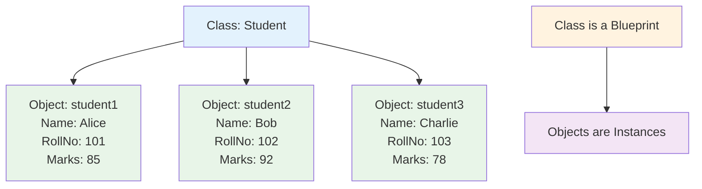
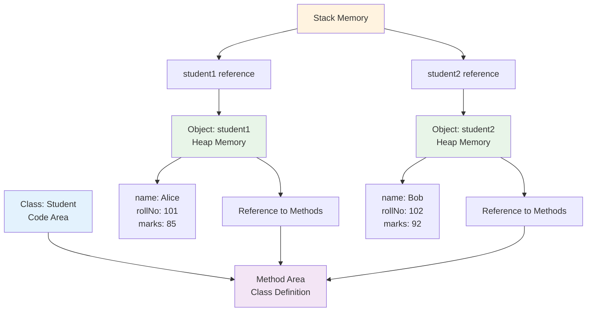

# Classes and Objects
## Lecture 11

**Java Programming (4343203)**  
Diploma in ICT - Semester IV  
Gujarat Technological University

<div class="pt-12">
  <span @click="$slidev.nav.next" class="px-2 py-1 rounded cursor-pointer" hover="bg-white bg-opacity-10">
    Press Space for next page <carbon:arrow-right class="inline"/>
  </span>
</div>

---
layout: default
---

# Learning Objectives

By the end of this lecture, you will be able to:

<v-clicks>

- 🏗️ **Define** classes with proper syntax and structure
- 🎯 **Create** objects and understand object instantiation
- 📊 **Implement** instance variables (fields) effectively
- 🔧 **Write** methods to define object behavior
- 🏭 **Practice** with required syllabus exercises
- 💡 **Apply** OOP principles in real programming scenarios

</v-clicks>

<br>

<div v-click="7" class="text-center text-2xl text-blue-600 font-bold">
Let's build our first Java classes! 🏗️🎯
</div>

---
layout: center
---

# Class and Object Relationship

<div class="flex justify-center">



</div>

<div class="mt-8 grid grid-cols-2 gap-6">

<div class="bg-blue-50 p-4 rounded-lg">
<h3 class="font-bold text-blue-700">📋 Class</h3>
<ul class="text-sm space-y-1">
<li>• Template or blueprint</li>
<li>• Defines structure and behavior</li>
<li>• No memory allocation</li>
<li>• Written once, used many times</li>
</ul>
</div>

<div class="bg-green-50 p-4 rounded-lg">
<h3 class="font-bold text-green-700">🎯 Object</h3>
<ul class="text-sm space-y-1">
<li>• Instance of a class</li>
<li>• Has actual data values</li>
<li>• Memory allocated</li>
<li>• Each object is unique</li>
</ul>
</div>

</div>

---
layout: default
---

# Defining a Class

<div class="grid grid-cols-2 gap-8">

<div>

## 🏗️ Class Syntax Structure

```java
[access_modifier] class ClassName {
    // Instance variables (fields)
    data_type variable1;
    data_type variable2;
    
    // Constructor(s)
    public ClassName() {
        // initialization code
    }
    
    // Methods
    return_type methodName() {
        // method body
    }
}
```

## 📋 Class Components

<v-clicks>

- **Class Declaration**: `class ClassName`
- **Instance Variables**: Store object state
- **Methods**: Define object behavior
- **Constructors**: Initialize objects

</v-clicks>

</div>

<div>

## 📝 Simple Class Example

```java
// Student.java
public class Student {
    // Instance variables (attributes)
    String enrollmentNo;
    String name;
    int age;
    String branch;
    double marks;
    
    // Method to display student details
    public void displayInfo() {
        System.out.println("=== Student Information ===");
        System.out.println("Enrollment No: " + enrollmentNo);
        System.out.println("Name: " + name);
        System.out.println("Age: " + age);
        System.out.println("Branch: " + branch);
        System.out.println("Marks: " + marks);
    }
    
    // Method to calculate grade
    public char getGrade() {
        if (marks >= 90) return 'A';
        else if (marks >= 80) return 'B';
        else if (marks >= 70) return 'C';
        else if (marks >= 60) return 'D';
        else return 'F';
    }
    
    // Method to check if passed
    public boolean hasPassed() {
        return marks >= 40;
    }
}
```

</div>

</div>

---
layout: default
---

# Creating Objects

<div class="grid grid-cols-2 gap-8">

<div>

## 🎯 Object Creation Syntax

```java
// Syntax: ClassName objectName = new ClassName();

// Step 1: Declaration
Student student1;

// Step 2: Instantiation
student1 = new Student();

// Combined (most common)
Student student2 = new Student();

// Multiple objects
Student alice = new Student();
Student bob = new Student();
Student charlie = new Student();
```

## 🔍 Memory Allocation

<v-clicks>

- **Declaration**: Creates reference variable
- **new keyword**: Allocates memory in heap
- **Constructor call**: Initializes the object
- **Reference assignment**: Points to object

</v-clicks>

</div>

<div>

## 📝 Syllabus Exercise: Student Class

```java
// Required: Create Student class with enrollmentNo and name
public class StudentDemo {
    public static void main(String[] args) {
        // Create 3 objects of Student class
        Student student1 = new Student();
        Student student2 = new Student();
        Student student3 = new Student();
        
        // Set data for student1
        student1.enrollmentNo = "21ICT001";
        student1.name = "Alice Johnson";
        student1.age = 19;
        student1.branch = "ICT";
        student1.marks = 87.5;
        
        // Set data for student2
        student2.enrollmentNo = "21ICT002";
        student2.name = "Bob Smith";
        student2.age = 20;
        student2.branch = "ICT";
        student2.marks = 92.3;
        
        // Set data for student3
        student3.enrollmentNo = "21ICT003";
        student3.name = "Charlie Brown";
        student3.age = 19;
        student3.branch = "ICT";
        student3.marks = 76.8;
        
        // Display student names (as required)
        System.out.println("Student Names:");
        System.out.println("1. " + student1.name);
        System.out.println("2. " + student2.name);
        System.out.println("3. " + student3.name);
        
        // Display complete information
        System.out.println("\n" + "=".repeat(40));
        student1.displayInfo();
        System.out.println("Grade: " + student1.getGrade());
        System.out.println("Passed: " + student1.hasPassed());
    }
}
```

</div>

</div>

---
layout: default
---

# Instance Variables (Fields)

<div class="grid grid-cols-2 gap-8">

<div>

## 📊 Understanding Instance Variables

<v-clicks>

- **Store object state/data**
- **Each object has its own copy**
- **Initialized with default values**
- **Accessible throughout the class**
- **Define object properties**

</v-clicks>

<div v-click="6">

## 🔍 Default Values

| Data Type | Default Value |
|-----------|---------------|
| **int** | 0 |
| **double** | 0.0 |
| **boolean** | false |
| **String** | null |
| **char** | '\u0000' |

</div>

</div>

<div>

## 📝 Instance Variables Example

```java
public class Rectangle {
    // Instance variables
    int length;     // Default: 0
    int width;      // Default: 0
    String color;   // Default: null
    boolean filled; // Default: false
    
    // Method to set dimensions
    public void setDimensions(int l, int w) {
        length = l;
        width = w;
    }
    
    // Method to calculate area
    public int calculateArea() {
        return length * width;
    }
    
    // Method to calculate perimeter
    public int calculatePerimeter() {
        return 2 * (length + width);
    }
    
    // Method to display rectangle info
    public void displayInfo() {
        System.out.println("Rectangle Details:");
        System.out.println("Length: " + length);
        System.out.println("Width: " + width);
        System.out.println("Color: " + color);
        System.out.println("Filled: " + filled);
        System.out.println("Area: " + calculateArea());
        System.out.println("Perimeter: " + calculatePerimeter());
    }
}
```

</div>

</div>

---
layout: default
---

# Methods in Classes

<div class="grid grid-cols-2 gap-8">

<div>

## 🔧 Method Structure

```java
[access_modifier] return_type methodName(parameters) {
    // method body
    // return statement (if needed)
}
```

## 📋 Method Types

<v-clicks>

**By Return Type:**
- **void methods**: No return value
- **value-returning methods**: Return a value

**By Parameters:**
- **No parameters**: `displayInfo()`
- **With parameters**: `setMarks(double marks)`

**By Purpose:**
- **Accessor methods**: Get data (getters)
- **Mutator methods**: Set data (setters)
- **Utility methods**: Perform calculations

</v-clicks>

</div>

<div>

## 📝 Method Examples

```java
public class BankAccount {
    String accountNumber;
    String holderName;
    double balance;
    
    // Setter method (mutator)
    public void setBalance(double amount) {
        if (amount >= 0) {
            balance = amount;
        } else {
            System.out.println("Invalid amount");
        }
    }
    
    // Getter method (accessor)
    public double getBalance() {
        return balance;
    }
    
    // Utility method with parameters
    public boolean withdraw(double amount) {
        if (amount > 0 && amount <= balance) {
            balance -= amount;
            return true;
        }
        return false;
    }
    
    // Utility method with return value
    public double calculateInterest(double rate) {
        return balance * rate / 100;
    }
    
    // void method for display
    public void displayAccountInfo() {
        System.out.println("Account: " + accountNumber);
        System.out.println("Holder: " + holderName);
        System.out.println("Balance: ₹" + balance);
    }
}
```

</div>

</div>

---
layout: default
---

# Syllabus Exercise: Rectangle Class

## 🏗️ Required Implementation

<div class="grid grid-cols-2 gap-8">

<div>

```java
// Rectangle.java - Syllabus requirement
public class Rectangle {
    // Instance variables for height and width
    int height;
    int width;
    
    // Method to set dimensions
    public void setDimensions(int h, int w) {
        height = h;
        width = w;
        System.out.println("Rectangle dimensions set:");
        System.out.println("Height: " + height);
        System.out.println("Width: " + width);
    }
    
    // Method to calculate area
    public int calculateArea() {
        return height * width;
    }
    
    // Method to calculate perimeter
    public int calculatePerimeter() {
        return 2 * (height + width);
    }
    
    // Method to check if it's a square
    public boolean isSquare() {
        return height == width;
    }
    
    // Method to display complete info
    public void displayInfo() {
        System.out.println("\n=== Rectangle Information ===");
        System.out.println("Height: " + height + " units");
        System.out.println("Width: " + width + " units");
        System.out.println("Area: " + calculateArea() + " sq units");
        System.out.println("Perimeter: " + calculatePerimeter() + " units");
        System.out.println("Is Square: " + isSquare());
    }
}
```

</div>

<div>

```java
// Main.java - Testing the Rectangle class
public class RectangleDemo {
    public static void main(String[] args) {
        // Create Rectangle objects
        Rectangle rect1 = new Rectangle();
        Rectangle rect2 = new Rectangle();
        Rectangle rect3 = new Rectangle();
        
        // Set dimensions for rectangles
        System.out.println("Creating Rectangle 1:");
        rect1.setDimensions(5, 10);
        
        System.out.println("\nCreating Rectangle 2:");
        rect2.setDimensions(7, 7);
        
        System.out.println("\nCreating Rectangle 3:");
        rect3.setDimensions(8, 12);
        
        // Display information for all rectangles
        rect1.displayInfo();
        rect2.displayInfo();
        rect3.displayInfo();
        
        // Compare areas
        System.out.println("\n=== Area Comparison ===");
        int area1 = rect1.calculateArea();
        int area2 = rect2.calculateArea();
        int area3 = rect3.calculateArea();
        
        System.out.println("Rectangle 1 area: " + area1);
        System.out.println("Rectangle 2 area: " + area2);
        System.out.println("Rectangle 3 area: " + area3);
        
        // Find largest rectangle
        if (area1 >= area2 && area1 >= area3) {
            System.out.println("Rectangle 1 has the largest area");
        } else if (area2 >= area1 && area2 >= area3) {
            System.out.println("Rectangle 2 has the largest area");
        } else {
            System.out.println("Rectangle 3 has the largest area");
        }
    }
}
```

</div>

</div>

---
layout: default
---

# Object Interaction and Communication

<div class="grid grid-cols-2 gap-8">

<div>

## 🔗 Objects Working Together

```java
// Course.java
public class Course {
    String courseCode;
    String courseName;
    int credits;
    
    public void setCourseInfo(String code, String name, int cr) {
        courseCode = code;
        courseName = name;
        credits = cr;
    }
    
    public void displayCourse() {
        System.out.println(courseCode + ": " + courseName + 
                         " (" + credits + " credits)");
    }
}

// Student.java (enhanced)
public class Student {
    String name;
    String rollNumber;
    Course[] enrolledCourses;
    int courseCount;
    
    public Student() {
        enrolledCourses = new Course[5]; // Max 5 courses
        courseCount = 0;
    }
    
    public void enrollInCourse(Course course) {
        if (courseCount < 5) {
            enrolledCourses[courseCount] = course;
            courseCount++;
            System.out.println(name + " enrolled in course: " + 
                             course.courseName);
        }
    }
    
    public void displayEnrolledCourses() {
        System.out.println(name + "'s enrolled courses:");
        for (int i = 0; i < courseCount; i++) {
            enrolledCourses[i].displayCourse();
        }
    }
}
```

</div>

<div>

## 📝 Using Object Interaction

```java
public class UniversityDemo {
    public static void main(String[] args) {
        // Create student object
        Student student = new Student();
        student.name = "Alice Johnson";
        student.rollNumber = "21ICT001";
        
        // Create course objects
        Course course1 = new Course();
        course1.setCourseInfo("ICT101", "Programming Fundamentals", 4);
        
        Course course2 = new Course();
        course2.setCourseInfo("ICT102", "Database Systems", 3);
        
        Course course3 = new Course();
        course3.setCourseInfo("ICT103", "Web Development", 3);
        
        // Student enrolls in courses
        student.enrollInCourse(course1);
        student.enrollInCourse(course2);
        student.enrollInCourse(course3);
        
        // Display student's courses
        System.out.println("\n" + "=".repeat(40));
        student.displayEnrolledCourses();
        
        // Calculate total credits
        int totalCredits = 0;
        for (int i = 0; i < student.courseCount; i++) {
            totalCredits += student.enrolledCourses[i].credits;
        }
        System.out.println("Total Credits: " + totalCredits);
    }
}
```

<div class="mt-4 p-4 bg-blue-50 rounded-lg">
<strong>🎯 Key Concept:</strong> Objects can contain and interact with other objects!
</div>

</div>

</div>

---
layout: default
---

# Real-World Class Design

## 🏭 Complete Class Example: Library Management

<div class="grid grid-cols-2 gap-8">

<div>

```java
// Book.java
public class Book {
    String isbn;
    String title;
    String author;
    String publisher;
    int totalCopies;
    int availableCopies;
    double price;
    
    // Initialize book data
    public void setBookInfo(String isbn, String title, 
                           String author, int copies, double price) {
        this.isbn = isbn;
        this.title = title;
        this.author = author;
        this.totalCopies = copies;
        this.availableCopies = copies;
        this.price = price;
    }
    
    // Issue a book
    public boolean issueBook() {
        if (availableCopies > 0) {
            availableCopies--;
            System.out.println("Book issued successfully");
            return true;
        } else {
            System.out.println("Book not available");
            return false;
        }
    }
    
    // Return a book
    public void returnBook() {
        if (availableCopies < totalCopies) {
            availableCopies++;
            System.out.println("Book returned successfully");
        } else {
            System.out.println("All copies already returned");
        }
    }
    
    // Check availability
    public boolean isAvailable() {
        return availableCopies > 0;
    }
}
```

</div>

<div>

```java
// Member.java
public class Member {
    String memberId;
    String name;
    String email;
    String phone;
    int booksIssued;
    int maxBooks;
    
    public Member() {
        booksIssued = 0;
        maxBooks = 3; // Default limit
    }
    
    public void setMemberInfo(String id, String name, 
                             String email, String phone) {
        this.memberId = id;
        this.name = name;
        this.email = email;
        this.phone = phone;
    }
    
    public boolean canIssueBook() {
        return booksIssued < maxBooks;
    }
    
    public void issueBookToMember() {
        if (canIssueBook()) {
            booksIssued++;
            System.out.println("Book issued to " + name);
        } else {
            System.out.println("Maximum book limit reached");
        }
    }
    
    public void returnBookFromMember() {
        if (booksIssued > 0) {
            booksIssued--;
            System.out.println("Book returned by " + name);
        }
    }
    
    public void displayMemberInfo() {
        System.out.println("Member ID: " + memberId);
        System.out.println("Name: " + name);
        System.out.println("Books Issued: " + booksIssued + "/" + maxBooks);
    }
}
```

</div>

</div>

---
layout: default
---

# Class Design Best Practices

<div class="grid grid-cols-2 gap-8">

<div>

## ✅ Good Practices

<v-clicks>

**Naming Conventions:**
- Class names: PascalCase (`StudentRecord`)
- Variable names: camelCase (`firstName`)
- Method names: camelCase (`calculateGrade`)
- Constants: UPPER_CASE (`MAX_STUDENTS`)

**Class Organization:**
- Instance variables first
- Constructors next
- Methods last
- Group related methods together

**Method Design:**
- Single responsibility per method
- Meaningful method names
- Appropriate return types
- Proper parameter validation

</v-clicks>

</div>

<div>

## 🎯 Design Principles

<v-clicks>

**Keep It Simple:**
- One class, one responsibility
- Avoid overly complex classes
- Clear and intuitive interfaces

**Data Protection:**
- Use appropriate access modifiers
- Validate input parameters
- Provide safe access methods

**Maintainability:**
- Add meaningful comments
- Use descriptive variable names
- Follow consistent formatting

**Reusability:**
- Design for reuse
- Avoid hard-coded values
- Make classes flexible

</v-clicks>

<div v-click="9" class="mt-6 p-4 bg-green-50 rounded-lg">
<strong>🌟 Remember:</strong> Good class design leads to maintainable and reusable code!
</div>

</div>

</div>

---
layout: default
---

# Hands-On Programming Exercise

## 🛠️ Build a Complete Class System

<div class="space-y-4">

<div class="bg-yellow-50 p-4 rounded-lg">
<strong>Task 1:</strong> Create a Student class with enrollmentNo and name, instantiate 3 objects (Syllabus requirement)
</div>

<div class="bg-blue-50 p-4 rounded-lg">
<strong>Task 2:</strong> Create a Rectangle class with height and width, initialize via constructor (Syllabus requirement)
</div>

<div class="bg-green-50 p-4 rounded-lg">
<strong>Task 3:</strong> Design a BankAccount class with account number, holder name, and balance with appropriate methods
</div>

<div class="bg-purple-50 p-4 rounded-lg">
<strong>Task 4:</strong> Create a Product class for an inventory system with proper object interactions
</div>

<div class="bg-orange-50 p-4 rounded-lg">
<strong>Task 5:</strong> Implement a Employee class with salary calculation and bonus methods
</div>

</div>

## 🎯 Success Criteria
- Proper class structure and naming
- Appropriate instance variables
- Well-designed methods
- Object creation and manipulation
- Real-world applicability

---
layout: default
---

# Common Mistakes and Solutions

<div class="grid grid-cols-2 gap-8">

<div>

## ❌ Common Mistakes

<v-clicks>

**Class Design Issues:**
```java
// Too many responsibilities
class StudentTeacherCourse {
    // Managing students, teachers, and courses
    // Violates single responsibility
}
```

**Variable Access:**
```java
Student s = new Student();
System.out.println(s.name); // Accessing uninitialized field
```

**Method Naming:**
```java
public void abc() { } // Meaningless name
public int xyz(int a, int b) { } // Unclear purpose
```

**Memory Issues:**
```java
Student s1 = new Student();
Student s2 = s1; // Both reference same object
s2.name = "John"; // Changes s1.name too
```

</v-clicks>

</div>

<div>

## ✅ Solutions

<v-clicks>

**Single Responsibility:**
```java
class Student { /* Only student-related data/methods */ }
class Teacher { /* Only teacher-related data/methods */ }
class Course  { /* Only course-related data/methods */ }
```

**Proper Initialization:**
```java
Student s = new Student();
s.name = "Alice";
s.enrollmentNo = "21ICT001";
System.out.println(s.name); // Safe access
```

**Meaningful Names:**
```java
public void displayStudentInfo() { }
public double calculateGPA(int[] marks) { }
```

**Independent Objects:**
```java
Student s1 = new Student();
Student s2 = new Student(); // Separate objects
s1.name = "Alice";
s2.name = "Bob"; // Independent data
```

</v-clicks>

</div>

</div>

---
layout: default
---

# Memory Model: Classes vs Objects

<div class="flex justify-center">



</div>

<div class="mt-6 grid grid-cols-3 gap-4">

<div class="bg-blue-50 p-3 rounded-lg text-center">
<h3 class="font-bold">📋 Method Area</h3>
<p class="text-sm">Class definitions stored</p>
</div>

<div class="bg-green-50 p-3 rounded-lg text-center">
<h3 class="font-bold">🏗️ Heap Memory</h3>
<p class="text-sm">Objects allocated here</p>
</div>

<div class="bg-yellow-50 p-3 rounded-lg text-center">
<h3 class="font-bold">📚 Stack Memory</h3>
<p class="text-sm">References stored here</p>
</div>

</div>

---
layout: center
class: text-center
---

# Summary

<div class="grid grid-cols-2 gap-8 mt-8">

<div class="bg-blue-50 p-6 rounded-lg">
<h3 class="font-bold text-lg mb-4">📖 What We Learned</h3>
<ul class="text-left space-y-2">
<li>• Class definition syntax and structure</li>
<li>• Object creation and instantiation</li>
<li>• Instance variables and their usage</li>
<li>• Method implementation and types</li>
<li>• Required syllabus exercises</li>
<li>• Object interaction and communication</li>
</ul>
</div>

<div class="bg-green-50 p-6 rounded-lg">
<h3 class="font-bold text-lg mb-4">🎯 Next Steps</h3>
<ul class="text-left space-y-2">
<li>• Access modifiers (public, private, protected)</li>
<li>• Data encapsulation and hiding</li>
<li>• Getter and setter methods</li>
<li>• Security and access control</li>
<li>• Professional class design</li>
</ul>
</div>

</div>

<div class="mt-8 text-2xl font-bold text-purple-600">
Classes and objects mastered! 🏗️🎯
</div>

---
layout: center
class: text-center
---

# Questions & Discussion

<div class="text-6xl mb-8">❓</div>

<div class="text-xl mb-8">
Any questions about classes, objects, instance variables, or methods?
</div>

<div class="text-lg text-gray-600">
Next lecture: **Access Modifiers and Data Protection**
</div>

<div class="mt-8">
<span class="px-4 py-2 bg-blue-500 text-white rounded-lg">
Ready to secure your classes! 👏
</span>
</div>