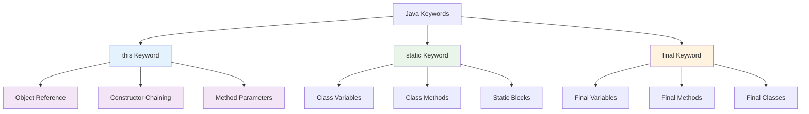
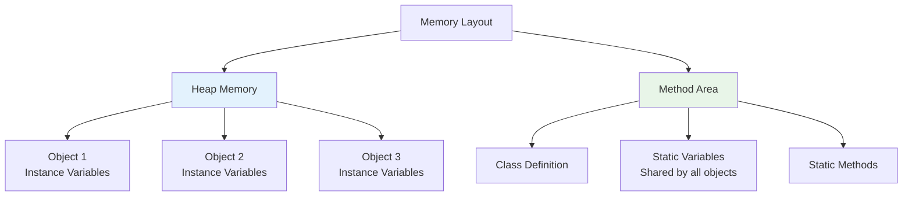

# Keywords - this, static, final
## Lecture 13

**Java Programming (4343203)**  
Diploma in ICT - Semester IV  
Gujarat Technological University

<div class="pt-12">
  <span @click="$slidev.nav.next" class="px-2 py-1 rounded cursor-pointer" hover="bg-white bg-opacity-10">
    Press Space for next page <carbon:arrow-right class="inline"/>
  </span>
</div>

---
layout: default
---

# Learning Objectives

By the end of this lecture, you will be able to:

<v-clicks>

- 🎯 **Master** the 'this' keyword for object self-reference
- 🏗️ **Understand** static members and class-level programming
- 🔒 **Apply** the 'final' keyword for immutability and constants
- 💡 **Differentiate** between instance and static contexts
- 🛠️ **Implement** utility classes and singleton patterns
- 📝 **Practice** with real-world examples and best practices

</v-clicks>

<br>

<div v-click="7" class="text-center text-2xl text-blue-600 font-bold">
Let's master Java's powerful keywords! 🎯🔑
</div>

---
layout: center
---

# Java Keywords Overview

<div class="flex justify-center">



</div>

<div class="mt-6 text-center">
<div class="bg-blue-50 p-4 rounded-lg inline-block">
<strong>Today's Focus:</strong> Understanding object identity, class-level programming, and immutability
</div>
</div>

---
layout: default
---

# The 'this' Keyword

<div class="grid grid-cols-2 gap-8">

<div>

## 🎯 What is 'this'?

<v-clicks>

- **Reference to the current object**
- **Distinguishes instance variables from parameters**
- **Enables method chaining**
- **Used in constructor chaining**
- **Clarifies code intent**

</v-clicks>

<div v-click="6">

## 📝 Basic 'this' Usage

```java
public class Student {
    private String name;
    private int age;
    
    // Constructor with parameters having same names
    public Student(String name, int age) {
        this.name = name;   // this.name refers to instance variable
        this.age = age;     // age without this refers to parameter
    }
    
    // Setter methods using this
    public void setName(String name) {
        this.name = name;   // Avoiding ambiguity
    }
    
    public void setAge(int age) {
        this.age = age;
    }
}
```

</div>

</div>

<div>

## 🔍 Without 'this' - Ambiguity Problem

```java
public class BadExample {
    private String name;
    private int age;
    
    public BadExample(String name, int age) {
        name = name;        // ❌ Parameter assigns to itself!
        age = age;          // ❌ Instance variable remains unchanged!
    }
    
    public void setName(String name) {
        name = name;        // ❌ No effect on instance variable!
    }
}

// Testing the problem
BadExample student = new BadExample("Alice", 20);
System.out.println(student.getName());  // null (not "Alice")
```

**Problems without 'this':**
- Parameter shadows instance variable
- Instance variables remain uninitialized
- Assignments have no effect
- Debugging becomes difficult

<div class="mt-4 p-4 bg-red-50 rounded-lg">
<strong>⚠️ Critical:</strong> Always use 'this' when parameter and instance variable names match!
</div>

</div>

</div>

---
layout: default
---

# Advanced 'this' Usage

<div class="grid grid-cols-2 gap-8">

<div>

## 🔗 Method Chaining with 'this'

```java
public class FluentStudent {
    private String name;
    private int age;
    private String course;
    private double gpa;
    
    // Method chaining pattern
    public FluentStudent setName(String name) {
        this.name = name;
        return this;        // Return current object
    }
    
    public FluentStudent setAge(int age) {
        this.age = age;
        return this;
    }
    
    public FluentStudent setCourse(String course) {
        this.course = course;
        return this;
    }
    
    public FluentStudent setGpa(double gpa) {
        this.gpa = gpa;
        return this;
    }
    
    public void displayInfo() {
        System.out.println("Student: " + name + ", Age: " + age + 
                          ", Course: " + course + ", GPA: " + gpa);
    }
}
```

</div>

<div>

## 🌊 Fluent Interface Usage

```java
public class ChainDemo {
    public static void main(String[] args) {
        // Traditional way (verbose)
        FluentStudent student1 = new FluentStudent();
        student1.setName("Alice");
        student1.setAge(20);
        student1.setCourse("Computer Science");
        student1.setGpa(3.8);
        student1.displayInfo();
        
        // Fluent interface (elegant)
        FluentStudent student2 = new FluentStudent()
            .setName("Bob")
            .setAge(21)
            .setCourse("Information Technology")
            .setGpa(3.9);
        
        student2.displayInfo();
        
        // One-liner creation and setup
        new FluentStudent()
            .setName("Charlie")
            .setAge(19)
            .setCourse("Software Engineering")
            .setGpa(3.7)
            .displayInfo();
    }
}
```

<div class="mt-4 p-4 bg-green-50 rounded-lg">
<strong>🚀 Benefits:</strong>
<ul class="text-sm mt-2">
<li>• More readable and concise code</li>
<li>• Popular in modern libraries (Builder pattern)</li>
<li>• Enables fluent APIs</li>
</ul>
</div>

</div>

</div>

---
layout: default
---

# Constructor Chaining with 'this'

<div class="grid grid-cols-2 gap-8">

<div>

## 🏗️ Constructor Overloading and Chaining

```java
public class Employee {
    private String name;
    private int employeeId;
    private String department;
    private double salary;
    private String email;
    
    // Primary constructor with all parameters
    public Employee(String name, int employeeId, String department, 
                   double salary, String email) {
        this.name = name;
        this.employeeId = employeeId;
        this.department = department;
        this.salary = salary;
        this.email = email;
    }
    
    // Constructor with default department
    public Employee(String name, int employeeId, double salary, String email) {
        this(name, employeeId, "General", salary, email);  // Call primary constructor
    }
    
    // Constructor with default department and email
    public Employee(String name, int employeeId, double salary) {
        this(name, employeeId, salary, name.toLowerCase().replace(" ", ".") + "@company.com");
    }
    
    // Constructor with minimal parameters
    public Employee(String name, int employeeId) {
        this(name, employeeId, 30000.0);  // Default salary
    }
}
```

</div>

<div>

## 🎯 Constructor Chaining Benefits

```java
public class EmployeeDemo {
    public static void main(String[] args) {
        // Different ways to create Employee objects
        
        // Full specification
        Employee emp1 = new Employee("Alice Johnson", 101, "IT", 75000, "alice.johnson@company.com");
        
        // Default department
        Employee emp2 = new Employee("Bob Smith", 102, 68000, "bob.smith@company.com");
        
        // Default department and auto-generated email
        Employee emp3 = new Employee("Charlie Brown", 103, 72000);
        
        // Minimal information with defaults
        Employee emp4 = new Employee("Diana Prince", 104);
        
        // Display all employees
        emp1.displayInfo();
        emp2.displayInfo();
        emp3.displayInfo();
        emp4.displayInfo();
    }
}
```

**Constructor Chaining Rules:**
- `this()` call must be the first statement in constructor
- Cannot call `this()` and `super()` in same constructor
- Prevents code duplication
- Ensures consistent initialization

<div class="mt-4 p-4 bg-blue-50 rounded-lg">
<strong>💡 Best Practice:</strong> Use constructor chaining to avoid code duplication and ensure consistent object initialization!
</div>

</div>

</div>

---
layout: default
---

# The 'static' Keyword

<div class="grid grid-cols-2 gap-8">

<div>

## 🏗️ Class-Level Programming

<v-clicks>

- **Belongs to the class, not instances**
- **Shared among all objects**
- **Can be accessed without creating objects**
- **Memory efficient for common data**
- **Used for utility methods and constants**

</v-clicks>

<div v-click="6">

## 📊 Instance vs Static Memory



</div>

</div>

<div>

## 📝 Static Variables Example

```java
public class Student {
    // Static variable - shared by all students
    private static int totalStudents = 0;
    private static String schoolName = "GTU Engineering College";
    
    // Instance variables - unique per student
    private String name;
    private int rollNumber;
    
    public Student(String name, int rollNumber) {
        this.name = name;
        this.rollNumber = rollNumber;
        totalStudents++;        // Increment for each new student
    }
    
    // Static method - accessible without object
    public static int getTotalStudents() {
        return totalStudents;
    }
    
    public static String getSchoolName() {
        return schoolName;
    }
    
    // Instance method
    public void displayInfo() {
        System.out.println("Name: " + name);
        System.out.println("Roll: " + rollNumber);
        System.out.println("School: " + schoolName);  // Can access static
        System.out.println("Total Students: " + totalStudents);
    }
}
```

</div>

</div>

---
layout: default
---

# Static Methods and Utility Classes

<div class="grid grid-cols-2 gap-8">

<div>

## 🛠️ Utility Class Design

```java
public class MathUtils {
    // Static constants
    public static final double PI = 3.14159265359;
    public static final double E = 2.71828182846;
    
    // Private constructor to prevent instantiation
    private MathUtils() {
        throw new AssertionError("Utility class cannot be instantiated");
    }
    
    // Static utility methods
    public static double calculateCircleArea(double radius) {
        return PI * radius * radius;
    }
    
    public static double calculateCirclePerimeter(double radius) {
        return 2 * PI * radius;
    }
    
    public static boolean isPrime(int number) {
        if (number <= 1) return false;
        if (number <= 3) return true;
        if (number % 2 == 0 || number % 3 == 0) return false;
        
        for (int i = 5; i * i <= number; i += 6) {
            if (number % i == 0 || number % (i + 2) == 0) {
                return false;
            }
        }
        return true;
    }
    
    public static int factorial(int n) {
        if (n < 0) throw new IllegalArgumentException("Negative numbers not allowed");
        if (n <= 1) return 1;
        
        int result = 1;
        for (int i = 2; i <= n; i++) {
            result *= i;
        }
        return result;
    }
}
```

</div>

<div>

## 🎯 Using Static Utilities

```java
public class MathUtilsDemo {
    public static void main(String[] args) {
        // No object creation needed - call directly on class
        
        // Circle calculations
        double radius = 5.0;
        double area = MathUtils.calculateCircleArea(radius);
        double perimeter = MathUtils.calculateCirclePerimeter(radius);
        
        System.out.println("Circle with radius " + radius + ":");
        System.out.println("Area: " + area);
        System.out.println("Perimeter: " + perimeter);
        
        // Prime number checking
        int[] numbers = {17, 25, 29, 33, 37};
        System.out.println("\nPrime number check:");
        for (int num : numbers) {
            System.out.println(num + " is prime: " + MathUtils.isPrime(num));
        }
        
        // Factorial calculations
        System.out.println("\nFactorial calculations:");
        for (int i = 0; i <= 10; i++) {
            System.out.println(i + "! = " + MathUtils.factorial(i));
        }
        
        // Using constants
        System.out.println("\nMath constants:");
        System.out.println("PI = " + MathUtils.PI);
        System.out.println("E = " + MathUtils.E);
    }
}
```

<div class="mt-4 p-4 bg-green-50 rounded-lg">
<strong>🎯 Benefits of Static Utilities:</strong>
<ul class="text-sm mt-2">
<li>• No object creation overhead</li>
<li>• Globally accessible functionality</li>
<li>• Memory efficient</li>
<li>• Clear intent (stateless operations)</li>
</ul>
</div>

</div>

</div>

---
layout: default
---

# Static Blocks and Initialization

<div class="grid grid-cols-2 gap-8">

<div>

## ⚡ Static Block Execution

```java
public class DatabaseConfig {
    // Static variables
    private static String databaseUrl;
    private static String username;
    private static boolean isConnected;
    
    // Static block - executed when class is first loaded
    static {
        System.out.println("Loading database configuration...");
        
        // Complex initialization logic
        databaseUrl = loadConfigProperty("db.url", "localhost:5432");
        username = loadConfigProperty("db.username", "admin");
        
        // Attempt connection
        try {
            establishConnection();
            isConnected = true;
            System.out.println("Database connection established successfully!");
        } catch (Exception e) {
            isConnected = false;
            System.out.println("Failed to connect to database: " + e.getMessage());
        }
    }
    
    // Helper methods for static block
    private static String loadConfigProperty(String key, String defaultValue) {
        // Simulate loading from configuration file
        System.out.println("Loading property: " + key);
        return defaultValue;  // In real app, would read from file/environment
    }
    
    private static void establishConnection() throws Exception {
        // Simulate database connection
        System.out.println("Connecting to database at: " + databaseUrl);
        Thread.sleep(100);  // Simulate connection delay
    }
    
    // Static methods to access configuration
    public static String getDatabaseUrl() {
        return databaseUrl;
    }
    
    public static boolean isConnected() {
        return isConnected;
    }
}
```

</div>

<div>

## 🔄 Static Block Execution Order

```java
public class InitializationDemo {
    // Static variable with direct initialization
    private static String message1 = initMessage1();
    
    // Static block 1
    static {
        System.out.println("Static block 1 executed");
        message2 = "Initialized in static block 1";
    }
    
    // Another static variable
    private static String message2;
    
    // Static block 2
    static {
        System.out.println("Static block 2 executed");
        message3 = "Initialized in static block 2";
    }
    
    private static String message3;
    
    // Static method for initialization
    private static String initMessage1() {
        System.out.println("Static method initMessage1() called");
        return "Initialized by static method";
    }
    
    public static void displayMessages() {
        System.out.println("Message 1: " + message1);
        System.out.println("Message 2: " + message2);
        System.out.println("Message 3: " + message3);
    }
    
    public static void main(String[] args) {
        System.out.println("Main method started");
        
        // First access to class triggers static initialization
        InitializationDemo.displayMessages();
        
        // Check database configuration
        System.out.println("\nDatabase Status:");
        System.out.println("URL: " + DatabaseConfig.getDatabaseUrl());
        System.out.println("Connected: " + DatabaseConfig.isConnected());
    }
}
```

**Execution Order:**
1. Static variables in declaration order
2. Static blocks in declaration order
3. Class is ready for use

</div>

</div>

---
layout: default
---

# Static Context Restrictions

<div class="grid grid-cols-2 gap-8">

<div>

## ⚠️ Static Method Limitations

```java
public class StaticRestrictions {
    private String instanceVariable = "Instance";
    private static String staticVariable = "Static";
    
    // Instance method - can access everything
    public void instanceMethod() {
        System.out.println(instanceVariable);    // ✅ OK
        System.out.println(staticVariable);      // ✅ OK
        this.anotherInstanceMethod();            // ✅ OK
        StaticRestrictions.staticMethod();       // ✅ OK
    }
    
    // Static method - restricted access
    public static void staticMethod() {
        // System.out.println(instanceVariable);   // ❌ Cannot access
        System.out.println(staticVariable);         // ✅ OK
        
        // this.anotherInstanceMethod();           // ❌ Cannot use 'this'
        // anotherInstanceMethod();                // ❌ Cannot call instance method
        
        StaticRestrictions.anotherStaticMethod();   // ✅ OK
        anotherStaticMethod();                      // ✅ OK (same class)
        
        // To access instance members, need object reference
        StaticRestrictions obj = new StaticRestrictions();
        System.out.println(obj.instanceVariable);  // ✅ OK with object
        obj.anotherInstanceMethod();               // ✅ OK with object
    }
    
    public void anotherInstanceMethod() {
        System.out.println("Another instance method");
    }
    
    public static void anotherStaticMethod() {
        System.out.println("Another static method");
    }
}
```

</div>

<div>

## 🎯 Common Static Mistakes

```java
public class CommonMistakes {
    private int count = 0;
    private static int totalCount = 0;
    
    // ❌ WRONG: Trying to initialize static with instance data
    // private static int wrongInit = count;  // Compilation error!
    
    // ✅ CORRECT: Static initialized with static or constants
    private static int correctInit = 100;
    
    public void instanceMethod() {
        count++;            // ✅ Instance method can modify instance variable
        totalCount++;       // ✅ Instance method can modify static variable
    }
    
    public static void staticMethod() {
        // count++;         // ❌ Static method cannot access instance variable
        totalCount++;       // ✅ Static method can modify static variable
        
        // Creating object to access instance members
        CommonMistakes obj = new CommonMistakes();
        obj.count++;        // ✅ OK with object reference
    }
    
    // ❌ WRONG: Instance variable dependent on static
    private String message = "Total: " + totalCount;  // Problematic!
    
    // ✅ CORRECT: Calculate in method when needed
    public String getMessage() {
        return "Total: " + totalCount;
    }
}
```

<div class="mt-4 p-4 bg-red-50 rounded-lg">
<strong>⚠️ Remember:</strong> Static context cannot access instance members directly - they belong to objects, not the class!
</div>

</div>

</div>

---
layout: default
---

# The 'final' Keyword

<div class="grid grid-cols-2 gap-8">

<div>

## 🔒 Immutability and Constants

<v-clicks>

- **final variables** - cannot be reassigned
- **final methods** - cannot be overridden
- **final classes** - cannot be extended
- **Ensures immutability** and design integrity
- **Improves performance** through optimization

</v-clicks>

<div v-click="6">

## 📝 Final Variables

```java
public class FinalVariables {
    // Final instance variable - must be initialized
    private final String id;
    private final long creationTime;
    
    // Final static variable - class constant
    public static final String APPLICATION_NAME = "Student Management System";
    public static final double VERSION = 1.0;
    public static final int MAX_STUDENTS = 1000;
    
    // Final local variables in constructor
    public FinalVariables(String id) {
        this.id = id;                           // ✅ Can initialize once
        this.creationTime = System.currentTimeMillis();
        
        final int tempValue = 42;               // Final local variable
        System.out.println("Temp value: " + tempValue);
        // tempValue = 50;                      // ❌ Cannot reassign
    }
    
    public void someMethod() {
        // this.id = "new_id";                  // ❌ Cannot change final field
        System.out.println("ID: " + id);       // ✅ Can read final field
    }
}
```

</div>

</div>

<div>

## 🎯 Final Methods and Classes

```java
// Final class - cannot be extended
public final class ImmutablePerson {
    private final String name;
    private final int age;
    private final String email;
    
    public ImmutablePerson(String name, int age, String email) {
        this.name = name;
        this.age = age;
        this.email = email;
    }
    
    // Getters only - no setters for immutability
    public String getName() { return name; }
    public int getAge() { return age; }
    public String getEmail() { return email; }
    
    // Final method - cannot be overridden
    public final String getFormattedInfo() {
        return String.format("Person[name=%s, age=%d, email=%s]", 
                           name, age, email);
    }
}

// This would cause compilation error:
// class ExtendedPerson extends ImmutablePerson { }  // ❌ Cannot extend final class

public class RegularClass {
    // Final method in non-final class
    public final void criticalOperation() {
        System.out.println("This method cannot be overridden");
    }
    
    public void normalMethod() {
        System.out.println("This method can be overridden");
    }
}

class SubClass extends RegularClass {
    // @Override
    // public void criticalOperation() { }    // ❌ Cannot override final method
    
    @Override
    public void normalMethod() {              // ✅ Can override normal method
        System.out.println("Overridden implementation");
    }
}
```

</div>

</div>

---
layout: default
---

# Final Collections and Complex Objects

<div class="grid grid-cols-2 gap-8">

<div>

## 📦 Final Reference vs Final Object

```java
import java.util.*;

public class FinalCollections {
    // Final reference to ArrayList
    private final List<String> names = new ArrayList<>();
    
    // Final reference to array
    private final int[] numbers = {1, 2, 3, 4, 5};
    
    public void demonstrateFinalCollections() {
        // ✅ Can modify contents of final collection
        names.add("Alice");
        names.add("Bob");
        names.remove(0);
        names.clear();
        
        // ✅ Can modify elements of final array
        numbers[0] = 100;
        numbers[1] = 200;
        
        // ❌ Cannot reassign final references
        // names = new ArrayList<>();     // Compilation error!
        // numbers = new int[10];         // Compilation error!
        
        System.out.println("Names: " + names);
        System.out.println("Numbers: " + Arrays.toString(numbers));
    }
    
    // Method with final parameter
    public void processData(final List<String> data) {
        data.add("processed");         // ✅ Can modify contents
        data.clear();                  // ✅ Can modify contents
        
        // data = new ArrayList<>();   // ❌ Cannot reassign parameter
    }
}
```

</div>

<div>

## 🔐 Creating Truly Immutable Classes

```java
import java.util.*;

public final class ImmutableStudent {
    private final String name;
    private final int rollNumber;
    private final List<String> courses;
    private final Map<String, Integer> grades;
    
    public ImmutableStudent(String name, int rollNumber, 
                           List<String> courses, Map<String, Integer> grades) {
        this.name = name;
        this.rollNumber = rollNumber;
        
        // Defensive copying for mutable objects
        this.courses = Collections.unmodifiableList(new ArrayList<>(courses));
        this.grades = Collections.unmodifiableMap(new HashMap<>(grades));
    }
    
    // Only getters, no setters
    public String getName() { return name; }
    public int getRollNumber() { return rollNumber; }
    
    // Return defensive copies or unmodifiable views
    public List<String> getCourses() {
        return courses;  // Already unmodifiable
    }
    
    public Map<String, Integer> getGrades() {
        return grades;   // Already unmodifiable
    }
    
    // Factory method for creation
    public static ImmutableStudent createStudent(String name, int rollNumber) {
        return new ImmutableStudent(name, rollNumber, 
                                   new ArrayList<>(), new HashMap<>());
    }
    
    // Method to create modified copy (immutable pattern)
    public ImmutableStudent withName(String newName) {
        return new ImmutableStudent(newName, this.rollNumber, 
                                   new ArrayList<>(this.courses), 
                                   new HashMap<>(this.grades));
    }
}
```

</div>

</div>

---
layout: default
---

# Real-World Example: Configuration System

<div class="grid grid-cols-2 gap-8">

<div>

## ⚙️ Application Configuration

```java
public final class AppConfig {
    // Final static constants
    public static final String APP_NAME = "Student Management System";
    public static final String VERSION = "2.1.0";
    public static final int MAX_LOGIN_ATTEMPTS = 3;
    public static final long SESSION_TIMEOUT = 1800000; // 30 minutes
    
    // Final instance configuration
    private final String databaseUrl;
    private final String databaseUser;
    private final boolean debugMode;
    private final List<String> allowedFeatures;
    
    // Static instance for singleton pattern
    private static AppConfig instance;
    
    // Private constructor
    private AppConfig() {
        this.databaseUrl = loadProperty("db.url", "localhost:5432");
        this.databaseUser = loadProperty("db.user", "admin");
        this.debugMode = Boolean.parseBoolean(loadProperty("debug.mode", "false"));
        
        // Initialize allowed features
        List<String> features = new ArrayList<>();
        features.add("user_management");
        features.add("grade_tracking");
        features.add("attendance_monitoring");
        this.allowedFeatures = Collections.unmodifiableList(features);
    }
    
    // Static method to get singleton instance
    public static synchronized AppConfig getInstance() {
        if (instance == null) {
            instance = new AppConfig();
        }
        return instance;
    }
    
    // Helper method for loading properties
    private static String loadProperty(String key, String defaultValue) {
        // In real application, would read from properties file
        return System.getProperty(key, defaultValue);
    }
}
```

</div>

<div>

## 🎯 Using the Configuration System

```java
public class ConfigDemo {
    public static void main(String[] args) {
        // Access static constants
        System.out.println("Application: " + AppConfig.APP_NAME);
        System.out.println("Version: " + AppConfig.VERSION);
        System.out.println("Max Login Attempts: " + AppConfig.MAX_LOGIN_ATTEMPTS);
        
        // Get configuration instance
        AppConfig config = AppConfig.getInstance();
        
        // Another reference to same instance
        AppConfig config2 = AppConfig.getInstance();
        
        // Verify singleton behavior
        System.out.println("Same instance: " + (config == config2));
        
        // Access configuration values
        System.out.println("Database URL: " + config.getDatabaseUrl());
        System.out.println("Debug Mode: " + config.isDebugMode());
        
        // Access allowed features
        List<String> features = config.getAllowedFeatures();
        System.out.println("Allowed Features: " + features);
        
        // Try to modify features (will fail)
        try {
            features.add("unauthorized_feature");  // UnsupportedOperationException
        } catch (UnsupportedOperationException e) {
            System.out.println("Cannot modify configuration - it's immutable!");
        }
    }
}

// Utility class with static methods
public final class ValidationUtils {
    // Private constructor prevents instantiation
    private ValidationUtils() {
        throw new AssertionError("Utility class cannot be instantiated");
    }
    
    public static final int MIN_PASSWORD_LENGTH = 8;
    public static final String EMAIL_REGEX = "^[A-Za-z0-9+_.-]+@(.+)$";
    
    public static boolean isValidEmail(final String email) {
        return email != null && email.matches(EMAIL_REGEX);
    }
    
    public static boolean isValidPassword(final String password) {
        return password != null && password.length() >= MIN_PASSWORD_LENGTH;
    }
}
```

</div>

</div>

---
layout: default
---

# Practical Exercise: Student Management System

<div class="grid grid-cols-2 gap-8">

<div>

## 🛠️ Design Challenge

**Requirements:**
1. Create a Student class using all three keywords
2. Implement proper encapsulation with 'this'
3. Add static counters and utility methods
4. Use final for constants and immutable data
5. Demonstrate method chaining
6. Create a utility class for validation

```java
public class Student {
    // TODO: Add static counter for total students
    // TODO: Add static final constants
    // TODO: Add final instance variables
    // TODO: Add regular instance variables
    
    // TODO: Constructor using 'this' keyword
    // TODO: Multiple constructors with chaining
    
    // TODO: Setter methods with 'this' and return 'this'
    // TODO: Static utility methods
    // TODO: Instance methods accessing static members
    
    // TODO: Final method that cannot be overridden
}
```

</div>

<div>

## 🎯 Expected Implementation Features

```java
// Usage example:
public class StudentSystemDemo {
    public static void main(String[] args) {
        // TODO: Demonstrate static access
        System.out.println("Total students: " + Student.getTotalStudents());
        
        // TODO: Demonstrate method chaining
        Student student = new Student("Alice", 101)
            .setDepartment("Computer Science")
            .setGPA(3.8)
            .setEmail("alice@university.edu");
        
        // TODO: Demonstrate final constants
        System.out.println("Max GPA: " + Student.MAX_GPA);
        
        // TODO: Demonstrate static utility methods
        boolean valid = Student.validateStudentId(101);
        
        // TODO: Show immutable properties
        // student.setStudentId(999); // Should not be possible
    }
}
```

**Success Criteria:**
- Proper use of 'this' throughout
- Static members correctly implemented
- Final variables appropriately used
- Method chaining working
- Utility methods accessible statically
- Immutable data protected

</div>

</div>

---
layout: default
---

# Best Practices and Common Pitfalls

<div class="space-y-4">

<div class="bg-green-50 p-4 rounded-lg">
<h4 class="font-bold text-green-700">✅ Best Practices</h4>
<div class="grid grid-cols-3 gap-4 mt-2">
<div>
<strong>'this' keyword:</strong>
<ul class="text-sm">
<li>• Use when parameters shadow instance variables</li>
<li>• Enable method chaining for fluent APIs</li>
<li>• Use in constructor chaining</li>
</ul>
</div>
<div>
<strong>'static' keyword:</strong>
<ul class="text-sm">
<li>• Use for utility methods</li>
<li>• Constants as static final</li>
<li>• Shared counters and caches</li>
</ul>
</div>
<div>
<strong>'final' keyword:</strong>
<ul class="text-sm">
<li>• Constants and configuration</li>
<li>• Immutable object design</li>
<li>• Prevent inheritance/override</li>
</ul>
</div>
</div>
</div>

<div class="bg-red-50 p-4 rounded-lg">
<h4 class="font-bold text-red-700">❌ Common Mistakes</h4>
<div class="grid grid-cols-2 gap-4 mt-2">
<div>
```java
// Wrong: Static method accessing instance variables
public static void badMethod() {
    System.out.println(this.name);  // ❌ Error!
}

// Wrong: Not using 'this' when needed
public void setName(String name) {
    name = name;  // ❌ No effect!
}
```
</div>
<div>
```java
// Wrong: Final collection modification confusion
private final List<String> items = new ArrayList<>();
public void modify() {
    items = new ArrayList<>();  // ❌ Cannot reassign
    items.add("item");          // ✅ Can modify contents
}
```
</div>
</div>
</div>

<div class="bg-yellow-50 p-4 rounded-lg">
<h4 class="font-bold text-yellow-700">⚠️ Memory Considerations</h4>
<ul class="text-sm">
<li>• Static variables exist for entire application lifetime</li>
<li>• Static blocks execute only once during class loading</li>
<li>• Final objects may be optimized by JVM</li>
<li>• Use static sparingly to avoid memory leaks</li>
</ul>
</div>

</div>

---
layout: center
class: text-center
---

# Summary

<div class="grid grid-cols-2 gap-8 mt-8">

<div class="bg-blue-50 p-6 rounded-lg">
<h3 class="font-bold text-lg mb-4">📖 What We Learned</h3>
<ul class="text-left space-y-2">
<li>• 'this' keyword for object self-reference</li>
<li>• Method chaining and constructor chaining</li>
<li>• 'static' for class-level programming</li>
<li>• Static methods, variables, and blocks</li>
<li>• 'final' for immutability and constants</li>
<li>• Best practices and common pitfalls</li>
</ul>
</div>

<div class="bg-green-50 p-6 rounded-lg">
<h3 class="font-bold text-lg mb-4">🎯 Next Steps</h3>
<ul class="text-left space-y-2">
<li>• Constructor implementation and overloading</li>
<li>• Advanced object initialization techniques</li>
<li>• Method overloading concepts</li>
<li>• Object-oriented design patterns</li>
<li>• Memory management and optimization</li>
</ul>
</div>

</div>

<div class="mt-8 text-2xl font-bold text-purple-600">
Java keywords mastered! Ready for advanced OOP! 🎯🔑
</div>

---
layout: center
class: text-center
---

# Questions & Discussion

<div class="text-6xl mb-8">❓</div>

<div class="text-xl mb-8">
Any questions about 'this', 'static', 'final' keywords, or their practical applications?
</div>

<div class="text-lg text-gray-600">
Next lecture: **Constructors**
</div>

<div class="mt-8">
<span class="px-4 py-2 bg-blue-500 text-white rounded-lg">
Ready to build objects with constructors! 👏
</span>
</div>