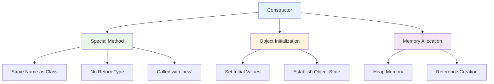

# Constructors
## Lecture 14

**Java Programming (4343203)**  
Diploma in ICT - Semester IV  
Gujarat Technological University

<div class="pt-12">
  <span @click="$slidev.nav.next" class="px-2 py-1 rounded cursor-pointer" hover="bg-white bg-opacity-10">
    Press Space for next page <carbon:arrow-right class="inline"/>
  </span>
</div>

---
layout: default
---

# Learning Objectives

By the end of this lecture, you will be able to:

<v-clicks>

- 🏗️ **Understand** the purpose and importance of constructors
- 🎯 **Create** default and parameterized constructors
- 🔗 **Implement** constructor chaining using this() and super()
- 📦 **Design** copy constructors for object cloning
- ⚡ **Optimize** object initialization strategies
- 🛠️ **Apply** constructor best practices in real applications

</v-clicks>

<br>

<div v-click="7" class="text-center text-2xl text-blue-600 font-bold">
Let's master object creation and initialization! 🏗️⚡
</div>

---
layout: center
---

# What are Constructors?

<div class="flex justify-center">



</div>

<div class="mt-8 grid grid-cols-2 gap-6">

<div class="bg-blue-50 p-4 rounded-lg">
<h3 class="font-bold text-blue-700">🎯 Constructor Purpose</h3>
<ul class="text-sm space-y-1">
<li>• Initialize object state</li>
<li>• Set up required resources</li>
<li>• Validate initial data</li>
<li>• Ensure object consistency</li>
</ul>
</div>

<div class="bg-green-50 p-4 rounded-lg">
<h3 class="font-bold text-green-700">🔧 Key Features</h3>
<ul class="text-sm space-y-1">
<li>• Automatic invocation with 'new'</li>
<li>• Same name as class</li>
<li>• No explicit return type</li>
<li>• Can be overloaded</li>
</ul>
</div>

</div>

---
layout: default
---

# Default Constructor

<div class="grid grid-cols-2 gap-8">

<div>

## 🏗️ No-Argument Constructor

<v-clicks>

- **Provided automatically** if no constructor is defined
- **Initializes fields** to default values
- **Called when** object created without arguments
- **Disappears** when any constructor is defined
- **Can be explicitly** defined for custom initialization

</v-clicks>

<div v-click="6">

## 📝 Automatic Default Constructor

```java
// This class has an implicit default constructor
public class BasicStudent {
    private String name;        // null by default
    private int age;           // 0 by default
    private boolean active;    // false by default
    
    // Java automatically provides:
    // public BasicStudent() {
    //     // Default initialization happens automatically
    // }
    
    public void displayInfo() {
        System.out.println("Name: " + name);
        System.out.println("Age: " + age);
        System.out.println("Active: " + active);
    }
}

// Usage
BasicStudent student = new BasicStudent();  // Calls default constructor
student.displayInfo();
// Output: Name: null, Age: 0, Active: false
```

</div>

</div>

<div>

## ✨ Explicit Default Constructor

```java
public class Student {
    private String name;
    private int rollNumber;
    private String course;
    private double gpa;
    private boolean isActive;
    
    // Explicit default constructor with custom initialization
    public Student() {
        this.name = "Unknown";
        this.rollNumber = 0;
        this.course = "Not Assigned";
        this.gpa = 0.0;
        this.isActive = true;
        
        System.out.println("Default constructor called");
        System.out.println("Student object created with default values");
    }
    
    // Getters for testing
    public String getName() { return name; }
    public int getRollNumber() { return rollNumber; }
    public String getCourse() { return course; }
    public double getGpa() { return gpa; }
    public boolean isActive() { return isActive; }
    
    public void displayInfo() {
        System.out.println("=== Student Information ===");
        System.out.println("Name: " + name);
        System.out.println("Roll Number: " + rollNumber);
        System.out.println("Course: " + course);
        System.out.println("GPA: " + gpa);
        System.out.println("Active: " + isActive);
    }
}
```

</div>

</div>

---
layout: default
---

# Parameterized Constructors

<div class="grid grid-cols-2 gap-8">

<div>

## 🎯 Constructor with Parameters

```java
public class Student {
    private String name;
    private int rollNumber;
    private String course;
    private double gpa;
    private boolean isActive;
    
    // Parameterized constructor
    public Student(String name, int rollNumber, String course) {
        this.name = name;
        this.rollNumber = rollNumber;
        this.course = course;
        this.gpa = 0.0;           // Default value
        this.isActive = true;     // Default value
        
        // Validation
        if (rollNumber <= 0) {
            throw new IllegalArgumentException("Roll number must be positive");
        }
        
        System.out.println("Parameterized constructor called");
        System.out.println("Student " + name + " created successfully");
    }
    
    // Constructor with all parameters
    public Student(String name, int rollNumber, String course, 
                  double gpa, boolean isActive) {
        this.name = name;
        this.rollNumber = rollNumber;
        this.course = course;
        this.gpa = gpa;
        this.isActive = isActive;
        
        // Validation
        validateStudentData();
        
        System.out.println("Full parameterized constructor called");
    }
}
```

</div>

<div>

## 🔍 Validation and Initialization

```java
    // Private validation method
    private void validateStudentData() {
        if (name == null || name.trim().isEmpty()) {
            throw new IllegalArgumentException("Name cannot be null or empty");
        }
        
        if (rollNumber <= 0) {
            throw new IllegalArgumentException("Roll number must be positive");
        }
        
        if (gpa < 0.0 || gpa > 4.0) {
            throw new IllegalArgumentException("GPA must be between 0.0 and 4.0");
        }
        
        if (course == null || course.trim().isEmpty()) {
            throw new IllegalArgumentException("Course cannot be null or empty");
        }
    }
    
    // Usage demonstration
    public static void main(String[] args) {
        // Using different constructors
        try {
            // Parameterized constructor
            Student student1 = new Student("Alice Johnson", 101, "Computer Science");
            student1.displayInfo();
            
            // Full parameterized constructor
            Student student2 = new Student("Bob Smith", 102, "Information Technology", 
                                         3.75, true);
            student2.displayInfo();
            
            // This will throw an exception
            Student student3 = new Student("", -5, "Invalid Course");
            
        } catch (IllegalArgumentException e) {
            System.out.println("Error creating student: " + e.getMessage());
        }
    }
}
```

</div>

</div>

---
layout: default
---

# Constructor Overloading

<div class="grid grid-cols-2 gap-8">

<div>

## 🔄 Multiple Constructor Versions

```java
public class BankAccount {
    private String accountNumber;
    private String holderName;
    private double balance;
    private String accountType;
    private boolean isActive;
    
    // Default constructor
    public BankAccount() {
        this.accountNumber = generateAccountNumber();
        this.holderName = "Unknown";
        this.balance = 0.0;
        this.accountType = "SAVINGS";
        this.isActive = true;
        
        System.out.println("Default account created: " + accountNumber);
    }
    
    // Constructor with holder name
    public BankAccount(String holderName) {
        this.accountNumber = generateAccountNumber();
        this.holderName = holderName;
        this.balance = 0.0;
        this.accountType = "SAVINGS";
        this.isActive = true;
        
        System.out.println("Account created for: " + holderName);
    }
    
    // Constructor with name and initial balance
    public BankAccount(String holderName, double initialBalance) {
        this.accountNumber = generateAccountNumber();
        this.holderName = holderName;
        this.balance = initialBalance;
        this.accountType = "SAVINGS";
        this.isActive = true;
        
        validateBalance(initialBalance);
        System.out.println("Account created with initial balance: $" + initialBalance);
    }
}
```

</div>

<div>

```java
    // Constructor with name, balance, and account type
    public BankAccount(String holderName, double initialBalance, String accountType) {
        this.accountNumber = generateAccountNumber();
        this.holderName = holderName;
        this.balance = initialBalance;
        this.accountType = accountType.toUpperCase();
        this.isActive = true;
        
        validateBalance(initialBalance);
        validateAccountType(accountType);
        System.out.println(accountType + " account created for: " + holderName);
    }
    
    // Full constructor
    public BankAccount(String accountNumber, String holderName, double balance, 
                      String accountType, boolean isActive) {
        this.accountNumber = accountNumber;
        this.holderName = holderName;
        this.balance = balance;
        this.accountType = accountType.toUpperCase();
        this.isActive = isActive;
        
        validateAccountNumber(accountNumber);
        validateBalance(balance);
        validateAccountType(accountType);
        System.out.println("Full account details set");
    }
    
    // Helper methods
    private String generateAccountNumber() {
        return "ACC" + System.currentTimeMillis();
    }
    
    private void validateBalance(double balance) {
        if (balance < 0) {
            throw new IllegalArgumentException("Balance cannot be negative");
        }
    }
    
    private void validateAccountType(String type) {
        if (!type.equals("SAVINGS") && !type.equals("CHECKING") && !type.equals("FIXED")) {
            throw new IllegalArgumentException("Invalid account type");
        }
    }
    
    private void validateAccountNumber(String accNum) {
        if (accNum == null || accNum.trim().isEmpty()) {
            throw new IllegalArgumentException("Account number cannot be empty");
        }
    }
}
```

</div>

</div>

---
layout: default
---

# Constructor Chaining

<div class="grid grid-cols-2 gap-8">

<div>

## 🔗 Chaining with this()

```java
public class Employee {
    private String name;
    private int employeeId;
    private String department;
    private double salary;
    private String email;
    private boolean isActive;
    
    // Most comprehensive constructor (primary)
    public Employee(String name, int employeeId, String department, 
                   double salary, String email, boolean isActive) {
        this.name = name;
        this.employeeId = employeeId;
        this.department = department;
        this.salary = salary;
        this.email = email;
        this.isActive = isActive;
        
        // Validation logic
        validateEmployeeData();
        System.out.println("Primary constructor: Employee " + name + " created");
    }
    
    // Constructor chaining - delegates to primary constructor
    public Employee(String name, int employeeId, String department, double salary) {
        this(name, employeeId, department, salary, 
             generateEmail(name), true);  // Default email and active status
        System.out.println("4-parameter constructor completed");
    }
    
    // Chain to 4-parameter constructor
    public Employee(String name, int employeeId, String department) {
        this(name, employeeId, department, 30000.0);  // Default salary
        System.out.println("3-parameter constructor completed");
    }
    
    // Chain to 3-parameter constructor
    public Employee(String name, int employeeId) {
        this(name, employeeId, "General");  // Default department
        System.out.println("2-parameter constructor completed");
    }
}
```

</div>

<div>

## 🎯 Benefits of Constructor Chaining

```java
    // Default constructor chains to 2-parameter constructor
    public Employee() {
        this("Unknown Employee", 0);  // Default name and ID
        System.out.println("Default constructor completed");
    }
    
    // Helper methods
    private static String generateEmail(String name) {
        return name.toLowerCase().replace(" ", ".") + "@company.com";
    }
    
    private void validateEmployeeData() {
        if (name == null || name.trim().isEmpty()) {
            throw new IllegalArgumentException("Name cannot be empty");
        }
        if (employeeId <= 0) {
            throw new IllegalArgumentException("Employee ID must be positive");
        }
        if (salary < 0) {
            throw new IllegalArgumentException("Salary cannot be negative");
        }
    }
    
    public void displayInfo() {
        System.out.println("=== Employee Information ===");
        System.out.println("Name: " + name);
        System.out.println("ID: " + employeeId);
        System.out.println("Department: " + department);
        System.out.println("Salary: $" + salary);
        System.out.println("Email: " + email);
        System.out.println("Active: " + isActive);
    }
}

// Usage demonstration
Employee emp1 = new Employee();  // Chains through all constructors
Employee emp2 = new Employee("Alice Johnson", 101);
Employee emp3 = new Employee("Bob Smith", 102, "IT", 75000);
```

<div class="mt-4 p-4 bg-green-50 rounded-lg">
<strong>🎯 Chaining Benefits:</strong>
<ul class="text-sm mt-2">
<li>• Eliminates code duplication</li>
<li>• Centralizes validation logic</li>
<li>• Maintains consistency</li>
<li>• Easier maintenance</li>
</ul>
</div>

</div>

</div>

---
layout: default
---

# Copy Constructor Pattern

<div class="grid grid-cols-2 gap-8">

<div>

## 📋 Object Cloning with Copy Constructor

```java
public class Student {
    private String name;
    private int rollNumber;
    private String course;
    private double gpa;
    private List<String> subjects;
    private Map<String, Integer> grades;
    
    // Regular constructor
    public Student(String name, int rollNumber, String course) {
        this.name = name;
        this.rollNumber = rollNumber;
        this.course = course;
        this.gpa = 0.0;
        this.subjects = new ArrayList<>();
        this.grades = new HashMap<>();
    }
    
    // Copy constructor - creates a deep copy
    public Student(Student other) {
        if (other == null) {
            throw new IllegalArgumentException("Cannot copy from null student");
        }
        
        this.name = other.name;                    // String is immutable
        this.rollNumber = other.rollNumber;       // Primitive type
        this.course = other.course;               // String is immutable
        this.gpa = other.gpa;                     // Primitive type
        
        // Deep copy of mutable objects
        this.subjects = new ArrayList<>(other.subjects);
        this.grades = new HashMap<>(other.grades);
        
        System.out.println("Copy constructor: Cloned student " + name);
    }
    
    // Methods to modify student data
    public void addSubject(String subject) {
        subjects.add(subject);
    }
    
    public void setGrade(String subject, int grade) {
        grades.put(subject, grade);
        calculateGPA();
    }
}
```

</div>

<div>

## 🔍 Deep vs Shallow Copy Demonstration

```java
    private void calculateGPA() {
        if (grades.isEmpty()) {
            this.gpa = 0.0;
            return;
        }
        
        double total = 0.0;
        for (int grade : grades.values()) {
            total += grade;
        }
        this.gpa = total / grades.size() / 25.0;  // Convert to 4.0 scale
    }
    
    // Display method
    public void displayInfo() {
        System.out.println("=== Student Information ===");
        System.out.println("Name: " + name);
        System.out.println("Roll Number: " + rollNumber);
        System.out.println("Course: " + course);
        System.out.println("GPA: " + String.format("%.2f", gpa));
        System.out.println("Subjects: " + subjects);
        System.out.println("Grades: " + grades);
    }
    
    // Copy demonstration
    public static void main(String[] args) {
        // Create original student
        Student original = new Student("Alice Johnson", 101, "Computer Science");
        original.addSubject("Java Programming");
        original.addSubject("Data Structures");
        original.setGrade("Java Programming", 85);
        original.setGrade("Data Structures", 90);
        
        System.out.println("Original Student:");
        original.displayInfo();
        
        // Create copy using copy constructor
        Student copy = new Student(original);
        
        // Modify copy - should not affect original
        copy.addSubject("Algorithms");
        copy.setGrade("Algorithms", 95);
        
        System.out.println("\nAfter modifying copy:");
        System.out.println("Original Student:");
        original.displayInfo();
        
        System.out.println("\nCopied Student:");
        copy.displayInfo();
    }
}
```

</div>

</div>

---
layout: default
---

# Constructor with Inheritance

<div class="grid grid-cols-2 gap-8">

<div>

## 🧬 Parent-Child Constructor Relationship

```java
// Parent class
public class Vehicle {
    protected String brand;
    protected String model;
    protected int year;
    protected double price;
    
    // Default constructor
    public Vehicle() {
        this.brand = "Unknown";
        this.model = "Unknown";
        this.year = 2024;
        this.price = 0.0;
        System.out.println("Vehicle default constructor called");
    }
    
    // Parameterized constructor
    public Vehicle(String brand, String model, int year, double price) {
        this.brand = brand;
        this.model = model;
        this.year = year;
        this.price = price;
        
        validateVehicleData();
        System.out.println("Vehicle parameterized constructor called");
    }
    
    private void validateVehicleData() {
        if (year < 1900 || year > 2030) {
            throw new IllegalArgumentException("Invalid year");
        }
        if (price < 0) {
            throw new IllegalArgumentException("Price cannot be negative");
        }
    }
    
    public void displayInfo() {
        System.out.println("Brand: " + brand + ", Model: " + model + 
                          ", Year: " + year + ", Price: $" + price);
    }
}
```

</div>

<div>

## 🚗 Child Class Constructor

```java
// Child class
public class Car extends Vehicle {
    private int numberOfDoors;
    private String fuelType;
    private boolean isAutomatic;
    
    // Default constructor - calls parent default constructor
    public Car() {
        super();  // Explicit call to parent default constructor
        this.numberOfDoors = 4;
        this.fuelType = "Gasoline";
        this.isAutomatic = true;
        System.out.println("Car default constructor called");
    }
    
    // Constructor with parent parameters
    public Car(String brand, String model, int year, double price) {
        super(brand, model, year, price);  // Call parent constructor
        this.numberOfDoors = 4;            // Default values for car-specific
        this.fuelType = "Gasoline";
        this.isAutomatic = true;
        System.out.println("Car 4-parameter constructor called");
    }
    
    // Full constructor
    public Car(String brand, String model, int year, double price,
              int numberOfDoors, String fuelType, boolean isAutomatic) {
        super(brand, model, year, price);  // Must be first statement
        this.numberOfDoors = numberOfDoors;
        this.fuelType = fuelType;
        this.isAutomatic = isAutomatic;
        
        validateCarData();
        System.out.println("Car full constructor called");
    }
    
    private void validateCarData() {
        if (numberOfDoors < 2 || numberOfDoors > 6) {
            throw new IllegalArgumentException("Invalid number of doors");
        }
    }
    
    @Override
    public void displayInfo() {
        super.displayInfo();  // Call parent method
        System.out.println("Doors: " + numberOfDoors + ", Fuel: " + fuelType + 
                          ", Automatic: " + isAutomatic);
    }
}
```

</div>

</div>

---
layout: default
---

# Advanced Constructor Patterns

<div class="grid grid-cols-2 gap-8">

<div>

## 🏭 Factory Pattern with Constructors

```java
public class DatabaseConnection {
    private String host;
    private int port;
    private String database;
    private String username;
    private boolean isConnected;
    
    // Private constructor - only factory methods can create instances
    private DatabaseConnection(String host, int port, String database, String username) {
        this.host = host;
        this.port = port;
        this.database = database;
        this.username = username;
        this.isConnected = false;
    }
    
    // Factory method for MySQL
    public static DatabaseConnection createMySQLConnection(String host, String database, String username) {
        DatabaseConnection conn = new DatabaseConnection(host, 3306, database, username);
        System.out.println("MySQL connection created");
        return conn;
    }
    
    // Factory method for PostgreSQL
    public static DatabaseConnection createPostgreSQLConnection(String host, String database, String username) {
        DatabaseConnection conn = new DatabaseConnection(host, 5432, database, username);
        System.out.println("PostgreSQL connection created");
        return conn;
    }
    
    // Factory method for local development
    public static DatabaseConnection createLocalConnection(String database) {
        DatabaseConnection conn = new DatabaseConnection("localhost", 3306, database, "root");
        System.out.println("Local development connection created");
        return conn;
    }
    
    // Factory method for production
    public static DatabaseConnection createProductionConnection(String host, String database, String username) {
        DatabaseConnection conn = new DatabaseConnection(host, 5432, database, username);
        conn.validateProductionRequirements();
        System.out.println("Production connection created with security validations");
        return conn;
    }
}
```

</div>

<div>

## 🔧 Builder Pattern with Constructor

```java
public class Computer {
    // Required parameters
    private final String cpu;
    private final String ram;
    
    // Optional parameters
    private final String storage;
    private final String graphics;
    private final String monitor;
    private final boolean hasBluetooth;
    private final boolean hasWifi;
    
    // Private constructor used by Builder
    private Computer(ComputerBuilder builder) {
        this.cpu = builder.cpu;
        this.ram = builder.ram;
        this.storage = builder.storage;
        this.graphics = builder.graphics;
        this.monitor = builder.monitor;
        this.hasBluetooth = builder.hasBluetooth;
        this.hasWifi = builder.hasWifi;
        
        System.out.println("Computer built with specifications");
    }
    
    // Builder class
    public static class ComputerBuilder {
        // Required parameters
        private final String cpu;
        private final String ram;
        
        // Optional parameters with default values
        private String storage = "256GB SSD";
        private String graphics = "Integrated";
        private String monitor = "15-inch";
        private boolean hasBluetooth = true;
        private boolean hasWifi = true;
        
        // Builder constructor with required parameters
        public ComputerBuilder(String cpu, String ram) {
            this.cpu = cpu;
            this.ram = ram;
        }
        
        // Setter methods that return builder for chaining
        public ComputerBuilder storage(String storage) {
            this.storage = storage;
            return this;
        }
        
        public ComputerBuilder graphics(String graphics) {
            this.graphics = graphics;
            return this;
        }
        
        public ComputerBuilder monitor(String monitor) {
            this.monitor = monitor;
            return this;
        }
        
        public ComputerBuilder bluetooth(boolean hasBluetooth) {
            this.hasBluetooth = hasBluetooth;
            return this;
        }
        
        public ComputerBuilder wifi(boolean hasWifi) {
            this.hasWifi = hasWifi;
            return this;
        }
        
        // Build method creates Computer object
        public Computer build() {
            return new Computer(this);
        }
    }
}
```

</div>

</div>

---
layout: default
---

# Real-World Example: University System

<div class="grid grid-cols-2 gap-8">

<div>

## 🎓 Student Management System

```java
public class UniversityStudent {
    // Static counter for automatic ID generation
    private static int nextStudentId = 1000;
    
    // Instance variables
    private final int studentId;        // Immutable after creation
    private String firstName;
    private String lastName;
    private String email;
    private String course;
    private int semester;
    private double gpa;
    private List<String> enrolledSubjects;
    private Map<String, String> contactInfo;
    private LocalDate enrollmentDate;
    private boolean isActive;
    
    // Default constructor
    public UniversityStudent() {
        this.studentId = nextStudentId++;
        this.firstName = "Unknown";
        this.lastName = "Student";
        this.email = generateEmail();
        this.course = "Undeclared";
        this.semester = 1;
        this.gpa = 0.0;
        this.enrolledSubjects = new ArrayList<>();
        this.contactInfo = new HashMap<>();
        this.enrollmentDate = LocalDate.now();
        this.isActive = true;
        
        System.out.println("Default student created with ID: " + studentId);
    }
    
    // Primary constructor with essential information
    public UniversityStudent(String firstName, String lastName, String course) {
        this.studentId = nextStudentId++;
        this.firstName = validateName(firstName);
        this.lastName = validateName(lastName);
        this.course = course;
        this.email = generateEmail();
        this.semester = 1;
        this.gpa = 0.0;
        this.enrolledSubjects = new ArrayList<>();
        this.contactInfo = new HashMap<>();
        this.enrollmentDate = LocalDate.now();
        this.isActive = true;
        
        System.out.println("Student created: " + getFullName() + " (ID: " + studentId + ")");
    }
}
```

</div>

<div>

## 🔧 Advanced Constructor Features

```java
    // Constructor for transfer students
    public UniversityStudent(String firstName, String lastName, String course, 
                           int semester, double transferGPA) {
        this(firstName, lastName, course);  // Call primary constructor
        this.semester = validateSemester(semester);
        this.gpa = validateGPA(transferGPA);
        
        // Add transfer student specific initialization
        contactInfo.put("transfer_status", "true");
        contactInfo.put("previous_gpa", String.valueOf(transferGPA));
        
        System.out.println("Transfer student registered for semester " + semester);
    }
    
    // Copy constructor for student records
    public UniversityStudent(UniversityStudent other) {
        if (other == null) {
            throw new IllegalArgumentException("Cannot copy null student");
        }
        
        this.studentId = nextStudentId++;  // New ID for copy
        this.firstName = other.firstName;
        this.lastName = other.lastName;
        this.email = generateEmail();      // New email for copy
        this.course = other.course;
        this.semester = other.semester;
        this.gpa = other.gpa;
        
        // Deep copy of collections
        this.enrolledSubjects = new ArrayList<>(other.enrolledSubjects);
        this.contactInfo = new HashMap<>(other.contactInfo);
        
        this.enrollmentDate = LocalDate.now();  // New enrollment date
        this.isActive = true;                   // New student is active
        
        System.out.println("Student record copied with new ID: " + studentId);
    }
    
    // Validation methods
    private String validateName(String name) {
        if (name == null || name.trim().isEmpty()) {
            throw new IllegalArgumentException("Name cannot be null or empty");
        }
        return name.trim();
    }
    
    private int validateSemester(int semester) {
        if (semester < 1 || semester > 8) {
            throw new IllegalArgumentException("Semester must be between 1 and 8");
        }
        return semester;
    }
    
    private double validateGPA(double gpa) {
        if (gpa < 0.0 || gpa > 4.0) {
            throw new IllegalArgumentException("GPA must be between 0.0 and 4.0");
        }
        return gpa;
    }
    
    private String generateEmail() {
        return firstName.toLowerCase() + "." + lastName.toLowerCase() + 
               "." + studentId + "@university.edu";
    }
    
    public String getFullName() {
        return firstName + " " + lastName;
    }
}
```

</div>

</div>

---
layout: default
---

# Constructor Best Practices

<div class="grid grid-cols-2 gap-8">

<div>

## ✅ Design Guidelines

<v-clicks>

**Validation and Safety:**
- Always validate input parameters
- Initialize all instance variables
- Use defensive copying for mutable objects
- Handle null parameters appropriately

**Constructor Chaining:**
- Use this() for constructor delegation
- Put complex logic in one primary constructor
- Chain from specific to general constructors

**Documentation:**
- Document parameter requirements
- Explain validation rules
- Describe initialization behavior

</v-clicks>

</div>

<div>

## 🎯 Code Examples

```java
public class GoodConstructorPractices {
    private final String id;                    // Immutable after creation
    private String name;
    private List<String> items;
    
    // Well-designed constructor
    public GoodConstructorPractices(String id, String name, List<String> items) {
        // Validate parameters
        this.id = validateId(id);
        this.name = validateName(name);
        
        // Defensive copying
        this.items = items != null ? new ArrayList<>(items) : new ArrayList<>();
        
        // Log creation
        System.out.println("Object created with ID: " + id);
    }
    
    // Constructor chaining example
    public GoodConstructorPractices(String id, String name) {
        this(id, name, null);  // Delegate to primary constructor
    }
    
    // Default constructor
    public GoodConstructorPractices() {
        this(generateId(), "Default Name", new ArrayList<>());
    }
    
    // Validation methods
    private String validateId(String id) {
        if (id == null || id.trim().isEmpty()) {
            throw new IllegalArgumentException("ID cannot be null or empty");
        }
        return id.trim().toUpperCase();
    }
    
    private String validateName(String name) {
        if (name == null) {
            return "Unknown";
        }
        return name.trim();
    }
    
    private static String generateId() {
        return "ID_" + System.currentTimeMillis();
    }
}
```

</div>

</div>

---
layout: default
---

# Common Constructor Mistakes

<div class="space-y-4">

<div class="bg-red-50 p-4 rounded-lg">
<h4 class="font-bold text-red-700">❌ Constructor Pitfalls</h4>
<div class="grid grid-cols-2 gap-4 mt-2">
<div>
```java
// WRONG: Not initializing all variables
public class BadConstructor1 {
    private String name;
    private List<String> items;
    
    public BadConstructor1(String name) {
        this.name = name;
        // items remains null - will cause NullPointerException!
    }
}

// WRONG: No validation
public class BadConstructor2 {
    private int age;
    
    public BadConstructor2(int age) {
        this.age = age;  // Could be negative!
    }
}
```
</div>
<div>
```java
// WRONG: Shallow copy problem
public class BadConstructor3 {
    private List<String> data;
    
    public BadConstructor3(List<String> data) {
        this.data = data;  // Sharing reference!
    }
}

// WRONG: Constructor with side effects
public class BadConstructor4 {
    public BadConstructor4() {
        // Bad: Network call in constructor
        connectToDatabase();
        sendWelcomeEmail();  // Could fail
    }
}
```
</div>
</div>
</div>

<div class="bg-green-50 p-4 rounded-lg">
<h4 class="font-bold text-green-700">✅ Corrected Versions</h4>
<div class="grid grid-cols-2 gap-4 mt-2">
<div>
```java
// CORRECT: Initialize all variables
public class GoodConstructor1 {
    private String name;
    private List<String> items;
    
    public GoodConstructor1(String name) {
        this.name = name != null ? name : "Unknown";
        this.items = new ArrayList<>();  // Always initialized
    }
}

// CORRECT: Validate inputs
public class GoodConstructor2 {
    private int age;
    
    public GoodConstructor2(int age) {
        if (age < 0 || age > 150) {
            throw new IllegalArgumentException("Invalid age: " + age);
        }
        this.age = age;
    }
}
```
</div>
<div>
```java
// CORRECT: Defensive copying
public class GoodConstructor3 {
    private List<String> data;
    
    public GoodConstructor3(List<String> data) {
        this.data = data != null ? 
                   new ArrayList<>(data) : new ArrayList<>();
    }
}

// CORRECT: Defer complex operations
public class GoodConstructor4 {
    private boolean isInitialized = false;
    
    public GoodConstructor4() {
        // Simple initialization only
        this.isInitialized = false;
    }
    
    public void initialize() {
        // Complex operations in separate method
        connectToDatabase();
        sendWelcomeEmail();
        this.isInitialized = true;
    }
}
```
</div>
</div>
</div>

</div>

---
layout: default
---

# Hands-On Exercise: Library Management System

<div class="grid grid-cols-2 gap-8">

<div>

## 📚 Design Challenge

**Requirements:**
1. Create a Book class with multiple constructor options
2. Implement constructor chaining appropriately
3. Add validation for all parameters
4. Create a copy constructor for book cloning
5. Design a Library class that manages books
6. Use static variables for book ID generation

```java
public class Book {
    // TODO: Static counter for book IDs
    // TODO: Instance variables for book properties
    
    // TODO: Default constructor
    // TODO: Constructor with title and author
    // TODO: Constructor with all basic properties
    // TODO: Copy constructor
    
    // TODO: Validation methods
    // TODO: Getter methods
    // TODO: Display method
}

public class Library {
    // TODO: Collection of books
    // TODO: Library name and details
    // TODO: Multiple constructors
    
    // TODO: Methods to add books using different constructors
}
```

</div>

<div>

## 🎯 Expected Implementation

**Features to Implement:**
- Book with ISBN, title, author, price, publication year
- Automatic ID generation for books
- Constructor chaining from simple to complex
- Copy constructor for book duplication
- Validation for all input parameters
- Library class to manage book collection

**Success Criteria:**
- All constructors properly implemented
- Constructor chaining working correctly
- Validation preventing invalid data
- Copy constructor creating independent copies
- Clean, readable code with good practices
- Demonstration of all constructor types

**Usage Example:**
```java
// Should work after implementation
Book book1 = new Book();  // Default
Book book2 = new Book("Java Programming", "John Doe");
Book book3 = new Book(book2);  // Copy constructor
Library library = new Library("City Library");
library.addBook(book1);
```

</div>

</div>

---
layout: center
class: text-center
---

# Summary

<div class="grid grid-cols-2 gap-8 mt-8">

<div class="bg-blue-50 p-6 rounded-lg">
<h3 class="font-bold text-lg mb-4">📖 What We Learned</h3>
<ul class="text-left space-y-2">
<li>• Constructor fundamentals and purpose</li>
<li>• Default vs parameterized constructors</li>
<li>• Constructor overloading and chaining</li>
<li>• Copy constructors for object cloning</li>
<li>• Constructor inheritance with super()</li>
<li>• Advanced patterns and best practices</li>
</ul>
</div>

<div class="bg-green-50 p-6 rounded-lg">
<h3 class="font-bold text-lg mb-4">🎯 Next Steps</h3>
<ul class="text-left space-y-2">
<li>• Method and constructor overloading</li>
<li>• Advanced object initialization techniques</li>
<li>• Design patterns with constructors</li>
<li>• Memory management and object lifecycle</li>
<li>• Real-world application development</li>
</ul>
</div>

</div>

<div class="mt-8 text-2xl font-bold text-purple-600">
Object construction mastered! Ready to build robust applications! 🏗️⚡
</div>

---
layout: center
class: text-center
---

# Questions & Discussion

<div class="text-6xl mb-8">❓</div>

<div class="text-xl mb-8">
Any questions about constructors, object initialization, or constructor patterns?
</div>

<div class="text-lg text-gray-600">
Next lecture: **Method and Constructor Overloading**
</div>

<div class="mt-8">
<span class="px-4 py-2 bg-blue-500 text-white rounded-lg">
Ready to master overloading concepts! 👏
</span>
</div>