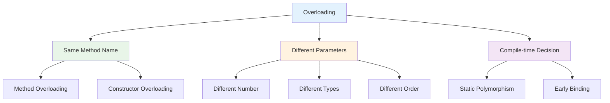

# Method and Constructor Overloading
## Lecture 15

**Java Programming (4343203)**  
Diploma in ICT - Semester IV  
Gujarat Technological University

<div class="pt-12">
  <span @click="$slidev.nav.next" class="px-2 py-1 rounded cursor-pointer" hover="bg-white bg-opacity-10">
    Press Space for next page <carbon:arrow-right class="inline"/>
  </span>
</div>

---
layout: default
---

# Learning Objectives

By the end of this lecture, you will be able to:

<v-clicks>

- 🎯 **Understand** the concept and benefits of method overloading
- 🏗️ **Implement** constructor overloading for flexible object creation
- 🔍 **Apply** overloading resolution rules correctly
- ⚡ **Design** flexible APIs using overloading techniques
- 🎨 **Create** user-friendly method interfaces
- 📝 **Practice** with real-world overloading scenarios

</v-clicks>

<br>

<div v-click="7" class="text-center text-2xl text-blue-600 font-bold">
Let's master the art of overloading! 🎯🔧
</div>

---
layout: center
---

# What is Overloading?

<div class="flex justify-center">



</div>

<div class="mt-8 grid grid-cols-2 gap-6">

<div class="bg-blue-50 p-4 rounded-lg">
<h3 class="font-bold text-blue-700">🎯 Overloading Benefits</h3>
<ul class="text-sm space-y-1">
<li>• Same logical operation, different inputs</li>
<li>• Improved code readability</li>
<li>• Flexible method interfaces</li>
<li>• Reduced learning curve for APIs</li>
</ul>
</div>

<div class="bg-green-50 p-4 rounded-lg">
<h3 class="font-bold text-green-700">🔧 Key Rules</h3>
<ul class="text-sm space-y-1">
<li>• Same method name required</li>
<li>• Different parameter lists</li>
<li>• Return type can vary</li>
<li>• Access modifiers can differ</li>
</ul>
</div>

</div>

---
layout: default
---

# Method Overloading Fundamentals

<div class="grid grid-cols-2 gap-8">

<div>

## 🎯 Basic Method Overloading

```java
public class Calculator {
    
    // Method overloading with different number of parameters
    public int add(int a, int b) {
        System.out.println("Adding two integers: " + a + " + " + b);
        return a + b;
    }
    
    public int add(int a, int b, int c) {
        System.out.println("Adding three integers: " + a + " + " + b + " + " + c);
        return a + b + c;
    }
    
    public int add(int a, int b, int c, int d) {
        System.out.println("Adding four integers");
        return a + b + c + d;
    }
    
    // Method overloading with different parameter types
    public double add(double a, double b) {
        System.out.println("Adding two doubles: " + a + " + " + b);
        return a + b;
    }
    
    public float add(float a, float b) {
        System.out.println("Adding two floats: " + a + " + " + b);
        return a + b;
    }
    
    // Method overloading with different parameter order
    public String add(String a, int b) {
        System.out.println("Concatenating string and int: " + a + " + " + b);
        return a + b;
    }
    
    public String add(int a, String b) {
        System.out.println("Concatenating int and string: " + a + " + " + b);
        return a + b;
    }
}
```

</div>

<div>

## 🔍 Overloading Resolution Demo

```java
public class CalculatorDemo {
    public static void main(String[] args) {
        Calculator calc = new Calculator();
        
        // Different methods called based on parameters
        
        // Calls add(int, int)
        int result1 = calc.add(5, 10);
        System.out.println("Result 1: " + result1);
        
        // Calls add(int, int, int)
        int result2 = calc.add(5, 10, 15);
        System.out.println("Result 2: " + result2);
        
        // Calls add(double, double)
        double result3 = calc.add(5.5, 10.7);
        System.out.println("Result 3: " + result3);
        
        // Calls add(float, float)
        float result4 = calc.add(5.5f, 10.7f);
        System.out.println("Result 4: " + result4);
        
        // Calls add(String, int)
        String result5 = calc.add("Number: ", 42);
        System.out.println("Result 5: " + result5);
        
        // Calls add(int, String)
        String result6 = calc.add(42, " is the answer");
        System.out.println("Result 6: " + result6);
        
        // Automatic type promotion example
        byte a = 5, b = 10;
        int result7 = calc.add(a, b);  // byte promoted to int
        System.out.println("Result 7: " + result7);
    }
}
```

**Output demonstrates which method is called for each parameter combination.**

</div>

</div>

---
layout: default
---

# Advanced Method Overloading

<div class="grid grid-cols-2 gap-8">

<div>

## 🔄 Array and Varargs Overloading

```java
public class DataProcessor {
    
    // Method with array parameter
    public int sum(int[] numbers) {
        System.out.println("Processing array of " + numbers.length + " elements");
        int total = 0;
        for (int num : numbers) {
            total += num;
        }
        return total;
    }
    
    // Method with varargs parameter
    public int sum(int... numbers) {
        System.out.println("Processing varargs with " + numbers.length + " elements");
        int total = 0;
        for (int num : numbers) {
            total += num;
        }
        return total;
    }
    
    // Method with specific number of parameters
    public int sum(int a, int b) {
        System.out.println("Processing two specific integers");
        return a + b;
    }
    
    // Method with array and additional parameter
    public double average(int[] numbers, boolean includeZeros) {
        System.out.println("Calculating average with zero handling: " + includeZeros);
        
        if (!includeZeros) {
            // Filter out zeros
            int count = 0;
            int sum = 0;
            for (int num : numbers) {
                if (num != 0) {
                    sum += num;
                    count++;
                }
            }
            return count > 0 ? (double) sum / count : 0.0;
        } else {
            return (double) sum(numbers) / numbers.length;
        }
    }
    
    // Method with varargs and additional parameter
    public double average(boolean includeZeros, int... numbers) {
        System.out.println("Varargs average with zero handling: " + includeZeros);
        return average(numbers, includeZeros);
    }
}
```

</div>

<div>

## 🎯 Generic Type Overloading

```java
public class GenericProcessor {
    
    // Overloading with different generic types
    public <T> void process(T item) {
        System.out.println("Processing single item: " + item);
        System.out.println("Type: " + item.getClass().getSimpleName());
    }
    
    public <T> void process(T[] items) {
        System.out.println("Processing array of " + items.length + " items");
        for (T item : items) {
            System.out.println("  - " + item);
        }
    }
    
    public <T> void process(java.util.List<T> items) {
        System.out.println("Processing list of " + items.size() + " items");
        for (int i = 0; i < items.size(); i++) {
            System.out.println("  [" + i + "] " + items.get(i));
        }
    }
    
    // Specific type overloads for optimization
    public void process(String text) {
        System.out.println("Optimized string processing: " + text.toUpperCase());
    }
    
    public void process(Integer number) {
        System.out.println("Optimized integer processing: " + (number * 2));
    }
    
    public void process(Double decimal) {
        System.out.println("Optimized double processing: " + String.format("%.2f", decimal));
    }
}

// Usage demonstration
GenericProcessor processor = new GenericProcessor();

processor.process("Hello World");           // Calls String version
processor.process(42);                      // Calls Integer version  
processor.process(3.14159);                 // Calls Double version
processor.process(new Boolean(true));       // Calls generic version

String[] stringArray = {"A", "B", "C"};
processor.process(stringArray);             // Calls array version

List<String> stringList = Arrays.asList("X", "Y", "Z");
processor.process(stringList);              // Calls list version
```

</div>

</div>

---
layout: default
---

# Constructor Overloading Deep Dive

<div class="grid grid-cols-2 gap-8">

<div>

## 🏗️ Comprehensive Constructor Design

```java
public class Person {
    private String firstName;
    private String lastName;
    private int age;
    private String email;
    private String phone;
    private String address;
    private String country;
    
    // Default constructor
    public Person() {
        this("Unknown", "Person", 0);
        System.out.println("Default constructor called");
    }
    
    // Essential information constructor
    public Person(String firstName, String lastName, int age) {
        this.firstName = validateName(firstName);
        this.lastName = validateName(lastName);
        this.age = validateAge(age);
        this.email = generateEmail();
        this.phone = "";
        this.address = "";
        this.country = "Unknown";
        System.out.println("Basic constructor called");
    }
    
    // Constructor with contact information
    public Person(String firstName, String lastName, int age, 
                 String email, String phone) {
        this(firstName, lastName, age);  // Chain to basic constructor
        this.email = validateEmail(email);
        this.phone = validatePhone(phone);
        System.out.println("Contact info constructor called");
    }
    
    // Full constructor
    public Person(String firstName, String lastName, int age,
                 String email, String phone, String address, String country) {
        this(firstName, lastName, age, email, phone);  // Chain to contact constructor
        this.address = address != null ? address : "";
        this.country = country != null ? country : "Unknown";
        System.out.println("Full constructor called");
    }
}
```

</div>

<div>

## 🔧 Validation and Utility Methods

```java
    // Copy constructor
    public Person(Person other) {
        if (other == null) {
            throw new IllegalArgumentException("Cannot copy null person");
        }
        
        this.firstName = other.firstName;
        this.lastName = other.lastName;
        this.age = other.age;
        this.email = other.email;
        this.phone = other.phone;
        this.address = other.address;
        this.country = other.country;
        System.out.println("Copy constructor called");
    }
    
    // Validation methods
    private String validateName(String name) {
        if (name == null || name.trim().isEmpty()) {
            throw new IllegalArgumentException("Name cannot be null or empty");
        }
        return name.trim();
    }
    
    private int validateAge(int age) {
        if (age < 0 || age > 150) {
            throw new IllegalArgumentException("Age must be between 0 and 150");
        }
        return age;
    }
    
    private String validateEmail(String email) {
        if (email == null || !email.contains("@")) {
            return generateEmail();  // Generate default if invalid
        }
        return email;
    }
    
    private String validatePhone(String phone) {
        if (phone == null) {
            return "";
        }
        // Remove non-digits and validate
        String cleaned = phone.replaceAll("[^0-9]", "");
        return cleaned.length() >= 10 ? cleaned : "";
    }
    
    private String generateEmail() {
        return firstName.toLowerCase() + "." + lastName.toLowerCase() + "@example.com";
    }
    
    // Display method
    public void displayInfo() {
        System.out.println("=== Person Information ===");
        System.out.println("Name: " + firstName + " " + lastName);
        System.out.println("Age: " + age);
        System.out.println("Email: " + email);
        System.out.println("Phone: " + phone);
        System.out.println("Address: " + address);
        System.out.println("Country: " + country);
    }
}
```

</div>

</div>

---
layout: default
---

# Overloading Resolution Rules

<div class="grid grid-cols-2 gap-8">

<div>

## 🎯 Method Resolution Priority

<v-clicks>

**1. Exact Match**
- Parameters match exactly in type and number

**2. Promotion**
- Automatic widening of primitive types

**3. Autoboxing/Unboxing**
- Primitive to wrapper or wrapper to primitive

**4. Varargs**
- Variable arguments as last resort

**5. Compilation Error**
- If multiple matches at same level

</v-clicks>

<div v-click="6">

## 📊 Promotion Hierarchy

```java
byte → short → int → long → float → double
       char → int → long → float → double
```

</div>

</div>

<div>

## 🔍 Resolution Examples

```java
public class ResolutionDemo {
    
    public void test(int x) {
        System.out.println("int version: " + x);
    }
    
    public void test(long x) {
        System.out.println("long version: " + x);
    }
    
    public void test(double x) {
        System.out.println("double version: " + x);
    }
    
    public void test(Integer x) {
        System.out.println("Integer wrapper version: " + x);
    }
    
    public void test(int... x) {
        System.out.println("varargs version with " + x.length + " arguments");
    }
    
    public static void main(String[] args) {
        ResolutionDemo demo = new ResolutionDemo();
        
        demo.test(5);           // int version (exact match)
        demo.test(5L);          // long version (exact match)
        demo.test(5.0);         // double version (exact match)
        
        byte b = 5;
        demo.test(b);           // int version (promotion)
        
        short s = 5;
        demo.test(s);           // int version (promotion)
        
        char c = '5';
        demo.test(c);           // int version (promotion)
        
        float f = 5.0f;
        demo.test(f);           // double version (promotion)
        
        Integer wrapper = 5;
        demo.test(wrapper);     // Integer version (exact match)
        
        demo.test(1, 2, 3);     // varargs version
        demo.test();            // varargs version (empty)
    }
}
```

</div>

</div>

---
layout: default
---

# Real-World Example: Database Connection Manager

<div class="grid grid-cols-2 gap-8">

<div>

## 🗄️ Flexible Connection API

```java
public class DatabaseManager {
    private String host;
    private int port;
    private String database;
    private String username;
    private String password;
    private String connectionString;
    
    // Default local connection
    public DatabaseManager() {
        this("localhost", 3306, "testdb");
        System.out.println("Created local development connection");
    }
    
    // Host and database only
    public DatabaseManager(String host, String database) {
        this(host, 3306, database, "root", "");
        System.out.println("Created connection with default port and credentials");
    }
    
    // Host, port, and database
    public DatabaseManager(String host, int port, String database) {
        this(host, port, database, "root", "");
        System.out.println("Created connection with default credentials");
    }
    
    // Full credentials
    public DatabaseManager(String host, int port, String database, 
                          String username, String password) {
        this.host = validateHost(host);
        this.port = validatePort(port);
        this.database = validateDatabase(database);
        this.username = username != null ? username : "root";
        this.password = password != null ? password : "";
        this.connectionString = buildConnectionString();
        System.out.println("Created connection with full credentials");
    }
    
    // Connection string constructor
    public DatabaseManager(String connectionString) {
        this.connectionString = validateConnectionString(connectionString);
        parseConnectionString();
        System.out.println("Created connection from connection string");
    }
}
```

</div>

<div>

## 🔧 Connection Methods Overloading

```java
    // Connect methods with different authentication options
    public boolean connect() {
        return connect(this.username, this.password);
    }
    
    public boolean connect(String username, String password) {
        System.out.println("Connecting to " + host + ":" + port + "/" + database);
        System.out.println("Username: " + username);
        
        // Simulate connection logic
        try {
            Thread.sleep(100);  // Simulate connection delay
            System.out.println("Connection successful!");
            return true;
        } catch (InterruptedException e) {
            System.out.println("Connection failed: " + e.getMessage());
            return false;
        }
    }
    
    // Overloaded query methods
    public void executeQuery(String sql) {
        executeQuery(sql, new Object[0]);
    }
    
    public void executeQuery(String sql, Object... parameters) {
        System.out.println("Executing query: " + sql);
        if (parameters.length > 0) {
            System.out.println("Parameters:");
            for (int i = 0; i < parameters.length; i++) {
                System.out.println("  [" + i + "] " + parameters[i]);
            }
        }
    }
    
    public void executeQuery(String sql, java.util.Map<String, Object> namedParameters) {
        System.out.println("Executing query with named parameters: " + sql);
        namedParameters.forEach((key, value) -> 
            System.out.println("  " + key + " = " + value));
    }
    
    // Validation methods
    private String validateHost(String host) {
        if (host == null || host.trim().isEmpty()) {
            throw new IllegalArgumentException("Host cannot be null or empty");
        }
        return host.trim();
    }
    
    private int validatePort(int port) {
        if (port < 1 || port > 65535) {
            throw new IllegalArgumentException("Port must be between 1 and 65535");
        }
        return port;
    }
    
    private String validateDatabase(String database) {
        if (database == null || database.trim().isEmpty()) {
            throw new IllegalArgumentException("Database name cannot be null or empty");
        }
        return database.trim();
    }
}
```

</div>

</div>

---
layout: default
---

# Overloading with Collections and Generics

<div class="grid grid-cols-2 gap-8">

<div>

## 📦 Collection Processing Overloads

```java
import java.util.*;

public class CollectionProcessor<T> {
    
    // Single item processing
    public void process(T item) {
        System.out.println("Processing single item: " + item);
        performOperation(item);
    }
    
    // Array processing
    public void process(T[] items) {
        System.out.println("Processing array of " + items.length + " items");
        for (T item : items) {
            performOperation(item);
        }
    }
    
    // List processing
    public void process(List<T> items) {
        System.out.println("Processing List of " + items.size() + " items");
        for (int i = 0; i < items.size(); i++) {
            System.out.println("Index " + i + ": ");
            performOperation(items.get(i));
        }
    }
    
    // Set processing (unique items)
    public void process(Set<T> items) {
        System.out.println("Processing Set of " + items.size() + " unique items");
        items.forEach(this::performOperation);
    }
    
    // Map processing (key-value pairs)
    public void process(Map<String, T> items) {
        System.out.println("Processing Map of " + items.size() + " key-value pairs");
        items.forEach((key, value) -> {
            System.out.println("Key: " + key);
            performOperation(value);
        });
    }
    
    // Varargs processing
    public void process(T... items) {
        System.out.println("Processing varargs of " + items.length + " items");
        for (T item : items) {
            performOperation(item);
        }
    }
}
```

</div>

<div>

## 🎯 Specialized Processing Methods

```java
    // Processing with filtering
    public void process(List<T> items, Predicate<T> filter) {
        System.out.println("Processing List with filter");
        items.stream()
             .filter(filter)
             .forEach(this::performOperation);
    }
    
    // Processing with transformation
    public <R> List<R> process(List<T> items, Function<T, R> transformer) {
        System.out.println("Processing List with transformation");
        return items.stream()
                   .map(transformer)
                   .collect(Collectors.toList());
    }
    
    // Batch processing with size limit
    public void process(List<T> items, int batchSize) {
        System.out.println("Processing List in batches of " + batchSize);
        for (int i = 0; i < items.size(); i += batchSize) {
            int endIndex = Math.min(i + batchSize, items.size());
            List<T> batch = items.subList(i, endIndex);
            System.out.println("Processing batch " + (i / batchSize + 1));
            batch.forEach(this::performOperation);
        }
    }
    
    // Concurrent processing
    public void processParallel(List<T> items) {
        System.out.println("Processing List in parallel");
        items.parallelStream().forEach(this::performOperation);
    }
    
    // Helper method
    private void performOperation(T item) {
        System.out.println("  Operating on: " + item);
        // Actual processing logic would go here
    }
}

// Usage demonstration
CollectionProcessor<String> processor = new CollectionProcessor<>();

// Different collection types
processor.process("single item");
processor.process(new String[]{"A", "B", "C"});
processor.process(Arrays.asList("X", "Y", "Z"));
processor.process(new HashSet<>(Arrays.asList("P", "Q", "R")));

Map<String, String> map = new HashMap<>();
map.put("key1", "value1");
map.put("key2", "value2");
processor.process(map);
```

</div>

</div>

---
layout: default
---

# Ambiguous Overloading and Solutions

<div class="grid grid-cols-2 gap-8">

<div>

## ⚠️ Common Ambiguity Problems

```java
public class AmbiguityProblems {
    
    // Problem 1: Ambiguous varargs
    public void method(String... args) {
        System.out.println("String varargs");
    }
    
    public void method(Object... args) {
        System.out.println("Object varargs");
    }
    
    // Problem 2: Ambiguous autoboxing
    public void process(Integer num) {
        System.out.println("Integer version");
    }
    
    public void process(int... nums) {
        System.out.println("int varargs version");
    }
    
    // Problem 3: Ambiguous generics
    public void handle(List<String> list) {
        System.out.println("String list");
    }
    
    // This causes compilation error due to type erasure
    // public void handle(List<Integer> list) {
    //     System.out.println("Integer list");
    // }
    
    // Problem 4: Ambiguous with null
    public void show(String text) {
        System.out.println("String: " + text);
    }
    
    public void show(StringBuilder builder) {
        System.out.println("StringBuilder: " + builder);
    }
    
    // Calling show(null) would be ambiguous!
}
```

</div>

<div>

## ✅ Solutions to Ambiguity

```java
public class AmbiguitySolutions {
    
    // Solution 1: Use specific method names
    public void processStrings(String... args) {
        System.out.println("Processing strings: " + Arrays.toString(args));
    }
    
    public void processObjects(Object... args) {
        System.out.println("Processing objects: " + Arrays.toString(args));
    }
    
    // Solution 2: Add specific overloads
    public void process(int num) {
        System.out.println("Single int: " + num);
    }
    
    public void process(Integer num) {
        System.out.println("Integer wrapper: " + num);
    }
    
    public void process(int... nums) {
        System.out.println("Multiple ints: " + Arrays.toString(nums));
    }
    
    // Solution 3: Use different method names for generics
    public void handleStringList(List<String> list) {
        System.out.println("String list size: " + list.size());
    }
    
    public void handleIntegerList(List<Integer> list) {
        System.out.println("Integer list size: " + list.size());
    }
    
    // Solution 4: Handle null cases explicitly
    public void show(String text) {
        if (text == null) {
            System.out.println("Null string provided");
        } else {
            System.out.println("String: " + text);
        }
    }
    
    public void show(StringBuilder builder) {
        if (builder == null) {
            System.out.println("Null StringBuilder provided");
        } else {
            System.out.println("StringBuilder: " + builder);
        }
    }
    
    // Null-safe wrapper method
    public void showSafely(Object obj) {
        if (obj == null) {
            System.out.println("Null object provided");
        } else if (obj instanceof String) {
            show((String) obj);
        } else if (obj instanceof StringBuilder) {
            show((StringBuilder) obj);
        } else {
            System.out.println("Unsupported type: " + obj.getClass());
        }
    }
}
```

</div>

</div>

---
layout: default
---

# Best Practices for Overloading

<div class="grid grid-cols-2 gap-8">

<div>

## ✅ Design Guidelines

<v-clicks>

**Logical Consistency:**
- Same logical operation for all overloads
- Consistent naming and behavior
- Predictable parameter ordering

**Parameter Design:**
- Use specific types over generic when possible
- Avoid ambiguous parameter combinations
- Consider using builder pattern for many parameters

**Documentation:**
- Document parameter differences clearly
- Explain when to use each overload
- Provide usage examples

</v-clicks>

</div>

<div>

## 🎯 Implementation Examples

```java
public class WellDesignedAPI {
    
    // Good: Consistent logical operation
    public boolean save(String filename, String content) {
        return save(filename, content, "UTF-8");
    }
    
    public boolean save(String filename, String content, String encoding) {
        return save(new File(filename), content, encoding, false);
    }
    
    public boolean save(File file, String content, String encoding, boolean append) {
        // Main implementation
        System.out.println("Saving to: " + file.getPath());
        System.out.println("Encoding: " + encoding);
        System.out.println("Append: " + append);
        return true;
    }
    
    // Good: Builder pattern for complex objects
    public static class EmailBuilder {
        private String to;
        private String subject;
        private String body;
        private List<String> attachments = new ArrayList<>();
        
        public EmailBuilder to(String to) { this.to = to; return this; }
        public EmailBuilder subject(String subject) { this.subject = subject; return this; }
        public EmailBuilder body(String body) { this.body = body; return this; }
        public EmailBuilder attach(String... files) { 
            attachments.addAll(Arrays.asList(files)); 
            return this; 
        }
        
        public boolean send() {
            // Validation and sending logic
            System.out.println("Sending email to: " + to);
            return true;
        }
    }
    
    // Good: Clear method naming for different behaviors
    public void sortAscending(int[] array) {
        Arrays.sort(array);
        System.out.println("Sorted ascending");
    }
    
    public void sortDescending(int[] array) {
        Arrays.sort(array);
        reverseArray(array);
        System.out.println("Sorted descending");
    }
    
    private void reverseArray(int[] array) {
        for (int i = 0; i < array.length / 2; i++) {
            int temp = array[i];
            array[i] = array[array.length - 1 - i];
            array[array.length - 1 - i] = temp;
        }
    }
}
```

</div>

</div>

---
layout: default
---

# Practical Exercise: File Processor System

<div class="grid grid-cols-2 gap-8">

<div>

## 📁 Design Challenge

**Requirements:**
1. Create a FileProcessor class with multiple overloaded methods
2. Implement constructor overloading for different initialization options
3. Add method overloading for file operations (read, write, copy)
4. Handle different data types and formats
5. Include validation and error handling
6. Design a user-friendly API

```java
public class FileProcessor {
    // TODO: Instance variables for configuration
    
    // TODO: Multiple constructors:
    // - Default constructor
    // - Constructor with base directory
    // - Constructor with directory and encoding
    // - Constructor with full configuration
    
    // TODO: Overloaded read methods:
    // - read(String filename)
    // - read(File file)
    // - read(String filename, String encoding)
    // - read(File file, String encoding)
    
    // TODO: Overloaded write methods for different data types
    // TODO: Overloaded copy methods with various options
}
```

</div>

<div>

## 🎯 Expected Implementation

**Features to Implement:**
- Constructor overloading with proper chaining
- Method overloading for file operations
- Support for different encodings and formats
- Varargs for batch operations
- Generic methods for different data types
- Proper validation and error handling

**Success Criteria:**
- All overloading rules correctly applied
- No ambiguous method calls
- Clean and intuitive API design
- Proper constructor chaining
- Comprehensive validation
- Real-world usability

**Usage Examples:**
```java
// Constructor overloading
FileProcessor processor1 = new FileProcessor();
FileProcessor processor2 = new FileProcessor("/data");
FileProcessor processor3 = new FileProcessor("/data", "UTF-8");

// Method overloading
String content = processor1.read("file.txt");
processor1.write("output.txt", content);
processor1.copy("source.txt", "destination.txt");
processor1.processBatch("file1.txt", "file2.txt", "file3.txt");
```

</div>

</div>

---
layout: default
---

# Common Overloading Mistakes

<div class="space-y-4">

<div class="bg-red-50 p-4 rounded-lg">
<h4 class="font-bold text-red-700">❌ Overloading Pitfalls</h4>
<div class="grid grid-cols-2 gap-4 mt-2">
<div>
```java
// WRONG: Only return type differs
public int calculate(int a, int b) {
    return a + b;
}
// public double calculate(int a, int b) {  // Compilation error!
//     return a + b;
// }

// WRONG: Ambiguous varargs
public void process(String... args) { }
public void process(Object... args) { }  // Ambiguous!

// WRONG: Too similar parameter lists
public void method(int a, double b) { }
public void method(double a, int b) { }  // Confusing!
```
</div>
<div>
```java
// WRONG: Inconsistent behavior
public void save(String file) {
    // Saves as text
}
public void save(String file, boolean binary) {
    // Completely different behavior!
}

// WRONG: Poor parameter ordering
public void transfer(String from, double amount, String to) { }
public void transfer(double amount, String from, String to) { }
// Inconsistent parameter order is confusing
```
</div>
</div>
</div>

<div class="bg-green-50 p-4 rounded-lg">
<h4 class="font-bold text-green-700">✅ Corrected Approaches</h4>
<div class="grid grid-cols-2 gap-4 mt-2">
<div>
```java
// CORRECT: Different parameter lists
public int calculateSum(int a, int b) {
    return a + b;
}
public double calculateSum(double a, double b) {
    return a + b;
}

// CORRECT: Specific method names
public void processStrings(String... args) { }
public void processObjects(Object... args) { }

// CORRECT: Clear parameter differences
public void convert(int value, String format) { }
public void convert(String value, int precision) { }
```
</div>
<div>
```java
// CORRECT: Consistent behavior
public void saveAsText(String file, String content) { }
public void saveAsBinary(String file, byte[] data) { }

// CORRECT: Consistent parameter ordering
public void transfer(String from, String to, double amount) { }
public void transferWithFee(String from, String to, 
                           double amount, double fee) { }
// Consistent ordering: from, to, amount
```
</div>
</div>
</div>

</div>

---
layout: center
class: text-center
---

# Summary

<div class="grid grid-cols-2 gap-8 mt-8">

<div class="bg-blue-50 p-6 rounded-lg">
<h3 class="font-bold text-lg mb-4">📖 What We Learned</h3>
<ul class="text-left space-y-2">
<li>• Method overloading fundamentals and rules</li>
<li>• Constructor overloading and chaining</li>
<li>• Overloading resolution mechanisms</li>
<li>• Advanced overloading with generics and collections</li>
<li>• Ambiguity problems and solutions</li>
<li>• Best practices for API design</li>
</ul>
</div>

<div class="bg-green-50 p-6 rounded-lg">
<h3 class="font-bold text-lg mb-4">🎯 Key Takeaways</h3>
<ul class="text-left space-y-2">
<li>• Overloading provides flexible, user-friendly APIs</li>
<li>• Same logical operation with different inputs</li>
<li>• Proper design prevents ambiguity and confusion</li>
<li>• Constructor chaining reduces code duplication</li>
<li>• Understanding resolution rules prevents surprises</li>
<li>• Well-designed overloads improve code maintainability</li>
</ul>
</div>

</div>

<div class="mt-8 text-2xl font-bold text-purple-600">
Overloading mastered! Ready for advanced OOP concepts! 🎯🔧
</div>

---
layout: center
class: text-center
---

# Questions & Discussion

<div class="text-6xl mb-8">❓</div>

<div class="text-xl mb-8">
Any questions about method overloading, constructor overloading, or API design?
</div>

<div class="text-lg text-gray-600">
Congratulations! You've completed Unit II: OOP Fundamentals
</div>

<div class="mt-8">
<span class="px-4 py-2 bg-blue-500 text-white rounded-lg">
Ready for Unit III: Inheritance and Advanced OOP! 👏
</span>
</div>