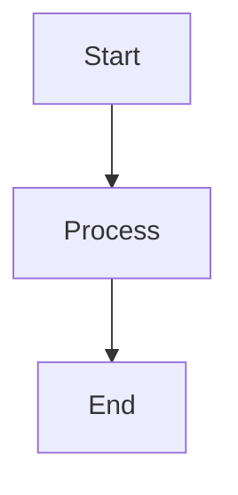
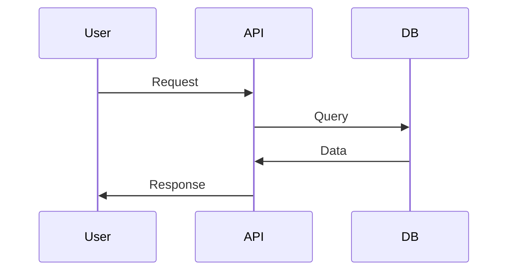

---
# Slidev Feature Demo
theme: seriph
title: 'Slidev Complete Feature Showcase'
author: 'Demo Author'
background: 'https://images.unsplash.com/photo-1506905925346-21bda4d32df4?ixlib=rb-4.0.3'
highlighter: shiki
lineNumbers: true
monaco: dev
download: true
drawings:
  enabled: true
  persist: true
  presenterOnly: false
remoteAssets: true
transition: slide-left
fonts:
  sans: 'Roboto'
  serif: 'Roboto Slab'
  mono: 'Fira Code'
css: unocss
info: |
  ## Comprehensive Slidev Demo
  
  This presentation demonstrates nearly all features of Slidev:
  - Advanced syntax and code blocks
  - Animations and transitions
  - Components and layouts
  - Interactive elements
  - Export capabilities
---

# Slidev Complete Feature Showcase
### The Ultimate Developer Presentation Tool

<div class="absolute bottom-10">
  <span class="font-700">
    Press <kbd>space</kbd> to start the demo journey
  </span>
</div>

<div class="absolute bottom-4 right-4">
  <PoweredBySlidev />
</div>

<!--
Welcome to the complete Slidev feature demonstration!

[click] This presentation showcases nearly every feature available in Slidev

[click] We'll explore code blocks, animations, components, and much more

[click] Use the presenter mode to see these click markers in action
-->

---
layout: center
class: text-center
---

# Table of Contents

<Toc :columns="2" :max-depth="2" />

---
layout: image-right
image: https://images.unsplash.com/photo-1555949963-aa79dcee981c?ixlib=rb-4.0.3
---

# Advanced Code Features
### Line numbers, highlighting, and more

<v-clicks>

- **Global line numbers** enabled
- **Syntax highlighting** with Shiki
- **Line highlighting** and transitions
- **Code importing** from files
- **Monaco editor** integration

</v-clicks>

<v-click at="5">

```ts {2,4-6}{lines:true,startLine:1,maxHeight:'200px'}
// Advanced TypeScript example
interface User {
  name: string
  email: string
  roles: string[]
  createdAt: Date
}

function createUser(data: Partial<User>): User {
  return {
    name: data.name || 'Anonymous',
    email: data.email || '',
    roles: data.roles || ['user'],
    createdAt: new Date()
  }
}

// More code that requires scrolling...
const users: User[] = []
users.push(createUser({ name: 'John', email: 'john@example.com' }))
```

</v-click>

---
layout: default
---

# Code Groups and Syntax Highlighting
### Tabbed code examples with multiple languages

:::code-group

```typescript [user.ts]
interface User {
  name: string
  email: string
}

const user: User = {
  name: 'John Doe',
  email: 'john@example.com'
}

console.log(`Hello, ${user.name}!`)
```

```javascript [user.js]
// JavaScript version
const user = {
  name: 'John Doe',
  email: 'john@example.com'
}

console.log(`Hello, ${user.name}!`)
```

```python [user.py]
# Python version
from dataclasses import dataclass

@dataclass
class User:
    name: str
    email: str

user = User("John Doe", "john@example.com")
print(f"Hello, {user.name}!")
```

:::

<v-click>

### Line Highlighting Animation

```ts {*|1-3|5-8|*}
// Step 1: Basic interface
interface User {
  name: string
}

// Step 2: Add more properties
interface User {
  name: string
  email: string
  age: number
}
```

</v-click>

---
layout: two-cols
---

# Animation Showcase
### Click animations and motion effects

<v-clicks>

- First item appears
- Second item follows
- Third completes the sequence

</v-clicks>

<v-click at="4">

## After Animations

<div v-click>Initial element</div>
<div v-after>Shows after previous</div>
<div v-after>Then this appears</div>
<div v-after>Finally this one</div>

</v-click>

::right::

<v-click at="6">

## Motion Effects

<div
  v-motion
  :initial="{ x: -80, opacity: 0 }"
  :enter="{ x: 0, opacity: 1, transition: { duration: 1000 } }"
  :hovered="{ scale: 1.1 }"
  :click-1="{ y: -20, rotate: 5 }"
  class="bg-blue-500 text-white p-4 rounded-lg cursor-pointer"
>
  Interactive Motion Element
  <br>
  <small>Hover and click me!</small>
</div>

</v-click>

<v-click at="7">

<Transform :scale="0.8" :rotate="15">
  <div class="bg-gradient-to-r from-purple-400 to-pink-400 p-4 rounded-lg text-white">
    🎨 Transformed Content
  </div>
</Transform>

</v-click>

---
layout: center
---

# Built-in Components Gallery

<div class="grid grid-cols-2 gap-8 mt-8">

<div v-click>

### Arrows and Annotations

<div class="relative h-40 bg-gray-100 rounded-lg">
  <Arrow x1="20" y1="20" x2="120" y2="100" color="red" width="3" />
  <div class="absolute top-4 left-6">Start</div>
  <div class="absolute bottom-4 right-6">End</div>
</div>

</div>

<div v-click>

### Auto-fit Text

<div class="h-40 bg-gradient-to-r from-blue-400 to-purple-500 rounded-lg flex items-center justify-center">
  <AutoFitText :max="80" :min="20" class="text-white font-bold">
    This text automatically adjusts its size to fit the container perfectly!
  </AutoFitText>
</div>

</div>

</div>

<div class="mt-8" v-click>

### Theme Switching Component

<LightOrDark>
  <template #dark>
    <div class="bg-gray-800 text-white p-4 rounded-lg">
      🌙 Dark mode content - You're viewing this in dark theme
    </div>
  </template>
  <template #light>
    <div class="bg-white text-gray-800 p-4 rounded-lg border">
      ☀️ Light mode content - You're viewing this in light theme
    </div>
  </template>
</LightOrDark>

</div>

---
layout: default
---

# Interactive Components

<div class="grid grid-cols-2 gap-8">

<div>

## Toggle Switch

<VSwitch :names="['Preview', 'Code']">
  <template #Preview>
    <div class="bg-gradient-to-r from-green-400 to-blue-500 p-6 rounded-lg text-white">
      <h3 class="text-xl font-bold">🎉 Beautiful Preview</h3>
      <p>This is what users see - a polished interface with gradients and styling.</p>
    </div>
  </template>
  <template #Code>
    ```vue
    <template>
      <div class="bg-gradient-to-r from-green-400 to-blue-500 p-6 rounded-lg text-white">
        <h3 class="text-xl font-bold">🎉 Beautiful Preview</h3>
        <p>This is what users see - a polished interface.</p>
      </div>
    </template>
    ```
  </template>
</VSwitch>

</div>

<div v-click>

## Navigation Links

<div class="space-y-4">
  <Link to="1" class="block p-3 bg-blue-100 rounded hover:bg-blue-200 transition-colors">
    🏠 Go to Title Slide
  </Link>
  
  <Link to="10" class="block p-3 bg-green-100 rounded hover:bg-green-200 transition-colors">
    ⚡ Jump to Slide 10
  </Link>
  
  <Link to="https://slidev.dev" external class="block p-3 bg-purple-100 rounded hover:bg-purple-200 transition-colors">
    🌐 Visit Slidev Website
  </Link>
</div>

</div>

</div>

<div class="mt-8" v-click>

## Context-Aware Rendering

<RenderWhen context="main">
  <div class="bg-blue-500 text-white p-4 rounded">
    📺 This only shows in main presentation view
  </div>
</RenderWhen>

<RenderWhen context="presenter">
  <div class="bg-green-500 text-white p-4 rounded">
    🎯 This only shows in presenter mode
  </div>
</RenderWhen>

</div>

---
layout: image-left
image: https://images.unsplash.com/photo-1517180102446-f3ece451e9d8?ixlib=rb-4.0.3
---

# Media Integration
### Videos, images, and social content

<v-click>

## YouTube Integration

<Youtube id="eW7v-2ZKDLA" width="400" height="225" />

</v-click>

<v-click>

## Tweet Embedding

<Tweet id="1390115482657726468" scale="0.7" />

</v-click>

---
layout: center
---

# Mathematical Expressions
### LaTeX support for complex formulas

<v-click>

## Quadratic Formula

$$x = \frac{-b \pm \sqrt{b^2 - 4ac}}{2a}$$

</v-click>

<v-click>

## Matrix Operations

$$
\begin{pmatrix}
a & b \\
c & d
\end{pmatrix}
\begin{pmatrix}
x \\
y
\end{pmatrix}
=
\begin{pmatrix}
ax + by \\
cx + dy
\end{pmatrix}
$$

</v-click>

<v-click>

## Inline Math

The derivative of $f(x) = x^2$ is $f'(x) = 2x$, and the integral is $\int x^2 dx = \frac{x^3}{3} + C$.

</v-click>

---
layout: default
---

# Diagrams with Mermaid

<div class="grid grid-cols-2 gap-8">

<div v-click>

## Simple Flowchart



</div>

<div v-click>

## Basic Sequence



</div>

</div>

<div v-click class="mt-8">

## Git Flow

```mermaid
gitgraph
    commit
    branch feature
    checkout feature
    commit
    checkout main
    merge feature
```

</div>

---
layout: fact
---

# Monaco Editor
## Live code editing in slides

<div v-click>

```typescript {monaco}
interface Product {
  id: number
  name: string
  price: number
  inStock: boolean
}

function calculateTotal(products: Product[]): number {
  return products
    .filter(p => p.inStock)
    .reduce((sum, product) => sum + product.price, 0)
}

// Try editing this code!
const inventory: Product[] = [
  { id: 1, name: "Laptop", price: 999, inStock: true },
  { id: 2, name: "Mouse", price: 25, inStock: false },
  { id: 3, name: "Keyboard", price: 75, inStock: true }
]

console.log(`Total: $${calculateTotal(inventory)}`)
```

</div>

---
layout: two-cols
---

# Custom Styling & UnoCSS

<v-click>

## Utility Classes

<div class="space-y-4">
  <div class="bg-gradient-to-r from-red-500 to-yellow-500 p-4 rounded-lg text-white font-bold">
    Gradient Background
  </div>
  
  <div class="shadow-lg hover:shadow-xl transition-shadow duration-300 p-4 bg-white rounded-lg border">
    Interactive Shadow
  </div>
  
  <div class="transform hover:scale-105 transition-transform duration-200 bg-blue-500 text-white p-4 rounded-lg">
    Hover to Scale
  </div>
</div>

</v-click>

::right::

<v-click>

## Custom Animations

<div class="relative">
  <div class="animate-bounce bg-red-500 w-16 h-16 rounded-full absolute"></div>
  <div class="animate-pulse bg-blue-500 w-16 h-16 rounded-full absolute left-20"></div>
  <div class="animate-spin bg-green-500 w-16 h-16 rounded-square absolute left-40"></div>
</div>

</v-click>

<div v-click class="mt-20">

## Flexbox Layout

<div class="flex justify-between items-center bg-gray-100 p-4 rounded-lg">
  <div class="bg-purple-500 text-white p-2 rounded">Item 1</div>
  <div class="bg-indigo-500 text-white p-2 rounded">Item 2</div>
  <div class="bg-blue-500 text-white p-2 rounded">Item 3</div>
</div>

</div>

---
layout: quote
author: Slidev Documentation
---

"Slidev aims to provide the flexibility and interactivity for developers to make their presentations even more interesting, expressive, and attractive by using the tools and technologies they are already familiar with."

---
layout: center
---

# Slide Information

<div class="text-center space-y-4">

<div class="text-6xl font-bold text-blue-500">
  <SlideCurrentNo />
</div>

<div class="text-xl text-gray-600">
  of <SlidesTotal /> slides
</div>

<div class="mt-8 space-y-2 text-sm text-gray-500">
  <div>🎨 Theme: Seriph</div>
  <div>⚡ Powered by Slidev</div>
  <div>🚀 Built with Vue & Vite</div>
</div>

</div>

---
layout: end
---

# Thank You!
## This concludes our feature showcase

<div class="mt-8 text-center">
  <div class="text-lg mb-4">
    🎯 **Demo Features Covered:**
  </div>
  
  <div class="grid grid-cols-2 gap-4 text-sm">
    <div class="text-left">
      ✅ Advanced code blocks<br>
      ✅ Animations & transitions<br>
      ✅ Built-in components<br>
      ✅ Media integration<br>
      ✅ Mathematical expressions
    </div>
    <div class="text-left">
      ✅ Mermaid diagrams<br>
      ✅ Monaco editor<br>
      ✅ Custom styling<br>
      ✅ Multiple layouts<br>
      ✅ Interactive elements
    </div>
  </div>
</div>

<div class="absolute bottom-4 left-4">
  <Link to="1" class="text-blue-500 hover:text-blue-700">
    🔄 Restart Demo
  </Link>
</div>

<div class="absolute bottom-4 right-4">
  <PoweredBySlidev />
</div>

<!--
Final slide notes:

[click] We've covered nearly every major Slidev feature in this demo

[click] From basic markdown to advanced Monaco editor integration

[click] This presentation serves as both a showcase and reference

[click] You can use these patterns in your own presentations

Thank you for exploring Slidev with us!
-->