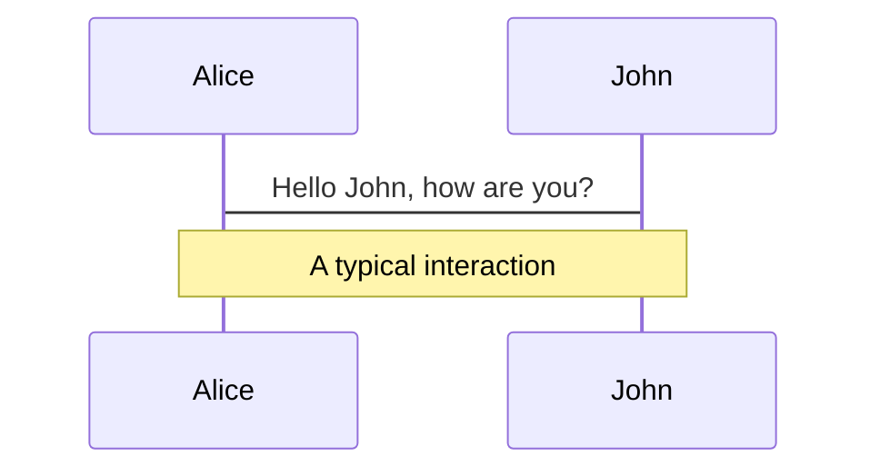
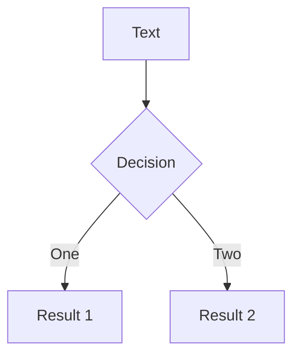
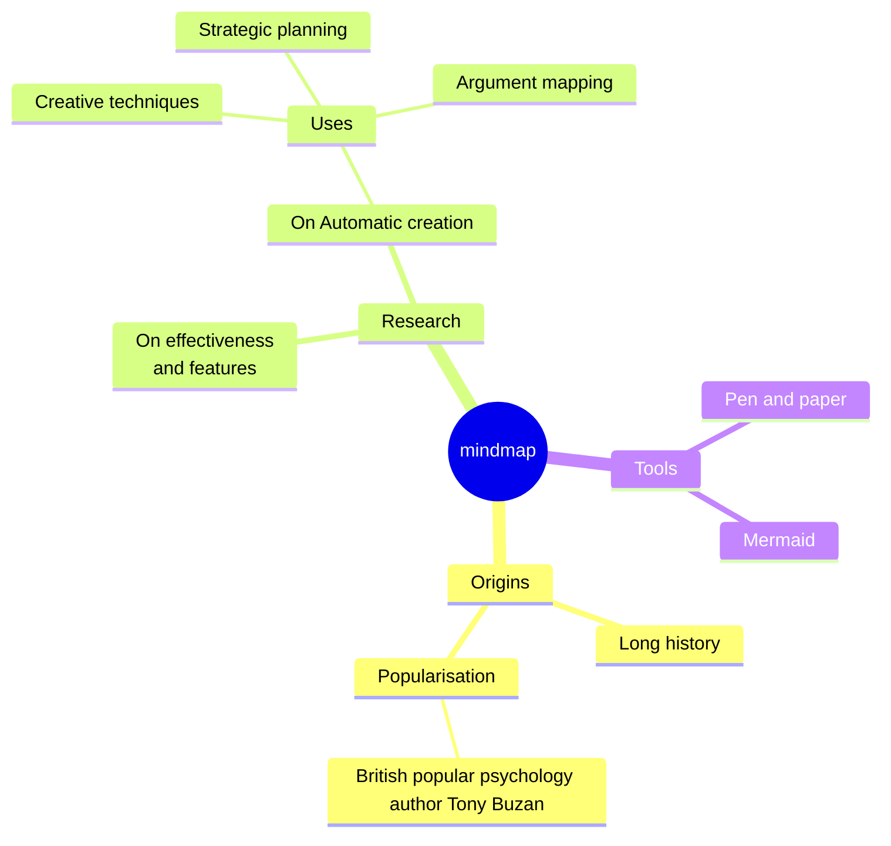
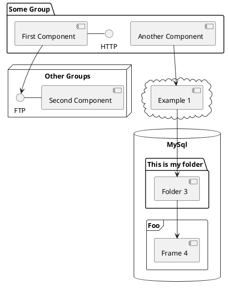

---
# You can also start simply with 'default'
theme: seriph
# random image from a curated Unsplash collection by Anthony
# like them? see https://unsplash.com/collections/94734566/slidev
background: https://cover.sli.dev
# some information about your slides (markdown enabled)
title: Welcome to Slidev
info: |
  ## Slidev Starter Template
  Presentation slides for developers.

  Learn more at [Sli.dev](https://sli.dev)
# apply unocss classes to the current slide
class: text-center
# https://sli.dev/features/drawing
drawings:
  persist: false
# slide transition: https://sli.dev/guide/animations.html#slide-transitions
transition: slide-left
# enable MDC Syntax: https://sli.dev/features/mdc
mdc: true
# open graph
seoMeta:
  # By default, Slidev will use ./og-image.png if it exists,
  # or generate one from the first slide if not found.
  ogImage: auto
  # ogImage: https://cover.sli.dev
---

# Welcome to Slidev

Presentation slides for developers

<div @click="$slidev.nav.next" class="mt-12 py-1" hover:bg="white op-10">
  Press Space for next page <carbon:arrow-right />
</div>

<div class="abs-br m-6 text-xl">
  <button @click="$slidev.nav.openInEditor()" title="Open in Editor" class="slidev-icon-btn">
    <carbon:edit />
  </button>
  <a href="https://github.com/slidevjs/slidev" target="_blank" class="slidev-icon-btn">
    <carbon:logo-github />
  </a>
</div>

<!--
Dr. James: Welcome everyone to this comprehensive introduction to Slidev, the modern slides maker designed specifically for developers. I'm Dr. James, and I'll be joined by my colleague Sarah to walk you through this powerful presentation framework.

Sarah: Hi everyone! I'm Sarah, and together with Dr. James, we'll explore how Slidev transforms the way developers create and deliver presentations. This tool combines the best of web technologies with the simplicity of Markdown.

Dr. James: Let's begin our journey into the world of developer-friendly presentations.
-->

---
transition: fade-out
---

# What is Slidev?

Slidev is a slides maker and presenter designed for developers, consist of the following features

<div v-click="1">

- 📝 **<span v-mark.underline.blue="1">Text-based</span>** - focus on the content with <span v-mark.circle.green="1">Markdown</span>, and then style them later

</div>

<div v-click="2">

- 🎨 **<span v-mark.underline.purple="2">Themable</span>** - themes can be shared and re-used as <span v-mark.circle.orange="2">npm packages</span>

</div>

<div v-click="3">

- 🧑‍💻 **<span v-mark.underline.cyan="3">Developer Friendly</span>** - <span v-mark.circle.red="3">code highlighting</span>, live coding with autocompletion

</div>

<div v-click="4">

- 🤹 **<span v-mark.underline.yellow="4">Interactive</span>** - embed <span v-mark.circle.blue="4">Vue components</span> to enhance your expressions

</div>

<div v-click="5">

- 🎥 **<span v-mark.underline.green="5">Recording</span>** - built-in <span v-mark.circle.purple="5">recording and camera view</span>

</div>

<div v-click="6">

- 📤 **<span v-mark.underline.orange="6">Portable</span>** - export to <span v-mark.circle.cyan="6">PDF, PPTX, PNGs</span>, or even a hostable SPA

</div>

<div v-click="7">

- 🛠 **<span v-mark.underline.red="7">Hackable</span>** - virtually anything that's possible on a <span v-mark.circle.yellow="7">webpage</span> is possible in Slidev

</div>
<br>
<br>

Read more about [Why Slidev?](https://sli.dev/guide/why)

<style>
h1 {
  background-color: #2B90B6;
  background-image: linear-gradient(45deg, #4EC5D4 10%, #146b8c 20%);
  background-size: 100%;
  -webkit-background-clip: text;
  -moz-background-clip: text;
  -webkit-text-fill-color: transparent;
  -moz-text-fill-color: transparent;
}
</style>

<!--
Sarah: Now let me explain what makes Slidev special. Slidev is a revolutionary slides maker and presenter that's specifically designed with developers in mind. Let's explore the key features that set it apart from traditional presentation tools.

[click] Dr. James: First, it's completely text-based - you focus on your content using Markdown, and style it later. This approach aligns perfectly with how developers work with documentation and code.

[click] Sarah: Second, it's highly themable. Themes can be shared and reused as npm packages, making it easy to maintain consistent branding across your organization.

[click] Dr. James: The third feature that developers love is the developer-friendly environment - you get code highlighting, live coding with autocompletion, and all the tools you're already familiar with.

[click] Sarah: Fourth, it's interactive. You can embed Vue components to enhance your expressions and create engaging, dynamic presentations.

[click] Dr. James: Fifth, it has built-in recording and camera view capabilities, perfect for creating video content or live streaming your presentations.

[click] Sarah: Sixth, it's portable. You can export to PDF, PPTX, PNG images, or even create a hostable Single Page Application that works anywhere.

[click] Dr. James: And finally, it's hackable - virtually anything possible on a webpage is possible in your slides. This opens up unlimited creative possibilities for technical presentations.
-->

---
transition: slide-up
level: 2
---

# Navigation

Hover on the <span v-mark.circle.orange="0">bottom-left corner</span> to see the navigation's controls panel, [learn more](https://sli.dev/guide/ui#navigation-bar)

## <span v-mark.underline.blue="0">Keyboard Shortcuts</span>

|                                                     |                             |
| --------------------------------------------------- | --------------------------- |
| <kbd>right</kbd> / <kbd>space</kbd>                 | <span v-mark.circle.green="0">next animation or slide</span>     |
| <kbd>left</kbd>  / <kbd>shift</kbd><kbd>space</kbd> | <span v-mark.circle.purple="0">previous animation or slide</span> |
| <kbd>up</kbd>                                       | previous slide              |
| <kbd>down</kbd>                                     | next slide                  |

<!-- https://sli.dev/guide/animations.html#click-animation -->

<p v-after class="absolute bottom-23 left-45 opacity-30 transform -rotate-10">Here!</p>

<!--
Dr. James: Let's explore how navigation works in Slidev. The interface is designed to be intuitive for developers who are comfortable with keyboard shortcuts.

Sarah: Notice that Slidev provides multiple ways to navigate through your presentation. You can hover on the bottom-left corner to see the navigation controls panel.

Dr. James: The keyboard shortcuts are particularly powerful and familiar. You can use the right arrow key or spacebar to move to the next animation or slide.

Sarah: For going backwards, you use the left arrow key or shift plus spacebar to go to the previous animation or slide.

Dr. James: The up and down arrows provide additional navigation - up takes you to the previous slide, while down moves you to the next slide.

[click] Sarah: And here's a great visual cue!

Dr. James: This arrow points to exactly where you'll find the navigation controls during your presentation.
-->

---
layout: two-cols
layoutClass: gap-16
---

# Table of contents

<div v-click="1">

You can use the `Toc` component to generate a table of contents for your slides:

</div>

<div v-click="2">

```html
<Toc minDepth="1" maxDepth="1" />
```

</div>

<div v-click="3">

The title will be inferred from your slide content, or you can override it with `title` and `level` in your frontmatter.

</div>

::right::

<div v-click="4">

<Toc text-sm minDepth="1" maxDepth="2" />

</div>

<!--
Sarah: Here we have a practical demonstration of Slidev's Table of Contents component. This is a built-in component that automatically generates a structured overview of your presentation.

[click] Dr. James: The TOC component is incredibly easy to use. You simply include it in your slides like any other component.

[click] Sarah: Here's the basic syntax - you can control the minimum and maximum depth of headers it displays. This example shows a simple configuration for displaying only top-level headers.

[click] Dr. James: What's particularly useful is that titles are automatically inferred from your slide content, but you can also override them using the title and level properties in your frontmatter. This gives you complete control over how your presentation structure is displayed.

[click] Sarah: And here's the actual table of contents in action! The two-column layout we're using demonstrates Slidev's flexible layout system, making efficient use of screen space while maintaining readability and automatically staying in sync with your content.
-->

---
layout: image-right
image: https://cover.sli.dev
---

# Code

Use code snippets and get the highlighting directly, and even types hover!

```ts [filename-example.ts] {all|4|6|6-7|9|all} twoslash
// TwoSlash enables TypeScript hover information
// and errors in markdown code blocks
// More at https://shiki.style/packages/twoslash
import { computed, ref } from 'vue'

const count = ref(0)
const doubled = computed(() => count.value * 2)

doubled.value = 2
```

<arrow v-click="[4, 5]" x1="350" y1="310" x2="195" y2="342" color="#953" width="2" arrowSize="1" />

<!-- This allow you to embed external code blocks -->
<<< @/snippets/external.ts#snippet

<!-- Footer -->

[Learn more](https://sli.dev/features/line-highlighting)

<!-- Inline style -->
<style>
.footnotes-sep {
  @apply mt-5 opacity-10;
}
.footnotes {
  @apply text-sm opacity-75;
}
.footnote-backref {
  display: none;
}
</style>

<!--
Dr. James: Now let's dive into one of Slidev's most powerful features - advanced code presentation. This is where Slidev truly shines for developer presentations.

Sarah: What you're seeing here is syntax highlighting powered by Shiki, which provides the same highlighting engine used by VS Code. This ensures your code looks exactly as it would in your development environment.

Dr. James: But it gets even better. Notice how we can highlight specific lines and create step-by-step code explanations. Let me walk you through this TypeScript example.

Sarah: First, we see the complete code block. This gives your audience the full context of what we're working with.

[click] Dr. James: Now we're highlighting line 4, where we import the computed function from Vue. This selective highlighting helps focus attention on specific parts of your code.

[click] Sarah: Next, we highlight line 6, which shows the ref declaration. This technique is perfect for explaining code step by step.

[click] Dr. James: Now we're looking at lines 6 and 7 together, showing both the ref declaration and the computed property. This demonstrates how related lines can be grouped together.

[click] Sarah: Here we highlight line 9, which attempts to assign to a computed property - this is actually an error case, perfect for teaching scenarios. 

Dr. James: And here's a fantastic feature - we can add interactive arrows that appear at specific click points to point out important details in the code.

[click] Sarah: This level of interactivity transforms static code examples into engaging, educational experiences.
-->

---
level: 2
---

# Shiki Magic Move

Powered by [shiki-magic-move](https://shiki-magic-move.netlify.app/), Slidev supports animations across multiple code snippets.

Add multiple code blocks and wrap them with <code>````md magic-move</code> (four backticks) to enable the magic move. For example:

````md magic-move {lines: true}
```ts {*|2|*}
// step 1
const author = reactive({
  name: 'John Doe',
  books: [
    'Vue 2 - Advanced Guide',
    'Vue 3 - Basic Guide',
    'Vue 4 - The Mystery'
  ]
})
```

```ts {*|1-2|3-4|3-4,8}
// step 2
export default {
  data() {
    return {
      author: {
        name: 'John Doe',
        books: [
          'Vue 2 - Advanced Guide',
          'Vue 3 - Basic Guide',
          'Vue 4 - The Mystery'
        ]
      }
    }
  }
}
```

```ts
// step 3
export default {
  data: () => ({
    author: {
      name: 'John Doe',
      books: [
        'Vue 2 - Advanced Guide',
        'Vue 3 - Basic Guide',
        'Vue 4 - The Mystery'
      ]
    }
  })
}
```

Non-code blocks are ignored.

```vue
<!-- step 4 -->
<script setup>
const author = {
  name: 'John Doe',
  books: [
    'Vue 2 - Advanced Guide',
    'Vue 3 - Basic Guide',
    'Vue 4 - The Mystery'
  ]
}
</script>
```
````

<!--
Sarah: This next feature is absolutely amazing - Shiki Magic Move. It allows you to create seamless animated transitions between different code snippets. Here we start with our first code example - a reactive author object using Vue's reactive function. Notice how all the code is highlighted to show the complete structure.

[click] Dr. James: Now we're focusing on line 2, highlighting the name property. This selective highlighting helps draw attention to specific parts of the code transformation.

[click] Sarah: Back to showing the full first code block. This gives context before we move to the next transformation step.

[click] Dr. James: Watch this magic! The code seamlessly transforms into a traditional Vue options API format. The magic-move feature automatically detects similarities and creates smooth transitions between the reactive function and the data option.

[click] Sarah: Now we're highlighting lines 1-2, showing the export default and data function declaration. Notice how the animation smoothly moves elements from their previous positions.

[click] Dr. James: Here we focus on lines 3-4, highlighting the return statement and the author object structure. The transitions maintain visual continuity even as the code structure changes.

[click] Sarah: This step highlights both the object structure (lines 3-4) and line 8, showing how the same data is represented in different syntactic forms. The magic move keeps related elements visually connected.

[click] Dr. James: Now we transform to the modern arrow function syntax! This shows how the same data can be represented with concise arrow function syntax.

[click] Sarah: And finally, we reach the ultimate transformation - Vue 3's script setup syntax! From reactive composition API to options API to arrow functions, and now to the most modern approach with script setup. This demonstrates how Shiki Magic Move can tell a complete story of code evolution in a visually stunning way, showing the progression of Vue development patterns over time.
-->

---

# Components

<div grid="~ cols-2 gap-4">
<div>

You can use <span v-mark.underline.blue="0">Vue components</span> directly inside your slides.

<div v-click="1">

We have provided a few built-in components like <span v-mark.circle.green="1">`<Tweet/>`</span> and <span v-mark.circle.purple="1">`<Youtube/>`</span> that you can use directly. And adding your custom components is also super easy.

</div>

<div v-click="2">

```html
<Counter :count="10" />
```

<!-- ./components/Counter.vue -->
<Counter :count="10" m="t-4" />

</div>

<div v-click="3">

Check out [the guides](https://sli.dev/builtin/components.html) for more.

</div>

</div>
<div>

<div v-click="4">

```html
<Tweet id="1390115482657726468" />
```

</div>

<div v-click="5">

<Tweet id="1390115482657726468" scale="0.65" />

</div>

</div>
</div>

<!--
Dr. James: Now let's explore Slidev's component system. One of the most powerful aspects of Slidev is that you can use Vue components directly inside your slides.

[click] Sarah: We've provided several built-in components that you can use immediately, like Tweet and Youtube components. But what's really exciting is how easy it is to create your own custom components.

[click] Dr. James: Here we see a practical example - this Counter component is a fully interactive Vue component running right in the slide. The component takes a count prop and displays it with full reactivity.

[click] Sarah: You can create components for data visualizations, interactive demos, mini-applications, or any custom functionality your presentation needs. Check out the guides for more detailed examples.

[click] Dr. James: And here's the Tweet component in action. First, we see the code syntax for embedding a tweet.

[click] Sarah: Then the actual tweet appears in the presentation! This approach makes your presentations not just informative, but truly interactive and engaging for your audience. The only limit is your imagination.
-->

---
class: px-20
---

# Themes

Slidev comes with powerful <span v-mark.underline.blue="0">theming support</span>. Themes can provide styles, layouts, components, or even configurations for tools. 

<div v-click="1">

Switching between themes by just **<span v-mark.circle.red="1">one edit</span>** in your frontmatter:

</div>

<div grid="~ cols-2 gap-2" m="t-2">

<div v-click="2">

```yaml
---
theme: default
---
```

</div>

<div v-click="3">

```yaml
---
theme: seriph
---
```

</div>

<div v-click="4">


</div>

<div v-click="5">


</div>

</div>

<div v-click="6">

Read more about [How to use a theme](https://sli.dev/guide/theme-addon#use-theme) and
check out the [Awesome Themes Gallery](https://sli.dev/resources/theme-gallery).

</div>

<!--
Sarah: Theming in Slidev is incredibly powerful and developer-friendly. Themes can provide styles, layouts, components, or even configurations for tools.

[click] Dr. James: The beauty is in its simplicity - switching between themes is as easy as changing one line in your frontmatter.

[click] Sarah: Here's the default theme configuration. Just specify which theme you want to use in your frontmatter.

[click] Dr. James: And here's how you switch to the Seriph theme - it's literally just changing one word!

[click] Sarah: The visual difference is striking! Here's what the same content looks like with the default theme - clean and minimalist.

[click] Dr. James: And here's the Seriph theme providing a more elegant, serif-based design. The same content, completely different visual experience.

[click] Sarah: What's particularly exciting is that themes can provide more than just styling - they can include custom layouts, components, and tool configurations. The theme ecosystem is growing rapidly, and for organizations, you can create a company theme once and use it across all presentations for consistent branding.
-->

---

# Clicks Animations

You can add `v-click` to elements to add a click animation.

<div v-click>

This shows up when you click the slide:

```html
<div v-click>This shows up when you click the slide.</div>
```

</div>

<br>

<v-click>

The <span v-mark.red="3"><code>v-mark</code> directive</span>
also allows you to add
<span v-mark.circle.orange="4">inline marks</span>
, powered by [Rough Notation](https://roughnotation.com/):

```html
<span v-mark.underline.orange>inline markers</span>
```

</v-click>

<div mt-20 v-click>

[Learn more](https://sli.dev/guide/animations#click-animation)

</div>

<!--
Dr. James: Click animations are one of the most engaging features of Slidev. They allow you to control exactly when elements appear, creating a narrative flow that guides your audience through your content.

Sarah: Let me demonstrate the different types of click animations available.

[click] Dr. James: First, we have the basic v-click directive. This makes elements appear with a simple click, perfect for revealing information progressively.

[click] Sarah: Next, we see the v-mark directive in action. This allows you to add inline annotations and highlights that appear at specific click points.

[click] Dr. James: The v-mark directive supports different styles - you can create underlines, circles, boxes, and other annotations powered by Rough Notation.

[click] Sarah: These animations help maintain audience attention by revealing information at the right moment, preventing cognitive overload and creating a more engaging presentation experience.
-->

---

# Motions

Motion animations are powered by [@vueuse/motion](https://motion.vueuse.org/), triggered by `v-motion` directive.

```html
<div
  v-motion
  :initial="{ x: -80 }"
  :enter="{ x: 0 }"
  :click-3="{ x: 80 }"
  :leave="{ x: 1000 }"
>
  Slidev
</div>
```

<div class="w-60 relative">
  <div class="relative w-40 h-40">
    
    
    
  </div>

  <div
    class="text-5xl absolute top-14 left-40 text-[#2B90B6] -z-1"
    v-motion
    :initial="{ x: -80, opacity: 0}"
    :enter="{ x: 0, opacity: 1, transition: { delay: 2000, duration: 1000 } }">
    Slidev
  </div>
</div>

<!-- vue script setup scripts can be directly used in markdown, and will only affects current page -->
<script setup lang="ts">
const final = {
  x: 0,
  y: 0,
  rotate: 0,
  scale: 1,
  transition: {
    type: 'spring',
    damping: 10,
    stiffness: 20,
    mass: 2
  }
}
</script>

<div
  v-motion
  :initial="{ x:35, y: 30, opacity: 0}"
  :enter="{ y: 0, opacity: 1, transition: { delay: 3500 } }">

[Learn more](https://sli.dev/guide/animations.html#motion)

</div>

<!--
Sarah: Motion animations take Slidev presentations to the next level. They're powered by @vueuse/motion and triggered by the v-motion directive.

Dr. James: What you're seeing here is a complex choreographed animation where multiple elements move simultaneously. Each logo starts from a different position and animates into place with different timing and physics properties.

Sarah: The beauty of this system is in its flexibility. You can define initial states, enter animations, click-triggered animations, hover effects, and even exit animations.

Dr. James: Notice how we use spring physics for the animations - with damping, stiffness, and mass properties. This creates natural, smooth movements that feel organic rather than mechanical.

Sarah: The delayed text animation that appears after all the logos have settled demonstrates how you can create complex timing sequences. This level of control allows you to create truly cinematic presentations.

Dr. James: Motion animations are perfect for product demos, explaining complex concepts with visual metaphors, or simply adding that extra layer of polish that makes your presentations memorable.
-->

---

# LaTeX

LaTeX is supported out-of-box. Powered by [KaTeX](https://katex.org/).

<div h-3 />

Inline $\sqrt{3x-1}+(1+x)^2$

Block
$$ {1|3|all}
\begin{aligned}
\nabla \cdot \vec{E} &= \frac{\rho}{\varepsilon_0} \\
\nabla \cdot \vec{B} &= 0 \\
\nabla \times \vec{E} &= -\frac{\partial\vec{B}}{\partial t} \\
\nabla \times \vec{B} &= \mu_0\vec{J} + \mu_0\varepsilon_0\frac{\partial\vec{E}}{\partial t}
\end{aligned}
$$

[Learn more](https://sli.dev/features/latex)

<!--
Dr. James: Mathematical expressions are handled beautifully in Slidev through LaTeX support, powered by KaTeX. This is essential for technical and scientific presentations. You can include both inline math expressions and block-level equations. Here we see the first Maxwell equation - Gauss's law for electricity - being highlighted to start our mathematical demonstration.

[click] Sarah: Now we jump to the third equation - Faraday's law of electromagnetic induction. This selective revelation allows you to focus on specific equations without showing the complete set, perfect for building mathematical concepts step by step.

[click] Dr. James: Finally, we reveal the complete set of Maxwell's equations! This progressive disclosure technique is particularly powerful when explaining complex mathematical relationships. The LaTeX rendering is production-quality, ensuring your mathematical content looks professional and is easily readable by your audience.
-->

---

# Diagrams

You can create <span v-mark.underline.blue="0">diagrams / graphs</span> from <span v-mark.circle.green="0">textual descriptions</span>, directly in your Markdown.

<div class="grid grid-cols-4 gap-5 pt-4 -mb-6">

<div v-click="1">



</div>

<div v-click="2">



</div>

<div v-click="3">



</div>

<div v-click="4">



</div>

</div>

Learn more: [Mermaid Diagrams](https://sli.dev/features/mermaid) and [PlantUML Diagrams](https://sli.dev/features/plantuml)

<!--
Sarah: Diagrams are incredibly valuable for technical presentations, and Slidev makes them effortless through its integration with Mermaid and PlantUML. What's amazing is that these diagrams are created from textual descriptions directly in your Markdown - no external tools needed!

[click] Dr. James: Let's start with sequence diagrams. These show the flow of communication between different actors in a system, perfect for API documentation or system architecture presentations. Notice how clean and professional it looks with automatic layout.

[click] Sarah: Next, we have flowcharts that demonstrate decision trees and process flows. This example shows a simple decision tree with conditional branches, automatically styled and beautifully rendered.

[click] Dr. James: Here's a mindmap format, excellent for brainstorming sessions or showing relationships between different concepts. You can even include icons to make them more visually appealing, as you can see with the book icon.

[click] Sarah: And finally, PlantUML diagrams for component relationships and system architecture. This example shows packages, nodes, databases, and their interconnections - perfect for software design presentations and technical documentation.

Dr. James: The best part is that all these diagrams are version-controlled with your slides and always stay in sync with your content.
-->

---
foo: bar
dragPos:
  square: 584,-4,167,_,-16
---

# Draggable Elements

<div v-click="1">

Double-click on the draggable elements to edit their positions.

</div>

<br>

<div v-click="2">

###### Directive Usage

```md

```

</div>

<br>

<div v-click="3">

###### Component Usage

```md
<v-drag text-3xl>
  <div class="i-carbon:arrow-up" />
  Use the `v-drag` component to have a draggable container!
</v-drag>
```

</div>

<div v-click="4">

<v-drag pos="663,206,261,_,-15">
  <div text-center text-3xl border border-main rounded>
    Double-click me!
  </div>
</v-drag>


</div>

<div v-click="5">

###### Draggable Arrow

```md
<v-drag-arrow two-way />
```

</div>

<div v-click="6">

<v-drag-arrow pos="67,452,253,46" two-way op70 />

</div>

<!--
Dr. James: Draggable elements add an interactive dimension to your presentations. This feature is particularly useful for workshops or collaborative sessions.

[click] Sarah: The key feature is that double-clicking on any draggable element allows you to edit its position in real-time. This is perfect for creating custom layouts or adjusting visual elements during your presentation.

[click] Dr. James: Here's the directive usage - you can apply the v-drag directive to any element, like this image. Just give it an identifier and it becomes draggable.

[click] Sarah: For more complex scenarios, you can use the v-drag component. This allows you to create draggable containers with any content inside, perfect for interactive demonstrations.

[click] Dr. James: And here are the actual draggable elements in action! You can double-click on either the box or the Slidev logo to reposition them. This opens up possibilities for creating engaging, hands-on demonstrations.

[click] Sarah: There are also specialized draggable arrows for creating custom diagrams. Here's the syntax for creating bidirectional arrows.

[click] Dr. James: And here's the draggable arrow itself! These are particularly useful for highlighting relationships between different parts of your content. All these interactive elements can be repositioned during live demonstrations, making your presentations more dynamic and adaptable.
-->

---
src: ./pages/imported-slides.md
hide: false
---

---

# Monaco Editor

Slidev provides built-in Monaco Editor support.

<div v-click="1">

Add `{monaco}` to the code block to turn it into an editor:

</div>

<div v-click="2">

```ts {monaco}
import { ref } from 'vue'
import { emptyArray } from './external'

const arr = ref(emptyArray(10))
```

</div>

<div v-click="3">

Use `{monaco-run}` to create an editor that can execute the code directly in the slide:

</div>

<div v-click="4">

```ts {monaco-run}
import { version } from 'vue'
import { emptyArray, sayHello } from './external'

sayHello()
console.log(`vue ${version}`)
console.log(emptyArray<number>(10).reduce(fib => [...fib, fib.at(-1)! + fib.at(-2)!], [1, 1]))
```

</div>

<!--
Sarah: The Monaco Editor integration brings the full power of VS Code directly into your slides. This is revolutionary for coding presentations and workshops.

[click] Dr. James: The basic integration is incredibly simple - just add the monaco directive to any code block and it becomes a fully functional code editor with syntax highlighting, IntelliSense, and error detection.

[click] Sarah: Here's the first example in action! This is a fully functional code editor running inside the slide. Your audience can interact with the code, modify it, and see immediate feedback. Perfect for code reviews or explaining complex algorithms step by step.

[click] Dr. James: But it gets even better! The monaco-run variant can execute the code directly in the slide, bringing your examples to life with real-time execution.

[click] Sarah: And here's the executable editor! Your audience can see the output in real-time as they or you modify the code. This transforms static code examples into interactive learning experiences where students can experiment, test different approaches, and immediately see the results. For workshops and coding tutorials, this eliminates the need to switch between your presentation and a separate code editor.
-->

---
layout: center
class: text-center
---

# Learn More

[Documentation](https://sli.dev) · [GitHub](https://github.com/slidevjs/slidev) · [Showcases](https://sli.dev/resources/showcases)

<PoweredBySlidev mt-10 />

<!--
Sarah: And that brings us to the end of our comprehensive tour of Slidev's capabilities.

Dr. James: We've covered everything from basic Markdown syntax to advanced interactive components, from simple animations to complex motion graphics, from mathematical expressions to live code editing.

Sarah: The documentation at sli.dev provides extensive guides and examples for everything we've demonstrated today. The GitHub repository is actively maintained and welcomes community contributions.

Dr. James: The showcases section demonstrates real-world presentations created with Slidev, giving you inspiration for your own projects.

Sarah: What makes Slidev special is how it combines the simplicity developers love in Markdown with the power and interactivity of modern web technologies.

Dr. James: Whether you're giving a technical talk, conducting a workshop, teaching a course, or presenting to stakeholders, Slidev provides the tools to create engaging, professional presentations.

Sarah: Thank you for joining us on this journey through Slidev. We hope you're inspired to create your own amazing presentations with this powerful framework.

Dr. James: Happy presenting, and remember - with Slidev, your next presentation can be as interactive and engaging as you imagine it to be.
-->
